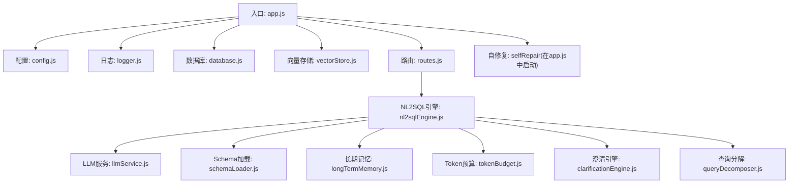
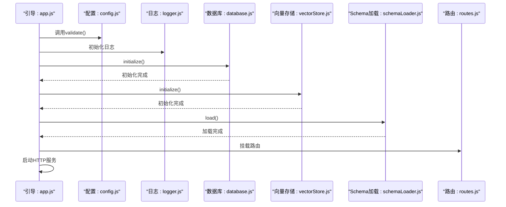
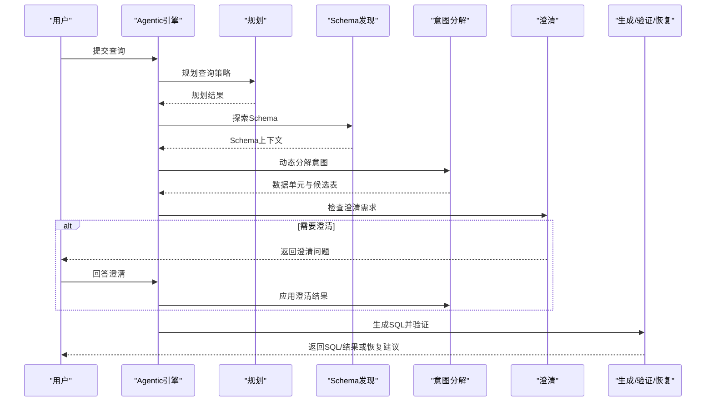
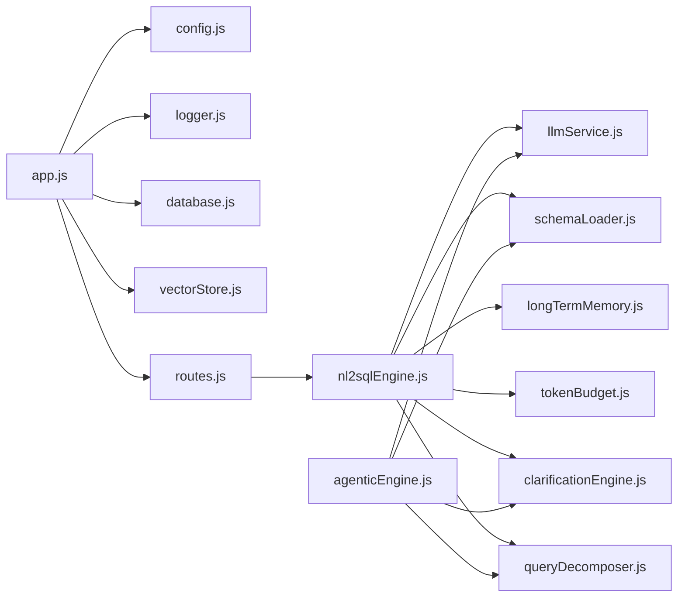

# 后端核心服务

<cite>
**本文引用的文件**
- [app.js](file://backend/src/app.js)
- [package.json](file://backend/package.json)
- [nl2sqlEngine.js](file://backend/src/core/nl2sqlEngine.js)
- [agenticEngine.js](file://backend/src/core/agenticEngine.js)
- [routes.js](file://backend/src/core/routes.js)
- [llmService.js](file://backend/src/core/llmService.js)
- [config.js](file://backend/src/core/config.js)
- [logger.js](file://backend/src/utils/logger.js)
- [vectorStore.js](file://backend/src/memory/vectorStore.js)
- [schemaLoader.js](file://backend/src/core/schemaLoader.js)
- [database.js](file://backend/src/core/database.js)
- [longTermMemory.js](file://backend/src/memory/longTermMemory.js)
- [tokenBudget.js](file://backend/src/utils/tokenBudget.js)
- [clarificationEngine.js](file://backend/src/core/clarificationEngine.js)
- [queryDecomposer.js](file://backend/src/core/queryDecomposer.js)
</cite>

## 目录
1. [简介](#简介)
2. [项目结构](#项目结构)
3. [核心组件](#核心组件)
4. [架构总览](#架构总览)
5. [详细组件分析](#详细组件分析)
6. [依赖分析](#依赖分析)
7. [性能考量](#性能考量)
8. [故障排查指南](#故障排查指南)
9. [结论](#结论)
10. [附录](#附录)

## 简介
本技术文档面向NL2SQL后端核心服务，系统性阐述服务的整体架构、启动流程、模块初始化顺序与依赖关系，深入解析NL2SQL引擎的四阶段Agent工作流、意图识别与SQL生成算法，以及LLM服务集成方式（提示词工程、Token管理与性能优化）。同时提供RESTful API路由设计规范、请求响应格式与错误处理机制，并给出可直接定位到源码位置的示例路径，帮助开发者快速理解与扩展后端功能。

## 项目结构
后端采用模块化分层设计，核心模块位于backend/src目录下，包含核心引擎、内存与向量存储、工具与日志、配置与数据库等子模块。入口文件为app.js，负责加载环境变量、初始化各模块、挂载路由并启动HTTP服务。

图表来源
- [app.js:97-194](file://backend/src/app.js#L97-L194)
- [config.js:16-398](file://backend/src/core/config.js#L16-L398)
- [routes.js:1-1037](file://backend/src/core/routes.js#L1-L1037)

章节来源
- [app.js:1-266](file://backend/src/app.js#L1-L266)
- [package.json:1-28](file://backend/package.json#L1-L28)

## 核心组件
- 启动与初始化：app.js负责加载dotenv、创建Express应用、配置中间件、挂载路由、初始化SQLite与LanceDB、加载Schema与业务语义层、启动自修复调度器，并监听端口。
- 配置中心：config.js集中管理LLM、Embedding、数据库、安全、会话、日志、自修复、Schema、长期记忆、上下文管理与评估等配置项，并提供validate方法校验关键配置。
- 日志系统：logger.js提供多级别日志、结构化输出、文件轮转与追踪上下文能力，支持trace、debug、info、warn、error。
- 数据库：database.js基于sqlite3实现SQLite数据库初始化、表结构创建、迁移与CRUD操作。
- 向量存储：vectorStore.js基于LanceDB实现Schema与查询历史的向量存储、语义检索与智能重排序。
- LLM服务：llmService.js封装HTTP请求、重试机制、Chat与Embedding调用、流式响应支持与错误处理。
- NL2SQL引擎：nl2sqlEngine.js实现意图识别、实体解析、表推断、SQL生成、验证与错误处理。
- Agent引擎：agenticEngine.js实现四阶段Agent工作流（规划→Schema发现→意图分解→澄清→生成/验证/恢复）。
- 查询分解：queryDecomposer.js将复杂查询动态拆解为数据需求单元并检索相关表。
- 澄清引擎：clarificationEngine.js检测澄清需求、生成澄清问题并应用用户回答。
- 长期记忆：longTermMemory.js提取并存储用户偏好（查询模式、字段别名、指标/维度偏好）。
- Token预算：tokenBudget.js估算与压缩上下文，防止LLM上下文溢出。

章节来源
- [app.js:97-194](file://backend/src/app.js#L97-L194)
- [config.js:16-398](file://backend/src/core/config.js#L16-L398)
- [logger.js:54-482](file://backend/src/utils/logger.js#L54-L482)
- [database.js:206-267](file://backend/src/core/database.js#L206-L267)
- [vectorStore.js:233-263](file://backend/src/memory/vectorStore.js#L233-L263)
- [llmService.js:41-152](file://backend/src/core/llmService.js#L41-L152)
- [nl2sqlEngine.js:16-58](file://backend/src/core/nl2sqlEngine.js#L16-L58)
- [agenticEngine.js:52-178](file://backend/src/core/agenticEngine.js#L52-L178)
- [queryDecomposer.js:38-70](file://backend/src/core/queryDecomposer.js#L38-L70)
- [clarificationEngine.js:196-232](file://backend/src/core/clarificationEngine.js#L196-L232)
- [longTermMemory.js:299-461](file://backend/src/memory/longTermMemory.js#L299-L461)
- [tokenBudget.js:115-181](file://backend/src/utils/tokenBudget.js#L115-L181)

## 架构总览
后端服务采用“入口引导 + 模块化核心 + 插件式扩展”的架构。启动流程严格遵循依赖顺序，确保数据库与向量存储就绪后再加载Schema与业务语义层，随后启动HTTP服务与SSE。核心引擎通过LLM服务与向量存储协同完成意图识别、表检索、SQL生成与验证，配合长期记忆与Token预算保障交互体验与稳定性。

图表来源
- [app.js:97-194](file://backend/src/app.js#L97-L194)
- [config.js:366-398](file://backend/src/core/config.js#L366-L398)
- [database.js:206-267](file://backend/src/core/database.js#L206-L267)
- [vectorStore.js:233-263](file://backend/src/memory/vectorStore.js#L233-L263)
- [schemaLoader.js:75-131](file://backend/src/core/schemaLoader.js#L75-L131)
- [routes.js:72-94](file://backend/src/core/routes.js#L72-L94)

## 详细组件分析

### 启动与初始化流程
- 环境变量加载：通过dotenv读取.env配置到process.env。
- Express中间件：启用CORS与body-parser，限制请求体大小。
- 路由挂载：将所有API路由挂载到/api前缀。
- 初始化顺序：
  1) 验证配置
  2) 确保数据目录存在
  3) 初始化SQLite数据库
  4) 初始化LanceDB向量数据库
  5) 加载Schema元数据
  6) 加载业务语义层（可选）
  7) 打印功能开关状态
  8) 启动自修复调度器
  9) 启动HTTP服务器

章节来源
- [app.js:15-194](file://backend/src/app.js#L15-L194)

### 配置管理
- 集中配置：LLM API、Embedding、数据库、安全白名单、会话、日志、自修复、Schema、长期记忆、上下文管理、评估等。
- 校验机制：validate方法检查LLM API密钥与SR数据库URL等关键配置。
- 环境变量覆盖：所有配置均可通过环境变量覆盖。

章节来源
- [config.js:16-398](file://backend/src/core/config.js#L16-L398)

### 日志系统
- 多级别日志：trace、debug、info、warn、error。
- 文件轮转：按大小轮转，支持控制台与文件输出。
- 追踪上下文：支持trace、step、endTrace，便于调试NL2SQL流程。

章节来源
- [logger.js:54-482](file://backend/src/utils/logger.js#L54-L482)

### 数据库与迁移
- SQLite初始化：创建sessions、messages、query_history、user_preferences、system_logs等表。
- 外键约束：启用PRAGMA foreign_keys。
- 迁移：修复旧表结构（如UNIQUE约束）、清理重复偏好记录、修正错误映射。

章节来源
- [database.js:206-404](file://backend/src/core/database.js#L206-L404)

### 向量存储与Schema向量化
- LanceDB连接：初始化schema_vectors与query_vectors表。
- Schema向量化：表级表征（包含域、类型、功能、特征词），支持增量更新与智能搜索。
- 智能搜索：结合查询意图（游戏名、平台类型）与元数据过滤进行重排序。

章节来源
- [vectorStore.js:233-263](file://backend/src/memory/vectorStore.js#L233-L263)
- [schemaLoader.js:210-285](file://backend/src/core/schemaLoader.js#L210-L285)

### LLM服务集成
- HTTP封装：统一的httpPost实现，支持超时、重试、流式响应与错误解析。
- 重试机制：withRetry提供最大重试次数与延迟。
- Chat与Embedding：simpleChat与getEmbedding，支持系统提示词与工具定义。
- 错误处理：记录详细错误信息与响应体，便于诊断。

章节来源
- [llmService.js:41-152](file://backend/src/core/llmService.js#L41-L152)
- [llmService.js:222-308](file://backend/src/core/llmService.js#L222-L308)
- [llmService.js:369-424](file://backend/src/core/llmService.js#L369-L424)

### NL2SQL引擎（核心）
- 统一错误类：NL2SQLError提供结构化错误信息与可恢复标记。
- 实体解析：支持游戏、渠道、平台等实体映射，结合长期记忆与数据库模糊匹配。
- 表推断：关键词匹配与向量检索结合，支持高频核心表回退。
- SQL生成与验证：基于提示词与Schema生成SQL，进行基本语法与安全检查。
- 长期记忆：学习字段别名、查询模式、指标/维度偏好，异步存储与去重。

章节来源
- [nl2sqlEngine.js:227-297](file://backend/src/core/nl2sqlEngine.js#L227-L297)
- [nl2sqlEngine.js:311-365](file://backend/src/core/nl2sqlEngine.js#L311-L365)
- [nl2sqlEngine.js:104-151](file://backend/src/core/nl2sqlEngine.js#L104-L151)
- [nl2sqlEngine.js:311-629](file://backend/src/core/nl2sqlEngine.js#L311-L629)
- [longTermMemory.js:299-461](file://backend/src/memory/longTermMemory.js#L299-L461)

### 四阶段Agent工作流
- 阶段1：规划与Schema发现（Plan + Tool-Augmented Schema Discovery）
- 阶段2：动态意图分解（Dynamic Intent Decomposition）
- 阶段3：澄清与确认（Clarification + Confirmation）
- 阶段4：生成、验证与恢复（Generation + Verification + Recovery）

图表来源
- [agenticEngine.js:68-178](file://backend/src/core/agenticEngine.js#L68-L178)
- [agenticEngine.js:345-433](file://backend/src/core/agenticEngine.js#L345-L433)
- [agenticEngine.js:516-611](file://backend/src/core/agenticEngine.js#L516-L611)

章节来源
- [agenticEngine.js:52-178](file://backend/src/core/agenticEngine.js#L52-L178)

### 查询分解与表检索
- 动态分解：将复杂查询拆解为数据需求单元，类型由LLM动态确定。
- 表检索：基于数据单元关键词与描述，结合Schema向量检索与关键词匹配，合并候选表并排序推荐。

章节来源
- [queryDecomposer.js:38-70](file://backend/src/core/queryDecomposer.js#L38-L70)
- [queryDecomposer.js:255-298](file://backend/src/core/queryDecomposer.js#L255-L298)

### 澄清引擎
- 触发条件：数据单元无匹配表、表选择歧义、聚合指标来源不明确、时间粒度不明确、低置信度。
- 生成澄清：基于LLM生成友好问题与选项，支持默认推荐。
- 应用澄清：根据用户回答更新分解结果并记录澄清历史。

章节来源
- [clarificationEngine.js:196-232](file://backend/src/core/clarificationEngine.js#L196-L232)
- [clarificationEngine.js:246-272](file://backend/src/core/clarificationEngine.js#L246-L272)
- [clarificationEngine.js:388-426](file://backend/src/core/clarificationEngine.js#L388-L426)

### Token预算管理
- 估算：基于字符数保守估算（约3.5字符/Token）。
- 预算：计算系统提示词、历史对话、检索片段的Token占用，预留输出空间。
- 压缩：裁剪历史对话、压缩检索片段、进一步裁剪以避免超限。

章节来源
- [tokenBudget.js:57-69](file://backend/src/utils/tokenBudget.js#L57-L69)
- [tokenBudget.js:115-181](file://backend/src/utils/tokenBudget.js#L115-L181)
- [tokenBudget.js:315-372](file://backend/src/utils/tokenBudget.js#L315-L372)

### API路由设计与错误处理
- 健康检查：/api/health与/api/health/detail，返回服务状态、组件状态与内存使用。
- Schema接口：/api/schema、/api/schema/tables/:tableName、/api/schema/search。
- 会话管理：/api/sessions、/api/sessions/:sessionId、/api/sessions/:sessionId/messages、/api/users/:userId/sessions。
- 查询历史：/api/queries/history。
- 用户偏好（长期记忆）：/api/preferences/:userId/raw、/api/preferences/:userId/stats、/api/preferences/:userId、/api/preferences/:userId/templates、/api/preferences/:preferenceId、/api/preferences/:userId/learn-alias。
- 评估接口：/api/evaluation/stats、/api/evaluation/stats/reset、/api/evaluation/schema-quality。
- 错误处理：统一返回JSON错误对象，包含错误信息与状态码；路由层对必填参数与异常进行校验与捕获。

章节来源
- [routes.js:72-137](file://backend/src/core/routes.js#L72-L137)
- [routes.js:150-250](file://backend/src/core/routes.js#L150-L250)
- [routes.js:266-398](file://backend/src/core/routes.js#L266-L398)
- [routes.js:413-450](file://backend/src/core/routes.js#L413-L450)
- [routes.js:461-592](file://backend/src/core/routes.js#L461-L592)
- [routes.js:726-760](file://backend/src/core/routes.js#L726-L760)

## 依赖分析
- 模块耦合：
  - app.js作为全局引导者，依赖config、logger、database、vectorStore、routes、selfRepair。
  - nl2sqlEngine依赖llmService、schemaLoader、database、tokenBudget、longTermMemory、vectorStore。
  - agenticEngine依赖llmService、schemaTools、schemaLoader、toolLoop、queryDecomposer、semanticLayer、clarificationEngine。
  - routes依赖config、schemaLoader、database、sseHandler、evaluation。
- 外部依赖：
  - Express、sqlite3、vectordb、dotenv、cors、body-parser、uuid、dayjs、node-cron。
- 可能的循环依赖：当前模块间通过静态导入与延迟require避免循环依赖。

图表来源
- [app.js:38-50](file://backend/src/app.js#L38-L50)
- [nl2sqlEngine.js:16-58](file://backend/src/core/nl2sqlEngine.js#L16-L58)
- [agenticEngine.js:20-29](file://backend/src/core/agenticEngine.js#L20-L29)

章节来源
- [package.json:10-23](file://backend/package.json#L10-L23)

## 性能考量
- 向量检索优化：表级向量与智能搜索（结合游戏名、平台类型与元数据过滤）减少无关表召回，提升精度与速度。
- Token预算控制：估算与压缩策略避免上下文超限，保障LLM响应稳定性。
- 数据库连接池：SQLite与SR数据库连接池配置，合理设置最大连接数与超时。
- 缓存与白名单：Schema缓存与安全白名单限制查询范围，降低不必要的计算与风险。
- 评估与统计：运行时统计（向量检索命中率、记忆命中率）指导优化方向。

## 故障排查指南
- 启动失败：检查.env中LLM_API_KEY与SR_DATABASE_URL是否配置；查看app.js初始化日志与错误堆栈。
- LLM调用失败：检查LLM API Base与Key、超时与重试配置；查看llmService错误日志与响应体。
- 向量检索异常：确认LanceDB初始化状态与表存在性；检查向量维度与Embedding模型配置。
- SQLite错误：查看迁移脚本与外键约束；核对表结构与索引。
- API错误：检查路由参数与必填字段；查看统一错误响应与状态码。

章节来源
- [app.js:188-193](file://backend/src/app.js#L188-L193)
- [llmService.js:135-151](file://backend/src/core/llmService.js#L135-L151)
- [vectorStore.js:258-262](file://backend/src/memory/vectorStore.js#L258-L262)
- [database.js:244-263](file://backend/src/core/database.js#L244-L263)
- [routes.js:229-233](file://backend/src/core/routes.js#L229-L233)

## 结论
NL2SQL后端通过模块化设计与严格的初始化顺序，实现了从Schema加载、向量检索、意图识别到SQL生成与验证的完整链路。四阶段Agent工作流提升了复杂查询的处理能力，结合长期记忆与Token预算管理，兼顾准确性与稳定性。RESTful API设计清晰、错误处理完善，便于前端集成与运维监控。建议在生产环境中启用白名单、评估统计与自修复机制，并持续优化向量检索与提示词工程以提升用户体验。

## 附录
- 使用模式示例（路径定位）：
  - 启动服务：[启动入口:265-266](file://backend/src/app.js#L265-L266)
  - 配置校验：[配置校验:366-398](file://backend/src/core/config.js#L366-L398)
  - 初始化数据库：[数据库初始化:206-267](file://backend/src/core/database.js#L206-L267)
  - 初始化向量存储：[向量存储初始化:233-263](file://backend/src/memory/vectorStore.js#L233-L263)
  - 加载Schema：[Schema加载:75-131](file://backend/src/core/schemaLoader.js#L75-L131)
  - LLM Chat调用：[LLM Chat:222-308](file://backend/src/core/llmService.js#L222-L308)
  - Embedding调用：[Embedding:369-424](file://backend/src/core/llmService.js#L369-L424)
  - NL2SQL处理：[NL2SQL引擎:311-365](file://backend/src/core/nl2sqlEngine.js#L311-L365)
  - Agent工作流：[Agentic引擎:68-178](file://backend/src/core/agenticEngine.js#L68-L178)
  - 查询分解：[查询分解:38-70](file://backend/src/core/queryDecomposer.js#L38-L70)
  - 澄清引擎：[澄清引擎:196-232](file://backend/src/core/clarificationEngine.js#L196-L232)
  - 长期记忆：[长期记忆:299-461](file://backend/src/memory/longTermMemory.js#L299-L461)
  - Token预算：[Token预算:115-181](file://backend/src/utils/tokenBudget.js#L115-L181)
  - API路由：[健康检查:72-137](file://backend/src/core/routes.js#L72-L137)、[Schema接口:150-250](file://backend/src/core/routes.js#L150-L250)、[会话管理:266-398](file://backend/src/core/routes.js#L266-L398)、[查询历史:413-450](file://backend/src/core/routes.js#L413-L450)、[用户偏好:461-592](file://backend/src/core/routes.js#L461-L592)、[评估接口:726-760](file://backend/src/core/routes.js#L726-L760)