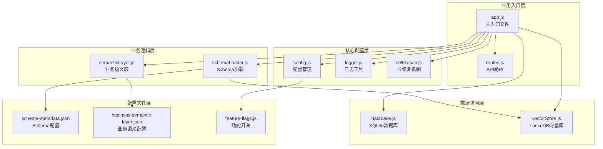
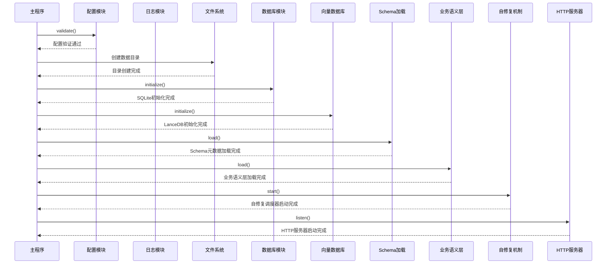
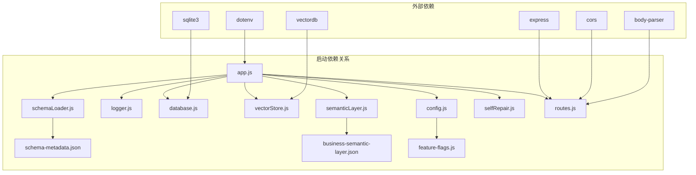
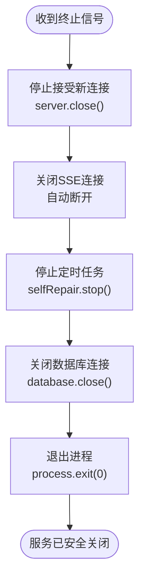

# 服务启动与初始化

<cite>
**本文档引用的文件**
- [app.js](file://backend/src/app.js)
- [config.js](file://backend/src/core/config.js)
- [database.js](file://backend/src/core/database.js)
- [vectorStore.js](file://backend/src/memory/vectorStore.js)
- [schemaLoader.js](file://backend/src/core/schemaLoader.js)
- [semanticLayer.js](file://backend/src/core/semanticLayer.js)
- [logger.js](file://backend/src/utils/logger.js)
- [selfRepair.js](file://backend/src/core/selfRepair.js)
- [routes.js](file://backend/src/core/routes.js)
- [business-semantic-layer.json](file://backend/config/business-semantic-layer.json)
- [feature-flags.js](file://backend/config/feature-flags.js)
- [schema-metadata.json](file://backend/config/schema-metadata.json)
- [package.json](file://backend/package.json)
</cite>

## 目录
1. [简介](#简介)
2. [项目结构](#项目结构)
3. [核心组件](#核心组件)
4. [架构概览](#架构概览)
5. [详细组件分析](#详细组件分析)
6. [依赖关系分析](#依赖关系分析)
7. [性能考虑](#性能考虑)
8. [故障排查指南](#故障排查指南)
9. [结论](#结论)

## 简介

NL2SQL服务启动与初始化模块负责整个后端服务的启动流程管理，包括环境变量加载、模块依赖初始化顺序、配置验证机制、数据库初始化、向量数据库初始化、Schema元数据加载、业务语义层加载以及优雅关闭机制。该模块采用模块化设计，确保服务启动的可靠性和可维护性。

## 项目结构

NL2SQL服务采用清晰的模块化架构，主要分为以下层次：

**图表来源**
- [app.js:1-266](file://backend/src/app.js#L1-L266)
- [config.js:1-398](file://backend/src/core/config.js#L1-L398)

**章节来源**
- [app.js:1-266](file://backend/src/app.js#L1-L266)
- [package.json:1-28](file://backend/package.json#L1-L28)

## 核心组件

### 环境变量加载与配置管理

服务启动时首先加载环境变量配置，使用dotenv库从.env文件读取环境变量到process.env。配置管理模块统一管理应用的所有配置项，提供默认值和配置验证机制。

**章节来源**
- [app.js:15-16](file://backend/src/app.js#L15-L16)
- [config.js:16-398](file://backend/src/core/config.js#L16-L398)

### 依赖模块导入

服务启动时导入所有核心依赖模块，包括：
- Express框架用于HTTP服务器创建
- CORS中间件处理跨域请求
- body-parser中间件解析JSON请求体
- SQLite3数据库驱动
- LanceDB向量数据库客户端
- 自定义模块如配置管理、日志、数据库、向量存储等

**章节来源**
- [app.js:22-50](file://backend/src/app.js#L22-L50)

### 初始化流程控制

初始化函数负责按顺序执行各个模块的初始化，确保依赖关系正确。初始化流程包括配置验证、目录创建、数据库初始化、向量数据库初始化、Schema元数据加载、业务语义层加载、功能开关打印、自修复调度器启动和HTTP服务器启动。

**章节来源**
- [app.js:97-194](file://backend/src/app.js#L97-L194)

## 架构概览

服务启动采用分阶段初始化策略，确保每个组件都有足够的时间完成初始化：

**图表来源**
- [app.js:97-194](file://backend/src/app.js#L97-L194)
- [config.js:366-398](file://backend/src/core/config.js#L366-L398)

## 详细组件分析

### 配置管理系统

配置管理模块提供统一的配置访问接口，从环境变量读取配置并提供默认值。配置包括：

#### 服务器配置
- 端口号：从PORT环境变量读取，默认3000
- 运行环境：NODE_ENV环境变量，默认development
- 环境检测：提供isDevelopment()和isProduction()方法

#### LLM API配置
- API基础URL：LLM_API_BASE，默认OpenAI API格式
- API密钥：LLM_API_KEY
- 模型名称：LLM_MODEL，默认gpt-4
- 请求超时：LLM_TIMEOUT，默认60000ms
- 重试机制：最大重试3次，重试间隔1000ms

#### 数据库配置
- SQLite数据库路径：DB_PATH，默认./data/sessions.db
- LanceDB向量数据库路径：VECTOR_DB_PATH，默认./data/vectordb
- SR数据库连接URL：SR_DATABASE_URL
- 连接池配置：最小2个，最大10个连接

#### 安全配置
- 表白名单：ALLOWED_TABLES，逗号分隔
- 干运行模式：DRY_RUN，默认false
- 查询行数限制：MAX_QUERY_ROWS，默认1000
- 查询超时：QUERY_TIMEOUT，默认30000ms
- 禁止关键字：UPDATE, DELETE, DROP等
- 敏感字段脱敏：password, phone等

#### 日志配置
- 日志级别：LOG_LEVEL，默认info
- 日志文件：LOG_FILE，默认./logs/app.log
- 控制台输出：console=true
- 文件输出：fileOutput=true
- 日志轮转：最大10MB，保留5个文件

**章节来源**
- [config.js:21-354](file://backend/src/core/config.js#L21-L354)

### 数据库初始化模块

SQLite数据库初始化模块负责会话历史、查询日志等数据的持久化存储：

#### 数据库连接管理
- 使用sqlite3模块的verbose模式获取详细错误信息
- 支持异步Promise包装
- 提供数据库连接实例管理

#### 表结构定义
- sessions表：存储用户会话信息
- messages表：存储会话消息历史
- query_history表：存储查询历史
- user_preferences表：存储用户偏好
- system_logs表：存储系统日志

#### 数据库迁移机制
- 自动检测和修复旧版本表结构
- 移除UNIQUE约束冲突
- 清理重复的用户偏好记录
- 修正错误的字段映射

**章节来源**
- [database.js:25-404](file://backend/src/core/database.js#L25-L404)

### 向量数据库初始化模块

LanceDB向量存储模块基于LanceDB实现向量存储和语义检索：

#### 向量表管理
- schema_vectors表：存储Schema信息向量
- query_vectors表：存储查询历史向量
- 支持表的创建和打开

#### 向量操作接口
- addSchemaVectors：添加Schema向量
- searchSchema：搜索相似Schema
- addQueryVector：添加查询向量
- searchSimilarQueries：搜索相似查询

#### 智能搜索功能
- searchSchemaSmart：带查询意图识别的智能搜索
- calculateImportance：计算查询重要性评分
- classifyQueryType：分类查询类型
- buildEnhancedMetadata：构建增强元数据

**章节来源**
- [vectorStore.js:203-783](file://backend/src/memory/vectorStore.js#L203-L783)

### Schema元数据加载模块

Schema元数据加载模块负责加载和管理数据表的Schema信息：

#### Schema数据结构
- version：Schema版本号
- tables：表定义数组
- relationships：表关系数组
- metrics：预定义指标数组
- dimensions：维度定义数组
- 映射表：tableMap和fieldMap用于快速查找

#### Schema验证机制
- 验证tables字段存在且为数组
- 检查每个表的name字段
- 验证字段定义的name字段

#### 向量化处理
- buildTableRepresentation：构建表级表征文本
- extractKeyFeatures：提取核心特征词
- vectorizeSchema：将Schema信息向量化存储

**章节来源**
- [schemaLoader.js:32-285](file://backend/src/core/schemaLoader.js#L32-L285)

### 业务语义层模块

业务语义层模块建立业务概念到物理表/字段的映射：

#### 语义配置结构
- concepts：业务概念定义
- query_patterns：查询模式
- field_mappings：字段值映射
- datasource_mappings：数据源映射

#### 核心功能
- matchConcepts：匹配查询中的业务概念
- recommendTables：基于概念推荐表
- inferDatasource：推断数据源
- getFieldValueMapping：获取字段值映射

#### 概念匹配算法
- 精确匹配：完全包含概念名称
- 别名匹配：匹配别名列表
- 模糊匹配：关键词部分匹配

**章节来源**
- [semanticLayer.js:25-330](file://backend/src/core/semanticLayer.js#L25-L330)

### 自修复机制模块

自修复机制模块实现系统的自我监控和维护功能：

#### 定时任务调度
- 每日自检：每天凌晨2点执行
- 会话清理：每30分钟清理过期会话
- 统计收集：每5分钟收集系统统计
- 记忆维护：每天凌晨3点执行

#### 健康检查功能
- 数据库连接检查
- 向量数据库状态检查
- 查询统计分析
- 内存使用情况监控

#### 维护操作
- 过期会话归档
- 记忆压缩和清理
- 系统资源优化

**章节来源**
- [selfRepair.js:60-415](file://backend/src/core/selfRepair.js#L60-L415)

## 依赖关系分析

服务启动过程中的依赖关系如下：

**图表来源**
- [app.js:39-49](file://backend/src/app.js#L39-L49)
- [package.json:10-20](file://backend/package.json#L10-L20)

**章节来源**
- [app.js:39-49](file://backend/src/app.js#L39-L49)
- [package.json:10-20](file://backend/package.json#L10-L20)

## 性能考虑

### 启动性能优化

1. **异步初始化**：所有数据库和存储初始化都使用Promise包装，避免阻塞主线程
2. **延迟加载**：业务语义层采用延迟加载机制，失败时使用传统流程
3. **缓存机制**：Schema元数据支持缓存，减少重复加载开销
4. **连接池管理**：数据库连接池配置优化，避免连接泄漏

### 资源管理

1. **内存优化**：日志模块实现追踪上下文清理，防止内存泄漏
2. **文件句柄管理**：向量数据库使用连接复用，减少文件句柄消耗
3. **定时任务清理**：自修复机制定期清理过期资源

### 监控与诊断

1. **详细日志**：提供TRACE级别日志支持，便于调试NL2SQL流程
2. **健康检查**：每日自检报告包含系统健康状态
3. **性能指标**：记录查询执行时间和内存使用情况

## 故障排查指南

### 常见启动问题

#### 配置验证失败
**症状**：服务启动时报配置错误
**原因**：LLM_API_KEY或SR_DATABASE_URL未设置
**解决方案**：检查.env文件中的必要配置项

#### 数据库连接失败
**症状**：SQLite初始化失败
**原因**：数据库文件权限问题或路径不存在
**解决方案**：确认数据库文件路径和权限

#### 向量数据库初始化失败
**症状**：LanceDB初始化失败但不影响服务启动
**原因**：向量数据库文件损坏或权限问题
**解决方案**：检查vectordb目录权限和磁盘空间

#### Schema加载失败
**症状**：Schema元数据加载失败
**原因**：schema-metadata.json文件不存在或格式错误
**解决方案**：检查配置文件路径和JSON格式

### 优雅关闭机制

服务实现了完整的优雅关闭机制：

**图表来源**
- [app.js:204-240](file://backend/src/app.js#L204-L240)

**章节来源**
- [app.js:204-258](file://backend/src/app.js#L204-L258)

### 日志分析

使用日志模块进行问题诊断：

1. **查看启动日志**：确认各模块初始化顺序和状态
2. **错误级别日志**：定位具体错误位置和原因
3. **追踪日志**：使用trace功能跟踪复杂流程
4. **健康检查报告**：定期检查系统健康状态

**章节来源**
- [logger.js:276-448](file://backend/src/utils/logger.js#L276-L448)

## 结论

NL2SQL服务启动与初始化模块采用了模块化、异步化的设计理念，确保了服务启动的可靠性、可维护性和可观测性。通过合理的依赖管理、配置验证、资源清理和故障恢复机制，该模块为整个NL2SQL系统提供了稳定可靠的启动基础。

关键优势包括：
- 清晰的初始化顺序和依赖关系
- 完善的错误处理和故障恢复机制  
- 详细的日志记录和监控能力
- 灵活的配置管理和功能开关
- 优雅的资源清理和进程管理

该设计使得NL2SQL服务能够在各种环境下稳定运行，并为后续的功能扩展和维护提供了良好的基础。