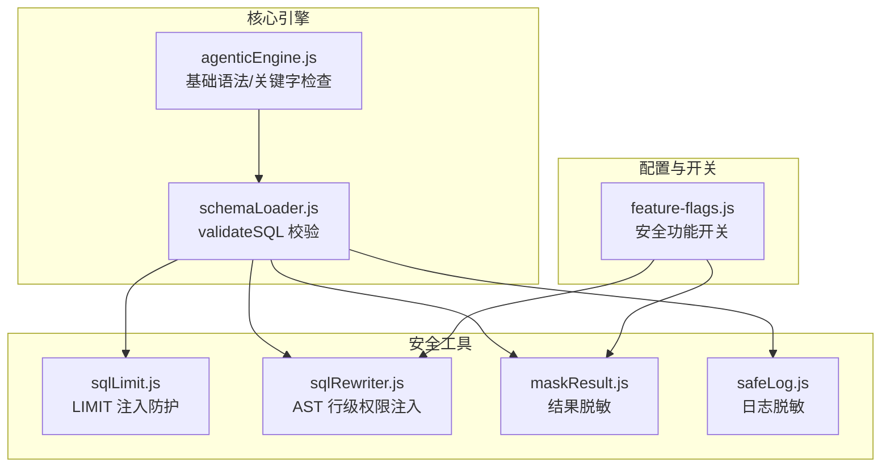
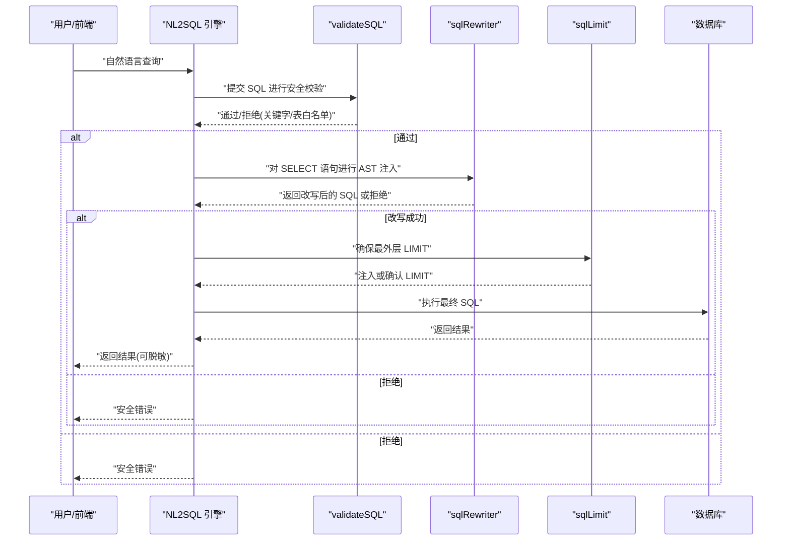
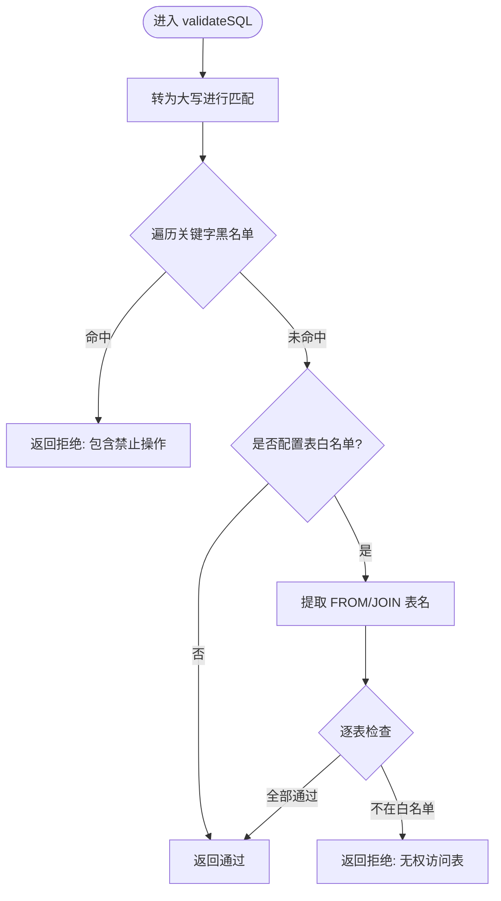
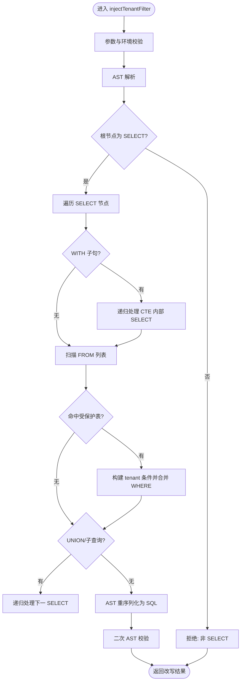
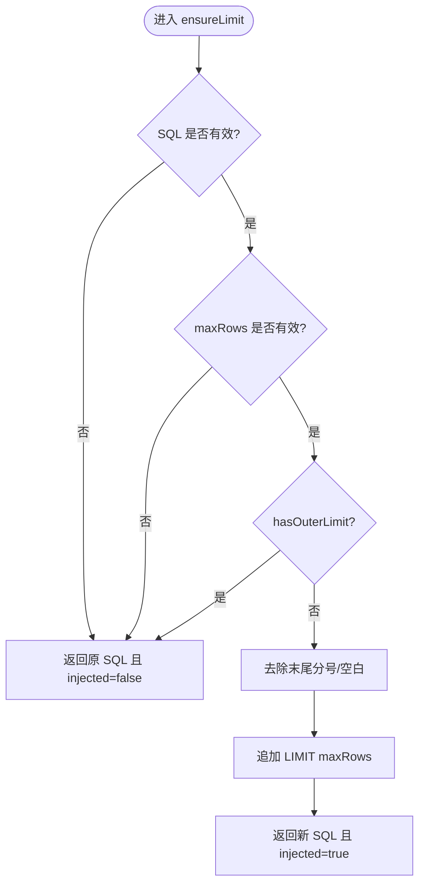
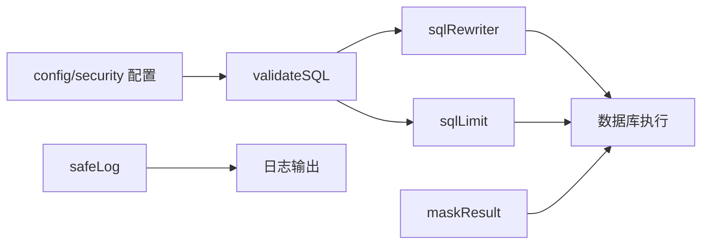

# SQL 注入防护

<cite>
**本文档引用的文件**
- [schemaLoader.js](file://backend/src/core/schemaLoader.js)
- [sqlRewriter.js](file://backend/src/utils/sqlRewriter.js)
- [sqlLimit.js](file://backend/src/utils/sqlLimit.js)
- [test-sqlRewriter.js](file://backend/test/phase3/test-sqlRewriter.js)
- [test-limit-injection.js](file://backend/test/phase2/test-limit-injection.js)
- [maskResult.js](file://backend/src/utils/maskResult.js)
- [safeLog.js](file://backend/src/utils/safeLog.js)
- [feature-flags.js](file://backend/config/feature-flags.js)
- [agenticEngine.js](file://backend/src/core/agenticEngine.js)
</cite>

## 目录
1. [简介](#简介)
2. [项目结构](#项目结构)
3. [核心组件](#核心组件)
4. [架构总览](#架构总览)
5. [详细组件分析](#详细组件分析)
6. [依赖关系分析](#依赖关系分析)
7. [性能考量](#性能考量)
8. [故障排查指南](#故障排查指南)
9. [结论](#结论)
10. [附录](#附录)

## 简介
本文件为 NL2SQL SQL 注入防护系统的全面技术文档，聚焦多层次安全防护机制的设计与实现，包括关键字过滤、白名单验证、SQL 语法检查、SQL 重写器（行级权限注入）、LIMIT 限制与结果脱敏等。文档深入解析 validateSQL 函数的实现原理与边界，阐述 sqlRewriter 的 AST 驱动改写流程，提供可操作的防护策略配置示例与常见攻击手法的应对方案，帮助安全工程师与开发者构建稳健的 SQL 安全防线。

## 项目结构
围绕 SQL 安全的核心代码主要分布在以下位置：
- 核心安全校验：backend/src/core/schemaLoader.js（validateSQL）
- SQL 重写器（行级权限）：backend/src/utils/sqlRewriter.js
- LIMIT 注入防护：backend/src/utils/sqlLimit.js
- 安全工具集：backend/src/utils/maskResult.js、backend/src/utils/safeLog.js
- 功能开关与安全策略：backend/config/feature-flags.js
- 辅助安全检查：backend/src/core/agenticEngine.js（基础语法与关键字检查）

图表来源
- [schemaLoader.js:749-785](file://backend/src/core/schemaLoader.js#L749-L785)
- [sqlLimit.js:1-37](file://backend/src/utils/sqlLimit.js#L1-L37)
- [sqlRewriter.js:1-232](file://backend/src/utils/sqlRewriter.js#L1-L232)
- [maskResult.js:1-198](file://backend/src/utils/maskResult.js#L1-L198)
- [safeLog.js:1-71](file://backend/src/utils/safeLog.js#L1-L71)
- [feature-flags.js:82-112](file://backend/config/feature-flags.js#L82-L112)
- [agenticEngine.js:600-657](file://backend/src/core/agenticEngine.js#L600-L657)

章节来源
- [schemaLoader.js:749-785](file://backend/src/core/schemaLoader.js#L749-L785)
- [sqlLimit.js:1-37](file://backend/src/utils/sqlLimit.js#L1-L37)
- [sqlRewriter.js:1-232](file://backend/src/utils/sqlRewriter.js#L1-L232)
- [maskResult.js:1-198](file://backend/src/utils/maskResult.js#L1-L198)
- [safeLog.js:1-71](file://backend/src/utils/safeLog.js#L1-L71)
- [feature-flags.js:82-112](file://backend/config/feature-flags.js#L82-L112)
- [agenticEngine.js:600-657](file://backend/src/core/agenticEngine.js#L600-L657)

## 核心组件
- validateSQL：基于配置的关键字黑名单与表白名单双重校验，确保仅允许授权的 SELECT 查询通过。
- sqlRewriter.injectTenantFilter：在 SQL 通过 validateSQL 后，基于 AST 对命中表注入行级权限条件，保证“安全不依赖对齐”。
- sqlLimit：检测并确保最外层 LIMIT，防止无界扫描与资源滥用。
- maskResult：对查询结果按列名规则进行脱敏，降低敏感数据泄露风险。
- safeLog：对日志内容进行摘要与哈希，避免敏感 Prompt/查询明文泄露。
- agenticEngine：提供基础语法与关键字检查，作为第二道防线。

章节来源
- [schemaLoader.js:749-785](file://backend/src/core/schemaLoader.js#L749-L785)
- [sqlRewriter.js:40-127](file://backend/src/utils/sqlRewriter.js#L40-L127)
- [sqlLimit.js:16-34](file://backend/src/utils/sqlLimit.js#L16-L34)
- [maskResult.js:131-184](file://backend/src/utils/maskResult.js#L131-L184)
- [safeLog.js:20-64](file://backend/src/utils/safeLog.js#L20-L64)
- [agenticEngine.js:612-634](file://backend/src/core/agenticEngine.js#L612-L634)

## 架构总览
下图展示了 NL2SQL 在 SQL 生成到执行阶段的安全控制路径，强调 validateSQL 作为第一道防线，sqlRewriter 作为第二道防线（在 AST 层面注入行级权限），sqlLimit 保障 LIMIT 限制，maskResult 与 safeLog 降低结果与日志风险。

图表来源
- [schemaLoader.js:749-785](file://backend/src/core/schemaLoader.js#L749-L785)
- [sqlRewriter.js:40-127](file://backend/src/utils/sqlRewriter.js#L40-L127)
- [sqlLimit.js:16-34](file://backend/src/utils/sqlLimit.js#L16-L34)
- [agenticEngine.js:600-657](file://backend/src/core/agenticEngine.js#L600-L657)

## 详细组件分析

### validateSQL 实现与防护原理
validateSQL 采用“关键字黑名单 + 表白名单”的双保险策略：
- 关键字过滤：遍历配置中的 forbiddenKeywords，使用单词边界正则精确匹配，避免误伤列名/子查询中的关键字片段。
- 表白名单：若配置了 allowedTables，则从 SQL 中提取 FROM/JOIN 的表名，逐一核对是否在白名单内。
- 返回结构：通过 valid 字段与可选 error 字段，向上游清晰传递校验结果。

图表来源
- [schemaLoader.js:749-785](file://backend/src/core/schemaLoader.js#L749-L785)

章节来源
- [schemaLoader.js:749-785](file://backend/src/core/schemaLoader.js#L749-L785)

### SQL 重写器（sqlRewriter）：AST 驱动的行级权限注入
sqlRewriter 在 validateSQL 通过后、真实执行前，基于 node-sql-parser 的 AST 对命中 tableTenantMap 的表注入行级权限条件。其设计约束与流程如下：
- 解析失败/序列化失败/结构不可识别 → 全部 refused:true，上游中止执行，绝不静默跳过。
- 覆盖范围：单表 SELECT、JOIN（多个 from 项）、UNION（_next 链）、CTE（with）、FROM 子查询；不覆盖 INSERT/UPDATE/DELETE（本就由 validateSQL 的禁词拦截）。
- 注入策略：仅在 WHERE 追加 tenant 条件，不改动 ON 条件，确保覆盖整表结果。
- 安全校验：改写后再次 sqlify 并 astify，验证生成 SQL 的良构性。

图表来源
- [sqlRewriter.js:40-127](file://backend/src/utils/sqlRewriter.js#L40-L127)
- [sqlRewriter.js:136-180](file://backend/src/utils/sqlRewriter.js#L136-L180)
- [sqlRewriter.js:185-200](file://backend/src/utils/sqlRewriter.js#L185-L200)

章节来源
- [sqlRewriter.js:40-127](file://backend/src/utils/sqlRewriter.js#L40-L127)
- [sqlRewriter.js:136-180](file://backend/src/utils/sqlRewriter.js#L136-L180)
- [sqlRewriter.js:185-200](file://backend/src/utils/sqlRewriter.js#L185-L200)
- [test-sqlRewriter.js:1-222](file://backend/test/phase3/test-sqlRewriter.js#L1-L222)

### LIMIT 注入防护（sqlLimit）
sqlLimit 提供两个能力：
- hasOuterLimit：判断 SQL 最外层是否已带 LIMIT（忽略末尾分号与空白），支持 LIMIT n、LIMIT n,m、LIMIT n OFFSET m 三种合法尾形。
- ensureLimit：当未带 LIMIT 时追加 LIMIT maxRows，已带则原样返回；对 maxRows 做数值有效性校验。

图表来源
- [sqlLimit.js:16-34](file://backend/src/utils/sqlLimit.js#L16-L34)

章节来源
- [sqlLimit.js:1-37](file://backend/src/utils/sqlLimit.js#L1-L37)
- [test-limit-injection.js:1-88](file://backend/test/phase2/test-limit-injection.js#L1-L88)

### 结果脱敏与日志脱敏
- maskResult：按列名规则对查询结果进行脱敏，支持多种规则（如手机号中段打码、邮箱本地部分打码、身份证头尾保留等），列名大小写不敏感，返回新数组不修改输入。
- safeLog：对日志内容进行摘要与哈希，避免敏感 Prompt/查询明文输出；提供 LOG_PROMPT_FULL 开关用于紧急排障。

章节来源
- [maskResult.js:131-184](file://backend/src/utils/maskResult.js#L131-L184)
- [safeLog.js:20-64](file://backend/src/utils/safeLog.js#L20-L64)

### 基础语法与关键字检查（第二道防线）
agenticEngine 在验证阶段提供基础语法检查（SELECT/FROM 存在性）与关键字检查（DROP/DELETE/UPDATE/INSERT/ALTER/TRUNCATE），作为 validateSQL 的补充。

章节来源
- [agenticEngine.js:612-634](file://backend/src/core/agenticEngine.js#L612-L634)

## 依赖关系分析
- validateSQL 依赖配置中的 security.forbiddenKeywords 与 security.allowedTables。
- sqlRewriter 依赖 node-sql-parser（动态引入），并在严格模式下拒绝解析失败或结构不可识别的 SQL。
- sqlLimit 与 validateSQL 协作，确保最外层 LIMIT。
- maskResult 与 safeLog 与安全策略开关联动，受 feature-flags 控制。

图表来源
- [schemaLoader.js:749-785](file://backend/src/core/schemaLoader.js#L749-L785)
- [sqlLimit.js:16-34](file://backend/src/utils/sqlLimit.js#L16-L34)
- [sqlRewriter.js:40-127](file://backend/src/utils/sqlRewriter.js#L40-L127)
- [maskResult.js:131-184](file://backend/src/utils/maskResult.js#L131-L184)
- [safeLog.js:20-64](file://backend/src/utils/safeLog.js#L20-L64)

章节来源
- [schemaLoader.js:749-785](file://backend/src/core/schemaLoader.js#L749-L785)
- [sqlLimit.js:16-34](file://backend/src/utils/sqlLimit.js#L16-L34)
- [sqlRewriter.js:40-127](file://backend/src/utils/sqlRewriter.js#L40-L127)
- [maskResult.js:131-184](file://backend/src/utils/maskResult.js#L131-L184)
- [safeLog.js:20-64](file://backend/src/utils/safeLog.js#L20-L64)

## 性能考量
- validateSQL：正则匹配与表名提取为线性复杂度，开销极低；建议在上游缓存白名单/黑名单以减少重复解析。
- sqlRewriter：AST 解析与遍历为 O(n)（n 为节点数），在复杂 SQL（大量 JOIN/UNION/CTE）时需关注解析耗时；建议在生产环境启用解析缓存与超时控制。
- sqlLimit：正则匹配与字符串处理为 O(m)（m 为 SQL 长度），通常可忽略。
- maskResult：按列映射进行脱敏，复杂度 O(r*c)（r 为行数，c 为命中列数），建议批量处理与按需脱敏。

## 故障排查指南
- validateSQL 拒绝
  - 检查 forbiddenKeywords 是否包含误报关键字，必要时调整配置。
  - 若 allowedTables 生效，确认 SQL 中的表名大小写与白名单一致。
- sqlRewriter 拒绝
  - 查看 refused 与 reason 字段：PARSE_FAIL（解析失败）、WALK_FAIL（遍历失败）、VERIFY_FAIL（二次校验失败）、UNSUPPORTED_TYPE（非 SELECT）、NO_TENANT_ID（租户 ID 缺失）。
  - 确认 node-sql-parser 是否安装，以及 SQL 是否为单条 SELECT。
- sqlLimit 未生效
  - 确认 hasOuterLimit 的判定逻辑是否符合预期（仅最外层 LIMIT 生效）。
  - 检查 maxRows 是否为有效正数。
- 结果脱敏/日志脱敏
  - 检查 feature-flags 中对应开关状态。
  - 确认列名规则映射大小写不敏感匹配是否符合预期。

章节来源
- [schemaLoader.js:749-785](file://backend/src/core/schemaLoader.js#L749-L785)
- [sqlRewriter.js:40-127](file://backend/src/utils/sqlRewriter.js#L40-L127)
- [sqlLimit.js:16-34](file://backend/src/utils/sqlLimit.js#L16-L34)
- [maskResult.js:131-184](file://backend/src/utils/maskResult.js#L131-L184)
- [safeLog.js:20-64](file://backend/src/utils/safeLog.js#L20-L64)
- [test-sqlRewriter.js:126-146](file://backend/test/phase3/test-sqlRewriter.js#L126-L146)
- [test-limit-injection.js:21-88](file://backend/test/phase2/test-limit-injection.js#L21-L88)

## 结论
NL2SQL 的 SQL 注入防护体系通过 validateSQL 的关键字与表白名单、sqlRewriter 的 AST 注入、sqlLimit 的 LIMIT 限制、maskResult 的结果脱敏与 safeLog 的日志脱敏，形成了“生成即审、执行即控”的闭环安全机制。建议在生产环境中结合 feature-flags 进行渐进式启用，并持续完善关键字与表白名单，确保安全策略与业务场景相匹配。

## 附录

### 防护策略配置示例
- 关键字过滤规则
  - 在配置中维护 security.forbiddenKeywords，包含 DROP、DELETE、UPDATE、INSERT、ALTER、TRUNCATE 等禁用关键字。
- 表白名单
  - 在配置中设置 security.allowedTables，限定允许访问的表集合。
- 行级权限（RLS）
  - 通过 feature-flags.js 中的 RLS_ENFORCEMENT 开关启用；配置 RLS_TABLE_TENANT_MAP（如 "orders:tenant_id,users:tenant_id"）；请求携带 X-Tenant-Id 头。
- 结果脱敏
  - 通过 feature-flags.js 中的 RESULT_MASKING 开关控制；在 config.security.masking.rules 中按列名配置脱敏规则。
- 日志脱敏
  - 通过 safeLog 的摘要与哈希避免明文输出；必要时临时开启 LOG_PROMPT_FULL=true 用于排障。

章节来源
- [feature-flags.js:82-112](file://backend/config/feature-flags.js#L82-L112)
- [sqlRewriter.js:218-226](file://backend/src/utils/sqlRewriter.js#L218-L226)
- [maskResult.js:131-184](file://backend/src/utils/maskResult.js#L131-L184)
- [safeLog.js:62-64](file://backend/src/utils/safeLog.js#L62-L64)