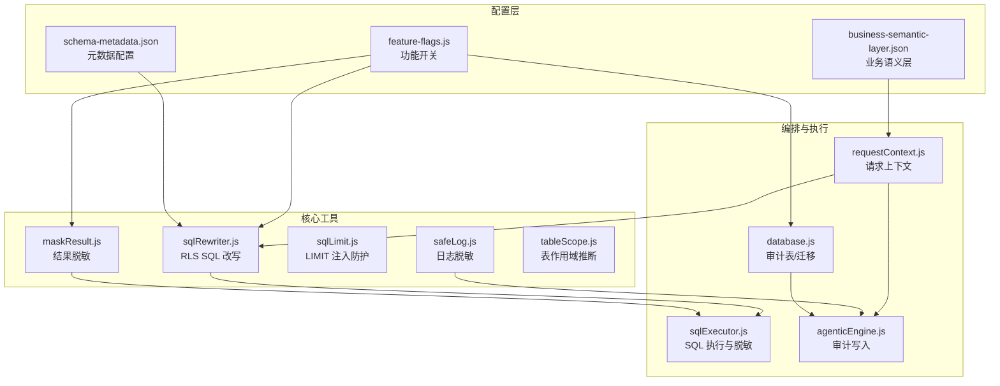
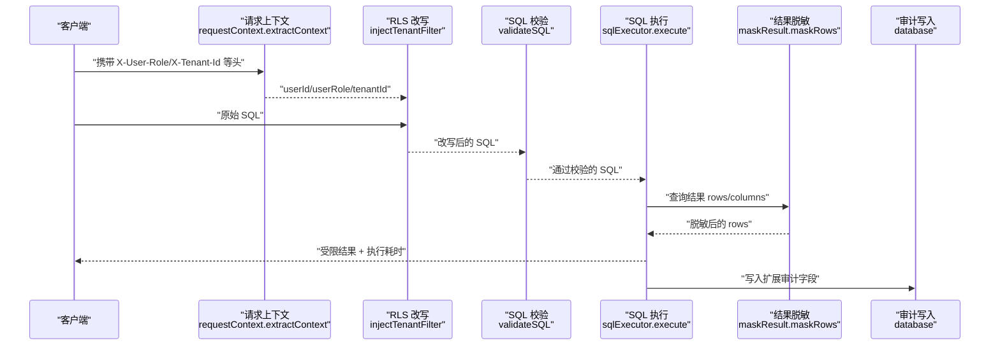
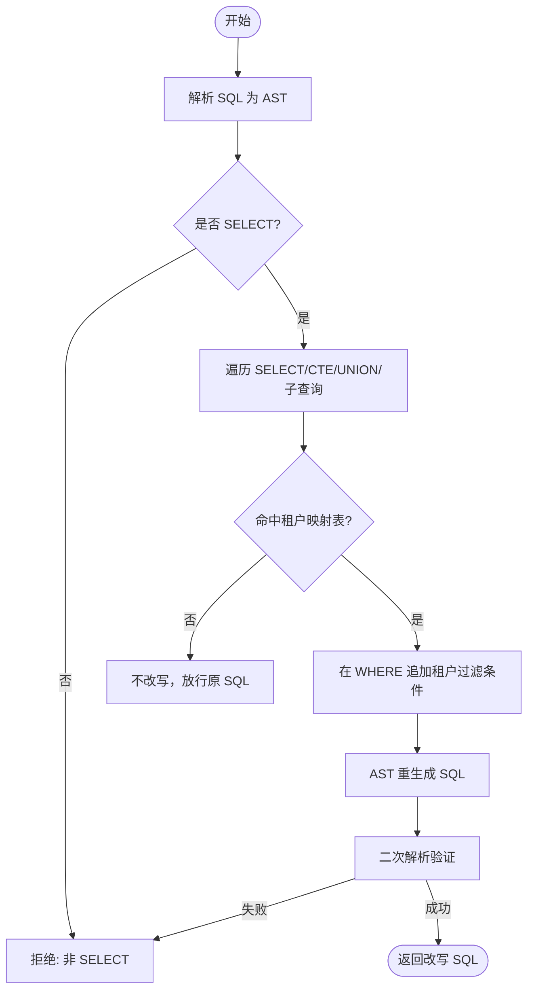
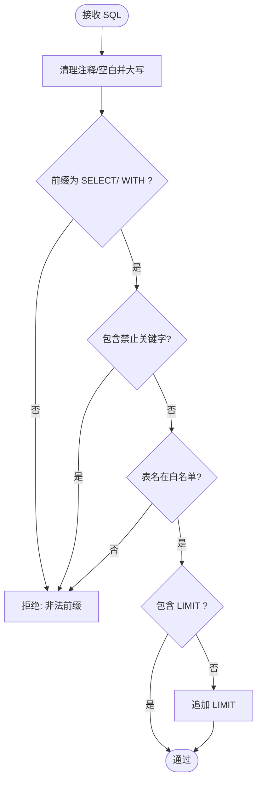
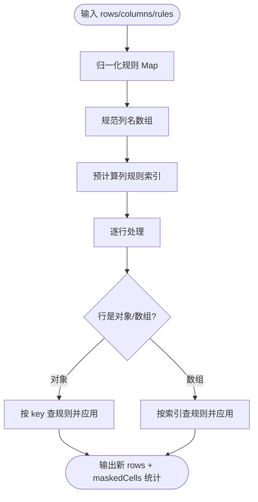
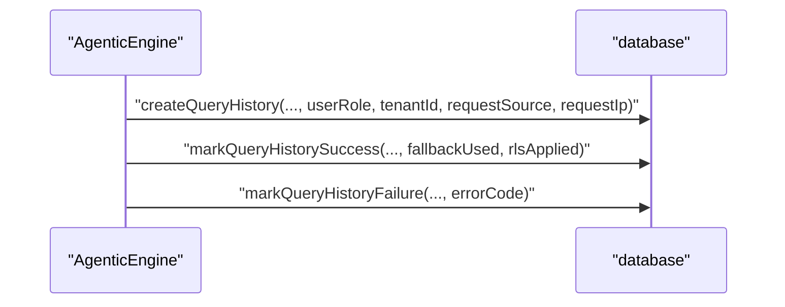
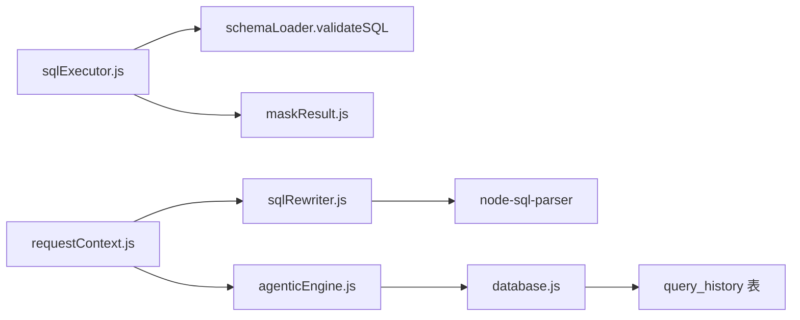

# 安全控制系统

<cite>
**本文引用的文件**
- [maskResult.js](file://backend/src/utils/maskResult.js)
- [safeLog.js](file://backend/src/utils/safeLog.js)
- [sqlLimit.js](file://backend/src/utils/sqlLimit.js)
- [sqlRewriter.js](file://backend/src/utils/sqlRewriter.js)
- [tableScope.js](file://backend/src/utils/tableScope.js)
- [business-semantic-layer.json](file://backend/config/business-semantic-layer.json)
- [schema-metadata.json](file://backend/config/schema-metadata.json)
- [feature-flags.js](file://backend/config/feature-flags.js)
- [requestContext.js](file://backend/src/core/requestContext.js)
- [database.js](file://backend/src/core/database.js)
- [sqlExecutor.js](file://backend/src/core/sqlExecutor.js)
- [agenticEngine.js](file://backend/src/core/agenticEngine.js)
- [test-masking.js](file://backend/test/phase3/test-masking.js)
- [test-safeLog.js](file://backend/test/phase3/test-safeLog.js)
- [test-sqlRewriter.js](file://backend/test/phase3/test-sqlRewriter.js)
- [test-auditMigration.js](file://backend/test/phase3/test-auditMigration.js)
</cite>

## 目录
1. [简介](#简介)
2. [项目结构](#项目结构)
3. [核心组件](#核心组件)
4. [架构总览](#架构总览)
5. [详细组件分析](#详细组件分析)
6. [依赖关系分析](#依赖关系分析)
7. [性能考量](#性能考量)
8. [故障排查指南](#故障排查指南)
9. [结论](#结论)
10. [附录](#附录)

## 简介
本技术文档面向安全工程师与系统管理员，系统性阐述 NL2SQL 安全控制系统的设计与实现，重点覆盖以下方面：
- 行级权限控制（RLS）：通过租户隔离与 SQL 改写实现跨表、CTE、UNION、子查询场景下的统一过滤。
- SQL 注入防护：多层安全校验，包括关键字过滤、白名单验证、安全查询执行与 LIMIT 注入防护。
- 结果脱敏：基于列名规则的敏感字段脱敏，支持多种脱敏策略，保证数据最小暴露面。
- 安全配置管理：通过功能开关与配置文件集中管理权限规则与脱敏策略。
- 审计与监控：扩展审计字段、迁移兼容与失败回退记录，支撑安全审计与问题定位。
- 扩展性与合规：模块化设计、可插拔策略、环境变量与配置文件双轨制，满足生产级合规要求。

## 项目结构
安全控制相关代码主要分布在 backend/src/utils 与 backend/src/core 目录，并通过配置文件与测试用例保障质量与可运维性。

**图表来源**
- [feature-flags.js:107-113](file://backend/config/feature-flags.js#L107-L113)
- [sqlRewriter.js:40-127](file://backend/src/utils/sqlRewriter.js#L40-L127)
- [maskResult.js:131-184](file://backend/src/utils/maskResult.js#L131-L184)
- [requestContext.js:25-44](file://backend/src/core/requestContext.js#L25-L44)
- [database.js:110-145](file://backend/src/core/database.js#L110-L145)
- [sqlExecutor.js:72-175](file://backend/src/core/sqlExecutor.js#L72-L175)
- [agenticEngine.js:177-216](file://backend/src/core/agenticEngine.js#L177-L216)

**章节来源**
- [feature-flags.js:107-113](file://backend/config/feature-flags.js#L107-L113)
- [sqlRewriter.js:40-127](file://backend/src/utils/sqlRewriter.js#L40-L127)
- [maskResult.js:131-184](file://backend/src/utils/maskResult.js#L131-L184)
- [requestContext.js:25-44](file://backend/src/core/requestContext.js#L25-L44)
- [database.js:110-145](file://backend/src/core/database.js#L110-L145)
- [sqlExecutor.js:72-175](file://backend/src/core/sqlExecutor.js#L72-L175)
- [agenticEngine.js:177-216](file://backend/src/core/agenticEngine.js#L177-L216)

## 核心组件
- 行级权限（RLS）SQL 改写：在 SQL 解析后、执行前，针对命中映射表的 SELECT/CTE/UNION/FROM 子查询注入租户过滤条件，确保跨层级过滤。
- 结果脱敏：基于列名规则对查询结果进行脱敏，支持多种策略，返回新数组，不修改原始输入。
- 日志脱敏：对 Prompt/查询摘要化输出，避免明文日志泄露用户数据。
- SQL 安全校验：关键字过滤、白名单表检查、前缀与 LIMIT 校验，结合 LIMIT 注入防护工具。
- 审计与监控：扩展审计字段、迁移兼容、失败回退与 RLS 命中记录，支持查询溯源与异常追踪。

**章节来源**
- [sqlRewriter.js:40-127](file://backend/src/utils/sqlRewriter.js#L40-L127)
- [maskResult.js:131-184](file://backend/src/utils/maskResult.js#L131-L184)
- [safeLog.js:20-64](file://backend/src/utils/safeLog.js#L20-L64)
- [sqlExecutor.js:34-66](file://backend/src/core/sqlExecutor.js#L34-L66)
- [sqlLimit.js:16-34](file://backend/src/utils/sqlLimit.js#L16-L34)
- [database.js:110-145](file://backend/src/core/database.js#L110-L145)

## 架构总览
安全控制贯穿“请求上下文 → SQL 改写/校验 → 执行 → 结果脱敏/审计”的全链路。

**图表来源**
- [requestContext.js:25-44](file://backend/src/core/requestContext.js#L25-L44)
- [sqlRewriter.js:40-127](file://backend/src/utils/sqlRewriter.js#L40-L127)
- [sqlExecutor.js:72-175](file://backend/src/core/sqlExecutor.js#L72-L175)
- [maskResult.js:131-184](file://backend/src/utils/maskResult.js#L131-L184)
- [database.js:110-145](file://backend/src/core/database.js#L110-L145)

## 详细组件分析

### 行级权限控制（RLS）实现
- 租户映射与注入：通过环境变量解析表到租户列的映射，AST 遍历命中表后在 WHERE 追加租户过滤条件，支持单表、JOIN、UNION、CTE、子查询等。
- 安全边界：解析失败、非 SELECT、改写后不可再解析等情况均拒绝执行，确保“安全不依赖对齐”。
- 可观测性：记录 applied/skipped 表集合，便于审计与告警。

**图表来源**
- [sqlRewriter.js:65-127](file://backend/src/utils/sqlRewriter.js#L65-L127)

**章节来源**
- [sqlRewriter.js:40-127](file://backend/src/utils/sqlRewriter.js#L40-L127)
- [test-sqlRewriter.js:35-178](file://backend/test/phase3/test-sqlRewriter.js#L35-L178)

### SQL 注入防护系统
- 关键字过滤：检测禁止操作关键字，阻止危险语句进入执行阶段。
- 白名单验证：在允许表集配置下，校验 SQL 中出现的表名是否在白名单内。
- 前缀与 LIMIT 校验：仅允许 SELECT/ WITH 前缀，且必须包含 LIMIT。
- LIMIT 注入防护：识别 SQL 末尾 LIMIT 形态，若缺失则追加 LIMIT，避免注入风险。

**图表来源**
- [sqlExecutor.js:34-66](file://backend/src/core/sqlExecutor.js#L34-L66)
- [sqlLimit.js:16-34](file://backend/src/utils/sqlLimit.js#L16-L34)

**章节来源**
- [sqlExecutor.js:34-66](file://backend/src/core/sqlExecutor.js#L34-L66)
- [sqlLimit.js:16-34](file://backend/src/utils/sqlLimit.js#L16-L34)

### 结果脱敏机制
- 规则驱动：基于列名映射到规则名，支持大小写不敏感匹配与对象/数组两种行形态。
- 策略丰富：手机号中段、邮箱本地域、身份证头尾、密码令牌全红、姓名首字符、卡号尾段、长度星号等。
- 不可变性：返回新数组，不修改输入；统计脱敏单元格数量，便于审计。

**图表来源**
- [maskResult.js:131-184](file://backend/src/utils/maskResult.js#L131-L184)

**章节来源**
- [maskResult.js:131-184](file://backend/src/utils/maskResult.js#L131-L184)
- [test-masking.js:16-177](file://backend/test/phase3/test-masking.js#L16-L177)

### 日志脱敏与安全审计
- Prompt 摘要化：提供摘要结构与哈希，避免明文日志；仅在 LOG_PROMPT_FULL=true 时输出完整内容。
- 审计字段扩展：在 query_history 表中新增 user_role、tenant_id、request_source、request_ip、error_code、fallback_used、rls_applied 等字段，支持迁移与索引。
- 审计写入：在引擎成功/失败路径中写入审计信息，失败时记录错误码与 RLS 命中表列表。

**图表来源**
- [agenticEngine.js:177-216](file://backend/src/core/agenticEngine.js#L177-L216)
- [database.js:110-145](file://backend/src/core/database.js#L110-L145)
- [test-auditMigration.js:130-177](file://backend/test/phase3/test-auditMigration.js#L130-L177)

**章节来源**
- [safeLog.js:20-64](file://backend/src/utils/safeLog.js#L20-L64)
- [database.js:110-145](file://backend/src/core/database.js#L110-L145)
- [agenticEngine.js:177-216](file://backend/src/core/agenticEngine.js#L177-L216)
- [test-auditMigration.js:130-177](file://backend/test/phase3/test-auditMigration.js#L130-L177)

### 安全配置管理
- 功能开关：通过环境变量控制 RLS_ENFORCEMENT、RESULT_MASKING、AUDIT_LOG_EXTENDED 等，支持紧急关闭与回滚。
- 租户映射：通过 parseTenantMapEnv 解析环境变量中的表:列映射，供 RLS 改写使用。
- 表作用域：tableScope 推断表所属范围，辅助权限与审计策略制定。

**章节来源**
- [feature-flags.js:97-113](file://backend/config/feature-flags.js#L97-L113)
- [sqlRewriter.js:218-226](file://backend/src/utils/sqlRewriter.js#L218-L226)
- [tableScope.js:12-41](file://backend/src/utils/tableScope.js#L12-L41)

## 依赖关系分析
- 组件耦合：RLS 改写依赖 node-sql-parser；结果脱敏与日志脱敏为纯函数工具；SQL 执行模块负责整合校验、脱敏与审计写入。
- 外部依赖：SQLite（测试与审计表）、node-sql-parser（SQL AST）。
- 配置依赖：feature-flags.js 与 schema-metadata.json/business-semantic-layer.json 提供运行期策略与元数据。

**图表来源**
- [sqlRewriter.js:15-20](file://backend/src/utils/sqlRewriter.js#L15-L20)
- [sqlExecutor.js:15-28](file://backend/src/core/sqlExecutor.js#L15-L28)
- [agenticEngine.js:20-31](file://backend/src/core/agenticEngine.js#L20-L31)
- [database.js:110-145](file://backend/src/core/database.js#L110-L145)
- [requestContext.js:25-44](file://backend/src/core/requestContext.js#L25-L44)

**章节来源**
- [sqlRewriter.js:15-20](file://backend/src/utils/sqlRewriter.js#L15-L20)
- [sqlExecutor.js:15-28](file://backend/src/core/sqlExecutor.js#L15-L28)
- [agenticEngine.js:20-31](file://backend/src/core/agenticEngine.js#L20-L31)
- [database.js:110-145](file://backend/src/core/database.js#L110-L145)
- [requestContext.js:25-44](file://backend/src/core/requestContext.js#L25-L44)

## 性能考量
- AST 解析成本：RLS 改写涉及解析与重生成，建议在高频路径中缓存解析结果或降低触发频率。
- 脱敏开销：maskRows 对每行逐列应用规则，建议在 LIMIT 后进行，减少处理量。
- 审计写入：批量写入与索引（如 tenant_id）可提升查询效率，注意异步写入避免阻塞主流程。
- SQL 校验：正则与字符串匹配成本低，建议在执行前尽早拦截非法语句。

## 故障排查指南
- RLS 改写失败：检查解析器安装、SQL 语法与租户映射配置；关注 refused 与 reason 字段。
- 结果脱敏异常：核对规则映射大小写与列名一致性；确认 feature flags 与 masking 配置启用。
- 审计字段缺失：确认数据库迁移是否完成、索引是否存在；检查写入路径与错误捕获。
- 日志脱敏：确认 LOG_PROMPT_FULL 环境变量设置；避免在 debug 级别输出完整 Prompt。

**章节来源**
- [sqlRewriter.js:43-95](file://backend/src/utils/sqlRewriter.js#L43-L95)
- [maskResult.js:131-184](file://backend/src/utils/maskResult.js#L131-L184)
- [database.js:110-145](file://backend/src/core/database.js#L110-L145)
- [safeLog.js:62-64](file://backend/src/utils/safeLog.js#L62-L64)

## 结论
NL2SQL 安全控制系统通过“请求上下文 → SQL 改写/校验 → 执行 → 脱敏/审计”的闭环，实现了租户隔离、SQL 注入防护、敏感数据最小暴露与可追溯审计。模块化设计与功能开关使其具备良好的可运维性与扩展性，适合在生产环境中持续演进与合规落地。

## 附录
- 测试用例参考：
  - [test-masking.js:16-177](file://backend/test/phase3/test-masking.js#L16-L177)
  - [test-safeLog.js:16-104](file://backend/test/phase3/test-safeLog.js#L16-L104)
  - [test-sqlRewriter.js:21-222](file://backend/test/phase3/test-sqlRewriter.js#L21-L222)
  - [test-auditMigration.js:16-177](file://backend/test/phase3/test-auditMigration.js#L16-L177)