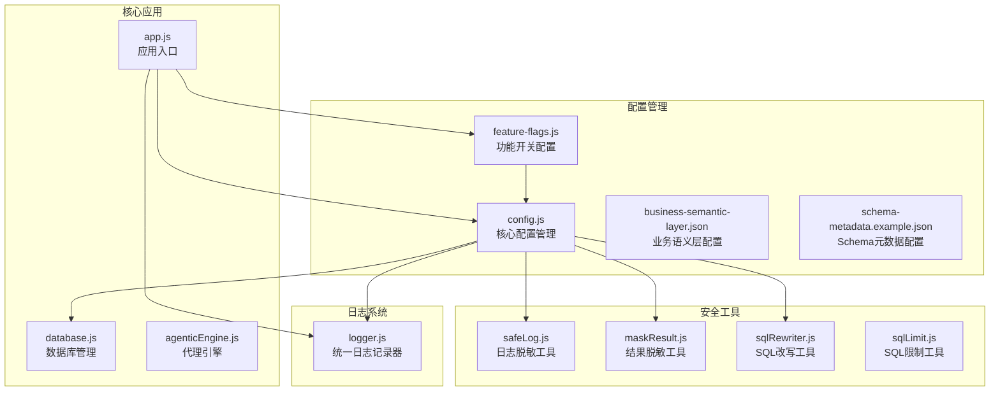
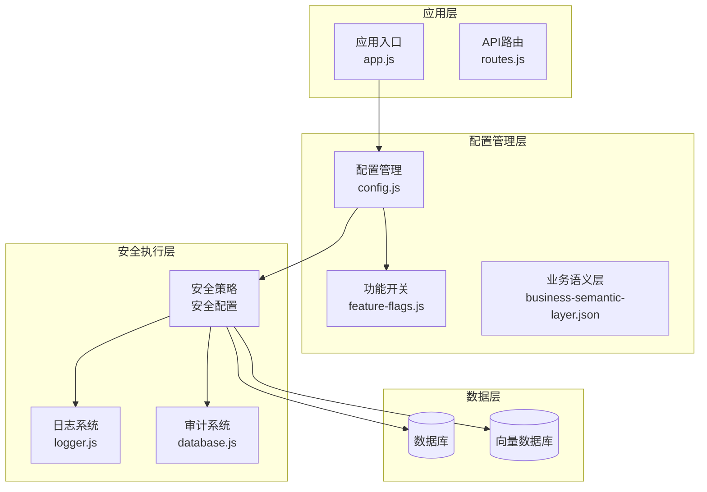
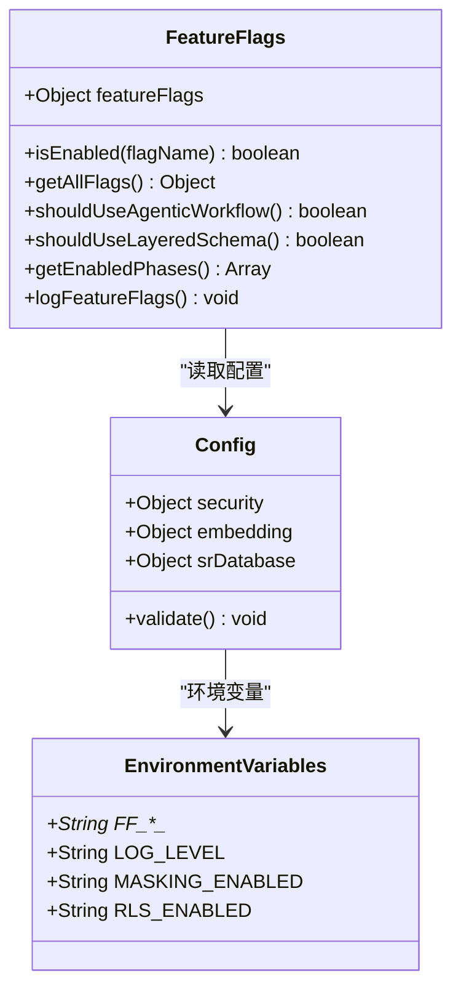
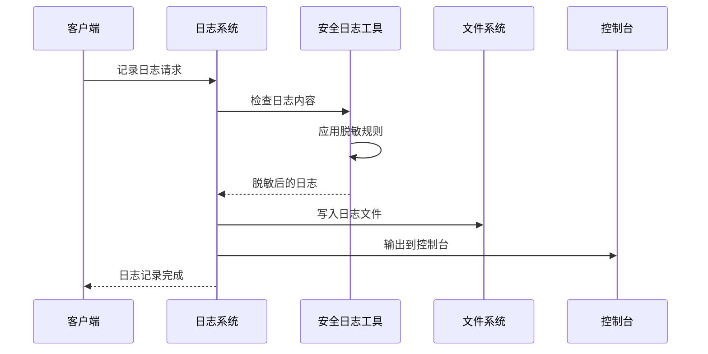
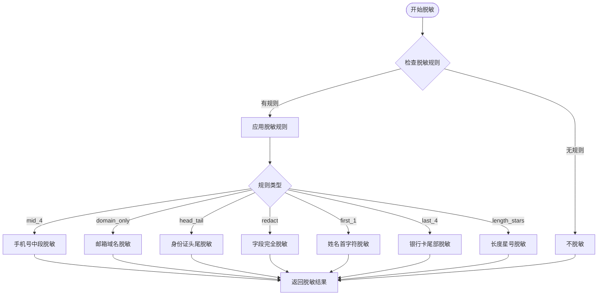
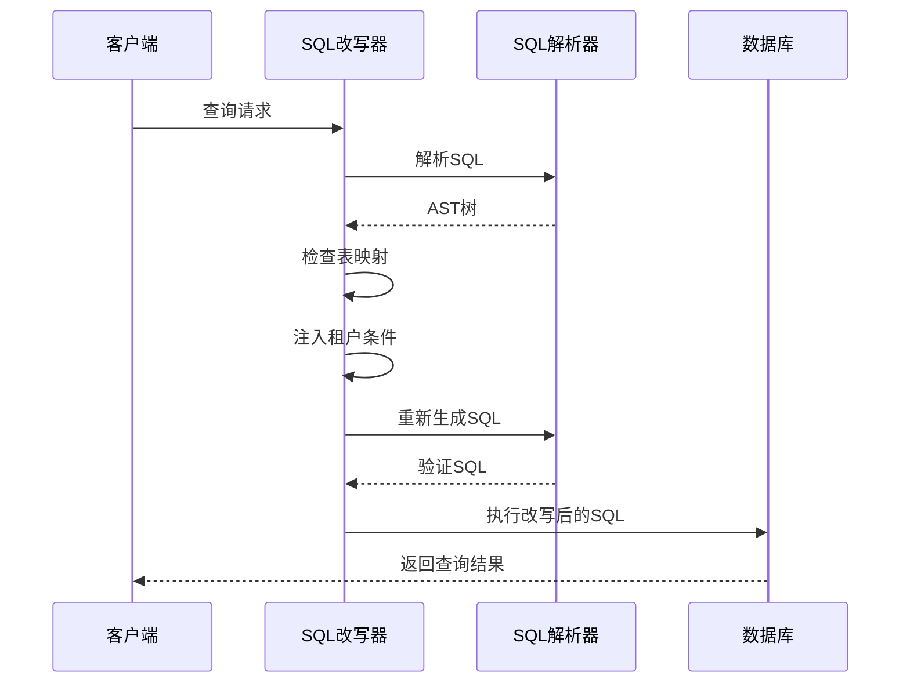
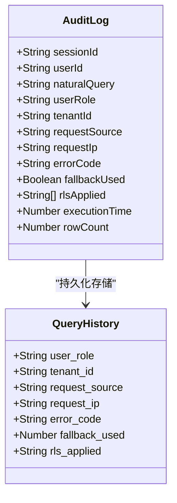
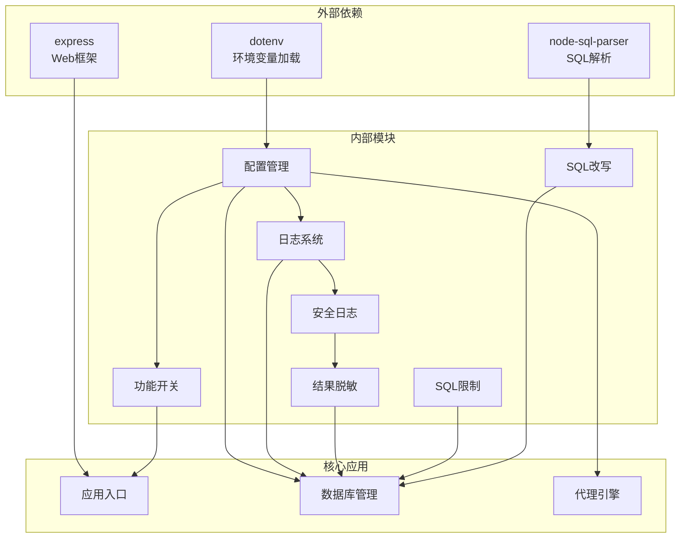
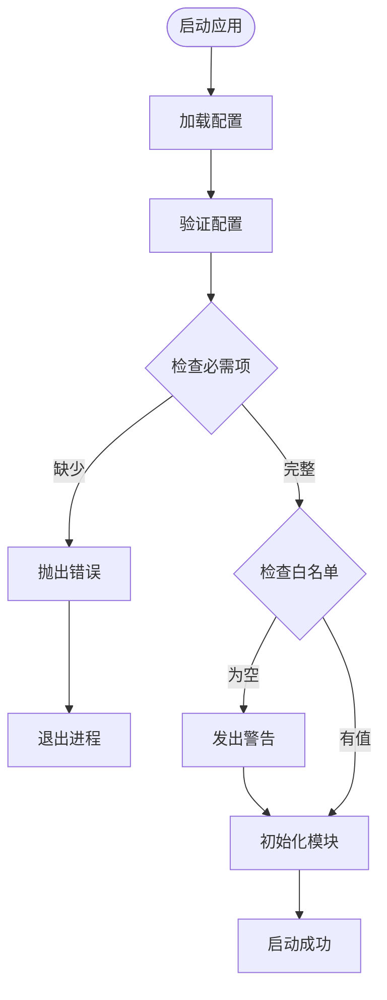

# 安全配置管理

<cite>
**本文档引用的文件**
- [feature-flags.js](file://backend/config/feature-flags.js)
- [config.js](file://backend/src/core/config.js)
- [logger.js](file://backend/src/utils/logger.js)
- [safeLog.js](file://backend/src/utils/safeLog.js)
- [maskResult.js](file://backend/src/utils/maskResult.js)
- [sqlRewriter.js](file://backend/src/utils/sqlRewriter.js)
- [sqlLimit.js](file://backend/src/utils/sqlLimit.js)
- [business-semantic-layer.json](file://backend/config/business-semantic-layer.json)
- [schema-metadata.example.json](file://backend/config/schema-metadata.example.json)
- [app.js](file://backend/src/app.js)
- [database.js](file://backend/src/core/database.js)
- [agenticEngine.js](file://backend/src/core/agenticEngine.js)
</cite>

## 目录
1. [简介](#简介)
2. [项目结构](#项目结构)
3. [核心组件](#核心组件)
4. [架构概览](#架构概览)
5. [详细组件分析](#详细组件分析)
6. [依赖关系分析](#依赖关系分析)
7. [性能考虑](#性能考虑)
8. [故障排除指南](#故障排除指南)
9. [结论](#结论)
10. [附录](#附录)

## 简介

NL2SQL 安全配置管理系统是一个综合性的安全防护框架，旨在为自然语言到SQL查询转换系统提供全方位的安全保障。该系统通过功能开关配置、安全策略设置、日志记录配置等核心管理功能，确保系统的安全性、可维护性和可审计性。

系统采用分层安全架构，包含功能开关控制、数据脱敏、行级权限控制、审计日志等多个安全层面，为不同环境和需求提供灵活的安全配置方案。

## 项目结构

NL2SQL 安全配置管理系统主要分布在以下目录结构中：



**图表来源**
- [feature-flags.js:1-294](file://backend/config/feature-flags.js#L1-L294)
- [config.js:1-439](file://backend/src/core/config.js#L1-L439)
- [logger.js:1-482](file://backend/src/utils/logger.js#L1-L482)

**章节来源**
- [feature-flags.js:1-294](file://backend/config/feature-flags.js#L1-L294)
- [config.js:1-439](file://backend/src/core/config.js#L1-L439)

## 核心组件

### 功能开关管理系统

功能开关系统是NL2SQL安全配置的核心，提供了灵活的功能控制机制：

| 功能类别 | 开关名称 | 默认状态 | 描述 |
|---------|----------|----------|------|
| 引擎切换 | AGENTIC_ENGINE | false | 启用代理引擎工作流 |
| 引擎切换 | AGENTIC_AUTO_FALLBACK | true | 代理引擎失败自动回退 |
| 数据脱敏 | RESULT_MASKING | true | 查询结果脱敏功能 |
| 行级权限 | RLS_ENFORCEMENT | false | 行级权限控制 |
| 审计日志 | AUDIT_LOG_EXTENDED | true | 扩展审计字段 |
| 统一排序 | UNIFIED_RANKER | true | 统一表候选排序器 |
| 全局控制 | ENABLE_ALL_FEATURES | false | 启用所有功能 |
| 全局控制 | DISABLE_ALL_FEATURES | false | 禁用所有功能 |

### 安全配置管理

安全配置系统提供了多层次的安全防护：

| 配置类别 | 关键参数 | 默认值 | 作用范围 |
|---------|----------|--------|----------|
| 白名单控制 | allowedTables | 空数组 | 表访问控制 |
| 干运行模式 | dryRun | false | SQL生成但不执行 |
| 查询限制 | maxQueryRows | 1000 | 结果集大小限制 |
| 超时控制 | queryTimeout | 30000ms | 查询执行超时 |
| 关键字过滤 | forbiddenKeywords | UPDATE/DELETE等 | SQL注入防护 |
| 脱敏规则 | masking.rules | 多种规则 | 敏感数据脱敏 |
| RLS配置 | rls.enabled | false | 行级权限控制 |

**章节来源**
- [feature-flags.js:16-141](file://backend/config/feature-flags.js#L16-L141)
- [config.js:153-211](file://backend/src/core/config.js#L153-L211)

## 架构概览

NL2SQL安全配置管理系统采用分层架构设计，确保各层之间的职责分离和安全隔离：



**图表来源**
- [app.js:39-52](file://backend/src/app.js#L39-L52)
- [config.js:20-396](file://backend/src/core/config.js#L20-L396)

## 详细组件分析

### 功能开关实现机制

功能开关系统采用环境变量驱动的设计，提供了灵活的功能控制能力：



**图表来源**
- [feature-flags.js:153-294](file://backend/config/feature-flags.js#L153-L294)
- [config.js:20-396](file://backend/src/core/config.js#L20-L396)

#### 功能开关优先级机制

功能开关系统实现了严格的优先级控制：

1. **全局禁用优先级**：DISABLE_ALL_FEATURES 为最高优先级
2. **全局启用次优先级**：ENABLE_ALL_FEATURES 次之
3. **具体开关**：最终权衡具体开关状态

这种设计确保了紧急情况下能够快速禁用所有功能，同时保持系统的可控性。

**章节来源**
- [feature-flags.js:153-166](file://backend/config/feature-flags.js#L153-L166)

### 日志安全系统

日志安全系统提供了多层次的日志保护机制：



**图表来源**
- [logger.js:246-264](file://backend/src/utils/logger.js#L246-L264)
- [safeLog.js:20-64](file://backend/src/utils/safeLog.js#L20-L64)

#### 日志脱敏策略

日志系统采用了严格的数据脱敏策略：

| 脱敏级别 | 应用场景 | 脱敏方式 |
|---------|----------|----------|
| Prompt脱敏 | 用户查询和提示词 | 哈希摘要、长度限制 |
| 结果脱敏 | 查询结果 | 列规则脱敏、部分隐藏 |
| 审计脱敏 | 审计日志 | 敏感字段过滤、脱敏处理 |
| 系统日志 | 系统运行日志 | 标准化格式、级别控制 |

**章节来源**
- [safeLog.js:1-71](file://backend/src/utils/safeLog.js#L1-L71)
- [logger.js:1-482](file://backend/src/utils/logger.js#L1-L482)

### 数据脱敏系统

数据脱敏系统提供了多种脱敏规则和策略：



**图表来源**
- [maskResult.js:131-184](file://backend/src/utils/maskResult.js#L131-L184)

#### 脱敏规则矩阵

| 规则名称 | 适用字段 | 脱敏效果 | 使用场景 |
|---------|----------|----------|----------|
| mid_4 | phone, mobile | 138****5678 | 手机号脱敏 |
| domain_only | email | ***@example.com | 邮箱脱敏 |
| head_tail | id_card, idcard | 110101*********234 | 身份证脱敏 |
| redact | password, token, secret | *** | 敏感令牌脱敏 |
| first_1 | name | 张* | 姓名脱敏 |
| last_4 | credit_card | ************1234 | 银行卡脱敏 |
| length_stars | 其他 | *** | 通用脱敏 |

**章节来源**
- [maskResult.js:19-91](file://backend/src/utils/maskResult.js#L19-L91)

### 行级权限控制系统

行级权限控制系统提供了细粒度的数据访问控制：



**图表来源**
- [sqlRewriter.js:40-127](file://backend/src/utils/sqlRewriter.js#L40-L127)

#### RLS配置策略

| 配置项 | 类型 | 默认值 | 说明 |
|-------|------|--------|------|
| RLS_ENABLED | 布尔值 | false | 启用行级权限控制 |
| RLS_TABLE_TENANT_MAP | 对象 | {} | 表到租户列映射 |
| FF_RLS_ENFORCEMENT | 功能开关 | false | RLS强制执行开关 |
| tenantId | 字符串 | 必需 | 租户标识符 |
| tableTenantMap | 对象 | 映射表 | 表权限配置 |

**章节来源**
- [sqlRewriter.js:15-232](file://backend/src/utils/sqlRewriter.js#L15-L232)
- [config.js:207-210](file://backend/src/core/config.js#L207-L210)

### 审计日志系统

审计日志系统提供了完整的查询跟踪和审计能力：



**图表来源**
- [database.js:123-139](file://backend/src/core/database.js#L123-L139)

#### 审计字段设计

| 字段名称 | 数据类型 | 描述 | 必填性 |
|---------|----------|------|--------|
| user_role | TEXT | 用户角色(admin/analyst/user) | 可选 |
| tenant_id | TEXT | 租户ID | 可选 |
| request_source | TEXT | 请求来源(web/cli/api) | 可选 |
| request_ip | TEXT | 请求IP地址 | 可选 |
| error_code | TEXT | 结构化错误码 | 可选 |
| fallback_used | INTEGER | 是否使用回退机制 | 可选 |
| rls_applied | TEXT | RLS改写命中的表列表 | 可选 |

**章节来源**
- [database.js:110-145](file://backend/src/core/database.js#L110-L145)

## 依赖关系分析

NL2SQL安全配置管理系统具有清晰的依赖关系结构：



**图表来源**
- [app.js:15-16](file://backend/src/app.js#L15-L16)
- [config.js:14](file://backend/src/core/config.js#L14)
- [sqlRewriter.js:15-20](file://backend/src/utils/sqlRewriter.js#L15-L20)

### 模块耦合分析

系统采用了松耦合的设计原则：

1. **配置中心化**：所有配置通过config.js统一管理
2. **功能模块化**：安全功能独立为工具模块
3. **依赖注入**：通过环境变量和配置文件注入依赖
4. **接口标准化**：各模块提供标准化的接口

**章节来源**
- [config.js:20-396](file://backend/src/core/config.js#L20-L396)

## 性能考虑

NL2SQL安全配置管理系统在设计时充分考虑了性能影响：

### 功能开关性能影响

| 功能 | 性能影响 | 优化建议 |
|------|----------|----------|
| 功能开关检查 | O(1) | 缓存开关状态 |
| 日志脱敏 | O(n) | 批量处理，避免重复计算 |
| 结果脱敏 | O(m×n) | 优化规则匹配算法 |
| SQL改写 | O(p×q) | AST缓存，增量改写 |
| 审计日志 | O(1) | 异步写入，批量提交 |

### 内存使用优化

- **配置缓存**：功能开关状态缓存，避免重复计算
- **日志缓冲**：批量写入日志，减少I/O操作
- **脱敏规则缓存**：规则映射表缓存，提高匹配效率
- **SQL AST缓存**：改写后的SQL AST缓存，避免重复解析

### 网络性能优化

- **异步审计**：审计日志异步写入，不影响查询响应
- **连接池管理**：数据库连接池复用，减少连接建立开销
- **向量查询优化**：LanceDB向量数据库优化查询性能

## 故障排除指南

### 常见配置问题

#### 功能开关配置问题

**问题**：功能开关不生效
**排查步骤**：
1. 检查环境变量设置
2. 验证功能开关优先级
3. 确认配置文件加载

**解决方案**：
```bash
# 检查功能开关状态
export FF_RESULT_MASKING=true
export FF_RLS_ENFORCEMENT=false
export FF_AGENTIC_AUTO_FALLBACK=true
```

#### 日志脱敏问题

**问题**：日志脱敏不正确
**排查步骤**：
1. 检查safeLog配置
2. 验证脱敏规则
3. 确认日志级别设置

**解决方案**：
```javascript
// 临时启用完整日志（仅开发环境）
process.env.LOG_PROMPT_FULL = 'true';
```

#### SQL改写失败

**问题**：RLS改写失败
**排查步骤**：
1. 检查SQL语法
2. 验证表映射配置
3. 确认租户ID传递

**解决方案**：
```sql
-- 检查表映射配置
RLS_TABLE_TENANT_MAP="orders:tenant_id,users:user_id"
```

### 性能问题诊断

#### 配置验证

系统提供了完整的配置验证机制：



**图表来源**
- [config.js:407-429](file://backend/src/core/config.js#L407-L429)

#### 错误处理机制

系统实现了多层次的错误处理：

1. **配置错误**：启动时验证，立即发现配置问题
2. **运行时错误**：捕获异常，优雅降级
3. **安全错误**：记录审计日志，通知管理员

**章节来源**
- [config.js:407-439](file://backend/src/core/config.js#L407-L439)

## 结论

NL2SQL安全配置管理系统通过多层次的安全防护和灵活的配置管理，为自然语言到SQL查询转换系统提供了全面的安全保障。系统的主要特点包括：

### 核心优势

1. **分层安全架构**：从功能开关到数据脱敏，多层防护
2. **灵活配置管理**：环境变量驱动，支持动态配置更新
3. **完整审计能力**：详细的查询跟踪和审计日志
4. **性能优化设计**：缓存机制和异步处理提升性能
5. **故障恢复机制**：自动回退和优雅降级

### 最佳实践建议

1. **生产环境配置**
   - 启用所有安全功能开关
   - 配置严格的表白名单
   - 启用行级权限控制
   - 配置完整的审计字段

2. **配置变更管理**
   - 使用功能开关进行渐进式部署
   - 建立配置变更审批流程
   - 实施配置版本管理和回滚机制
   - 进行充分的测试和验证

3. **监控和告警**
   - 建立安全事件监控
   - 配置异常行为告警
   - 定期安全审计和评估
   - 建立应急响应机制

该系统为NL2SQL平台提供了坚实的安全基础，确保在复杂的数据查询环境中保持系统的安全性、可靠性和合规性。

## 附录

### 配置示例

#### 基础配置示例

```json
{
  "security": {
    "allowedTables": ["users", "orders", "products"],
    "dryRun": false,
    "maxQueryRows": 1000,
    "queryTimeout": 30000,
    "forbiddenKeywords": ["UPDATE", "DELETE", "DROP"]
  }
}
```

#### 功能开关配置示例

```bash
# 启用代理引擎
export FF_AGENTIC_ENGINE=true

# 启用结果脱敏
export FF_RESULT_MASKING=true

# 启用行级权限
export FF_RLS_ENFORCEMENT=true

# 启用扩展审计
export FF_AUDIT_LOG_EXTENDED=true
```

#### RLS配置示例

```bash
# 行级权限配置
export RLS_ENABLED=true
export RLS_TABLE_TENANT_MAP="orders:tenant_id,users:user_id"
```

### 安全配置检查清单

- [ ] 功能开关配置完整
- [ ] 安全规则验证通过
- [ ] 审计日志配置正确
- [ ] 性能监控设置完成
- [ ] 应急预案准备就绪