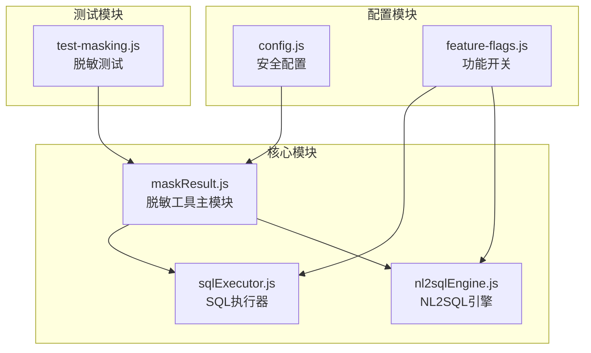
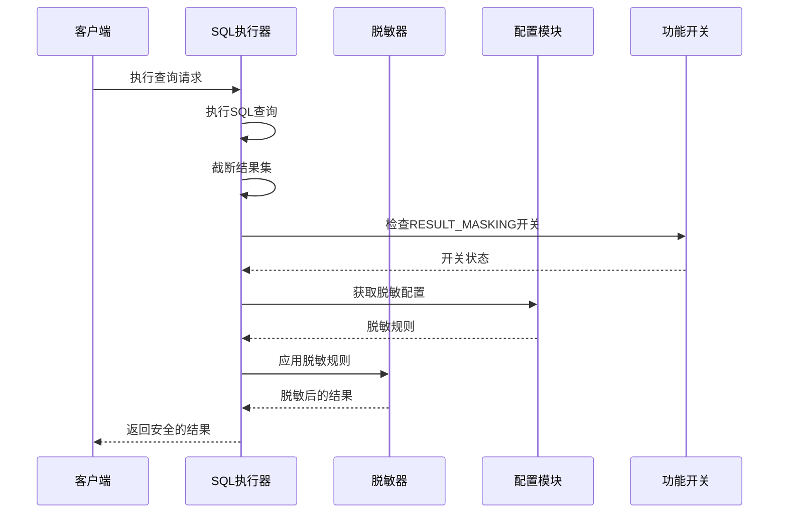
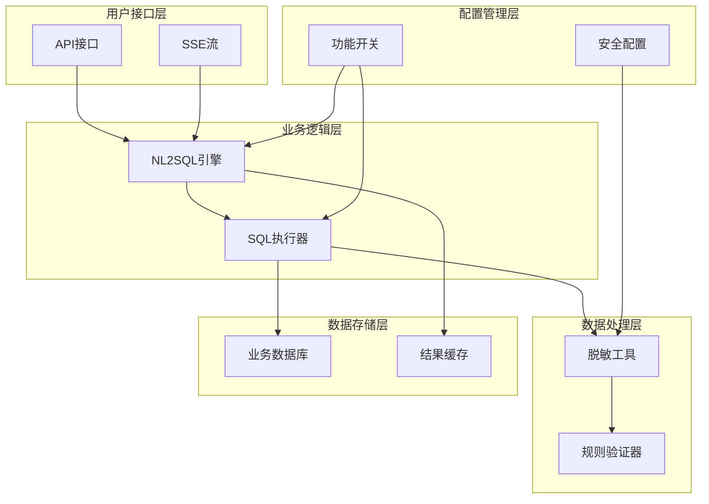
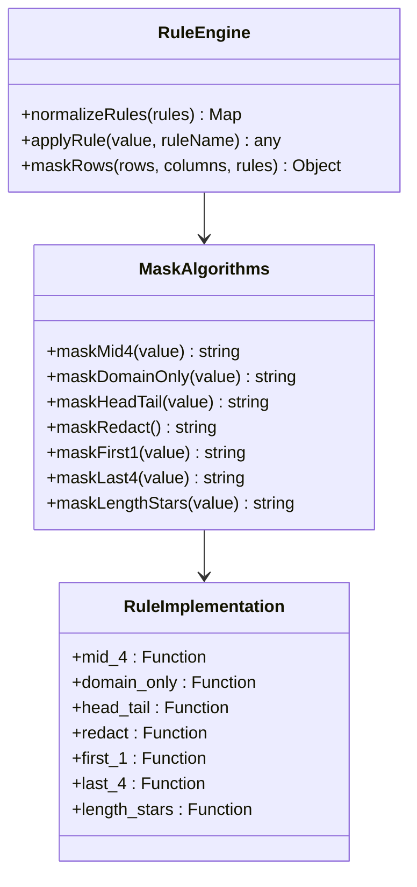
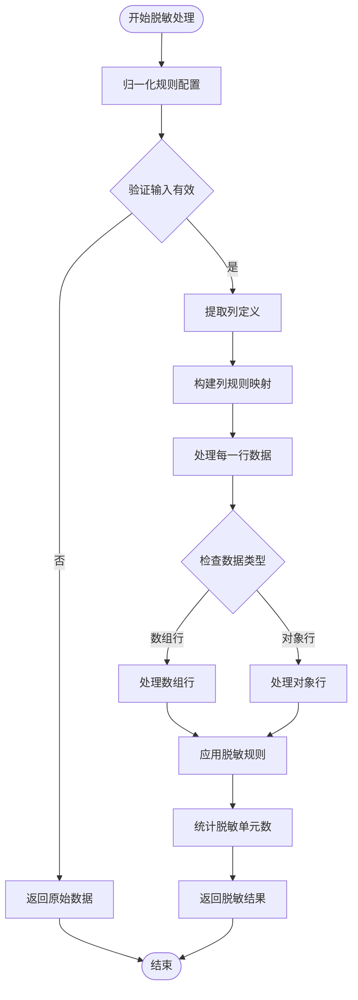
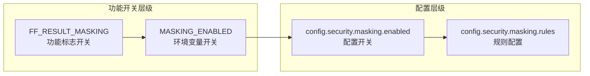
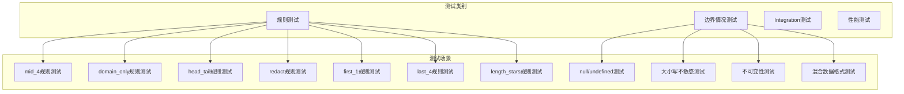
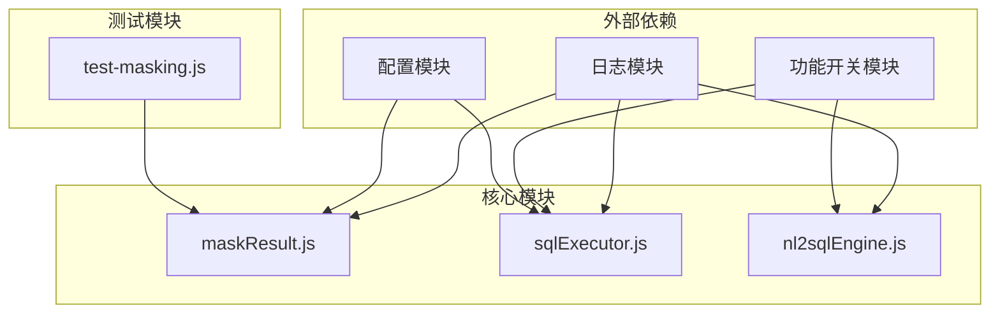
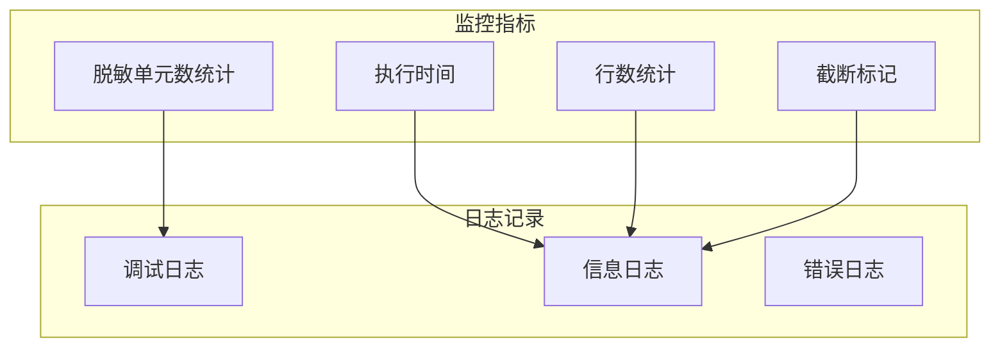

# 结果脱敏机制

<cite>
**本文档引用的文件**
- [maskResult.js](file://backend/src/utils/maskResult.js)
- [test-masking.js](file://backend/test/phase3/test-masking.js)
- [config.js](file://backend/src/core/config.js)
- [sqlExecutor.js](file://backend/src/core/sqlExecutor.js)
- [feature-flags.js](file://backend/config/feature-flags.js)
- [nl2sqlEngine.js](file://backend/src/core/nl2sqlEngine.js)
</cite>

## 目录
1. [简介](#简介)
2. [项目结构](#项目结构)
3. [核心组件](#核心组件)
4. [架构概览](#架构概览)
5. [详细组件分析](#详细组件分析)
6. [依赖关系分析](#依赖关系分析)
7. [性能考虑](#性能考虑)
8. [故障排除指南](#故障排除指南)
9. [结论](#结论)

## 简介

NL2SQL 结果脱敏机制是一个专门设计的安全防护系统，用于在自然语言查询转换为 SQL 查询并返回给用户之前，对敏感数据进行保护性处理。该机制实现了多种脱敏算法，支持字段级别的精确控制，并通过两级开关确保系统的灵活性和可控性。

本系统的核心目标是在保证数据可用性的前提下，最大限度地保护用户的隐私信息，包括但不限于手机号、邮箱地址、身份证号码、银行卡号、密码和访问令牌等敏感字段。

## 项目结构

NL2SQL 项目的脱敏机制主要分布在以下关键文件中：

**图表来源**
- [maskResult.js:1-198](file://backend/src/utils/maskResult.js#L1-L198)
- [sqlExecutor.js:1-175](file://backend/src/core/sqlExecutor.js#L1-L175)
- [config.js:140-211](file://backend/src/core/config.js#L140-L211)

**章节来源**
- [maskResult.js:1-198](file://backend/src/utils/maskResult.js#L1-L198)
- [config.js:140-211](file://backend/src/core/config.js#L140-L211)

## 核心组件

### 脱敏工具主模块 (maskResult.js)

脱敏工具是整个系统的核心，提供了完整的脱敏算法实现和规则管理功能。该模块采用纯函数设计，确保不可变性和线程安全。

#### 主要功能特性

1. **规则驱动架构**: 基于配置文件定义的规则进行脱敏处理
2. **多格式支持**: 同时支持对象行和数组行两种数据格式
3. **大小写不敏感**: 列名匹配不区分大小写
4. **不可变性**: 不修改原始数据，返回新数组
5. **智能降级**: 当规则不适用时自动降级到安全的替代方案

#### 脱敏算法实现

系统实现了七种不同的脱敏算法，每种算法针对特定类型的敏感数据进行了优化：

| 规则名称 | 适用场景 | 算法描述 | 示例输出 |
|---------|----------|----------|----------|
| `mid_4` | 手机号码 | 保留前3位和后4位，中间用4个星号替换 | `138****5678` |
| `domain_only` | 邮箱地址 | 仅脱敏邮箱用户名部分 | `***@example.com` |
| `head_tail` | 身份证号码 | 保留前6位和后3位 | `110101*********234` |
| `redact` | 密码/令牌 | 完全替换为 `***` | `***` |
| `first_1` | 中文姓名 | 仅保留第一个字符 | `张*` |
| `last_4` | 银行卡号 | 仅保留最后4位 | `************1234` |
| `length_stars` | 长度重要字段 | 保持原长度但全部替换为星号 | `***` |

**章节来源**
- [maskResult.js:19-81](file://backend/src/utils/maskResult.js#L19-L81)
- [maskResult.js:83-91](file://backend/src/utils/maskResult.js#L83-L91)

### 安全配置模块 (config.js)

安全配置模块定义了脱敏机制的全局配置参数，包括默认规则、启用状态和环境变量控制。

#### 配置参数详解

1. **敏感字段白名单**: 保留向后兼容的敏感字段列表
2. **脱敏规则配置**: 定义了10条默认的字段到规则映射
3. **两级开关控制**: 
   - 功能标志开关 (FF_RESULT_MASKING)
   - 环境变量开关 (MASKING_ENABLED)

#### 默认脱敏规则

系统预设了针对常见敏感数据类型的脱敏规则：

- **电话号码**: `phone` 和 `mobile` → `mid_4`
- **邮箱地址**: `email` → `domain_only`
- **身份证号码**: `id_card` 和 `idcard` → `head_tail`
- **金融敏感信息**: `credit_card`、`creditcard`、`password`、`secret`、`token` → `redact`

**章节来源**
- [config.js:178-202](file://backend/src/core/config.js#L178-L202)

### SQL执行器集成 (sqlExecutor.js)

SQL执行器负责在查询执行完成后对结果进行脱敏处理，确保敏感数据在返回给客户端之前得到保护。

#### 脱敏执行时机

脱敏处理发生在以下时机：
1. 查询执行完成后
2. 结果集截断之前
3. 在功能开关验证之后

#### 执行流程

**图表来源**
- [sqlExecutor.js:122-135](file://backend/src/core/sqlExecutor.js#L122-L135)

**章节来源**
- [sqlExecutor.js:122-135](file://backend/src/core/sqlExecutor.js#L122-L135)

## 架构概览

NL2SQL 脱敏机制的整体架构采用了分层设计，确保了系统的模块化和可维护性：

**图表来源**
- [nl2sqlEngine.js:557-756](file://backend/src/core/nl2sqlEngine.js#L557-L756)
- [sqlExecutor.js:1-175](file://backend/src/core/sqlExecutor.js#L1-L175)

## 详细组件分析

### 脱敏算法实现分析

#### 规则引擎设计

脱敏系统采用规则驱动的设计模式，通过 `RULE_IMPL` 映射表实现算法的动态绑定：

**图表来源**
- [maskResult.js:83-91](file://backend/src/utils/maskResult.js#L83-L91)
- [maskResult.js:102-121](file://backend/src/utils/maskResult.js#L102-L121)

#### 数据处理流程

脱敏处理的核心流程包括三个主要步骤：

1. **规则归一化**: 将规则配置转换为大小写不敏感的映射表
2. **列规则匹配**: 基于列名确定需要脱敏的字段
3. **值脱敏应用**: 对匹配的字段应用相应的脱敏算法

**图表来源**
- [maskResult.js:131-184](file://backend/src/utils/maskResult.js#L131-L184)

**章节来源**
- [maskResult.js:131-184](file://backend/src/utils/maskResult.js#L131-L184)

### 配置管理机制

#### 两级开关控制系统

NL2SQL 采用了双重控制机制来确保脱敏功能的可控性：

**图表来源**
- [feature-flags.js:92-97](file://backend/config/feature-flags.js#L92-L97)
- [config.js:188-202](file://backend/src/core/config.js#L188-L202)

#### 配置优先级规则

当多个配置源同时存在时，系统遵循以下优先级规则：

1. **功能标志开关** (FF_RESULT_MASKING): 反向默认 true
2. **环境变量开关** (MASKING_ENABLED): 反向默认 true  
3. **配置文件开关** (config.security.masking.enabled): 默认 true
4. **规则配置**: 由配置文件定义的默认规则

**章节来源**
- [feature-flags.js:92-97](file://backend/config/feature-flags.js#L92-L97)
- [config.js:188-202](file://backend/src/core/config.js#L188-L202)

### 测试覆盖分析

#### 单元测试设计

脱敏机制的测试覆盖了所有核心功能和边界情况：

**图表来源**
- [test-masking.js:1-176](file://backend/test/phase3/test-masking.js#L1-L176)

**章节来源**
- [test-masking.js:1-176](file://backend/test/phase3/test-masking.js#L1-L176)

## 依赖关系分析

### 模块间依赖关系

NL2SQL 脱敏机制的模块间依赖关系体现了清晰的分层架构：

**图表来源**
- [maskResult.js:15-19](file://backend/src/utils/maskResult.js#L15-L19)
- [sqlExecutor.js:15-28](file://backend/src/core/sqlExecutor.js#L15-L28)

### 关键依赖分析

#### 内部依赖关系

1. **maskResult.js** 作为核心依赖被多个模块引用
2. **feature-flags.js** 提供运行时控制能力
3. **config.js** 提供静态配置信息

#### 外部依赖影响

脱敏机制对外部依赖的使用非常有限，主要依赖包括：
- 日志记录模块用于调试和监控
- 功能开关模块用于运行时控制
- 配置模块用于参数管理

**章节来源**
- [maskResult.js:15-19](file://backend/src/utils/maskResult.js#L15-L19)
- [sqlExecutor.js:15-28](file://backend/src/core/sqlExecutor.js#L15-L28)

## 性能考虑

### 时间复杂度分析

脱敏算法的时间复杂度为 O(n×m)，其中：
- n = 行数
- m = 每行的列数

对于大型结果集，系统采用了以下优化策略：

1. **延迟处理**: 仅对需要脱敏的列进行处理
2. **智能缓存**: 预计算列规则映射减少重复查找
3. **不可变性**: 通过浅拷贝避免深度复制的开销

### 内存使用优化

1. **流式处理**: 支持大数据集的分批处理
2. **引用传递**: 对于不需要脱敏的列直接传递引用
3. **规则缓存**: 避免重复的规则解析和验证

## 故障排除指南

### 常见问题诊断

#### 脱敏功能未生效

**可能原因**:
1. 功能开关被禁用
2. 配置文件中的规则不匹配
3. 数据格式不符合预期

**排查步骤**:
1. 检查 `FF_RESULT_MASKING` 开关状态
2. 验证 `MASKING_ENABLED` 环境变量设置
3. 确认列名大小写与规则配置一致
4. 验证数据格式是否为对象行或数组行

#### 脱敏规则不正确

**可能原因**:
1. 规则名称拼写错误
2. 规则不适用于特定数据类型
3. 数据值为 null 或 undefined

**解决方法**:
1. 检查规则名称是否在 `RULE_IMPL` 中定义
2. 确认数据类型与规则要求匹配
3. 验证 null/undefined 值的处理逻辑

### 监控和审计

系统提供了完善的监控机制来跟踪脱敏操作：

**章节来源**
- [sqlExecutor.js:132-145](file://backend/src/core/sqlExecutor.js#L132-L145)

## 结论

NL2SQL 结果脱敏机制通过精心设计的架构和实现，为自然语言查询系统提供了全面的敏感数据保护解决方案。该系统的主要优势包括：

### 技术优势

1. **模块化设计**: 清晰的分层架构便于维护和扩展
2. **规则驱动**: 灵活的配置机制支持定制化的脱敏需求
3. **性能优化**: 高效的算法实现确保大规模数据处理的可行性
4. **安全可靠**: 多层防护机制确保敏感数据的绝对安全

### 实施建议

1. **定制化配置**: 根据业务需求调整脱敏规则
2. **监控完善**: 建立完善的监控体系跟踪脱敏效果
3. **定期审计**: 定期审查脱敏策略的有效性
4. **性能调优**: 根据实际使用情况进行性能优化

该脱敏机制为 NL2SQL 系统提供了坚实的安全基础，确保在提供便捷查询服务的同时，充分保护用户的隐私和数据安全。