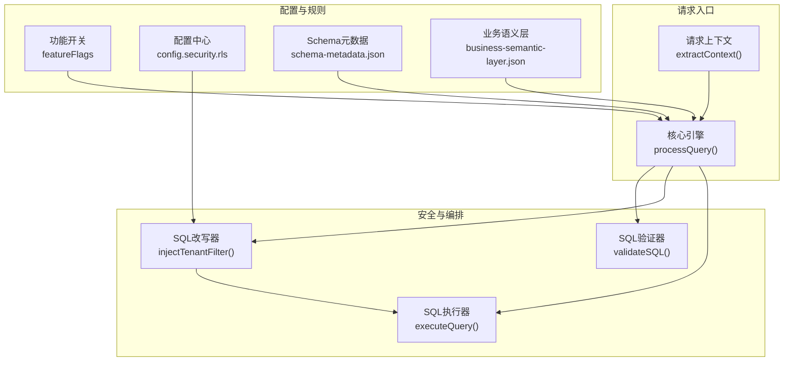
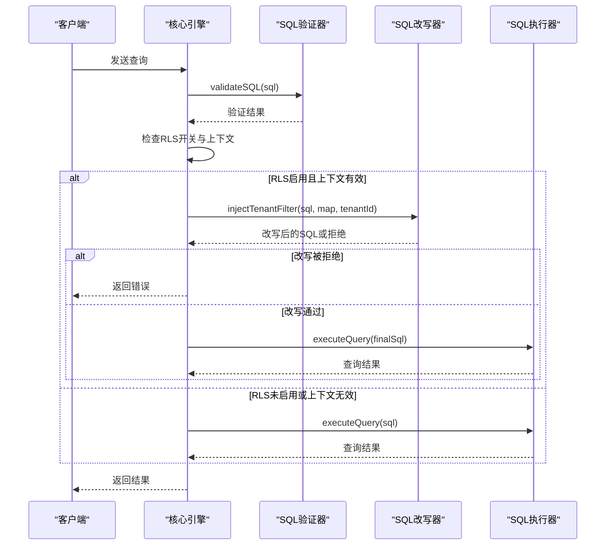
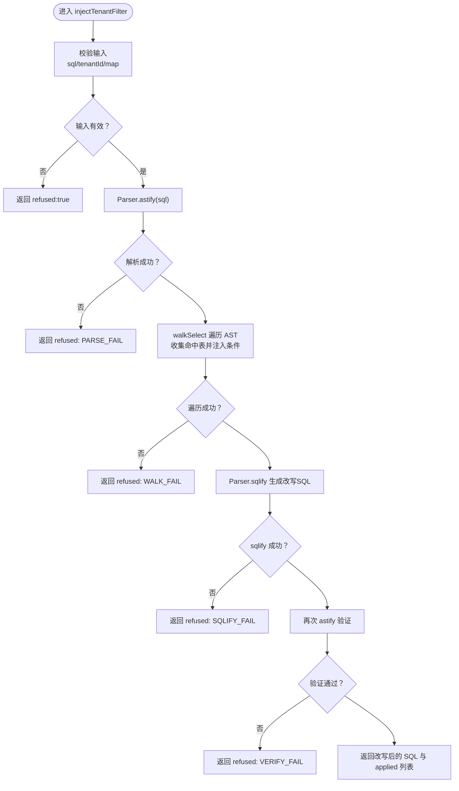
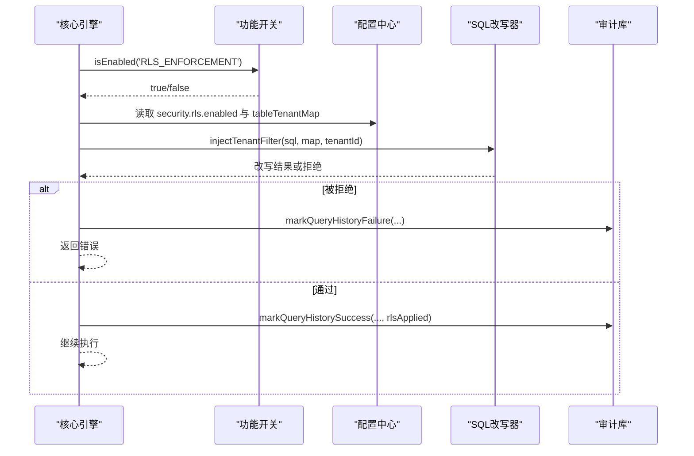
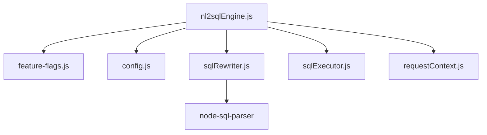

# 行级权限控制

<cite>
**本文档引用的文件**
- [sqlRewriter.js](file://backend/src/utils/sqlRewriter.js)
- [nl2sqlEngine.js](file://backend/src/core/nl2sqlEngine.js)
- [requestContext.js](file://backend/src/core/requestContext.js)
- [sqlExecutor.js](file://backend/src/core/sqlExecutor.js)
- [config.js](file://backend/src/core/config.js)
- [feature-flags.js](file://backend/config/feature-flags.js)
- [schema-metadata.json](file://backend/config/schema-metadata.json)
- [business-semantic-layer.json](file://backend/config/business-semantic-layer.json)
- [test-sqlRewriter.js](file://backend/test/phase3/test-sqlRewriter.js)
</cite>

## 目录
1. [简介](#简介)
2. [项目结构](#项目结构)
3. [核心组件](#核心组件)
4. [架构总览](#架构总览)
5. [详细组件分析](#详细组件分析)
6. [依赖分析](#依赖分析)
7. [性能考虑](#性能考虑)
8. [故障排查指南](#故障排查指南)
9. [结论](#结论)
10. [附录](#附录)

## 简介
本技术文档聚焦 NL2SQL 行级权限控制（RLS）系统，围绕租户隔离机制展开，深入解析权限验证流程、访问控制策略、SQL 改写机制等核心功能。文档详细说明 RLS 规则的定义方式、配置方法和执行时机，阐述如何在查询执行前自动添加权限过滤条件，确保数据访问的安全性和合规性。同时提供 RLS 配置的最佳实践与常见问题解决方案，面向系统管理员与安全工程师，给出完整的实现指南。

## 项目结构
NL2SQL 后端采用模块化分层架构，RLS 作为安全增强模块位于“查询生成”之后、“执行”之前，通过 AST 遍历对命中规则的表自动注入租户过滤条件。关键文件与职责如下：
- backend/src/utils/sqlRewriter.js：RLS SQL 改写工具，负责解析 SQL、遍历 AST、注入租户过滤条件并进行二次验证。
- backend/src/core/nl2sqlEngine.js：核心编排引擎，负责流程编排、调用 RLS 改写、执行 SQL、结果格式化与审计。
- backend/src/core/requestContext.js：请求上下文提取，从 HTTP 请求中抽取标准化上下文（含租户 ID）。
- backend/src/core/sqlExecutor.js：SQL 执行模块，负责 SQL 安全性验证与执行。
- backend/src/core/config.js：集中配置管理，包含 RLS 配置项与安全策略。
- backend/config/feature-flags.js：功能开关，控制 RLS 是否启用。
- backend/config/schema-metadata.json：Schema 元数据，定义表与字段结构。
- backend/config/business-semantic-layer.json：业务语义层配置，定义业务概念与映射。
- backend/test/phase3/test-sqlRewriter.js：RLS 单元测试，覆盖多种 SQL 场景与边界条件。

图表来源
- [nl2sqlEngine.js:508-544](file://backend/src/core/nl2sqlEngine.js#L508-L544)
- [sqlRewriter.js:40-127](file://backend/src/utils/sqlRewriter.js#L40-L127)
- [config.js:204-211](file://backend/src/core/config.js#L204-L211)
- [feature-flags.js:99-107](file://backend/config/feature-flags.js#L99-L107)

章节来源
- [nl2sqlEngine.js:111-734](file://backend/src/core/nl2sqlEngine.js#L111-L734)
- [sqlRewriter.js:1-232](file://backend/src/utils/sqlRewriter.js#L1-L232)
- [config.js:204-211](file://backend/src/core/config.js#L204-L211)
- [feature-flags.js:99-107](file://backend/config/feature-flags.js#L99-L107)

## 核心组件
- SQL 改写器（sqlRewriter）：基于 node-sql-parser 的 AST 遍历，对命中 tableTenantMap 的表在 WHERE 子句追加租户过滤条件，支持单表、JOIN、UNION、CTE、FROM 子查询等复杂结构；改写后进行二次 AST 验证，确保 SQL 合法性。
- 请求上下文（requestContext）：从 HTTP 请求头中提取标准化上下文，包括用户 ID、用户角色、租户 ID、请求来源与 IP；租户 ID 为空时，RLS 将拒绝执行。
- 编排引擎（nl2sqlEngine）：在 SQL 生成并通过安全验证后，调用 RLS 改写器注入租户过滤条件；若改写被拒绝，立即中止执行并返回错误。
- 安全配置（config）：集中管理 RLS 开关、映射表与租户列；默认关闭，需显式启用并配置映射表。
- 功能开关（feature-flags）：RLS_ENFORCEMENT 控制是否启用 RLS 改写，RLS_ENABLED 控制配置是否生效，二者共同决定 RLS 是否参与编排。

章节来源
- [sqlRewriter.js:24-127](file://backend/src/utils/sqlRewriter.js#L24-L127)
- [requestContext.js:25-44](file://backend/src/core/requestContext.js#L25-L44)
- [nl2sqlEngine.js:508-544](file://backend/src/core/nl2sqlEngine.js#L508-L544)
- [config.js:204-211](file://backend/src/core/config.js#L204-L211)
- [feature-flags.js:99-107](file://backend/config/feature-flags.js#L99-L107)

## 架构总览
RLS 在 NL2SQL 查询生命周期中的位置如下：
- SQL 生成完成后，先进行安全验证（validateSQL）。
- 若启用 RLS，调用 injectTenantFilter 对命中规则的表注入租户过滤条件。
- 执行最终 SQL，返回结果并进行脱敏与审计。

图表来源
- [nl2sqlEngine.js:486-552](file://backend/src/core/nl2sqlEngine.js#L486-L552)
- [sqlRewriter.js:40-127](file://backend/src/utils/sqlRewriter.js#L40-L127)
- [sqlExecutor.js:34-66](file://backend/src/core/sqlExecutor.js#L34-L66)

章节来源
- [nl2sqlEngine.js:486-552](file://backend/src/core/nl2sqlEngine.js#L486-L552)
- [sqlRewriter.js:40-127](file://backend/src/utils/sqlRewriter.js#L40-L127)
- [sqlExecutor.js:34-66](file://backend/src/core/sqlExecutor.js#L34-L66)

## 详细组件分析

### SQL 改写器（sqlRewriter）
- 功能概述：在 SQL 通过 validateSQL 后、真实执行前，基于 AST 遍历对命中 tableTenantMap 的表在 WHERE 子句追加 `<alias>.<tenantCol> = '<tenantId>'`。
- 关键设计约束：
  - 解析失败、sqlify 失败、AST 无法识别 → 全部 refused:true，上游中止执行，绝不静默跳过。
  - 覆盖：单表 SELECT、JOIN（多个 from 项）、UNION（_next 链）、CTE（with）、FROM 子查询。
  - 不覆盖：INSERT/UPDATE/DELETE（这些本就被 validateSQL 的禁词白名单拦截）。
  - 不改 ON 条件，只在 WHERE 追加（ON 是 JOIN 级，WHERE 是 SELECT 级，后者覆盖整表结果）。
  - 改写后再次 astify 验证，确保 SQL 合法性。
- 输入输出契约：
  - 输入：sql、tableTenantMap（{tableName: tenantColumn}）、tenantId、可选方言。
  - 输出：{ sql, applied, skippedTables, refused?, reason? }。
- 边界与错误处理：
  - 空 map 或 null map：放行，不改写。
  - 无 tenantId：拒绝（NO_TENANT_ID）。
  - 非 SELECT：拒绝（UNSUPPORTED_TYPE）。
  - 解析失败：拒绝（PARSE_FAIL）。
  - sqlify 失败：拒绝（SQLIFY_FAIL）。
  - 二次 AST 验证失败：拒绝（VERIFY_FAIL）。
- 单元测试覆盖：
  - 单表 SELECT 注入、JOIN 多表（alias 保留）、UNION ALL、CTE、FROM 子查询、unmapped 表原样、malformed SQL、tenantId 空、空 map、大小写不敏感匹配、非 SELECT 拒绝、改写后 well-formedness 验证、parseTenantMapEnv 各种形式。

图表来源
- [sqlRewriter.js:40-127](file://backend/src/utils/sqlRewriter.js#L40-L127)
- [test-sqlRewriter.js:35-221](file://backend/test/phase3/test-sqlRewriter.js#L35-L221)

章节来源
- [sqlRewriter.js:1-232](file://backend/src/utils/sqlRewriter.js#L1-L232)
- [test-sqlRewriter.js:1-222](file://backend/test/phase3/test-sqlRewriter.js#L1-L222)

### 请求上下文（requestContext）
- 功能概述：从 HTTP 请求中抽取标准化上下文，透传给引擎与审计字段。
- 关键字段：
  - userId：默认 'anonymous'，兼容 query param。
  - userRole：默认 'user'。
  - tenantId：默认 null（RLS 将据此拒绝执行）。
  - requestSource：默认 'web'。
  - requestIp：默认 null。
- 设计要点：Header 透传模式（无鉴权中间件，信任上游网关）；4 个标准 header：X-User-Id / X-User-Role / X-Tenant-Id / X-Request-Source；头缺失时使用兜底默认值，不抛异常。

章节来源
- [requestContext.js:1-75](file://backend/src/core/requestContext.js#L1-L75)

### 编排引擎（nl2sqlEngine）
- 功能概述：在 SQL 生成并通过 validateSQL 后，调用 RLS 改写器注入租户过滤条件；若改写被拒绝，立即中止执行并返回错误；成功后继续执行 SQL 并进行脱敏与审计。
- RLS 执行时机：在 validateSQL 之后、executeQuery 之前。
- 关键流程：
  - 检查 featureFlags.isEnabled('RLS_ENFORCEMENT') 与 config.security.rls.enabled。
  - 调用 sqlRewriter.injectTenantFilter(finalSql, config.security.rls.tableTenantMap, context.tenantId)。
  - 若 rlsResult.refused 为真，记录错误并返回。
  - 若 applied 非空，将 applied 写入 context.rlsApplied 用于审计。
  - 调用 sqlExecutor.executeQuery(finalSql) 执行查询。

图表来源
- [nl2sqlEngine.js:512-544](file://backend/src/core/nl2sqlEngine.js#L512-L544)
- [feature-flags.js:99-107](file://backend/config/feature-flags.js#L99-L107)
- [config.js:204-211](file://backend/src/core/config.js#L204-L211)

章节来源
- [nl2sqlEngine.js:508-544](file://backend/src/core/nl2sqlEngine.js#L508-L544)

### 安全配置（config）
- RLS 配置段：
  - enabled：process.env.RLS_ENABLED === 'true' || false，默认 false。
  - tableTenantMap：parseTenantMapEnv(process.env.RLS_TABLE_TENANT_MAP)，默认空 map。
- parseTenantMapEnv：解析形如 "t1:col,t2:col" 的环境变量为对象。
- 默认策略：RLS 默认关闭，需显式启用并配置映射表，新表默认不保护，需 opt-in。

章节来源
- [config.js:204-211](file://backend/src/core/config.js#L204-L211)
- [config.js:12-14](file://backend/src/core/config.js#L12-L14)

### 功能开关（feature-flags）
- RLS_ENFORCEMENT：正向开关，默认 false。启用后需同时满足：
  - RLS_ENABLED=true
  - 填写 RLS_TABLE_TENANT_MAP（例："orders:tenant_id,users:tenant_id"）
  - 请求带 X-Tenant-Id header
- 风险提示：Parser 解析失败 / 映射配错时会硬拒 SQL 执行。新表默认不保护，需 opt-in。

章节来源
- [feature-flags.js:99-107](file://backend/config/feature-flags.js#L99-L107)

### Schema 元数据与业务语义层
- schema-metadata.json：定义表与字段结构，用于 SQL 生成与验证。
- business-semantic-layer.json：定义业务概念与映射，辅助意图识别与表选择。

章节来源
- [schema-metadata.json:1-800](file://backend/config/schema-metadata.json#L1-L800)
- [business-semantic-layer.json:1-189](file://backend/config/business-semantic-layer.json#L1-L189)

## 依赖分析
- 组件耦合与协作：
  - nl2sqlEngine 依赖 feature-flags、config、sqlRewriter、sqlExecutor。
  - sqlRewriter 依赖 node-sql-parser（Parser）。
  - requestContext 为引擎提供标准化上下文。
  - config 与 feature-flags 共同决定 RLS 的启用与行为。
- 外部依赖：
  - node-sql-parser：用于 SQL 解析与 AST 生成。
  - SR 数据库连接：由 sqlExecutor 管理连接池与执行。

图表来源
- [nl2sqlEngine.js:20-48](file://backend/src/core/nl2sqlEngine.js#L20-L48)
- [sqlRewriter.js:15-20](file://backend/src/utils/sqlRewriter.js#L15-L20)
- [config.js:12-14](file://backend/src/core/config.js#L12-L14)
- [feature-flags.js:99-107](file://backend/config/feature-flags.js#L99-L107)

章节来源
- [nl2sqlEngine.js:20-48](file://backend/src/core/nl2sqlEngine.js#L20-L48)
- [sqlRewriter.js:15-20](file://backend/src/utils/sqlRewriter.js#L15-L20)
- [config.js:12-14](file://backend/src/core/config.js#L12-L14)
- [feature-flags.js:99-107](file://backend/config/feature-flags.js#L99-L107)

## 性能考虑
- AST 解析与改写：对复杂 SQL（JOIN/UNION/CTE/子查询）进行 AST 遍历，可能带来额外 CPU 开销；建议在高并发场景下：
  - 仅对命中 tableTenantMap 的表进行改写，避免对无关表处理。
  - 使用较小的 tableTenantMap，减少改写范围。
  - 在启用 RLS 前，对真实 SR 历史 SQL 进行采样验证，确保解析成功率。
- 执行阶段：sqlExecutor 对查询结果进行行数限制与脱敏，避免超大数据集带来的内存压力。
- 建议：在生产环境逐步开启 RLS，先对关键表进行 opt-in，监控改写失败率与执行延迟，再扩大范围。

## 故障排查指南
- 常见错误与原因：
  - RLS_REWRITE_FAILED: PARSE_FAIL / SQLIFY_FAIL / VERIFY_FAIL / WALK_FAIL：SQL 语法或 AST 结构不被 node-sql-parser 支持，或改写后无法再次解析。
  - RLS_REWRITE_FAILED: NO_TENANT_ID：请求未携带 X-Tenant-Id 或为空。
  - RLS_REWRITE_FAILED: UNSUPPORTED_TYPE：非 SELECT 语句（validateSQL 已拦截，此处为兜底）。
  - RLS_REWRITE_FAILED: NODE_SQL_PARSER_NOT_INSTALLED：未安装 node-sql-parser。
- 排查步骤：
  - 检查 RLS_ENFORCEMENT、RLS_ENABLED、RLS_TABLE_TENANT_MAP 是否正确配置。
  - 确认请求头 X-Tenant-Id 是否存在且非空。
  - 查看改写后的 SQL 是否包含预期的租户过滤条件。
  - 使用单元测试用例（test-sqlRewriter.js）对照验证不同 SQL 场景。
  - 如遇解析失败，尝试简化 SQL 或调整方言设置（默认 mysql）。
- 相关日志与审计：
  - 编排引擎会在 RLS 改写失败时记录错误并写入 query_history 失败记录。
  - 可通过日志级别与审计字段定位问题。

章节来源
- [nl2sqlEngine.js:522-534](file://backend/src/core/nl2sqlEngine.js#L522-L534)
- [sqlRewriter.js:67-120](file://backend/src/utils/sqlRewriter.js#L67-L120)
- [test-sqlRewriter.js:126-146](file://backend/test/phase3/test-sqlRewriter.js#L126-L146)

## 结论
NL2SQL 的 RLS 系统通过“AST 解析 + 条件注入 + 二次验证”的设计，在查询执行前自动为命中规则的表添加租户过滤条件，实现了安全不依赖对齐的硬约束。通过三层开关（FF、ENV、映射表）实现渐进式启用，结合严格的错误处理与审计记录，确保在多租户场景下的数据隔离与合规性。建议系统管理员与安全工程师遵循“先验证、后启用、再扩大”的策略，逐步完善 RLS 规则，保障系统安全与稳定性。

## 附录

### RLS 规则定义与配置
- 规则定义：通过 RLS_TABLE_TENANT_MAP 定义表与租户列的映射，形如 "orders:tenant_id,users:tenant_id"。
- 配置方法：
  - 设置 RLS_ENABLED=true。
  - 设置 RLS_TABLE_TENANT_MAP=表:列,...。
  - 确保请求头 X-Tenant-Id 存在且非空。
- 执行时机：在 validateSQL 通过后、executeQuery 之前。

章节来源
- [config.js:204-211](file://backend/src/core/config.js#L204-L211)
- [feature-flags.js:99-107](file://backend/config/feature-flags.js#L99-L107)
- [nl2sqlEngine.js:512-544](file://backend/src/core/nl2sqlEngine.js#L512-L544)

### RLS 在不同场景的应用
- 多租户数据隔离：对 orders、users 等核心表注入 tenant_id 过滤条件，确保用户只能看到自身租户的数据。
- 用户权限控制：结合用户角色与租户 ID，通过不同的 tableTenantMap 实现细粒度访问控制。
- 复杂查询场景：支持 JOIN、UNION、CTE、FROM 子查询等复杂结构，确保每段 SQL 都被正确改写。

章节来源
- [test-sqlRewriter.js:38-107](file://backend/test/phase3/test-sqlRewriter.js#L38-L107)
- [sqlRewriter.js:136-180](file://backend/src/utils/sqlRewriter.js#L136-L180)

### 最佳实践
- 渐进启用：先对关键表进行 opt-in，逐步扩大范围。
- 规则最小化：仅对需要隔离的表配置 RLS，减少改写成本。
- 请求头规范：确保上游网关正确传递 X-Tenant-Id，避免空值导致拒绝。
- 监控与回滚：关注改写失败率与执行延迟，必要时关闭 RLS_ENFORCEMENT 或临时回退。

章节来源
- [feature-flags.js:99-107](file://backend/config/feature-flags.js#L99-L107)
- [config.js:204-211](file://backend/src/core/config.js#L204-L211)