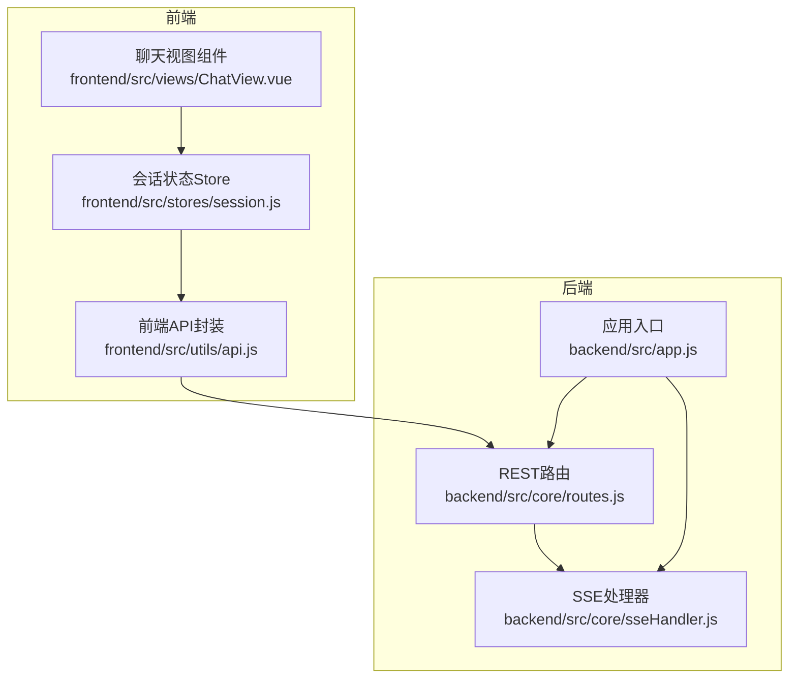
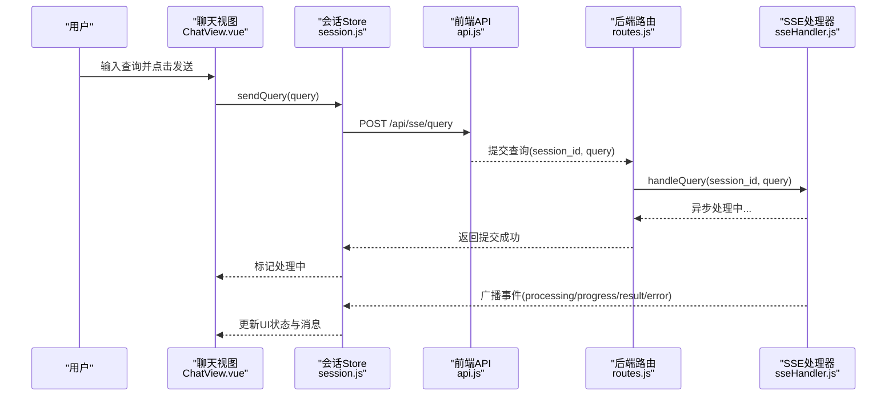
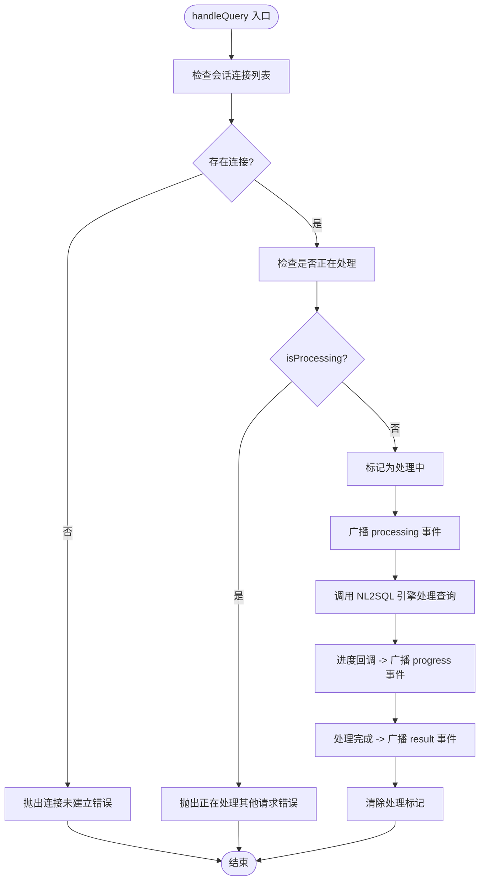
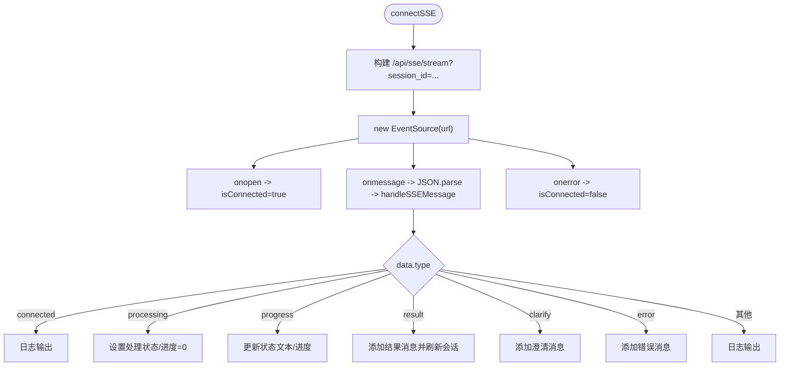
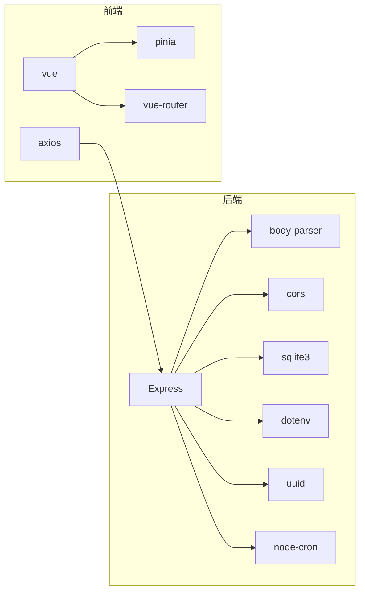

# 实时通信

<cite>
**本文引用的文件**
- [backend/src/core/sseHandler.js](file://backend/src/core/sseHandler.js)
- [backend/src/core/routes.js](file://backend/src/core/routes.js)
- [backend/src/app.js](file://backend/src/app.js)
- [frontend/src/stores/session.js](file://frontend/src/stores/session.js)
- [frontend/src/views/ChatView.vue](file://frontend/src/views/ChatView.vue)
- [frontend/src/utils/api.js](file://frontend/src/utils/api.js)
- [backend/package.json](file://backend/package.json)
- [frontend/package.json](file://frontend/package.json)
</cite>

## 目录
1. [简介](#简介)
2. [项目结构](#项目结构)
3. [核心组件](#核心组件)
4. [架构总览](#架构总览)
5. [详细组件分析](#详细组件分析)
6. [依赖分析](#依赖分析)
7. [性能考量](#性能考量)
8. [故障排查指南](#故障排查指南)
9. [结论](#结论)
10. [附录](#附录)

## 简介
本文件面向 NL2SQL 的实时通信系统，围绕 Server-Sent Events（SSE）实现进行深入说明，覆盖连接建立、消息推送、断线重连、消息格式与事件类型、状态管理策略、客户端集成要点、安全与并发控制、资源管理、调试与监控以及与传统 REST API 的差异与优势。目标是帮助开发者与运维人员快速理解并高效使用该实时通信链路。

## 项目结构
后端采用 Express + Node.js，前端采用 Vue 3 + Pinia。实时通信通过后端 SSE 端点与前端 EventSource 建立单向流式推送通道，配合 REST API 完成会话管理与查询提交。

图表来源
- [backend/src/app.js:1-238](file://backend/src/app.js#L1-L238)
- [backend/src/core/routes.js:1-1037](file://backend/src/core/routes.js#L1-L1037)
- [backend/src/core/sseHandler.js:1-349](file://backend/src/core/sseHandler.js#L1-L349)
- [frontend/src/utils/api.js:1-303](file://frontend/src/utils/api.js#L1-L303)
- [frontend/src/stores/session.js:1-400](file://frontend/src/stores/session.js#L1-L400)
- [frontend/src/views/ChatView.vue:1-778](file://frontend/src/views/ChatView.vue#L1-L778)

章节来源
- [backend/src/app.js:1-238](file://backend/src/app.js#L1-L238)
- [backend/src/core/routes.js:1-1037](file://backend/src/core/routes.js#L1-L1037)
- [frontend/src/utils/api.js:1-303](file://frontend/src/utils/api.js#L1-L303)
- [frontend/src/stores/session.js:1-400](file://frontend/src/stores/session.js#L1-L400)
- [frontend/src/views/ChatView.vue:1-778](file://frontend/src/views/ChatView.vue#L1-L778)

## 核心组件
- 后端 SSE 处理器：负责连接管理、消息广播、查询处理与进度回调。
- 后端 REST 路由：暴露 SSE 连接端点与查询提交端点，提供健康检查、统计等接口。
- 前端会话 Store：封装 EventSource 连接、消息分发与状态管理。
- 前端聊天视图：触发查询提交、渲染消息与处理 UI 状态。
- 前端 API 封装：统一 REST 接口调用与错误处理。

章节来源
- [backend/src/core/sseHandler.js:1-349](file://backend/src/core/sseHandler.js#L1-L349)
- [backend/src/core/routes.js:944-1002](file://backend/src/core/routes.js#L944-L1002)
- [frontend/src/stores/session.js:182-330](file://frontend/src/stores/session.js#L182-L330)
- [frontend/src/views/ChatView.vue:196-214](file://frontend/src/views/ChatView.vue#L196-L214)
- [frontend/src/utils/api.js:246-251](file://frontend/src/utils/api.js#L246-L251)

## 架构总览
SSE 实时链路的关键流程：
- 前端在聊天视图初始化时，通过会话 Store 建立 EventSource 连接到后端 SSE 端点。
- 用户在聊天视图输入查询并发送，Store 调用 REST API 提交查询。
- 后端路由接收查询请求，调用 SSE 处理器异步处理，并通过 SSE 广播进度与结果。
- 前端 Store 根据事件类型更新 UI 状态与消息列表。

图表来源
- [frontend/src/views/ChatView.vue:196-214](file://frontend/src/views/ChatView.vue#L196-L214)
- [frontend/src/stores/session.js:298-330](file://frontend/src/stores/session.js#L298-L330)
- [frontend/src/utils/api.js:246-251](file://frontend/src/utils/api.js#L246-L251)
- [backend/src/core/routes.js:961-1002](file://backend/src/core/routes.js#L961-L1002)
- [backend/src/core/sseHandler.js:218-280](file://backend/src/core/sseHandler.js#L218-L280)

## 详细组件分析

### 后端 SSE 处理器（sseHandler.js）
职责与能力：
- 连接管理：维护会话到连接列表的映射，支持多标签页连接。
- 连接生命周期：建立连接、监听关闭与错误、清理连接。
- 消息发送：将消息对象序列化为 SSE 格式并写入响应流。
- 查询处理：校验会话与请求状态，调用 NL2SQL 引擎处理查询，回调进度并通过广播发送给会话内所有连接。
- 统计接口：提供连接数、连接列表、会话连接数等统计。

关键实现要点：
- 连接建立时设置 SSE 响应头，禁用 Nginx 缓冲，保证低延迟推送。
- 使用 Map 以 sessionId 为键，存储连接数组，支持同一会话多连接。
- 广播机制：对指定会话的所有连接逐一发送消息，确保多标签页同步。
- 并发控制：同一会话仅允许一个请求在处理中，避免并发冲突。

图表来源
- [backend/src/core/sseHandler.js:218-280](file://backend/src/core/sseHandler.js#L218-L280)

章节来源
- [backend/src/core/sseHandler.js:1-349](file://backend/src/core/sseHandler.js#L1-L349)

### 后端 REST 路由（routes.js）
职责与能力：
- SSE 连接端点：GET /api/sse/stream，建立 SSE 连接。
- 查询提交端点：POST /api/sse/query，提交查询并立即返回，后续通过 SSE 推送结果。
- 健康检查与统计：/api/health、/api/health/detail、/api/stats。
- 会话管理：创建、查询、删除会话及消息历史。

SSE 相关端点：
- GET /api/sse/stream：调用 SSE 处理器建立连接。
- POST /api/sse/query：校验参数，必要时更新会话标题，异步调用 SSE 处理器处理查询。

章节来源
- [backend/src/core/routes.js:944-1002](file://backend/src/core/routes.js#L944-L1002)
- [backend/src/core/routes.js:56-137](file://backend/src/core/routes.js#L56-L137)
- [backend/src/core/routes.js:866-913](file://backend/src/core/routes.js#L866-L913)

### 前端会话 Store（session.js）
职责与能力：
- SSE 连接：基于 EventSource 建立到 /api/sse/stream 的连接，处理 open、message、error 事件。
- 消息分发：根据事件类型更新处理状态、进度与消息列表。
- 查询提交：调用 REST API 提交查询，同时在本地添加用户消息。
- 生命周期管理：创建/切换会话、加载消息、断开连接。

事件类型与状态：
- connected：连接建立成功（日志提示）。
- processing：开始处理，设置状态文本与进度为 0。
- progress：进度更新，更新状态文本与进度百分比。
- result：查询结果，注入消息（含 SQL 与数据），刷新会话列表。
- clarify：需要澄清，注入澄清消息。
- error：错误消息，注入错误提示。

图表来源
- [frontend/src/stores/session.js:182-295](file://frontend/src/stores/session.js#L182-L295)

章节来源
- [frontend/src/stores/session.js:1-400](file://frontend/src/stores/session.js#L1-L400)

### 前端聊天视图（ChatView.vue）
职责与能力：
- 输入与发送：处理键盘事件，调用会话 Store 发送查询。
- 渲染：根据消息类型渲染文本、SQL 代码块与数据表格。
- 状态展示：处理状态指示器、打字动画与进度条。
- 生命周期：组件挂载时初始化会话并连接 SSE；卸载时断开连接。

章节来源
- [frontend/src/views/ChatView.vue:196-214](file://frontend/src/views/ChatView.vue#L196-L214)
- [frontend/src/views/ChatView.vue:333-345](file://frontend/src/views/ChatView.vue#L333-L345)
- [frontend/src/views/ChatView.vue:324-327](file://frontend/src/views/ChatView.vue#L324-L327)

### 前端 API 封装（api.js）
职责与能力：
- 统一封装 REST API 调用，包括健康检查、Schema、会话、查询历史、统计、配置与 SSE 查询提交。
- Axios 实例配置：基础 URL、超时、请求/响应拦截器。
- SSE 查询提交：POST /api/sse/query。

章节来源
- [frontend/src/utils/api.js:1-303](file://frontend/src/utils/api.js#L1-L303)

## 依赖分析
- 后端依赖
  - Express：Web 框架与路由。
  - body-parser：解析 JSON/URL 编码请求体。
  - cors：跨域支持。
  - sqlite3：SQLite 数据库。
  - dotenv：环境变量加载。
  - uuid：会话 ID 生成。
  - node-cron：定时任务（自修复）。
- 前端依赖
  - axios：HTTP 客户端。
  - vue、pinia、vue-router：前端框架与状态管理。
  - element-plus、markdown-it、echarts 等：UI 与渲染。

图表来源
- [backend/package.json:10-27](file://backend/package.json#L10-L27)
- [frontend/package.json:11-29](file://frontend/package.json#L11-L29)

章节来源
- [backend/package.json:1-28](file://backend/package.json#L1-L28)
- [frontend/package.json:1-36](file://frontend/package.json#L1-L36)

## 性能考量
- SSE 响应头：设置 Content-Type 为 text/event-stream，禁用缓存与 Nginx 缓冲，降低延迟。
- 连接复用：同一会话允许多标签页连接，共享处理状态，减少重复计算。
- 广播策略：对同一会话内所有连接广播，避免重复处理。
- 并发控制：同一会话仅允许一个请求在处理中，避免资源竞争。
- 前端渲染：长内容消息支持折叠与展开，减少 DOM 压力。
- 健康检查：/api/health/detail 与 /api/stats 提供连接数与系统状态，便于容量规划。

章节来源
- [backend/src/core/sseHandler.js:64-70](file://backend/src/core/sseHandler.js#L64-L70)
- [backend/src/core/sseHandler.js:228-231](file://backend/src/core/sseHandler.js#L228-L231)
- [backend/src/core/routes.js:100-137](file://backend/src/core/routes.js#L100-L137)
- [backend/src/core/routes.js:866-913](file://backend/src/core/routes.js#L866-L913)

## 故障排查指南
- 连接建立失败
  - 检查后端日志与 SSE 端点可用性。
  - 确认前端 EventSource URL 包含有效的 session_id。
  - 核对 CORS 配置与代理设置。
- 查询无响应
  - 确认已通过 POST /api/sse/query 提交查询。
  - 检查后端 SSE 处理器是否处于 isProcessing 状态。
  - 查看前端 onerror 日志与 isConnected 状态。
- 进度不更新
  - 确认后端 NL2SQL 引擎是否回调进度。
  - 检查广播逻辑与连接列表有效性。
- 错误消息
  - 后端路由与 SSE 处理器均会广播 error 事件，前端 Store 统一处理并注入消息。
- 健康检查
  - 使用 /api/health 与 /api/health/detail 快速判断服务与组件状态。
  - 使用 /api/stats 查看连接数与今日查询统计。

章节来源
- [backend/src/core/routes.js:944-1002](file://backend/src/core/routes.js#L944-L1002)
- [backend/src/core/sseHandler.js:119-153](file://backend/src/core/sseHandler.js#L119-L153)
- [frontend/src/stores/session.js:182-221](file://frontend/src/stores/session.js#L182-L221)
- [backend/src/core/routes.js:100-137](file://backend/src/core/routes.js#L100-L137)
- [backend/src/core/routes.js:866-913](file://backend/src/core/routes.js#L866-L913)

## 结论
NL2SQL 的实时通信系统通过 SSE 实现低延迟、可靠的后端到前端流式推送，结合 REST API 完成会话管理与查询提交。系统具备完善的连接管理、并发控制与错误处理机制，前端通过 Store 与组件实现直观的状态展示与交互体验。建议在生产环境中关注连接数与资源占用，合理配置代理与超时策略，并利用健康检查与统计接口进行持续监控。

## 附录

### 消息格式与事件类型
- 事件类型
  - connected：连接建立成功（日志提示）
  - processing：开始处理
  - progress：进度更新（含 message、stage、progress）
  - result：查询结果（含 message、type、sql、data）
  - clarify：需要澄清
  - error：错误消息
- 数据结构
  - type：事件类型字符串
  - data：事件数据对象，包含具体字段（如 message、progress、sql、data）

章节来源
- [backend/src/core/sseHandler.js:94-101](file://backend/src/core/sseHandler.js#L94-L101)
- [backend/src/core/sseHandler.js:242-275](file://backend/src/core/sseHandler.js#L242-L275)
- [frontend/src/stores/session.js:227-295](file://frontend/src/stores/session.js#L227-L295)

### 客户端集成指南（前端）
- 连接管理
  - 在聊天视图挂载时初始化会话并连接 SSE。
  - 在组件卸载时断开 SSE，避免内存泄漏。
- 查询提交
  - 通过 Store 的 sendQuery 触发查询提交与本地消息添加。
- 错误处理
  - 监听 onerror 事件，设置 isConnected=false。
  - Store 统一处理 error 事件并注入错误消息。
- 性能优化
  - 长内容消息支持折叠与展开。
  - 合理使用 computed 与响应式更新，避免不必要的重渲染。

章节来源
- [frontend/src/views/ChatView.vue:333-345](file://frontend/src/views/ChatView.vue#L333-L345)
- [frontend/src/views/ChatView.vue:324-327](file://frontend/src/views/ChatView.vue#L324-L327)
- [frontend/src/stores/session.js:298-330](file://frontend/src/stores/session.js#L298-L330)
- [frontend/src/stores/session.js:182-221](file://frontend/src/stores/session.js#L182-L221)

### 与传统 REST API 的区别与优势
- 单向推送：SSE 适合后端向前端推送流式结果，而 REST API 通常为请求-响应模式。
- 低延迟：SSE 保持长连接，避免轮询带来的延迟。
- 状态同步：同一会话多标签页连接可共享处理状态，提升用户体验。
- 资源友好：SSE 适合长时间运行的任务，避免频繁建立/销毁连接。

章节来源
- [backend/src/core/sseHandler.js:64-70](file://backend/src/core/sseHandler.js#L64-L70)
- [backend/src/core/routes.js:944-1002](file://backend/src/core/routes.js#L944-L1002)