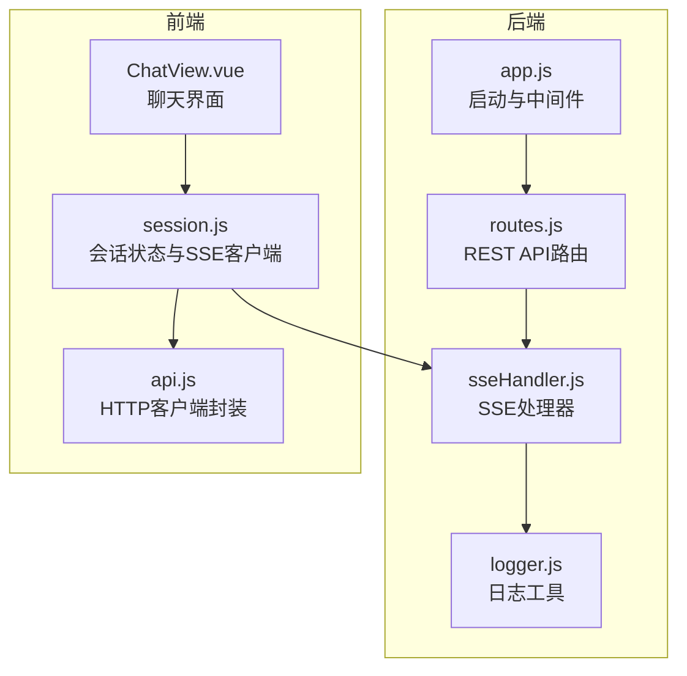
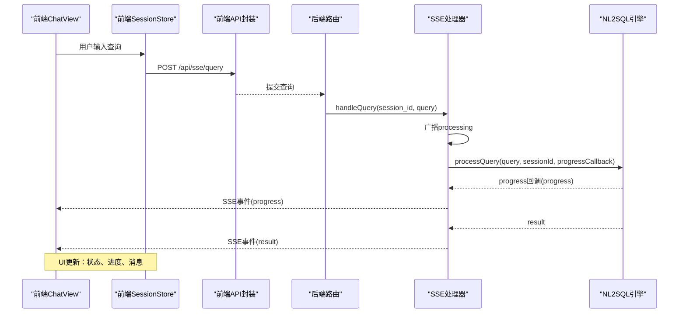
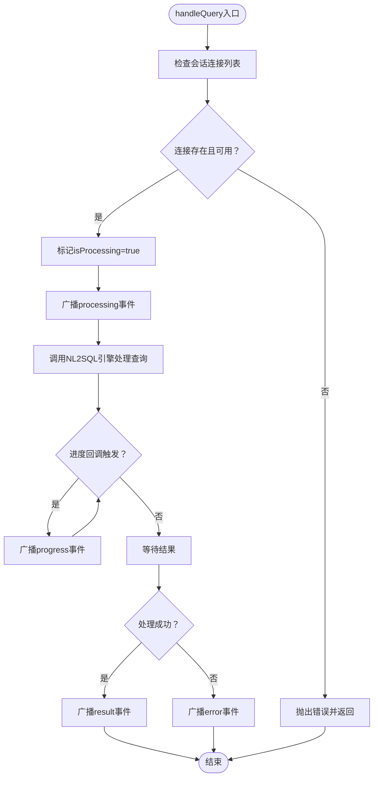
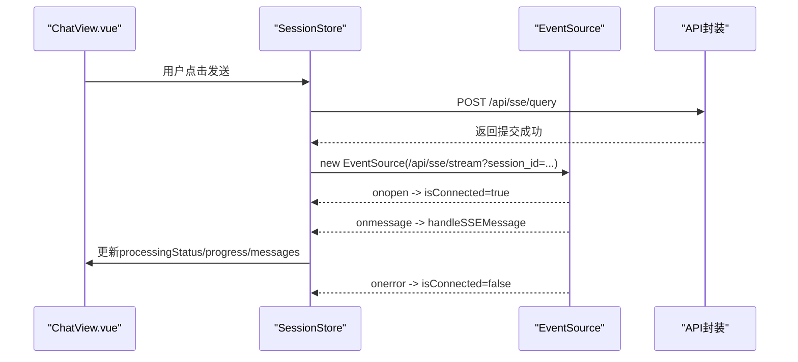
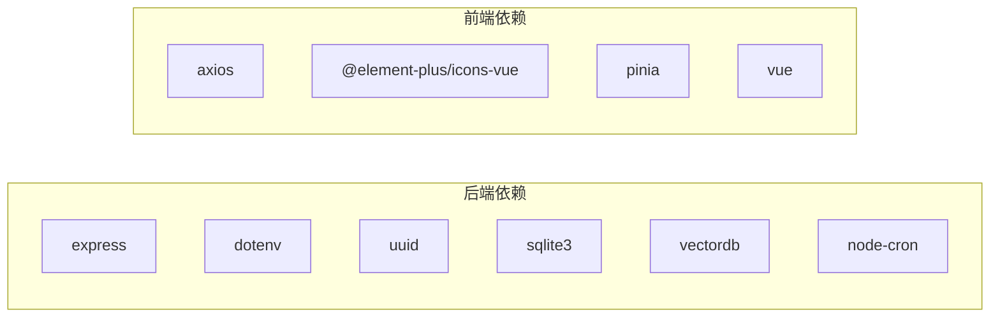

# 实时通信系统

<cite>
**本文档引用的文件**
- [backend/src/core/sseHandler.js](file://backend/src/core/sseHandler.js)
- [backend/src/core/routes.js](file://backend/src/core/routes.js)
- [backend/src/app.js](file://backend/src/app.js)
- [backend/src/utils/logger.js](file://backend/src/utils/logger.js)
- [frontend/src/utils/api.js](file://frontend/src/utils/api.js)
- [frontend/src/stores/session.js](file://frontend/src/stores/session.js)
- [frontend/src/views/ChatView.vue](file://frontend/src/views/ChatView.vue)
- [backend/package.json](file://backend/package.json)
</cite>

## 目录
1. [简介](#简介)
2. [项目结构](#项目结构)
3. [核心组件](#核心组件)
4. [架构总览](#架构总览)
5. [详细组件分析](#详细组件分析)
6. [依赖关系分析](#依赖关系分析)
7. [性能考虑](#性能考虑)
8. [故障排除指南](#故障排除指南)
9. [结论](#结论)
10. [附录](#附录)

## 简介
本文件面向NL2SQL实时通信系统，聚焦于Server-Sent Events（SSE）的实现与使用。文档涵盖以下主题：
- SSE连接管理：连接建立、消息推送、断线处理
- 实时数据流：流式响应、进度反馈、错误处理策略
- 前端SSE客户端：连接管理、事件监听、数据解析
- 配置选项、性能优化建议与故障排除
- 实际使用场景与最佳实践（长查询处理、进度显示、用户体验优化）

## 项目结构
后端采用Express + Node.js，SSE通过独立处理器模块管理；前端使用Vue + Pinia，通过EventSource与后端交互。

图表来源
- [backend/src/app.js:1-266](file://backend/src/app.js#L1-L266)
- [backend/src/core/routes.js:1-1037](file://backend/src/core/routes.js#L1-L1037)
- [backend/src/core/sseHandler.js:1-349](file://backend/src/core/sseHandler.js#L1-L349)
- [backend/src/utils/logger.js:1-482](file://backend/src/utils/logger.js#L1-L482)
- [frontend/src/utils/api.js:1-303](file://frontend/src/utils/api.js#L1-L303)
- [frontend/src/stores/session.js:1-400](file://frontend/src/stores/session.js#L1-L400)
- [frontend/src/views/ChatView.vue:1-200](file://frontend/src/views/ChatView.vue#L1-L200)

章节来源
- [backend/src/app.js:1-266](file://backend/src/app.js#L1-L266)
- [backend/src/core/routes.js:1-1037](file://backend/src/core/routes.js#L1-L1037)
- [frontend/src/utils/api.js:1-303](file://frontend/src/utils/api.js#L1-L303)
- [frontend/src/stores/session.js:1-400](file://frontend/src/stores/session.js#L1-L400)

## 核心组件
- SSE处理器（后端）：负责连接管理、消息广播、进度回调、错误处理与统计
- REST路由（后端）：暴露SSE连接端点与查询提交端点
- 前端SSE客户端（前端）：基于EventSource建立连接、监听事件、解析消息并更新UI
- HTTP客户端封装（前端）：统一Axios配置、拦截器与错误处理
- 日志工具（后端）：结构化日志记录，便于SSE链路问题排查

章节来源
- [backend/src/core/sseHandler.js:1-349](file://backend/src/core/sseHandler.js#L1-L349)
- [backend/src/core/routes.js:944-1002](file://backend/src/core/routes.js#L944-L1002)
- [frontend/src/stores/session.js:182-330](file://frontend/src/stores/session.js#L182-L330)
- [frontend/src/utils/api.js:246-251](file://frontend/src/utils/api.js#L246-L251)
- [backend/src/utils/logger.js:1-482](file://backend/src/utils/logger.js#L1-L482)

## 架构总览
SSE实时通信的关键流程如下：
- 前端通过REST API提交查询，后端异步处理并将结果通过SSE推送
- 后端建立SSE连接，发送“connected”确认，随后按阶段推送“processing”、“progress”、“result”或“error”
- 前端解析SSE事件，更新处理状态、进度与消息列表

图表来源
- [backend/src/core/routes.js:961-1002](file://backend/src/core/routes.js#L961-L1002)
- [backend/src/core/sseHandler.js:218-280](file://backend/src/core/sseHandler.js#L218-L280)
- [frontend/src/stores/session.js:297-330](file://frontend/src/stores/session.js#L297-L330)

## 详细组件分析

### 后端SSE处理器（sseHandler.js）
职责与能力：
- 连接管理：建立SSE连接、存储连接信息、监听关闭与错误事件
- 消息发送：封装SSE数据帧、广播消息至指定会话的所有连接
- 查询处理：校验会话与请求状态、标记处理中、调用引擎并推送进度与结果
- 统计功能：连接计数、连接列表、会话连接数

关键实现要点：
- 连接建立：校验session_id与会话存在性，设置SSE响应头，发送“connected”确认
- 断线处理：关闭时从连接映射移除，支持多标签页连接
- 消息格式：以SSE“data: ”形式发送JSON对象
- 进度回调：通过NL2SQL引擎的progress回调，周期性广播“progress”事件
- 错误处理：捕获异常并广播“error”，同时记录日志

图表来源
- [backend/src/core/sseHandler.js:218-280](file://backend/src/core/sseHandler.js#L218-L280)

章节来源
- [backend/src/core/sseHandler.js:1-349](file://backend/src/core/sseHandler.js#L1-L349)

### 后端REST路由（routes.js）
- SSE连接端点：GET /api/sse/stream，参数session_id、user_id，调用SSE处理器建立连接
- 查询提交端点：POST /api/sse/query，提交session_id与query，立即返回“提交成功”，后续通过SSE推送结果
- 健康检查：/api/health与/detail，包含SSE连接数统计

章节来源
- [backend/src/core/routes.js:944-1002](file://backend/src/core/routes.js#L944-L1002)
- [backend/src/core/routes.js:56-137](file://backend/src/core/routes.js#L56-L137)

### 前端SSE客户端（session.js + ChatView.vue）
- 连接管理：connectSSE基于当前会话ID构建URL，创建EventSource，监听onopen/onmessage/onerror
- 事件处理：handleSSEMessage根据事件类型更新处理状态、进度与消息列表
- 查询提交：sendQuery通过HTTP POST提交查询，前端仅负责发起，结果通过SSE推送
- UI集成：ChatView.vue展示处理状态、进度条与结果表格/SQL代码块

图表来源
- [frontend/src/stores/session.js:182-295](file://frontend/src/stores/session.js#L182-L295)
- [frontend/src/utils/api.js:246-251](file://frontend/src/utils/api.js#L246-L251)
- [frontend/src/views/ChatView.vue:196-330](file://frontend/src/views/ChatView.vue#L196-L330)

章节来源
- [frontend/src/stores/session.js:182-330](file://frontend/src/stores/session.js#L182-L330)
- [frontend/src/views/ChatView.vue:196-330](file://frontend/src/views/ChatView.vue#L196-L330)

### 前端HTTP客户端封装（api.js）
- Axios实例：baseURL="/api"、timeout、默认JSON头
- 请求/响应拦截：统一错误处理与网络错误提示
- SSE查询提交：sendQuery通过POST /api/sse/query提交

章节来源
- [frontend/src/utils/api.js:1-303](file://frontend/src/utils/api.js#L1-L303)

### 后端启动与优雅关闭（app.js）
- 初始化：配置校验、数据库/LanceDB初始化、Schema加载、自修复调度器启动
- SSE端点：启动时打印SSE端点URL
- 优雅关闭：关闭HTTP服务器、SSE连接、自修复调度器、数据库连接

章节来源
- [backend/src/app.js:93-194](file://backend/src/app.js#L93-L194)
- [backend/src/app.js:204-258](file://backend/src/app.js#L204-L258)

## 依赖关系分析
- 后端依赖
  - Express：Web框架与路由
  - dotenv：环境变量加载
  - uuid：会话ID生成
  - sqlite3/vectordb：数据与向量存储
  - node-cron：定时任务（自修复）
- 前端依赖
  - axios：HTTP客户端
  - element-plus：UI组件
  - pinia：状态管理
  - vue：响应式框架

图表来源
- [backend/package.json:10-27](file://backend/package.json#L10-L27)

章节来源
- [backend/package.json:10-27](file://backend/package.json#L10-L27)

## 性能考虑
- SSE响应头：设置Content-Type为text/event-stream，禁用缓存与Nginx缓冲，确保低延迟推送
- 连接复用：同一会话允许多标签页连接，后端通过Map按session_id聚合，广播至所有连接
- 进度回调：引擎侧定期回调progress，前端按事件更新进度，避免一次性大响应
- 资源释放：连接关闭与错误时及时清理连接映射，防止内存泄漏
- 日志级别：生产环境建议调整日志级别，降低I/O开销

章节来源
- [backend/src/core/sseHandler.js:64-70](file://backend/src/core/sseHandler.js#L64-L70)
- [backend/src/core/sseHandler.js:119-137](file://backend/src/core/sseHandler.js#L119-L137)
- [backend/src/utils/logger.js:33-44](file://backend/src/utils/logger.js#L33-L44)

## 故障排除指南
常见问题与定位思路：
- 无法建立SSE连接
  - 检查session_id参数是否传递
  - 确认会话是否存在
  - 查看后端日志中“SSE连接建立/失败”记录
- 连接建立后无消息
  - 确认前端EventSource已打开且未报错
  - 检查后端是否成功广播“processing”与“progress”
  - 核对Nginx/代理配置是否禁用缓冲
- 查询提交后无结果
  - 前端确认POST /api/sse/query返回成功
  - 后端查看SSE处理器是否进入handleQuery并广播“result”
- 连接频繁断开
  - 检查前端onerror回调与isConnected状态
  - 后端连接关闭事件是否被触发
- 性能问题
  - 适当降低progress回调频率
  - 控制消息大小，避免一次性推送大量数据

章节来源
- [backend/src/core/routes.js:957-959](file://backend/src/core/routes.js#L957-L959)
- [backend/src/core/sseHandler.js:43-112](file://backend/src/core/sseHandler.js#L43-L112)
- [frontend/src/stores/session.js:213-221](file://frontend/src/stores/session.js#L213-L221)

## 结论
NL2SQL的SSE实时通信系统通过简洁的连接管理与事件驱动的消息推送，实现了流畅的查询处理体验。后端以模块化方式组织SSE逻辑，前端以EventSource与Pinia状态管理实现响应式UI更新。结合合理的配置与日志策略，系统可在复杂场景下保持稳定与可观测性。

## 附录

### 实时通信配置选项
- 后端
  - SSE响应头：Content-Type、Cache-Control、Connection、X-Accel-Buffering
  - 日志级别：通过配置调整（INFO/WARN/ERROR等）
- 前端
  - Axios超时：默认30秒
  - SSE URL：/api/sse/stream?session_id=...

章节来源
- [backend/src/core/sseHandler.js:64-70](file://backend/src/core/sseHandler.js#L64-L70)
- [backend/src/utils/logger.js:105-110](file://backend/src/utils/logger.js#L105-L110)
- [frontend/src/utils/api.js:25-34](file://frontend/src/utils/api.js#L25-L34)

### 实际使用场景与最佳实践
- 长查询处理
  - 后端：通过progress回调持续推送阶段性结果，前端以进度条与状态文本反馈
  - 前端：避免阻塞UI，使用异步更新与防抖
- 进度显示
  - 后端：按阶段生成progress事件，携带stage与progress字段
  - 前端：根据data.progress与data.message更新UI
- 用户体验优化
  - 前端：在processing阶段显示打字动画与进度条，result后自动刷新会话标题
  - 错误处理：统一错误消息展示，支持重试与提示

章节来源
- [frontend/src/stores/session.js:227-295](file://frontend/src/stores/session.js#L227-L295)
- [backend/src/core/routes.js:972-1002](file://backend/src/core/routes.js#L972-L1002)