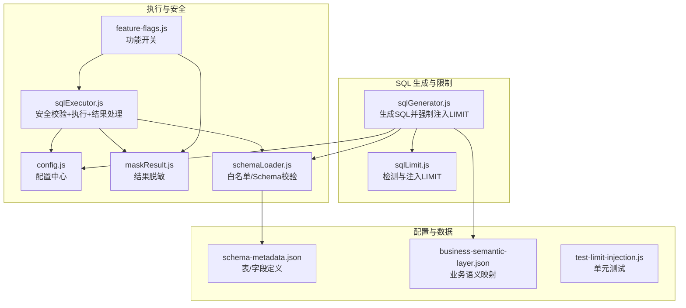
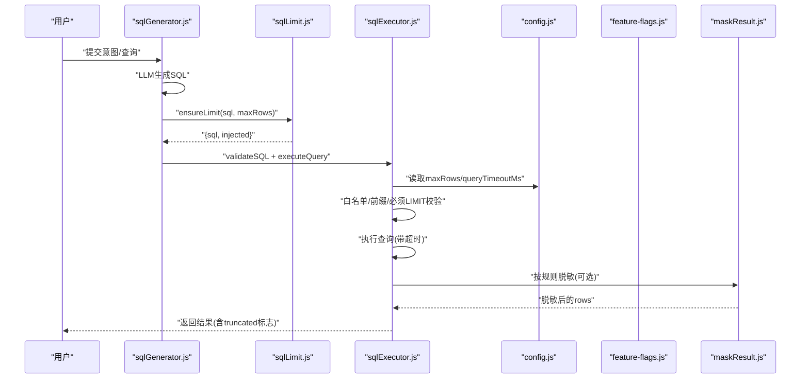
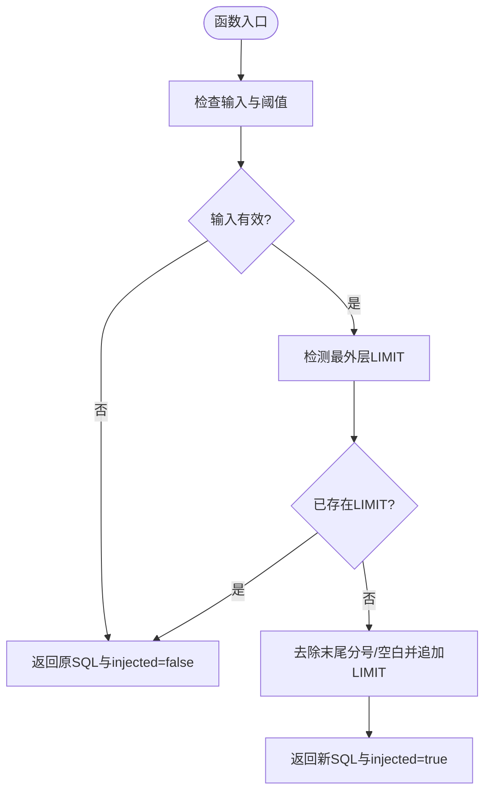
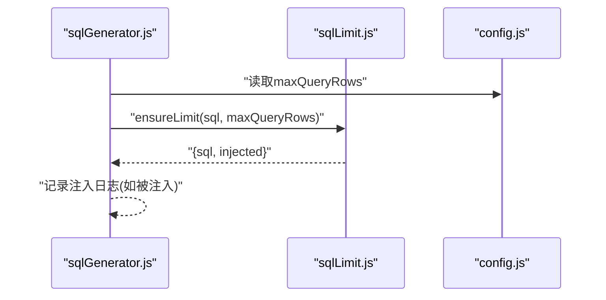
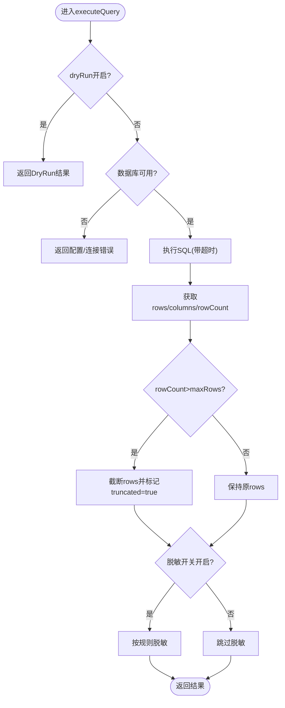
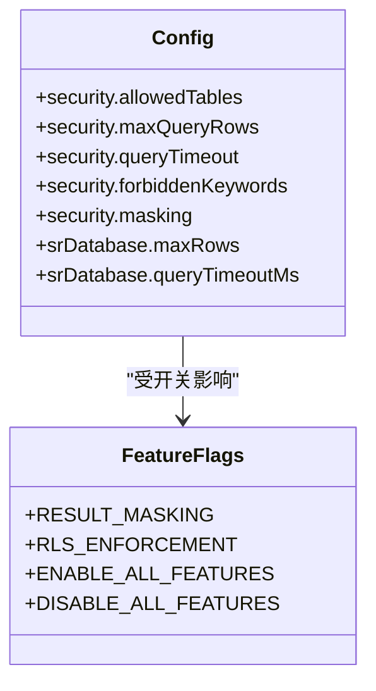
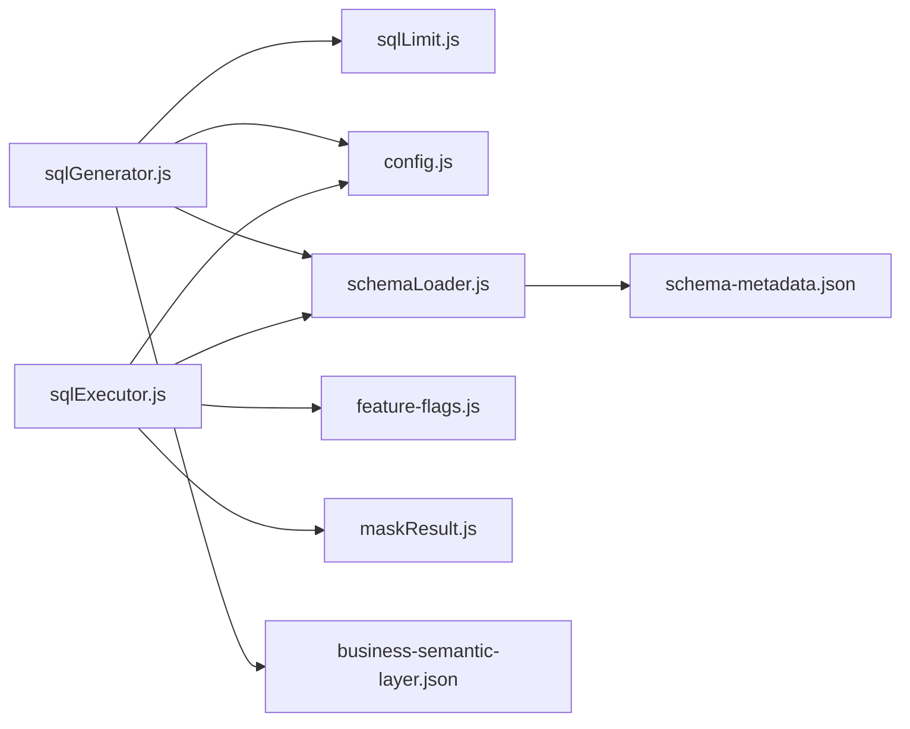

# SQL 限制控制

<cite>
**本文引用的文件**
- [sqlLimit.js](file://backend/src/utils/sqlLimit.js)
- [sqlExecutor.js](file://backend/src/core/sqlExecutor.js)
- [sqlGenerator.js](file://backend/src/core/sqlGenerator.js)
- [config.js](file://backend/src/core/config.js)
- [feature-flags.js](file://backend/config/feature-flags.js)
- [maskResult.js](file://backend/src/utils/maskResult.js)
- [test-limit-injection.js](file://backend/test/phase2/test-limit-injection.js)
- [schemaLoader.js](file://backend/src/core/schemaLoader.js)
- [schema-metadata.json](file://backend/config/schema-metadata.json)
- [business-semantic-layer.json](file://backend/config/business-semantic-layer.json)
</cite>

## 目录
1. [简介](#简介)
2. [项目结构](#项目结构)
3. [核心组件](#核心组件)
4. [架构概览](#架构概览)
5. [详细组件分析](#详细组件分析)
6. [依赖分析](#依赖分析)
7. [性能考虑](#性能考虑)
8. [故障排查指南](#故障排查指南)
9. [结论](#结论)
10. [附录](#附录)

## 简介
本文件为 SQL 限制控制系统的技术文档，聚焦于查询复杂度评估、执行时间限制、结果集大小控制与安全防护的实现机制。系统通过“白名单 + 前缀校验 + LIMIT 强制注入”的组合策略，确保 SQL 查询在安全边界内执行；通过配置中心集中管理阈值与开关，支持动态调整；通过结果脱敏与行级权限（RLS）进一步强化数据安全与合规。

## 项目结构
围绕 SQL 限制控制的关键模块与文件如下：
- 限制注入工具：sqlLimit.js
- SQL 生成与注入：sqlGenerator.js
- SQL 执行与安全校验：sqlExecutor.js
- 配置中心：config.js
- 功能开关：feature-flags.js
- 结果脱敏：maskResult.js
- 单元测试：test-limit-injection.js
- Schema 加载与白名单：schemaLoader.js
- Schema 元数据：schema-metadata.json
- 业务语义层：business-semantic-layer.json

**图表来源**
- [sqlGenerator.js:1-485](file://backend/src/core/sqlGenerator.js#L1-L485)
- [sqlLimit.js:1-37](file://backend/src/utils/sqlLimit.js#L1-L37)
- [sqlExecutor.js:1-175](file://backend/src/core/sqlExecutor.js#L1-L175)
- [config.js:1-439](file://backend/src/core/config.js#L1-L439)
- [feature-flags.js:1-294](file://backend/config/feature-flags.js#L1-L294)
- [maskResult.js:1-198](file://backend/src/utils/maskResult.js#L1-L198)
- [schemaLoader.js:1-200](file://backend/src/core/schemaLoader.js#L1-L200)
- [schema-metadata.json:1-200](file://backend/config/schema-metadata.json#L1-L200)
- [business-semantic-layer.json:1-189](file://backend/config/business-semantic-layer.json#L1-L189)
- [test-limit-injection.js:1-88](file://backend/test/phase2/test-limit-injection.js#L1-L88)

**章节来源**
- [sqlGenerator.js:1-485](file://backend/src/core/sqlGenerator.js#L1-L485)
- [sqlLimit.js:1-37](file://backend/src/utils/sqlLimit.js#L1-L37)
- [sqlExecutor.js:1-175](file://backend/src/core/sqlExecutor.js#L1-L175)
- [config.js:1-439](file://backend/src/core/config.js#L1-L439)
- [feature-flags.js:1-294](file://backend/config/feature-flags.js#L1-L294)
- [maskResult.js:1-198](file://backend/src/utils/maskResult.js#L1-L198)
- [schemaLoader.js:1-200](file://backend/src/core/schemaLoader.js#L1-L200)
- [schema-metadata.json:1-200](file://backend/config/schema-metadata.json#L1-L200)
- [business-semantic-layer.json:1-189](file://backend/config/business-semantic-layer.json#L1-L189)
- [test-limit-injection.js:1-88](file://backend/test/phase2/test-limit-injection.js#L1-L88)

## 核心组件
- SQL 限制注入工具：提供“最外层 LIMIT 检测”和“未带 LIMIT 时追加 LIMIT”的能力，避免误伤子查询与列名中的关键字。
- SQL 生成器：在 LLM 生成 SQL 后，强制注入 LIMIT，确保所有查询均带有上限。
- SQL 执行器：执行前进行白名单与前缀校验，强制要求 LIMIT；执行中设置查询超时；执行后按配置进行结果脱敏。
- 配置中心：集中管理最大查询行数、查询超时、最大查询行数、RLS/脱敏开关等。
- 功能开关：提供运行期开关，支持紧急关闭脱敏、RLS 等高风险功能。
- 结果脱敏：按列名规则对敏感字段进行脱敏，避免明文敏感信息回传。
- Schema 加载：提供白名单与表/字段合法性校验，作为安全前置。

**章节来源**
- [sqlLimit.js:1-37](file://backend/src/utils/sqlLimit.js#L1-L37)
- [sqlGenerator.js:1-485](file://backend/src/core/sqlGenerator.js#L1-L485)
- [sqlExecutor.js:1-175](file://backend/src/core/sqlExecutor.js#L1-L175)
- [config.js:145-211](file://backend/src/core/config.js#L145-L211)
- [feature-flags.js:92-114](file://backend/config/feature-flags.js#L92-L114)
- [maskResult.js:1-198](file://backend/src/utils/maskResult.js#L1-L198)
- [schemaLoader.js:1-200](file://backend/src/core/schemaLoader.js#L1-L200)

## 架构概览
SQL 限制控制贯穿“生成 → 校验 → 执行 → 脱敏”的全链路，形成“输入限制 + 执行限制 + 输出限制”的闭环。

**图表来源**
- [sqlGenerator.js:464-470](file://backend/src/core/sqlGenerator.js#L464-L470)
- [sqlLimit.js:22-34](file://backend/src/utils/sqlLimit.js#L22-L34)
- [sqlExecutor.js:34-66](file://backend/src/core/sqlExecutor.js#L34-L66)
- [sqlExecutor.js:114-157](file://backend/src/core/sqlExecutor.js#L114-L157)
- [config.js:122-143](file://backend/src/core/config.js#L122-L143)
- [feature-flags.js:92-114](file://backend/config/feature-flags.js#L92-L114)
- [maskResult.js:131-184](file://backend/src/utils/maskResult.js#L131-L184)

## 详细组件分析

### 组件A：SQL 限制注入工具（sqlLimit.js）
- 能力概述
  - hasOuterLimit：仅匹配 SQL 末尾的 LIMIT，支持 LIMIT n、LIMIT n,m、LIMIT n OFFSET m 三种合法尾形，忽略末尾分号与空白。
  - ensureLimit：若 SQL 未带 LIMIT 且 maxRows 合法，则在末尾追加 LIMIT；若已带 LIMIT 则原样返回。
- 设计要点
  - 仅匹配最外层 LIMIT，避免误伤子查询或列名中的关键字。
  - 对输入与阈值进行边界检查，保证健壮性。
- 测试覆盖
  - 单测覆盖了正反例、子查询含 LIMIT、去分号后注入、阈值为 0 等边界场景。

**图表来源**
- [sqlLimit.js:16-34](file://backend/src/utils/sqlLimit.js#L16-L34)

**章节来源**
- [sqlLimit.js:1-37](file://backend/src/utils/sqlLimit.js#L1-L37)
- [test-limit-injection.js:21-80](file://backend/test/phase2/test-limit-injection.js#L21-L80)

### 组件B：SQL 生成与强制注入（sqlGenerator.js）
- 能力概述
  - 在 LLM 生成 SQL 后，调用 ensureLimit 强制注入 LIMIT，确保所有查询均带有上限。
  - 系统 Prompt 中明确“LIMIT 必须存在”，默认上限由配置决定。
- 关键流程
  - 生成 SQL → ensureLimit → 注入 LIMIT → 返回结果。
- 与配置的关系
  - 使用 config.security.maxQueryRows 作为注入上限。

**图表来源**
- [sqlGenerator.js:464-470](file://backend/src/core/sqlGenerator.js#L464-L470)
- [config.js:165](file://backend/src/core/config.js#L165)

**章节来源**
- [sqlGenerator.js:1-485](file://backend/src/core/sqlGenerator.js#L1-L485)
- [config.js:165](file://backend/src/core/config.js#L165)

### 组件C：SQL 执行与安全控制（sqlExecutor.js）
- 能力概述
  - validateSQL：白名单校验、前缀校验（仅 SELECT/WITH）、强制要求包含 LIMIT。
  - executeQuery：执行 SQL，设置查询超时；按配置截断结果并标记 truncated；按开关进行结果脱敏。
- 关键点
  - 安全前置：白名单 + 前缀 + LIMIT 必须存在。
  - 性能保护：查询超时、结果行数上限。
  - 数据安全：脱敏开关与规则。

**图表来源**
- [sqlExecutor.js:72-169](file://backend/src/core/sqlExecutor.js#L72-L169)
- [config.js:129-131](file://backend/src/core/config.js#L129-L131)
- [feature-flags.js:92-114](file://backend/config/feature-flags.js#L92-L114)
- [maskResult.js:131-184](file://backend/src/utils/maskResult.js#L131-L184)

**章节来源**
- [sqlExecutor.js:1-175](file://backend/src/core/sqlExecutor.js#L1-L175)
- [config.js:122-143](file://backend/src/core/config.js#L122-L143)
- [feature-flags.js:92-114](file://backend/config/feature-flags.js#L92-L114)
- [maskResult.js:1-198](file://backend/src/utils/maskResult.js#L1-L198)

### 组件D：配置中心与功能开关（config.js / feature-flags.js）
- 配置中心
  - 安全配置：allowedTables（白名单）、maxQueryRows（生成时注入上限）、queryTimeout（执行时超时）、forbiddenKeywords、脱敏规则等。
  - 数据库配置：srDatabase.maxRows（执行时截断上限）、queryTimeoutMs（执行超时）。
- 功能开关
  - RESULT_MASKING：控制执行阶段是否脱敏。
  - RLS_ENFORCEMENT：控制是否启用行级权限改写（需配合 RLSEnforcement 与租户映射）。
  - ENABLE_ALL_FEATURES/DISABLE_ALL_FEATURES：全局开关。

**图表来源**
- [config.js:145-211](file://backend/src/core/config.js#L145-L211)
- [config.js:122-143](file://backend/src/core/config.js#L122-L143)
- [feature-flags.js:92-114](file://backend/config/feature-flags.js#L92-L114)

**章节来源**
- [config.js:145-211](file://backend/src/core/config.js#L145-L211)
- [config.js:122-143](file://backend/src/core/config.js#L122-L143)
- [feature-flags.js:1-294](file://backend/config/feature-flags.js#L1-294)

### 组件E：结果脱敏（maskResult.js）
- 能力概述
  - 按列名规则对敏感字段进行脱敏，支持多种规则（如 mid_4、domain_only、head_tail、redact、first_1、last_4、length_stars）。
  - 规则大小写不敏感，支持对象行与数组行两种行结构。
- 与执行器集成
  - 在执行器中按开关调用，统计脱敏单元格数量并记录日志。

**章节来源**
- [maskResult.js:1-198](file://backend/src/utils/maskResult.js#L1-L198)
- [sqlExecutor.js:122-135](file://backend/src/core/sqlExecutor.js#L122-L135)

### 组件F：Schema 加载与白名单（schemaLoader.js / schema-metadata.json / business-semantic-layer.json）
- 能力概述
  - schemaLoader：加载 schema-metadata.json，构建表/字段映射，提供白名单校验与表/字段合法性检查。
  - business-semantic-layer.json：将业务术语映射到物理表/字段，辅助 LLM 更准确地生成 SQL。
- 与安全的关系
  - validateSQL 使用 schemaLoader 的白名单校验，确保仅访问允许的表。

**章节来源**
- [schemaLoader.js:1-200](file://backend/src/core/schemaLoader.js#L1-L200)
- [schema-metadata.json:1-200](file://backend/config/schema-metadata.json#L1-L200)
- [business-semantic-layer.json:1-189](file://backend/config/business-semantic-layer.json#L1-L189)
- [sqlExecutor.js:34-66](file://backend/src/core/sqlExecutor.js#L34-L66)

## 依赖分析
- 组件耦合
  - sqlGenerator 依赖 sqlLimit 与 config。
  - sqlExecutor 依赖 config、feature-flags、maskResult、schemaLoader。
  - schemaLoader 依赖 config 与 schema-metadata.json。
- 外部依赖
  - 数据库连接池与查询执行由 srDatabase 提供（在 sqlExecutor 中调用）。
  - LLM 服务与工具循环由其他模块提供（在 sqlGenerator 中调用）。

**图表来源**
- [sqlGenerator.js:15-24](file://backend/src/core/sqlGenerator.js#L15-L24)
- [sqlLimit.js:21](file://backend/src/utils/sqlLimit.js#L21)
- [sqlExecutor.js:15-28](file://backend/src/core/sqlExecutor.js#L15-L28)
- [config.js:1-439](file://backend/src/core/config.js#L1-L439)
- [feature-flags.js:1-294](file://backend/config/feature-flags.js#L1-L294)
- [maskResult.js:1-198](file://backend/src/utils/maskResult.js#L1-L198)
- [schemaLoader.js:1-200](file://backend/src/core/schemaLoader.js#L1-L200)
- [schema-metadata.json:1-200](file://backend/config/schema-metadata.json#L1-L200)
- [business-semantic-layer.json:1-189](file://backend/config/business-semantic-layer.json#L1-L189)

**章节来源**
- [sqlGenerator.js:15-24](file://backend/src/core/sqlGenerator.js#L15-L24)
- [sqlExecutor.js:15-28](file://backend/src/core/sqlExecutor.js#L15-L28)
- [schemaLoader.js:1-200](file://backend/src/core/schemaLoader.js#L1-L200)

## 性能考虑
- 查询超时
  - 生成阶段：config.security.queryTimeout 控制 LLM 生成超时。
  - 执行阶段：config.srDatabase.queryTimeoutMs 控制数据库查询超时。
- 结果集大小
  - 生成阶段：config.security.maxQueryRows 作为 LIMIT 注入上限。
  - 执行阶段：config.srDatabase.maxRows 截断返回行数并标记 truncated。
- 脱敏开销
  - 脱敏按列规则扫描行，建议合理配置规则与列名映射，避免不必要的全表扫描。
- 建议
  - 对高频查询适当降低 maxQueryRows 与 queryTimeoutMs，避免资源争用。
  - 在业务高峰期启用 RESULT_MASKING 与 RLS_ENFORCEMENT 时，关注 CPU 与 I/O 峰值。

[本节为通用性能讨论，无需特定文件来源]

## 故障排查指南
- 常见问题
  - SQL 未带 LIMIT：validateSQL 会拒绝，需检查 sqlGenerator 是否正确注入 LIMIT。
  - 生成阶段超时：检查 config.security.queryTimeout 与 LLM 服务性能。
  - 执行阶段超时：检查 config.srDatabase.queryTimeoutMs 与数据库负载。
  - 结果过大：确认 config.srDatabase.maxRows 与 truncated 标志。
  - 脱敏未生效：检查 feature-flags 中 RESULT_MASKING 与 config.security.masking.enabled。
- 单元测试
  - 使用 test-limit-injection.js 验证 hasOuterLimit 与 ensureLimit 的行为，覆盖边界场景。

**章节来源**
- [sqlExecutor.js:34-66](file://backend/src/core/sqlExecutor.js#L34-L66)
- [sqlGenerator.js:464-470](file://backend/src/core/sqlGenerator.js#L464-L470)
- [config.js:129-131](file://backend/src/core/config.js#L129-L131)
- [feature-flags.js:92-114](file://backend/config/feature-flags.js#L92-L114)
- [test-limit-injection.js:1-88](file://backend/test/phase2/test-limit-injection.js#L1-L88)

## 结论
SQL 限制控制系统通过“生成阶段强制 LIMIT 注入 + 执行阶段白名单/前缀/LIMIT 校验 + 查询超时 + 结果集截断 + 结果脱敏”的多层保障，实现了安全与性能的平衡。配置中心与功能开关提供了灵活的动态调整能力，能够在紧急情况下快速回退高风险功能，确保系统稳定运行。

[本节为总结性内容，无需特定文件来源]

## 附录

### 限制规则配置清单
- 生成阶段
  - config.security.maxQueryRows：默认上限（注入 LIMIT 的 N 值）
  - config.security.queryTimeout：生成超时
- 执行阶段
  - config.srDatabase.maxRows：返回行数上限
  - config.srDatabase.queryTimeoutMs：查询超时
  - config.security.allowedTables：白名单
  - config.security.forbiddenKeywords：禁止关键字
- 安全与合规
  - config.security.masking.enabled：脱敏开关
  - config.security.masking.rules：列名 → 规则映射
  - feature-flags.RESULT_MASKING：运行期开关
  - feature-flags.RLS_ENFORCEMENT：RLS 改写开关

**章节来源**
- [config.js:145-211](file://backend/src/core/config.js#L145-L211)
- [config.js:122-143](file://backend/src/core/config.js#L122-L143)
- [feature-flags.js:92-114](file://backend/config/feature-flags.js#L92-L114)

### 动态调整策略
- 紧急回退
  - 关闭 RESULT_MASKING 或 RLS_ENFORCEMENT，快速消除高风险影响。
- 性能压测
  - 逐步下调 maxQueryRows 与 queryTimeoutMs，观察系统吞吐与延迟变化。
- 业务适配
  - 根据业务查询特征调整 allowedTables 与 schema 配置，减少无效查询。

**章节来源**
- [feature-flags.js:92-114](file://backend/config/feature-flags.js#L92-L114)
- [config.js:129-131](file://backend/src/core/config.js#L129-L131)
- [config.js:165](file://backend/src/core/config.js#L165)