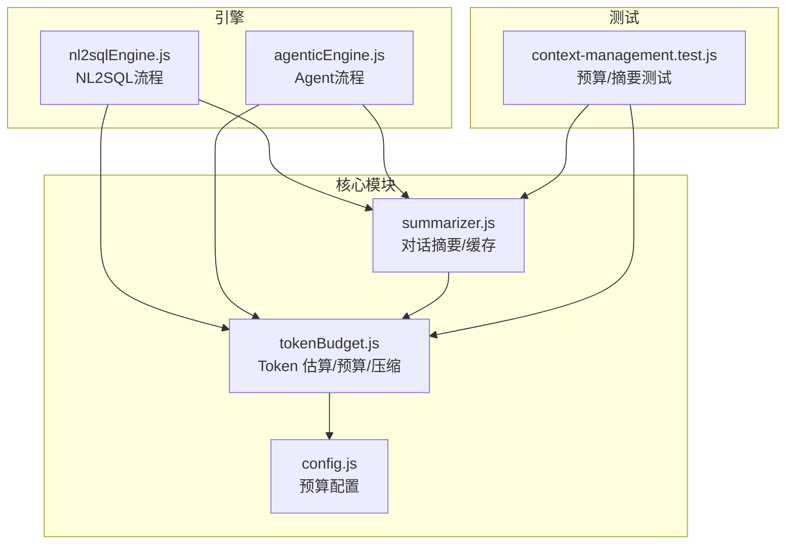
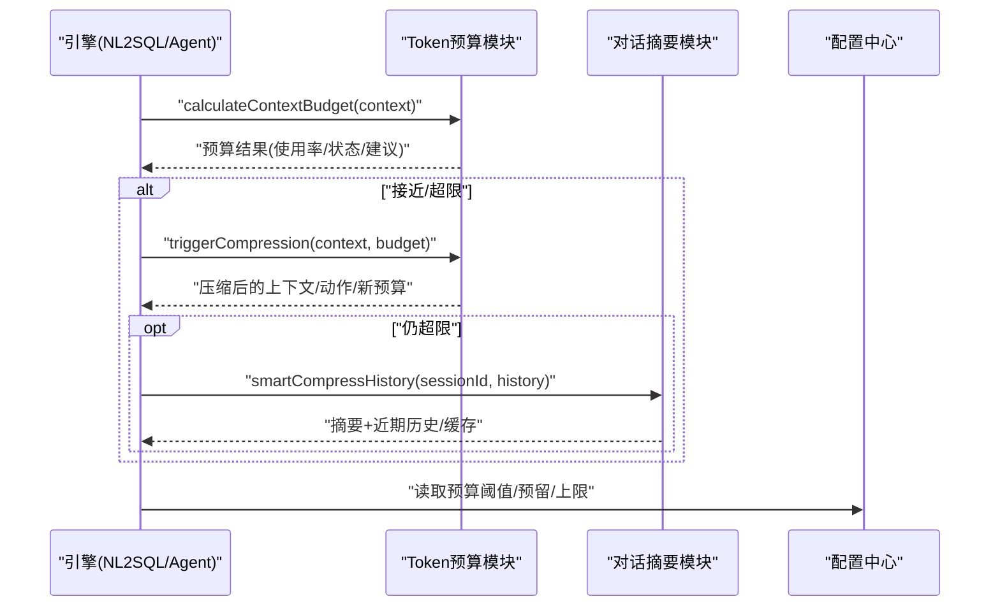
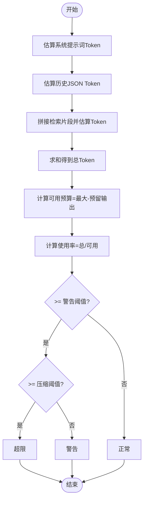
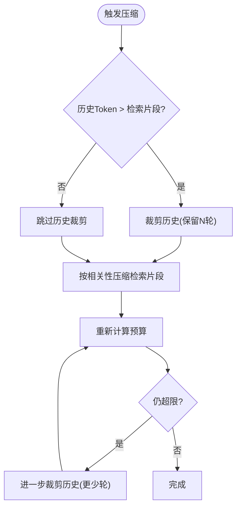
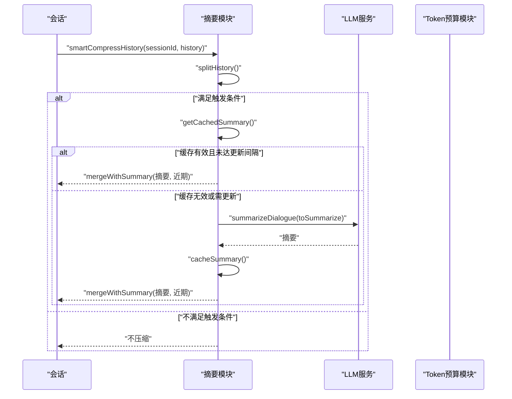
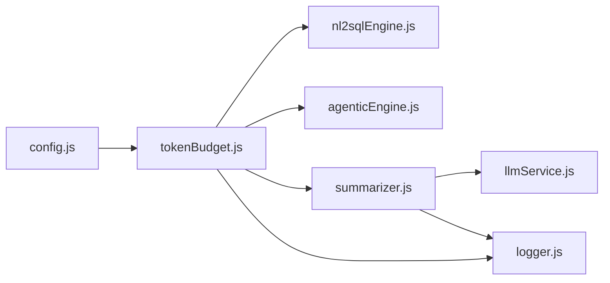

# Token 预算管理

<cite>
**本文引用的文件**
- [tokenBudget.js](file://backend/src/utils/tokenBudget.js)
- [summarizer.js](file://backend/src/memory/summarizer.js)
- [config.js](file://backend/src/core/config.js)
- [nl2sqlEngine.js](file://backend/src/core/nl2sqlEngine.js)
- [agenticEngine.js](file://backend/src/core/agenticEngine.js)
- [context-management.test.js](file://backend/test/context-management.test.js)
</cite>

## 目录
1. [简介](#简介)
2. [项目结构](#项目结构)
3. [核心组件](#核心组件)
4. [架构总览](#架构总览)
5. [详细组件分析](#详细组件分析)
6. [依赖关系分析](#依赖关系分析)
7. [性能考量](#性能考量)
8. [故障排查指南](#故障排查指南)
9. [结论](#结论)
10. [附录](#附录)

## 简介
本技术文档聚焦于 Token 预算管理模块，系统性解析以下内容：
- Token 估算算法：字符数到 Token 数的转换机制与不同语言的估算策略
- 上下文预算计算：系统提示词、对话历史、检索片段等各部分的 Token 统计方法
- 预算阈值管理：警告阈值、压缩阈值、超限处理策略
- 上下文裁剪与压缩：历史对话裁剪、检索片段压缩的具体实现
- 预算配置参数：作用与调优方法
- 实际使用示例与性能优化建议

## 项目结构
Token 预算管理位于后端 utils 层，与记忆系统（summarizer）和引擎（nl2sqlEngine/agenticEngine）紧密协作，形成“估算—预算—压缩—校验”的闭环。

图表来源
- [tokenBudget.js:1-435](file://backend/src/utils/tokenBudget.js#L1-L435)
- [summarizer.js:1-530](file://backend/src/memory/summarizer.js#L1-L530)
- [config.js:350-373](file://backend/src/core/config.js#L350-L373)
- [nl2sqlEngine.js:210-252](file://backend/src/core/nl2sqlEngine.js#L210-L252)
- [agenticEngine.js:489-496](file://backend/src/core/agenticEngine.js#L489-L496)
- [context-management.test.js:1-321](file://backend/test/context-management.test.js#L1-L321)

章节来源
- [tokenBudget.js:1-435](file://backend/src/utils/tokenBudget.js#L1-L435)
- [summarizer.js:1-530](file://backend/src/memory/summarizer.js#L1-L530)
- [config.js:350-373](file://backend/src/core/config.js#L350-L373)
- [nl2sqlEngine.js:210-252](file://backend/src/core/nl2sqlEngine.js#L210-L252)
- [agenticEngine.js:489-496](file://backend/src/core/agenticEngine.js#L489-L496)
- [context-management.test.js:1-321](file://backend/test/context-management.test.js#L1-L321)

## 核心组件
- Token 估算与预算计算：提供字符到 Token 的估算、上下文预算分解、阈值判断与建议生成
- 上下文裁剪与压缩：历史对话裁剪、检索片段按相关性压缩、触发压缩的策略编排
- 对话摘要与缓存：长历史压缩为摘要+近期对话，带缓存与增量更新
- 配置中心：集中管理预算阈值、输出预留、检索片段上限等参数

章节来源
- [tokenBudget.js:47-181](file://backend/src/utils/tokenBudget.js#L47-L181)
- [tokenBudget.js:217-372](file://backend/src/utils/tokenBudget.js#L217-L372)
- [summarizer.js:18-530](file://backend/src/memory/summarizer.js#L18-L530)
- [config.js:351-373](file://backend/src/core/config.js#L351-L373)

## 架构总览
Token 预算管理贯穿 NL2SQL 与 Agent 两大引擎：
- NL2SQL 引擎在生成 SQL 前先做预算检查，若接近/超限则触发压缩
- Agent 引擎在构建 SQL 提示词时对历史进行裁剪，避免上下文过长
- 记忆系统通过摘要与缓存降低历史 Token 占比，配合预算模块稳定上下文

图表来源
- [nl2sqlEngine.js:214-252](file://backend/src/core/nl2sqlEngine.js#L214-L252)
- [agenticEngine.js:489-496](file://backend/src/core/agenticEngine.js#L489-L496)
- [tokenBudget.js:115-181](file://backend/src/utils/tokenBudget.js#L115-L181)
- [tokenBudget.js:315-372](file://backend/src/utils/tokenBudget.js#L315-L372)
- [summarizer.js:450-504](file://backend/src/memory/summarizer.js#L450-L504)
- [config.js:351-361](file://backend/src/core/config.js#L351-L361)

## 详细组件分析

### Token 估算与预算计算
- 估算策略
  - 基于字符数的保守估算：使用统一的字符到 Token 比率，兼顾中英文场景
  - 批量估算与对象估算：支持文本数组与 JSON 序列化后的估算
- 预算分解
  - 系统提示词、对话历史、检索片段分别估算，求和得到总 Token
  - 可用预算 = 最大上下文 - 预留输出
  - 使用率 = 总 Token / 可用预算
- 阈值与状态
  - 警告阈值、压缩阈值、超限判定三态
  - 建议生成：根据各部分占比与阈值给出压缩方向
- 快捷检查
  - isContextSafe：快速判断是否安全
  - getContextStatusSummary：返回状态摘要

图表来源
- [tokenBudget.js:115-181](file://backend/src/utils/tokenBudget.js#L115-L181)
- [tokenBudget.js:190-214](file://backend/src/utils/tokenBudget.js#L190-L214)

章节来源
- [tokenBudget.js:47-181](file://backend/src/utils/tokenBudget.js#L47-L181)
- [tokenBudget.js:190-214](file://backend/src/utils/tokenBudget.js#L190-L214)

### 上下文裁剪与压缩
- 历史对话裁剪
  - 保留最近 N 轮（每轮含 user/assistant），移除更早消息
  - 仅当历史长度超过保留轮数的两倍时才裁剪
- 检索片段压缩
  - 按相关性分数降序排序，累计 Token 不超限时保留
  - 超限时移除剩余片段
- 触发压缩
  - 若历史占比大优先裁剪历史
  - 压缩检索片段
  - 若仍超限，进一步裁剪历史
  - 重新计算预算并返回压缩结果

图表来源
- [tokenBudget.js:315-372](file://backend/src/utils/tokenBudget.js#L315-L372)
- [tokenBudget.js:227-253](file://backend/src/utils/tokenBudget.js#L227-L253)
- [tokenBudget.js:263-305](file://backend/src/utils/tokenBudget.js#L263-L305)

章节来源
- [tokenBudget.js:217-372](file://backend/src/utils/tokenBudget.js#L217-L372)

### 对话摘要与缓存
- 历史分割：将长历史拆分为“需要摘要的部分”和“保留的近期部分”
- 摘要生成：调用 LLM 将历史压缩为关键信息摘要，控制长度
- 增量更新：将新对话合并到现有摘要，避免重复生成
- 智能压缩入口：结合轮数与 Token 阈值，决定是否触发摘要压缩；利用缓存避免重复生成
- 缓存管理：按会话 ID 缓存摘要，定期清理过期缓存

图表来源
- [summarizer.js:256-331](file://backend/src/memory/summarizer.js#L256-L331)
- [summarizer.js:440-504](file://backend/src/memory/summarizer.js#L440-L504)
- [summarizer.js:341-363](file://backend/src/memory/summarizer.js#L341-L363)
- [tokenBudget.js:457-468](file://backend/src/utils/tokenBudget.js#L457-L468)

章节来源
- [summarizer.js:18-530](file://backend/src/memory/summarizer.js#L18-L530)

### 预算配置参数与调优
- 配置来源：集中于配置中心，支持环境变量覆盖
- 关键参数
  - 最大上下文 Token 数：决定整体容量
  - 预留输出 Token 数：为模型输出预留空间
  - 警告阈值、压缩阈值：控制预算状态与压缩触发时机
  - 检索片段最大 Token 数：限制检索上下文膨胀
- 调优建议
  - 根据模型上下文窗口与任务复杂度调整最大上下文
  - 适当提高/降低阈值以平衡稳定性与吞吐
  - 控制检索片段上限，避免检索导致超限

章节来源
- [config.js:351-361](file://backend/src/core/config.js#L351-L361)

### 在引擎中的集成与使用
- NL2SQL 引擎
  - 构造预算上下文（系统提示词+历史），计算预算
  - 若接近/超限，触发压缩并更新历史
- Agent 引擎
  - 在构建 SQL 提示词时对历史进行裁剪，保留最近 3 轮 user 消息

章节来源
- [nl2sqlEngine.js:214-252](file://backend/src/core/nl2sqlEngine.js#L214-L252)
- [agenticEngine.js:489-496](file://backend/src/core/agenticEngine.js#L489-L496)

## 依赖关系分析
- 模块耦合
  - tokenBudget 与 config：预算参数依赖
  - tokenBudget 与 summarizer：摘要模块依赖预算估算
  - 引擎与 tokenBudget：预算检查与压缩
- 外部依赖
  - LLM 服务：摘要生成与简单对话
  - 日志与安全日志：脱敏与审计

图表来源
- [config.js:351-361](file://backend/src/core/config.js#L351-L361)
- [tokenBudget.js:1-14](file://backend/src/utils/tokenBudget.js#L1-L14)
- [summarizer.js:12-14](file://backend/src/memory/summarizer.js#L12-L14)
- [nl2sqlEngine.js:214-252](file://backend/src/core/nl2sqlEngine.js#L214-L252)
- [agenticEngine.js:489-496](file://backend/src/core/agenticEngine.js#L489-L496)

## 性能考量
- 估算成本低：字符数估算 O(n)，适合高频预算检查
- 压缩策略分层：优先裁剪历史，其次压缩检索片段，最后进一步裁剪，逐步逼近预算
- 摘要缓存：避免重复生成摘要，显著降低 LLM 调用开销
- 阈值调优：合理设置阈值与上限，减少不必要的压缩与重算
- 批量与对象估算：在需要时使用批量估算，避免逐条计算

## 故障排查指南
- 预算持续超限
  - 检查阈值设置是否过于严格
  - 检查检索片段是否过多或过长
  - 确认是否正确调用 triggerCompression 并更新上下文
- 历史裁剪无效
  - 确认历史长度是否超过保留轮数的两倍
  - 检查历史消息格式是否规范
- 摘要缓存异常
  - 检查缓存过期时间与清理逻辑
  - 确认会话 ID 一致性
- 单元测试参考
  - Token 估算、上下文预算、历史裁剪、摘要分割与缓存管理均有测试覆盖

章节来源
- [context-management.test.js:43-133](file://backend/test/context-management.test.js#L43-L133)
- [context-management.test.js:139-180](file://backend/test/context-management.test.js#L139-L180)

## 结论
Token 预算管理模块通过“字符估算 + 预算分解 + 分层压缩 + 摘要缓存”的组合拳，有效保障了系统在长上下文场景下的稳定性与性能。结合配置中心的灵活参数与引擎侧的集成实践，可在不同业务负载下实现可靠的上下文控制。

## 附录
- 实际使用示例
  - NL2SQL 预算检查与压缩：参考引擎中的预算上下文构造与压缩调用
  - Agent 历史裁剪：参考提示词构建前的历史裁剪
  - 摘要压缩：参考智能压缩入口与缓存管理
- 性能优化建议
  - 合理设置阈值与上限，避免频繁压缩
  - 利用摘要缓存，减少 LLM 调用
  - 控制检索片段数量与长度
  - 在批量场景使用批量估算