# 工具函数库

<cite>
**本文档引用的文件**
- [tokenBudget.js](file://backend/src/utils/tokenBudget.js)
- [evaluation.js](file://backend/src/utils/evaluation.js)
- [logger.js](file://backend/src/utils/logger.js)
- [sqlLimit.js](file://backend/src/utils/sqlLimit.js)
- [safeLog.js](file://backend/src/utils/safeLog.js)
- [maskResult.js](file://backend/src/utils/maskResult.js)
- [tableScope.js](file://backend/src/utils/tableScope.js)
- [sqlRewriter.js](file://backend/src/utils/sqlRewriter.js)
- [llmResponseParser.js](file://backend/src/utils/llmResponseParser.js)
- [config.js](file://backend/src/core/config.js)
- [test-safeLog.js](file://backend/test/phase3/test-safeLog.js)
- [test-masking.js](file://backend/test/phase3/test-masking.js)
- [test-sqlRewriter.js](file://backend/test/phase3/test-sqlRewriter.js)
</cite>

## 目录
1. [简介](#简介)
2. [项目结构](#项目结构)
3. [核心组件](#核心组件)
4. [架构总览](#架构总览)
5. [详细组件分析](#详细组件分析)
6. [依赖分析](#依赖分析)
7. [性能考量](#性能考量)
8. [故障排查指南](#故障排查指南)
9. [结论](#结论)
10. [附录](#附录)

## 简介
本文件为 NL2SQL 工具函数库的技术文档，聚焦以下核心工具模块：
- Token 预算管理：上下文 Token 估算、预算计算、压缩与裁剪策略
- 评估统计：向量化质量评估、历史记忆命中率统计
- 日志记录：统一日志、结构化输出、文件轮转、执行流程追踪
- SQL 限制：外层 LIMIT 注入与检测
- 安全日志：Prompt/Query 脱敏摘要与完整输出开关
- 结果脱敏：按列名规则对查询结果进行脱敏
- 表作用域：表作用域推断与核心表判定
- 行级权限改写：基于 AST 的租户过滤条件注入
- LLM 响应解析：统一 JSON/SQL 提取策略

文档将深入解析每个工具的实现原理、算法设计、性能优化与错误处理，并提供最佳实践、注意事项、模块协作关系与扩展指南。

## 项目结构
工具模块位于 backend/src/utils 下，围绕“上下文管理、评估、日志、安全与 SQL 改写”等主题组织，配合 backend/src/core/config.js 提供集中配置与环境变量读取。

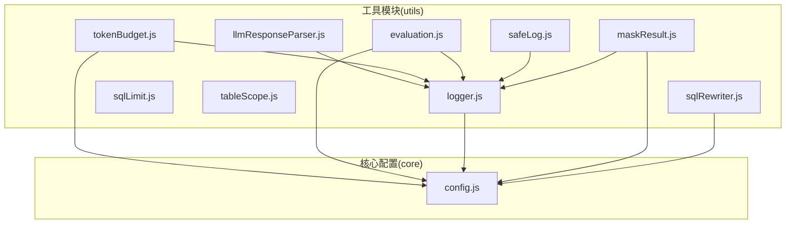

图表来源
- [tokenBudget.js:1-435](file://backend/src/utils/tokenBudget.js#L1-L435)
- [evaluation.js:1-488](file://backend/src/utils/evaluation.js#L1-L488)
- [logger.js:1-482](file://backend/src/utils/logger.js#L1-L482)
- [sqlLimit.js:1-37](file://backend/src/utils/sqlLimit.js#L1-L37)
- [safeLog.js:1-71](file://backend/src/utils/safeLog.js#L1-L71)
- [maskResult.js:1-198](file://backend/src/utils/maskResult.js#L1-L198)
- [tableScope.js:1-44](file://backend/src/utils/tableScope.js#L1-L44)
- [sqlRewriter.js:1-232](file://backend/src/utils/sqlRewriter.js#L1-L232)
- [llmResponseParser.js:1-146](file://backend/src/utils/llmResponseParser.js#L1-L146)
- [config.js:1-439](file://backend/src/core/config.js#L1-L439)

章节来源
- [tokenBudget.js:1-435](file://backend/src/utils/tokenBudget.js#L1-L435)
- [evaluation.js:1-488](file://backend/src/utils/evaluation.js#L1-L488)
- [logger.js:1-482](file://backend/src/utils/logger.js#L1-L482)
- [sqlLimit.js:1-37](file://backend/src/utils/sqlLimit.js#L1-L37)
- [safeLog.js:1-71](file://backend/src/utils/safeLog.js#L1-L71)
- [maskResult.js:1-198](file://backend/src/utils/maskResult.js#L1-L198)
- [tableScope.js:1-44](file://backend/src/utils/tableScope.js#L1-L44)
- [sqlRewriter.js:1-232](file://backend/src/utils/sqlRewriter.js#L1-L232)
- [llmResponseParser.js:1-146](file://backend/src/utils/llmResponseParser.js#L1-L146)
- [config.js:1-439](file://backend/src/core/config.js#L1-L439)

## 核心组件
- Token 预算管理：估算文本/对象 Token、计算上下文预算、生成压缩建议、裁剪历史与检索片段、自动压缩与状态检查
- 评估统计：向量化质量评估（Schema/查询相似度）、长期记忆命中率统计、运行时统计与报告、重置与测试数据集
- 日志记录：统一日志类、级别控制、文件轮转、结构化输出、事件派发、执行流程追踪（trace）
- SQL 限制：检测外层 LIMIT、确保追加 LIMIT
- 安全日志：Prompt/Query 脱敏摘要、完整输出开关
- 结果脱敏：按列名规则脱敏、不可变处理、规则映射
- 表作用域：表作用域推断、核心表判定
- 行级权限改写：AST 遍历注入租户过滤条件、映射解析、安全拒绝策略
- LLM 响应解析：JSON/SQL 提取策略、平衡花括号提取

章节来源
- [tokenBudget.js:1-435](file://backend/src/utils/tokenBudget.js#L1-L435)
- [evaluation.js:1-488](file://backend/src/utils/evaluation.js#L1-L488)
- [logger.js:1-482](file://backend/src/utils/logger.js#L1-L482)
- [sqlLimit.js:1-37](file://backend/src/utils/sqlLimit.js#L1-L37)
- [safeLog.js:1-71](file://backend/src/utils/safeLog.js#L1-L71)
- [maskResult.js:1-198](file://backend/src/utils/maskResult.js#L1-L198)
- [tableScope.js:1-44](file://backend/src/utils/tableScope.js#L1-L44)
- [sqlRewriter.js:1-232](file://backend/src/utils/sqlRewriter.js#L1-L232)
- [llmResponseParser.js:1-146](file://backend/src/utils/llmResponseParser.js#L1-L146)

## 架构总览
工具模块通过统一配置中心读取环境变量，日志模块贯穿各工具，评估与安全模块依赖日志进行可观测性，SQL 改写与 LIMIT 注入在执行前保障安全与合规。

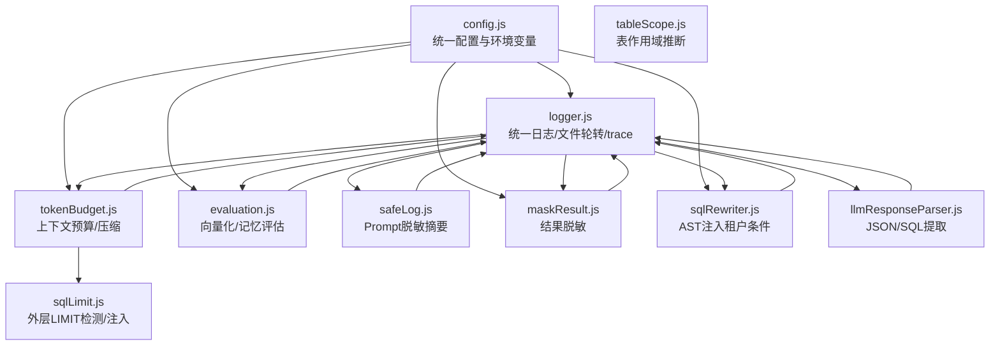

图表来源
- [config.js:1-439](file://backend/src/core/config.js#L1-L439)
- [logger.js:1-482](file://backend/src/utils/logger.js#L1-L482)
- [tokenBudget.js:1-435](file://backend/src/utils/tokenBudget.js#L1-L435)
- [evaluation.js:1-488](file://backend/src/utils/evaluation.js#L1-L488)
- [sqlLimit.js:1-37](file://backend/src/utils/sqlLimit.js#L1-L37)
- [safeLog.js:1-71](file://backend/src/utils/safeLog.js#L1-L71)
- [maskResult.js:1-198](file://backend/src/utils/maskResult.js#L1-L198)
- [tableScope.js:1-44](file://backend/src/utils/tableScope.js#L1-L44)
- [sqlRewriter.js:1-232](file://backend/src/utils/sqlRewriter.js#L1-L232)
- [llmResponseParser.js:1-146](file://backend/src/utils/llmResponseParser.js#L1-L146)

## 详细组件分析

### Token 预算管理（tokenBudget.js）
- 功能概览
  - 文本/对象 Token 估算（字符数估算、批量估算、JSON 序列化估算）
  - 上下文预算计算（系统提示、历史、检索片段、可用预算、使用率）
  - 建议生成（阈值触发、系统提示词长度、历史占比、检索片段压缩）
  - 上下文裁剪与压缩（历史轮数裁剪、检索片段智能压缩）
  - 自动压缩触发（按策略组合压缩，重新计算预算）
  - 快捷检查（安全状态、状态摘要）

- 算法与设计
  - 估算策略：基于字符数的保守估算（约 3.5 字符/Token），批量与对象估算采用 JSON 序列化
  - 预算计算：总 Token = 系统提示 + 历史 + 检索片段；可用预算 = 最大上下文 - 输出预留；使用率 = 总/可用
  - 压缩策略：优先裁剪历史（最近 N 轮）、其次压缩检索片段（按分数排序保留重要片段）、最后进一步裁剪
  - 建议生成：根据阈值与占比生成压缩建议，避免超限

- 性能与复杂度
  - 估算 O(n)（n 为字符数）
  - 历史裁剪 O(k)（k 为历史长度）
  - 检索压缩 O(m log m + t)（m 为片段数，按分数排序，t 为累计 Token）
  - 预算计算 O(1) 基本操作

- 错误处理
  - 输入校验（空/非字符串、NaN/非法数值）
  - 对象序列化失败时记录警告并返回 0
  - 压缩后重新计算预算，确保不超过预算

- 最佳实践
  - 在构建上下文前先估算并检查预算
  - 合理设置阈值与保留轮数，避免频繁压缩
  - 检索片段长度与数量应受控，避免接近最大限制

- 代码级关系图

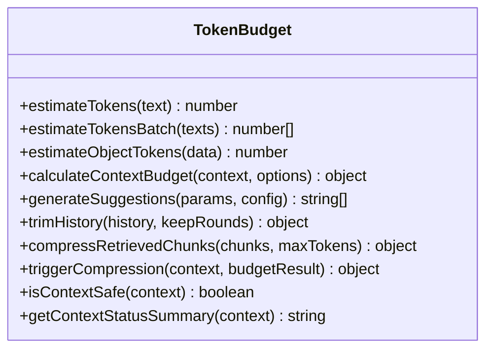

图表来源
- [tokenBudget.js:1-435](file://backend/src/utils/tokenBudget.js#L1-L435)

章节来源
- [tokenBudget.js:1-435](file://backend/src/utils/tokenBudget.js#L1-L435)

### 评估统计（evaluation.js）
- 功能概览
  - 向量化质量评估：Schema 表级向量检索质量、查询相似度向量相似度
  - 长期记忆命中率统计：按类型统计命中/未命中
  - 运行时统计：向量检索命中率、距离分布、总体命中率
  - 报告与重置：完整统计报告、统计数据重置
  - 测试数据集：默认 Schema 测试集与查询相似度测试对

- 算法与设计
  - 余弦相似度计算：点积/范数乘积，处理 NaN
  - Schema 评估：生成查询向量，智能搜索（带意图识别与重排序），提取表名，计算精度/召回/F1
  - 查询相似度评估：并行生成向量，计算相似度，统计高/中/低相似度分布
  - 记忆命中统计：按类型累加命中与未命中，计算命中率

- 性能与复杂度
  - 余弦相似度 O(d)（d 为向量维度）
  - Schema 评估 O(n*(m log m + t))（n 测试用例，m 片段，t 累计 Token）
  - 查询相似度评估 O(n*d)（n 成对，d 维度）

- 错误处理
  - 评估功能开关控制，未启用时返回提示
  - 统计记录静默失败，不影响主流程
  - 详细错误记录到日志

- 最佳实践
  - 评估功能需显式开启，避免生产环境开销
  - 使用默认测试数据集进行回归测试
  - 结合阈值进行质量门控

- 代码级关系图

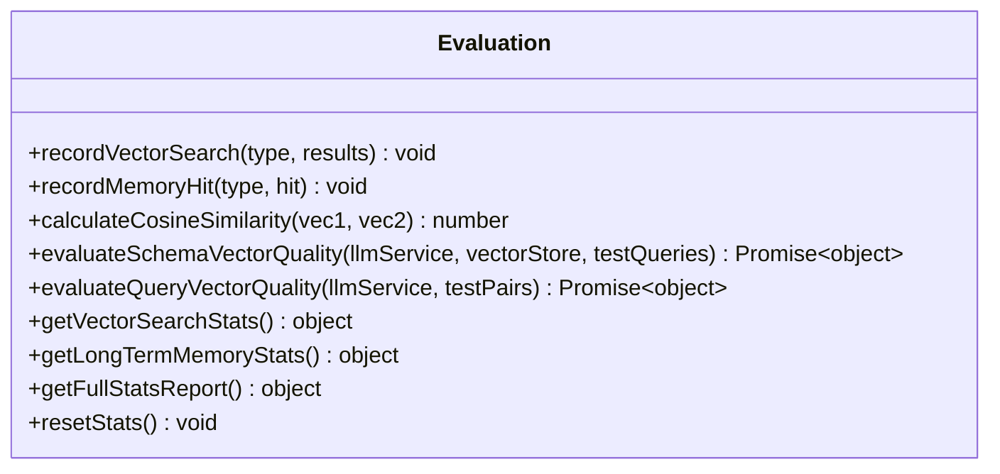

图表来源
- [evaluation.js:1-488](file://backend/src/utils/evaluation.js#L1-L488)

章节来源
- [evaluation.js:1-488](file://backend/src/utils/evaluation.js#L1-L488)

### 日志记录（logger.js）
- 功能概览
  - 多级别日志：TRACE/DEBUG/INFO/WARN/ERROR
  - 控制台彩色输出与文件输出
  - 文件轮转：按大小轮转、保留历史文件
  - 结构化日志：JSON 元数据
  - 事件派发：日志事件监听
  - 执行流程追踪：trace 会话、步骤记录、僵尸条目清理

- 算法与设计
  - 级别解析：大小写不敏感匹配，无效回退 INFO
  - 文件轮转：从旧到新依次重命名，最旧删除
  - 追踪上下文：Map 存储，容量保护与超时清理
  - 格式化：时间戳、级别、消息、JSON 元数据

- 性能与复杂度
  - 写入 O(1)（追加写入）
  - 轮转 O(k)（k 为历史文件数）
  - 追踪清理 O(n)（n 为上下文条目）

- 错误处理
  - 文件写入失败时输出到控制台，避免递归调用
  - 追踪上下文清理失败静默处理

- 最佳实践
  - 生产环境降低日志级别，启用文件输出
  - 使用 trace 追踪关键流程，避免过度打印
  - 合理设置轮转大小与保留数量

- 代码级关系图

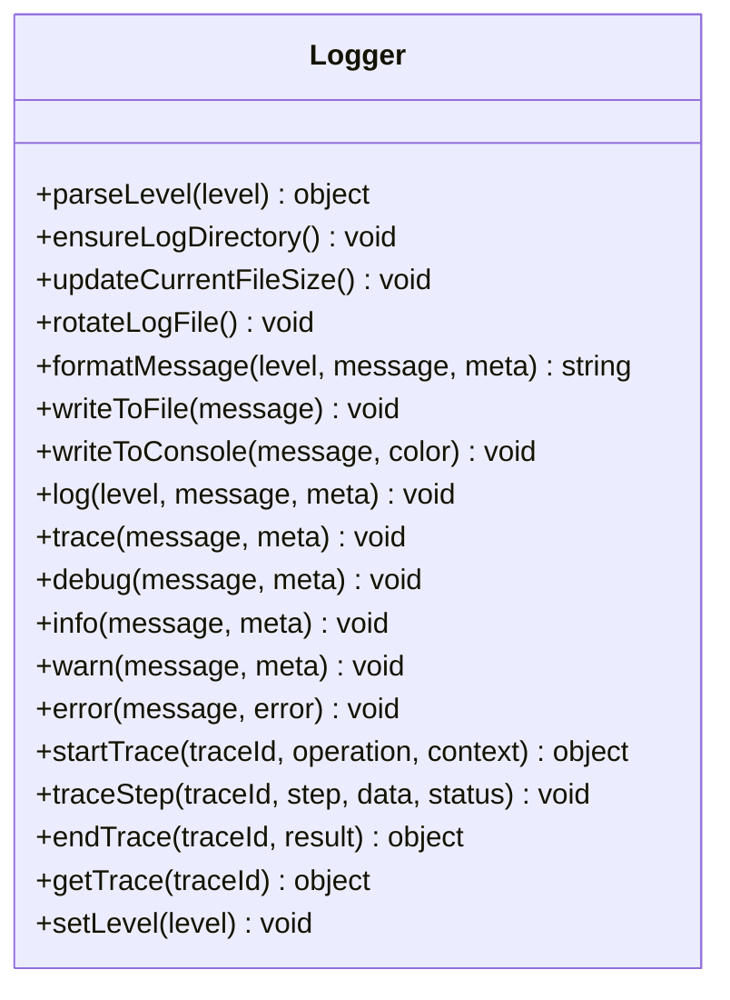

图表来源
- [logger.js:1-482](file://backend/src/utils/logger.js#L1-L482)

章节来源
- [logger.js:1-482](file://backend/src/utils/logger.js#L1-L482)

### SQL 限制（sqlLimit.js）
- 功能概览
  - 检测 SQL 最外层是否带有 LIMIT（忽略末尾分号与空白）
  - 未带 LIMIT 时追加 LIMIT，已带则原样返回

- 算法与设计
  - 正则匹配：支持 LIMIT n、LIMIT n,m、LIMIT n OFFSET m 三种尾形
  - 末尾空白与分号处理：去除尾部分号与空白后再匹配
  - 类型与边界校验：空/非字符串、非法数值直接返回原 SQL

- 性能与复杂度
  - 正则匹配 O(m)（m 为 SQL 长度）
  - 时间复杂度与空间复杂度均为 O(1)

- 最佳实践
  - 在执行前调用 ensureLimit，确保最大返回行数受控
  - 配合配置中心的 maxRows 使用

- 代码级关系图

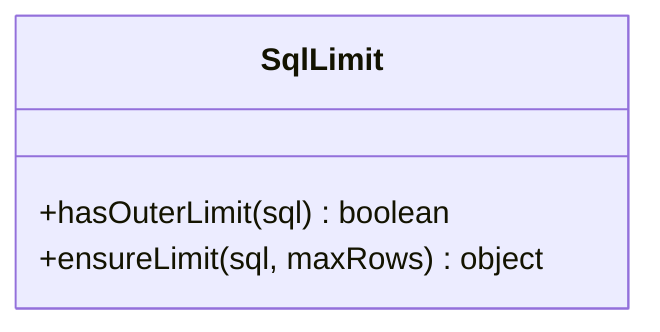

图表来源
- [sqlLimit.js:1-37](file://backend/src/utils/sqlLimit.js#L1-L37)

章节来源
- [sqlLimit.js:1-37](file://backend/src/utils/sqlLimit.js#L1-L37)

### 安全日志（safeLog.js）
- 功能概览
  - Prompt/Query 脱敏摘要：计算 SHA-1 前 8 位，保留首尾片段
  - 完整输出开关：LOG_PROMPT_FULL=true 时临时开启完整输出

- 算法与设计
  - hashPrompt：空/非字符串返回固定标记，避免异常
  - summarizePrompt：按 head/tail 截取，避免中段敏感信息泄露
  - isPromptFullLoggingEnabled：严格字符串对比，dev 环境临时使用

- 性能与复杂度
  - hash：O(n)（n 为文本长度）
  - summarize：O(n)（截取与哈希）

- 最佳实践
  - 正常运行时仅输出摘要，避免明文日志
  - 仅在排障时开启完整输出

- 代码级关系图

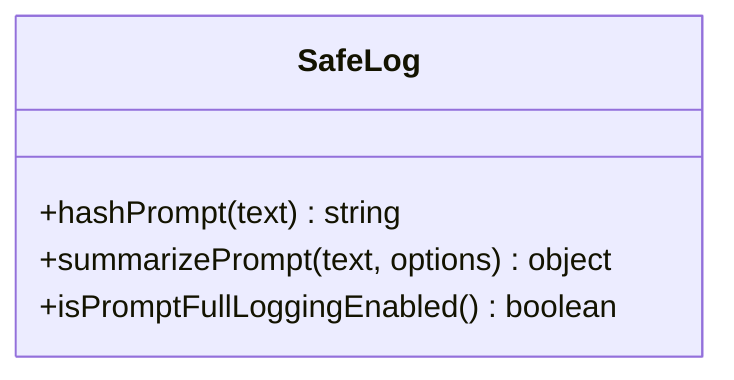

图表来源
- [safeLog.js:1-71](file://backend/src/utils/safeLog.js#L1-L71)

章节来源
- [safeLog.js:1-71](file://backend/src/utils/safeLog.js#L1-L71)

### 结果脱敏（maskResult.js）
- 功能概览
  - 规则驱动：按列名规则对查询结果进行脱敏
  - 支持对象行与数组行，列名大小写不敏感
  - 不可变处理：返回新数组，不修改输入
  - 规则：mid_4、domain_only、head_tail、redact、first_1、last_4、length_stars

- 算法与设计
  - 规则映射：normalizeRules 小写键，支持对象与数组列定义
  - applyRule：null/undefined 透传，未知规则不脱敏
  - maskRows：遍历行与列，按规则脱敏并统计脱敏单元数

- 性能与复杂度
  - maskRows：O(r*c)（r 行数，c 列数）
  - 规则函数 O(1)（字符串长度有限）

- 最佳实践
  - 在返回前端前调用 maskRows，确保敏感字段脱敏
  - 配合配置中心的安全规则使用

- 代码级关系图

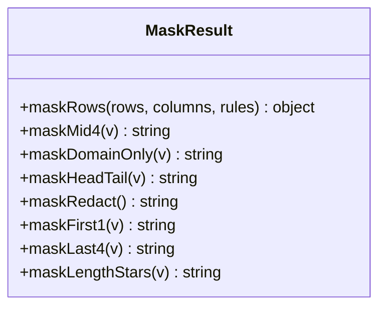

图表来源
- [maskResult.js:1-198](file://backend/src/utils/maskResult.js#L1-L198)

章节来源
- [maskResult.js:1-198](file://backend/src/utils/maskResult.js#L1-L198)

### 表作用域（tableScope.js）
- 功能概览
  - 表作用域推断：根据表名前缀与数据库名推断作用域子类型
  - 核心表判定：platform_core、report 为核心表

- 算法与设计
  - inferScopeSubtype：优先处理 new_ 前缀，其次 dwd_、tzpingtai_tz_sdk_、tzpingtai_
  - isCoreTable：基于推断结果判断核心表

- 性能与复杂度
  - O(1)（字符串匹配与正则）

- 最佳实践
  - 与 schemaLoader/tableRanker 共用，避免循环依赖
  - 用于筛选与排序时的辅助判断

- 代码级关系图

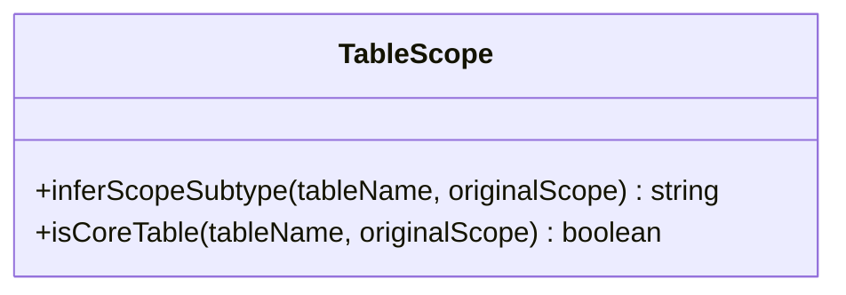

图表来源
- [tableScope.js:1-44](file://backend/src/utils/tableScope.js#L1-L44)

章节来源
- [tableScope.js:1-44](file://backend/src/utils/tableScope.js#L1-L44)

### 行级权限改写（sqlRewriter.js）
- 功能概览
  - AST 遍历：在 WHERE 追加租户过滤条件
  - 支持：单表 SELECT、JOIN、UNION、CTE、FROM 子查询
  - 安全拒绝：解析失败/AST 结构不识别/改写后不可解析时拒绝执行

- 算法与设计
  - injectTenantFilter：参数校验、AST 解析、遍历节点、构建条件、改写与二次验证
  - walkSelect：递归 CTE、遍历 FROM、命中表追加 WHERE、处理 UNION/子查询
  - buildTenantCond：构造二元表达式
  - normalizeMap：表名小写归一化
  - parseTenantMapEnv：解析环境变量映射

- 性能与复杂度
  - AST 解析与遍历：O(|AST|)（节点数）
  - 改写后验证：一次 sqlify + astify

- 错误处理
  - 解析失败/结构不支持/改写失败：refused=true，携带原因
  - 无表命中：放行原 SQL

- 最佳实践
  - 明确 tableTenantMap，避免误注入
  - 仅对 SELECT 语句生效，其他 DML 由上游拦截

- 代码级关系图

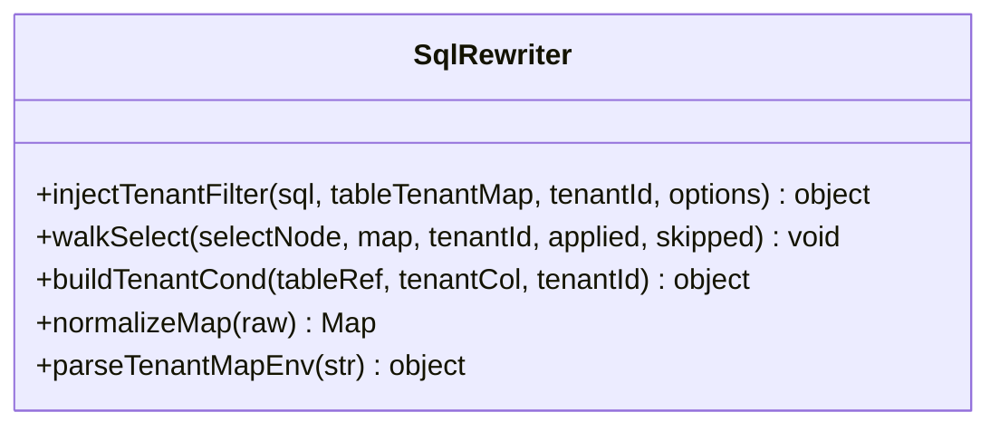

图表来源
- [sqlRewriter.js:1-232](file://backend/src/utils/sqlRewriter.js#L1-L232)

章节来源
- [sqlRewriter.js:1-232](file://backend/src/utils/sqlRewriter.js#L1-L232)

### LLM 响应解析（llmResponseParser.js）
- 功能概览
  - 统一 JSON 提取：直接解析、代码块、平衡花括号
  - SQL 提取：JSON.sql、代码块、SELECT 正则

- 算法与设计
  - parseJSON：三种策略顺序尝试，失败抛错
  - extractBalancedJSON：函数式匹配，正确处理嵌套与转义
  - extractSQL：优先 JSON.sql，其次代码块，最后正则

- 性能与复杂度
  - parseJSON：最坏 O(n)（n 为响应长度）
  - extractBalancedJSON：O(n)

- 最佳实践
  - 统一使用该解析器，避免分散实现
  - 上游保证响应格式一致性

- 代码级关系图

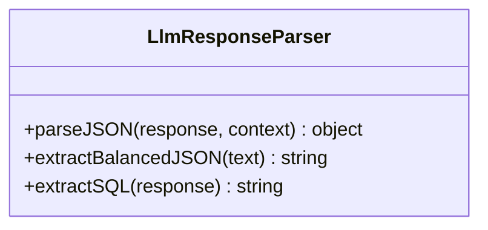

图表来源
- [llmResponseParser.js:1-146](file://backend/src/utils/llmResponseParser.js#L1-L146)

章节来源
- [llmResponseParser.js:1-146](file://backend/src/utils/llmResponseParser.js#L1-L146)

## 依赖分析
- 配置依赖
  - 各工具通过 config.js 读取环境变量，统一管理日志级别、上下文预算、安全规则、评估阈值等
- 日志依赖
  - 除评估与安全模块外，多数工具依赖 logger.js 进行可观测性
- 工具间协作
  - tokenBudget 与 sqlLimit 协作控制上下文与返回规模
  - safeLog 与 maskResult 在日志与结果层面共同保障安全
  - sqlRewriter 与 config 的 RLS 配置联动
  - llmResponseParser 为引擎与工具链提供统一解析

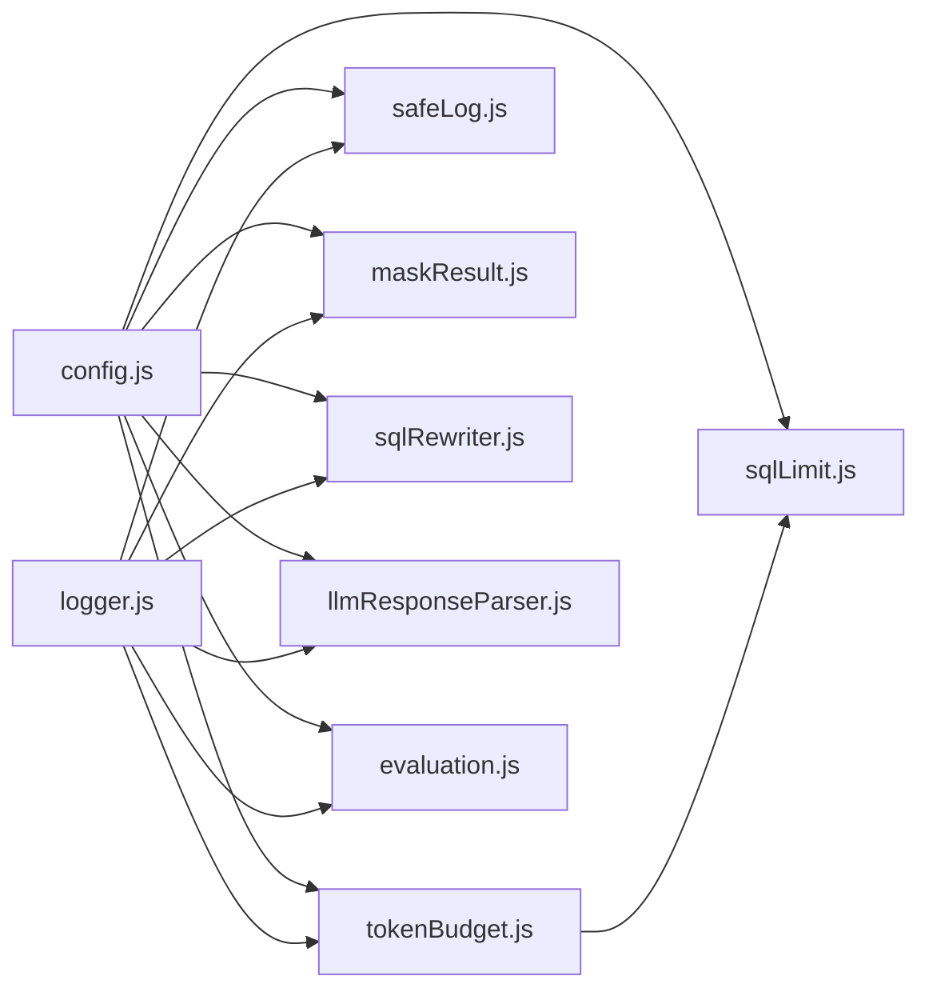

图表来源
- [config.js:1-439](file://backend/src/core/config.js#L1-L439)
- [logger.js:1-482](file://backend/src/utils/logger.js#L1-L482)
- [tokenBudget.js:1-435](file://backend/src/utils/tokenBudget.js#L1-L435)
- [sqlLimit.js:1-37](file://backend/src/utils/sqlLimit.js#L1-L37)
- [safeLog.js:1-71](file://backend/src/utils/safeLog.js#L1-L71)
- [maskResult.js:1-198](file://backend/src/utils/maskResult.js#L1-L198)
- [sqlRewriter.js:1-232](file://backend/src/utils/sqlRewriter.js#L1-L232)
- [llmResponseParser.js:1-146](file://backend/src/utils/llmResponseParser.js#L1-L146)
- [evaluation.js:1-488](file://backend/src/utils/evaluation.js#L1-L488)

章节来源
- [config.js:1-439](file://backend/src/core/config.js#L1-L439)
- [logger.js:1-482](file://backend/src/utils/logger.js#L1-L482)
- [tokenBudget.js:1-435](file://backend/src/utils/tokenBudget.js#L1-L435)
- [sqlLimit.js:1-37](file://backend/src/utils/sqlLimit.js#L1-L37)
- [safeLog.js:1-71](file://backend/src/utils/safeLog.js#L1-L71)
- [maskResult.js:1-198](file://backend/src/utils/maskResult.js#L1-L198)
- [sqlRewriter.js:1-232](file://backend/src/utils/sqlRewriter.js#L1-L232)
- [llmResponseParser.js:1-146](file://backend/src/utils/llmResponseParser.js#L1-L146)
- [evaluation.js:1-488](file://backend/src/utils/evaluation.js#L1-L488)

## 性能考量
- Token 预算
  - 估算与预算计算为 O(1) 基本操作，成本极低
  - 压缩策略按需触发，避免频繁重算
- 评估统计
  - 余弦相似度与 Schema 评估为 O(n*d)，注意批处理与阈值设置
- 日志
  - 文件轮转与结构化输出为 O(1) 追加写入，注意磁盘 IO
- SQL 改写
  - AST 解析与遍历为 O(|AST|)，建议在执行前一次性改写
- 结果脱敏
  - maskRows 为 O(r*c)，建议在返回前批量处理

## 故障排查指南
- 日志级别与输出
  - 检查 LOG_LEVEL、LOG_FILE、LOG_FILE_OUTPUT 是否正确
  - 使用 trace 追踪关键流程，定位问题步骤
- Token 预算超限
  - 使用 isContextSafe 快速检查，结合 getContextStatusSummary 获取状态摘要
  - 触发 triggerCompression 自动压缩，观察建议与动作
- SQL 限制
  - 使用 hasOuterLimit 检测是否已带 LIMIT，使用 ensureLimit 确保追加
- 安全日志
  - 检查 LOG_PROMPT_FULL 是否开启，避免误输出完整 Prompt
- 结果脱敏
  - 确认配置中心的 masking.rules 是否正确，列名大小写不敏感
- 行级权限改写
  - 检查 RLS_ENABLED 与 RLS_TABLE_TENANT_MAP，确保映射有效
  - 若 refused=true，查看原因（解析失败/结构不支持/改写失败）

章节来源
- [logger.js:1-482](file://backend/src/utils/logger.js#L1-L482)
- [tokenBudget.js:1-435](file://backend/src/utils/tokenBudget.js#L1-L435)
- [sqlLimit.js:1-37](file://backend/src/utils/sqlLimit.js#L1-L37)
- [safeLog.js:1-71](file://backend/src/utils/safeLog.js#L1-L71)
- [maskResult.js:1-198](file://backend/src/utils/maskResult.js#L1-L198)
- [sqlRewriter.js:1-232](file://backend/src/utils/sqlRewriter.js#L1-L232)
- [config.js:1-439](file://backend/src/core/config.js#L1-L439)

## 结论
本工具函数库围绕“上下文管理、评估、日志、安全与 SQL 改写”构建，通过统一配置与日志体系，形成高内聚、低耦合的工具生态。各模块职责清晰，具备良好的扩展性与可观测性，适合在 NL2SQL 场景中稳定运行与持续演进。

## 附录
- 最佳实践清单
  - 在构建上下文前估算并检查预算，必要时触发压缩
  - 评估功能仅在测试/回归场景启用，避免生产开销
  - 使用 safeLog 输出摘要，仅在排障时开启完整输出
  - 在返回前调用 maskRows 进行结果脱敏
  - 明确 RLS 映射，确保仅对 SELECT 注入租户条件
  - 使用 llmResponseParser 统一解析 LLM 响应
- 扩展与自定义
  - 新增规则：在 maskResult.js 中扩展 RULE_IMPL，并在配置中心注册
  - 新增评估指标：在 evaluation.js 中扩展统计与阈值
  - 新增日志级别：在 logger.js 中扩展 LogLevel 并更新解析逻辑
  - 新增 SQL 改写场景：在 sqlRewriter.js 中扩展 walkSelect 支持更多 AST 节点
- 测试参考
  - safeLog：见 test-safeLog.js
  - maskResult：见 test-masking.js
  - sqlRewriter：见 test-sqlRewriter.js

章节来源
- [test-safeLog.js:1-104](file://backend/test/phase3/test-safeLog.js#L1-L104)
- [test-masking.js:1-177](file://backend/test/phase3/test-masking.js#L1-L177)
- [test-sqlRewriter.js:1-222](file://backend/test/phase3/test-sqlRewriter.js#L1-L222)