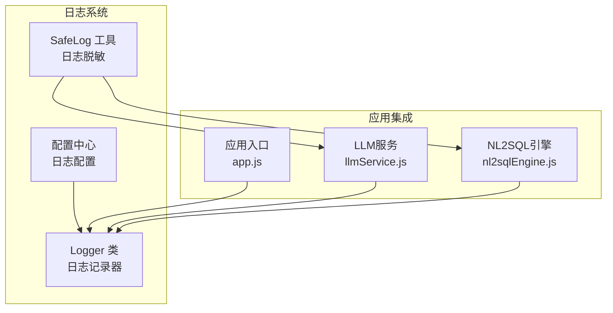
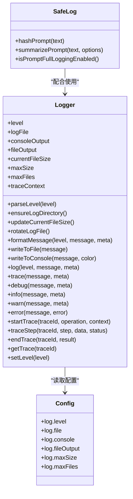
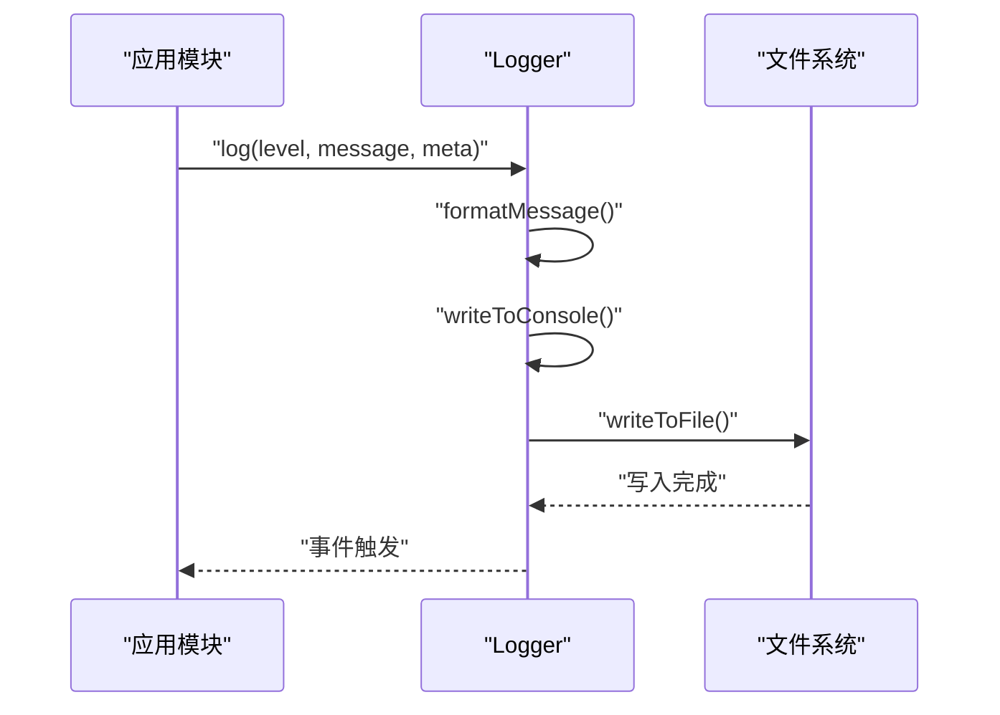
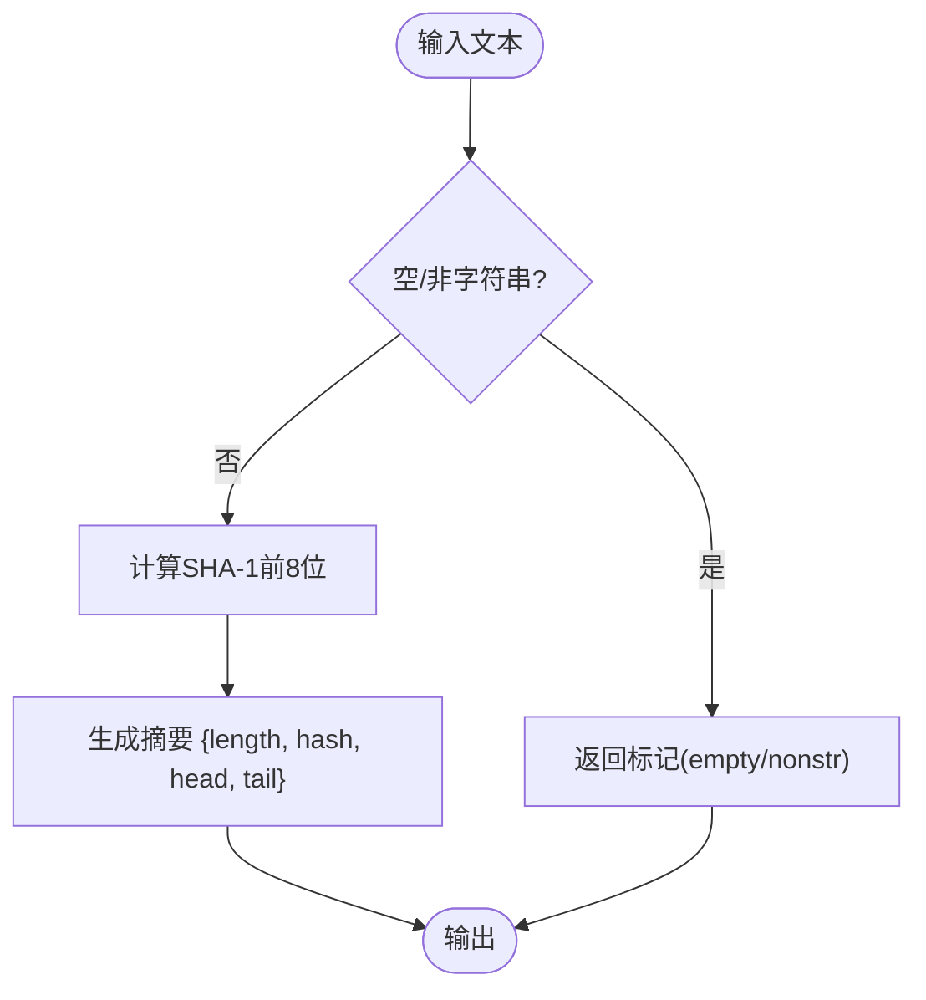
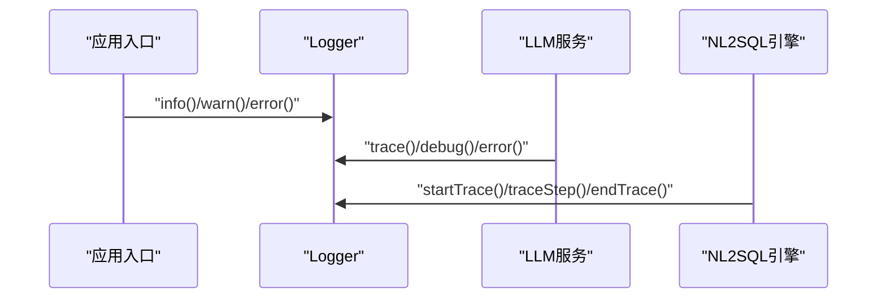
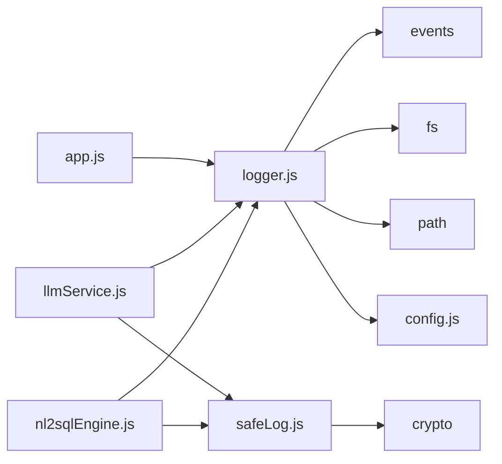

# 日志记录系统

<cite>
**本文档引用的文件**
- [logger.js](file://backend/src/utils/logger.js)
- [safeLog.js](file://backend/src/utils/safeLog.js)
- [config.js](file://backend/src/core/config.js)
- [app.js](file://backend/src/app.js)
- [llmService.js](file://backend/src/core/llmService.js)
- [nl2sqlEngine.js](file://backend/src/core/nl2sqlEngine.js)
- [test-safeLog.js](file://backend/test/phase3/test-safeLog.js)
</cite>

## 目录
1. [简介](#简介)
2. [项目结构](#项目结构)
3. [核心组件](#核心组件)
4. [架构概览](#架构概览)
5. [详细组件分析](#详细组件分析)
6. [依赖分析](#依赖分析)
7. [性能考虑](#性能考虑)
8. [故障排查指南](#故障排查指南)
9. [结论](#结论)
10. [附录](#附录)

## 简介
本文件为日志记录系统的完整技术文档，涵盖架构设计、实现原理、配置选项、使用方法与最佳实践。系统提供统一的日志记录能力，支持：
- 多级别日志（trace、debug、info、warn、error）
- 控制台彩色输出与文件输出
- 结构化日志格式与元数据
- 日志文件轮转与存储管理
- 执行流程追踪（trace）用于NL2SQL调试
- 日志脱敏工具，保障用户隐私与数据安全

## 项目结构
日志系统主要位于后端工程的工具模块中，核心文件如下：
- 日志工具：backend/src/utils/logger.js
- 日志脱敏工具：backend/src/utils/safeLog.js
- 配置中心：backend/src/core/config.js
- 应用入口与集成：backend/src/app.js
- 关键业务模块集成：backend/src/core/llmService.js、backend/src/core/nl2sqlEngine.js
- 单元测试：backend/test/phase3/test-safeLog.js

**图表来源**
- [logger.js:1-482](file://backend/src/utils/logger.js#L1-L482)
- [safeLog.js:1-71](file://backend/src/utils/safeLog.js#L1-L71)
- [config.js:236-254](file://backend/src/core/config.js#L236-L254)
- [app.js:40-240](file://backend/src/app.js#L40-L240)
- [llmService.js:240-439](file://backend/src/core/llmService.js#L240-L439)
- [nl2sqlEngine.js:130-329](file://backend/src/core/nl2sqlEngine.js#L130-L329)

**章节来源**
- [logger.js:1-482](file://backend/src/utils/logger.js#L1-L482)
- [safeLog.js:1-71](file://backend/src/utils/safeLog.js#L1-L71)
- [config.js:236-254](file://backend/src/core/config.js#L236-L254)
- [app.js:40-240](file://backend/src/app.js#L40-L240)

## 核心组件
- Logger 类：封装日志级别、格式化、输出、文件轮转、追踪上下文管理与事件发布。
- SafeLog 工具：提供哈希与摘要脱敏，支持按需开启完整日志输出。
- 配置中心：集中管理日志级别、文件路径、控制台/文件输出开关、轮转阈值等。

关键特性：
- 日志级别：TRACE < DEBUG < INFO < WARN < ERROR
- 结构化输出：时间戳、级别、消息、元数据JSON
- 文件轮转：按大小轮转，保留N份历史文件
- 追踪上下文：基于Map的会话追踪，带容量与过期保护
- 事件机制：日志事件可用于外部监听与扩展

**章节来源**
- [logger.js:29-44](file://backend/src/utils/logger.js#L29-L44)
- [logger.js:54-98](file://backend/src/utils/logger.js#L54-L98)
- [logger.js:188-200](file://backend/src/utils/logger.js#L188-L200)
- [logger.js:206-223](file://backend/src/utils/logger.js#L206-L223)
- [logger.js:246-264](file://backend/src/utils/logger.js#L246-L264)
- [logger.js:328-343](file://backend/src/utils/logger.js#L328-L343)
- [logger.js:352-448](file://backend/src/utils/logger.js#L352-L448)
- [safeLog.js:13-71](file://backend/src/utils/safeLog.js#L13-L71)
- [config.js:236-254](file://backend/src/core/config.js#L236-L254)

## 架构概览
日志系统采用“配置驱动 + 单例模式”的架构：
- 配置中心提供日志配置（级别、文件路径、轮转参数等）
- Logger 作为单例，初始化时读取配置并建立追踪上下文
- 业务模块通过 require 引入 Logger 实例进行日志记录
- SafeLog 作为辅助工具，对敏感内容进行脱敏处理

**图表来源**
- [logger.js:54-467](file://backend/src/utils/logger.js#L54-L467)
- [safeLog.js:13-71](file://backend/src/utils/safeLog.js#L13-L71)
- [config.js:236-254](file://backend/src/core/config.js#L236-L254)

## 详细组件分析

### Logger 类详解
- 初始化与配置
  - 从配置中心读取日志级别、文件路径、输出开关、轮转阈值
  - 确保日志目录存在，预估当前文件大小
- 日志级别与格式化
  - 支持 TRACE、DEBUG、INFO、WARN、ERROR 五级
  - 格式化输出包含时间戳、级别、消息与元数据JSON
- 输出与轮转
  - 控制台输出带ANSI颜色，文件输出去除颜色
  - 文件写入采用追加方式，写入后更新当前文件大小
  - 超过阈值时执行轮转：从最大编号向前移动，最旧文件删除
- 追踪上下文
  - Map 存储 traceId -> 会话，带容量上限与过期时间
  - 定时清理僵尸追踪条目，避免内存膨胀
  - 提供 startTrace、traceStep、endTrace、getTrace 方法
- 事件机制
  - 记录日志时触发 "log" 事件，携带级别、消息、元数据与时间戳

**图表来源**
- [logger.js:246-264](file://backend/src/utils/logger.js#L246-L264)
- [logger.js:206-223](file://backend/src/utils/logger.js#L206-L223)
- [logger.js:230-238](file://backend/src/utils/logger.js#L230-L238)

**章节来源**
- [logger.js:59-98](file://backend/src/utils/logger.js#L59-L98)
- [logger.js:105-110](file://backend/src/utils/logger.js#L105-L110)
- [logger.js:116-124](file://backend/src/utils/logger.js#L116-L124)
- [logger.js:130-141](file://backend/src/utils/logger.js#L130-L141)
- [logger.js:147-179](file://backend/src/utils/logger.js#L147-L179)
- [logger.js:188-200](file://backend/src/utils/logger.js#L188-L200)
- [logger.js:206-223](file://backend/src/utils/logger.js#L206-L223)
- [logger.js:230-238](file://backend/src/utils/logger.js#L230-L238)
- [logger.js:246-264](file://backend/src/utils/logger.js#L246-L264)
- [logger.js:328-343](file://backend/src/utils/logger.js#L328-L343)
- [logger.js:352-448](file://backend/src/utils/logger.js#L352-L448)

### SafeLog 工具详解
- hashPrompt：对文本计算SHA-1前8位，空/非字符串返回特定标记
- summarizePrompt：返回 { length, hash, head, tail }，短文本省略 tail
- isPromptFullLoggingEnabled：通过环境变量控制是否输出完整提示词（仅开发环境临时开启）

**图表来源**
- [safeLog.js:20-56](file://backend/src/utils/safeLog.js#L20-L56)

**章节来源**
- [safeLog.js:13-71](file://backend/src/utils/safeLog.js#L13-L71)

### 配置中心与日志配置
- 日志配置项
  - level：日志级别（trace/debug/info/warn/error）
  - file：日志文件路径
  - console：是否输出到控制台
  - fileOutput：是否输出到文件
  - maxSize：单文件最大大小（字节）
  - maxFiles：保留的历史文件数量
- 默认值与环境变量覆盖
  - 默认级别 info，文件 ./logs/app.log
  - maxSize 10MB，maxFiles 5
  - 通过环境变量 LOG_LEVEL、LOG_FILE、LOG_LEVEL 等覆盖

**章节来源**
- [config.js:236-254](file://backend/src/core/config.js#L236-L254)

### 应用集成与使用示例
- 应用入口集成
  - app.js 在启动、关闭、错误等关键节点使用 logger 记录
- 业务模块集成
  - llmService.js 在请求/响应、错误时使用 logger
  - nl2sqlEngine.js 使用 startTrace/traceStep/endTrace 进行流程追踪

**图表来源**
- [app.js:100-200](file://backend/src/app.js#L100-L200)
- [llmService.js:247-321](file://backend/src/core/llmService.js#L247-L321)
- [nl2sqlEngine.js:132-463](file://backend/src/core/nl2sqlEngine.js#L132-L463)

**章节来源**
- [app.js:40-240](file://backend/src/app.js#L40-L240)
- [llmService.js:240-439](file://backend/src/core/llmService.js#L240-L439)
- [nl2sqlEngine.js:130-329](file://backend/src/core/nl2sqlEngine.js#L130-L329)

## 依赖分析
- Logger 依赖
  - EventEmitter：事件发布
  - fs/path：文件系统与路径处理
  - config：日志配置
- SafeLog 依赖
  - crypto：哈希计算
- 集成关系
  - app.js、llmService.js、nl2sqlEngine.js 通过 require 引入 logger
  - llmService.js、nl2sqlEngine.js 使用 safeLog 对敏感内容脱敏

**图表来源**
- [logger.js:16-23](file://backend/src/utils/logger.js#L16-L23)
- [safeLog.js:11](file://backend/src/utils/safeLog.js#L11)
- [app.js:40-42](file://backend/src/app.js#L40-L42)
- [llmService.js:15-21](file://backend/src/core/llmService.js#L15-L21)
- [nl2sqlEngine.js:15-24](file://backend/src/core/nl2sqlEngine.js#L15-L24)

**章节来源**
- [logger.js:16-23](file://backend/src/utils/logger.js#L16-L23)
- [safeLog.js:11](file://backend/src/utils/safeLog.js#L11)
- [app.js:40-42](file://backend/src/app.js#L40-L42)
- [llmService.js:15-21](file://backend/src/core/llmService.js#L15-L21)
- [nl2sqlEngine.js:15-24](file://backend/src/core/nl2sqlEngine.js#L15-L24)

## 性能考虑
- I/O 性能
  - 文件写入采用同步追加，简单可靠但可能成为瓶颈。建议在高并发场景下：
    - 使用异步写入或批量缓冲
    - 降低日志级别或减少元数据复杂度
- 内存管理
  - 追踪上下文使用 Map，容量上限与过期时间控制内存占用
  - 定时清理僵尸条目，避免无限增长
- 轮转策略
  - maxSize 10MB，maxFiles 5，平衡磁盘占用与历史保留
  - 轮转时从最大编号向前移动，避免频繁重命名
- 脱敏与安全
  - 使用 SafeLog 对敏感内容进行摘要或哈希，避免明文日志
  - 通过环境变量临时开启完整日志，仅限开发调试

[本节为通用性能建议，不直接分析具体文件]

## 故障排查指南
- 常见问题与定位
  - 日志不输出：检查配置项 console 与 fileOutput，确认文件路径可写
  - 文件过大：调整 maxSize 与 maxFiles，或启用异步写入
  - 内存增长：检查 traceContext 容量与过期时间，确认定时清理正常
  - 脱敏异常：确认 safeLog 输入类型与环境变量 LOG_PROMPT_FULL
- 关键日志位置
  - 应用启动/关闭：app.js 中 info/warn/error
  - LLM调用：llmService.js 中 trace/debug/error
  - NL2SQL流程：nl2sqlEngine.js 中 startTrace/traceStep/endTrace
- 单元测试参考
  - test-safeLog.js 验证 hashPrompt、summarizePrompt、isPromptFullLoggingEnabled 的行为

**章节来源**
- [app.js:100-200](file://backend/src/app.js#L100-L200)
- [llmService.js:247-321](file://backend/src/core/llmService.js#L247-L321)
- [nl2sqlEngine.js:132-463](file://backend/src/core/nl2sqlEngine.js#L132-L463)
- [test-safeLog.js:1-104](file://backend/test/phase3/test-safeLog.js#L1-L104)

## 结论
本日志系统通过统一的 Logger 类与配置中心，实现了可控、可扩展、可追踪的日志能力。结合 SafeLog 的脱敏策略与完善的业务集成，既能满足开发调试需求，又兼顾生产环境的性能与安全。建议在高并发场景下进一步优化I/O与内存策略，并持续完善日志分析与告警机制。

[本节为总结性内容，不直接分析具体文件]

## 附录

### 日志配置选项清单
- log.level：日志级别（trace/debug/info/warn/error）
- log.file：日志文件路径
- log.console：是否输出到控制台
- log.fileOutput：是否输出到文件
- log.maxSize：单文件最大大小（字节）
- log.maxFiles：保留的历史文件数量

**章节来源**
- [config.js:236-254](file://backend/src/core/config.js#L236-L254)

### 自定义日志处理器实现思路
- 基于 EventEmitter
  - Logger 继承 EventEmitter，记录日志时触发 "log" 事件
  - 外部模块可通过 on('log') 监听并实现自定义处理器（如发送到远程日志服务）
- 文件轮转扩展
  - 可在 rotateLogFile 前后增加钩子，实现压缩、上传或通知
- 级别过滤
  - 通过 setLevel 动态调整级别，支持灰度切换

**章节来源**
- [logger.js:262-264](file://backend/src/utils/logger.js#L262-L264)
- [logger.js:463-466](file://backend/src/utils/logger.js#L463-L466)