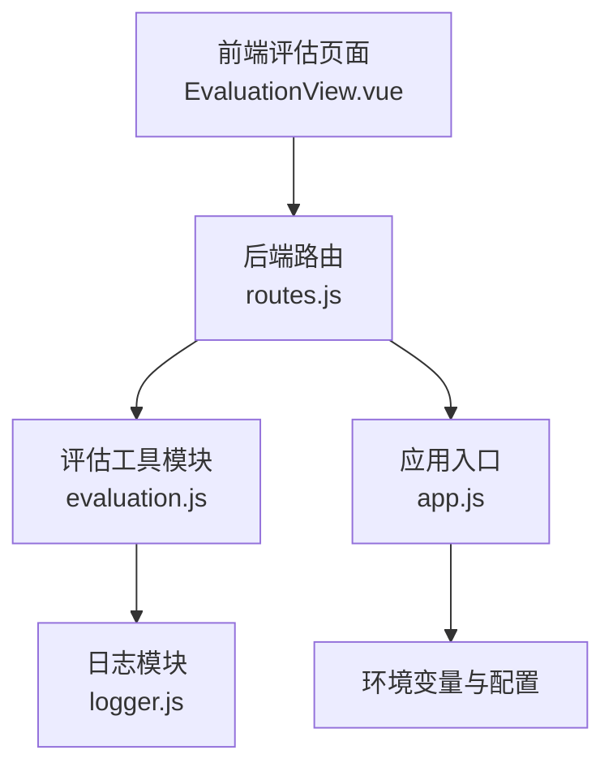
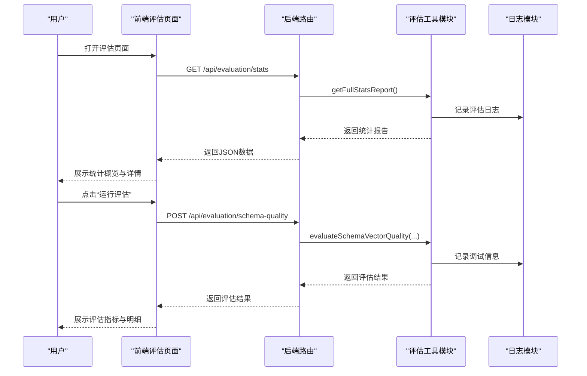
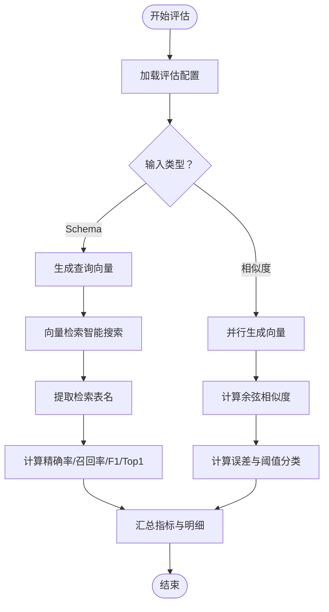
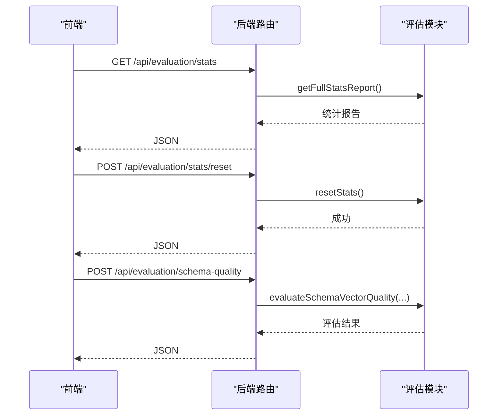
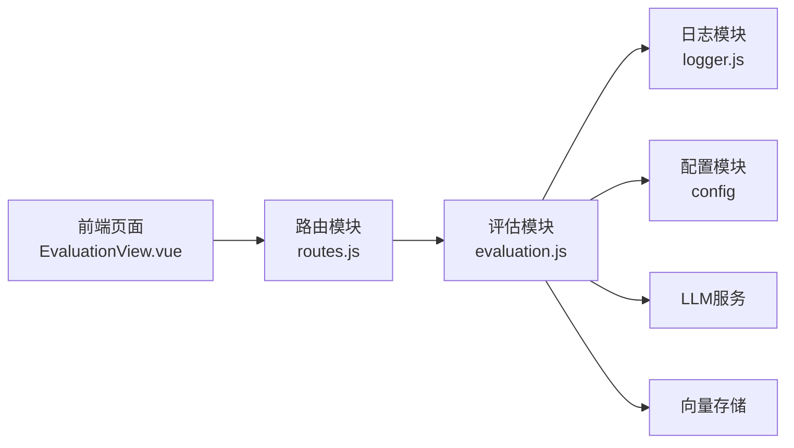

# 评估统计工具

<cite>
**本文引用的文件**
- [evaluation.js](file://backend/src/utils/evaluation.js)
- [EvaluationView.vue](file://frontend/src/views/EvaluationView.vue)
- [routes.js](file://backend/src/core/routes.js)
- [logger.js](file://backend/src/utils/logger.js)
- [app.js](file://backend/src/app.js)
- [package.json](file://backend/package.json)
</cite>

## 目录
1. [简介](#简介)
2. [项目结构](#项目结构)
3. [核心组件](#核心组件)
4. [架构总览](#架构总览)
5. [详细组件分析](#详细组件分析)
6. [依赖分析](#依赖分析)
7. [性能考虑](#性能考虑)
8. [故障排除指南](#故障排除指南)
9. [结论](#结论)
10. [附录](#附录)

## 简介
本文件为 NL2SQL 项目中的“评估统计工具”模块提供全面技术文档。该模块旨在：
- 计算向量化质量与检索命中率等关键指标
- 收集与统计查询历史、执行结果与用户偏好等数据
- 生成评估报告并提供可视化展示
- 支持配置开关与阈值调整，便于定制化评估
- 提供评估结果解读与改进建议，辅助开发者持续优化系统

评估工具采用“非侵入式”设计，不影响主业务流程，同时提供运行时统计与离线质量评估两种能力。

## 项目结构
评估统计工具涉及前后端协作：
- 后端提供评估配置、运行时统计、质量评估与API接口
- 前端提供评估页面，展示统计概览、详细分布与质量评估结果
- 日志模块用于记录评估过程与调试信息
- 应用入口负责加载环境变量与启动服务

图表来源
- [EvaluationView.vue:1-699](file://frontend/src/views/EvaluationView.vue#L1-L699)
- [routes.js:720-800](file://backend/src/core/routes.js#L720-L800)
- [evaluation.js:1-488](file://backend/src/utils/evaluation.js#L1-L488)
- [logger.js:1-482](file://backend/src/utils/logger.js#L1-L482)
- [app.js:1-279](file://backend/src/app.js#L1-L279)

章节来源
- [EvaluationView.vue:1-699](file://frontend/src/views/EvaluationView.vue#L1-L699)
- [routes.js:720-800](file://backend/src/core/routes.js#L720-L800)
- [evaluation.js:1-488](file://backend/src/utils/evaluation.js#L1-L488)
- [logger.js:1-482](file://backend/src/utils/logger.js#L1-L482)
- [app.js:1-279](file://backend/src/app.js#L1-L279)

## 核心组件
- 评估配置与阈值：支持启用/禁用评估、开启运行时统计、设定相似度与质量阈值
- 运行时统计：记录向量检索命中、距离分布、长期记忆命中与按类型统计
- 质量评估：Schema向量化质量评估（精确率、召回率、F1分数、Top1命中）、查询相似度评估（余弦相似度、平均误差）
- 报告与可视化：提供完整统计报告、按类型命中率、距离分布、评估结果表格
- API接口：获取统计、重置统计、执行质量评估

章节来源
- [evaluation.js:19-31](file://backend/src/utils/evaluation.js#L19-L31)
- [evaluation.js:37-60](file://backend/src/utils/evaluation.js#L37-L60)
- [evaluation.js:158-266](file://backend/src/utils/evaluation.js#L158-L266)
- [evaluation.js:276-334](file://backend/src/utils/evaluation.js#L276-L334)
- [evaluation.js:397-407](file://backend/src/utils/evaluation.js#L397-L407)
- [EvaluationView.vue:28-156](file://frontend/src/views/EvaluationView.vue#L28-L156)
- [EvaluationView.vue:159-299](file://frontend/src/views/EvaluationView.vue#L159-L299)
- [routes.js:728-762](file://backend/src/core/routes.js#L728-L762)
- [routes.js:773-800](file://backend/src/core/routes.js#L773-L800)

## 架构总览
评估系统采用“前端展示 + 后端统计/评估 + 日志记录”的分层架构。前端通过API拉取实时统计与执行评估；后端在运行时记录命中率与距离分布，在需要时执行离线质量评估；日志模块贯穿评估流程，便于问题定位与审计。

图表来源
- [EvaluationView.vue:417-491](file://frontend/src/views/EvaluationView.vue#L417-L491)
- [routes.js:728-800](file://backend/src/core/routes.js#L728-L800)
- [evaluation.js:158-266](file://backend/src/utils/evaluation.js#L158-L266)
- [logger.js:276-322](file://backend/src/utils/logger.js#L276-L322)

## 详细组件分析

### 评估配置与阈值
- 配置项
  - enabled：是否启用评估功能
  - trackStats：是否记录运行时统计
  - thresholds：相似度与质量阈值（高/中）
- 设计原则：通过环境变量控制，避免硬编码；阈值可调，适配不同场景

章节来源
- [evaluation.js:19-31](file://backend/src/utils/evaluation.js#L19-L31)

### 运行时统计（内存中）
- 向量检索统计
  - schema/query：分别统计搜索次数与命中次数
  - 距离分布：按区间统计（极近、较近、中等、较远）
- 长期记忆统计
  - 总查询数、总命中数、按类型命中/未命中统计
- 统计查询与重置
  - getVectorSearchStats、getLongTermMemoryStats、getFullStatsReport、resetStats

章节来源
- [evaluation.js:37-60](file://backend/src/utils/evaluation.js#L37-L60)
- [evaluation.js:344-391](file://backend/src/utils/evaluation.js#L344-L391)
- [evaluation.js:397-429](file://backend/src/utils/evaluation.js#L397-L429)

### 质量评估算法
- Schema向量化质量评估
  - 输入：测试查询集合（查询文本、期望表集合）
  - 步骤：生成查询向量 → 智能搜索 → 提取检索表名 → 计算精确率、召回率、F1分数、Top1命中
  - 指标：准确率（高质量占比）、平均精确率、平均召回率、平均F1分数
- 查询相似度评估
  - 输入：相似查询对（查询1、查询2、期望相似度）
  - 步骤：并行生成向量 → 余弦相似度 → 计算误差
  - 指标：高/中/低相似度对数量、平均误差
- 余弦相似度计算
  - 点积与范数归一化，处理NaN边界

图表来源
- [evaluation.js:158-266](file://backend/src/utils/evaluation.js#L158-L266)
- [evaluation.js:276-334](file://backend/src/utils/evaluation.js#L276-L334)
- [evaluation.js:134-147](file://backend/src/utils/evaluation.js#L134-L147)

章节来源
- [evaluation.js:134-147](file://backend/src/utils/evaluation.js#L134-L147)
- [evaluation.js:158-266](file://backend/src/utils/evaluation.js#L158-L266)
- [evaluation.js:276-334](file://backend/src/utils/evaluation.js#L276-L334)

### API接口与前端集成
- 后端接口
  - GET /api/evaluation/stats：获取完整统计报告
  - POST /api/evaluation/stats/reset：重置统计数据
  - POST /api/evaluation/schema-quality：执行Schema向量化质量评估
- 前端页面
  - 展示统计概览（Schema检索命中率、查询历史命中率、长期记忆命中率）
  - 展示详细统计（距离分布、记忆类型命中率）
  - 执行评估（并行运行Schema与相似度评估），展示指标与明细

图表来源
- [routes.js:728-800](file://backend/src/core/routes.js#L728-L800)
- [evaluation.js:397-429](file://backend/src/utils/evaluation.js#L397-L429)
- [EvaluationView.vue:417-491](file://frontend/src/views/EvaluationView.vue#L417-L491)

章节来源
- [routes.js:728-800](file://backend/src/core/routes.js#L728-L800)
- [EvaluationView.vue:417-491](file://frontend/src/views/EvaluationView.vue#L417-L491)

### 日志与调试
- 日志模块提供统一的结构化日志，支持级别控制、文件轮转、追踪上下文
- 评估模块在关键节点记录调试信息（如向量搜索结果、表名提取），便于问题定位

章节来源
- [logger.js:276-322](file://backend/src/utils/logger.js#L276-L322)
- [evaluation.js:182-208](file://backend/src/utils/evaluation.js#L182-L208)
- [evaluation.js:199-208](file://backend/src/utils/evaluation.js#L199-L208)

## 依赖分析
- 评估模块依赖
  - 日志模块：记录评估过程与错误
  - 配置模块：读取评估开关与阈值
  - LLM服务与向量存储：用于生成嵌入与检索
- 前后端交互
  - 前端通过API获取统计与执行评估
  - 后端路由封装评估逻辑并返回结构化结果

图表来源
- [evaluation.js:12-13](file://backend/src/utils/evaluation.js#L12-L13)
- [routes.js:28-29](file://backend/src/core/routes.js#L28-L29)
- [EvaluationView.vue](file://frontend/src/views/EvaluationView.vue#L324)

章节来源
- [evaluation.js:12-13](file://backend/src/utils/evaluation.js#L12-L13)
- [routes.js:28-29](file://backend/src/core/routes.js#L28-L29)
- [EvaluationView.vue](file://frontend/src/views/EvaluationView.vue#L324)

## 性能考虑
- 运行时统计为内存态，避免额外IO开销，适合高频查询场景
- 质量评估采用并行向量生成（相似度评估），减少等待时间
- 日志模块支持文件轮转与级别控制，避免日志膨胀影响性能
- 评估功能可通过配置开关关闭，降低生产环境负载

## 故障排除指南
- 评估功能未启用
  - 现象：前端提示未启用，后端接口返回错误
  - 处理：设置环境变量启用评估功能
- 评估接口报错
  - 现象：获取统计或执行评估时报错
  - 处理：检查日志模块与评估模块错误日志，确认LLM服务与向量存储可用性
- 统计数据异常
  - 现象：命中率或分布异常
  - 处理：重置统计数据后重新采集，检查阈值设置与检索策略

章节来源
- [routes.js:775-780](file://backend/src/core/routes.js#L775-L780)
- [EvaluationView.vue:440-461](file://frontend/src/views/EvaluationView.vue#L440-L461)
- [logger.js:312-322](file://backend/src/utils/logger.js#L312-L322)

## 结论
评估统计工具通过“运行时统计 + 离线质量评估”的双轨机制，为 NL2SQL 系统提供了可观测性与持续改进的基础。其非侵入式设计与灵活的配置选项，使得评估既能满足日常监控，也能支持专项质量分析。建议结合日志与阈值策略，定期生成评估报告并制定优化方案。

## 附录

### API定义
- 获取统计
  - 方法：GET
  - 路径：/api/evaluation/stats
  - 响应：包含向量检索统计、长期记忆统计、配置状态与生成时间
- 重置统计
  - 方法：POST
  - 路径：/api/evaluation/stats/reset
  - 响应：成功消息
- 执行Schema质量评估
  - 方法：POST
  - 路径：/api/evaluation/schema-quality
  - 请求体：可选测试查询数组（若为空则使用默认测试集）
  - 响应：评估结果（准确率、平均指标、明细）

章节来源
- [routes.js:728-762](file://backend/src/core/routes.js#L728-L762)
- [routes.js:773-800](file://backend/src/core/routes.js#L773-L800)

### 配置选项
- 环境变量
  - EVALUATION_ENABLED：启用/禁用评估功能
  - EVALUATION_TRACK_STATS：启用/禁用运行时统计
- 阈值
  - 高/中相似度阈值
  - 高/中质量阈值（用于Schema评估）

章节来源
- [evaluation.js:21-31](file://backend/src/utils/evaluation.js#L21-L31)

### 自定义评估指标方法
- 修改阈值：在评估配置中调整相似度与质量阈值
- 扩展测试集：在评估模块中添加或替换默认测试数据
- 新增评估维度：在评估模块中扩展指标计算逻辑，并在前端页面展示

章节来源
- [evaluation.js:439-459](file://backend/src/utils/evaluation.js#L439-L459)
- [EvaluationView.vue:177-299](file://frontend/src/views/EvaluationView.vue#L177-L299)