# 开发指南

<cite>
**本文档引用的文件**
- [backend/package.json](file://backend/package.json)
- [frontend/package.json](file://frontend/package.json)
- [backend/src/app.js](file://backend/src/app.js)
- [backend/src/core/config.js](file://backend/src/core/config.js)
- [backend/src/utils/logger.js](file://backend/src/utils/logger.js)
- [backend/src/core/routes.js](file://backend/src/core/routes.js)
- [backend/src/memory/longTermMemory.js](file://backend/src/memory/longTermMemory.js)
- [backend/src/utils/evaluation.js](file://backend/src/utils/evaluation.js)
- [backend/config/feature-flags.js](file://backend/config/feature-flags.js)
- [backend/test/context-management.test.js](file://backend/test/context-management.test.js)
- [frontend/src/main.js](file://frontend/src/main.js)
- [frontend/src/router/index.js](file://frontend/src/router/index.js)
- [frontend/src/stores/session.js](file://frontend/src/stores/session.js)
- [frontend/src/utils/api.js](file://frontend/src/utils/api.js)
</cite>

## 目录
1. [简介](#简介)
2. [项目结构](#项目结构)
3. [核心组件](#核心组件)
4. [架构概览](#架构概览)
5. [详细组件分析](#详细组件分析)
6. [依赖分析](#依赖分析)
7. [性能考虑](#性能考虑)
8. [故障排查指南](#故障排查指南)
9. [结论](#结论)
10. [附录](#附录)

## 简介
本指南面向NL2SQL项目的开发者，提供从环境搭建、代码规范、测试策略到贡献流程的完整说明。项目采用前后端分离架构：后端基于Node.js + Express提供REST API与SSE流式响应，前端基于Vue 3 + Pinia提供交互界面。系统具备上下文管理、长期记忆、向量化检索与评估统计等高级能力。

## 项目结构
项目分为三个主要部分：
- 后端（backend）：Node.js + Express，提供REST API、SSE、日志、配置、评估与长期记忆等功能模块
- 前端（frontend）：Vue 3 + Vite，提供路由、状态管理、API封装与UI组件
- 文档（docs）：项目文档与计划

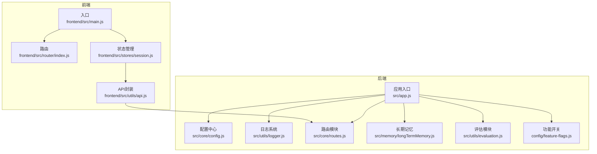

**图表来源**
- [backend/src/app.js:1-260](file://backend/src/app.js#L1-L260)
- [backend/src/core/config.js:1-398](file://backend/src/core/config.js#L1-L398)
- [backend/src/utils/logger.js:1-442](file://backend/src/utils/logger.js#L1-L442)
- [backend/src/core/routes.js:1-800](file://backend/src/core/routes.js#L1-L800)
- [backend/src/memory/longTermMemory.js:1-800](file://backend/src/memory/longTermMemory.js#L1-L800)
- [backend/src/utils/evaluation.js:1-488](file://backend/src/utils/evaluation.js#L1-L488)
- [backend/config/feature-flags.js:1-249](file://backend/config/feature-flags.js#L1-L249)
- [frontend/src/main.js:1-89](file://frontend/src/main.js#L1-L89)
- [frontend/src/router/index.js:1-157](file://frontend/src/router/index.js#L1-L157)
- [frontend/src/stores/session.js:1-400](file://frontend/src/stores/session.js#L1-L400)
- [frontend/src/utils/api.js:1-303](file://frontend/src/utils/api.js#L1-L303)

**章节来源**
- [backend/src/app.js:1-260](file://backend/src/app.js#L1-L260)
- [frontend/src/main.js:1-89](file://frontend/src/main.js#L1-L89)

## 核心组件
- 应用入口与生命周期：负责环境变量加载、模块初始化、HTTP/SSE服务启动与优雅关闭
- 配置中心：集中管理LLM、数据库、安全、日志、评估等配置，支持环境变量覆盖
- 日志系统：统一日志格式、文件轮转、结构化日志与执行流程追踪
- 路由模块：提供健康检查、Schema查询、会话管理、查询历史、长期记忆、评估接口
- 长期记忆：用户偏好提取、存储与异步维护，支持LLM智能分析与阈值筛选
- 评估模块：向量化质量评估与运行时统计，支持重置与报告生成
- 功能开关：渐进式功能控制，支持快速回滚
- 前端入口与状态管理：路由、SSE连接、会话状态与API封装

**章节来源**
- [backend/src/app.js:97-188](file://backend/src/app.js#L97-L188)
- [backend/src/core/config.js:16-355](file://backend/src/core/config.js#L16-L355)
- [backend/src/utils/logger.js:54-442](file://backend/src/utils/logger.js#L54-L442)
- [backend/src/core/routes.js:72-800](file://backend/src/core/routes.js#L72-L800)
- [backend/src/memory/longTermMemory.js:313-471](file://backend/src/memory/longTermMemory.js#L313-L471)
- [backend/src/utils/evaluation.js:158-488](file://backend/src/utils/evaluation.js#L158-L488)
- [backend/config/feature-flags.js:16-249](file://backend/config/feature-flags.js#L16-L249)
- [frontend/src/main.js:55-89](file://frontend/src/main.js#L55-L89)
- [frontend/src/stores/session.js:33-399](file://frontend/src/stores/session.js#L33-L399)

## 架构概览
后端采用模块化设计，核心模块通过配置中心统一接入，前端通过Axios封装的API与后端交互，SSE用于实时流式响应。

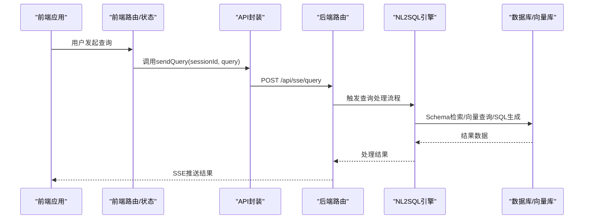

**图表来源**
- [frontend/src/stores/session.js:297-330](file://frontend/src/stores/session.js#L297-L330)
- [frontend/src/utils/api.js:246-251](file://frontend/src/utils/api.js#L246-L251)
- [backend/src/core/routes.js:722-800](file://backend/src/core/routes.js#L722-L800)

## 详细组件分析

### 应用入口与生命周期
- 环境变量加载：通过dotenv读取.env配置
- 中间件配置：CORS、JSON解析、URL编码解析
- 模块初始化：数据目录、SQLite、LanceDB、Schema、业务语义层、功能开关
- 优雅关闭：HTTP关闭、SSE断开、定时任务停止、数据库连接关闭

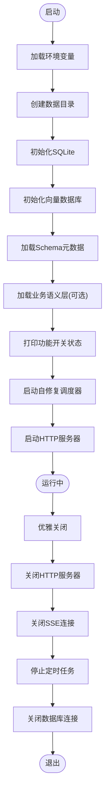

**图表来源**
- [backend/src/app.js:97-188](file://backend/src/app.js#L97-L188)
- [backend/src/app.js:198-252](file://backend/src/app.js#L198-L252)

**章节来源**
- [backend/src/app.js:97-188](file://backend/src/app.js#L97-L188)
- [backend/src/app.js:198-252](file://backend/src/app.js#L198-L252)

### 配置中心
- 环境变量优先：端口、运行环境、LLM API、嵌入模型、数据库、安全策略、日志、自修复、Schema、长期记忆、上下文管理、评估
- 配置校验：必要项检查与白名单警告
- 动态开关：开发/生产环境差异

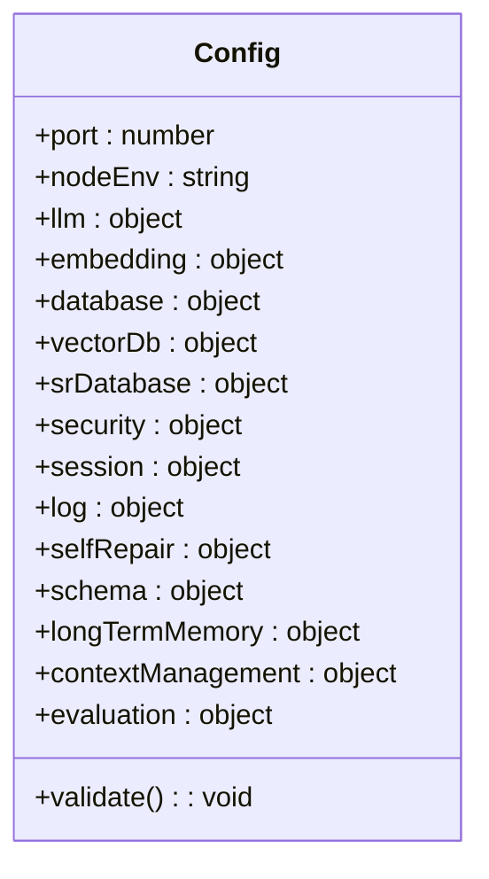

**图表来源**
- [backend/src/core/config.js:16-355](file://backend/src/core/config.js#L16-L355)

**章节来源**
- [backend/src/core/config.js:16-355](file://backend/src/core/config.js#L16-L355)

### 日志系统
- 多级别日志：TRACE、DEBUG、INFO、WARN、ERROR
- 文件轮转：大小阈值与文件数量限制
- 结构化日志：支持元数据与错误栈
- 执行追踪：trace、traceStep、endTrace，便于NL2SQL流程调试

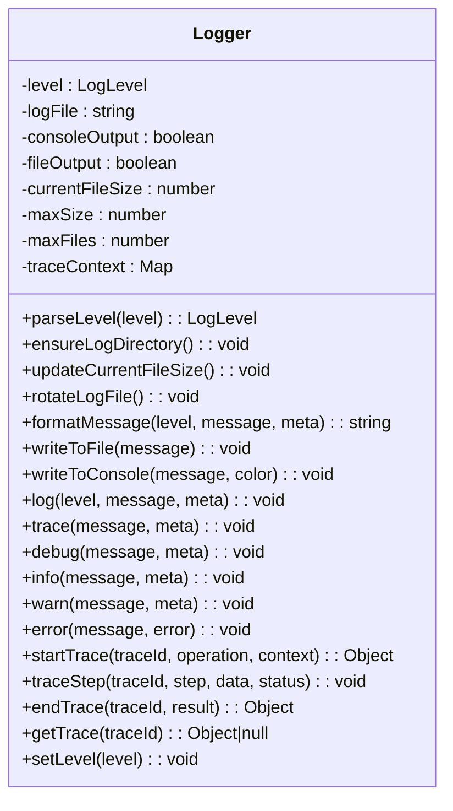

**图表来源**
- [backend/src/utils/logger.js:54-442](file://backend/src/utils/logger.js#L54-L442)

**章节来源**
- [backend/src/utils/logger.js:54-442](file://backend/src/utils/logger.js#L54-L442)

### 路由模块
- 健康检查：基础与详细健康状态
- Schema接口：获取表/指标/维度、表详情、搜索
- 会话管理：创建、查询、删除、消息历史
- 长期记忆：偏好列表、模板、别名学习、统计
- 评估接口：统计报告、重置、Schema质量评估

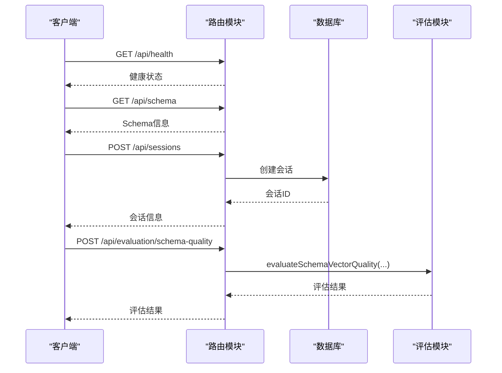

**图表来源**
- [backend/src/core/routes.js:72-137](file://backend/src/core/routes.js#L72-L137)
- [backend/src/core/routes.js:150-250](file://backend/src/core/routes.js#L150-L250)
- [backend/src/core/routes.js:266-398](file://backend/src/core/routes.js#L266-L398)
- [backend/src/core/routes.js:553-664](file://backend/src/core/routes.js#L553-L664)
- [backend/src/core/routes.js:771-800](file://backend/src/core/routes.js#L771-L800)

**章节来源**
- [backend/src/core/routes.js:72-137](file://backend/src/core/routes.js#L72-L137)
- [backend/src/core/routes.js:150-250](file://backend/src/core/routes.js#L150-L250)
- [backend/src/core/routes.js:266-398](file://backend/src/core/routes.js#L266-L398)
- [backend/src/core/routes.js:553-664](file://backend/src/core/routes.js#L553-L664)
- [backend/src/core/routes.js:771-800](file://backend/src/core/routes.js#L771-L800)

### 长期记忆（Layer 2）
- 偏好提取：查询模式、字段别名、指标/维度偏好
- 存储策略：置信度阈值、高频模式、高价值模板
- 异步存储：通过内存队列异步持久化
- LLM智能分析：区分个人偏好与通用知识

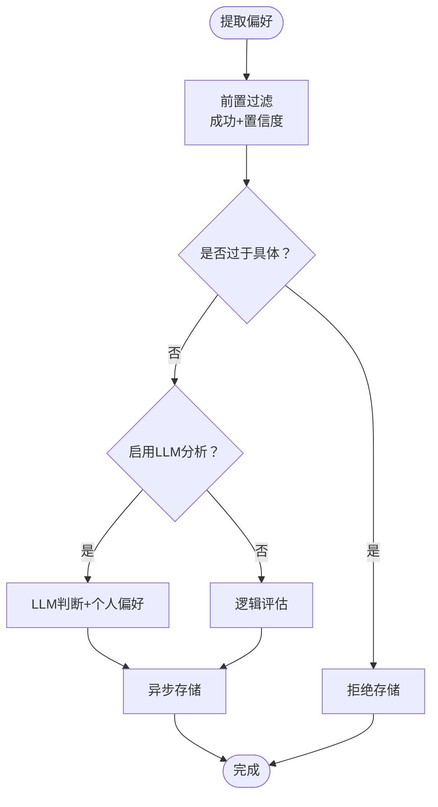

**图表来源**
- [backend/src/memory/longTermMemory.js:313-471](file://backend/src/memory/longTermMemory.js#L313-L471)

**章节来源**
- [backend/src/memory/longTermMemory.js:313-471](file://backend/src/memory/longTermMemory.js#L313-L471)

### 评估模块
- 向量化质量评估：Schema表级召回、精度、F1
- 查询相似度评估：余弦相似度计算
- 运行时统计：向量检索命中率、记忆命中率、距离分布
- 报告生成：整体统计与配置快照

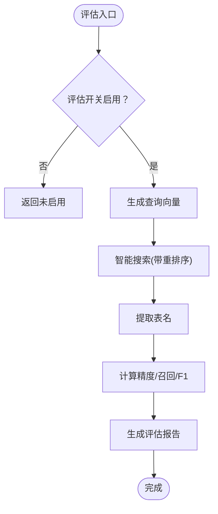

**图表来源**
- [backend/src/utils/evaluation.js:158-266](file://backend/src/utils/evaluation.js#L158-L266)

**章节来源**
- [backend/src/utils/evaluation.js:158-266](file://backend/src/utils/evaluation.js#L158-L266)
- [backend/src/utils/evaluation.js:397-430](file://backend/src/utils/evaluation.js#L397-L430)

### 功能开关
- 分阶段控制：Schema探索、意图拆解、澄清机制、多步推理与自我修正
- 全局开关：一键启用/禁用所有功能
- 运行时检查：综合判断工作流与加载策略

**章节来源**
- [backend/config/feature-flags.js:16-249](file://backend/config/feature-flags.js#L16-L249)

### 前端架构
- 入口：创建Vue应用、安装路由/状态/UI插件
- 路由：HTML5 History模式、页面标题、滚动行为
- 状态：会话列表、当前会话、消息历史、SSE连接、处理状态
- API：Axios封装、拦截器、错误处理、SSE查询提交

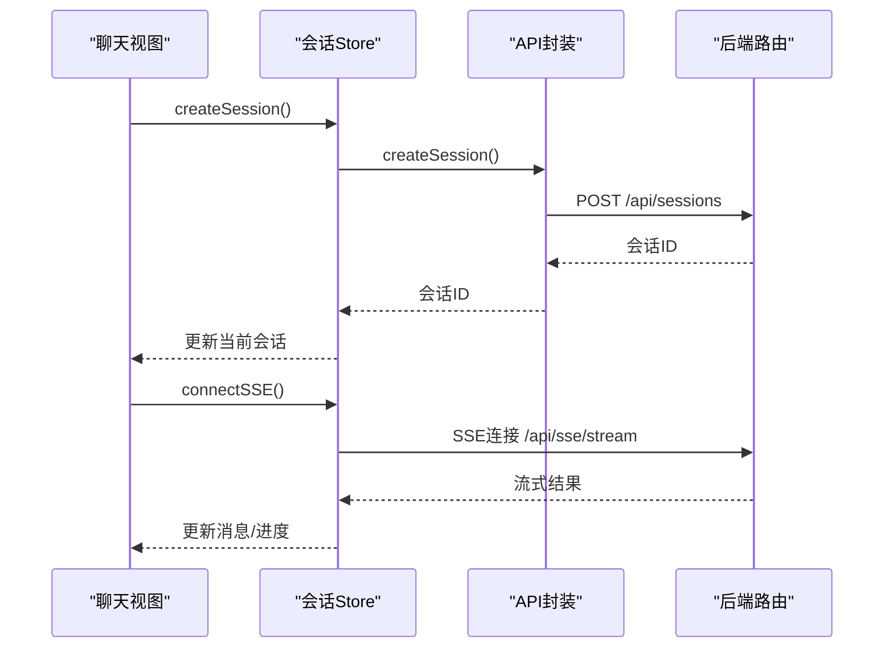

**图表来源**
- [frontend/src/stores/session.js:118-138](file://frontend/src/stores/session.js#L118-L138)
- [frontend/src/stores/session.js:185-221](file://frontend/src/stores/session.js#L185-L221)
- [frontend/src/utils/api.js:246-251](file://frontend/src/utils/api.js#L246-L251)

**章节来源**
- [frontend/src/main.js:55-89](file://frontend/src/main.js#L55-L89)
- [frontend/src/router/index.js:118-157](file://frontend/src/router/index.js#L118-L157)
- [frontend/src/stores/session.js:118-138](file://frontend/src/stores/session.js#L118-L138)
- [frontend/src/stores/session.js:185-221](file://frontend/src/stores/session.js#L185-L221)
- [frontend/src/utils/api.js:246-251](file://frontend/src/utils/api.js#L246-L251)

## 依赖分析
- 后端依赖：Express、CORS、body-parser、SQLite3、vectordb、uuid、dayjs、node-cron、dotenv
- 前端依赖：Vue 3、Vue Router、Pinia、Element Plus、Axios、uuid、dayjs等

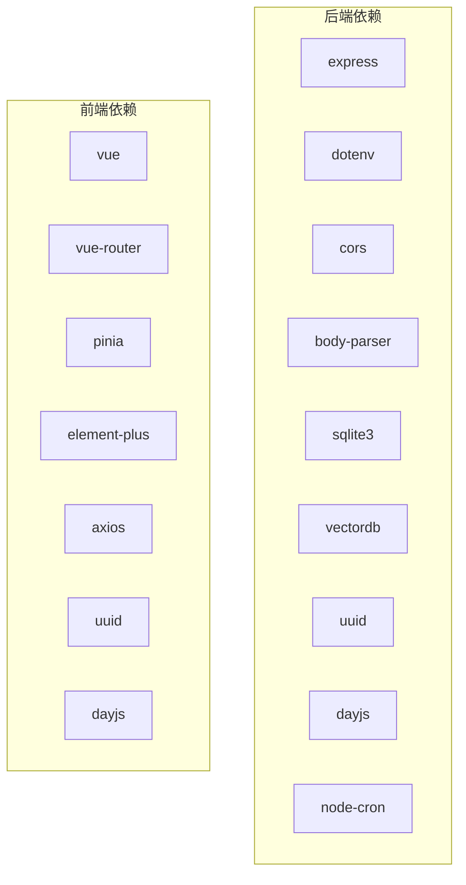

**图表来源**
- [backend/package.json:10-26](file://backend/package.json#L10-L26)
- [frontend/package.json:11-29](file://frontend/package.json#L11-L29)

**章节来源**
- [backend/package.json:10-26](file://backend/package.json#L10-L26)
- [frontend/package.json:11-29](file://frontend/package.json#L11-L29)

## 性能考虑
- Token预算与上下文裁剪：通过上下文管理配置控制最大上下文与输出预留，避免超限
- 向量检索优化：智能搜索与重排序，降低无关检索开销
- 异步存储：长期记忆通过队列异步持久化，避免阻塞主线程
- 日志轮转：控制日志文件大小与数量，减少磁盘IO压力
- 评估统计：运行时统计可选开启，避免影响主流程性能

[本节为通用性能建议，无需特定文件引用]

## 故障排查指南
- 启动失败：检查必要配置（LLM API密钥、SR数据库URL）、白名单为空警告
- SSE连接异常：确认会话ID有效、后端SSE端点可达
- 查询无响应：检查LLM超时、数据库连接池、查询超时与行数限制
- 日志定位：使用日志追踪（trace/traceStep/endTrace）定位NL2SQL流程节点
- 评估未生效：确认评估开关与统计开关已启用

**章节来源**
- [backend/src/core/config.js:366-388](file://backend/src/core/config.js#L366-L388)
- [backend/src/utils/logger.js:322-408](file://backend/src/utils/logger.js#L322-L408)
- [backend/src/utils/evaluation.js:19-31](file://backend/src/utils/evaluation.js#L19-L31)

## 结论
本指南提供了NL2SQL项目的开发规范、测试策略、贡献流程与运维要点。建议在开发中遵循统一的配置与日志规范，充分利用功能开关进行渐进式发布，结合评估模块持续优化系统表现。

[本节为总结性内容，无需特定文件引用]

## 附录

### 开发环境搭建
- 后端
  - 安装Node.js（>=18）
  - 安装依赖：npm install
  - 配置环境变量：复制.env示例并填写必要项
  - 启动：npm run dev
- 前端
  - 安装依赖：npm install
  - 启动：npm run dev
  - 预览：npm run preview

**章节来源**
- [backend/package.json:6-8](file://backend/package.json#L6-L8)
- [frontend/package.json:6-10](file://frontend/package.json#L6-L10)

### 代码规范
- 后端
  - 使用统一配置中心读取环境变量
  - 使用日志系统记录结构化日志
  - 模块职责清晰，按功能分层（core/memory/utils）
- 前端
  - 使用Pinia管理状态，组件内保持简洁
  - API封装统一错误处理
  - 路由使用HTML5 History模式

**章节来源**
- [backend/src/core/config.js:16-355](file://backend/src/core/config.js#L16-L355)
- [backend/src/utils/logger.js:54-442](file://backend/src/utils/logger.js#L54-L442)
- [frontend/src/stores/session.js:33-399](file://frontend/src/stores/session.js#L33-L399)
- [frontend/src/utils/api.js:25-88](file://frontend/src/utils/api.js#L25-L88)

### 测试策略
- 单元测试：覆盖Token估算、上下文预算、历史裁剪、摘要缓存、向量元数据增强
- 集成测试：路由与数据库交互、SSE流式响应
- 端到端测试：前端会话创建、消息收发、SSE连接与状态更新

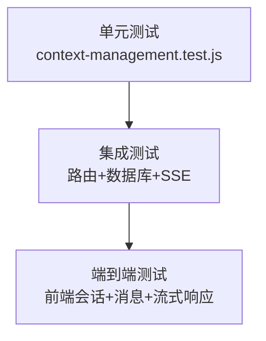

**图表来源**
- [backend/test/context-management.test.js:274-321](file://backend/test/context-management.test.js#L274-L321)

**章节来源**
- [backend/test/context-management.test.js:274-321](file://backend/test/context-management.test.js#L274-L321)

### 贡献流程
- 分支策略：feature/*、hotfix/*、release/*
- 提交规范：语义化提交（feat/fix/docs/chore）
- 代码审查：关注配置一致性、日志完整性、错误处理与性能影响
- 发布流程：功能开关验证、评估统计检查、日志轮转与备份

[本节为通用流程建议，无需特定文件引用]

### 调试技巧
- 使用日志追踪：startTrace/traceStep/endTrace
- 评估统计：获取运行时报告、重置统计
- 功能开关：按Phase逐步启用，快速回滚

**章节来源**
- [backend/src/utils/logger.js:322-408](file://backend/src/utils/logger.js#L322-L408)
- [backend/src/utils/evaluation.js:397-430](file://backend/src/utils/evaluation.js#L397-L430)
- [backend/config/feature-flags.js:209-229](file://backend/config/feature-flags.js#L209-L229)

### 性能分析方法
- 向量检索命中率：schema/query命中率与距离分布
- 长期记忆命中率：按类型统计命中/未命中
- 运行时指标：内存使用、进程运行时间

**章节来源**
- [backend/src/utils/evaluation.js:344-391](file://backend/src/utils/evaluation.js#L344-L391)
- [backend/src/core/routes.js:72-94](file://backend/src/core/routes.js#L72-L94)

### 常见问题与解决方案
- 配置缺失：根据配置校验报错提示补齐必要项
- 白名单为空：生产环境务必配置ALLOWED_TABLES
- SSE连接失败：检查会话ID与后端SSE端点
- 查询超时：调整QUERY_TIMEOUT与MAX_QUERY_ROWS

**章节来源**
- [backend/src/core/config.js:366-388](file://backend/src/core/config.js#L366-L388)
- [backend/src/core/routes.js:72-94](file://backend/src/core/routes.js#L72-L94)

### 新手入门与技能提升
- 建议路径：先熟悉配置中心与日志系统，再掌握路由与SSE，最后深入长期记忆与评估模块
- 推荐实践：在本地启用评估开关，定期生成报告；使用功能开关进行渐进式功能验证

[本节为通用指导，无需特定文件引用]