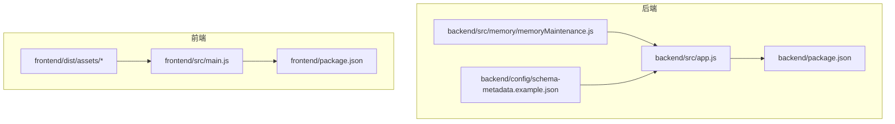
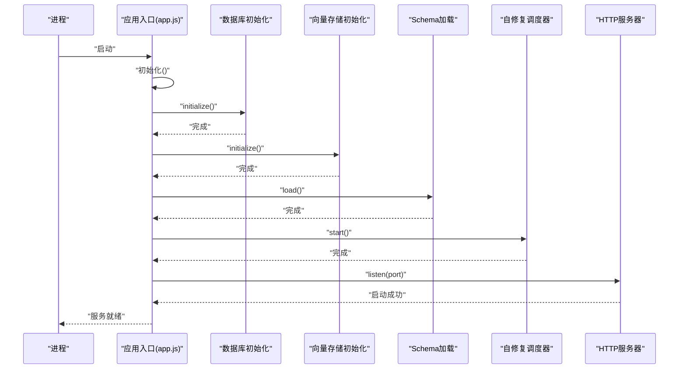
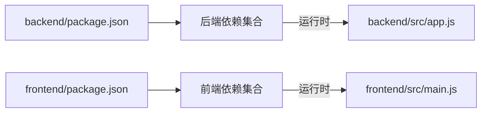

# Git工作流程

<cite>
**本文引用的文件**
- [backend/package.json](file://backend/package.json)
- [frontend/package.json](file://frontend/package.json)
- [backend/src/app.js](file://backend/src/app.js)
- [frontend/src/main.js](file://frontend/src/main.js)
- [backend/src/memory/memoryMaintenance.js](file://backend/src/memory/memoryMaintenance.js)
- [backend/config/schema-metadata.example.json](file://backend/config/schema-metadata.example.json)
- [backend/config/schema-metadata.json.backup](file://backend/config/schema-metadata.json.backup)
- [frontend/dist/assets/git-rebase-r7XF79zn.js](file://frontend/dist/assets/git-rebase-r7XF79zn.js)
- [frontend/dist/assets/git-commit-F4YmCXRG.js](file://frontend/dist/assets/git-commit-F4YmCXRG.js)
</cite>

## 目录
1. [引言](#引言)
2. [项目结构](#项目结构)
3. [核心组件](#核心组件)
4. [架构总览](#架构总览)
5. [详细组件分析](#详细组件分析)
6. [依赖分析](#依赖分析)
7. [性能考虑](#性能考虑)
8. [故障排查指南](#故障排查指南)
9. [结论](#结论)
10. [附录](#附录)

## 引言
本指南面向NL2SQL项目的团队协作与版本控制，围绕Git工作流程进行系统化设计，覆盖分支管理策略、提交信息规范、Pull Request流程、日常开发工作流、版本标签与发布流程、Git hooks与自动化检查、团队协作最佳实践以及常见问题与回滚策略。目标是提升交付质量、降低集成风险、提高协作效率。

## 项目结构
NL2SQL采用前后端分离架构，后端以Node.js为核心，前端基于Vue3构建。该结构决定了Git工作流需要同时兼顾后端服务与前端界面的协同开发与独立演进。

图表来源
- [backend/src/app.js:1-238](file://backend/src/app.js#L1-L238)
- [frontend/src/main.js:1-89](file://frontend/src/main.js#L1-L89)
- [backend/package.json:1-28](file://backend/package.json#L1-L28)
- [frontend/package.json:1-36](file://frontend/package.json#L1-L36)

章节来源
- [backend/src/app.js:1-238](file://backend/src/app.js#L1-L238)
- [frontend/src/main.js:1-89](file://frontend/src/main.js#L1-L89)
- [backend/package.json:1-28](file://backend/package.json#L1-L28)
- [frontend/package.json:1-36](file://frontend/package.json#L1-L36)

## 核心组件
- 后端服务入口与生命周期管理：负责服务启动、优雅关闭、异常处理与日志记录，体现对运行期稳定性的要求。
- 前端应用入口与插件安装：集中管理路由、状态管理、UI库与全局样式，体现对前端一致性与可维护性的要求。
- 内存与向量存储维护：包含相似模式合并逻辑，体现对数据质量与长期记忆维护的关注。
- 配置与元数据：示例配置与备份文件的存在提示了配置管理与版本演进的重要性。

章节来源
- [backend/src/app.js:97-166](file://backend/src/app.js#L97-L166)
- [backend/src/app.js:176-230](file://backend/src/app.js#L176-L230)
- [frontend/src/main.js:55-89](file://frontend/src/main.js#L55-L89)
- [backend/src/memory/memoryMaintenance.js:200-284](file://backend/src/memory/memoryMaintenance.js#L200-L284)
- [backend/config/schema-metadata.example.json](file://backend/config/schema-metadata.example.json)
- [backend/config/schema-metadata.json.backup](file://backend/config/schema-metadata.json.backup)

## 架构总览
以下序列图展示后端服务启动与初始化流程，体现模块化与依赖注入思想，便于在Git工作流中识别关键变更点与影响面。

图表来源
- [backend/src/app.js:97-166](file://backend/src/app.js#L97-L166)

章节来源
- [backend/src/app.js:97-166](file://backend/src/app.js#L97-L166)

## 详细组件分析

### 分支管理策略
- 主分支保护
  - master/main仅接受通过PR的变更，禁止直接推送。
  - 需要至少一名审查者批准，且无修改请求。
  - 通过CI检查（构建、测试、安全扫描）后方可合并。
- 功能分支命名规范
  - feature/模块名/子模块名/简短描述
  - 示例：feature/backend/nl2sql-engine/query-processing
- 发布分支管理
  - release/vX.Y.Z 用于预发布与回归测试，版本号遵循语义化版本。
  - hotfix/紧急修复分支从master切出，修复后回并至master与release。

### 提交信息规范
- 格式
  - 类型: 模块/子模块: 简短主题
  - 说明: 详细描述变更内容、动机与影响范围
  - 关联: Closes/Fixes/Affects: issue编号或相关链接
- 变更描述模板
  - 类型: feat/fix/docs/style/refactor/perf/test/build/ci/chore
  - 示例：feat(backend/core): 新增Schema加载器
  - 说明：实现从配置文件动态加载表结构元数据，支持增量更新与缓存
  - 关联：Closes #123

### Pull Request流程
- 创建PR前
  - 确保本地分支已同步上游最新变更
  - 本地通过构建与测试
- PR审查标准
  - 代码风格一致、注释清晰、边界条件完备
  - 影响面评估：涉及数据库迁移需标注风险等级
  - 性能影响：新增向量检索或内存维护逻辑需提供基准数据
- 合并策略
  - Squash合并：保持提交历史整洁；Rebase合并：保留完整历史
  - 合并后删除源分支，避免分支冗余
- 冲突解决
  - 优先rebase到最新主干，逐个解决冲突
  - 对于配置文件冲突，采用“保留双方关键配置”的折中方案

### 日常开发工作流
- 创建功能分支
  - git checkout -b feature/模块/子模块/简述 upstream/master
- 同步更新
  - 定期 rebase upstream/master，保持线性历史
  - 若出现冲突，先rebase再解决，避免merge commit
- 清理策略
  - 合并完成后删除本地与远程分支
  - 定期清理过期的远程跟踪分支

### 版本标签与发布流程
- 标签策略
  - v1.0.0-beta.1、v1.0.0-rc.1、v1.0.0 正式版
  - 语义化版本：主版本号.次版本号.修订号
- 发布流程
  - release分支合并至master与main
  - 推送标签并生成发布说明
  - 前端dist产物与后端包分别发布至相应制品库

### Git hooks与自动化检查
- 建议配置
  - pre-commit：代码格式化、静态检查、单元测试
  - commit-msg：校验提交信息格式
  - pre-push：全量构建与集成测试
- 工程内现有线索
  - 前端dist中包含git相关语法高亮资源，表明开发环境对Git编辑场景的支持

章节来源
- [frontend/dist/assets/git-rebase-r7XF79zn.js:1-1](file://frontend/dist/assets/git-rebase-r7XF79zn.js#L1-L1)
- [frontend/dist/assets/git-commit-F4YmCXRG.js:1-1](file://frontend/dist/assets/git-commit-F4YmCXRG.js#L1-L1)

### 团队协作最佳实践
- 早发现早合并：小步快跑，频繁提交与PR评审
- 明确职责边界：每个模块由专人负责，跨模块变更必须协商
- 文档与注释：重要算法与流程需配套说明，便于后续维护
- 配置即代码：配置文件纳入版本管理，变更走PR

### 冲突解决策略
- 配置文件冲突
  - 优先保留主干关键配置，结合本地需求补充
- 代码冲突
  - 以业务正确性为准，必要时重构以消除重复逻辑
- 向量存储与内存维护
  - 变更涉及相似模式合并逻辑时，需提供回归测试用例

## 依赖分析
后端与前端均通过各自package.json声明依赖，体现了模块化与可复现性要求。在Git工作流中，依赖变更应通过PR评审与测试验证。

图表来源
- [backend/package.json:10-23](file://backend/package.json#L10-L23)
- [frontend/package.json:11-34](file://frontend/package.json#L11-L34)
- [backend/src/app.js:22-49](file://backend/src/app.js#L22-L49)
- [frontend/src/main.js:14-32](file://frontend/src/main.js#L14-L32)

章节来源
- [backend/package.json:10-23](file://backend/package.json#L10-L23)
- [frontend/package.json:11-34](file://frontend/package.json#L11-L34)
- [backend/src/app.js:22-49](file://backend/src/app.js#L22-L49)
- [frontend/src/main.js:14-32](file://frontend/src/main.js#L14-L32)

## 性能考虑
- 向量检索与相似模式合并
  - 相似度阈值与时间范围匹配策略需在PR中明确参数依据与性能影响
  - 建议提供基准测试数据，评估不同维度/指标规模下的处理耗时
- 数据库与向量存储初始化
  - 初始化失败的快速反馈与重试策略应在提交信息中说明

## 故障排查指南
- 服务启动失败
  - 检查数据库与向量存储初始化日志，确认端口占用与权限
  - 关注优雅关闭流程，定位未捕获异常与Promise拒绝
- 配置文件异常
  - 比对示例配置与备份文件，逐步回退可疑变更
- 前端构建问题
  - 核对依赖版本与Node引擎要求，清理node_modules后重新安装

章节来源
- [backend/src/app.js:160-165](file://backend/src/app.js#L160-L165)
- [backend/src/app.js:221-230](file://backend/src/app.js#L221-L230)
- [backend/config/schema-metadata.example.json](file://backend/config/schema-metadata.example.json)
- [backend/config/schema-metadata.json.backup](file://backend/config/schema-metadata.json.backup)
- [backend/package.json:24-26](file://backend/package.json#L24-L26)

## 结论
通过建立规范的分支策略、提交信息与PR流程，配合自动化检查与版本标签管理，NL2SQL项目可在保证质量的同时提升交付效率。建议团队在实践中持续优化流程，结合实际问题不断迭代。

## 附录
- 常见问题与回滚策略
  - 回滚策略：针对重大变更采用反向提交或标签回退，确保不影响主干稳定性
  - 配置回滚：利用备份文件快速恢复，随后在PR中说明变更原因与修复措施
- 开发环境建议
  - 使用统一的Node版本与包管理器，确保本地与CI一致
  - 在IDE中启用Git相关语法高亮与提交信息校验，减少人为错误