# 代码规范与最佳实践

<cite>
**本文档引用的文件**
- [backend/src/app.js](file://backend/src/app.js)
- [backend/src/core/config.js](file://backend/src/core/config.js)
- [backend/src/core/routes.js](file://backend/src/core/routes.js)
- [backend/src/utils/logger.js](file://backend/src/utils/logger.js)
- [backend/src/core/database.js](file://backend/src/core/database.js)
- [backend/src/memory/vectorStore.js](file://backend/src/memory/vectorStore.js)
- [frontend/src/main.js](file://frontend/src/main.js)
- [frontend/src/router/index.js](file://frontend/src/router/index.js)
- [frontend/src/stores/session.js](file://frontend/src/stores/session.js)
- [frontend/src/utils/api.js](file://frontend/src/utils/api.js)
- [frontend/src/views/ChatView.vue](file://frontend/src/views/ChatView.vue)
- [frontend/vite.config.js](file://frontend/vite.config.js)
- [backend/package.json](file://backend/package.json)
- [frontend/package.json](file://frontend/package.json)
</cite>

## 目录
1. [简介](#简介)
2. [项目结构](#项目结构)
3. [核心组件](#核心组件)
4. [架构概览](#架构概览)
5. [详细组件分析](#详细组件分析)
6. [依赖分析](#依赖分析)
7. [性能考虑](#性能考虑)
8. [故障排查指南](#故障排查指南)
9. [结论](#结论)
10. [附录](#附录)

## 简介
本指南面向NL2SQL项目的开发者，提供一套统一的代码规范与最佳实践，涵盖：
- JavaScript/Vue.js编码标准（命名约定、代码格式、注释规范）
- 项目结构组织原则（模块划分、文件命名、目录层级）
- 错误处理模式与日志记录规范
- API设计原则与RESTful接口规范
- 数据库操作最佳实践（SQL注入防护、事务处理）
- 前端组件开发规范（Vue组件设计、状态管理模式）
- 性能优化建议与内存管理最佳实践
- 代码审查清单与质量保证措施

## 项目结构
NL2SQL采用前后端分离架构，后端基于Node.js + Express，前端基于Vue3 + Vite，配合SQLite与LanceDB实现数据持久化与向量检索。

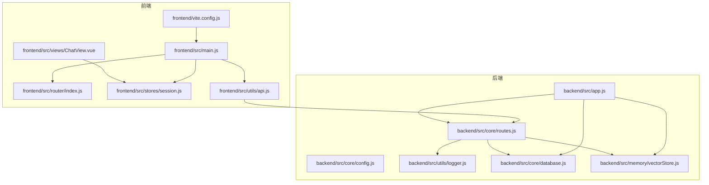

图表来源
- [frontend/src/main.js:1-89](file://frontend/src/main.js#L1-L89)
- [frontend/src/router/index.js:1-147](file://frontend/src/router/index.js#L1-L147)
- [frontend/src/stores/session.js:1-398](file://frontend/src/stores/session.js#L1-L398)
- [frontend/src/utils/api.js:1-252](file://frontend/src/utils/api.js#L1-L252)
- [frontend/src/views/ChatView.vue:1-200](file://frontend/src/views/ChatView.vue#L1-L200)
- [frontend/vite.config.js:1-93](file://frontend/vite.config.js#L1-L93)
- [backend/src/app.js:1-238](file://backend/src/app.js#L1-L238)
- [backend/src/core/config.js:1-332](file://backend/src/core/config.js#L1-L332)
- [backend/src/core/routes.js:1-800](file://backend/src/core/routes.js#L1-L800)
- [backend/src/utils/logger.js:1-318](file://backend/src/utils/logger.js#L1-L318)
- [backend/src/core/database.js:1-200](file://backend/src/core/database.js#L1-L200)
- [backend/src/memory/vectorStore.js:1-442](file://backend/src/memory/vectorStore.js#L1-L442)

章节来源
- [backend/src/app.js:1-238](file://backend/src/app.js#L1-L238)
- [frontend/src/main.js:1-89](file://frontend/src/main.js#L1-L89)

## 核心组件
- 后端入口与初始化：负责加载环境变量、初始化数据库与向量库、挂载路由、启动HTTP服务器与SSE服务，并处理优雅关闭。
- 配置中心：集中管理LLM、数据库、安全、日志、Schema、长期记忆等配置，提供配置校验。
- 路由层：定义RESTful API端点，包含健康检查、Schema查询、会话管理、查询历史、统计信息、配置公开信息等。
- 日志系统：统一日志输出（控制台+文件），支持多级别日志、结构化格式、自动轮转。
- 数据库层：SQLite持久化会话、消息、查询历史、用户偏好、系统日志，提供统一查询封装。
- 向量存储：基于LanceDB的Schema与查询历史向量存储，支持语义检索。
- 前端入口与路由：创建Vue应用、安装插件、配置路由与全局组件，支持懒加载与滚动行为。
- 状态管理：Pinia Store管理会话、消息、SSE连接、处理状态与进度。
- API封装：Axios实例封装，统一请求/响应拦截与错误处理。
- 构建配置：Vite配置开发服务器、代理、路径别名、代码分割与CSS预处理。

章节来源
- [backend/src/core/config.js:1-332](file://backend/src/core/config.js#L1-L332)
- [backend/src/core/routes.js:1-800](file://backend/src/core/routes.js#L1-L800)
- [backend/src/utils/logger.js:1-318](file://backend/src/utils/logger.js#L1-L318)
- [backend/src/core/database.js:1-200](file://backend/src/core/database.js#L1-L200)
- [backend/src/memory/vectorStore.js:1-442](file://backend/src/memory/vectorStore.js#L1-L442)
- [frontend/src/router/index.js:1-147](file://frontend/src/router/index.js#L1-L147)
- [frontend/src/stores/session.js:1-398](file://frontend/src/stores/session.js#L1-L398)
- [frontend/src/utils/api.js:1-252](file://frontend/src/utils/api.js#L1-L252)
- [frontend/vite.config.js:1-93](file://frontend/vite.config.js#L1-L93)

## 架构概览
NL2SQL采用分层架构：
- 表现层：Vue3组件与状态管理
- 接入层：Express路由与SSE
- 业务层：配置、Schema加载、自修复调度
- 数据访问层：SQLite与LanceDB
- 工具层：日志、工具函数

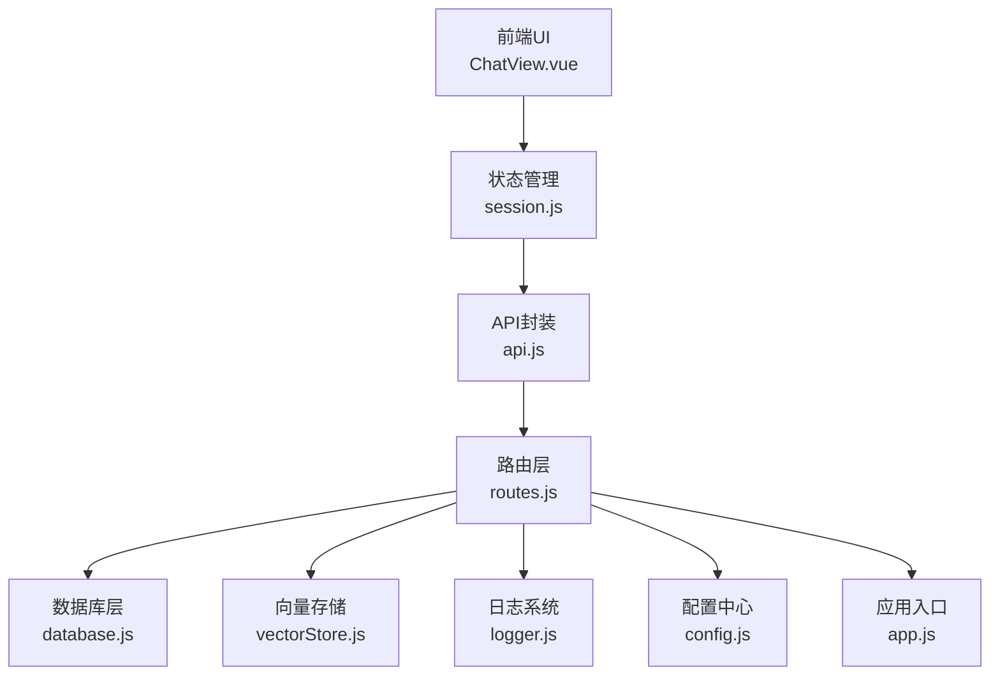

图表来源
- [frontend/src/views/ChatView.vue:1-200](file://frontend/src/views/ChatView.vue#L1-L200)
- [frontend/src/stores/session.js:1-398](file://frontend/src/stores/session.js#L1-L398)
- [frontend/src/utils/api.js:1-252](file://frontend/src/utils/api.js#L1-L252)
- [backend/src/core/routes.js:1-800](file://backend/src/core/routes.js#L1-L800)
- [backend/src/core/database.js:1-200](file://backend/src/core/database.js#L1-L200)
- [backend/src/memory/vectorStore.js:1-442](file://backend/src/memory/vectorStore.js#L1-L442)
- [backend/src/utils/logger.js:1-318](file://backend/src/utils/logger.js#L1-L318)
- [backend/src/core/config.js:1-332](file://backend/src/core/config.js#L1-L332)
- [backend/src/app.js:1-238](file://backend/src/app.js#L1-L238)

## 详细组件分析

### 后端入口与初始化（app.js）
- 职责：加载环境变量、导入核心模块、配置中间件、挂载路由、启动HTTP与SSE、优雅关闭。
- 关键点：
  - CORS与body-parser中间件配置
  - 数据目录与日志目录初始化
  - SQLite与LanceDB初始化
  - Schema加载与自修复调度器启动
  - 优雅关闭流程（HTTP关闭、SSE断开、定时任务停止、数据库关闭）

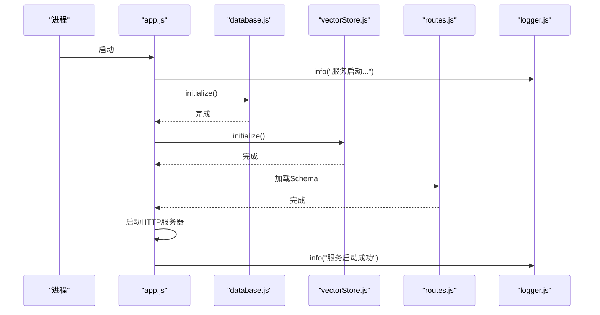

图表来源
- [backend/src/app.js:97-166](file://backend/src/app.js#L97-L166)
- [backend/src/core/database.js:200-250](file://backend/src/core/database.js#L200-L250)
- [backend/src/memory/vectorStore.js:55-85](file://backend/src/memory/vectorStore.js#L55-L85)
- [backend/src/core/routes.js:1-800](file://backend/src/core/routes.js#L1-L800)
- [backend/src/utils/logger.js:256-293](file://backend/src/utils/logger.js#L256-L293)

章节来源
- [backend/src/app.js:1-238](file://backend/src/app.js#L1-L238)

### 配置中心（config.js）
- 职责：集中管理LLM、Embedding、数据库、安全、会话、日志、自修复、Schema、长期记忆等配置。
- 关键点：
  - 环境变量读取与默认值
  - 安全配置（白名单、dry-run、行数限制、超时、禁止关键字、敏感字段）
  - 日志配置（级别、文件、轮转）
  - Schema缓存与重向量化开关
  - 长期记忆阈值与保留策略

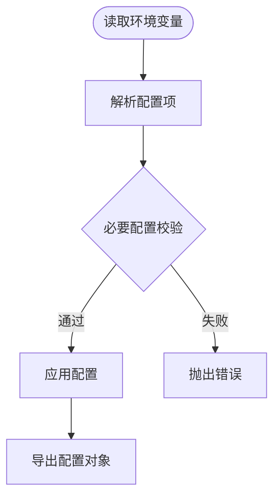

图表来源
- [backend/src/core/config.js:300-331](file://backend/src/core/config.js#L300-L331)

章节来源
- [backend/src/core/config.js:1-332](file://backend/src/core/config.js#L1-L332)

### 路由层（routes.js）
- 职责：定义RESTful API端点，包含健康检查、Schema查询、会话管理、查询历史、统计信息、配置公开信息等。
- 关键点：
  - 请求日志中间件
  - 健康检查与详细健康检查
  - Schema查询与搜索
  - 会话创建、获取、删除、消息历史
  - 查询历史筛选查询
  - 用户偏好（长期记忆）接口
  - 统计信息与公开配置

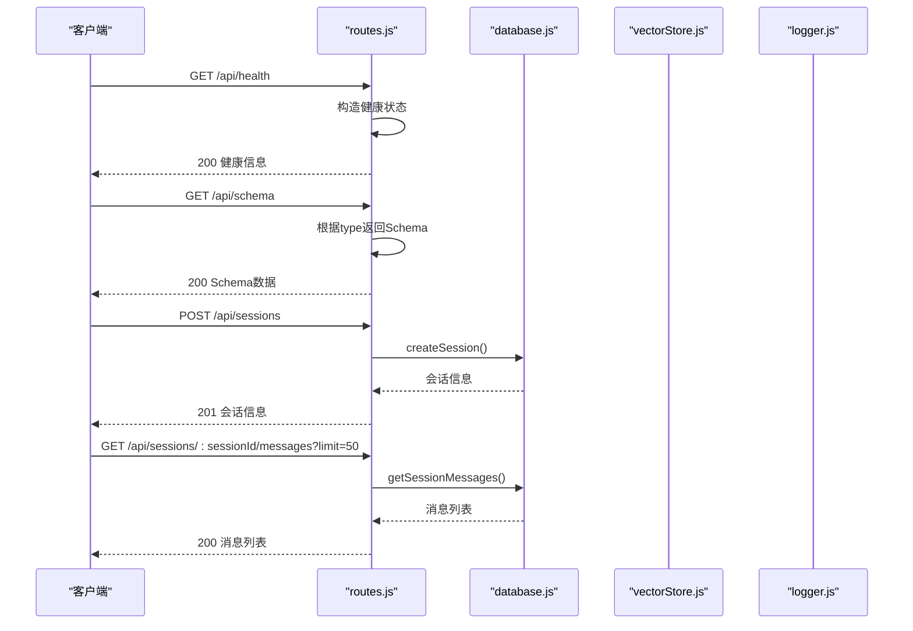

图表来源
- [backend/src/core/routes.js:70-135](file://backend/src/core/routes.js#L70-L135)
- [backend/src/core/routes.js:148-184](file://backend/src/core/routes.js#L148-L184)
- [backend/src/core/routes.js:264-288](file://backend/src/core/routes.js#L264-L288)
- [backend/src/core/routes.js:352-371](file://backend/src/core/routes.js#L352-L371)

章节来源
- [backend/src/core/routes.js:1-800](file://backend/src/core/routes.js#L1-L800)

### 日志系统（logger.js）
- 职责：统一日志输出（控制台+文件），支持多级别日志、结构化格式、自动轮转。
- 关键点：
  - 日志级别枚举（DEBUG/INFO/WARN/ERROR）
  - 文件轮转（大小阈值、文件数量）
  - 结构化日志格式（时间戳、级别、消息、元数据）
  - 事件发射（允许外部监听）

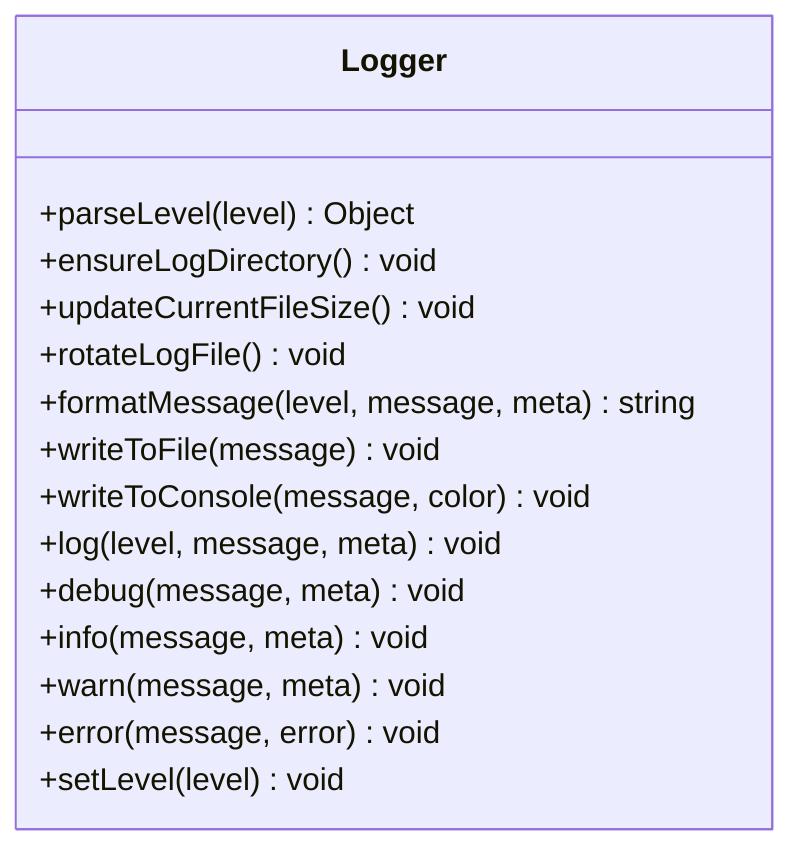

图表来源
- [backend/src/utils/logger.js:51-303](file://backend/src/utils/logger.js#L51-L303)

章节来源
- [backend/src/utils/logger.js:1-318](file://backend/src/utils/logger.js#L1-L318)

### 数据库层（database.js）
- 职责：SQLite持久化会话、消息、查询历史、用户偏好、系统日志，提供统一查询封装。
- 关键点：
  - 表结构定义（sessions、messages、query_history、user_preferences、system_logs）
  - 索引优化（user_id、session_id、created_at、status等）
  - 统一查询封装（query、queryOne）
  - 初始化流程（连接、创建表、索引）

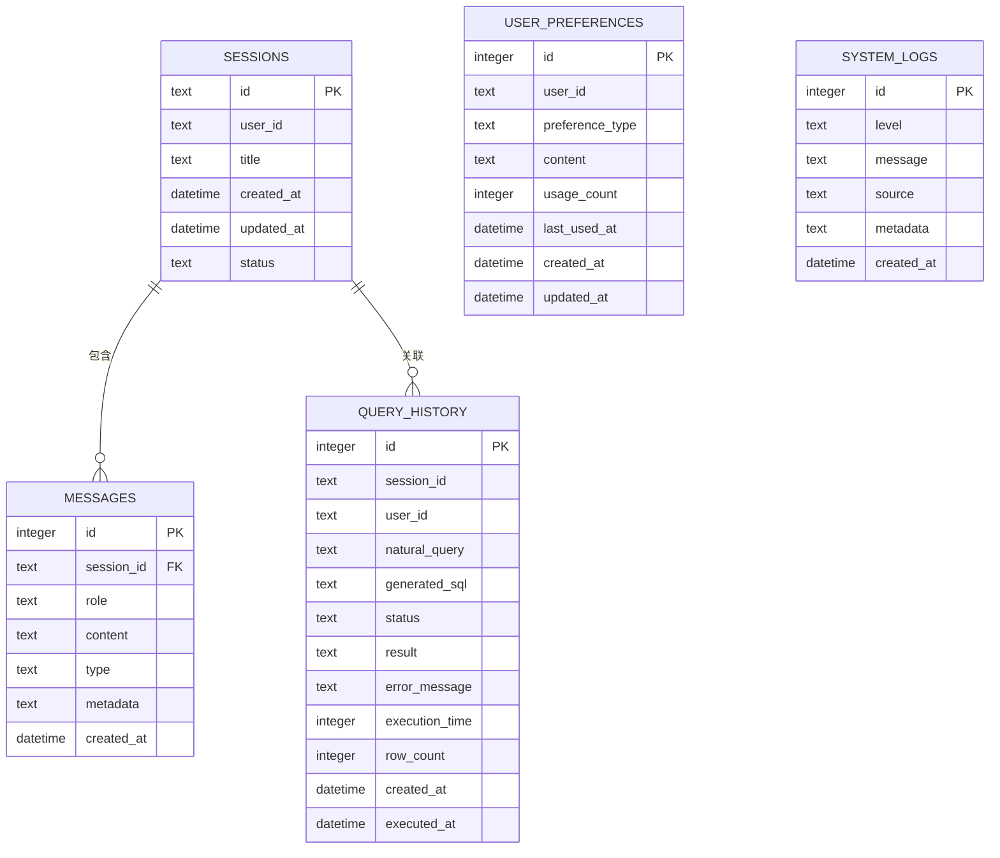

图表来源
- [backend/src/core/database.js:39-189](file://backend/src/core/database.js#L39-L189)

章节来源
- [backend/src/core/database.js:1-200](file://backend/src/core/database.js#L1-L200)

### 向量存储（vectorStore.js）
- 职责：基于LanceDB实现Schema与查询历史的向量存储与语义检索。
- 关键点：
  - 初始化LanceDB连接与表（schema_vectors、query_vectors）
  - Schema向量添加与搜索
  - 查询历史向量添加与相似查询搜索
  - 统计信息与状态检查

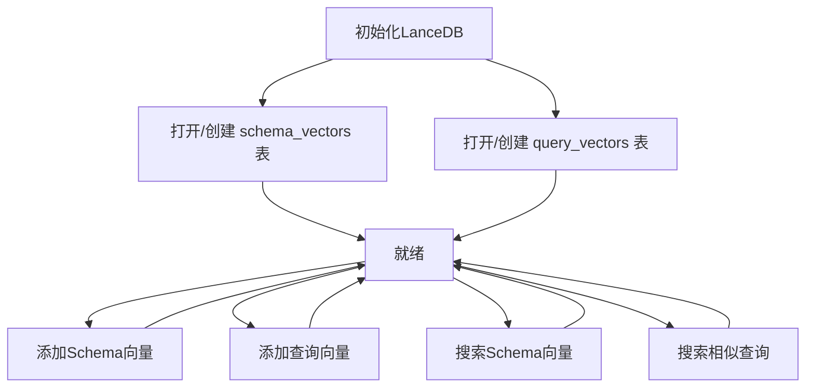

图表来源
- [backend/src/memory/vectorStore.js:55-146](file://backend/src/memory/vectorStore.js#L55-L146)
- [backend/src/memory/vectorStore.js:160-230](file://backend/src/memory/vectorStore.js#L160-L230)
- [backend/src/memory/vectorStore.js:245-307](file://backend/src/memory/vectorStore.js#L245-L307)

章节来源
- [backend/src/memory/vectorStore.js:1-442](file://backend/src/memory/vectorStore.js#L1-L442)

### 前端入口与路由（main.js、router/index.js）
- 职责：创建Vue应用、安装插件（路由、状态管理、UI组件库）、注册全局组件、配置路由与滚动行为。
- 关键点：
  - Element Plus安装与图标注册
  - 路由懒加载与滚动行为
  - 全局前置守卫设置页面标题

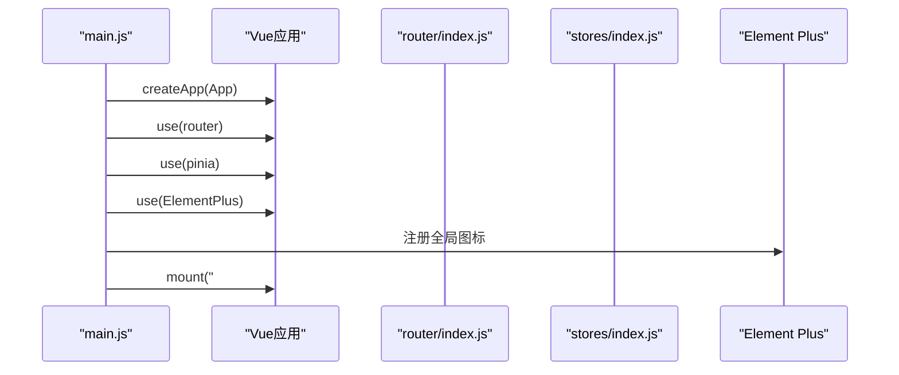

图表来源
- [frontend/src/main.js:55-89](file://frontend/src/main.js#L55-L89)
- [frontend/src/router/index.js:108-122](file://frontend/src/router/index.js#L108-L122)

章节来源
- [frontend/src/main.js:1-89](file://frontend/src/main.js#L1-L89)
- [frontend/src/router/index.js:1-147](file://frontend/src/router/index.js#L1-L147)

### 状态管理（stores/session.js）
- 职责：管理会话列表、当前会话、消息历史、SSE连接、处理状态与进度。
- 关键点：
  - 会话创建、切换、删除
  - 消息加载与添加
  - SSE连接建立与消息处理
  - 查询发送与错误处理

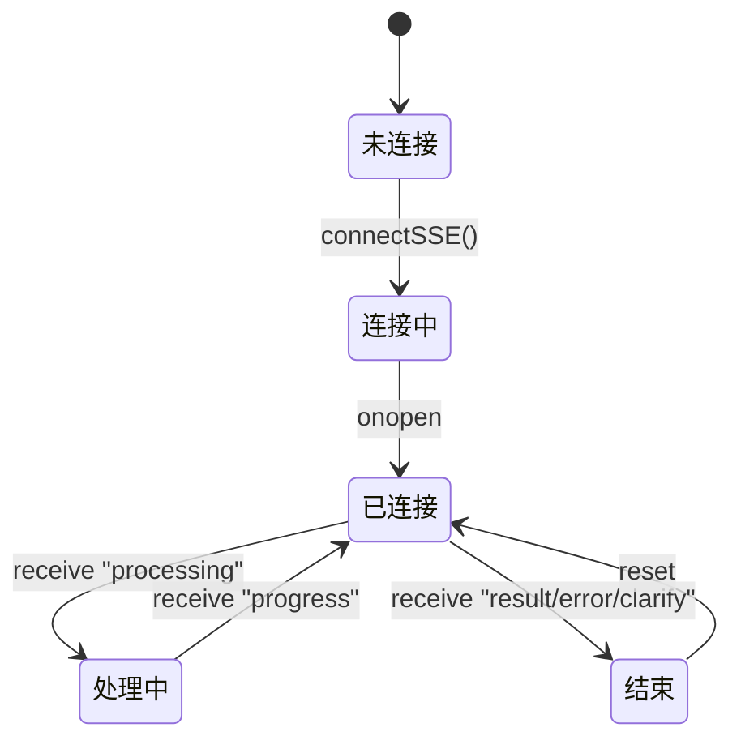

图表来源
- [frontend/src/stores/session.js:185-221](file://frontend/src/stores/session.js#L185-L221)
- [frontend/src/stores/session.js:227-293](file://frontend/src/stores/session.js#L227-L293)

章节来源
- [frontend/src/stores/session.js:1-398](file://frontend/src/stores/session.js#L1-L398)

### API封装（utils/api.js）
- 职责：Axios实例封装，统一请求/响应拦截与错误处理，暴露REST API方法。
- 关键点：
  - baseURL设置为/api
  - 请求拦截器（可扩展认证）
  - 响应拦截器（统一错误处理）
  - 健康检查、Schema、会话、查询历史、统计、配置、SSE查询

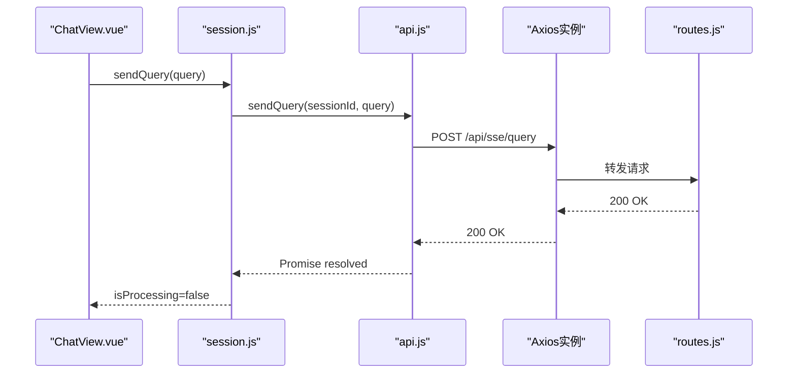

图表来源
- [frontend/src/views/ChatView.vue:196-200](file://frontend/src/views/ChatView.vue#L196-L200)
- [frontend/src/stores/session.js:299-328](file://frontend/src/stores/session.js#L299-L328)
- [frontend/src/utils/api.js:246-251](file://frontend/src/utils/api.js#L246-L251)
- [backend/src/core/routes.js:1-800](file://backend/src/core/routes.js#L1-L800)

章节来源
- [frontend/src/utils/api.js:1-252](file://frontend/src/utils/api.js#L1-L252)

### 构建配置（vite.config.js）
- 职责：配置开发服务器、代理、路径别名、插件、CSS预处理、代码分割。
- 关键点：
  - 代理/api到后端3000端口
  - 路径别名@/@components/@views/@stores/@utils
  - 代码分割：element-plus、echarts、vendor

章节来源
- [frontend/vite.config.js:1-93](file://frontend/vite.config.js#L1-L93)

## 依赖分析
- 后端依赖：Express、vectordb、sqlite3、dotenv、cors、body-parser、uuid、dayjs、node-cron
- 前端依赖：@element-plus/icons-vue、axios、dayjs、echarts、element-plus、highlight.js、katex、markdown-it、markdown-it-mathjax3、marked、mermaid、pinia、shiki、uuid、vue、vue-echarts、vue-router

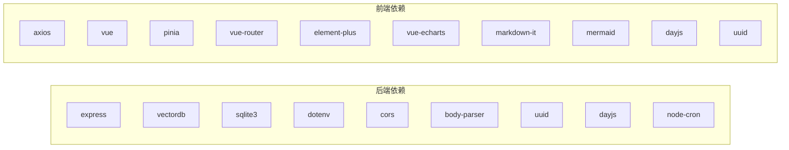

图表来源
- [backend/package.json:10-22](file://backend/package.json#L10-L22)
- [frontend/package.json:11-28](file://frontend/package.json#L11-L28)

章节来源
- [backend/package.json:1-28](file://backend/package.json#L1-L28)
- [frontend/package.json:1-36](file://frontend/package.json#L1-L36)

## 性能考虑
- 后端
  - 数据库索引优化：按user_id、session_id、created_at、status建立索引，减少查询成本。
  - 查询限制：安全配置中的行数限制与超时限制，防止大查询导致性能问题。
  - 日志轮转：文件大小阈值与保留数量，避免磁盘占用过大。
  - 向量数据库：Schema与查询向量表的初始化与统计，避免重复向量化。
- 前端
  - 代码分割：将第三方库拆分为独立chunk，提升缓存命中率。
  - 路由懒加载：按需加载组件，减少首屏体积。
  - Axios超时：统一请求超时，避免长时间阻塞。
  - SSE连接复用：避免重复建立连接，降低资源消耗。

## 故障排查指南
- 后端
  - 未处理Promise拒绝与未捕获异常：记录错误并优雅关闭，防止进程崩溃。
  - 初始化失败：检查数据库与向量库连接、Schema加载、配置校验。
  - API错误：查看日志与响应拦截器输出，定位具体错误原因。
- 前端
  - 网络错误：检查代理配置与后端服务状态。
  - SSE连接失败：确认会话ID有效与SSE端点可用。
  - 状态同步：检查Store中的isProcessing、processingStatus、processingProgress状态更新。

章节来源
- [backend/src/app.js:220-230](file://backend/src/app.js#L220-L230)
- [backend/src/utils/logger.js:283-293](file://backend/src/utils/logger.js#L283-L293)
- [frontend/src/utils/api.js:72-88](file://frontend/src/utils/api.js#L72-L88)
- [frontend/src/stores/session.js:185-221](file://frontend/src/stores/session.js#L185-L221)

## 结论
本指南总结了NL2SQL项目的代码规范与最佳实践，涵盖了前后端的关键组件与交互流程。遵循本文档的规范有助于提升代码一致性、可维护性与性能表现。

## 附录

### JavaScript/Vue.js编码标准
- 命名约定
  - 文件：kebab-case（如router/index.js）
  - 组件：PascalCase（如ChatView.vue）
  - Store：camelCase（如session.js）
  - 常量：UPPER_SNAKE_CASE（如MAX_QUERY_ROWS）
- 代码格式
  - 使用4空格缩进，行末无多余空格
  - 语句末尾加分号
  - 对象与数组字面量使用紧凑格式，复杂对象分行
- 注释规范
  - 文件头部注释：模块用途、职责、作者
  - 函数注释：参数、返回值、异常、示例
  - 复杂逻辑注释：解释算法思路与边界条件

### 项目结构组织原则
- 后端
  - 按功能模块划分：core（核心逻辑）、memory（长期记忆与向量）、utils（工具）、data（数据与向量库）
  - 配置集中管理：core/config.js
  - 路由集中管理：core/routes.js
- 前端
  - 按功能模块划分：components（通用组件）、views（页面）、stores（状态管理）、utils（工具）
  - 路由懒加载：views目录下的页面组件按需加载
  - 路径别名：@、@components、@views、@stores、@utils

### 错误处理模式与日志记录规范
- 后端
  - 统一日志：logger.js提供多级别日志与文件轮转
  - 未处理异常：捕获并记录，触发优雅关闭
  - API错误：中间件与路由层统一错误处理
- 前端
  - Axios响应拦截器：统一错误处理与提示
  - Store错误处理：捕获异常并反馈给用户

### API设计原则与RESTful接口规范
- 设计原则
  - 资源命名：使用名词复数（如/sessions、/messages）
  - HTTP方法：GET/POST/DELETE/PUT/PATCH
  - 状态码：2xx成功、4xx客户端错误、5xx服务器错误
  - 响应格式：统一JSON结构，包含错误信息时提供message字段
- RESTful接口
  - 健康检查：GET /api/health、GET /api/health/detail
  - Schema：GET /api/schema、GET /api/schema/tables/:tableName、GET /api/schema/search
  - 会话：POST /api/sessions、GET /api/sessions/:sessionId、DELETE /api/sessions/:sessionId、GET /api/sessions/:sessionId/messages、GET /api/users/:userId/sessions
  - 查询历史：GET /api/queries/history
  - 用户偏好：GET /api/preferences/:userId、GET /api/preferences/:userId/raw、GET /api/preferences/:userId/stats、POST /api/preferences/:userId/templates、DELETE /api/preferences/:preferenceId、POST /api/preferences/:userId/learn-alias
  - 统计：GET /api/stats
  - 配置：GET /api/config

### 数据库操作最佳实践
- SQL注入防护
  - 使用参数化查询（如database.js中的query与queryOne）
  - 白名单与关键字过滤（config.js中的allowedTables与forbiddenKeywords）
- 事务处理
  - SQLite事务：BEGIN/COMMIT/ROLLBACK
  - 一致性：批量操作时使用事务保证原子性
- 索引优化
  - 为高频查询字段建立索引（user_id、session_id、created_at、status）
  - 避免全表扫描，提高查询性能

### 前端组件开发规范
- Vue组件设计
  - 单文件组件：模板、脚本、样式分离
  - 响应式状态：使用ref/computed/watch
  - 生命周期：onMounted/onUnmounted等
- 状态管理模式
  - Pinia Store：集中管理会话、消息、SSE连接、处理状态
  - 计算属性：computed保持响应式
  - 动作方法：actions封装异步逻辑

### 性能优化建议与内存管理最佳实践
- 后端
  - 合理设置查询超时与行数限制
  - 日志轮转与文件大小阈值
  - 向量数据库避免重复向量化
- 前端
  - 代码分割与懒加载
  - Axios超时与错误重试
  - SSE连接复用与断线重连

### 代码审查清单与质量保证措施
- 代码审查清单
  - 命名一致性与可读性
  - 错误处理完整性
  - 日志记录与异常捕获
  - SQL注入防护与参数化查询
  - 前端状态管理与副作用
  - 性能与内存使用
- 质量保证措施
  - ESLint/Prettier统一代码风格
  - 单元测试与集成测试
  - 构建产物检查与缓存策略
  - 监控与告警（健康检查与日志分析）