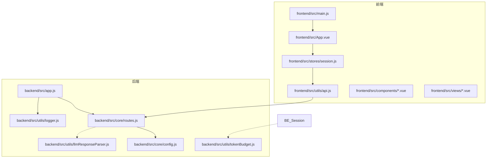
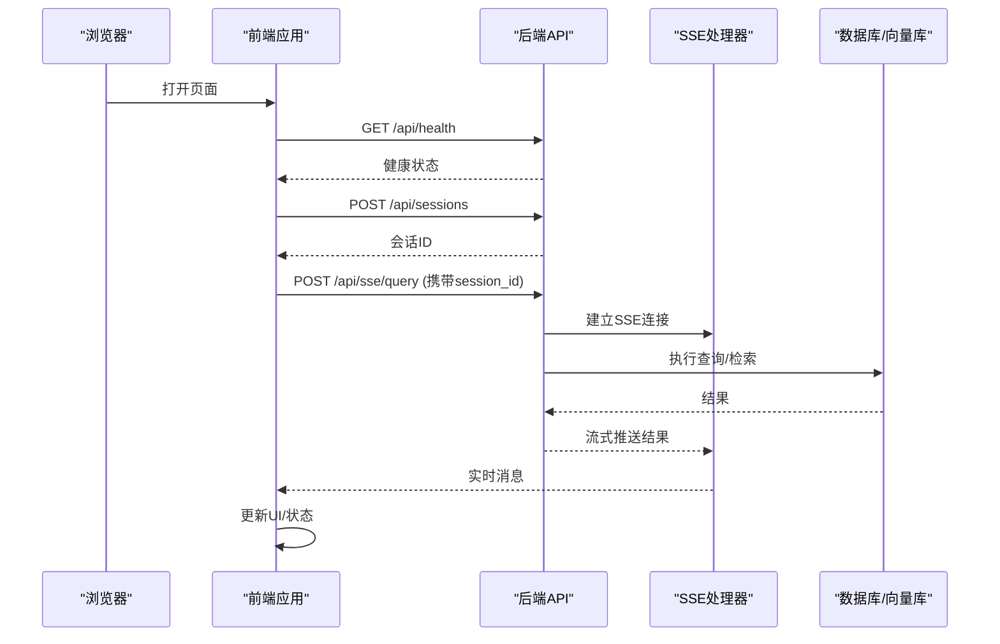
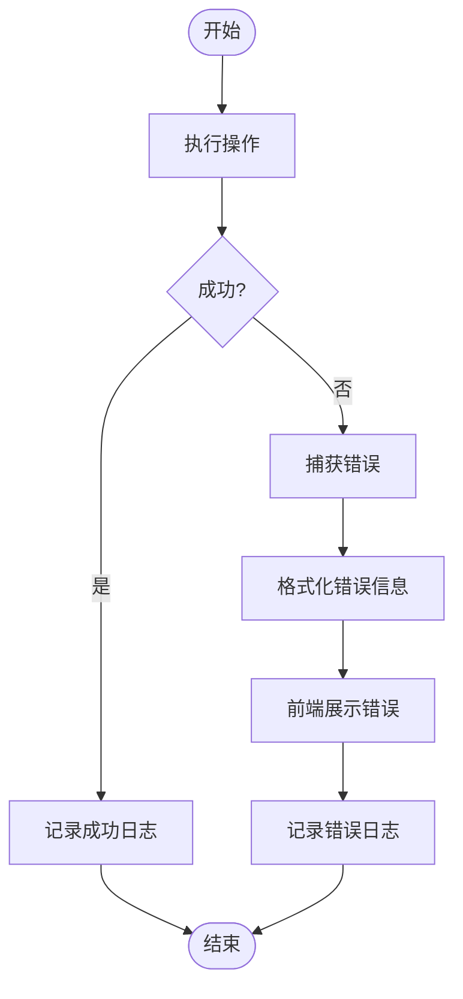
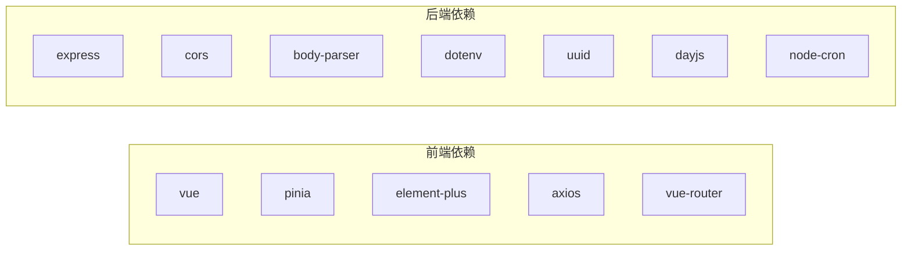
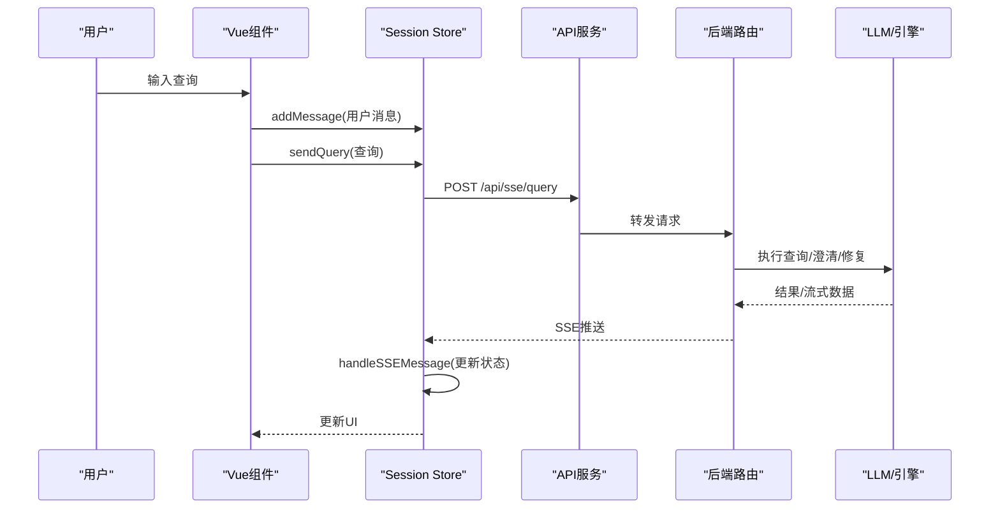

# 代码规范与最佳实践

<cite>
**本文引用的文件**
- [backend/package.json](file://backend/package.json)
- [frontend/package.json](file://frontend/package.json)
- [backend/src/app.js](file://backend/src/app.js)
- [frontend/src/main.js](file://frontend/src/main.js)
- [backend/src/utils/logger.js](file://backend/src/utils/logger.js)
- [backend/src/core/config.js](file://backend/src/core/config.js)
- [frontend/src/App.vue](file://frontend/src/App.vue)
- [frontend/src/components/SchemaViewer.vue](file://frontend/src/components/SchemaViewer.vue)
- [backend/src/utils/llmResponseParser.js](file://backend/src/utils/llmResponseParser.js)
- [frontend/src/views/HomeView.vue](file://frontend/src/views/HomeView.vue)
- [frontend/src/stores/session.js](file://frontend/src/stores/session.js)
- [backend/src/utils/tokenBudget.js](file://backend/src/utils/tokenBudget.js)
- [frontend/src/utils/api.js](file://frontend/src/utils/api.js)
- [backend/src/core/routes.js](file://backend/src/core/routes.js)
</cite>

## 目录
1. [引言](#引言)
2. [项目结构](#项目结构)
3. [核心组件](#核心组件)
4. [架构总览](#架构总览)
5. [详细组件分析](#详细组件分析)
6. [依赖分析](#依赖分析)
7. [性能考虑](#性能考虑)
8. [故障排查指南](#故障排查指南)
9. [结论](#结论)
10. [附录](#附录)

## 引言
本指南面向NL2SQL项目的前后端开发者，提供统一的代码规范与最佳实践，涵盖JavaScript编码标准、Vue3组件开发规范、文件组织与模块化设计、注释规范、错误处理与日志记录、性能优化与安全编码等方面。目标是提升代码一致性、可维护性与可扩展性。

## 项目结构
NL2SQL采用前后端分离架构，后端使用Node.js + Express，前端使用Vue3 + Pinia + Element Plus。项目遵循“按功能域”组织文件，核心模块清晰分离，便于维护与扩展。

**图表来源**
- [frontend/src/main.js:1-89](file://frontend/src/main.js#L1-L89)
- [frontend/src/App.vue:1-384](file://frontend/src/App.vue#L1-L384)
- [frontend/src/stores/session.js:1-400](file://frontend/src/stores/session.js#L1-L400)
- [frontend/src/utils/api.js:1-303](file://frontend/src/utils/api.js#L1-L303)
- [backend/src/app.js:1-266](file://backend/src/app.js#L1-L266)
- [backend/src/core/routes.js:1-800](file://backend/src/core/routes.js#L1-L800)
- [backend/src/core/config.js:1-398](file://backend/src/core/config.js#L1-L398)
- [backend/src/utils/logger.js:1-482](file://backend/src/utils/logger.js#L1-L482)
- [backend/src/utils/tokenBudget.js:1-435](file://backend/src/utils/tokenBudget.js#L1-L435)
- [backend/src/utils/llmResponseParser.js:1-146](file://backend/src/utils/llmResponseParser.js#L1-L146)

**章节来源**
- [backend/package.json:1-28](file://backend/package.json#L1-L28)
- [frontend/package.json:1-36](file://frontend/package.json#L1-L36)

## 核心组件
- 后端入口与初始化：负责环境变量加载、中间件配置、模块初始化、优雅关闭与未处理异常捕获。
- 日志系统：统一日志级别、文件轮转、结构化输出与追踪能力。
- 配置中心：集中管理LLM、数据库、安全、会话、日志、评估等配置，并提供校验。
- 前端入口与路由：创建Vue应用、安装插件、注册全局组件、挂载应用。
- 会话状态管理：封装SSE连接、消息流处理、查询提交、会话生命周期管理。
- API服务：统一HTTP客户端、请求/响应拦截、错误处理与REST接口封装。
- 路由与控制器：定义REST API端点、中间件、健康检查、Schema查询、会话管理、评估接口等。

**章节来源**
- [backend/src/app.js:1-266](file://backend/src/app.js#L1-L266)
- [backend/src/utils/logger.js:1-482](file://backend/src/utils/logger.js#L1-L482)
- [backend/src/core/config.js:1-398](file://backend/src/core/config.js#L1-L398)
- [frontend/src/main.js:1-89](file://frontend/src/main.js#L1-L89)
- [frontend/src/stores/session.js:1-400](file://frontend/src/stores/session.js#L1-L400)
- [frontend/src/utils/api.js:1-303](file://frontend/src/utils/api.js#L1-L303)
- [backend/src/core/routes.js:1-800](file://backend/src/core/routes.js#L1-L800)

## 架构总览
后端通过Express提供REST API与SSE流，前端通过Axios调用API并与后端建立SSE连接，实现实时查询结果推送。日志系统贯穿两端，配置中心统一管理运行参数。

**图表来源**
- [frontend/src/utils/api.js:246-251](file://frontend/src/utils/api.js#L246-L251)
- [backend/src/core/routes.js:771-800](file://backend/src/core/routes.js#L771-L800)
- [frontend/src/stores/session.js:185-221](file://frontend/src/stores/session.js#L185-L221)

## 详细组件分析

### JavaScript编码标准
- ES6+语法与模块化
  - 使用ES6模块语法与import/export，避免CommonJS混用。
  - 函数式风格：优先使用纯函数、不可变数据、解构赋值。
  - 异步处理：统一使用async/await，避免回调地狱。
- 命名约定
  - 变量与函数：camelCase；常量：UPPER_SNAKE_CASE；类名：PascalCase。
  - 文件命名：功能域/模块名小写，单词间用连字符或驼峰，避免复数。
  - 目录命名：按功能域划分，如core、utils、memory、tools。
- 函数设计原则
  - 单一职责：每个函数只做一件事。
  - 输入输出明确：参数与返回值类型清晰，必要时提供默认值。
  - 错误处理：显式抛错或返回错误对象，避免静默失败。
- 导入导出规范
  - 顶层导入，按第三方、内部模块、相对路径分组。
  - 避免循环依赖，必要时拆分模块或引入中间层。
- 注释规范
  - 文件顶部注释：模块用途、职责、关键依赖。
  - 函数注释：参数、返回值、异常、复杂逻辑说明。
  - 类注释：构造函数、公共方法、属性说明。
  - 复杂逻辑注释：解释为什么这样实现，边界条件与风险。

**章节来源**
- [backend/src/utils/llmResponseParser.js:1-146](file://backend/src/utils/llmResponseParser.js#L1-L146)
- [backend/src/utils/tokenBudget.js:1-435](file://backend/src/utils/tokenBudget.js#L1-L435)

### Vue3组件开发规范
- 组件结构
  - 使用Composition API与<script setup>，保持简洁与一致。
  - 模板、脚本、样式三段式，样式使用scoped，避免全局污染。
- props定义
  - 明确类型、默认值与必填性；使用defineProps声明。
  - 避免在props上做复杂逻辑，尽量通过计算属性或方法派生。
- 事件处理
  - 使用defineEmits声明事件；事件命名使用kebab-case。
  - 通过v-model实现双向绑定时，使用update:modelValue约定。
- 生命周期管理
  - onMounted/onUnmounted等钩子内仅做轻量逻辑；耗时操作异步化。
  - 在组件卸载时清理定时器、SSE连接、订阅等资源。
- 状态管理
  - Pinia Store：单一职责，Action内处理副作用；Getters用于派生状态。
  - 避免在组件中直接操作全局状态，通过Store方法交互。

**章节来源**
- [frontend/src/App.vue:85-241](file://frontend/src/App.vue#L85-L241)
- [frontend/src/components/SchemaViewer.vue:89-257](file://frontend/src/components/SchemaViewer.vue#L89-L257)
- [frontend/src/views/HomeView.vue:95-188](file://frontend/src/views/HomeView.vue#L95-L188)
- [frontend/src/stores/session.js:33-399](file://frontend/src/stores/session.js#L33-L399)

### 文件组织与模块化设计
- 目录命名
  - backend/src/core：核心引擎与路由
  - backend/src/utils：通用工具与服务
  - backend/src/memory：长期记忆与向量存储
  - frontend/src/components：可复用UI组件
  - frontend/src/views：页面级视图
  - frontend/src/stores：状态管理
  - frontend/src/utils：API与工具
- 导入导出
  - 保持扁平化导入，避免深层相对路径。
  - 对外暴露稳定的API，内部实现可重构。
- 配置与环境
  - 所有敏感配置通过环境变量注入，禁止硬编码。
  - 提供默认值与校验，启动阶段fail-fast。

**章节来源**
- [backend/src/core/config.js:1-398](file://backend/src/core/config.js#L1-L398)
- [frontend/src/utils/api.js:24-34](file://frontend/src/utils/api.js#L24-L34)

### 注释规范
- 函数注释：包含用途、参数、返回值、异常、复杂逻辑说明。
- 类注释：构造函数、公共方法、属性、依赖关系。
- 复杂逻辑注释：解释算法选择、边界条件、性能权衡。
- 日志注释：关键流程与错误点需有日志记录，便于追踪。

**章节来源**
- [backend/src/utils/logger.js:1-482](file://backend/src/utils/logger.js#L1-L482)
- [backend/src/utils/llmResponseParser.js:1-146](file://backend/src/utils/llmResponseParser.js#L1-L146)

### 错误处理最佳实践
- 异常捕获
  - 后端：未处理异常与Promise拒绝统一捕获，记录日志并优雅关闭。
  - 前端：API拦截器统一处理错误，组件内对用户可见的错误进行友好提示。
- 错误信息格式化
  - 统一错误对象结构，包含message、code、details等字段。
  - 前端使用ElMessage/ElMessageBox展示错误，避免直接抛出堆栈。
- 日志记录
  - 使用Logger类记录结构化日志，包含时间戳、级别、消息与元数据。
  - Trace级别用于深度调试，结合traceId串联一次请求的完整链路。

**图表来源**
- [backend/src/app.js:248-258](file://backend/src/app.js#L248-L258)
- [frontend/src/utils/api.js:72-88](file://frontend/src/utils/api.js#L72-L88)
- [backend/src/utils/logger.js:312-322](file://backend/src/utils/logger.js#L312-L322)

**章节来源**
- [backend/src/app.js:248-258](file://backend/src/app.js#L248-L258)
- [frontend/src/utils/api.js:72-88](file://frontend/src/utils/api.js#L72-L88)
- [backend/src/utils/logger.js:312-322](file://backend/src/utils/logger.js#L312-L322)

### 性能优化建议
- 上下文预算与压缩
  - 使用Token预算模块估算与压缩上下文，避免LLM上下文溢出。
  - 历史对话裁剪、检索片段压缩、摘要策略等。
- SSE与并发
  - 合理管理SSE连接，避免重复连接与泄漏。
  - 并发查询队列化，避免资源争用。
- 缓存与懒加载
  - Schema与配置缓存，按需加载与失效策略。
  - 图片、大列表懒加载，减少首屏压力。
- 数据库与向量库
  - 合理索引、分页查询、批量插入。
  - 向量库定期维护与重建策略。

**章节来源**
- [backend/src/utils/tokenBudget.js:115-181](file://backend/src/utils/tokenBudget.js#L115-L181)
- [frontend/src/stores/session.js:185-221](file://frontend/src/stores/session.js#L185-L221)

### 安全编码规范
- 白名单与权限控制
  - 配置允许访问的表白名单，避免任意表查询。
  - 禁止DDL/危险SQL关键字，限制返回行数与查询超时。
- 数据脱敏
  - 对敏感字段进行脱敏处理，避免泄露。
- CORS与输入校验
  - CORS配置合理，生产环境限定来源。
  - 对用户输入进行校验与清理，防止注入与XSS。

**章节来源**
- [backend/src/core/config.js:140-170](file://backend/src/core/config.js#L140-L170)

## 依赖分析
- 前端依赖
  - Vue3、Pinia、Element Plus、Axios、Vue Router等，满足组件化与状态管理需求。
- 后端依赖
  - Express、CORS、body-parser、dotenv、uuid、dayjs、node-cron等，支撑Web服务与定时任务。
- 开发依赖
  - Vite、@vitejs/plugin-vue、Sass等，提升构建效率与开发体验。

**图表来源**
- [frontend/package.json:11-29](file://frontend/package.json#L11-L29)
- [backend/package.json:10-22](file://backend/package.json#L10-L22)

**章节来源**
- [frontend/package.json:1-36](file://frontend/package.json#L1-L36)
- [backend/package.json:1-28](file://backend/package.json#L1-L28)

## 性能考虑
- 启动与初始化
  - 顺序化初始化，失败即终止，避免半成品状态。
  - 目录与文件存在性检查，避免运行时异常。
- 日志与监控
  - 文件轮转与大小限制，避免磁盘占用过大。
  - Trace追踪会话上限与超时清理，防止内存泄漏。
- API与SSE
  - 请求超时与重试策略，避免阻塞。
  - SSE连接状态管理与错误恢复。

**章节来源**
- [backend/src/app.js:97-194](file://backend/src/app.js#L97-L194)
- [backend/src/utils/logger.js:147-179](file://backend/src/utils/logger.js#L147-L179)
- [frontend/src/stores/session.js:185-221](file://frontend/src/stores/session.js#L185-L221)

## 故障排查指南
- 后端
  - 未处理异常与Promise拒绝：检查uncaughtException与unhandledRejection处理。
  - 配置错误：启动时validateConfig失败，检查.env配置项。
  - 日志定位：使用traceId与日志级别，逐步缩小范围。
- 前端
  - API错误：统一响应拦截器输出错误，检查网络与后端状态。
  - SSE连接：检查readyState与错误回调，必要时重连。
  - 状态异常：通过Store的isConnected与isProcessing状态判断。

**章节来源**
- [backend/src/app.js:248-258](file://backend/src/app.js#L248-L258)
- [backend/src/core/config.js:366-388](file://backend/src/core/config.js#L366-L388)
- [frontend/src/utils/api.js:72-88](file://frontend/src/utils/api.js#L72-L88)
- [frontend/src/stores/session.js:185-221](file://frontend/src/stores/session.js#L185-L221)

## 结论
通过统一的编码规范、清晰的模块划分、完善的日志与错误处理、性能优化与安全策略，NL2SQL项目能够在保证可维护性的同时，持续演进与扩展。建议团队在日常开发中严格执行本指南，并根据实际场景持续迭代。

## 附录
- 关键流程时序图：查询与SSE推送流程

**图表来源**
- [frontend/src/stores/session.js:301-330](file://frontend/src/stores/session.js#L301-L330)
- [frontend/src/utils/api.js:246-251](file://frontend/src/utils/api.js#L246-L251)
- [backend/src/core/routes.js:771-800](file://backend/src/core/routes.js#L771-L800)