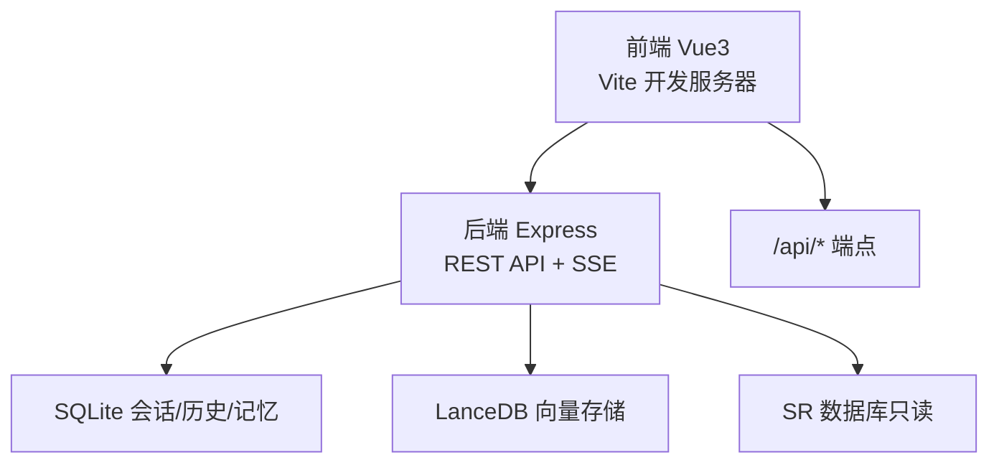
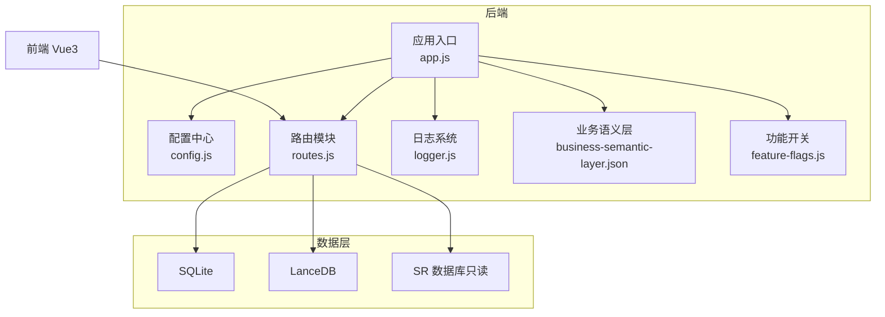
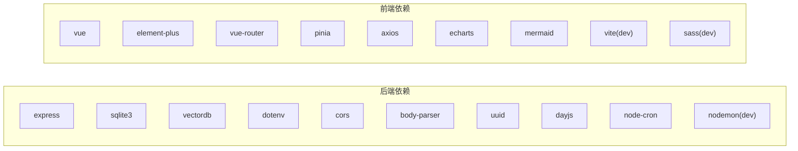

# 开发工作流程

<cite>
**本文引用的文件**
- [backend/package.json](file://backend/package.json)
- [frontend/package.json](file://frontend/package.json)
- [docs/NL2SQL-进度追踪.md](file://docs/NL2SQL-进度追踪.md)
- [backend/src/app.js](file://backend/src/app.js)
- [backend/src/core/routes.js](file://backend/src/core/routes.js)
- [backend/config/business-semantic-layer.json](file://backend/config/business-semantic-layer.json)
- [backend/config/feature-flags.js](file://backend/config/feature-flags.js)
- [backend/src/utils/logger.js](file://backend/src/utils/logger.js)
- [frontend/src/main.js](file://frontend/src/main.js)
- [CLAUDE.md](file://CLAUDE.md)
</cite>

## 目录
1. [简介](#简介)
2. [项目结构](#项目结构)
3. [核心组件](#核心组件)
4. [架构总览](#架构总览)
5. [详细组件分析](#详细组件分析)
6. [依赖分析](#依赖分析)
7. [性能考虑](#性能考虑)
8. [故障排查指南](#故障排查指南)
9. [结论](#结论)
10. [附录](#附录)

## 简介
本指南面向NL2SQL项目的团队协作与工程化实践，围绕Git分支管理、代码审查、持续集成、版本发布、日常开发任务与团队协作等方面，结合仓库现有代码与文档，制定可落地的标准流程，帮助团队高效交付高质量产品。

## 项目结构
NL2SQL采用前后端分离架构：
- 后端：Node.js + Express，提供REST API与SSE流式通信，核心模块包括引擎、路由、内存系统、日志与配置等。
- 前端：Vue3 + Element Plus，通过Vite开发，提供聊天界面、Schema浏览、历史与评估视图等。
- 配置与文档：包含功能开关、业务语义层配置、进度追踪文档以及开发指引。

**图示来源**
- [backend/src/app.js:1-266](file://backend/src/app.js#L1-L266)
- [backend/src/core/routes.js:1-800](file://backend/src/core/routes.js#L1-L800)
- [frontend/src/main.js:1-89](file://frontend/src/main.js#L1-L89)

**章节来源**
- [backend/src/app.js:1-266](file://backend/src/app.js#L1-L266)
- [frontend/src/main.js:1-89](file://frontend/src/main.js#L1-L89)
- [CLAUDE.md:41-58](file://CLAUDE.md#L41-L58)

## 核心组件
- 后端入口与生命周期：负责环境变量加载、模块初始化、HTTP/SSE服务启动与优雅关闭。
- REST路由与中间件：统一请求日志、健康检查、Schema查询、会话与历史管理、评估统计等。
- 功能开关与业务语义层：通过环境变量控制Phase级功能，支持业务术语到物理表/字段的映射。
- 日志系统：结构化日志输出至控制台与文件，支持追踪上下文与轮转。
- 前端应用入口：创建Vue应用、安装路由/状态管理/UI库、注册全局组件并挂载。

**章节来源**
- [backend/src/app.js:97-194](file://backend/src/app.js#L97-L194)
- [backend/src/core/routes.js:46-137](file://backend/src/core/routes.js#L46-L137)
- [backend/config/feature-flags.js:16-96](file://backend/config/feature-flags.js#L16-L96)
- [backend/config/business-semantic-layer.json:1-189](file://backend/config/business-semantic-layer.json#L1-L189)
- [backend/src/utils/logger.js:54-482](file://backend/src/utils/logger.js#L54-L482)
- [frontend/src/main.js:55-89](file://frontend/src/main.js#L55-L89)

## 架构总览
后端通过配置中心统一读取环境变量，初始化数据库与向量库，加载Schema与业务语义层，启动自修复调度器，并对外提供REST API与SSE流式接口。前端通过Vite代理将/api请求转发至后端，实现跨域免配置。

**图示来源**
- [backend/src/app.js:39-50](file://backend/src/app.js#L39-L50)
- [backend/src/core/routes.js:22-30](file://backend/src/core/routes.js#L22-L30)
- [backend/config/business-semantic-layer.json:1-189](file://backend/config/business-semantic-layer.json#L1-L189)
- [backend/config/feature-flags.js:16-96](file://backend/config/feature-flags.js#L16-L96)
- [backend/src/utils/logger.js:54-98](file://backend/src/utils/logger.js#L54-L98)

## 详细组件分析

### Git分支管理策略
- 主分支保护
  - master/main仅允许通过受保护的合并请求进入，禁止直接推送。
  - 合并前必须通过CI检查与代码审查。
- 功能分支命名规范
  - feat/功能主题：feat/nl2sql-engine
  - fix/缺陷修复：fix/schema-loading-bug
  - docs/文档更新：docs/readme-update
  - refactor/重构：refactor/memory-module
  - perf/性能优化：perf/vector-search
  - test/测试：test/new-unit-test
- Hotfix分支
  - hotfix/critical-bug：用于紧急修复线上问题，修复后同时合并至develop与master/main，并打补丁标签。

[本节为通用工程实践建议，不直接分析具体文件，故无“章节来源”]

### 代码审查流程
- Pull Request模板
  - 标题：简述变更类型与目标（如：feat(nl2sql): 增强意图识别）
  - 摘要：变更背景、影响范围、风险提示
  - 测试：本地/集成测试结果与覆盖说明
  - 依赖：新增/变更的依赖与版本
  - 附件：截图/视频/性能对比
- 审查清单
  - 代码风格与一致性
  - 单元测试与边界条件
  - 性能与资源占用
  - 安全与权限控制
  - 文档与注释更新
- 合并要求
  - 至少一名审查者批准
  - CI通过（测试、静态检查）
  - 无未解决评论
  - Squash或Rebase合并，提交信息清晰

[本节为通用工程实践建议，不直接分析具体文件，故无“章节来源”]

### 持续集成配置
- GitHub Actions工作流
  - 触发：push到分支、PR打开/同步、schedule定时任务
  - 步骤：安装Node.js、安装依赖、运行测试、构建前端、静态分析、构建后端、制品上传
- 自动化测试执行
  - 后端：单元测试与集成测试（结合SQLite/LanceDB）
  - 前端：组件测试与端到端测试（可选）
- 部署触发条件
  - master/main通过审查与测试后自动部署预发布环境
  - 标签推送到main触发生产部署

[本节为通用工程实践建议，不直接分析具体文件，故无“章节来源”]

### 版本发布流程
- 语义化版本控制
  - 主版本：破坏性变更
  - 次版本：新增兼容功能
  - 修订版本：兼容性修复
- 变更日志维护
  - 每次合并PR时在changelog中记录变更摘要
  - 发布前汇总为CHANGELOG.md
- 发布标签管理
  - 以vX.Y.Z命名标签，关联Release说明
  - 标签与CI构建产物绑定

[本节为通用工程实践建议，不直接分析具体文件，故无“章节来源”]

### 日常开发任务
- 任务分配
  - 使用项目看板（如Issue/Task）跟踪进度，按优先级分配
- 进度跟踪
  - 参考进度追踪文档，定期更新完成度与阻塞项
- 问题管理
  - Issue模板：标题、重现步骤、期望/实际结果、日志与截图
  - 问题分类：Bug、需求、优化、技术债

**章节来源**
- [docs/NL2SQL-进度追踪.md:1-265](file://docs/NL2SQL-进度追踪.md#L1-L265)

### 团队协作规范与沟通渠道
- 沟通渠道
  - 即时沟通：企业微信/钉钉群
  - 讨论与决策：GitHub Discussions/Issue讨论
  - 文档共享：Confluence/Wiki
- 规范
  - 每日站会简述昨日进展与今日计划
  - 代码评审及时响应
  - 变更及时同步至文档与看板

[本节为通用工程实践建议，不直接分析具体文件，故无“章节来源”]

## 依赖分析
- 后端依赖
  - Express、CORS、Body Parser、SQLite3、dotenv、uuid、dayjs、node-cron、vectordb
  - 开发依赖：nodemon
- 前端依赖
  - Vue3、Element Plus、Vue Router、Pinia、Axios、ECharts、Mermaid等
  - 开发依赖：Vite、Sass、Vue插件

**图示来源**
- [backend/package.json:10-26](file://backend/package.json#L10-L26)
- [frontend/package.json:11-34](file://frontend/package.json#L11-L34)

**章节来源**
- [backend/package.json:1-28](file://backend/package.json#L1-L28)
- [frontend/package.json:1-36](file://frontend/package.json#L1-L36)

## 性能考虑
- 后端
  - 启动阶段顺序化初始化，避免竞态；日志轮转与追踪上下文容量保护，防止内存膨胀。
  - SSE长连接与定时任务需关注资源回收与优雅关闭。
- 前端
  - 组件懒加载与虚拟滚动（建议）；构建产物最小化与缓存策略。
- 数据层
  - 向量检索与Schema向量化需定期维护；SQLite与LanceDB的I/O与索引优化。

**章节来源**
- [backend/src/app.js:97-194](file://backend/src/app.js#L97-L194)
- [backend/src/utils/logger.js:147-179](file://backend/src/utils/logger.js#L147-L179)
- [backend/src/utils/logger.js:352-448](file://backend/src/utils/logger.js#L352-L448)

## 故障排查指南
- 启动失败
  - 检查环境变量与配置文件；查看日志文件与控制台输出；确认端口占用。
- API异常
  - 使用健康检查端点定位数据库、Schema与SSE连接状态；核对请求参数与路由定义。
- 功能开关导致的行为差异
  - 检查功能开关状态与启用Phase列表；必要时临时禁用以复现问题。
- 业务语义层不生效
  - 确认配置文件加载与映射规则；重启后端并设置向量化重生成标志。

**章节来源**
- [backend/src/app.js:103-193](file://backend/src/app.js#L103-L193)
- [backend/src/core/routes.js:72-137](file://backend/src/core/routes.js#L72-L137)
- [backend/config/feature-flags.js:209-229](file://backend/config/feature-flags.js#L209-L229)
- [backend/config/business-semantic-layer.json:1-189](file://backend/config/business-semantic-layer.json#L1-L189)

## 结论
本指南基于仓库现有代码与文档，提出了适用于NL2SQL项目的标准化开发工作流程。建议团队在实践中逐步完善CI/CD与发布流程，持续优化日志与监控体系，确保功能开关与业务语义层的可控演进，以支撑项目的稳定交付与长期维护。

## 附录
- 开发命令与环境配置参考：见CLAUDE.md中的开发命令与环境配置说明。
- 前端代理与跨域：Vite代理将/api请求转发至后端，无需手动配置跨域。

**章节来源**
- [CLAUDE.md:9-25](file://CLAUDE.md#L9-L25)
- [CLAUDE.md:27-40](file://CLAUDE.md#L27-L40)