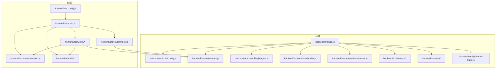
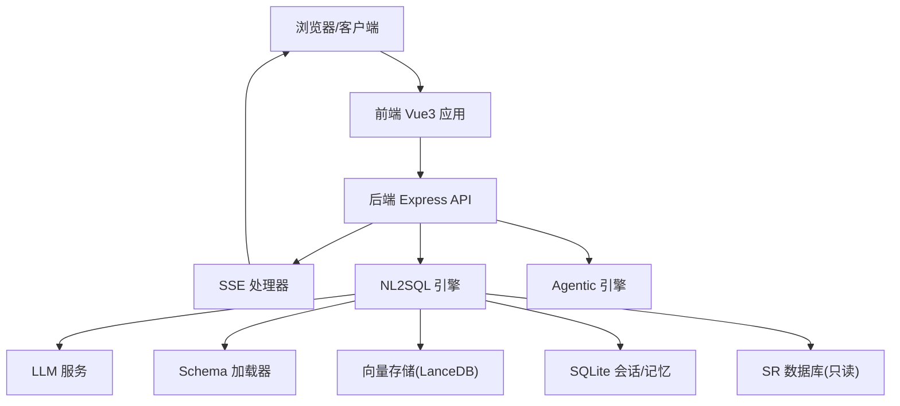
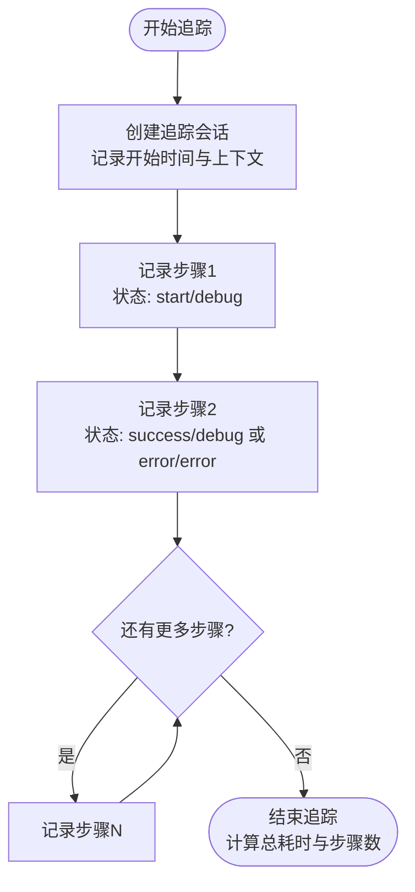
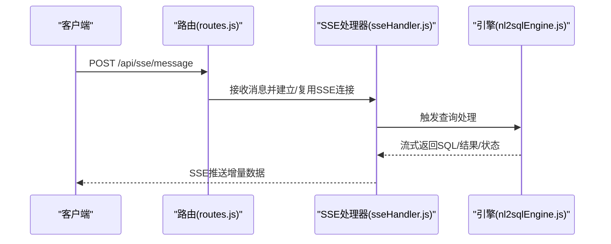
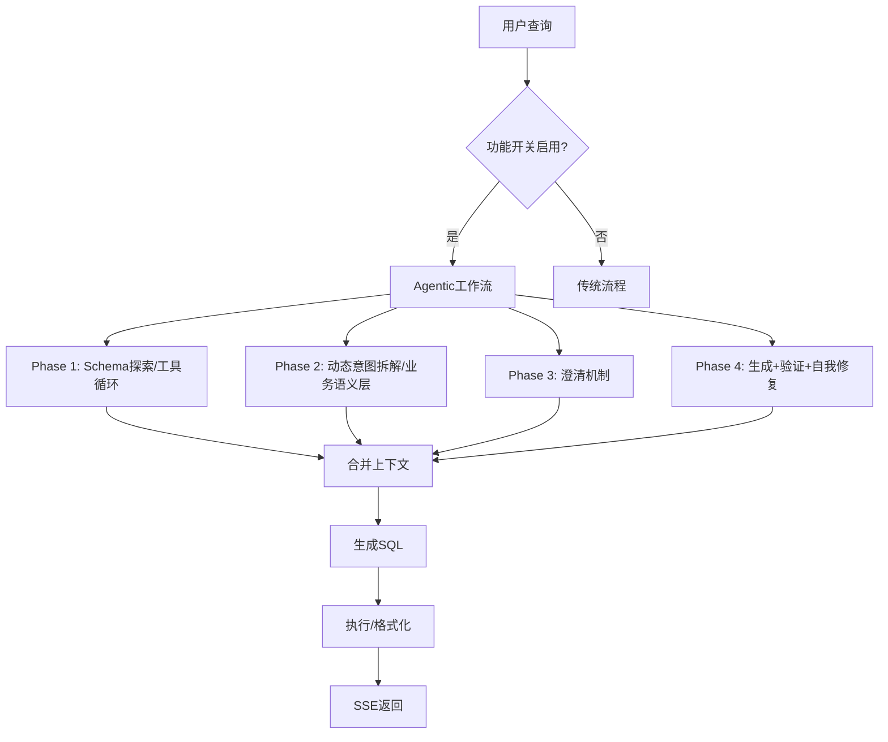
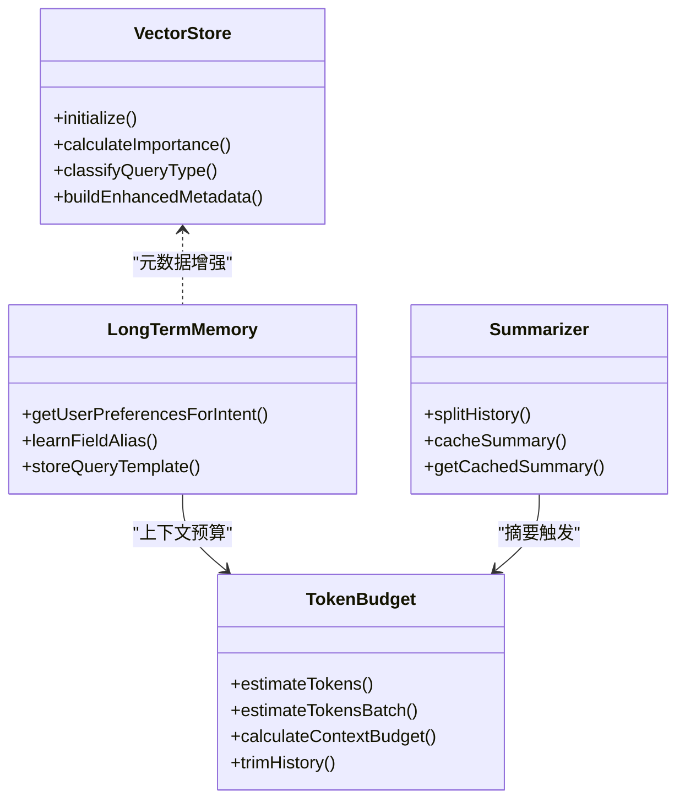
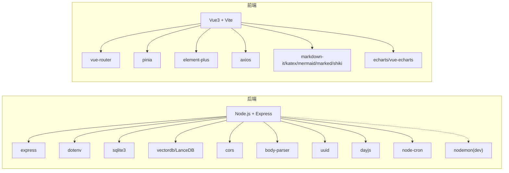

# 开发指南

<cite>
**本文引用的文件**
- [backend/package.json](file://backend/package.json)
- [frontend/package.json](file://frontend/package.json)
- [backend/src/app.js](file://backend/src/app.js)
- [frontend/src/main.js](file://frontend/src/main.js)
- [frontend/vite.config.js](file://frontend/vite.config.js)
- [backend/src/core/config.js](file://backend/src/core/config.js)
- [backend/src/utils/logger.js](file://backend/src/utils/logger.js)
- [backend/test/context-management.test.js](file://backend/test/context-management.test.js)
- [CLAUDE.md](file://CLAUDE.md)
- [backend/src/core/routes.js](file://backend/src/core/routes.js)
- [backend/src/core/nl2sqlEngine.js](file://backend/src/core/nl2sqlEngine.js)
- [backend/src/core/sseHandler.js](file://backend/src/core/sseHandler.js)
- [backend/src/core/schemaLoader.js](file://backend/src/core/schemaLoader.js)
- [backend/src/core/llmService.js](file://backend/src/core/llmService.js)
- [backend/src/core/schemaTools.js](file://backend/src/core/schemaTools.js)
- [backend/src/core/toolLoop.js](file://backend/src/core/toolLoop.js)
- [backend/src/core/queryDecomposer.js](file://backend/src/core/queryDecomposer.js)
- [backend/src/core/clarificationEngine.js](file://backend/src/core/clarificationEngine.js)
- [backend/src/core/semanticLayer.js](file://backend/src/core/semanticLayer.js)
- [backend/src/core/selfRepair.js](file://backend/src/core/selfRepair.js)
- [backend/src/memory/vectorStore.js](file://backend/src/memory/vectorStore.js)
- [backend/src/memory/longTermMemory.js](file://backend/src/memory/longTermMemory.js)
- [backend/src/memory/summarizer.js](file://backend/src/memory/summarizer.js)
- [backend/src/memory/memoryQueue.js](file://backend/src/memory/memoryQueue.js)
- [backend/src/memory/memoryMaintenance.js](file://backend/src/memory/memoryMaintenance.js)
- [backend/src/utils/tokenBudget.js](file://backend/src/utils/tokenBudget.js)
- [backend/src/utils/evaluation.js](file://backend/src/utils/evaluation.js)
- [backend/src/utils/llmResponseParser.js](file://backend/src/utils/llmResponseParser.js)
- [backend/src/utils/logger.js](file://backend/src/utils/logger.js)
- [backend/config/feature-flags.js](file://backend/config/feature-flags.js)
- [backend/config/schema-metadata.example.json](file://backend/config/schema-metadata.example.json)
- [docs/NL2SQL-进度追踪.md](file://docs/NL2SQL-进度追踪.md)
</cite>

## 目录
1. [简介](#简介)
2. [项目结构](#项目结构)
3. [核心组件](#核心组件)
4. [架构总览](#架构总览)
5. [详细组件分析](#详细组件分析)
6. [依赖分析](#依赖分析)
7. [性能考虑](#性能考虑)
8. [故障排查指南](#故障排查指南)
9. [结论](#结论)
10. [附录](#附录)

## 简介
本指南面向NL2SQL项目的开发者，提供从环境搭建、代码规范、测试策略、开发流程到贡献指南的完整说明。项目采用前后端分离架构：后端基于Node.js + Express，前端基于Vue3 + Vite，结合LanceDB向量存储与SQLite会话存储，提供自然语言到SQL的转换能力，并内置长期记忆与上下文管理机制。

## 项目结构
- 后端（Node.js + Express）
  - 核心模块：路由、配置、LLM服务、SSE处理、Schema加载、引擎、记忆系统、自修复等
  - 工具与评估：日志、Token预算、评估统计、响应解析
  - 配置：功能开关、Schema元数据、向量索引开关
  - 测试：上下文管理功能测试
- 前端（Vue3 + Vite）
  - 视图：聊天、Schema浏览、历史、记忆、评估等
  - 状态：Pinia会话状态管理
  - 工具：API封装、Markdown渲染、主题样式
  - 构建：Vite配置（代理、路径别名、代码分割）

**图表来源**
- [frontend/src/main.js:1-89](file://frontend/src/main.js#L1-L89)
- [frontend/vite.config.js:1-93](file://frontend/vite.config.js#L1-L93)
- [backend/src/app.js:1-266](file://backend/src/app.js#L1-L266)
- [backend/src/core/config.js:1-398](file://backend/src/core/config.js#L1-L398)
- [backend/src/core/routes.js:1-800](file://backend/src/core/routes.js#L1-L800)
- [backend/src/core/nl2sqlEngine.js:1-200](file://backend/src/core/nl2sqlEngine.js#L1-L200)
- [backend/src/core/sseHandler.js](file://backend/src/core/sseHandler.js)
- [backend/src/core/schemaLoader.js](file://backend/src/core/schemaLoader.js)
- [backend/src/memory/vectorStore.js](file://backend/src/memory/vectorStore.js)
- [backend/src/utils/logger.js:1-482](file://backend/src/utils/logger.js#L1-L482)
- [backend/config/feature-flags.js:1-249](file://backend/config/feature-flags.js#L1-L249)

**章节来源**
- [backend/src/app.js:1-266](file://backend/src/app.js#L1-L266)
- [frontend/src/main.js:1-89](file://frontend/src/main.js#L1-L89)
- [frontend/vite.config.js:1-93](file://frontend/vite.config.js#L1-L93)
- [CLAUDE.md:1-153](file://CLAUDE.md#L1-L153)

## 核心组件
- 配置中心（config.js）
  - 统一读取环境变量，提供LLM、Embedding、数据库、安全、会话、日志、自修复、Schema、长期记忆、上下文管理、评估等配置
  - 提供配置校验与日志级别设置
- 日志系统（logger.js）
  - 控制台彩色输出与文件轮转，支持TRACE/DEBUG/INFO/WARN/ERROR
  - 提供执行流程追踪（startTrace/traceStep/endTrace）
- 路由与API（routes.js）
  - 健康检查、Schema查询、会话管理、查询历史、长期记忆、评估统计等REST接口
- 引擎与工作流（nl2sqlEngine.js + feature-flags）
  - 核心引擎：意图识别、表检索、SQL生成、验证、执行、格式化
  - 功能开关：Phase 1-4的渐进式启用与回滚
- 记忆与上下文（memory/* + utils/tokenBudget.js）
  - 向量存储（LanceDB）、长期记忆（SQLite）、对话摘要、Token预算、上下文裁剪
- SSE实时流（sseHandler.js）
  - 管理SSE连接，支持多标签页会话
- 工具链（schemaTools.js、toolLoop.js、queryDecomposer.js、clarificationEngine.js、semanticLayer.js）
  - LLM工具调用循环、动态意图拆解、澄清机制、业务语义层
- 自修复（selfRepair.js）
  - node-cron定时任务，健康检查、会话清理、统计收集、记忆维护

**章节来源**
- [backend/src/core/config.js:1-398](file://backend/src/core/config.js#L1-L398)
- [backend/src/utils/logger.js:1-482](file://backend/src/utils/logger.js#L1-L482)
- [backend/src/core/routes.js:1-800](file://backend/src/core/routes.js#L1-L800)
- [backend/src/core/nl2sqlEngine.js:1-200](file://backend/src/core/nl2sqlEngine.js#L1-L200)
- [backend/config/feature-flags.js:1-249](file://backend/config/feature-flags.js#L1-L249)
- [backend/src/memory/vectorStore.js](file://backend/src/memory/vectorStore.js)
- [backend/src/memory/longTermMemory.js](file://backend/src/memory/longTermMemory.js)
- [backend/src/memory/summarizer.js](file://backend/src/memory/summarizer.js)
- [backend/src/utils/tokenBudget.js](file://backend/src/utils/tokenBudget.js)
- [backend/src/core/sseHandler.js](file://backend/src/core/sseHandler.js)
- [backend/src/core/schemaTools.js](file://backend/src/core/schemaTools.js)
- [backend/src/core/toolLoop.js](file://backend/src/core/toolLoop.js)
- [backend/src/core/queryDecomposer.js](file://backend/src/core/queryDecomposer.js)
- [backend/src/core/clarificationEngine.js](file://backend/src/core/clarificationEngine.js)
- [backend/src/core/semanticLayer.js](file://backend/src/core/semanticLayer.js)
- [backend/src/core/selfRepair.js](file://backend/src/core/selfRepair.js)

## 架构总览

**图表来源**
- [CLAUDE.md:41-58](file://CLAUDE.md#L41-L58)
- [backend/src/app.js:1-266](file://backend/src/app.js#L1-L266)
- [backend/src/core/routes.js:1-800](file://backend/src/core/routes.js#L1-L800)
- [backend/src/core/nl2sqlEngine.js:1-200](file://backend/src/core/nl2sqlEngine.js#L1-L200)
- [backend/src/core/sseHandler.js](file://backend/src/core/sseHandler.js)
- [backend/src/core/schemaLoader.js](file://backend/src/core/schemaLoader.js)
- [backend/src/memory/vectorStore.js](file://backend/src/memory/vectorStore.js)
- [backend/src/core/config.js:1-398](file://backend/src/core/config.js#L1-L398)

## 详细组件分析

### 配置与环境
- Node.js版本要求：后端package.json声明最低版本要求
- 环境变量
  - LLM相关：LLM_API_BASE、LLM_API_KEY、LLM_MODEL、EMBEDDING_MODEL、LLM_TIMEOUT
  - 数据库：SR_DATABASE_URL、DB_PATH、VECTOR_DB_PATH
  - 安全与限制：ALLOWED_TABLES、DRY_RUN、MAX_QUERY_ROWS、QUERY_TIMEOUT、FORBIDDEN_KEYWORDS
  - 日志与自修复：LOG_LEVEL、LOG_FILE、SELF_REPAIR_*、SCHEMA_REVECTORIZE
  - 功能开关：FF_*（详见feature-flags.js）
- .env示例与复制：CLAUDE.md提供复制与填写指导

**章节来源**
- [backend/package.json:24-26](file://backend/package.json#L24-L26)
- [CLAUDE.md:27-40](file://CLAUDE.md#L27-L40)
- [backend/src/core/config.js:1-398](file://backend/src/core/config.js#L1-L398)
- [backend/config/feature-flags.js:1-249](file://backend/config/feature-flags.js#L1-L249)

### 日志与追踪
- 日志级别与输出：控制台彩色输出、文件轮转、最大文件数与大小
- 执行追踪：startTrace/traceStep/endTrace，支持僵尸会话清理与上下文容量保护
- 使用建议：开发阶段使用DEBUG/TRACE，生产阶段使用INFO/WARN/ERROR

**图表来源**
- [backend/src/utils/logger.js:324-448](file://backend/src/utils/logger.js#L324-L448)

**章节来源**
- [backend/src/utils/logger.js:1-482](file://backend/src/utils/logger.js#L1-L482)

### 路由与API
- 健康检查：/api/health、/api/health/detail
- Schema：/api/schema、/api/schema/tables/:tableName、/api/schema/search
- 会话：/api/sessions、/api/sessions/:sessionId、/api/sessions/:sessionId/messages、/api/users/:userId/sessions
- 查询历史：/api/queries/history
- 长期记忆：/api/preferences/:userId、/api/preferences/:userId/raw、/api/preferences/:userId/stats、/api/preferences/:userId/templates、/api/preferences/:userId/learn-alias、/api/preferences/:preferenceId
- 评估统计：/api/evaluation/stats、/api/evaluation/stats/reset、/api/evaluation/schema-quality

**图表来源**
- [backend/src/core/routes.js:1-800](file://backend/src/core/routes.js#L1-L800)
- [backend/src/core/sseHandler.js](file://backend/src/core/sseHandler.js)
- [backend/src/core/nl2sqlEngine.js:1-200](file://backend/src/core/nl2sqlEngine.js#L1-L200)

**章节来源**
- [backend/src/core/routes.js:1-800](file://backend/src/core/routes.js#L1-L800)

### 引擎与工作流
- 传统流程：意图识别 → 表检索 → SQL生成 → 验证 → 执行 → 格式化
- 功能开关：AGENTIC_ENGINE、TOOL_LOOP_MODE、DYNAMIC_INTENT_DECOMPOSITION、BUSINESS_SEMANTIC_LAYER、CLARIFICATION_ENGINE、AUTO_RECOVERY
- 分层加载：SCHEMA_LAYERED_LOADING、TOOL_AUGMENTED_SCHEMA
- 业务语义层：business-semantic-layer.json映射业务术语到物理表/字段

**图表来源**
- [backend/config/feature-flags.js:1-249](file://backend/config/feature-flags.js#L1-L249)
- [backend/src/core/nl2sqlEngine.js:1-200](file://backend/src/core/nl2sqlEngine.js#L1-L200)
- [backend/src/core/semanticLayer.js](file://backend/src/core/semanticLayer.js)
- [backend/src/core/clarificationEngine.js](file://backend/src/core/clarificationEngine.js)
- [backend/src/core/queryDecomposer.js](file://backend/src/core/queryDecomposer.js)
- [backend/src/core/toolLoop.js](file://backend/src/core/toolLoop.js)
- [backend/src/core/schemaTools.js](file://backend/src/core/schemaTools.js)

**章节来源**
- [backend/config/feature-flags.js:1-249](file://backend/config/feature-flags.js#L1-L249)
- [backend/src/core/nl2sqlEngine.js:1-200](file://backend/src/core/nl2sqlEngine.js#L1-L200)
- [backend/src/core/semanticLayer.js](file://backend/src/core/semanticLayer.js)
- [backend/src/core/clarificationEngine.js](file://backend/src/core/clarificationEngine.js)
- [backend/src/core/queryDecomposer.js](file://backend/src/core/queryDecomposer.js)
- [backend/src/core/toolLoop.js](file://backend/src/core/toolLoop.js)
- [backend/src/core/schemaTools.js](file://backend/src/core/schemaTools.js)

### 记忆与上下文
- 向量存储：Schema与查询历史向量化，支持相似度检索与元数据增强
- 长期记忆：字段别名、查询模式、指标/维度偏好，定期维护与压缩
- 对话摘要：超过阈值轮数后压缩早期历史，保留最近对话
- Token预算：估算上下文Token，触发压缩或截断，避免上下文溢出

**图表来源**
- [backend/src/memory/vectorStore.js](file://backend/src/memory/vectorStore.js)
- [backend/src/memory/longTermMemory.js](file://backend/src/memory/longTermMemory.js)
- [backend/src/memory/summarizer.js](file://backend/src/memory/summarizer.js)
- [backend/src/utils/tokenBudget.js](file://backend/src/utils/tokenBudget.js)

**章节来源**
- [backend/src/memory/vectorStore.js](file://backend/src/memory/vectorStore.js)
- [backend/src/memory/longTermMemory.js](file://backend/src/memory/longTermMemory.js)
- [backend/src/memory/summarizer.js](file://backend/src/memory/summarizer.js)
- [backend/src/utils/tokenBudget.js](file://backend/src/utils/tokenBudget.js)

### 前端工程与开发
- 入口与插件：main.js安装路由、Pinia、Element Plus、全局图标注册
- 路由与状态：router/index.js + stores/session.js
- 视图：ChatView.vue为主对话界面，支持Markdown渲染、SQL高亮、数据表格展示
- 构建与代理：vite.config.js配置开发服务器、路径别名、代理到后端3000端口

**章节来源**
- [frontend/src/main.js:1-89](file://frontend/src/main.js#L1-L89)
- [frontend/vite.config.js:1-93](file://frontend/vite.config.js#L1-L93)
- [frontend/src/views/ChatView.vue:1-200](file://frontend/src/views/ChatView.vue#L1-L200)

## 依赖分析
- 后端依赖
  - Web框架：express
  - 数据库：sqlite3、vectordb（LanceDB）
  - 工具：dotenv、cors、body-parser、uuid、dayjs、node-cron
  - 开发：nodemon
- 前端依赖
  - 框架：vue、vue-router、pinia
  - UI：element-plus、@element-plus/icons-vue
  - 可视化：vue-echarts、echarts
  - 工具：axios、dayjs、markdown-it、katex、mermaid、marked、shiki、uuid

**图表来源**
- [backend/package.json:10-23](file://backend/package.json#L10-L23)
- [frontend/package.json:11-34](file://frontend/package.json#L11-L34)

**章节来源**
- [backend/package.json:1-28](file://backend/package.json#L1-L28)
- [frontend/package.json:1-36](file://frontend/package.json#L1-L36)

## 性能考虑
- 向量检索优化：使用语义相似度检索相关表，减少无关表扫描
- Token预算：估算上下文Token，避免超限导致失败或性能下降
- 代码分割：Vite配置将第三方库拆分为独立chunk，优化首屏加载
- 数据库连接池：配置最小/最大连接数、获取超时、空闲超时
- 日志轮转：控制日志文件大小与数量，避免磁盘占用过高
- 自修复：定时任务进行健康检查、会话清理、统计收集与记忆维护

**章节来源**
- [backend/src/core/config.js:96-130](file://backend/src/core/config.js#L96-L130)
- [frontend/vite.config.js:71-91](file://frontend/vite.config.js#L71-L91)
- [backend/src/utils/logger.js:147-179](file://backend/src/utils/logger.js#L147-L179)
- [backend/src/core/selfRepair.js](file://backend/src/core/selfRepair.js)

## 故障排查指南
- 启动失败
  - 检查LLM_API_KEY与SR_DATABASE_URL是否配置
  - 查看日志文件与控制台输出，定位初始化错误
- 跨域问题
  - 前端通过Vite代理转发/api请求至后端3000端口
- SSE连接异常
  - 检查SSE处理器状态与连接数，确认session_id参数正确
- SQL执行失败
  - 检查白名单、禁止关键字、查询超时与行数限制
  - 开启AUTO_RECOVERY进行自动修复
- 评估统计未更新
  - 确认EVALUATION_ENABLED开关与统计重置接口

**章节来源**
- [backend/src/core/config.js:366-388](file://backend/src/core/config.js#L366-L388)
- [frontend/vite.config.js:24-35](file://frontend/vite.config.js#L24-L35)
- [backend/src/core/routes.js:100-137](file://backend/src/core/routes.js#L100-L137)
- [backend/src/core/routes.js:726-760](file://backend/src/core/routes.js#L726-L760)
- [backend/config/feature-flags.js:75-79](file://backend/config/feature-flags.js#L75-L79)

## 结论
本指南提供了NL2SQL项目的开发环境、代码结构、核心组件、架构与测试策略的系统性说明。建议开发者遵循统一的配置与日志规范，利用功能开关进行渐进式发布，配合上下文管理与长期记忆提升用户体验，并通过自修复机制保障系统稳定性。

## 附录

### 开发环境搭建
- Node.js版本：后端要求>=18.0.0
- 安装依赖
  - 后端：cd backend && npm install
  - 前端：cd frontend && npm install
- 启动服务
  - 后端：cd backend && npm run dev（端口3000）
  - 前端：cd frontend && npm run dev（端口5173）
  - 前端通过Vite代理将/api转发至后端3000端口
- 环境变量
  - 复制backend/.env.example为backend/.env并填写必填项

**章节来源**
- [backend/package.json:24-26](file://backend/package.json#L24-L26)
- [CLAUDE.md:9-25](file://CLAUDE.md#L9-L25)

### 代码规范与最佳实践
- JavaScript/Vue3编码标准
  - 使用ES模块与严格模式
  - 组件命名与文件组织遵循现有结构
  - 响应式状态使用Composition API（如<script setup>）
- 文件组织结构
  - 后端：按功能模块划分（core/memory/utils/config），公共配置集中于config.js
  - 前端：views/components/stores/utils/router，路径别名@/@views/@stores/@utils
- 注释规范
  - 关键模块与函数提供清晰注释，说明职责与参数
  - 日志记录使用统一格式，包含时间戳、级别与元数据

**章节来源**
- [frontend/vite.config.js:37-51](file://frontend/vite.config.js#L37-L51)
- [frontend/src/views/ChatView.vue:1-200](file://frontend/src/views/ChatView.vue#L1-L200)
- [backend/src/utils/logger.js:1-482](file://backend/src/utils/logger.js#L1-L482)

### 测试策略
- 单元测试
  - 上下文管理功能测试：Token估算、上下文预算、历史裁剪、摘要缓存、向量元数据增强
- 集成测试
  - API端点测试：健康检查、Schema查询、会话管理、查询历史、长期记忆、评估统计
- 端到端测试
  - 前后端联调：SSE流式交互、消息发送与接收、SQL生成与结果展示
- 测试执行
  - 上下文管理测试：cd backend && node test/context-management.test.js

**章节来源**
- [backend/test/context-management.test.js:1-321](file://backend/test/context-management.test.js#L1-L321)
- [backend/src/core/routes.js:1-800](file://backend/src/core/routes.js#L1-L800)

### 开发工作流程
- 分支管理
  - 主分支：release/feature分支合并后合并至main
  - 功能开发：feature/xxx分支，完成后合并至develop
- 代码审查
  - PR需包含变更说明、测试用例与风险评估
- 持续集成
  - 建议在CI中执行：依赖安装、构建、测试（含上下文管理测试）

**章节来源**
- [docs/NL2SQL-进度追踪.md:1-265](file://docs/NL2SQL-进度追踪.md#L1-L265)

### 贡献指南
- Issue提交
  - 描述问题背景、复现步骤、期望行为与实际行为
- Pull Request
  - 提供变更动机、改动范围、测试验证与升级注意事项
- 社区参与
  - 参考项目进度追踪文档，关注高优任务与优先级

**章节来源**
- [docs/NL2SQL-进度追踪.md:1-265](file://docs/NL2SQL-进度追踪.md#L1-L265)

### 开发工具与调试技巧
- IDE配置
  - VS Code：启用ESLint/Prettier、Vue扩展、Volar
- 调试工具
  - 后端：nodemon热重载、日志级别切换、TRACE/DEBUG详细追踪
  - 前端：Vite开发服务器、浏览器开发者工具、Vue Devtools
- 调试建议
  - 使用logger.traceStep记录关键步骤耗时
  - 通过EVALUATION统计观察检索命中率与记忆效果
  - 使用FE/Vite代理简化跨域问题

**章节来源**
- [backend/src/utils/logger.js:276-322](file://backend/src/utils/logger.js#L276-L322)
- [backend/src/core/routes.js:726-760](file://backend/src/core/routes.js#L726-L760)
- [frontend/vite.config.js:24-35](file://frontend/vite.config.js#L24-L35)