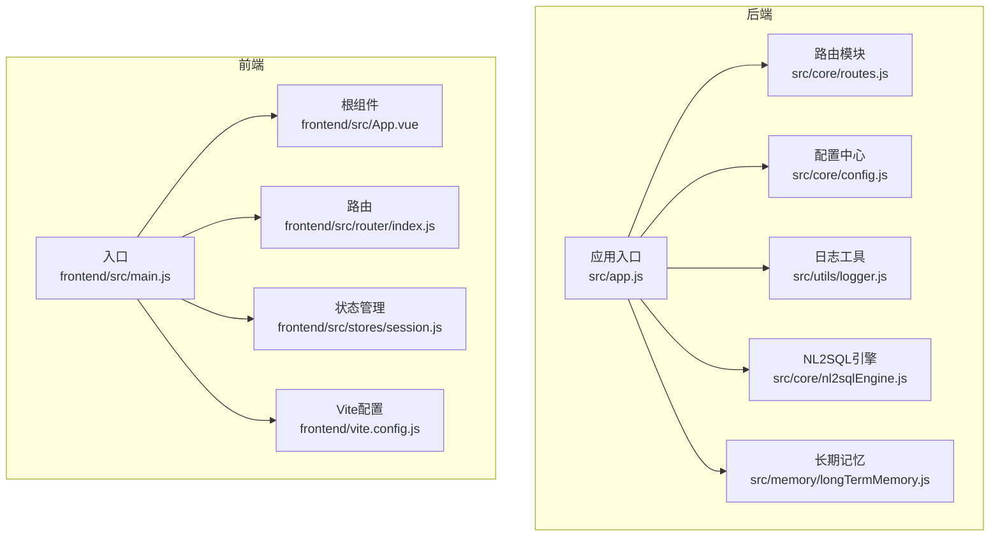
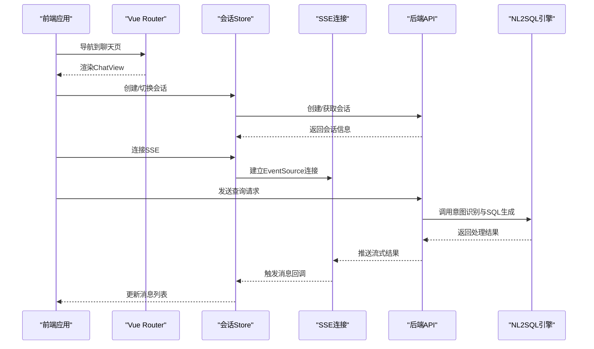
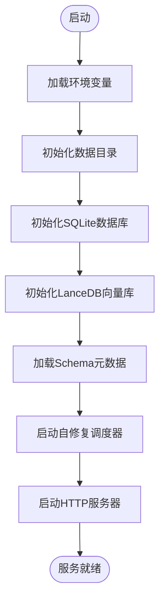
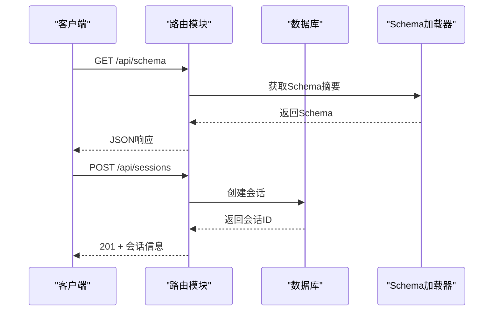
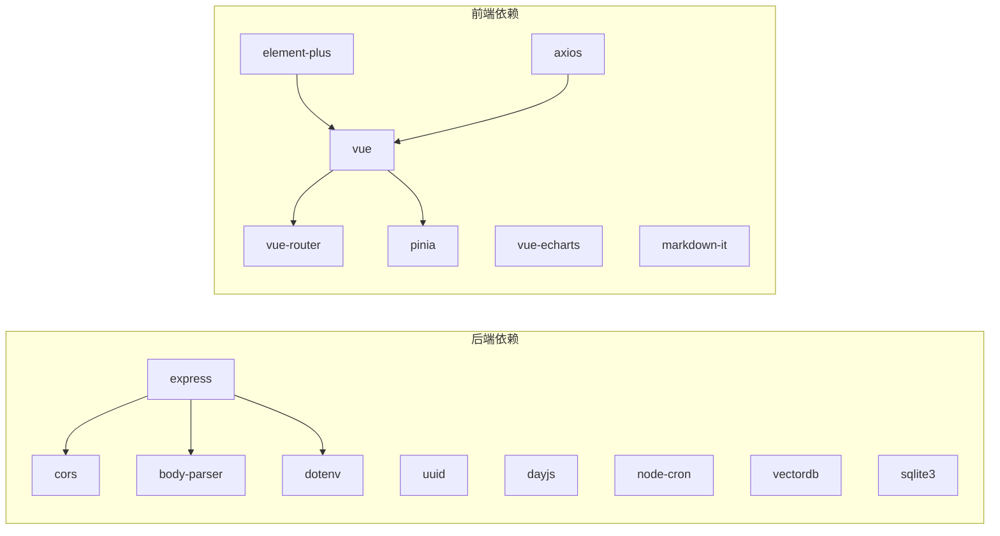

# 开发指南

<cite>
**本文档引用的文件**
- [backend/package.json](file://backend/package.json)
- [frontend/package.json](file://frontend/package.json)
- [backend/src/app.js](file://backend/src/app.js)
- [frontend/vite.config.js](file://frontend/vite.config.js)
- [backend/src/core/config.js](file://backend/src/core/config.js)
- [backend/src/utils/logger.js](file://backend/src/utils/logger.js)
- [backend/src/core/routes.js](file://backend/src/core/routes.js)
- [frontend/src/main.js](file://frontend/src/main.js)
- [frontend/src/App.vue](file://frontend/src/App.vue)
- [frontend/src/router/index.js](file://frontend/src/router/index.js)
- [frontend/src/stores/session.js](file://frontend/src/stores/session.js)
- [backend/src/core/nl2sqlEngine.js](file://backend/src/core/nl2sqlEngine.js)
- [backend/src/memory/longTermMemory.js](file://backend/src/memory/longTermMemory.js)
</cite>

## 目录
1. [简介](#简介)
2. [项目结构](#项目结构)
3. [核心组件](#核心组件)
4. [架构总览](#架构总览)
5. [详细组件分析](#详细组件分析)
6. [依赖分析](#依赖分析)
7. [性能考虑](#性能考虑)
8. [故障排除指南](#故障排除指南)
9. [结论](#结论)
10. [附录](#附录)

## 简介
本指南面向NL2SQL项目的开发者，提供从环境搭建、代码规范、调试工具、测试策略、Git工作流、代码审查到性能优化与故障排除的完整开发手册。项目采用前后端分离架构：后端基于Node.js + Express，提供REST API与SSE流式输出；前端基于Vue 3 + Vite，使用Element Plus、Pinia、Vue Router构建交互界面。

## 项目结构
项目分为三个主要部分：
- 后端（backend）：Node.js + Express，提供REST API、SSE、日志、配置与核心业务逻辑（NL2SQL引擎、长期记忆、向量存储等）
- 前端（frontend）：Vue 3 + Vite，提供聊天界面、历史记录、Schema查看、长期记忆管理等页面
- 文档（docs）：项目文档目录（当前仓库未包含具体内容）

**图表来源**
- [backend/src/app.js:1-238](file://backend/src/app.js#L1-L238)
- [backend/src/core/config.js:1-332](file://backend/src/core/config.js#L1-L332)
- [backend/src/utils/logger.js:1-318](file://backend/src/utils/logger.js#L1-L318)
- [backend/src/core/routes.js:1-800](file://backend/src/core/routes.js#L1-L800)
- [backend/src/core/nl2sqlEngine.js:1-800](file://backend/src/core/nl2sqlEngine.js#L1-L800)
- [backend/src/memory/longTermMemory.js:1-800](file://backend/src/memory/longTermMemory.js#L1-L800)
- [frontend/src/main.js:1-89](file://frontend/src/main.js#L1-L89)
- [frontend/src/App.vue:1-373](file://frontend/src/App.vue#L1-L373)
- [frontend/src/router/index.js:1-147](file://frontend/src/router/index.js#L1-L147)
- [frontend/src/stores/session.js:1-398](file://frontend/src/stores/session.js#L1-L398)
- [frontend/vite.config.js:1-93](file://frontend/vite.config.js#L1-L93)

**章节来源**
- [backend/src/app.js:1-238](file://backend/src/app.js#L1-L238)
- [frontend/src/main.js:1-89](file://frontend/src/main.js#L1-L89)

## 核心组件
- 应用入口与初始化：后端入口负责加载环境变量、初始化数据库与向量库、加载Schema、启动HTTP与SSE服务，并处理优雅关闭。
- 配置中心：集中管理LLM API、数据库、安全、会话、日志、自修复、Schema与长期记忆等配置。
- 日志系统：统一输出到控制台与文件，支持级别控制、轮转与事件通知。
- 路由模块：提供健康检查、Schema查询、会话管理、查询历史、统计信息、配置公开信息等REST接口。
- NL2SQL引擎：意图识别、实体解析、澄清机制、SQL生成与验证、结果格式化。
- 长期记忆：用户偏好抽取、存储与检索，支持LLM智能提炼与逻辑判断。
- 前端入口与路由：Vue应用初始化、插件安装、Element Plus集成、全局样式、路由与状态管理。

**章节来源**
- [backend/src/app.js:97-166](file://backend/src/app.js#L97-L166)
- [backend/src/core/config.js:16-332](file://backend/src/core/config.js#L16-L332)
- [backend/src/utils/logger.js:51-318](file://backend/src/utils/logger.js#L51-L318)
- [backend/src/core/routes.js:44-800](file://backend/src/core/routes.js#L44-L800)
- [backend/src/core/nl2sqlEngine.js:394-677](file://backend/src/core/nl2sqlEngine.js#L394-L677)
- [backend/src/memory/longTermMemory.js:311-484](file://backend/src/memory/longTermMemory.js#L311-L484)
- [frontend/src/main.js:14-89](file://frontend/src/main.js#L14-L89)
- [frontend/src/router/index.js:34-147](file://frontend/src/router/index.js#L34-L147)

## 架构总览
后端通过Express提供REST API与SSE，前端通过Vite开发，使用Element Plus与Vue生态。后端核心模块通过依赖注入方式协作，前端通过Pinia管理会话状态并通过SSE实时接收后端流式结果。

**图表来源**
- [frontend/src/router/index.js:34-98](file://frontend/src/router/index.js#L34-L98)
- [frontend/src/stores/session.js:185-328](file://frontend/src/stores/session.js#L185-L328)
- [backend/src/core/routes.js:264-343](file://backend/src/core/routes.js#L264-L343)
- [backend/src/core/nl2sqlEngine.js:394-677](file://backend/src/core/nl2sqlEngine.js#L394-L677)

## 详细组件分析

### 后端应用入口与初始化
- 加载环境变量与依赖
- 初始化数据目录、SQLite数据库、LanceDB向量库
- 加载Schema元数据、启动自修复调度器
- 启动HTTP服务器与SSE端点
- 优雅关闭处理与未捕获异常保护

**图表来源**
- [backend/src/app.js:97-166](file://backend/src/app.js#L97-L166)

**章节来源**
- [backend/src/app.js:15-238](file://backend/src/app.js#L15-L238)

### 配置中心与安全策略
- 配置项集中管理，支持从环境变量读取与默认值
- 安全策略：表白名单、Dry Run、查询行数限制、查询超时、禁止关键字、敏感字段脱敏
- 日志级别、文件轮转与输出目标
- Schema缓存与重向量化开关
- 长期记忆阈值与保留策略

**章节来源**
- [backend/src/core/config.js:16-332](file://backend/src/core/config.js#L16-L332)

### 日志系统设计
- 多级别日志（DEBUG/INFO/WARN/ERROR）
- 控制台彩色输出与文件轮转
- 结构化日志格式与事件发射
- 支持动态调整日志级别

**章节来源**
- [backend/src/utils/logger.js:51-318](file://backend/src/utils/logger.js#L51-L318)

### 路由模块与REST API
- 健康检查与详细健康状态
- Schema查询与搜索
- 会话管理（创建、获取、删除、消息历史）
- 用户偏好（长期记忆）管理与统计
- 统计信息与公开配置

**图表来源**
- [backend/src/core/routes.js:148-396](file://backend/src/core/routes.js#L148-L396)

**章节来源**
- [backend/src/core/routes.js:44-800](file://backend/src/core/routes.js#L44-L800)

### NL2SQL引擎与意图识别
- 意图识别：结合Schema摘要、对话历史、用户偏好与相似查询
- 实体解析：游戏/渠道名称解析为ID，平台术语映射
- 澄清机制：信息不足时主动询问
- SQL生成与验证：安全与语法检查
- 结果格式化：自然语言输出

**章节来源**
- [backend/src/core/nl2sqlEngine.js:394-677](file://backend/src/core/nl2sqlEngine.js#L394-L677)

### 长期记忆与偏好抽取
- LLM智能分析：区分个人偏好与通用知识
- 存储策略：高价值模板、高频模式、简单查询的频率阈值
- 字段别名学习：用户术语与Schema字段映射
- 偏好类型：查询模式、字段别名、指标偏好、维度偏好

**章节来源**
- [backend/src/memory/longTermMemory.js:311-484](file://backend/src/memory/longTermMemory.js#L311-L484)

### 前端应用入口与路由
- Vue应用初始化：安装路由、状态管理、UI组件库
- Element Plus图标全局注册
- 全局样式导入
- 路由配置：首页、聊天、历史、Schema、长期记忆、404
- 路由守卫：页面标题设置

**章节来源**
- [frontend/src/main.js:14-89](file://frontend/src/main.js#L14-L89)
- [frontend/src/router/index.js:34-147](file://frontend/src/router/index.js#L34-L147)

### 前端会话状态管理与SSE
- 会话列表、当前会话、消息历史
- SSE连接与消息处理：connected/processing/progress/result/clarify/error
- 发送查询请求与错误处理
- 删除会话与断开连接

**章节来源**
- [frontend/src/stores/session.js:33-398](file://frontend/src/stores/session.js#L33-L398)

## 依赖分析
- 后端依赖：Express、CORS、body-parser、dotenv、uuid、dayjs、node-cron、vectordb、sqlite3
- 前端依赖：Vue 3、Vue Router、Pinia、Element Plus、axios、echarts、markdown渲染等
- 开发依赖：nodemon（后端）、Vite、@vitejs/plugin-vue、sass

**图表来源**
- [backend/package.json:10-26](file://backend/package.json#L10-L26)
- [frontend/package.json:11-34](file://frontend/package.json#L11-L34)

**章节来源**
- [backend/package.json:1-28](file://backend/package.json#L1-28)
- [frontend/package.json:1-36](file://frontend/package.json#L1-36)

## 性能考虑
- 后端
  - 合理设置查询超时与行数限制，防止大查询导致资源耗尽
  - 使用连接池与事务控制，减少数据库压力
  - 启用Schema缓存与向量化，降低重复计算
  - SSE流式输出，避免一次性传输大量数据
- 前端
  - 路由懒加载与组件按需加载
  - 图表与富文本渲染按需初始化
  - Pinia状态局部化，避免不必要的响应式更新

[本节为通用指导，无需列出具体文件来源]

## 故障排除指南
- 后端启动失败
  - 检查环境变量与配置项（LLM API密钥、数据库URL）
  - 查看日志文件与控制台输出，定位初始化错误
  - 确认数据目录、SQLite与LanceDB初始化是否成功
- API调用异常
  - 使用健康检查接口确认服务状态
  - 检查Schema加载与向量库状态
  - 关注安全策略（白名单、禁止关键字、超时限制）
- 前端SSE连接问题
  - 确认代理配置与后端SSE端点
  - 检查会话ID与连接状态
  - 查看浏览器控制台网络与SSE事件

**章节来源**
- [backend/src/core/config.js:300-332](file://backend/src/core/config.js#L300-L332)
- [backend/src/utils/logger.js:227-245](file://backend/src/utils/logger.js#L227-L245)
- [frontend/vite.config.js:24-35](file://frontend/vite.config.js#L24-L35)
- [frontend/src/stores/session.js:185-221](file://frontend/src/stores/session.js#L185-L221)

## 结论
本开发指南提供了NL2SQL项目的完整开发路径，涵盖环境搭建、代码规范、调试与测试、Git工作流、代码审查、性能优化与故障排除。建议团队遵循统一的配置与日志规范，严格执行安全策略，并通过SSE与状态管理实现流畅的用户体验。

[本节为总结性内容，无需列出具体文件来源]

## 附录

### 开发环境搭建
- Node.js版本要求：后端要求Node >= 18.0.0
- 安装依赖
  - 后端：在backend目录执行依赖安装
  - 前端：在frontend目录执行依赖安装
- 启动服务
  - 后端：开发模式启动
  - 前端：开发模式启动
- IDE配置
  - 后端：推荐使用ESLint与Prettier，启用Node.js调试配置
  - 前端：Vite开发服务器自动热更新，Element Plus图标与SCSS自动导入

**章节来源**
- [backend/package.json:24-26](file://backend/package.json#L24-L26)
- [backend/package.json:6-8](file://backend/package.json#L6-L8)
- [frontend/package.json:6-10](file://frontend/package.json#L6-L10)
- [frontend/vite.config.js:18-35](file://frontend/vite.config.js#L18-L35)

### 代码规范与最佳实践
- JavaScript/Vue.js编码标准
  - 使用ESLint与Prettier统一风格
  - 前端使用Composition API与<script setup>语法
  - 组件命名与文件组织遵循项目约定
- 项目结构约定
  - 后端模块化：core、memory、utils、tools、data、logs
  - 前端模块化：components、views、stores、router、utils、styles
- 配置与环境变量
  - 所有配置集中于配置中心，避免硬编码
  - 使用dotenv加载环境变量

**章节来源**
- [backend/src/core/config.js:16-332](file://backend/src/core/config.js#L16-L332)
- [frontend/src/main.js:14-89](file://frontend/src/main.js#L14-L89)

### 调试技巧与开发工具
- 后端
  - 使用Nodemon自动重启
  - 通过日志级别与文件轮转定位问题
  - 健康检查接口快速诊断服务状态
- 前端
  - Vite热更新与浏览器调试
  - Element Plus主题变量与图标使用
  - Pinia DevTools查看状态变化

**章节来源**
- [backend/package.json:21-23](file://backend/package.json#L21-L23)
- [backend/src/utils/logger.js:51-318](file://backend/src/utils/logger.js#L51-L318)
- [frontend/vite.config.js:59-91](file://frontend/vite.config.js#L59-L91)

### 测试策略与编写指南
- 单元测试
  - 对核心函数（如意图识别、实体解析、偏好存储）编写独立测试
  - 使用Mock模拟外部依赖（LLM、数据库、向量库）
- 集成测试
  - 端到端测试聊天流程：创建会话、发送查询、接收SSE结果
  - 验证Schema加载、安全策略与错误处理
- 测试工具
  - 后端：Jest或Mocha + Supertest
  - 前端：Vitest + @vue/test-utils

[本节为通用指导，无需列出具体文件来源]

### Git工作流程与分支管理
- 分支策略
  - main/master：发布分支
  - develop：开发分支
  - feature/*：功能开发
  - hotfix/*：紧急修复
- 提交规范
  - 使用清晰的提交信息，描述变更目的与影响
- 合并与审查
  - Pull Request进行代码审查，确保质量与一致性

[本节为通用指导，无需列出具体文件来源]

### 代码审查流程与质量保证
- 审查清单
  - 功能正确性、边界条件、错误处理
  - 性能与安全性（超时、白名单、关键字过滤）
  - 日志与可观测性（关键路径日志、错误上报）
  - 前后端接口一致性与文档更新
- 质量工具
  - ESLint、Prettier、SonarQube（可选）
  - 自动化测试覆盖率与持续集成

[本节为通用指导，无需列出具体文件来源]