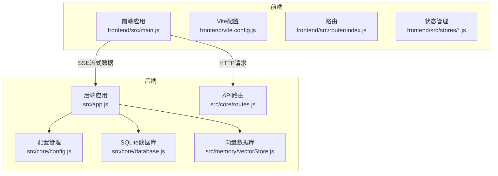
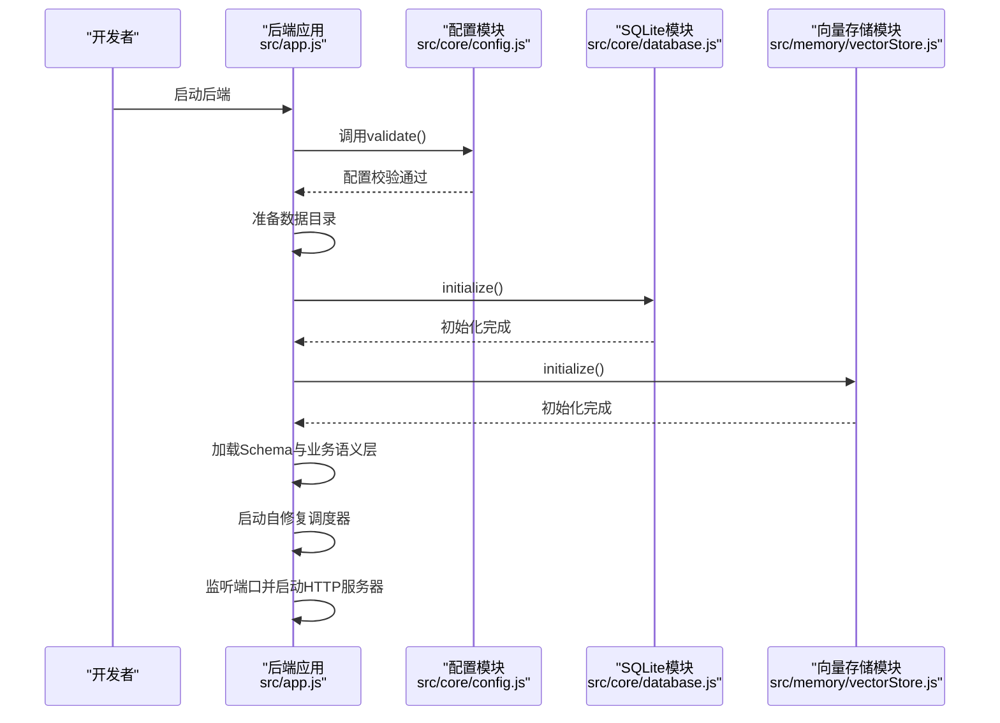
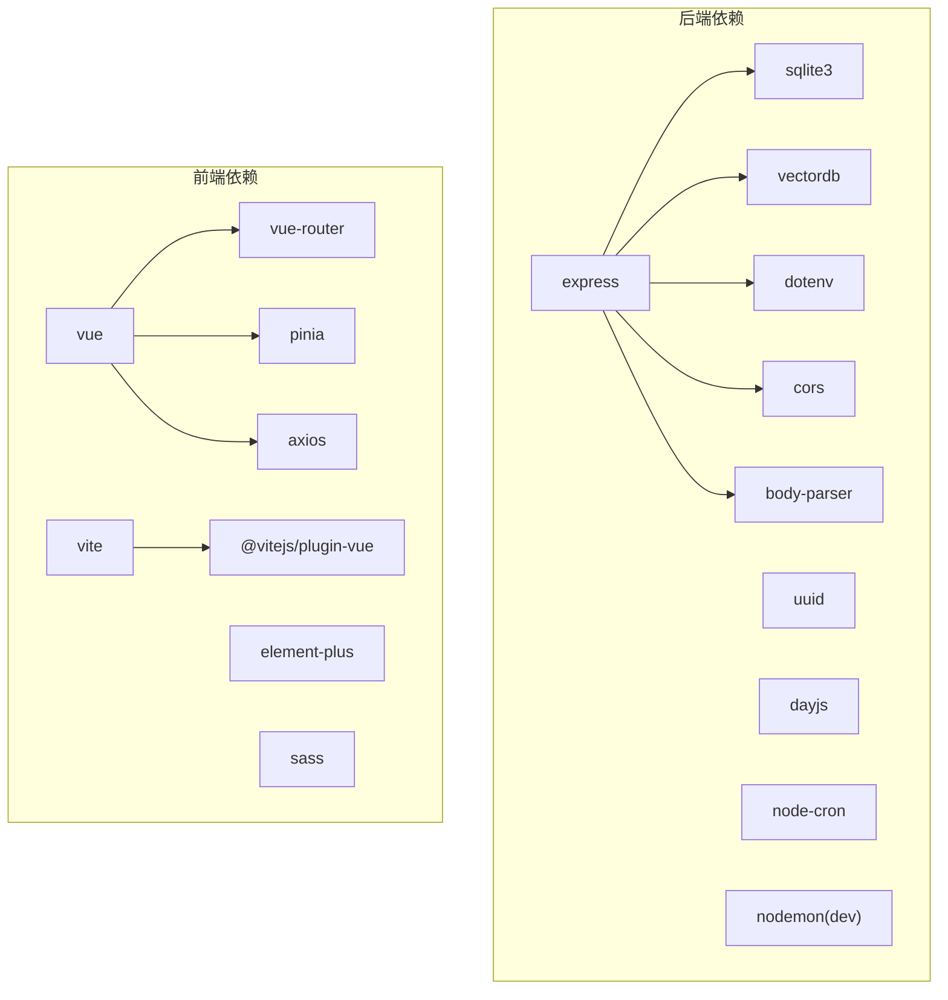

# 开发环境搭建

<cite>
**本文引用的文件**
- [backend/package.json](file://backend/package.json)
- [frontend/package.json](file://frontend/package.json)
- [frontend/vite.config.js](file://frontend/vite.config.js)
- [backend/src/app.js](file://backend/src/app.js)
- [backend/src/core/config.js](file://backend/src/core/config.js)
- [backend/src/core/database.js](file://backend/src/core/database.js)
- [backend/src/memory/vectorStore.js](file://backend/src/memory/vectorStore.js)
- [backend/config/schema-metadata.example.json](file://backend/config/schema-metadata.example.json)
- [backend/config/feature-flags.js](file://backend/config/feature-flags.js)
</cite>

## 目录
1. [简介](#简介)
2. [项目结构](#项目结构)
3. [核心组件](#核心组件)
4. [架构概览](#架构概览)
5. [详细组件分析](#详细组件分析)
6. [依赖分析](#依赖分析)
7. [性能考虑](#性能考虑)
8. [故障排除指南](#故障排除指南)
9. [结论](#结论)
10. [附录](#附录)

## 简介
本指南面向NL2SQL项目的开发者，提供从零开始搭建开发环境的完整步骤。内容涵盖：
- Node.js版本要求（>=18.0.0）与npm包管理器配置
- 前后端依赖安装步骤（后端Express、SQLite3、vectordb；前端Vue3、Element Plus、Vite）
- IDE配置建议（VS Code插件、ESLint、Prettier）
- 环境变量配置方法（.env文件、数据库连接）
- 开发服务器启动方式（后端热重载、前端开发服务器）
- 常见环境问题排查与解决方案

## 项目结构
NL2SQL采用前后端分离架构：
- 后端：基于Node.js + Express，提供REST API与SSE流式接口，集成SQLite与LanceDB向量数据库
- 前端：基于Vue3 + Vite，使用Element Plus构建UI，通过代理访问后端API

图表来源
- [backend/src/app.js:1-266](file://backend/src/app.js#L1-L266)
- [frontend/vite.config.js:1-93](file://frontend/vite.config.js#L1-L93)

章节来源
- [backend/package.json:1-28](file://backend/package.json#L1-L28)
- [frontend/package.json:1-36](file://frontend/package.json#L1-L36)
- [frontend/vite.config.js:1-93](file://frontend/vite.config.js#L1-L93)

## 核心组件
- 后端应用入口负责加载环境变量、初始化数据库与向量库、挂载路由并启动HTTP/SSE服务
- 配置模块集中管理LLM、数据库、安全、日志等配置项，并提供验证
- SQLite模块负责会话与日志等数据的持久化
- 向量存储模块负责LanceDB的初始化与查询向量检索

章节来源
- [backend/src/app.js:1-266](file://backend/src/app.js#L1-L266)
- [backend/src/core/config.js:1-398](file://backend/src/core/config.js#L1-L398)
- [backend/src/core/database.js:1-251](file://backend/src/core/database.js#L1-L251)
- [backend/src/memory/vectorStore.js:238-717](file://backend/src/memory/vectorStore.js#L238-L717)

## 架构概览
后端启动流程包含配置校验、目录准备、数据库与向量库初始化、Schema与业务语义层加载、自修复调度器启动以及HTTP服务器监听。

图表来源
- [backend/src/app.js:97-194](file://backend/src/app.js#L97-L194)
- [backend/src/core/config.js:366-388](file://backend/src/core/config.js#L366-L388)
- [backend/src/core/database.js:206-251](file://backend/src/core/database.js#L206-L251)
- [backend/src/memory/vectorStore.js:238-263](file://backend/src/memory/vectorStore.js#L238-L263)

## 详细组件分析

### 后端环境与依赖
- Node.js版本要求：>=18.0.0
- 主要依赖：Express、SQLite3、vectordb、dotenv、cors、body-parser、uuid、dayjs、node-cron
- 开发依赖：nodemon（热重载）

安装步骤
- 进入后端目录，执行依赖安装命令
- 启动开发服务器脚本使用nodemon监听src/app.js

章节来源
- [backend/package.json:1-28](file://backend/package.json#L1-L28)

### 前端环境与依赖
- Vue3、Element Plus、Vite作为核心依赖
- Vite配置包含开发服务器端口、自动打开浏览器、代理到后端、路径别名、CSS预处理器与构建优化

安装步骤
- 进入前端目录，执行依赖安装命令
- 启动开发服务器脚本使用Vite

章节来源
- [frontend/package.json:1-36](file://frontend/package.json#L1-L36)
- [frontend/vite.config.js:1-93](file://frontend/vite.config.js#L1-L93)

### 数据库与向量库
- SQLite数据库路径由配置决定，默认位于后端data目录
- 向量数据库（LanceDB）路径同样由配置决定，默认位于后端data/vectordb
- 启动时自动创建数据目录并初始化表结构

章节来源
- [backend/src/core/config.js:97-109](file://backend/src/core/config.js#L97-L109)
- [backend/src/core/database.js:206-251](file://backend/src/core/database.js#L206-L251)
- [backend/src/memory/vectorStore.js:238-263](file://backend/src/memory/vectorStore.js#L238-L263)

### 环境变量与配置
- LLM API基础URL、密钥、模型、超时等
- Embedding模型与超时
- SQLite与向量数据库路径
- SR数据源数据库URL与连接池
- 安全配置：允许访问的表白名单、Dry Run、查询行数限制、超时、禁止关键字、敏感字段脱敏
- 日志级别、文件路径、控制台输出
- 自修复机制与Schema缓存策略
- 功能开关（Feature Flags）与Phase控制

章节来源
- [backend/src/core/config.js:1-398](file://backend/src/core/config.js#L1-L398)
- [backend/config/feature-flags.js:1-249](file://backend/config/feature-flags.js#L1-L249)

### 开发服务器启动
- 后端：使用nodemon监听src/app.js，支持热重载
- 前端：Vite开发服务器默认端口5173，自动打开浏览器，代理/api请求至后端3000端口

章节来源
- [backend/package.json:6-8](file://backend/package.json#L6-L8)
- [frontend/vite.config.js:18-35](file://frontend/vite.config.js#L18-L35)

## 依赖分析
后端与前端的依赖关系如下：

图表来源
- [backend/package.json:10-23](file://backend/package.json#L10-L23)
- [frontend/package.json:11-34](file://frontend/package.json#L11-L34)

章节来源
- [backend/package.json:1-28](file://backend/package.json#L1-L28)
- [frontend/package.json:1-36](file://frontend/package.json#L1-L36)

## 性能考虑
- 后端配置中包含日志级别、慢查询阈值、查询超时、最大返回行数等参数，建议结合实际业务场景调整
- 前端Vite构建配置对第三方库进行了手动分块，有助于减少首屏体积与提升缓存效果
- 向量数据库初始化失败不会阻塞应用启动，但会影响语义检索能力

章节来源
- [backend/src/core/config.js:222-231](file://backend/src/core/config.js#L222-L231)
- [frontend/vite.config.js:72-91](file://frontend/vite.config.js#L72-L91)
- [backend/src/memory/vectorStore.js:258-262](file://backend/src/memory/vectorStore.js#L258-L262)

## 故障排除指南
常见问题与解决方案
- Node.js版本过低
  - 现象：安装或启动时报错
  - 处理：升级至>=18.0.0的Node.js版本
  - 参考：后端engines配置
- LLM API密钥或SR数据库URL未配置
  - 现象：启动时报配置错误
  - 处理：在.env中设置LLM_API_KEY与SR_DATABASE_URL
  - 参考：配置校验逻辑
- SQLite数据库初始化失败
  - 现象：数据库连接或建表失败
  - 处理：检查DB_PATH与权限；确认数据目录可写
  - 参考：SQLite初始化流程
- 向量数据库未初始化
  - 现象：语义搜索功能不可用
  - 处理：检查VECTOR_DB_PATH；确认vectordb依赖可用
  - 参考：向量存储初始化
- CORS跨域问题
  - 现象：前端请求后端出现跨域错误
  - 处理：确认后端CORS配置与前端代理设置
  - 参考：后端CORS中间件与Vite代理
- 端口冲突
  - 现象：后端3000或前端5173端口被占用
  - 处理：修改配置中的端口或释放端口占用
  - 参考：后端端口配置与Vite开发服务器端口

章节来源
- [backend/src/core/config.js:366-388](file://backend/src/core/config.js#L366-L388)
- [backend/src/core/database.js:206-251](file://backend/src/core/database.js#L206-L251)
- [backend/src/memory/vectorStore.js:238-263](file://backend/src/memory/vectorStore.js#L238-L263)
- [backend/src/app.js:63-72](file://backend/src/app.js#L63-L72)
- [frontend/vite.config.js:18-35](file://frontend/vite.config.js#L18-L35)

## 结论
按照本指南完成Node.js版本升级、前后端依赖安装、环境变量配置与开发服务器启动后，即可在本地顺利运行NL2SQL项目。遇到问题时，可依据故障排除指南逐项排查，重点关注配置校验、数据库初始化与端口占用等常见问题。

## 附录

### 环境变量清单与用途
- LLM_API_BASE：LLM API基础URL（默认OpenAI格式）
- LLM_API_KEY：LLM API密钥
- LLM_MODEL：默认模型名称
- LLM_TIMEOUT：LLM请求超时（毫秒）
- EMBEDDING_MODEL：Embedding模型名称
- EMBEDDING_TIMEOUT：Embedding请求超时（毫秒）
- DB_PATH：SQLite数据库文件路径
- VECTOR_DB_PATH：向量数据库目录路径
- SR_DATABASE_URL：SR数据源数据库连接URL
- ALLOWED_TABLES：允许查询的表白名单（逗号分隔）
- DRY_RUN：仅生成SQL不执行
- MAX_QUERY_ROWS：单次查询最大返回行数
- QUERY_TIMEOUT：查询超时（毫秒）
- LOG_LEVEL：日志级别
- LOG_FILE：日志文件路径
- SCHEMA_CONFIG_PATH：Schema元数据配置文件路径
- SCHEMA_REVECTORIZE：是否强制重新向量化Schema
- FF_*：功能开关（详见功能开关配置）

章节来源
- [backend/src/core/config.js:60-130](file://backend/src/core/config.js#L60-L130)
- [backend/src/core/config.js:140-170](file://backend/src/core/config.js#L140-L170)
- [backend/src/core/config.js:195-213](file://backend/src/core/config.js#L195-L213)
- [backend/src/core/config.js:240-250](file://backend/src/core/config.js#L240-L250)
- [backend/config/feature-flags.js:16-96](file://backend/config/feature-flags.js#L16-L96)

### 开发环境配置建议
- VS Code插件推荐
  - ESLint：代码规范检查
  - Prettier：代码格式化
  - Vue Language Features：Vue3语法支持
  - Auto Rename Tag：HTML/XML标签自动重命名
  - Path Intellisense：路径自动补全
- ESLint配置要点
  - 使用TypeScript/JavaScript规则集
  - 与Prettier配合，避免格式化冲突
- Prettier配置要点
  - 统一缩进、引号、尾逗号风格
  - 与ESLint规则保持一致

[本节为通用实践建议，不直接分析具体文件，故无章节来源]