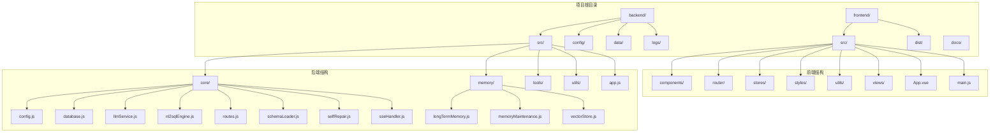
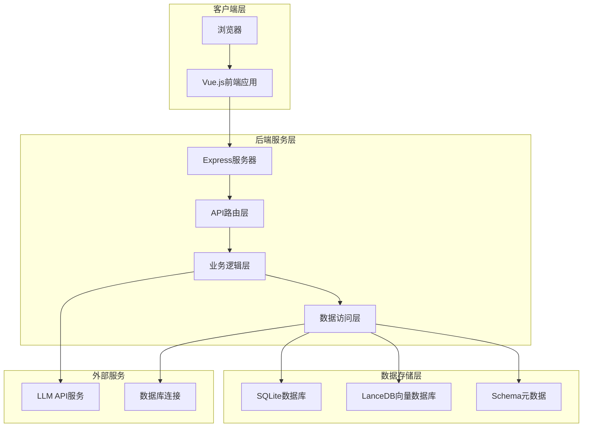
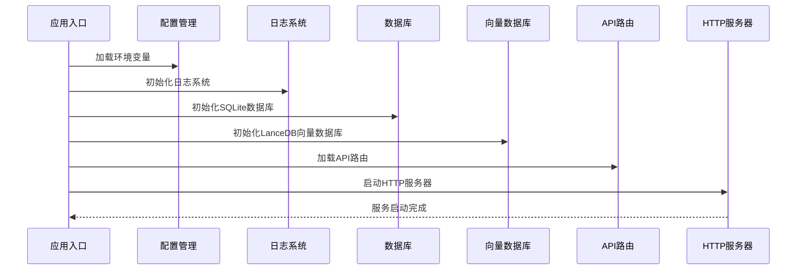
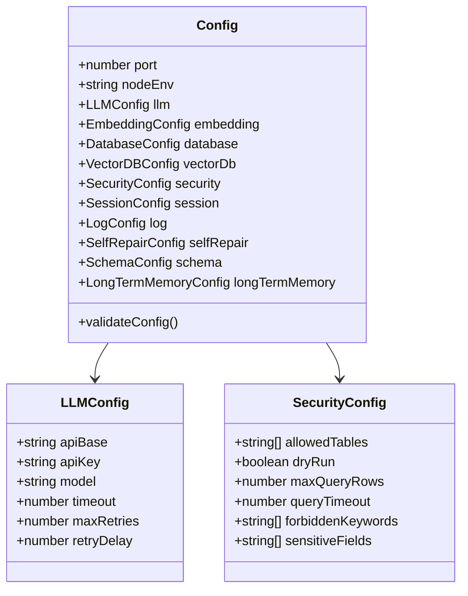
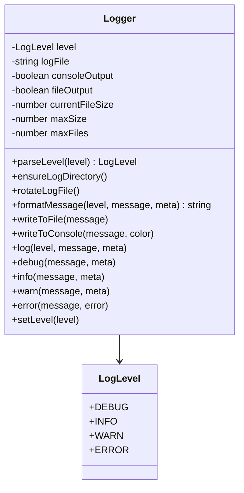
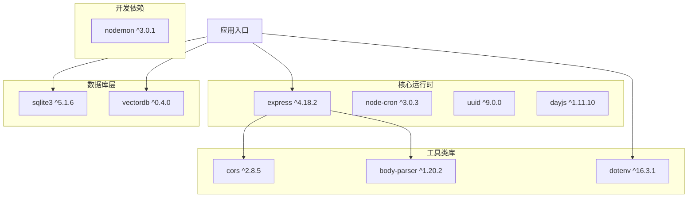

# 开发环境搭建

<cite>
**本文档引用的文件**
- [backend/package.json](file://backend/package.json)
- [frontend/package.json](file://frontend/package.json)
- [backend/src/app.js](file://backend/src/app.js)
- [backend/src/core/config.js](file://backend/src/core/config.js)
- [backend/src/utils/logger.js](file://backend/src/utils/logger.js)
- [frontend/vite.config.js](file://frontend/vite.config.js)
- [backend/config/schema-metadata.example.json](file://backend/config/schema-metadata.example.json)
</cite>

## 目录
1. [简介](#简介)
2. [项目结构](#项目结构)
3. [核心组件](#核心组件)
4. [架构概览](#架构概览)
5. [详细组件分析](#详细组件分析)
6. [依赖分析](#依赖分析)
7. [性能考虑](#性能考虑)
8. [故障排除指南](#故障排除指南)
9. [结论](#结论)
10. [附录](#附录)

## 简介

NL2SQL是一个基于自然语言转SQL技术的数据查询服务项目。该项目采用前后端分离架构，后端使用Node.js + Express提供RESTful API服务，前端使用Vue.js + Element Plus构建用户界面。项目集成了LLM（大语言模型）服务、SQLite数据库和LanceDB向量数据库，支持语义查询和智能数据分析。

## 项目结构

NL2SQL项目采用标准的前后端分离架构，主要包含以下目录结构：



**图表来源**
- [backend/src/app.js:1-238](file://backend/src/app.js#L1-L238)
- [frontend/vite.config.js:1-93](file://frontend/vite.config.js#L1-L93)

**章节来源**
- [backend/src/app.js:1-238](file://backend/src/app.js#L1-L238)
- [frontend/vite.config.js:1-93](file://frontend/vite.config.js#L1-L93)

## 核心组件

### 后端核心组件

后端采用模块化设计，主要包含以下核心组件：

1. **应用入口** - `src/app.js`：应用程序的主入口点，负责初始化所有服务组件
2. **配置管理** - `src/core/config.js`：统一管理所有配置项，支持环境变量配置
3. **日志系统** - `src/utils/logger.js`：提供结构化日志记录功能
4. **数据库层** - `src/core/database.js`：SQLite数据库初始化和连接管理
5. **向量数据库** - `src/memory/vectorStore.js`：LanceDB向量数据库集成
6. **API路由** - `src/core/routes.js`：RESTful API端点定义
7. **LLM服务** - `src/core/llmService.js`：大语言模型服务集成

### 前端核心组件

前端采用Vue 3 Composition API，主要包含：

1. **应用入口** - `src/main.js`：Vue应用初始化
2. **路由配置** - `src/router/index.js`：前端路由管理
3. **状态管理** - `src/stores/`：Pinia状态管理
4. **组件库** - `src/components/`：可复用Vue组件
5. **视图页面** - `src/views/`：页面级组件
6. **工具函数** - `src/utils/`：API调用和工具函数

**章节来源**
- [backend/src/app.js:1-238](file://backend/src/app.js#L1-L238)
- [backend/src/core/config.js:1-332](file://backend/src/core/config.js#L1-L332)
- [frontend/vite.config.js:1-93](file://frontend/vite.config.js#L1-L93)

## 架构概览

NL2SQL采用微服务架构，后端提供RESTful API服务，前端通过Vue.js提供用户界面。系统支持实时通信和语义查询功能。



**图表来源**
- [backend/src/app.js:1-238](file://backend/src/app.js#L1-L238)
- [backend/src/core/config.js:1-332](file://backend/src/core/config.js#L1-L332)

## 详细组件分析

### 应用启动流程

后端应用启动采用异步初始化流程，确保各组件按正确顺序初始化：



**图表来源**
- [backend/src/app.js:97-166](file://backend/src/app.js#L97-L166)

### 配置管理系统

配置系统采用集中式管理模式，支持多种配置类型：



**图表来源**
- [backend/src/core/config.js:16-289](file://backend/src/core/config.js#L16-L289)

### 日志系统架构

日志系统提供多级别、多输出的日志记录功能：



**图表来源**
- [backend/src/utils/logger.js:51-318](file://backend/src/utils/logger.js#L51-L318)

**章节来源**
- [backend/src/app.js:97-166](file://backend/src/app.js#L97-L166)
- [backend/src/core/config.js:1-332](file://backend/src/core/config.js#L1-L332)
- [backend/src/utils/logger.js:1-318](file://backend/src/utils/logger.js#L1-L318)

## 依赖分析

### 后端依赖结构

后端项目采用模块化依赖管理，主要依赖包括：



**图表来源**
- [backend/package.json:10-26](file://backend/package.json#L10-L26)

### 前端依赖结构

前端项目采用现代化的Vue 3生态系统：

```mermaid
graph TB
subgraph "Vue生态系统"
A[vue ^3.3.8]
B[vue-router ^4.2.5]
C[pinia ^2.1.7]
D[@vitejs/plugin-vue ^4.5.2]
end
subgraph "UI组件库"
E[element-plus ^2.4.4]
F[@element-icons-vue ^2.1.0]
end
subgraph "可视化库"
G[echarts ^5.4.3]
H[vue-echarts ^6.6.1]
end
subgraph "Markdown处理"
I[markdown-it ^14.1.1]
J[katex ^0.16.45]
K[mermaid ^11.14.0]
end
subgraph "开发工具"
L[vite ^5.0.8]
M[sass ^1.69.5]
end
N[应用入口] --> A
N --> B
N --> C
N --> E
N --> G
N --> I
```

**图表来源**
- [frontend/package.json:11-34](file://frontend/package.json#L11-L34)

**章节来源**
- [backend/package.json:1-28](file://backend/package.json#L1-L28)
- [frontend/package.json:1-36](file://frontend/package.json#L1-L36)

## 性能考虑

### 后端性能优化

1. **数据库连接池**：配置合理的连接池大小，避免过度连接
2. **查询超时控制**：设置查询超时时间，防止长时间阻塞
3. **内存管理**：合理设置日志文件大小和轮转策略
4. **向量数据库优化**：LanceDB的索引和缓存配置

### 前端性能优化

1. **代码分割**：Vite配置了手动代码分割，将第三方库独立打包
2. **构建优化**：生产环境关闭source map，启用代码压缩
3. **懒加载**：Vue组件支持懒加载，减少初始包大小

## 故障排除指南

### 环境变量配置问题

常见的环境变量配置问题及解决方案：

1. **LLM API密钥缺失**
   - 症状：应用启动时报错缺少LLM API密钥
   - 解决方案：在`.env`文件中设置`LLM_API_KEY`

2. **数据库连接失败**
   - 症状：SQLite数据库初始化失败
   - 解决方案：检查`DB_PATH`配置和文件权限

3. **向量数据库初始化失败**
   - 症状：LanceDB向量数据库无法初始化
   - 解决方案：确认`VECTOR_DB_PATH`目录权限和磁盘空间

### 端口冲突问题

1. **后端端口占用**
   - 默认端口：3000
   - 解决方案：修改`PORT`环境变量或释放端口

2. **前端开发端口占用**
   - 默认端口：5173
   - 解决方案：修改Vite配置或释放端口

### 依赖安装问题

1. **Node.js版本不兼容**
   - 要求：Node.js >= 18.0.0
   - 解决方案：升级Node.js版本

2. **SQLite3编译失败**
   - 原因：系统缺少编译工具
   - 解决方案：安装Python和编译工具链

**章节来源**
- [backend/src/core/config.js:300-322](file://backend/src/core/config.js#L300-L322)
- [backend/src/app.js:160-165](file://backend/src/app.js#L160-L165)

## 结论

NL2SQL项目提供了完整的自然语言转SQL解决方案，具有以下特点：

1. **模块化设计**：清晰的前后端分离架构，便于维护和扩展
2. **配置灵活**：支持丰富的环境变量配置，适应不同部署环境
3. **性能优化**：合理的数据库和缓存策略，保证查询性能
4. **开发友好**：完善的开发工具链和热重载支持

项目适合需要快速搭建智能数据分析平台的团队使用。

## 附录

### 开发环境要求

- **Node.js**: >= 18.0.0
- **包管理器**: npm 或 yarn
- **操作系统**: Windows/Linux/macOS

### 快速启动步骤

1. **克隆项目**
   ```bash
   git clone <repository-url>
   cd NL2SQL
   ```

2. **安装后端依赖**
   ```bash
   cd backend
   npm install
   ```

3. **安装前端依赖**
   ```bash
   cd ../frontend
   npm install
   ```

4. **配置环境变量**
   ```bash
   # 在backend目录创建.env文件
   cp .env.example .env
   # 编辑.env文件，设置必要的配置项
   ```

5. **启动开发服务器**
   ```bash
   # 后端开发服务器
   cd backend
   npm run dev
   
   # 前端开发服务器
   cd ../frontend
   npm run dev
   ```

### 常用命令

- **后端开发**: `npm run dev`
- **后端生产**: `npm start`
- **前端开发**: `npm run dev`
- **前端构建**: `npm run build`
- **前端预览**: `npm run preview`