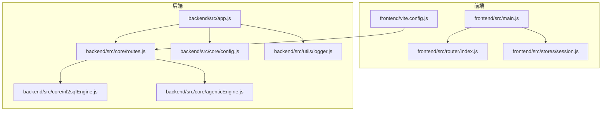
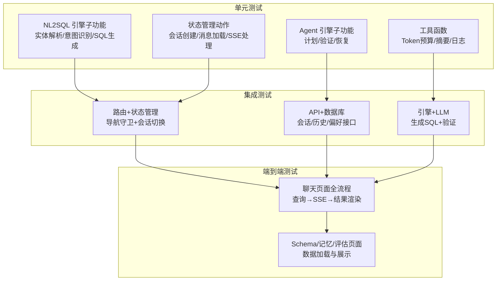
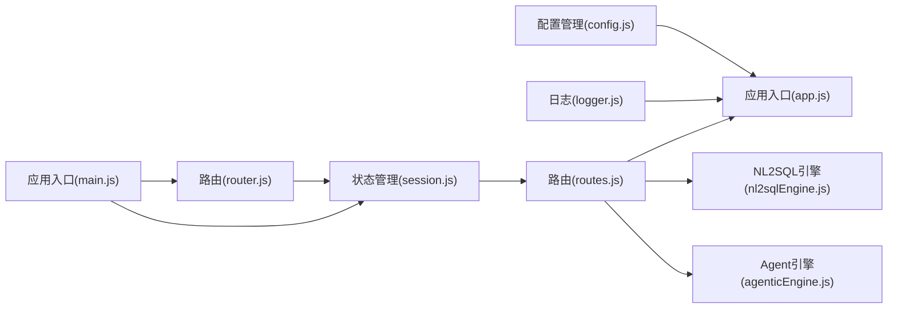

# 测试策略与执行

<cite>
**本文引用的文件**
- [backend/package.json](file://backend/package.json)
- [frontend/package.json](file://frontend/package.json)
- [backend/src/app.js](file://backend/src/app.js)
- [backend/test/context-management.test.js](file://backend/test/context-management.test.js)
- [backend/src/core/nl2sqlEngine.js](file://backend/src/core/nl2sqlEngine.js)
- [backend/src/core/agenticEngine.js](file://backend/src/core/agenticEngine.js)
- [backend/src/core/routes.js](file://backend/src/core/routes.js)
- [backend/src/utils/logger.js](file://backend/src/utils/logger.js)
- [backend/src/core/config.js](file://backend/src/core/config.js)
- [frontend/vite.config.js](file://frontend/vite.config.js)
- [frontend/src/router/index.js](file://frontend/src/router/index.js)
- [frontend/src/stores/session.js](file://frontend/src/stores/session.js)
- [frontend/src/main.js](file://frontend/src/main.js)
</cite>

## 目录
1. [简介](#简介)
2. [项目结构](#项目结构)
3. [核心组件](#核心组件)
4. [架构总览](#架构总览)
5. [详细组件分析](#详细组件分析)
6. [依赖分析](#依赖分析)
7. [性能考虑](#性能考虑)
8. [故障排查指南](#故障排查指南)
9. [结论](#结论)
10. [附录](#附录)

## 简介
本文件为 NL2SQL 项目的测试策略与执行指南，围绕测试金字塔（单元测试、集成测试、端到端测试）设计分层测试方案，覆盖后端 NL2SQL 引擎、Agent 引擎、API 接口、数据库操作，以及前端 Vue 组件、路由与状态管理。文档提供测试框架配置思路（Jest/Mocha）、测试环境设置、Mock 使用、测试数据准备与清理策略、覆盖率要求与 CI/CD 集成建议，并给出调试技巧与常见问题解决方案。

## 项目结构
NL2SQL 采用前后端分离架构：
- 后端基于 Node.js + Express，提供 REST API、SSE 流式输出、Schema 管理、会话与历史管理、评估接口等。
- 前端基于 Vue 3 + Pinia + Vue Router，提供聊天界面、历史查看、Schema 展示、长期记忆管理、评估页面等。

图表来源
- [frontend/src/main.js:1-89](file://frontend/src/main.js#L1-L89)
- [frontend/src/router/index.js:1-157](file://frontend/src/router/index.js#L1-L157)
- [frontend/src/stores/session.js:1-400](file://frontend/src/stores/session.js#L1-L400)
- [frontend/vite.config.js:1-93](file://frontend/vite.config.js#L1-L93)
- [backend/src/app.js:1-266](file://backend/src/app.js#L1-L266)
- [backend/src/core/routes.js:1-800](file://backend/src/core/routes.js#L1-L800)
- [backend/src/core/config.js:1-398](file://backend/src/core/config.js#L1-L398)
- [backend/src/utils/logger.js:1-482](file://backend/src/utils/logger.js#L1-L482)
- [backend/src/core/nl2sqlEngine.js:1-800](file://backend/src/core/nl2sqlEngine.js#L1-L800)
- [backend/src/core/agenticEngine.js:1-651](file://backend/src/core/agenticEngine.js#L1-L651)

章节来源
- [backend/src/app.js:1-266](file://backend/src/app.js#L1-L266)
- [backend/src/core/routes.js:1-800](file://backend/src/core/routes.js#L1-L800)
- [frontend/src/main.js:1-89](file://frontend/src/main.js#L1-L89)
- [frontend/src/router/index.js:1-157](file://frontend/src/router/index.js#L1-L157)
- [frontend/src/stores/session.js:1-400](file://frontend/src/stores/session.js#L1-L400)
- [frontend/vite.config.js:1-93](file://frontend/vite.config.js#L1-L93)

## 核心组件
- 后端核心模块
  - 配置管理：集中读取环境变量并提供默认值，含 LLM、数据库、安全、日志、Schema、长期记忆、上下文管理、评估等配置。
  - 日志工具：统一日志输出、文件轮转、结构化日志、执行流程追踪（trace）。
  - NL2SQL 引擎：意图识别、实体解析、SQL 生成、验证与格式化、澄清与恢复。
  - Agent 引擎：四阶段工作流（Plan→Act→Observe→Recovery），工具循环、动态意图拆解、验证与恢复。
  - 路由与 API：健康检查、Schema 查询、会话管理、查询历史、偏好与长期记忆、评估统计。
- 前端核心模块
  - 路由：页面路径、懒加载、全局守卫、滚动行为。
  - 状态管理：会话列表、当前会话、消息历史、SSE 连接与进度状态。
  - 应用入口：安装插件（路由、状态管理、UI 组件库）、注册全局组件、挂载应用。

章节来源
- [backend/src/core/config.js:1-398](file://backend/src/core/config.js#L1-L398)
- [backend/src/utils/logger.js:1-482](file://backend/src/utils/logger.js#L1-L482)
- [backend/src/core/nl2sqlEngine.js:1-800](file://backend/src/core/nl2sqlEngine.js#L1-L800)
- [backend/src/core/agenticEngine.js:1-651](file://backend/src/core/agenticEngine.js#L1-L651)
- [backend/src/core/routes.js:1-800](file://backend/src/core/routes.js#L1-L800)
- [frontend/src/router/index.js:1-157](file://frontend/src/router/index.js#L1-L157)
- [frontend/src/stores/session.js:1-400](file://frontend/src/stores/session.js#L1-L400)
- [frontend/src/main.js:1-89](file://frontend/src/main.js#L1-L89)

## 架构总览
测试金字塔分层如下：
- 单元测试：针对独立函数/模块（如 NL2SQL 引擎子功能、工具函数、状态管理动作）进行隔离测试。
- 集成测试：针对模块间协作（如路由+状态管理、API+数据库、引擎+LLM）进行测试。
- 端到端测试：模拟真实用户场景（前端发起查询→后端处理→SSE 流式返回→前端渲染）。

图表来源
- [backend/src/core/nl2sqlEngine.js:1-800](file://backend/src/core/nl2sqlEngine.js#L1-L800)
- [backend/src/core/agenticEngine.js:1-651](file://backend/src/core/agenticEngine.js#L1-L651)
- [backend/src/core/routes.js:1-800](file://backend/src/core/routes.js#L1-L800)
- [frontend/src/stores/session.js:1-400](file://frontend/src/stores/session.js#L1-L400)
- [frontend/src/router/index.js:1-157](file://frontend/src/router/index.js#L1-L157)

## 详细组件分析

### 后端测试策略

#### NL2SQL 引擎测试
- 测试目标
  - 实体解析：模糊匹配、歧义处理、长期记忆学习。
  - 意图识别与表推断：关键词映射、向量检索回退、高频表策略。
  - SQL 生成与验证：语法与安全检查、表存在性校验。
  - 澄清与恢复：错误分类、表替换建议、语法修正。
- 测试要点
  - Mock 数据库连接与查询结果，验证解析分支与错误路径。
  - 使用配置开关（如 DRY_RUN、ALLOWED_TABLES）控制行为。
  - 覆盖历史裁剪、摘要缓存、向量元数据增强等上下文管理功能。
- 测试数据
  - 构造用户查询、意图对象、历史消息、实体别名映射。
  - 准备 Schema 元数据与向量索引（可使用内存向量库）。
- 覆盖率
  - 关键函数：实体解析、表推断、SQL 生成、验证、澄清与恢复。
  - 分支覆盖：模糊匹配、歧义处理、回退策略、错误恢复。

章节来源
- [backend/src/core/nl2sqlEngine.js:1-800](file://backend/src/core/nl2sqlEngine.js#L1-L800)
- [backend/src/core/config.js:1-398](file://backend/src/core/config.js#L1-L398)
- [backend/test/context-management.test.js:1-321](file://backend/test/context-management.test.js#L1-L321)

#### Agent 引擎测试
- 测试目标
  - 四阶段工作流：规划、Schema 发现、意图拆解、澄清、生成、验证、恢复。
  - 工具循环与动态意图拆解：根据功能开关启用不同能力。
  - 错误恢复：表不存在、语法错误的自动修复。
- 测试要点
  - 模拟 LLM 响应与 Schema 工具返回，验证流程推进与错误恢复。
  - 验证进度回调与 trace 日志。
- 测试数据
  - 构造查询、计划、分解结果、表候选集、澄清触发条件。

章节来源
- [backend/src/core/agenticEngine.js:1-651](file://backend/src/core/agenticEngine.js#L1-L651)

#### API 接口测试
- 测试目标
  - 健康检查、Schema 查询、会话管理、查询历史、偏好与长期记忆、评估统计。
  - SSE 流式事件：连接、进度、结果、澄清、错误。
- 测试要点
  - 使用 supertest 或 axios 测试 HTTP 接口。
  - 模拟数据库与向量存储，验证鉴权与白名单控制。
  - 验证 CORS、Body Parser、中间件链路。
- 测试数据
  - 会话数据、消息历史、偏好记录、评估统计。

章节来源
- [backend/src/core/routes.js:1-800](file://backend/src/core/routes.js#L1-L800)
- [backend/src/app.js:1-266](file://backend/src/app.js#L1-L266)

#### 数据库操作测试
- 测试目标
  - SQLite 会话与历史表结构初始化、CRUD 操作。
  - SR 数据库连接池与查询限制。
- 测试要点
  - 使用内存数据库或临时文件，隔离测试与清理。
  - 验证超时、行数限制、禁止关键字过滤。
- 测试数据
  - 会话、消息、查询历史、偏好记录。

章节来源
- [backend/src/core/config.js:1-398](file://backend/src/core/config.js#L1-L398)

#### 日志与配置测试
- 测试目标
  - 日志级别、文件轮转、结构化输出、trace 追踪。
  - 配置验证与默认值。
- 测试要点
  - 验证不同日志级别输出、文件大小与轮转。
  - 验证配置缺失时的报错与警告。

章节来源
- [backend/src/utils/logger.js:1-482](file://backend/src/utils/logger.js#L1-L482)
- [backend/src/core/config.js:1-398](file://backend/src/core/config.js#L1-L398)

### 前端测试策略

#### Vue 组件测试
- 测试目标
  - 聊天视图、历史视图、Schema 视图、记忆视图、评估视图。
  - 组件交互、数据渲染、错误状态。
- 测试要点
  - 使用 @vue/test-utils 或 Vitest + Vue Test Utils。
  - Mock API 服务与 SSE，验证消息渲染与状态变化。
- 测试数据
  - 会话消息、Schema 定义、评估统计。

章节来源
- [frontend/src/router/index.js:1-157](file://frontend/src/router/index.js#L1-L157)
- [frontend/src/stores/session.js:1-400](file://frontend/src/stores/session.js#L1-L400)

#### 路由测试
- 测试目标
  - 路由守卫、懒加载、滚动行为、404 页面。
- 测试要点
  - 验证页面标题设置、导航拦截、路由元信息。
- 测试数据
  - 路由配置、元信息、滚动位置。

章节来源
- [frontend/src/router/index.js:1-157](file://frontend/src/router/index.js#L1-L157)

#### 状态管理测试（Pinia）
- 测试目标
  - 会话列表、当前会话、消息历史、SSE 连接与进度。
- 测试要点
  - Mock API 与 EventSource，验证 actions 的异步流程。
  - 验证计算属性与响应式状态更新。
- 测试数据
  - 会话数据、消息数组、SSE 事件数据。

章节来源
- [frontend/src/stores/session.js:1-400](file://frontend/src/stores/session.js#L1-L400)

#### 前端构建与代理测试
- 测试目标
  - Vite 开发服务器、代理配置、路径别名、代码分割。
- 测试要点
  - 验证 /api 代理到后端、端口与自动打开浏览器。
  - 验证构建产物与第三方库分包。

章节来源
- [frontend/vite.config.js:1-93](file://frontend/vite.config.js#L1-L93)

### 测试框架与环境配置

#### Jest 配置思路
- 测试环境
  - Node.js 环境，使用 dotenv 加载 .env 测试文件。
  - 使用 @types/jest 与 ts-jest（如需 TypeScript）。
- 模块模拟
  - 使用 jest.mock 对数据库、LLM 服务、向量存储进行模拟。
  - 对日志模块进行快照或存根。
- 覆盖率
  - 使用 --coverage，配置覆盖率阈值（函数/行/分支/语句）。
- 并行与缓存
  - 使用 --maxWorkers 与 cacheDirectory 提升性能。

#### Mocha + Chai 配置思路
- 测试环境
  - 使用 mocha、chai、sinon、nyc。
  - 使用 @babel/register 或 ts-node（如需 TypeScript）。
- 模块模拟
  - 使用 sinon.stub/mock 替换外部依赖。
- 报告
  - 使用 mochawesome 生成 HTML 报告。

#### 测试数据准备与清理
- Mock 数据
  - 使用 faker 或手写测试数据，覆盖边界与异常场景。
- 测试数据库
  - 使用 SQLite 内存数据库或临时文件，测试结束后删除。
- 向量存储
  - 使用内存向量库或临时目录，测试后清理。
- 清理策略
  - beforeEach/beforeAll 初始化，afterEach/afterAll 清理。
  - 使用 tmpdir 与 unique 名称避免并发冲突。

#### CI/CD 集成
- 触发策略
  - push 到 develop/main 分支触发测试矩阵（Node 版本、操作系统）。
- 步骤建议
  - 安装依赖、启动测试数据库/向量存储、运行测试与覆盖率、上传覆盖率。
- 覆盖率门槛
  - 设定最低覆盖率阈值，失败则阻止合并。

## 依赖分析

图表来源
- [backend/src/core/config.js:1-398](file://backend/src/core/config.js#L1-L398)
- [backend/src/app.js:1-266](file://backend/src/app.js#L1-L266)
- [backend/src/core/routes.js:1-800](file://backend/src/core/routes.js#L1-L800)
- [backend/src/core/nl2sqlEngine.js:1-800](file://backend/src/core/nl2sqlEngine.js#L1-L800)
- [backend/src/core/agenticEngine.js:1-651](file://backend/src/core/agenticEngine.js#L1-L651)
- [frontend/src/stores/session.js:1-400](file://frontend/src/stores/session.js#L1-L400)
- [frontend/src/router/index.js:1-157](file://frontend/src/router/index.js#L1-L157)
- [frontend/src/main.js:1-89](file://frontend/src/main.js#L1-L89)

章节来源
- [backend/src/core/config.js:1-398](file://backend/src/core/config.js#L1-L398)
- [backend/src/app.js:1-266](file://backend/src/app.js#L1-L266)
- [backend/src/core/routes.js:1-800](file://backend/src/core/routes.js#L1-L800)
- [frontend/src/stores/session.js:1-400](file://frontend/src/stores/session.js#L1-L400)
- [frontend/src/router/index.js:1-157](file://frontend/src/router/index.js#L1-L157)
- [frontend/src/main.js:1-89](file://frontend/src/main.js#L1-L89)

## 性能考虑
- 单元测试
  - 使用内存数据库与向量存储，避免磁盘 IO。
  - 对外部服务（LLM、数据库）进行快速模拟。
- 集成测试
  - 控制并发与超时，避免长耗时测试。
  - 使用轻量级 SSE 模拟，聚焦业务逻辑。
- 端到端测试
  - 仅覆盖关键路径，其余使用集成测试替代。
  - 使用 headless 浏览器与并行执行。

## 故障排查指南
- 后端常见问题
  - 配置缺失：LLM API 密钥或 SR 数据库 URL 未设置，启动即报错。
  - 白名单为空：生产环境未配置 ALLOWED_TABLES，存在安全风险。
  - 数据库连接失败：检查 SR 数据库 URL 与连接池配置。
  - SSE 连接异常：检查 /api/sse/stream 路由与会话 ID。
- 前端常见问题
  - 跨域：确认 Vite 代理 /api 到后端地址。
  - 路由守卫：检查 requiresSession 与导航拦截逻辑。
  - 状态未更新：确认 actions 是否正确更新响应式状态。
- 调试技巧
  - 启用 trace 日志，定位引擎处理步骤。
  - 使用断点与日志结合，逐步验证流程。
  - 对外部依赖进行存根，隔离问题范围。

章节来源
- [backend/src/core/config.js:366-398](file://backend/src/core/config.js#L366-L398)
- [backend/src/utils/logger.js:324-482](file://backend/src/utils/logger.js#L324-L482)
- [frontend/vite.config.js:24-35](file://frontend/vite.config.js#L24-L35)

## 结论
本测试策略以测试金字塔为核心，结合 NL2SQL 的引擎能力与前后端职责，形成从单元到端到端的完整测试体系。通过合理的 Mock 与测试数据管理、严格的覆盖率与 CI/CD 集成，能够有效保障系统稳定性与可维护性。

## 附录

### 测试金字塔层级与职责
- 单元测试：函数/模块级验证，快速反馈，高覆盖率。
- 集成测试：模块协作验证，关注接口契约与流程。
- 端到端测试：用户场景验证，关注真实用户体验。

### 测试数据清单
- 用户查询与意图样本
- 历史消息与澄清样本
- Schema 元数据与向量索引
- 会话与消息数据
- 偏好与长期记忆样本
- 评估统计样本

### 覆盖率建议
- 单元测试：函数/行/分支/语句 ≥ 80%
- 集成测试：关键接口与流程 ≥ 90%
- 端到端测试：核心场景 ≥ 70%