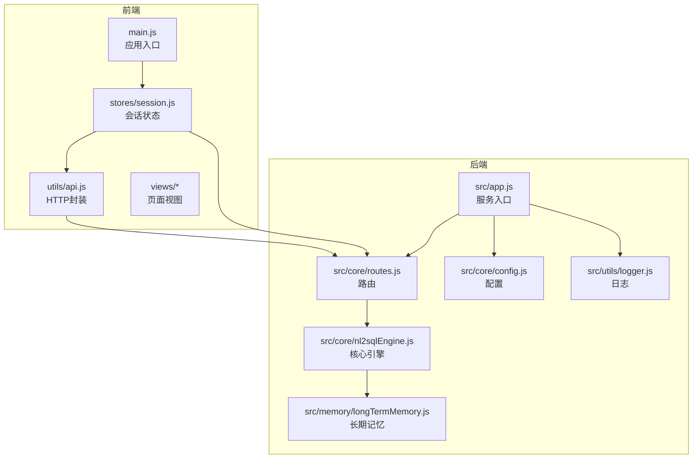
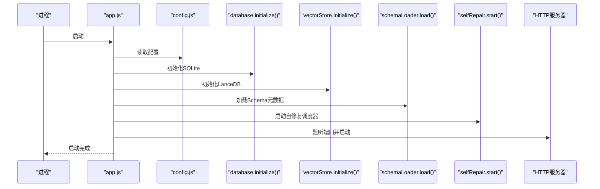
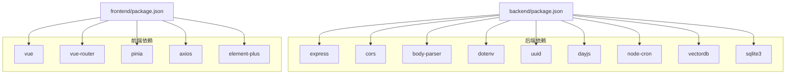

# 调试与测试

<cite>
**本文引用的文件**
- [backend/package.json](file://backend/package.json)
- [frontend/package.json](file://frontend/package.json)
- [backend/src/app.js](file://backend/src/app.js)
- [backend/src/utils/logger.js](file://backend/src/utils/logger.js)
- [backend/src/core/config.js](file://backend/src/core/config.js)
- [backend/src/core/routes.js](file://backend/src/core/routes.js)
- [backend/src/core/nl2sqlEngine.js](file://backend/src/core/nl2sqlEngine.js)
- [backend/src/memory/longTermMemory.js](file://backend/src/memory/longTermMemory.js)
- [frontend/vite.config.js](file://frontend/vite.config.js)
- [frontend/src/main.js](file://frontend/src/main.js)
- [frontend/src/utils/api.js](file://frontend/src/utils/api.js)
- [frontend/src/stores/session.js](file://frontend/src/stores/session.js)
</cite>

## 目录
1. [简介](#简介)
2. [项目结构](#项目结构)
3. [核心组件](#核心组件)
4. [架构总览](#架构总览)
5. [详细组件分析](#详细组件分析)
6. [依赖分析](#依赖分析)
7. [性能考虑](#性能考虑)
8. [故障排查指南](#故障排查指南)
9. [结论](#结论)
10. [附录](#附录)

## 简介
本指南面向NL2SQL项目的开发与测试工作，聚焦于后端Node.js服务与前端Vue应用的调试与测试实践。内容涵盖：
- Node.js调试器使用、断点设置、变量监控
- 前端调试方法（Vue DevTools、浏览器开发者工具、网络请求监控）
- 单元测试与集成测试策略（框架选择、模拟对象、API/数据库/SSE/端到端测试）
- 日志记录与监控配置（结构化日志、错误追踪、性能监控）
- 测试数据准备与测试环境配置
- 常见Bug定位方法与性能分析工具使用

## 项目结构
NL2SQL采用前后端分离架构：
- 后端：基于Express的REST服务，提供健康检查、Schema查询、会话管理、查询历史、统计信息、配置等接口；内置SSE流式输出；统一日志与配置管理。
- 前端：基于Vue 3 + Pinia + Vue Router + Element Plus，通过Axios封装API调用，使用EventSource进行SSE实时交互。

图表来源
- [frontend/src/main.js:1-89](file://frontend/src/main.js#L1-L89)
- [frontend/src/stores/session.js:1-398](file://frontend/src/stores/session.js#L1-L398)
- [frontend/src/utils/api.js:1-252](file://frontend/src/utils/api.js#L1-L252)
- [backend/src/app.js:1-238](file://backend/src/app.js#L1-L238)
- [backend/src/core/routes.js:1-800](file://backend/src/core/routes.js#L1-L800)
- [backend/src/core/config.js:1-332](file://backend/src/core/config.js#L1-L332)
- [backend/src/utils/logger.js:1-318](file://backend/src/utils/logger.js#L1-L318)
- [backend/src/core/nl2sqlEngine.js:1-800](file://backend/src/core/nl2sqlEngine.js#L1-L800)
- [backend/src/memory/longTermMemory.js:1-800](file://backend/src/memory/longTermMemory.js#L1-L800)

章节来源
- [backend/src/app.js:1-238](file://backend/src/app.js#L1-L238)
- [frontend/src/main.js:1-89](file://frontend/src/main.js#L1-L89)
- [frontend/vite.config.js:1-93](file://frontend/vite.config.js#L1-L93)

## 核心组件
- 服务入口与生命周期：后端通过入口文件初始化配置、数据库、向量库、Schema加载与自修复调度器，随后启动HTTP服务器与SSE端点。
- 路由与中间件：统一请求日志中间件、健康检查、Schema查询、会话管理、查询历史、统计信息、配置导出等REST接口。
- 日志系统：统一Logger类，支持控制台/文件输出、日志轮转、结构化消息与事件发布。
- 配置中心：集中管理端口、LLM/Embedding、数据库、安全策略、会话、日志、自修复、Schema、长期记忆等配置。
- 前端入口与状态：Vue应用入口安装路由、状态管理与UI库；会话Store封装SSE连接与消息处理；API模块封装Axios并统一错误处理。
- 引擎与记忆：NL2SQL核心引擎负责意图识别、实体解析、澄清机制、SQL生成与验证；长期记忆模块负责偏好抽取与存储。

章节来源
- [backend/src/app.js:97-166](file://backend/src/app.js#L97-L166)
- [backend/src/core/routes.js:44-52](file://backend/src/core/routes.js#L44-L52)
- [backend/src/utils/logger.js:51-317](file://backend/src/utils/logger.js#L51-L317)
- [backend/src/core/config.js:16-332](file://backend/src/core/config.js#L16-L332)
- [frontend/src/main.js:55-89](file://frontend/src/main.js#L55-L89)
- [frontend/src/stores/session.js:33-398](file://frontend/src/stores/session.js#L33-L398)
- [frontend/src/utils/api.js:25-88](file://frontend/src/utils/api.js#L25-L88)
- [backend/src/core/nl2sqlEngine.js:493-776](file://backend/src/core/nl2sqlEngine.js#L493-L776)
- [backend/src/memory/longTermMemory.js:311-484](file://backend/src/memory/longTermMemory.js#L311-L484)

## 架构总览
后端服务启动流程与关键组件交互如下：

图表来源
- [backend/src/app.js:97-166](file://backend/src/app.js#L97-L166)
- [backend/src/core/config.js:16-332](file://backend/src/core/config.js#L16-L332)

章节来源
- [backend/src/app.js:97-166](file://backend/src/app.js#L97-L166)

## 详细组件分析

### 后端调试与测试要点
- Node.js调试器与断点
  - 使用脚本启动：后端提供开发脚本，可配合Node.js调试器在IDE中设置断点。
  - 关键断点位置：服务初始化、路由处理、核心引擎意图识别、SSE事件处理、错误捕获与优雅关闭。
  - 变量监控：关注配置对象、会话ID、消息历史、SSE连接状态、数据库连接与向量库状态。
- 日志与监控
  - 使用统一Logger记录请求、错误、性能与调试信息；结合日志级别与文件轮转策略。
  - 健康检查接口可用于快速验证服务状态与组件可用性。
- 配置与安全
  - 通过环境变量控制端口、LLM/Embedding、数据库、白名单、限流与超时等；生产环境需严格配置白名单与超时限制。
- SSE与流式输出
  - 前端通过EventSource订阅SSE流，后端在路由中处理SSE连接与消息推送；调试时可观察连接状态与消息类型。

章节来源
- [backend/package.json:6-8](file://backend/package.json#L6-L8)
- [backend/src/app.js:214-230](file://backend/src/app.js#L214-L230)
- [backend/src/utils/logger.js:227-293](file://backend/src/utils/logger.js#L227-L293)
- [backend/src/core/routes.js:44-52](file://backend/src/core/routes.js#L44-L52)
- [backend/src/core/config.js:16-332](file://backend/src/core/config.js#L16-L332)

### 前端调试与测试要点
- Vue DevTools
  - 使用组件树、状态面板、事件面板定位组件状态与消息流转；关注会话Store中的消息列表、处理状态与SSE连接状态。
- 浏览器开发者工具
  - Network面板监控API请求与SSE连接；Console面板查看错误与日志；Sources面板设置断点调试。
- Axios封装与错误处理
  - API模块统一拦截请求与响应，便于在调试时快速定位错误原因（网络错误、服务器错误、请求配置错误）。
- 路由与状态
  - 路由切换与状态变更可通过Vue DevTools观察；SSE消息到达后Store自动更新消息列表。

章节来源
- [frontend/src/main.js:55-89](file://frontend/src/main.js#L55-L89)
- [frontend/src/stores/session.js:185-293](file://frontend/src/stores/session.js#L185-L293)
- [frontend/src/utils/api.js:44-88](file://frontend/src/utils/api.js#L44-L88)
- [frontend/vite.config.js:18-35](file://frontend/vite.config.js#L18-L35)

### 单元测试与集成测试策略
- 测试框架选择
  - 后端：可选用Jest或Mocha + Sinon进行单元测试与模拟；对核心模块（如意图识别、实体解析、偏好存储）进行隔离测试。
  - 前端：可选用Vitest或Jest + Vue Test Utils进行组件与Store测试。
- 模拟对象与桩件
  - 对LLM服务、数据库、向量库、SSE进行Mock，确保测试可重复且不依赖外部服务。
- API测试
  - 使用Supertest或类似工具对路由层进行测试，覆盖健康检查、Schema查询、会话管理、查询历史、统计信息与配置接口。
- 数据库测试
  - 使用内存数据库或测试专用SQLite文件，确保测试前后数据隔离与清理。
- SSE与端到端测试
  - 使用EventSource与真实HTTP服务进行端到端测试，验证从查询提交到SSE消息推送的完整链路。
- 测试数据准备
  - 准备Schema元数据、会话与消息样本、用户偏好样本与查询历史样本；确保测试覆盖边界场景（空输入、超时、错误返回）。

章节来源
- [backend/src/core/routes.js:70-135](file://backend/src/core/routes.js#L70-L135)
- [backend/src/core/nl2sqlEngine.js:493-776](file://backend/src/core/nl2sqlEngine.js#L493-L776)
- [backend/src/memory/longTermMemory.js:311-484](file://backend/src/memory/longTermMemory.js#L311-L484)
- [frontend/src/stores/session.js:299-328](file://frontend/src/stores/session.js#L299-L328)

### 日志记录与监控配置
- 结构化日志
  - Logger支持结构化消息格式，便于日志聚合与检索；可扩展事件监听器以接入外部监控系统。
- 错误追踪
  - 未处理异常与Promise拒绝均被捕获并记录；结合健康检查接口与SSE连接状态进行错误定位。
- 性能监控
  - 健康接口提供内存与运行时信息；可结合外部APM工具采集关键指标（请求耗时、错误率、SSE连接数）。

章节来源
- [backend/src/utils/logger.js:227-293](file://backend/src/utils/logger.js#L227-L293)
- [backend/src/core/routes.js:70-135](file://backend/src/core/routes.js#L70-L135)
- [backend/src/app.js:221-230](file://backend/src/app.js#L221-L230)

### 测试数据准备与测试环境配置
- 环境变量
  - 后端通过dotenv加载.env文件；前端通过Vite配置代理到后端服务。
- Schema与向量库
  - 准备Schema元数据文件与向量数据库目录，确保测试时可加载与检索。
- 会话与偏好
  - 准备会话与消息样本，以及用户偏好样本，覆盖字段别名、查询模式与指标/维度偏好。
- 数据库
  - 使用测试专用数据库文件，确保测试隔离与可重复性。

章节来源
- [backend/src/app.js:16-16](file://backend/src/app.js#L16-L16)
- [frontend/vite.config.js:24-34](file://frontend/vite.config.js#L24-L34)
- [backend/src/core/config.js:235-245](file://backend/src/core/config.js#L235-L245)

### 常见Bug定位方法与性能分析
- 常见问题
  - CORS跨域：确认后端CORS配置与前端代理设置。
  - SSE连接失败：检查会话ID、SSE端点与连接状态。
  - LLM/Embedding超时：调整超时配置与重试策略。
  - 白名单与安全限制：核对allowedTables与禁止关键字列表。
- 性能分析
  - 使用Node.js内置性能分析工具或Chrome DevTools Profile分析前端渲染与事件处理瓶颈。
  - 结合日志与健康接口观察内存占用与慢查询阈值。

章节来源
- [backend/src/app.js:63-72](file://backend/src/app.js#L63-L72)
- [frontend/vite.config.js:24-34](file://frontend/vite.config.js#L24-L34)
- [backend/src/core/config.js:140-170](file://backend/src/core/config.js#L140-L170)
- [backend/src/core/config.js:217-226](file://backend/src/core/config.js#L217-L226)

## 依赖分析
后端与前端的关键依赖与关系如下：

图表来源
- [backend/package.json:10-26](file://backend/package.json#L10-L26)
- [frontend/package.json:11-29](file://frontend/package.json#L11-L29)

章节来源
- [backend/package.json:10-26](file://backend/package.json#L10-L26)
- [frontend/package.json:11-29](file://frontend/package.json#L11-L29)

## 性能考虑
- 后端
  - 合理设置请求体大小限制、超时与重试；对慢查询进行阈值监控与日志记录。
  - 使用连接池管理数据库连接，避免阻塞与资源泄漏。
- 前端
  - 避免不必要的组件重渲染，合理使用computed与watch；SSE连接应具备重连与错误恢复机制。
- 监控
  - 结合健康接口与日志系统，持续观察内存、连接数与执行时间指标。

## 故障排查指南
- 启动失败
  - 检查环境变量与配置文件；查看日志文件与控制台输出；确认端口占用与依赖安装。
- API异常
  - 使用健康检查接口与详细健康接口定位组件状态；核对请求参数与响应格式。
- SSE问题
  - 确认会话ID有效、SSE端点可达、EventSource连接状态；检查后端SSE处理器与消息类型。
- 数据库/向量库
  - 检查初始化流程与目录权限；核对Schema加载与向量库重建策略。
- 前端交互
  - 使用Vue DevTools与浏览器开发者工具定位状态与网络问题；检查API拦截器与错误处理分支。

章节来源
- [backend/src/app.js:160-165](file://backend/src/app.js#L160-L165)
- [backend/src/core/routes.js:98-135](file://backend/src/core/routes.js#L98-L135)
- [frontend/src/stores/session.js:185-221](file://frontend/src/stores/session.js#L185-L221)
- [frontend/src/utils/api.js:72-88](file://frontend/src/utils/api.js#L72-L88)

## 结论
本指南围绕NL2SQL项目的调试与测试提供了系统性的方法论与实操建议。通过合理的日志与监控、完善的单元与集成测试、清晰的断点与变量监控策略，能够显著提升开发效率与系统稳定性。建议在开发与测试环境中严格执行配置校验与数据隔离，确保问题可定位、可复现、可修复。

## 附录
- 开发与测试命令
  - 后端：开发模式启动、生产模式启动
  - 前端：开发服务器、构建与预览
- 环境变量清单
  - 端口、LLM/Embedding、数据库、安全策略、日志、Schema与长期记忆相关配置
- 健康检查与SSE端点
  - 健康检查接口与SSE流式输出端点

章节来源
- [backend/package.json:6-8](file://backend/package.json#L6-L8)
- [frontend/package.json:6-10](file://frontend/package.json#L6-L10)
- [backend/src/core/routes.js:70-92](file://backend/src/core/routes.js#L70-L92)
- [backend/src/core/routes.js:186-213](file://backend/src/core/routes.js#L186-L213)
- [backend/src/app.js:148-158](file://backend/src/app.js#L148-L158)