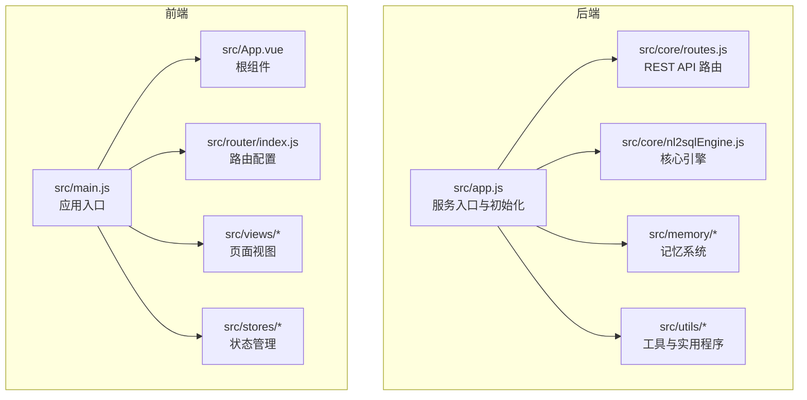
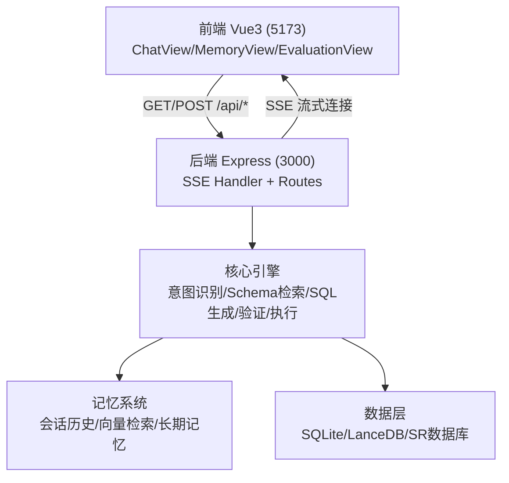
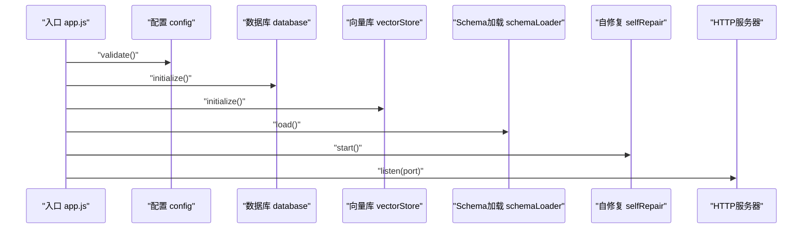
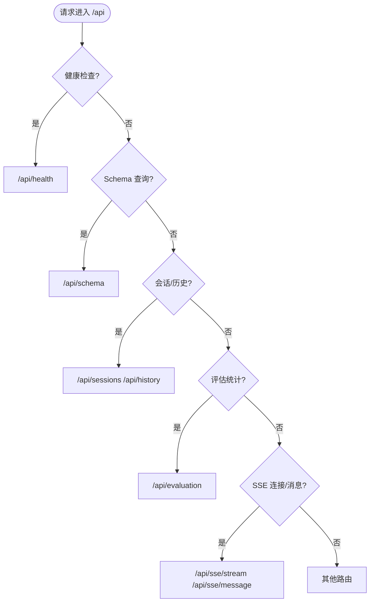
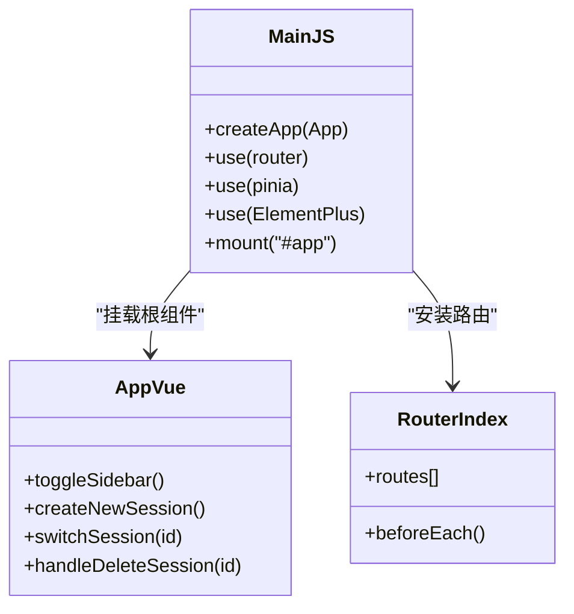
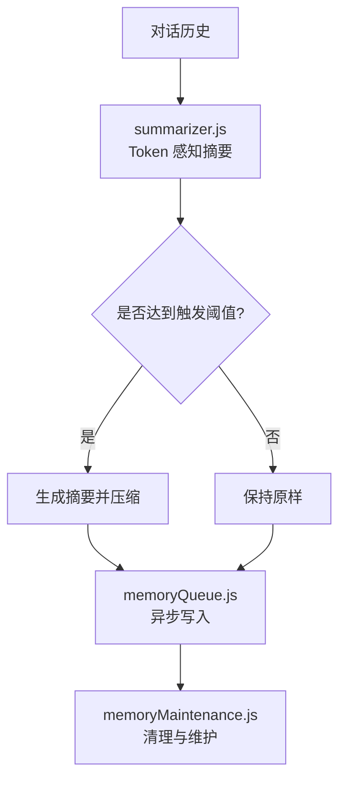
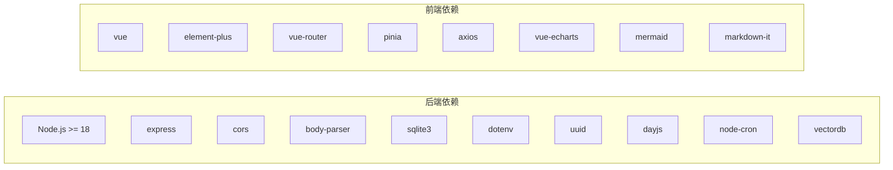

# 贡献指南

<cite>
**本文引用的文件**
- [backend/package.json](file://backend/package.json)
- [frontend/package.json](file://frontend/package.json)
- [CLAUDE.md](file://CLAUDE.md)
- [docs/NL2SQL-进度追踪.md](file://docs/NL2SQL-进度追踪.md)
- [docs/后端架构审查与优化方案.md](file://docs/后端架构审查与优化方案.md)
- [docs/记忆系统优化计划.md](file://docs/记忆系统优化计划.md)
- [backend/src/app.js](file://backend/src/app.js)
- [backend/src/core/routes.js](file://backend/src/core/routes.js)
- [frontend/src/main.js](file://frontend/src/main.js)
- [frontend/src/App.vue](file://frontend/src/App.vue)
- [frontend/src/router/index.js](file://frontend/src/router/index.js)
</cite>

## 目录
1. [简介](#简介)
2. [项目结构](#项目结构)
3. [核心组件](#核心组件)
4. [架构总览](#架构总览)
5. [详细组件分析](#详细组件分析)
6. [依赖分析](#依赖分析)
7. [性能考量](#性能考量)
8. [故障排查指南](#故障排查指南)
9. [结论](#结论)
10. [附录](#附录)

## 简介
本指南面向希望参与 NL2SQL 项目的贡献者，提供从 Fork 仓库、创建分支、提交代码到 PR 审查与测试验证的完整流程；同时涵盖 Issue 提交规范、PR 规范、社区行为准则、新贡献者入门指导以及文档贡献方式。NL2SQL 是一个自然语言转 SQL 的数据查询服务，采用前后端分离架构：后端基于 Node.js + Express，前端基于 Vue3 + Element Plus，结合 LanceDB 向量存储与 SQLite 存储，支持流式 SSE 交互与多阶段智能工作流。

## 项目结构
项目采用前后端分离的 monorepo 结构，根目录包含后端、前端、文档与配置文件。后端核心模块包括核心引擎、记忆系统、工具与实用程序；前端包含路由、状态管理、视图组件与工具模块。

**图表来源**
- [backend/src/app.js:1-266](file://backend/src/app.js#L1-L266)
- [backend/src/core/routes.js:1-200](file://backend/src/core/routes.js#L1-L200)
- [frontend/src/main.js:1-89](file://frontend/src/main.js#L1-L89)
- [frontend/src/App.vue:1-384](file://frontend/src/App.vue#L1-L384)
- [frontend/src/router/index.js:1-157](file://frontend/src/router/index.js#L1-L157)

**章节来源**
- [CLAUDE.md:41-58](file://CLAUDE.md#L41-L58)
- [backend/package.json:1-28](file://backend/package.json#L1-L28)
- [frontend/package.json:1-36](file://frontend/package.json#L1-L36)

## 核心组件
- 后端服务入口与初始化：负责加载环境变量、初始化数据库与向量库、加载 Schema、启动自修复调度器与 HTTP 服务器。
- REST API 路由：提供健康检查、Schema 查询、会话管理、历史查询、评估统计、SSE 流式接口等。
- 核心引擎：实现意图识别、Schema 检索、SQL 生成、验证、执行与格式化，支持功能开关控制的多阶段工作流。
- 记忆系统：三层记忆（会话历史、向量检索、长期记忆），支持异步写入队列、摘要与维护任务。
- 前端应用：基于 Vue3 + Element Plus，提供聊天界面、Schema 查看、历史与评估页面，支持路由与状态管理。

**章节来源**
- [backend/src/app.js:97-194](file://backend/src/app.js#L97-L194)
- [backend/src/core/routes.js:57-186](file://backend/src/core/routes.js#L57-L186)
- [CLAUDE.md:60-96](file://CLAUDE.md#L60-L96)
- [docs/记忆系统优化计划.md:1-226](file://docs/记忆系统优化计划.md#L1-L226)
- [frontend/src/App.vue:1-384](file://frontend/src/App.vue#L1-L384)
- [frontend/src/router/index.js:34-109](file://frontend/src/router/index.js#L34-L109)

## 架构总览
NL2SQL 采用“前端 Vue3 + 后端 Express + SSE 流式通信”的架构。前端通过 Vite 代理将 /api 请求转发至后端本地服务，后端通过 SSE Handler 管理长连接，核心引擎根据功能开关选择传统流程或四阶段 Agentic 工作流，结合向量检索与业务语义层进行 SQL 生成与执行。

**图表来源**
- [CLAUDE.md:41-58](file://CLAUDE.md#L41-L58)
- [CLAUDE.md:141-153](file://CLAUDE.md#L141-L153)
- [frontend/src/router/index.js:21-109](file://frontend/src/router/index.js#L21-L109)

## 详细组件分析

### 后端服务入口与初始化
- 加载环境变量与依赖模块，启用 CORS 与 body-parser。
- 初始化 SQLite 数据库、LanceDB 向量库、Schema 元数据加载、业务语义层加载、功能开关打印。
- 启动自修复调度器与 HTTP 服务器，监听优雅关闭事件。

**图表来源**
- [backend/src/app.js:97-194](file://backend/src/app.js#L97-L194)

**章节来源**
- [backend/src/app.js:1-266](file://backend/src/app.js#L1-L266)

### REST API 路由
- 健康检查接口：提供基础与详细健康状态，包含数据库、LLM、Schema、SSE 连接状态。
- Schema 接口：支持按类型筛选返回表、指标、维度或完整 Schema。
- 会话与历史：提供会话管理、查询历史查询与删除。
- 评估统计：提供系统评估与统计数据接口。
- SSE 接口：建立长连接与发送消息。

**图表来源**
- [backend/src/core/routes.js:57-186](file://backend/src/core/routes.js#L57-L186)

**章节来源**
- [backend/src/core/routes.js:1-200](file://backend/src/core/routes.js#L1-L200)

### 前端应用与路由
- 应用入口：创建 Vue 应用，安装路由、状态管理与 UI 组件库，注册全局图标。
- 根组件：侧边栏包含会话列表、导航与工具栏，主内容区渲染路由视图。
- 路由配置：定义首页、聊天、历史、Schema、记忆、评估与 404 页面，设置页面标题与滚动行为。

**图表来源**
- [frontend/src/main.js:1-89](file://frontend/src/main.js#L1-L89)
- [frontend/src/App.vue:85-241](file://frontend/src/App.vue#L85-L241)
- [frontend/src/router/index.js:1-157](file://frontend/src/router/index.js#L1-L157)

**章节来源**
- [frontend/src/main.js:1-89](file://frontend/src/main.js#L1-L89)
- [frontend/src/App.vue:1-384](file://frontend/src/App.vue#L1-L384)
- [frontend/src/router/index.js:1-157](file://frontend/src/router/index.js#L1-L157)

### 记忆系统与优化计划
- Token 感知摘要触发：基于轮数与 Token 数量动态决定是否触发摘要，避免上下文爆炸。
- 置顶记忆保护：扩展表结构支持置顶与优先级，清理时跳过置顶记忆。
- 异步记忆存储队列：将存储操作异步化，避免阻塞主流程。
- Schema 增量更新：通过内容哈希与软删除实现增量更新，减少系统抖动。

**图表来源**
- [docs/记忆系统优化计划.md:19-46](file://docs/记忆系统优化计划.md#L19-L46)
- [docs/记忆系统优化计划.md:49-81](file://docs/记忆系统优化计划.md#L49-L81)
- [docs/记忆系统优化计划.md:84-130](file://docs/记忆系统优化计划.md#L84-L130)
- [docs/记忆系统优化计划.md:133-198](file://docs/记忆系统优化计划.md#L133-L198)

**章节来源**
- [docs/记忆系统优化计划.md:1-226](file://docs/记忆系统优化计划.md#L1-L226)

## 依赖分析
- 后端依赖：Express、CORS、Body Parser、SQLite3、dotenv、uuid、dayjs、node-cron、vectordb。
- 前端依赖：Vue3、Element Plus、Vue Router、Pinia、Axios、ECharts、Mermaid、Markdown-it 等。
- 开发工具：Vite、Sass、@vitejs/plugin-vue、nodemon。

**图表来源**
- [backend/package.json:10-26](file://backend/package.json#L10-L26)
- [frontend/package.json:11-34](file://frontend/package.json#L11-L34)

**章节来源**
- [backend/package.json:1-28](file://backend/package.json#L1-L28)
- [frontend/package.json:1-36](file://frontend/package.json#L1-L36)

## 性能考量
- Token 预算与摘要：根据中文 Token 估算策略与对话轮数动态触发摘要，避免上下文窗口溢出。
- 向量检索优化：通过分层加权与动态游戏名索引提升检索精度，减少无关表干扰。
- 异步写入与队列：将记忆存储异步化，避免阻塞主流程。
- 增量更新：Schema 增量更新减少不必要的 Embedding 调用与系统抖动。

**章节来源**
- [docs/后端架构审查与优化方案.md:162-174](file://docs/后端架构审查与优化方案.md#L162-L174)
- [docs/后端架构审查与优化方案.md:493-524](file://docs/后端架构审查与优化方案.md#L493-L524)
- [docs/记忆系统优化计划.md:19-46](file://docs/记忆系统优化计划.md#L19-L46)
- [docs/记忆系统优化计划.md:133-198](file://docs/记忆系统优化计划.md#L133-L198)

## 故障排查指南
- 启动失败：检查配置校验是否通过，确认 .env 文件与必要环境变量是否正确设置。
- CORS 与跨域：前端通过 Vite 代理转发 /api 请求，无需手动配置跨域。
- SSE 连接：确认 /api/sse/stream 建立成功，消息通过 /api/sse/message 发送。
- 记忆清理：检查 memoryMaintenance 的清理逻辑与 TTL 配置，避免误删置顶记忆。
- 自修复任务：确认 node-cron 定时任务正常运行，执行健康检查与维护。

**章节来源**
- [CLAUDE.md:25-40](file://CLAUDE.md#L25-L40)
- [CLAUDE.md:133-153](file://CLAUDE.md#L133-L153)
- [backend/src/app.js:103-108](file://backend/src/app.js#L103-L108)
- [docs/记忆系统优化计划.md:64-81](file://docs/记忆系统优化计划.md#L64-L81)

## 结论
NL2SQL 项目具备清晰的前后端分离架构与完善的模块划分。贡献者可通过本文提供的流程与规范高效参与开发，从环境搭建、功能实现到文档完善与测试验证形成闭环。建议优先关注记忆系统优化、向量检索精度与 Token 预算策略，以提升系统稳定性与用户体验。

## 附录

### 一、贡献流程（Fork 与 PR）
- Fork 仓库：在 GitHub 上 Fork 项目到个人账户。
- 克隆仓库：克隆到本地，创建并切换到新分支（建议使用 feature/或fix/前缀）。
- 开发与测试：按照开发环境搭建与测试验证要求进行本地开发与测试。
- 提交与推送：将更改提交到远程分支。
- 创建 PR：在 GitHub 上发起 Pull Request，填写 PR 描述与关联 Issue。
- 代码审查：根据审查意见进行修改，直至通过。

**章节来源**
- [CLAUDE.md:9-23](file://CLAUDE.md#L9-L23)

### 二、Issue 提交规范
- Bug 报告：包含重现步骤、期望结果、实际结果、环境信息（Node 版本、操作系统、浏览器版本）。
- 功能请求：描述背景、目标、可行性分析、影响范围与验收标准。
- 问题标签：使用合适的标签（bug、enhancement、help wanted、good first issue 等）便于分类与跟踪。

**章节来源**
- [docs/NL2SQL-进度追踪.md:1-265](file://docs/NL2SQL-进度追踪.md#L1-L265)

### 三、Pull Request 规范
- 提交信息格式：采用清晰的标题与描述，说明变更目的、影响范围与测试结果。
- 代码审查要求：至少一名维护者审查，确保代码风格、安全性与性能符合要求。
- 测试验证标准：新增或修改功能需提供单元测试或端到端测试，确保回归不破坏。

**章节来源**
- [docs/后端架构审查与优化方案.md:242-248](file://docs/后端架构审查与优化方案.md#L242-L248)

### 四、社区行为准则
- 沟通礼仪：尊重他人，使用礼貌用语，避免人身攻击。
- 冲突解决：通过讨论协商解决分歧，必要时寻求维护者仲裁。
- 贡献者认可：贡献者将被记录在贡献者列表中，重大贡献可获得特别致谢。

**章节来源**
- [docs/NL2SQL-进度追踪.md:260-265](file://docs/NL2SQL-进度追踪.md#L260-L265)

### 五、新贡献者入门指导
- 项目架构理解：阅读 CLAUDE.md 与文档，了解后端核心模块、前端结构与数据流。
- 开发环境搭建：安装 Node.js（>=18）、Python（用于向量库）、配置 .env 文件与数据库。
- 第一个 PR 建议：从文档完善、小 bug 修复或 UI 微调入手，逐步熟悉代码库。

**章节来源**
- [CLAUDE.md:27-40](file://CLAUDE.md#L27-L40)
- [CLAUDE.md:41-58](file://CLAUDE.md#L41-L58)

### 六、文档贡献方式
- README 更新：补充安装说明、运行步骤与常见问题。
- API 文档完善：补充后端 API 端点说明、参数与返回值。
- 示例代码补充：提供前端调用示例与后端集成示例，便于开发者快速上手。

**章节来源**
- [CLAUDE.md:141-153](file://CLAUDE.md#L141-L153)