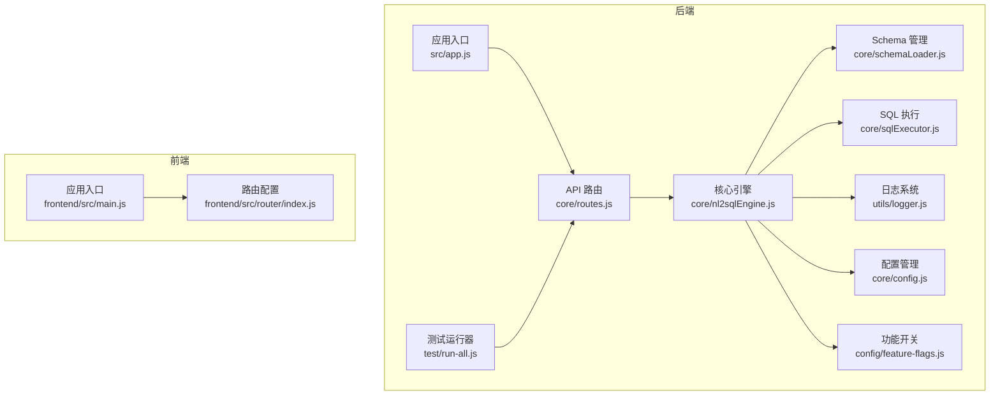
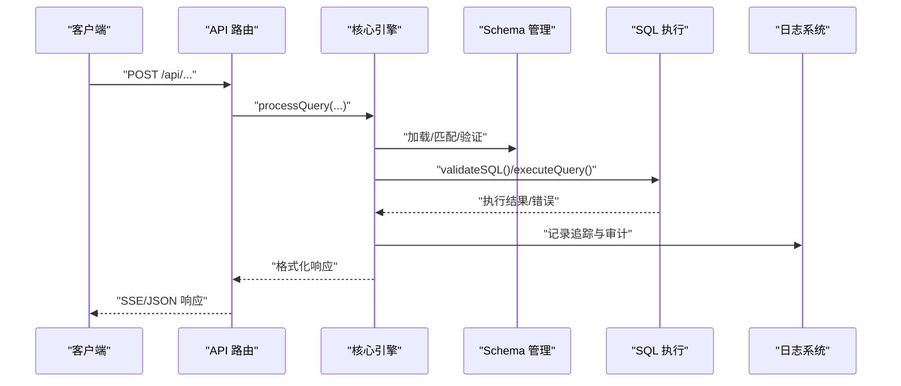
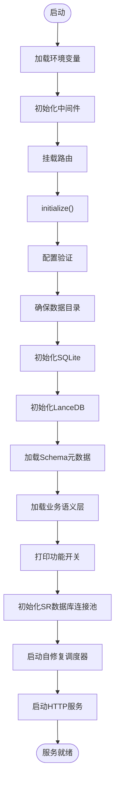
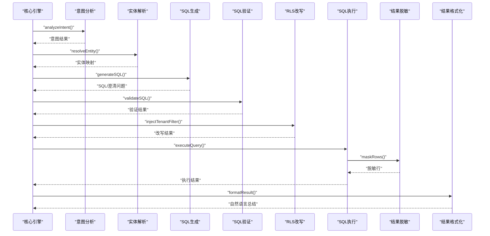
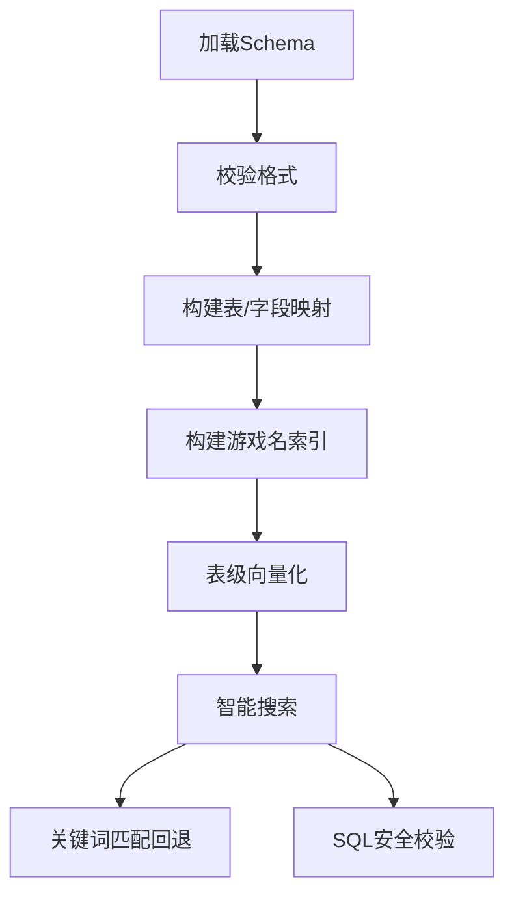
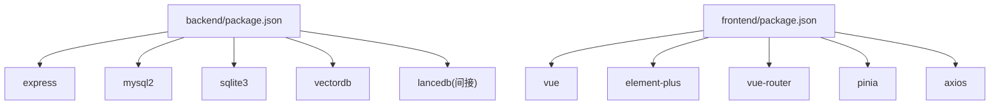

# 开发者指南

<cite>
**本文档引用的文件**
- [backend/package.json](file://backend/package.json)
- [frontend/package.json](file://frontend/package.json)
- [backend/src/app.js](file://backend/src/app.js)
- [backend/src/core/nl2sqlEngine.js](file://backend/src/core/nl2sqlEngine.js)
- [backend/src/core/sqlExecutor.js](file://backend/src/core/sqlExecutor.js)
- [backend/src/core/schemaLoader.js](file://backend/src/core/schemaLoader.js)
- [backend/src/utils/logger.js](file://backend/src/utils/logger.js)
- [backend/src/core/config.js](file://backend/src/core/config.js)
- [backend/config/feature-flags.js](file://backend/config/feature-flags.js)
- [backend/test/run-all.js](file://backend/test/run-all.js)
- [frontend/src/main.js](file://frontend/src/main.js)
- [frontend/src/router/index.js](file://frontend/src/router/index.js)
- [docs/后端架构审查与优化方案.md](file://docs/后端架构审查与优化方案.md)
- [docs/NL2SQL-澄清断链修复计划.md](file://docs/NL2SQL-澄清断链修复计划.md)
- [docs/NL2SQL-进度追踪.md](file://docs/NL2SQL-进度追踪.md)
- [backend/test/phase1/README.md](file://backend/test/phase1/README.md)
- [backend/test/phase2/README.md](file://backend/test/phase2/README.md)
- [backend/test/phase4/README.md](file://backend/test/phase4/README.md)
</cite>

## 目录
1. [简介](#简介)
2. [项目结构](#项目结构)
3. [核心组件](#核心组件)
4. [架构总览](#架构总览)
5. [详细组件分析](#详细组件分析)
6. [依赖关系分析](#依赖关系分析)
7. [性能考量](#性能考量)
8. [故障排查指南](#故障排查指南)
9. [结论](#结论)
10. [附录](#附录)

## 简介
本指南面向 NL2SQL 项目的贡献者，提供从代码贡献流程、分支管理、代码审查、提交规范，到代码结构与编码规范、新功能开发流程、调试技巧与开发工具使用、重构与优化最佳实践的完整开发者指南。项目采用前后端分离架构，后端基于 Node.js + Express，前端基于 Vue3，核心能力包括自然语言到 SQL 的意图识别、实体解析、SQL 生成、安全验证、执行与结果格式化，并具备长期记忆、向量检索、功能开关与自修复机制。

## 项目结构
项目采用前后端分离的模块化组织方式：
- 后端 backend：核心业务逻辑、API 路由、配置与工具模块、测试套件
- 前端 frontend：Vue3 应用、路由、状态管理、视图组件
- docs：架构审查与优化方案、进度追踪、澄清断链修复计划等文档

**图表来源**
- [backend/src/app.js:1-279](file://backend/src/app.js#L1-L279)
- [backend/src/core/routes.js](file://backend/src/core/routes.js)
- [backend/src/core/nl2sqlEngine.js:1-756](file://backend/src/core/nl2sqlEngine.js#L1-L756)
- [backend/src/core/schemaLoader.js:1-800](file://backend/src/core/schemaLoader.js#L1-L800)
- [backend/src/core/sqlExecutor.js:1-175](file://backend/src/core/sqlExecutor.js#L1-L175)
- [backend/src/utils/logger.js:1-482](file://backend/src/utils/logger.js#L1-L482)
- [backend/src/core/config.js:1-439](file://backend/src/core/config.js#L1-L439)
- [backend/config/feature-flags.js:1-294](file://backend/config/feature-flags.js#L1-L294)
- [backend/test/run-all.js:1-181](file://backend/test/run-all.js#L1-L181)
- [frontend/src/main.js:1-89](file://frontend/src/main.js#L1-L89)
- [frontend/src/router/index.js:1-157](file://frontend/src/router/index.js#L1-L157)

**章节来源**
- [backend/package.json:1-36](file://backend/package.json#L1-L36)
- [frontend/package.json:1-36](file://frontend/package.json#L1-L36)
- [backend/src/app.js:1-279](file://backend/src/app.js#L1-L279)
- [frontend/src/main.js:1-89](file://frontend/src/main.js#L1-L89)
- [frontend/src/router/index.js:1-157](file://frontend/src/router/index.js#L1-L157)

## 核心组件
- 应用入口与启动：负责环境变量加载、中间件配置、模块初始化、优雅关停与错误处理
- 核心引擎：编排意图识别、实体解析、SQL 生成、验证、执行、格式化与审计
- Schema 管理：加载与缓存元数据、向量化、语义搜索、关键词匹配与 SQL 安全校验
- SQL 执行：安全验证、连接池执行、行数限制、结果脱敏与错误码
- 日志系统：统一日志、文件轮转、结构化输出与执行流程追踪
- 配置管理：集中配置、环境变量解析、安全策略、功能开关
- 测试运行器：按阶段聚合测试、外部依赖黑白名单、超时与退出码

**章节来源**
- [backend/src/app.js:99-204](file://backend/src/app.js#L99-L204)
- [backend/src/core/nl2sqlEngine.js:111-734](file://backend/src/core/nl2sqlEngine.js#L111-L734)
- [backend/src/core/schemaLoader.js:75-131](file://backend/src/core/schemaLoader.js#L75-L131)
- [backend/src/core/sqlExecutor.js:34-169](file://backend/src/core/sqlExecutor.js#L34-L169)
- [backend/src/utils/logger.js:276-448](file://backend/src/utils/logger.js#L276-L448)
- [backend/src/core/config.js:407-439](file://backend/src/core/config.js#L407-L439)
- [backend/test/run-all.js:117-175](file://backend/test/run-all.js#L117-L175)

## 架构总览
后端采用模块化分层设计，核心流程从 API 路由进入，经过核心引擎编排，调用 Schema 管理与 SQL 执行模块，结合日志与配置系统，最终返回结果。功能开关与自修复机制贯穿运行时控制与维护。

**图表来源**
- [backend/src/core/routes.js](file://backend/src/core/routes.js)
- [backend/src/core/nl2sqlEngine.js:111-734](file://backend/src/core/nl2sqlEngine.js#L111-L734)
- [backend/src/core/schemaLoader.js:749-785](file://backend/src/core/schemaLoader.js#L749-L785)
- [backend/src/core/sqlExecutor.js:72-169](file://backend/src/core/sqlExecutor.js#L72-L169)
- [backend/src/utils/logger.js:352-448](file://backend/src/utils/logger.js#L352-L448)

## 详细组件分析

### 应用入口与启动流程
- 环境变量加载与依赖导入
- CORS 与 body-parser 中间件配置
- API 路由挂载与 HTTP 服务器创建
- 初始化顺序：配置验证 → 数据目录 → SQLite → LanceDB → Schema 加载 → 业务语义层 → 功能开关 → SR 数据库 → 自修复调度器 → 启动服务
- 优雅关停：关闭 HTTP、SSE、定时任务、数据库连接

**图表来源**
- [backend/src/app.js:99-196](file://backend/src/app.js#L99-L196)

**章节来源**
- [backend/src/app.js:15-279](file://backend/src/app.js#L15-L279)

### 核心引擎编排流程
- 主流程：加载会话历史 → Token 预算检查 → 意图识别 → 澄清 → SQL 生成 → 验证 → RLS 改写 → 执行 → 脱敏 → 格式化 → 审计
- 错误处理：统一 NL2SQLError，记录审计字段，返回标准化错误
- 长期记忆：抽取并存储偏好、别名学习、模板存储
- 查询向量：嵌入与增强元数据写入向量库

**图表来源**
- [backend/src/core/nl2sqlEngine.js:121-704](file://backend/src/core/nl2sqlEngine.js#L121-L704)
- [backend/src/core/sqlExecutor.js:34-169](file://backend/src/core/sqlExecutor.js#L34-L169)

**章节来源**
- [backend/src/core/nl2sqlEngine.js:111-734](file://backend/src/core/nl2sqlEngine.js#L111-L734)

### Schema 管理与向量化
- 加载与缓存：校验格式、构建映射、动态游戏名索引
- 向量化：表级表征、元数据标签、增量更新
- 搜索：语义搜索 + 关键词匹配 + 上下文过滤
- 安全校验：禁止关键字、白名单、前缀与 LIMIT 校验

**图表来源**
- [backend/src/core/schemaLoader.js:75-131](file://backend/src/core/schemaLoader.js#L75-L131)
- [backend/src/core/schemaLoader.js:210-285](file://backend/src/core/schemaLoader.js#L210-L285)
- [backend/src/core/schemaLoader.js:571-679](file://backend/src/core/schemaLoader.js#L571-L679)
- [backend/src/core/schemaLoader.js:749-785](file://backend/src/core/schemaLoader.js#L749-L785)

**章节来源**
- [backend/src/core/schemaLoader.js:1-800](file://backend/src/core/schemaLoader.js#L1-L800)

### SQL 执行与安全
- validateSQL：白名单 + 前缀 + LIMIT 必须
- executeQuery：DryRun、SR 数据库未配置/未就绪、连接池、行数限制、结果脱敏、错误码
- RLS 改写：在引擎层调用 sqlRewriter，保持“改写 → 执行”解耦

**章节来源**
- [backend/src/core/sqlExecutor.js:34-169](file://backend/src/core/sqlExecutor.js#L34-L169)

### 日志系统与追踪
- 多级别日志：TRACE/DEBUG/INFO/WARN/ERROR
- 文件轮转：大小阈值与保留数量
- 执行追踪：startTrace/traceStep/endTrace，支持僵尸条目清理
- 事件发射：统一日志事件监听

**章节来源**
- [backend/src/utils/logger.js:276-448](file://backend/src/utils/logger.js#L276-L448)

### 配置管理与功能开关
- 配置项：LLM、Embedding、数据库、安全、会话、日志、自修复、Schema、长期记忆、上下文管理、评估
- 配置验证：启动时校验必要项
- 功能开关：按 Phase 细分，支持全局启用/禁用与运行时查询

**章节来源**
- [backend/src/core/config.js:407-439](file://backend/src/core/config.js#L407-L439)
- [backend/config/feature-flags.js:153-294](file://backend/config/feature-flags.js#L153-L294)

### 测试与回归
- 测试聚合器：按阶段发现与运行测试，支持冒烟模式、外部依赖黑名单
- Phase 1-4：最小回归、表候选排序、模块级导出契约、自修复与队列
- 用例类别：单元测试、集成测试、端到端回归

**章节来源**
- [backend/test/run-all.js:117-175](file://backend/test/run-all.js#L117-L175)
- [backend/test/phase1/README.md:1-34](file://backend/test/phase1/README.md#L1-L34)
- [backend/test/phase2/README.md:1-72](file://backend/test/phase2/README.md#L1-L72)
- [backend/test/phase4/README.md:1-51](file://backend/test/phase4/README.md#L1-L51)

## 依赖关系分析
- 后端依赖：Express、CORS、Body-Parser、SQLite、MySQL2、LanceDB、Node-cron、node-sql-parser、UUID、日志与工具库
- 前端依赖：Vue3、Element Plus、Vue Router、Pinia、Axios、ECharts、Mermaid、Markdown-it 等
- 模块耦合：核心引擎对 Schema、SQL 执行、日志、配置、功能开关有直接依赖；路由与 SSE 处理器通过模块接口交互

**图表来源**
- [backend/package.json:16-31](file://backend/package.json#L16-L31)
- [frontend/package.json:11-34](file://frontend/package.json#L11-L34)

**章节来源**
- [backend/package.json:1-36](file://backend/package.json#L1-L36)
- [frontend/package.json:1-36](file://frontend/package.json#L1-L36)

## 性能考量
- Token 预算与压缩：对话历史压缩、紧急压缩策略，避免上下文溢出
- 向量检索优化：表级向量、动态游戏名索引、分层加权、datasource 硬过滤
- 执行层限制：行数上限、超时控制、脱敏与 DryRun
- 日志与追踪：文件轮转与僵尸追踪条目清理，避免内存泄漏

**章节来源**
- [docs/后端架构审查与优化方案.md:226-247](file://docs/后端架构审查与优化方案.md#L226-L247)
- [backend/src/utils/logger.js:331-343](file://backend/src/utils/logger.js#L331-L343)

## 故障排查指南
- 启动失败：检查配置验证、必要环境变量、数据库连接
- 澄清断链：确认澄清消息持久化、答案路由、历史注入与 Prompt 日期
- SQL 跑偏：核对 Schema 检索入参、Prompt 注入历史与日期、applyClarification 分支覆盖
- 日志追踪：使用 startTrace/traceStep/endTrace 定位步骤耗时与错误
- 测试回归：按阶段运行测试，关注冒烟模式与外部依赖

**章节来源**
- [backend/src/app.js:198-204](file://backend/src/app.js#L198-L204)
- [docs/NL2SQL-澄清断链修复计划.md:20-40](file://docs/NL2SQL-澄清断链修复计划.md#L20-L40)
- [backend/src/utils/logger.js:352-448](file://backend/src/utils/logger.js#L352-L448)
- [backend/test/run-all.js:117-175](file://backend/test/run-all.js#L117-L175)

## 结论
本指南系统梳理了 NL2SQL 项目的架构、核心组件、开发流程与最佳实践。建议贡献者遵循统一的分支与提交规范，严格按 Phase 进行功能迭代与测试回归，重视日志追踪与错误处理，持续优化性能与可维护性。

## 附录

### 代码贡献流程
- 分支策略：feature/fix/hotfix 基于 develop 分支，完成后通过 PR 合并
- 提交规范：类型 + 目标模块 + 简要描述，如 feat(core): 新增实体解析导出
- 代码审查：至少一名维护者批准，关注可读性、测试覆盖率与性能
- 测试要求：新增/修改功能需配套单元/集成测试，运行冒烟测试

### 编码规范
- 命名约定：模块使用 camelCase，类名首字母大写，常量全大写
- 模块组织：按职责划分 core/memory/utils/tools，避免上帝对象
- 注释标准：公共 API 与复杂逻辑提供清晰注释，错误类统一结构化日志

### 新功能开发流程
- 需求分析：参考进度追踪与文档，明确 Phase 与验收门槛
- 设计文档：概述流程、接口契约、错误处理与性能影响
- 实现步骤：按模块拆分与依赖顺序实现，保持向后兼容
- 测试验证：单元测试 + 集成测试 + 端到端回归，按阶段运行测试

### 调试技巧与开发工具
- IDE 配置：启用 ESLint/Prettier，设置断点与条件断点
- 调试器使用：Node.js Inspector、Vue Devtools、浏览器 Network/Console
- 性能分析：日志追踪、慢查询阈值、内存快照与 CPU Profile
- 日志策略：合理设置日志级别，使用结构化日志与追踪 ID

### 重构与优化最佳实践
- 拆分核心引擎：按 Phase 提取子模块，保留对外契约
- 统一 LLM 响应解析：抽取通用解析器，减少重复实现
- 解耦 SSE 与引擎：依赖注入模式，支持动态切换引擎
- 错误处理体系：统一错误类与重试机制，完善队列与死信处理

**章节来源**
- [docs/后端架构审查与优化方案.md:90-148](file://docs/后端架构审查与优化方案.md#L90-L148)
- [docs/NL2SQL-进度追踪.md:8-265](file://docs/NL2SQL-进度追踪.md#L8-L265)