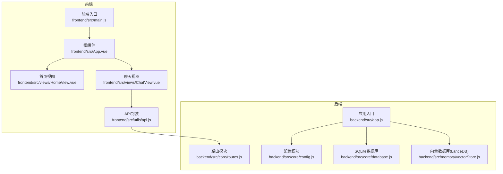
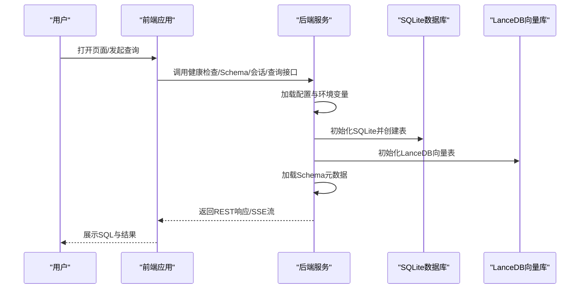
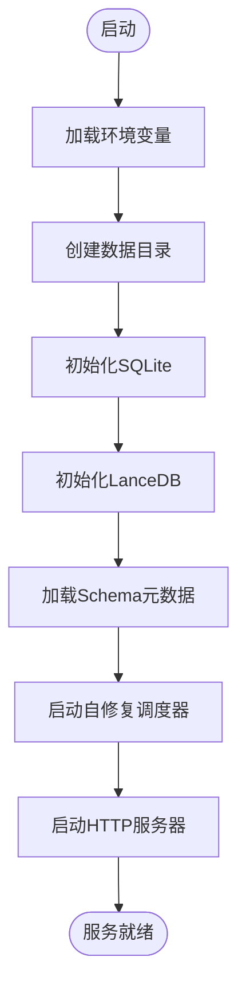
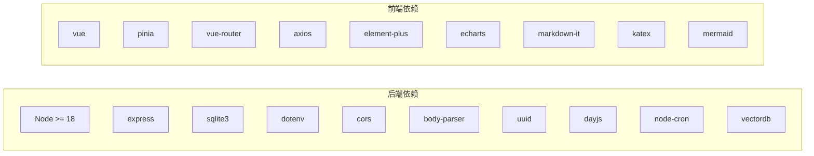

# 快速开始

<cite>
**本文引用的文件**
- [backend/package.json](file://backend/package.json)
- [frontend/package.json](file://frontend/package.json)
- [backend/src/app.js](file://backend/src/app.js)
- [backend/src/core/config.js](file://backend/src/core/config.js)
- [backend/src/core/database.js](file://backend/src/core/database.js)
- [backend/src/memory/vectorStore.js](file://backend/src/memory/vectorStore.js)
- [backend/src/core/routes.js](file://backend/src/core/routes.js)
- [backend/config/schema-metadata.example.json](file://backend/config/schema-metadata.example.json)
- [frontend/vite.config.js](file://frontend/vite.config.js)
- [frontend/src/main.js](file://frontend/src/main.js)
- [frontend/src/App.vue](file://frontend/src/App.vue)
- [frontend/src/utils/api.js](file://frontend/src/utils/api.js)
- [frontend/src/views/HomeView.vue](file://frontend/src/views/HomeView.vue)
- [frontend/src/views/ChatView.vue](file://frontend/src/views/ChatView.vue)
</cite>

## 目录
1. [简介](#简介)
2. [项目结构](#项目结构)
3. [核心组件](#核心组件)
4. [架构总览](#架构总览)
5. [详细组件分析](#详细组件分析)
6. [依赖分析](#依赖分析)
7. [性能考虑](#性能考虑)
8. [故障排除指南](#故障排除指南)
9. [结论](#结论)
10. [附录](#附录)

## 简介
本指南面向首次接触 NL2SQL 项目的用户，帮助你在本地快速完成环境准备、依赖安装、数据库初始化与配置，并启动前后端服务，最终完成一次从自然语言到 SQL 的完整查询流程演示。同时提供常见配置项说明、环境变量设置、部署建议以及基础故障排除步骤。

## 项目结构
NL2SQL 采用前后端分离架构：
- 后端（Node.js + Express）：提供 REST API、SSE 流式输出、SQLite 会话存储、LanceDB 向量检索、Schema 元数据加载与校验。
- 前端（Vue 3 + Vite）：提供聊天界面、Schema 查看、历史查询、长期记忆等功能，通过代理访问后端 API。

**图表来源**
- [frontend/src/main.js:1-89](file://frontend/src/main.js#L1-L89)
- [frontend/src/App.vue:1-373](file://frontend/src/App.vue#L1-L373)
- [frontend/src/views/HomeView.vue:1-318](file://frontend/src/views/HomeView.vue#L1-L318)
- [frontend/src/views/ChatView.vue:1-776](file://frontend/src/views/ChatView.vue#L1-L776)
- [frontend/src/utils/api.js:1-252](file://frontend/src/utils/api.js#L1-L252)
- [backend/src/app.js:1-238](file://backend/src/app.js#L1-L238)
- [backend/src/core/routes.js:1-800](file://backend/src/core/routes.js#L1-L800)
- [backend/src/core/config.js:1-332](file://backend/src/core/config.js#L1-L332)
- [backend/src/core/database.js:1-850](file://backend/src/core/database.js#L1-L850)
- [backend/src/memory/vectorStore.js:1-442](file://backend/src/memory/vectorStore.js#L1-L442)

**章节来源**
- [backend/src/app.js:1-238](file://backend/src/app.js#L1-L238)
- [frontend/src/main.js:1-89](file://frontend/src/main.js#L1-L89)

## 核心组件
- 应用入口与初始化：后端入口负责加载环境变量、初始化数据库与向量库、加载 Schema、启动 HTTP 与 SSE 服务。
- 配置中心：集中管理端口、LLM/Embedding、数据库、安全策略、日志、自修复、Schema 缓存、长期记忆等配置。
- 数据层：SQLite 会话与查询历史存储；LanceDB 向量表用于 Schema 与查询历史的语义检索。
- 路由与 API：提供健康检查、Schema 查询、会话管理、查询历史、统计信息、配置等 REST 接口。
- 前端交互：首页引导、聊天界面、SSE 流式展示、Markdown/代码高亮渲染、示例查询。

**章节来源**
- [backend/src/core/config.js:1-332](file://backend/src/core/config.js#L1-L332)
- [backend/src/core/database.js:1-850](file://backend/src/core/database.js#L1-L850)
- [backend/src/memory/vectorStore.js:1-442](file://backend/src/memory/vectorStore.js#L1-L442)
- [backend/src/core/routes.js:1-800](file://backend/src/core/routes.js#L1-L800)
- [frontend/src/views/ChatView.vue:1-776](file://frontend/src/views/ChatView.vue#L1-L776)

## 架构总览
后端启动顺序与关键依赖关系如下：

**图表来源**
- [backend/src/app.js:97-166](file://backend/src/app.js#L97-L166)
- [backend/src/core/database.js:200-261](file://backend/src/core/database.js#L200-L261)
- [backend/src/memory/vectorStore.js:55-85](file://backend/src/memory/vectorStore.js#L55-L85)
- [backend/src/core/routes.js:70-135](file://backend/src/core/routes.js#L70-L135)

## 详细组件分析

### 后端启动与初始化流程
- 环境变量加载：通过 dotenv 从 .env 读取配置。
- 中间件：CORS、JSON 解析。
- 路由挂载：/api 前缀。
- 初始化顺序：数据目录创建 → SQLite 初始化 → LanceDB 初始化 → Schema 加载 → 自修复调度器启动 → HTTP 服务器监听。
- 优雅关闭：关闭 HTTP、SSE、定时任务、数据库连接。

**图表来源**
- [backend/src/app.js:97-166](file://backend/src/app.js#L97-L166)

**章节来源**
- [backend/src/app.js:1-238](file://backend/src/app.js#L1-L238)

### 配置与环境变量
- Node.js 版本要求：>= 18.0.0。
- 关键环境变量（示例）：
  - LLM_API_BASE：LLM API 基础地址（默认 OpenAI 格式）
  - LLM_API_KEY：LLM 认证密钥
  - LLM_MODEL：默认模型名称
  - LLM_TIMEOUT：请求超时（毫秒）
  - EMBEDDING_MODEL：Embedding 模型名称
  - DB_PATH：SQLite 数据库文件路径
  - VECTOR_DB_PATH：LanceDB 存储目录
  - SR_DATABASE_URL：业务数据库连接 URL（MySQL/其他）
  - ALLOWED_TABLES：白名单表（逗号分隔）
  - DRY_RUN：仅生成 SQL 不执行
  - MAX_QUERY_ROWS：查询返回行数上限
  - QUERY_TIMEOUT：查询超时（毫秒）
  - LOG_LEVEL/LOG_FILE：日志级别与文件
  - SCHEMA_CONFIG_PATH：Schema 配置文件路径
  - SCHEMA_REVECTORIZE：是否强制重新向量化
  - LTM_ENABLED/LTM_USE_LLM：长期记忆开关与LLM提取开关
- 配置校验：启动时检查 LLM API Key 与 SR 数据库 URL 是否有效。

**章节来源**
- [backend/package.json:24-26](file://backend/package.json#L24-L26)
- [backend/src/core/config.js:1-332](file://backend/src/core/config.js#L1-L332)

### 数据库与向量存储
- SQLite：
  - 存储会话、消息、查询历史、用户偏好、系统日志。
  - 外键约束启用，索引优化查询。
  - 迁移逻辑修复旧表结构。
- LanceDB：
  - schema_vectors：Schema 文本向量。
  - query_vectors：查询历史向量。
  - 提供添加/搜索/统计等操作。

**章节来源**
- [backend/src/core/database.js:1-850](file://backend/src/core/database.js#L1-L850)
- [backend/src/memory/vectorStore.js:1-442](file://backend/src/memory/vectorStore.js#L1-L442)

### API 与前端交互
- 健康检查：/api/health 与 /api/health/detail。
- Schema：/api/schema、/api/schema/tables/:tableName、/api/schema/search。
- 会话：/api/sessions、/api/sessions/:sessionId、/api/sessions/:sessionId/messages、/api/users/:userId/sessions。
- 查询历史：/api/queries/history。
- 配置：/api/config。
- SSE：前端通过 /api/sse/query 发送查询，后端以流式方式返回中间态与最终结果。

**章节来源**
- [backend/src/core/routes.js:1-800](file://backend/src/core/routes.js#L1-L800)
- [frontend/src/utils/api.js:1-252](file://frontend/src/utils/api.js#L1-L252)

### 前端开发与构建
- 开发服务器：Vite，默认端口 5173，代理 /api 到后端 3000。
- 依赖：Vue 3、Element Plus、Pinia、Axios、路由等。
- 入口：main.js 创建应用，安装路由/状态/UI 插件，挂载根组件。
- 页面：HomeView 引导与示例；ChatView 聊天与 SSE 展示。

**章节来源**
- [frontend/vite.config.js:1-93](file://frontend/vite.config.js#L1-L93)
- [frontend/package.json:1-36](file://frontend/package.json#L1-L36)
- [frontend/src/main.js:1-89](file://frontend/src/main.js#L1-L89)
- [frontend/src/App.vue:1-373](file://frontend/src/App.vue#L1-L373)
- [frontend/src/views/HomeView.vue:1-318](file://frontend/src/views/HomeView.vue#L1-L318)
- [frontend/src/views/ChatView.vue:1-776](file://frontend/src/views/ChatView.vue#L1-L776)

## 依赖分析
- 后端依赖：Express、CORS、Body Parser、SQLite3、dotenv、uuid、dayjs、node-cron、vectordb。
- 前端依赖：Vue 3、Element Plus、Axios、Pinia、Vue Router、ECharts、Mermaid、KaTeX、marked 等。
- 开发依赖：nodemon（后端热重启）、vite、sass 等。

**图表来源**
- [backend/package.json:10-23](file://backend/package.json#L10-L23)
- [frontend/package.json:11-29](file://frontend/package.json#L11-L29)

**章节来源**
- [backend/package.json:1-28](file://backend/package.json#L1-L28)
- [frontend/package.json:1-36](file://frontend/package.json#L1-L36)

## 性能考虑
- 查询超时与行数限制：通过配置项控制，避免大查询导致资源耗尽。
- 向量检索：LanceDB 向量表支持相似度搜索，提升 Schema 与查询历史检索效率。
- 日志轮转：日志文件大小与数量限制，避免磁盘占用过大。
- SSE 流式输出：前端逐步接收中间态，降低一次性渲染压力。
- 前端代码分割：第三方库独立打包，优化首屏加载。

[本节为通用指导，无需特定文件引用]

## 故障排除指南
- 启动失败（配置缺失）：
  - 确认 .env 中 LLM_API_KEY 与 SR_DATABASE_URL 已设置且非默认占位值。
  - 若 ALLOWED_TABLES 为空，生产环境需配置白名单。
- 数据库连接失败：
  - 检查 DB_PATH 与 VECTOR_DB_PATH 权限与路径。
  - SQLite 初始化失败时查看日志定位具体 SQL 错误。
- 向量库不可用：
  - LanceDB 初始化失败不影响服务启动，但语义搜索功能受限。
- 健康检查异常：
  - 使用 /api/health/detail 查看组件状态（数据库、LLM、Schema、SSE）。
- 前端无法访问后端：
  - 确认 Vite 代理已将 /api 代理至后端 3000 端口。
- 查询无结果或报错：
  - 检查 ALLOWED_TABLES 白名单与禁止关键字过滤。
  - 调整 QUERY_TIMEOUT 与 MAX_QUERY_ROWS。

**章节来源**
- [backend/src/core/config.js:300-331](file://backend/src/core/config.js#L300-L331)
- [backend/src/app.js:160-165](file://backend/src/app.js#L160-L165)
- [backend/src/core/database.js:200-261](file://backend/src/core/database.js#L200-L261)
- [backend/src/memory/vectorStore.js:55-85](file://backend/src/memory/vectorStore.js#L55-L85)
- [backend/src/core/routes.js:98-135](file://backend/src/core/routes.js#L98-L135)
- [frontend/vite.config.js:24-35](file://frontend/vite.config.js#L24-L35)

## 结论
通过本快速开始指南，你可以在本地完成 NL2SQL 的环境准备、依赖安装、数据库与向量库初始化、配置设置，并成功启动前后端服务。随后即可体验从自然语言到 SQL 的完整查询流程。建议在生产环境中进一步完善安全策略（白名单、超时、行数限制）与日志监控，并结合业务数据库连接 URL 与 LLM API 进行实际部署。

[本节为总结性内容，无需特定文件引用]

## 附录

### 安装与运行步骤
- 环境要求
  - Node.js：>= 18.0.0
  - 建议：具备数据库连接能力（MySQL/其他）与 LLM API 访问权限
- 安装依赖
  - 后端：进入 backend 目录，安装依赖
  - 前端：进入 frontend 目录，安装依赖
- 配置环境变量
  - 在 backend 根目录创建 .env，设置 LLM_API_KEY、SR_DATABASE_URL 等关键项
  - 如需使用 LanceDB，确保 VECTOR_DB_PATH 可写
- 初始化数据库与向量库
  - 启动后端，自动创建数据目录、SQLite 表与 LanceDB 表
- 启动服务
  - 后端：npm run dev 或 npm start
  - 前端：npm run dev
- 访问应用
  - 前端：http://localhost:5173
  - 后端：http://localhost:3000

**章节来源**
- [backend/package.json:6-8](file://backend/package.json#L6-L8)
- [frontend/package.json:6-10](file://frontend/package.json#L6-L10)
- [backend/src/app.js:147-158](file://backend/src/app.js#L147-L158)
- [frontend/vite.config.js:18-35](file://frontend/vite.config.js#L18-L35)

### 基本使用示例
- 健康检查：GET /api/health
- 获取 Schema：GET /api/schema
- 创建会话：POST /api/sessions
- 发送查询（SSE）：POST /api/sse/query（前端通过 api.js 的 sendQuery 封装）
- 查看历史：GET /api/queries/history
- 获取统计：GET /api/stats

**章节来源**
- [backend/src/core/routes.js:70-135](file://backend/src/core/routes.js#L70-L135)
- [frontend/src/utils/api.js:246-251](file://frontend/src/utils/api.js#L246-L251)

### 常见配置项说明
- LLM 相关：LLM_API_BASE、LLM_API_KEY、LLM_MODEL、LLM_TIMEOUT
- Embedding：EMBEDDING_MODEL、EMBEDDING_TIMEOUT
- 数据库：DB_PATH、VECTOR_DB_PATH、SR_DATABASE_URL
- 安全：ALLOWED_TABLES、DRY_RUN、MAX_QUERY_ROWS、QUERY_TIMEOUT、禁止关键字、敏感字段脱敏
- 日志：LOG_LEVEL、LOG_FILE、控制台与文件输出
- 自修复：SELF_REPAIR_ENABLED、每日检查 Cron、会话检查间隔、慢查询阈值
- Schema：SCHEMA_CONFIG_PATH、SCHEMA_CACHE、SCHEMA_REVECTORIZE
- 长期记忆：LTM_ENABLED、LTM_USE_LLM、阈值与保留策略

**章节来源**
- [backend/src/core/config.js:16-332](file://backend/src/core/config.js#L16-L332)

### Schema 元数据
- 示例文件：backend/config/schema-metadata.example.json
- 内容：表定义、字段、关系、指标、维度等
- 使用：启动时加载，支持搜索与展示

**章节来源**
- [backend/config/schema-metadata.example.json:1-328](file://backend/config/schema-metadata.example.json#L1-L328)