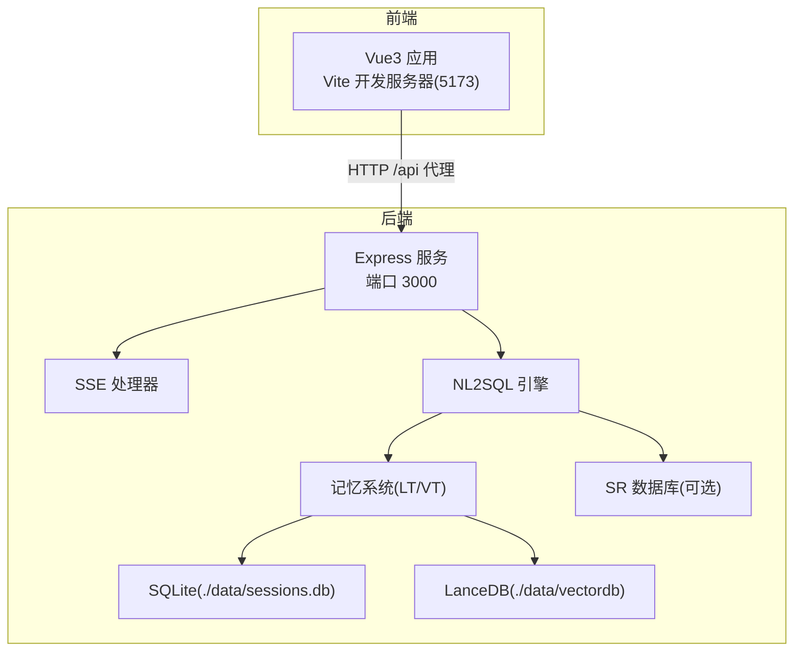
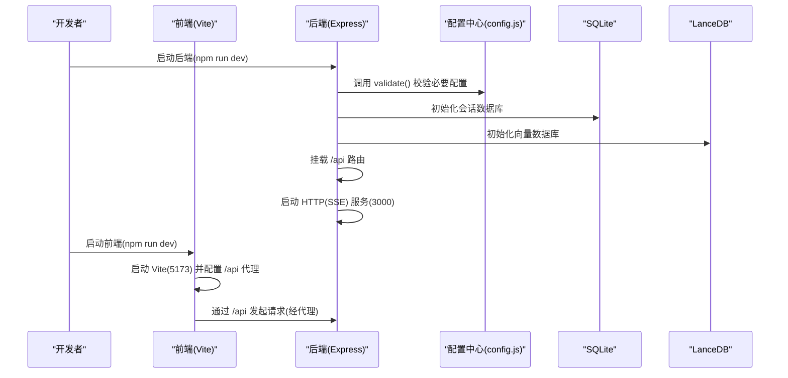
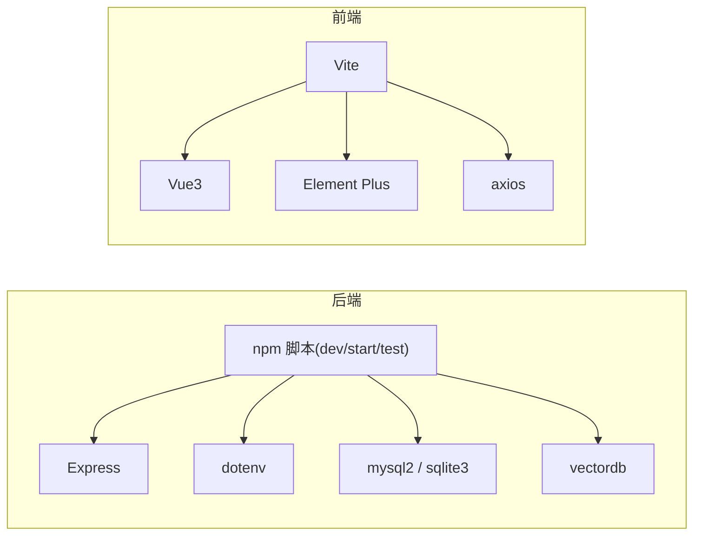

# 快速开始

<cite>
**本文引用的文件**
- [backend/package.json](file://backend/package.json)
- [frontend/package.json](file://frontend/package.json)
- [backend/src/app.js](file://backend/src/app.js)
- [frontend/vite.config.js](file://frontend/vite.config.js)
- [backend/config/schema-metadata.example.json](file://backend/config/schema-metadata.example.json)
- [backend/config/feature-flags.js](file://backend/config/feature-flags.js)
- [backend/config/business-semantic-layer.json](file://backend/config/business-semantic-layer.json)
- [backend/test/run-all.js](file://backend/test/run-all.js)
- [frontend/src/main.js](file://frontend/src/main.js)
- [backend/src/core/config.js](file://backend/src/core/config.js)
- [CLAUDE.md](file://CLAUDE.md)
- [docs/NL2SQL-进度追踪.md](file://docs/NL2SQL-进度追踪.md)
</cite>

## 目录
1. [简介](#简介)
2. [项目结构](#项目结构)
3. [核心组件](#核心组件)
4. [架构总览](#架构总览)
5. [详细组件分析](#详细组件分析)
6. [依赖分析](#依赖分析)
7. [性能考虑](#性能考虑)
8. [故障排查指南](#故障排查指南)
9. [结论](#结论)
10. [附录](#附录)

## 简介
本指南面向新手开发者，帮助你在约 30 分钟内完成 NL2SQL 项目的环境准备、项目克隆、依赖安装、环境变量配置与本地开发启动，并提供首个查询示例，让你快速体验系统核心能力。

## 项目结构
NL2SQL 采用前后端分离架构：
- 后端：Node.js + Express，提供 REST API 与 SSE 流式接口，内置向量检索、Schema 管理、记忆系统与自修复机制。
- 前端：Vue3 + Element Plus，通过 Vite 开发服务器提供聊天界面、Schema 浏览、历史与评估视图。
- 数据层：SQLite 会话存储 + LanceDB 向量数据库 + SR 数据库（真实执行层，可选）。

**图表来源**
- [frontend/vite.config.js:18-35](file://frontend/vite.config.js#L18-L35)
- [backend/src/app.js:80-82](file://backend/src/app.js#L80-L82)
- [backend/src/app.js:185-196](file://backend/src/app.js#L185-L196)

**章节来源**
- [CLAUDE.md:41-58](file://CLAUDE.md#L41-L58)
- [frontend/vite.config.js:18-35](file://frontend/vite.config.js#L18-L35)
- [backend/src/app.js:80-82](file://backend/src/app.js#L80-L82)

## 核心组件
- 后端入口与启动：负责加载环境变量、初始化数据库与向量库、挂载路由、启动 HTTP 与 SSE 服务。
- 配置中心：集中管理 LLM、Embedding、数据库、安全、日志、Schema、记忆与上下文等配置。
- 前端入口与路由：创建 Vue 应用、安装路由与状态管理、注册全局组件并挂载。
- 开发代理：Vite 将 /api 请求代理至后端 3000 端口，解决跨域问题。

**章节来源**
- [backend/src/app.js:15-16](file://backend/src/app.js#L15-L16)
- [backend/src/core/config.js:20-396](file://backend/src/core/config.js#L20-L396)
- [frontend/src/main.js:14-89](file://frontend/src/main.js#L14-L89)
- [frontend/vite.config.js:24-34](file://frontend/vite.config.js#L24-L34)

## 架构总览
后端通过配置中心统一读取环境变量，启动时校验必要配置，初始化 SQLite 与 LanceDB，加载 Schema 元数据与业务语义层，随后启动 HTTP 服务与 SSE 流。前端通过 Vite 代理访问后端 API，建立 SSE 连接进行实时交互。

**图表来源**
- [backend/src/app.js:99-204](file://backend/src/app.js#L99-L204)
- [backend/src/core/config.js:407-429](file://backend/src/core/config.js#L407-L429)
- [frontend/vite.config.js:18-35](file://frontend/vite.config.js#L18-L35)

## 详细组件分析

### 环境准备与前置条件
- Node.js 版本要求：后端工程明确要求 Node.js >= 18.0.0。
- Git：用于克隆仓库。
- 依赖工具：npm（随 Node.js 安装）。

**章节来源**
- [backend/package.json:32-34](file://backend/package.json#L32-L34)

### 项目克隆与依赖安装
- 克隆仓库后，分别进入 backend 与 frontend 目录安装依赖。
- 后端使用 npm run dev 启动热重载服务；前端使用 npm run dev 启动开发服务器。

**章节来源**
- [CLAUDE.md:9-23](file://CLAUDE.md#L9-L23)
- [backend/package.json:6-15](file://backend/package.json#L6-L15)
- [frontend/package.json:6-10](file://frontend/package.json#L6-L10)

### 环境变量配置
- 复制后端示例环境文件为 .env，并填写以下必填项：
  - LLM_API_BASE：兼容 OpenAI 格式的 API 地址（如 DeepSeek）
  - LLM_API_KEY：API 密钥
  - LLM_MODEL：主模型（如 deepseek-chat）
  - EMBEDDING_MODEL：Embedding 模型
  - SR_DATABASE_URL：目标数据库连接串（只读）
- 其他常用配置项（可选）：
  - PORT：后端监听端口（默认 3000）
  - NODE_ENV：运行环境（development/production）
  - LOG_LEVEL：日志级别
  - ALLOWED_TABLES：查询白名单（逗号分隔）
  - DRY_RUN：仅生成 SQL 不执行
  - QUERY_TIMEOUT / MAX_QUERY_ROWS：查询超时与返回行数限制
  - EMBEDDING_ENABLED / EMBEDDING_MODEL / EMBEDDING_DIMENSION：向量检索相关
  - SCHEMA_REVECTORIZE：Schema 变更后强制重新向量化
  - EVALUATION_ENABLED：评估统计开关

**章节来源**
- [CLAUDE.md:27-40](file://CLAUDE.md#L27-L40)
- [backend/src/core/config.js:24-38](file://backend/src/core/config.js#L24-L38)
- [backend/src/core/config.js:64-94](file://backend/src/core/config.js#L64-L94)
- [backend/src/core/config.js:104-143](file://backend/src/core/config.js#L104-L143)
- [backend/src/core/config.js:153-211](file://backend/src/core/config.js#L153-L211)
- [backend/src/core/config.js:281-291](file://backend/src/core/config.js#L281-L291)

### 本地开发环境搭建
- 后端启动：
  - 进入 backend 目录，执行 npm run dev，监听端口 3000。
  - 启动日志会显示 SSE 端点与 API 地址。
- 前端启动：
  - 进入 frontend 目录，执行 npm run dev，监听端口 5173。
  - Vite 自动打开浏览器并配置 /api 代理到 http://localhost:3000。
- 端口与代理：
  - 后端：默认 3000；可通过 PORT 环境变量修改。
  - 前端：默认 5173；代理规则已在 vite.config.js 中配置。

**章节来源**
- [CLAUDE.md:11-23](file://CLAUDE.md#L11-L23)
- [backend/src/app.js:185-196](file://backend/src/app.js#L185-L196)
- [frontend/vite.config.js:18-35](file://frontend/vite.config.js#L18-L35)

### Schema 与业务语义层配置
- Schema 元数据：
  - 主配置文件：backend/config/schema-metadata.json（启动时加载并向量化）
  - 示例文件：backend/config/schema-metadata.example.json（包含表、字段、关系、指标、维度等结构示例）
- 业务语义层：
  - 配置文件：backend/config/business-semantic-layer.json
  - 作用：将“老平台”等业务概念映射到物理表/字段，提升理解准确度
- 变更生效：
  - 修改上述 JSON 文件后，设置 SCHEMA_REVECTORIZE=true，重启后端以重新向量化

**章节来源**
- [CLAUDE.md:116-122](file://CLAUDE.md#L116-L122)
- [backend/config/schema-metadata.example.json:1-328](file://backend/config/schema-metadata.example.json#L1-L328)
- [backend/config/business-semantic-layer.json:1-189](file://backend/config/business-semantic-layer.json#L1-L189)

### 功能开关（Feature Flags）
- 通过环境变量控制各 Phase 功能，支持渐进式启用与快速回滚
- 常用开关（示例）：
  - FF_TOOL_AUGMENTED_SCHEMA / FF_SCHEMA_LAYERED_LOADING / FF_TOOL_LOOP_MODE：Phase 1 工具化探索
  - FF_DYNAMIC_INTENT_DECOMPOSITION / FF_BUSINESS_SEMANTIC_LAYER：Phase 2 动态意图拆解与业务语义层
  - FF_CLARIFICATION_ENGINE：Phase 3 澄清机制
  - FF_AGENTIC_ENGINE / FF_AUTO_RECOVERY：Phase 4 多步推理与自我修正
  - FF_ENABLE_ALL / FF_DISABLE_ALL：全局启用/禁用
- 启动时会打印当前启用的功能与 Phase

**章节来源**
- [CLAUDE.md:97-114](file://CLAUDE.md#L97-L114)
- [backend/config/feature-flags.js:16-141](file://backend/config/feature-flags.js#L16-L141)
- [backend/src/app.js:149-165](file://backend/src/app.js#L149-L165)

### 第一个查询示例
- 启动后端与前端后，打开前端页面，建立 SSE 连接（后端会输出 SSE 端点与 API 地址）。
- 在聊天界面输入自然语言查询（如“查询近7天注册用户数”），点击发送。
- 后端将通过意图识别、Schema 检索、SQL 生成、验证与执行（或仅生成 SQL，取决于配置）并以流式方式返回结果。
- 若启用业务语义层，系统会将“老平台/新平台”等业务概念映射到物理表字段，提升理解准确度。

**章节来源**
- [CLAUDE.md:133-139](file://CLAUDE.md#L133-L139)
- [backend/src/app.js:185-196](file://backend/src/app.js#L185-L196)

## 依赖分析
- 后端依赖（关键）：Express、CORS、body-parser、dotenv、mysql2、sqlite3、vectordb、node-sql-parser、node-cron、uuid、dayjs 等。
- 前端依赖（关键）：Vue3、Vue Router、Pinia、Element Plus、axios、echarts、marked、mermaid 等。
- 开发依赖：nodemon（后端热重载）、vite、sass、@vitejs/plugin-vue 等。

**图表来源**
- [backend/package.json:16-31](file://backend/package.json#L16-L31)
- [frontend/package.json:11-34](file://frontend/package.json#L11-L34)

**章节来源**
- [backend/package.json:16-31](file://backend/package.json#L16-L31)
- [frontend/package.json:11-34](file://frontend/package.json#L11-L34)

## 性能考虑
- 查询超时与返回行数限制：通过配置项控制，避免大查询导致内存与响应问题。
- 向量检索与 Schema 缓存：合理设置缓存过期与重向量化策略，平衡准确性与性能。
- 日志级别与文件轮转：在生产环境降低日志级别与开启文件轮转，减少 IO 压力。
- 前端代码分割：Vite 已对 Element Plus、ECharts、Vue 生态进行手动分包，减少首屏体积。

**章节来源**
- [backend/src/core/config.js:163-169](file://backend/src/core/config.js#L163-L169)
- [backend/src/core/config.js:285-291](file://backend/src/core/config.js#L285-L291)
- [backend/src/core/config.js:243-254](file://backend/src/core/config.js#L243-L254)
- [frontend/vite.config.js:78-89](file://frontend/vite.config.js#L78-L89)

## 故障排查指南
- 端口冲突
  - 现象：启动后端或前端报端口占用
  - 处理：修改 PORT 或关闭占用进程；前端代理默认 5173，后端默认 3000
- 依赖安装失败
  - 现象：npm install 报错
  - 处理：检查网络与 npm 源；确保 Node.js 版本满足要求（>=18）；必要时清理 node_modules 与 package-lock.json 后重装
- 环境变量错误
  - 现象：启动时报缺少 LLM_API_KEY 或 SR_DATABASE_URL
  - 处理：复制 .env.example 为 .env，填写必填项；确认配置项大小写与格式
- 向量库初始化失败
  - 现象：LanceDB 初始化报错
  - 处理：检查数据目录权限与磁盘空间；必要时删除 ./data/vectordb 后重启
- Schema 未生效
  - 现象：修改 schema-metadata.json 后未见变化
  - 处理：设置 SCHEMA_REVECTORIZE=true 并重启后端
- 功能开关导致行为异常
  - 现象：启用某些开关后流程异常
  - 处理：临时关闭相关 FF_* 或设置 FF_DISABLE_ALL=true 回退到传统流程

**章节来源**
- [backend/src/core/config.js:407-429](file://backend/src/core/config.js#L407-L429)
- [CLAUDE.md:27-40](file://CLAUDE.md#L27-L40)
- [CLAUDE.md:116-122](file://CLAUDE.md#L116-L122)
- [backend/src/app.js:133-135](file://backend/src/app.js#L133-L135)

## 结论
按照本指南完成环境准备与启动后，你可以在 30 分钟内运行 NL2SQL 的前后端服务，并通过前端界面体验自然语言到 SQL 的核心流程。建议先以默认配置与传统流程运行，再逐步启用功能开关与业务语义层，以获得更佳的查询体验。

## 附录

### 常用命令速查
- 后端开发：cd backend && npm run dev
- 前端开发：cd frontend && npm run dev
- 前端构建：cd frontend && npm run build
- 后端生产启动：cd backend && npm start
- 运行测试：cd backend && npm run test（或 test:phaseX）

**章节来源**
- [CLAUDE.md:9-23](file://CLAUDE.md#L9-L23)
- [backend/package.json:6-15](file://backend/package.json#L6-L15)

### API 端点概览（开发环境）
- GET /api/health：健康检查
- GET /api/schema：获取 Schema 元数据
- GET /api/sse/stream：建立 SSE 连接（需 session_id 参数）
- POST /api/sse/message：发送用户消息
- POST /api/sse/clarify-answer：澄清回答接续（批次 B）
- GET/POST /api/sessions：会话管理
- GET /api/history：查询历史
- GET/DELETE /api/memory：长期记忆管理
- GET /api/evaluation：评估统计数据

**章节来源**
- [CLAUDE.md:161-174](file://CLAUDE.md#L161-L174)