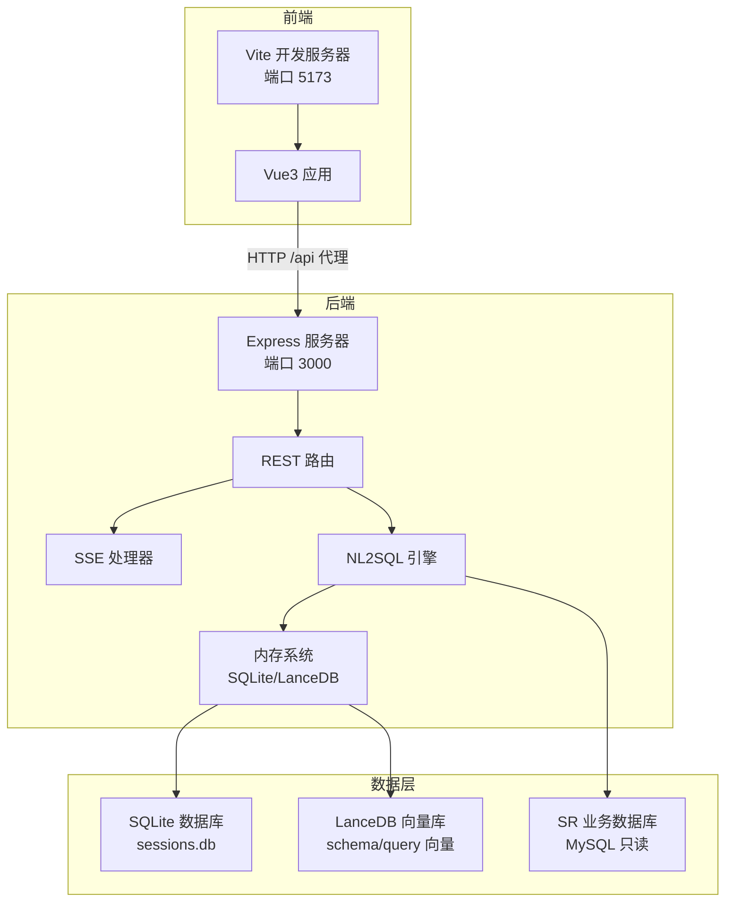
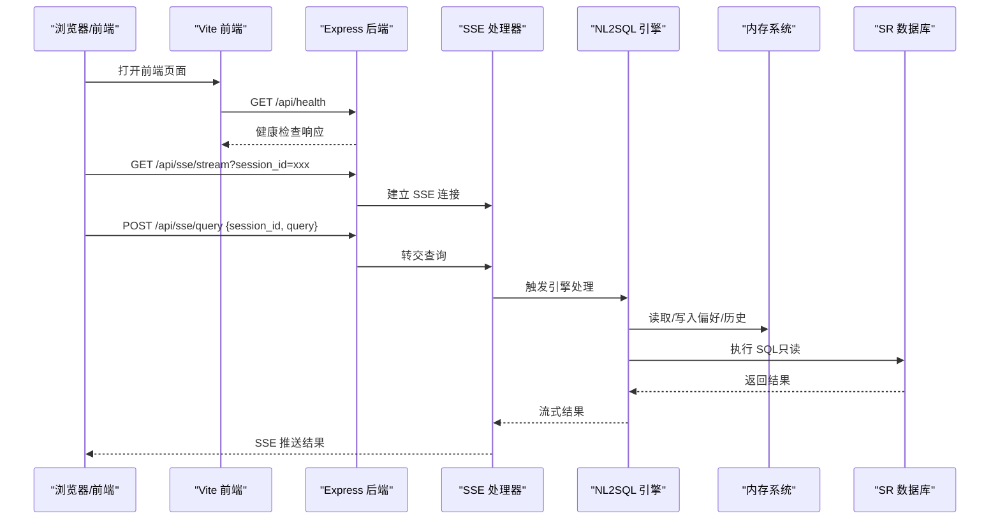
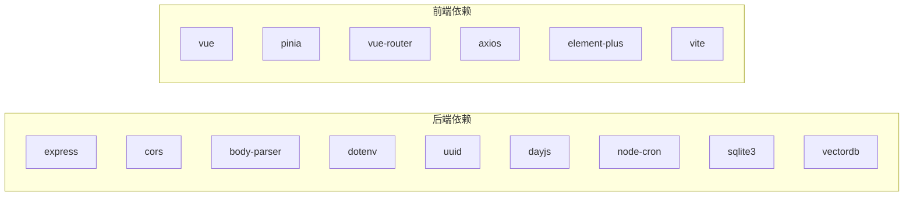

# 快速开始

<cite>
**本文引用的文件**
- [backend/package.json](file://backend/package.json)
- [frontend/package.json](file://frontend/package.json)
- [backend/src/app.js](file://backend/src/app.js)
- [backend/config/schema-metadata.example.json](file://backend/config/schema-metadata.example.json)
- [backend/config/business-semantic-layer.json](file://backend/config/business-semantic-layer.json)
- [backend/config/feature-flags.js](file://backend/config/feature-flags.js)
- [backend/src/core/config.js](file://backend/src/core/config.js)
- [backend/src/core/routes.js](file://backend/src/core/routes.js)
- [backend/src/core/nl2sqlEngine.js](file://backend/src/core/nl2sqlEngine.js)
- [backend/src/core/database.js](file://backend/src/core/database.js)
- [backend/src/core/sseHandler.js](file://backend/src/core/sseHandler.js)
- [frontend/vite.config.js](file://frontend/vite.config.js)
- [CLAUDE.md](file://CLAUDE.md)
</cite>

## 目录
1. [简介](#简介)
2. [项目结构](#项目结构)
3. [核心组件](#核心组件)
4. [架构总览](#架构总览)
5. [详细组件分析](#详细组件分析)
6. [依赖分析](#依赖分析)
7. [性能考虑](#性能考虑)
8. [故障排除指南](#故障排除指南)
9. [结论](#结论)
10. [附录](#附录)

## 简介
本指南面向首次接触 NL2SQL 项目的开发者与使用者，帮助你在本地快速搭建并运行服务，完成从环境准备、项目克隆、依赖安装、配置文件设置，到启动服务与基本验证的全流程。你将学会：
- 准备 Node.js 与 Git 环境
- 克隆仓库并安装前后端依赖
- 配置 .env 环境变量、Schema 元数据与业务语义层
- 启动后端与前端服务并进行健康检查
- 使用自然语言进行查询并获取 SQL 结果
- 常见问题排查与故障排除

## 项目结构
NL2SQL 采用前后端分离架构，后端基于 Node.js + Express，前端基于 Vue3 + Vite，数据层包含 SQLite 会话与查询历史、LanceDB 向量数据库以及目标业务数据库（MySQL）。关键目录与职责如下：
- backend：后端服务，包含核心引擎、路由、配置、内存系统与工具模块
- frontend：前端应用，提供聊天界面、历史与评估视图
- docs：项目文档与优化方案
- CLAUDE.md：开发命令、架构说明与 API 端点清单

图表来源
- [backend/src/app.js:1-266](file://backend/src/app.js#L1-L266)
- [backend/src/core/routes.js:1-1037](file://backend/src/core/routes.js#L1-L1037)
- [backend/src/core/sseHandler.js:1-200](file://backend/src/core/sseHandler.js#L1-L200)
- [frontend/vite.config.js:1-93](file://frontend/vite.config.js#L1-L93)

章节来源
- [CLAUDE.md:41-58](file://CLAUDE.md#L41-L58)

## 核心组件
- 配置中心：集中管理 LLM、数据库、安全、日志、Schema、功能开关等配置，并在启动时进行校验
- 路由与 API：提供健康检查、Schema 查询、会话管理、查询历史、评估统计、SSE 流式通信等接口
- NL2SQL 引擎：核心工作流，从意图识别到 SQL 生成、验证、执行与结果格式化
- SSE 处理器：管理长连接，支持多标签页，向客户端流式推送结果
- 内存系统：会话历史、向量检索与长期记忆，支撑上下文与偏好学习

章节来源
- [backend/src/core/config.js:1-398](file://backend/src/core/config.js#L1-L398)
- [backend/src/core/routes.js:1-1037](file://backend/src/core/routes.js#L1-L1037)
- [backend/src/core/nl2sqlEngine.js:1-200](file://backend/src/core/nl2sqlEngine.js#L1-L200)
- [backend/src/core/sseHandler.js:1-200](file://backend/src/core/sseHandler.js#L1-L200)

## 架构总览
后端通过 Express 提供 REST API 与 SSE 端点，前端通过 Vite 代理将 /api 请求转发至后端。NL2SQL 引擎结合向量检索与 LLM，将自然语言转换为 SQL 并执行，最终通过 SSE 推送结果。

图表来源
- [backend/src/core/routes.js:947-1002](file://backend/src/core/routes.js#L947-L1002)
- [backend/src/core/sseHandler.js:43-112](file://backend/src/core/sseHandler.js#L43-L112)
- [backend/src/core/nl2sqlEngine.js:1-200](file://backend/src/core/nl2sqlEngine.js#L1-L200)

## 详细组件分析

### 环境准备与安装
- Node.js 版本要求：后端工程要求 Node.js >= 18.0.0
- Git：用于克隆仓库
- 数据库准备：
  - SR 业务数据库（MySQL）：提供只读连接串，用于实际查询
  - SQLite：用于会话与历史存储，随应用自动初始化
  - LanceDB：用于 Schema 与查询历史的向量索引，随应用自动初始化

章节来源
- [backend/package.json:24-26](file://backend/package.json#L24-L26)

### 克隆与依赖安装
- 克隆仓库后，分别进入 backend 与 frontend 目录安装依赖
- 后端使用 npm scripts 启动开发与生产模式
- 前端使用 Vite 开发服务器，端口 5173，并通过代理将 /api 请求转发至后端 3000 端口

章节来源
- [CLAUDE.md:11-23](file://CLAUDE.md#L11-L23)
- [frontend/vite.config.js:18-35](file://frontend/vite.config.js#L18-L35)

### 环境变量与配置文件
- .env 环境变量（位于 backend/.env）：
  - LLM_API_BASE：兼容 OpenAI 格式的 LLM API 地址
  - LLM_API_KEY：LLM API 密钥
  - LLM_MODEL：主模型名称
  - EMBEDDING_MODEL：Embedding 模型名称
  - SR_DATABASE_URL：目标 SR 数据库连接串（只读）
  - SCHEMA_REVECTORIZE：Schema 变更后强制重新向量化索引
- 配置文件：
  - 后端配置中心：集中管理端口、LLM、数据库、安全、日志、Schema、功能开关等
  - Schema 元数据：定义表结构、字段、关系、业务关键词、指标与维度
  - 业务语义层：将“老平台”等业务术语映射到物理表/字段
  - 功能开关：通过环境变量控制 Phase 1–4 的功能启用与回滚

章节来源
- [CLAUDE.md:27-40](file://CLAUDE.md#L27-L40)
- [backend/src/core/config.js:16-398](file://backend/src/core/config.js#L16-L398)
- [backend/config/schema-metadata.example.json:1-328](file://backend/config/schema-metadata.example.json#L1-L328)
- [backend/config/business-semantic-layer.json:1-189](file://backend/config/business-semantic-layer.json#L1-L189)
- [backend/config/feature-flags.js:16-96](file://backend/config/feature-flags.js#L16-L96)

### 启动服务与验证
- 启动后端：在 backend 目录执行开发脚本，监听 3000 端口
- 启动前端：在 frontend 目录执行开发脚本，监听 5173 端口
- 健康检查：访问后端 /api/health 或 /api/health/detail
- SSE 连接：GET /api/sse/stream?session_id=xxx 建立长连接
- 查询提交：POST /api/sse/query 提交查询，结果通过 SSE 推送

章节来源
- [backend/src/app.js:175-186](file://backend/src/app.js#L175-L186)
- [backend/src/core/routes.js:72-137](file://backend/src/core/routes.js#L72-L137)
- [backend/src/core/routes.js:957-996](file://backend/src/core/routes.js#L957-L996)

### 基本使用示例
- 创建会话：POST /api/sessions
- 发送查询：POST /api/sse/query，携带 session_id 与 query
- 查看 Schema：GET /api/schema 或按类型筛选
- 获取历史：GET /api/queries/history
- 获取统计：GET /api/stats
- 获取配置：GET /api/config

章节来源
- [backend/src/core/routes.js:266-398](file://backend/src/core/routes.js#L266-L398)
- [backend/src/core/routes.js:150-186](file://backend/src/core/routes.js#L150-L186)
- [backend/src/core/routes.js:413-450](file://backend/src/core/routes.js#L413-L450)
- [backend/src/core/routes.js:866-913](file://backend/src/core/routes.js#L866-L913)
- [backend/src/core/routes.js:924-942](file://backend/src/core/routes.js#L924-L942)

## 依赖分析
- 后端依赖：Express、CORS、body-parser、dotenv、uuid、dayjs、node-cron、sqlite3、vectordb 等
- 前端依赖：Vue3、Element Plus、Pinia、Vue Router、Axios、Vite 等
- 开发依赖：nodemon（后端热重载）

图表来源
- [backend/package.json:10-26](file://backend/package.json#L10-L26)
- [frontend/package.json:11-29](file://frontend/package.json#L11-L29)

章节来源
- [backend/package.json:1-28](file://backend/package.json#L1-L28)
- [frontend/package.json:1-36](file://frontend/package.json#L1-L36)

## 性能考虑
- 查询超时与行数限制：通过配置项限制单次查询的返回行数与执行时间，避免大查询导致资源耗尽
- 白名单与安全：仅允许白名单内的表被查询，禁止危险关键字，保护数据库安全
- 向量检索与缓存：Schema 向量化与缓存可显著提升相关表检索效率
- 功能开关：按 Phase 逐步启用新能力，避免一次性引入过多复杂性
- 日志与监控：合理设置日志级别与文件轮转，避免磁盘占用过大

章节来源
- [backend/src/core/config.js:140-170](file://backend/src/core/config.js#L140-L170)
- [backend/src/core/config.js:240-250](file://backend/src/core/config.js#L240-L250)

## 故障排除指南
- 启动失败（配置缺失）：检查 .env 中 LLM_API_KEY 与 SR_DATABASE_URL 是否正确设置
- CORS 跨域问题：前端已通过 Vite 代理解决，确认代理配置与后端端口一致
- Schema 未加载：确认 schema-metadata.json 路径与内容正确，必要时设置 SCHEMA_REVECTORIZE=true 重启
- SSE 连接失败：确认 session_id 参数有效，查看后端日志定位会话状态
- 查询无结果：检查白名单与禁止关键字，确认 SR 数据库连接可用
- 评估功能不可用：设置 EVALUATION_ENABLED=true 并确认评估开关

章节来源
- [backend/src/core/config.js:366-388](file://backend/src/core/config.js#L366-L388)
- [CLAUDE.md:25-26](file://CLAUDE.md#L25-L26)
- [backend/src/core/routes.js:957-996](file://backend/src/core/routes.js#L957-L996)

## 结论
通过本快速开始指南，你已经完成了 NL2SQL 项目的环境准备、依赖安装、配置与启动，并掌握了基本的查询与验证方法。建议在生产环境中：
- 明确白名单与安全策略
- 启用评估与监控
- 按 Phase 逐步启用功能开关
- 定期维护向量索引与长期记忆

## 附录

### 环境变量与配置项对照
- LLM_API_BASE、LLM_API_KEY、LLM_MODEL、EMBEDDING_MODEL、SR_DATABASE_URL、SCHEMA_REVECTORIZE、EVALUATION_ENABLED 等
- 后端配置中心涵盖端口、LLM、数据库、安全、日志、Schema、功能开关等

章节来源
- [CLAUDE.md:27-40](file://CLAUDE.md#L27-L40)
- [backend/src/core/config.js:16-398](file://backend/src/core/config.js#L16-L398)

### API 端点一览
- 健康检查：GET /api/health, GET /api/health/detail
- Schema：GET /api/schema, GET /api/schema/tables/:tableName, GET /api/schema/search
- 会话：POST /api/sessions, GET /api/sessions/:sessionId, DELETE /api/sessions/:sessionId, GET /api/sessions/:sessionId/messages, GET /api/users/:userId/sessions
- 查询历史：GET /api/queries/history
- SSE：GET /api/sse/stream, POST /api/sse/query
- 评估：GET /api/evaluation/stats, POST /api/evaluation/stats/reset, POST /api/evaluation/schema-quality, POST /api/evaluation/query-quality, GET /api/evaluation/config
- 统计：GET /api/stats
- 配置：GET /api/config

章节来源
- [backend/src/core/routes.js:72-137](file://backend/src/core/routes.js#L72-L137)
- [backend/src/core/routes.js:150-250](file://backend/src/core/routes.js#L150-L250)
- [backend/src/core/routes.js:266-398](file://backend/src/core/routes.js#L266-L398)
- [backend/src/core/routes.js:413-450](file://backend/src/core/routes.js#L413-L450)
- [backend/src/core/routes.js:947-1002](file://backend/src/core/routes.js#L947-L1002)
- [backend/src/core/routes.js:866-913](file://backend/src/core/routes.js#L866-L913)
- [backend/src/core/routes.js:924-942](file://backend/src/core/routes.js#L924-L942)