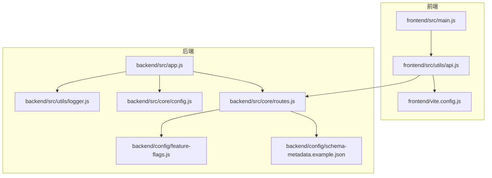
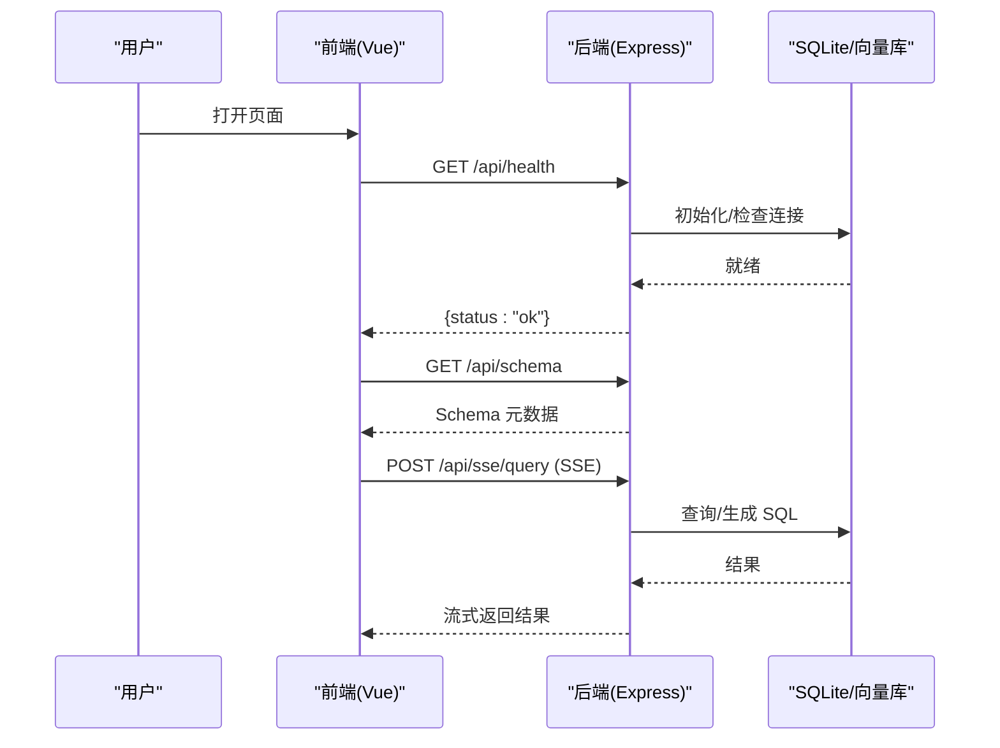
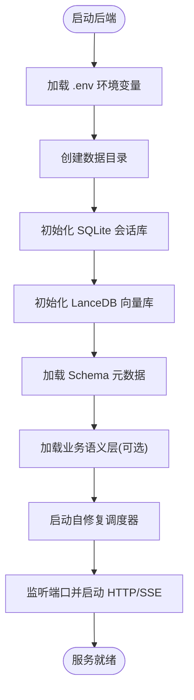
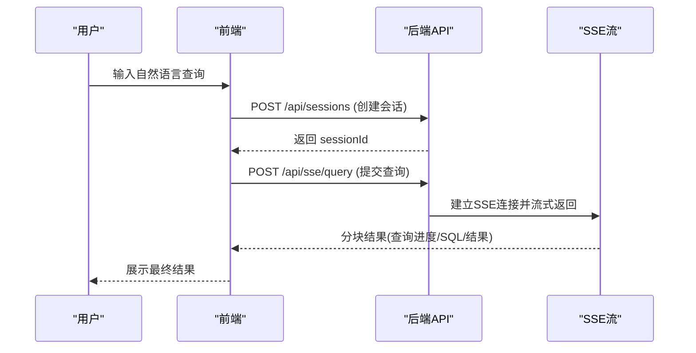
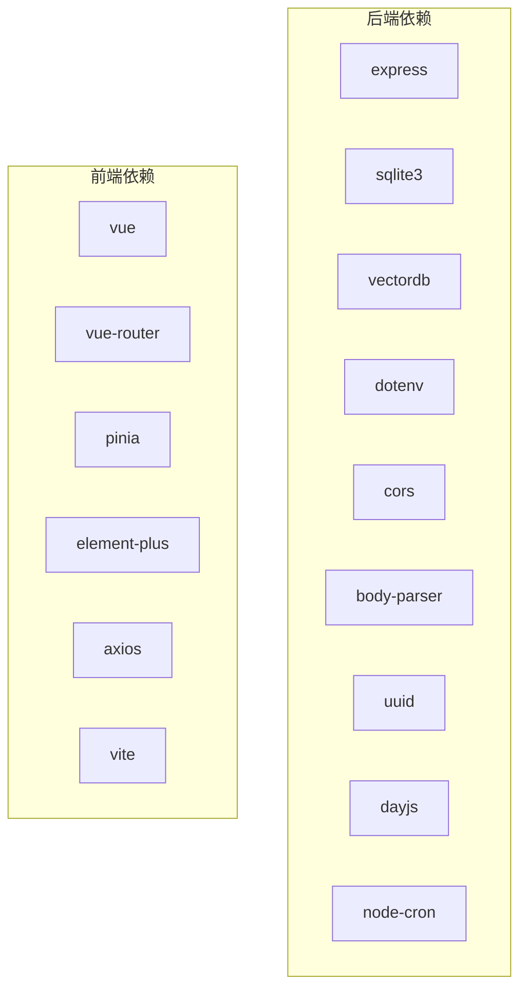

# 快速开始

<cite>
**本文引用的文件**
- [backend/package.json](file://backend/package.json)
- [frontend/package.json](file://frontend/package.json)
- [backend/src/app.js](file://backend/src/app.js)
- [frontend/vite.config.js](file://frontend/vite.config.js)
- [backend/config/schema-metadata.example.json](file://backend/config/schema-metadata.example.json)
- [backend/config/feature-flags.js](file://backend/config/feature-flags.js)
- [backend/src/core/config.js](file://backend/src/core/config.js)
- [backend/src/utils/logger.js](file://backend/src/utils/logger.js)
- [backend/src/core/routes.js](file://backend/src/core/routes.js)
- [frontend/src/main.js](file://frontend/src/main.js)
- [frontend/src/utils/api.js](file://frontend/src/utils/api.js)
</cite>

## 目录
1. [简介](#简介)
2. [项目结构](#项目结构)
3. [核心组件](#核心组件)
4. [架构概览](#架构概览)
5. [详细组件分析](#详细组件分析)
6. [依赖分析](#依赖分析)
7. [性能考虑](#性能考虑)
8. [故障排除指南](#故障排除指南)
9. [结论](#结论)
10. [附录](#附录)

## 简介
本指南面向首次接触 NL2SQL 项目的用户，帮助你在约 30 分钟内完成环境准备、依赖安装、配置设置，并成功启动后端与前端服务，体验第一次自然语言查询到 SQL 的核心流程。文档涵盖：
- 环境准备与 Node.js 版本要求
- 后端与前端依赖安装与配置
- 开发模式与生产模式差异
- 基本使用示例（健康检查、Schema 查看、查询提交）
- 常见环境配置问题与解决方案
- 故障排除与常见错误定位

## 项目结构
NL2SQL 采用前后端分离架构：
- 后端基于 Express，提供 REST API 与 SSE 流式响应
- 前端基于 Vue 3 + Vite，提供聊天界面与 Schema 浏览
- 配置集中于后端 config 目录，支持功能开关与运行参数
- 日志系统统一管理，支持文件轮转与控制台输出

**图表来源**
- [frontend/src/main.js:1-89](file://frontend/src/main.js#L1-L89)
- [frontend/src/utils/api.js:1-303](file://frontend/src/utils/api.js#L1-L303)
- [frontend/vite.config.js:1-93](file://frontend/vite.config.js#L1-L93)
- [backend/src/app.js:1-260](file://backend/src/app.js#L1-L260)
- [backend/src/core/routes.js:1-800](file://backend/src/core/routes.js#L1-L800)
- [backend/src/core/config.js:1-398](file://backend/src/core/config.js#L1-L398)
- [backend/config/feature-flags.js:1-249](file://backend/config/feature-flags.js#L1-L249)
- [backend/config/schema-metadata.example.json:1-328](file://backend/config/schema-metadata.example.json#L1-L328)
- [backend/src/utils/logger.js:1-442](file://backend/src/utils/logger.js#L1-L442)

**章节来源**
- [backend/src/app.js:1-260](file://backend/src/app.js#L1-L260)
- [frontend/src/main.js:1-89](file://frontend/src/main.js#L1-L89)
- [frontend/vite.config.js:1-93](file://frontend/vite.config.js#L1-L93)

## 核心组件
- 后端入口与初始化：负责加载环境变量、初始化数据库与向量库、挂载路由、启动 HTTP 与 SSE 服务，并处理优雅关闭。
- 配置管理：集中管理 LLM API、数据库、安全策略、日志、Schema 缓存、功能开关等。
- 日志系统：统一输出到控制台与文件，支持级别控制与追踪会话。
- 前端入口与 API 封装：创建 Vue 应用、安装路由与状态管理、封装 axios 与后端 API。

**章节来源**
- [backend/src/app.js:97-188](file://backend/src/app.js#L97-L188)
- [backend/src/core/config.js:16-398](file://backend/src/core/config.js#L16-L398)
- [backend/src/utils/logger.js:54-442](file://backend/src/utils/logger.js#L54-L442)
- [frontend/src/main.js:55-89](file://frontend/src/main.js#L55-L89)

## 架构概览
后端启动流程（简化）：
1. 加载 .env 环境变量
2. 初始化数据目录、SQLite 会话库、LanceDB 向量库
3. 加载 Schema 元数据与业务语义层
4. 启动自修复调度器
5. 监听配置端口（默认 3000），启动 HTTP 与 SSE 服务

**图表来源**
- [backend/src/app.js:97-188](file://backend/src/app.js#L97-L188)
- [backend/src/core/routes.js:72-137](file://backend/src/core/routes.js#L72-L137)
- [frontend/src/utils/api.js:246-251](file://frontend/src/utils/api.js#L246-L251)

## 详细组件分析

### 环境准备与依赖安装
- Node.js 版本要求：后端 package.json 明确要求 Node.js >= 18.0.0。
- 依赖安装：
  - 后端：进入 backend 目录，执行依赖安装命令（如 npm install）。
  - 前端：进入 frontend 目录，执行依赖安装命令（如 npm install）。
- 开发脚本：
  - 后端：dev 脚本使用 nodemon 实现热重启；start 脚本用于生产启动。
  - 前端：dev 脚本启动 Vite 开发服务器；build 用于生产构建；preview 用于本地预览。

**章节来源**
- [backend/package.json:24-26](file://backend/package.json#L24-L26)
- [backend/package.json:6-8](file://backend/package.json#L6-L8)
- [frontend/package.json:6-10](file://frontend/package.json#L6-L10)

### 配置设置与功能开关
- 环境变量与配置：
  - 后端通过 dotenv 加载 .env 文件，配置项集中于 config.js，包括 LLM API、数据库、安全策略、日志、Schema 缓存等。
  - 前端通过 Vite 的 proxy 将 /api 代理到后端（默认 http://localhost:3000）。
- 功能开关：
  - feature-flags.js 提供多阶段功能开关（Schema 探索、动态意图拆解、澄清机制、Agentic 引擎、自我修正等），可通过环境变量启用/禁用。
- Schema 元数据：
  - schema-metadata.example.json 提供示例表结构、字段、关系、指标与维度配置，启动时加载并可选择向量化。

**图表来源**
- [backend/src/app.js:97-188](file://backend/src/app.js#L97-L188)
- [backend/src/core/config.js:16-398](file://backend/src/core/config.js#L16-L398)
- [backend/config/feature-flags.js:16-96](file://backend/config/feature-flags.js#L16-L96)

**章节来源**
- [backend/src/app.js:15-188](file://backend/src/app.js#L15-L188)
- [backend/src/core/config.js:16-398](file://backend/src/core/config.js#L16-L398)
- [backend/config/feature-flags.js:16-249](file://backend/config/feature-flags.js#L16-L249)
- [backend/config/schema-metadata.example.json:1-328](file://backend/config/schema-metadata.example.json#L1-L328)

### 启动流程（开发模式 vs 生产模式）
- 开发模式（后端）：
  - 使用 dev 脚本（nodemon）启动，自动监听文件变化重启服务。
  - 日志级别默认开发环境，便于调试。
- 生产模式（后端）：
  - 使用 start 脚本（node）启动，适合容器或服务器部署。
  - NODE_ENV 可设为 production，减少日志冗余并启用性能优化。
- 前端开发模式：
  - Vite 开发服务器默认端口 5173，自动打开浏览器。
  - 通过 proxy 将 /api 代理到后端（默认 http://localhost:3000）。

**章节来源**
- [backend/package.json:6-8](file://backend/package.json#L6-L8)
- [backend/src/core/config.js:33-49](file://backend/src/core/config.js#L33-L49)
- [frontend/vite.config.js:18-35](file://frontend/vite.config.js#L18-L35)

### 基本使用示例
以下示例展示从健康检查到第一次查询的完整流程：

1) 健康检查
- 后端：GET /api/health
- 前端：调用 api.getHealth()

2) 查看 Schema
- 后端：GET /api/schema
- 前端：调用 api.getSchema()

3) 提交查询（SSE）
- 后端：POST /api/sse/query（通过 SSE 推送结果）
- 前端：调用 api.sendQuery(sessionId, query)

**图表来源**
- [frontend/src/utils/api.js:160-165](file://frontend/src/utils/api.js#L160-L165)
- [frontend/src/utils/api.js:246-251](file://frontend/src/utils/api.js#L246-L251)
- [backend/src/core/routes.js:72-137](file://backend/src/core/routes.js#L72-L137)

**章节来源**
- [frontend/src/utils/api.js:98-108](file://frontend/src/utils/api.js#L98-L108)
- [frontend/src/utils/api.js:118-141](file://frontend/src/utils/api.js#L118-L141)
- [frontend/src/utils/api.js:246-251](file://frontend/src/utils/api.js#L246-L251)
- [backend/src/core/routes.js:72-137](file://backend/src/core/routes.js#L72-L137)

## 依赖分析
- 后端依赖：
  - express：Web 服务器与路由
  - sqlite3：会话与查询历史存储
  - vectordb：LanceDB 向量数据库
  - dotenv/cors/body-parser/uuid/dayjs/node-cron：环境变量、跨域、请求解析、ID 生成、时间与定时任务
- 前端依赖：
  - vue、vue-router、pinia：框架与状态管理
  - element-plus、axios：UI 组件库与 HTTP 客户端
  - vite：开发与构建工具

**图表来源**
- [backend/package.json:10-23](file://backend/package.json#L10-L23)
- [frontend/package.json:11-34](file://frontend/package.json#L11-L34)

**章节来源**
- [backend/package.json:10-23](file://backend/package.json#L10-L23)
- [frontend/package.json:11-34](file://frontend/package.json#L11-L34)

## 性能考虑
- 日志级别与输出：开发环境默认较详细，生产环境建议降低日志级别并启用文件轮转，避免磁盘压力。
- 查询限制：安全配置包含最大行数限制与查询超时，防止大查询导致资源耗尽。
- 向量库与 Schema 缓存：合理设置缓存过期时间与 revectorize 策略，平衡准确性与性能。
- SSE 流式响应：前端通过 SSE 接收增量结果，提升交互体验。

**章节来源**
- [backend/src/core/config.js:195-213](file://backend/src/core/config.js#L195-L213)
- [backend/src/core/config.js:150-170](file://backend/src/core/config.js#L150-L170)
- [backend/src/core/config.js:240-250](file://backend/src/core/config.js#L240-L250)
- [backend/src/utils/logger.js:54-85](file://backend/src/utils/logger.js#L54-L85)

## 故障排除指南
常见问题与解决方案：
- Node.js 版本不满足要求
  - 症状：安装或启动时报错，提示 Node.js 版本过低
  - 处理：升级至 Node.js >= 18.0.0
  - 参考：[backend/package.json:24-26](file://backend/package.json#L24-L26)
- 后端启动失败（数据库/向量库初始化）
  - 症状：启动日志显示初始化失败并退出
  - 处理：检查数据目录权限、SQLite 与 LanceDB 可用性；确认 .env 中数据库连接配置
  - 参考：[backend/src/app.js:103-187](file://backend/src/app.js#L103-L187)
- 健康检查失败
  - 症状：GET /api/health 返回非 ok
  - 处理：查看详细健康检查 /api/health/detail，定位数据库、Schema 或 SSE 组件状态
  - 参考：[backend/src/core/routes.js:100-137](file://backend/src/core/routes.js#L100-L137)
- 前端无法访问后端 API
  - 症状：浏览器控制台出现跨域或 404
  - 处理：确认 Vite 代理配置将 /api 代理到 http://localhost:3000；后端端口与配置一致
  - 参考：[frontend/vite.config.js:24-35](file://frontend/vite.config.js#L24-L35)
- LLM API 配置错误
  - 症状：查询报错或无响应
  - 处理：检查 .env 中 LLM_API_BASE、LLM_API_KEY、LLM_MODEL 等配置；必要时调整超时与重试
  - 参考：[backend/src/core/config.js:60-87](file://backend/src/core/config.js#L60-L87)
- 功能开关导致行为异常
  - 症状：某些新功能未生效或产生意外行为
  - 处理：检查 feature-flags.js 中相关开关，必要时设置 FF_DISABLE_ALL 或 FF_ENABLE_ALL
  - 参考：[backend/config/feature-flags.js:16-96](file://backend/config/feature-flags.js#L16-L96)

**章节来源**
- [backend/src/app.js:103-187](file://backend/src/app.js#L103-L187)
- [backend/src/core/routes.js:100-137](file://backend/src/core/routes.js#L100-L137)
- [frontend/vite.config.js:24-35](file://frontend/vite.config.js#L24-L35)
- [backend/src/core/config.js:60-87](file://backend/src/core/config.js#L60-L87)
- [backend/config/feature-flags.js:16-96](file://backend/config/feature-flags.js#L16-L96)

## 结论
按照本指南，你可以在 30 分钟内完成 NL2SQL 的环境准备与首次运行体验。建议先完成环境与依赖准备，再逐步启用功能开关与自定义配置，最后结合健康检查与日志排查定位问题。随着对项目理解加深，可进一步扩展 Schema、优化查询策略与性能配置。

## 附录

### 快速操作清单
- 确认 Node.js 版本 ≥ 18.0.0
- 在 backend/frontend 目录分别执行依赖安装
- 启动后端 dev 脚本（监听 3000 端口）
- 启动前端 dev 脚本（监听 5173 端口）
- 打开浏览器访问前端页面，进行健康检查与 Schema 查看
- 创建会话并提交自然语言查询，观察 SSE 流式结果

### 关键配置参考
- 后端配置入口：[backend/src/core/config.js:16-398](file://backend/src/core/config.js#L16-L398)
- 功能开关：[backend/config/feature-flags.js:16-249](file://backend/config/feature-flags.js#L16-L249)
- Schema 示例：[backend/config/schema-metadata.example.json:1-328](file://backend/config/schema-metadata.example.json#L1-L328)
- 前端代理配置：[frontend/vite.config.js:18-35](file://frontend/vite.config.js#L18-L35)