# LLM API适配器

<cite>
**本文档引用的文件**
- [config.js](file://backend/src/core/config.js)
- [llmService.js](file://backend/src/core/llmService.js)
- [routes.js](file://backend/src/core/routes.js)
- [logger.js](file://backend/src/utils/logger.js)
- [app.js](file://backend/src/app.js)
- [nl2sqlEngine.js](file://backend/src/core/nl2sqlEngine.js)
- [package.json](file://backend/package.json)
</cite>

## 目录
1. [简介](#简介)
2. [项目结构](#项目结构)
3. [核心组件](#核心组件)
4. [架构概览](#架构概览)
5. [详细组件分析](#详细组件分析)
6. [依赖分析](#依赖分析)
7. [性能考虑](#性能考虑)
8. [故障排除指南](#故障排除指南)
9. [结论](#结论)

## 简介

NL2SQL项目的LLM API适配器是一个关键组件，负责与各种大型语言模型提供商进行通信。该适配器支持多种LLM提供商，包括OpenAI、DeepSeek、Claude等，通过统一的接口抽象实现了对不同API格式的兼容。

该系统的核心目标是将自然语言查询转换为SQL语句，同时提供流式响应支持、错误处理机制和配置管理功能。适配器设计遵循了模块化原则，使得扩展新的LLM提供商变得简单而直观。

## 项目结构

NL2SQL项目采用分层架构设计，LLM API适配器位于核心层，与路由层、服务层和其他组件协同工作。

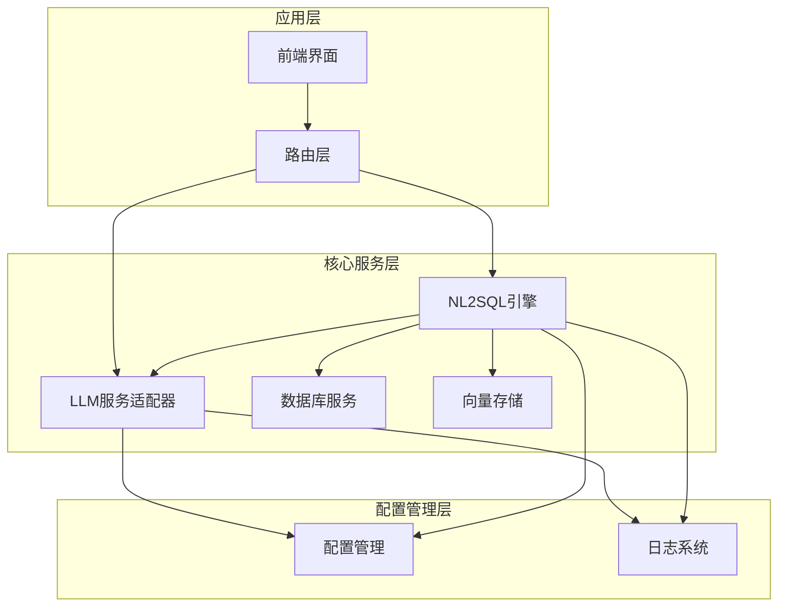

**图表来源**
- [app.js:97-166](file://backend/src/app.js#L97-L166)
- [routes.js:1-800](file://backend/src/core/routes.js#L1-L800)

**章节来源**
- [app.js:1-238](file://backend/src/app.js#L1-L238)
- [package.json:1-28](file://backend/package.json#L1-L28)

## 核心组件

### 配置管理系统

配置管理模块是整个LLM适配器的基础，提供了统一的配置访问接口和验证机制。

#### 配置结构

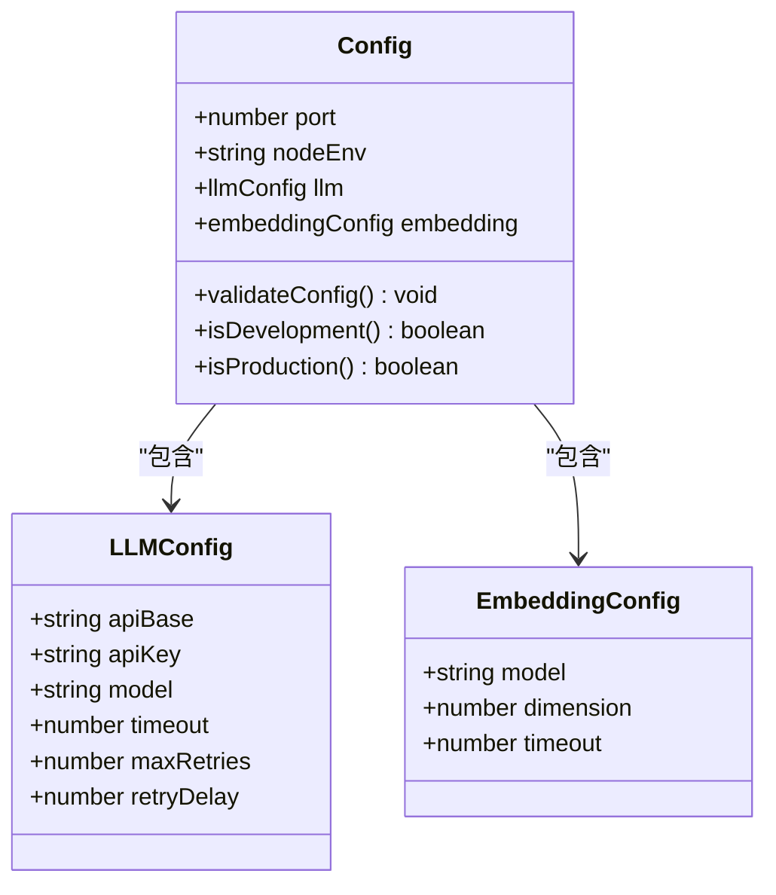

**图表来源**
- [config.js:16-74](file://backend/src/core/config.js#L16-L74)

#### 配置验证机制

配置系统实现了严格的验证机制，确保关键配置项的完整性：

- **必需配置项**：LLM API密钥和数据库连接URL
- **环境检测**：开发环境和生产环境的差异化配置
- **白名单检查**：安全配置的完整性验证

**章节来源**
- [config.js:340-372](file://backend/src/core/config.js#L340-L372)

### HTTP请求封装器

HTTP请求封装器是LLM适配器的核心组件，提供了统一的HTTP通信接口。

#### 请求处理流程

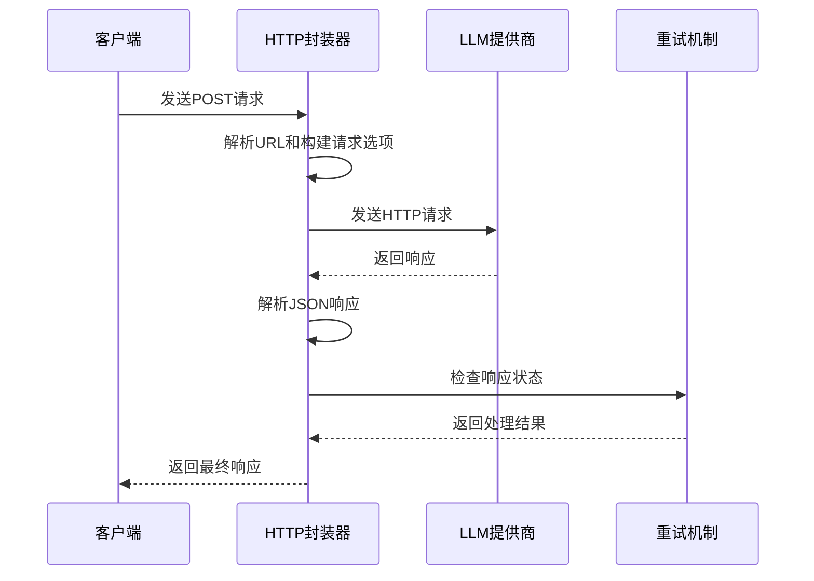

**图表来源**
- [llmService.js:41-152](file://backend/src/core/llmService.js#L41-L152)

#### 超时控制机制

HTTP封装器实现了多层次的超时控制：

- **请求超时**：基于配置的超时设置
- **连接超时**：网络连接建立超时
- **响应超时**：等待响应的超时控制

**章节来源**
- [llmService.js:41-152](file://backend/src/core/llmService.js#L41-L152)

### 重试机制

重试机制确保了LLM调用的可靠性，实现了指数退避策略和最大重试次数控制。

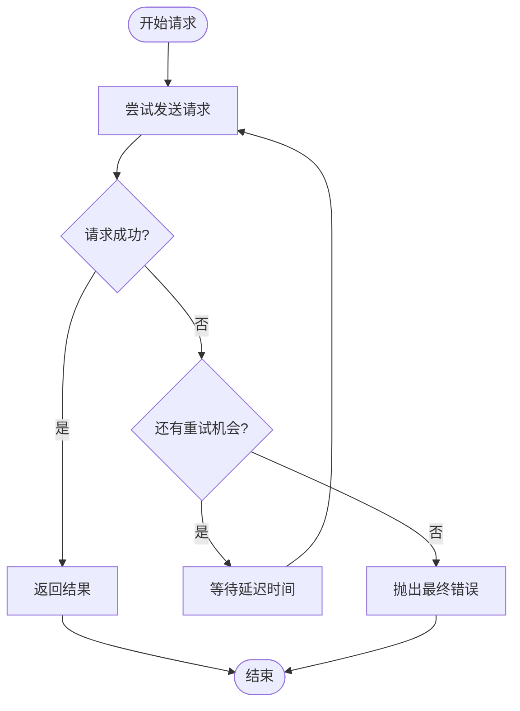

**图表来源**
- [llmService.js:167-195](file://backend/src/core/llmService.js#L167-L195)

**章节来源**
- [llmService.js:167-195](file://backend/src/core/llmService.js#L167-L195)

## 架构概览

NL2SQL项目的LLM API适配器采用了模块化架构设计，支持多种LLM提供商的无缝集成。

### 系统架构图

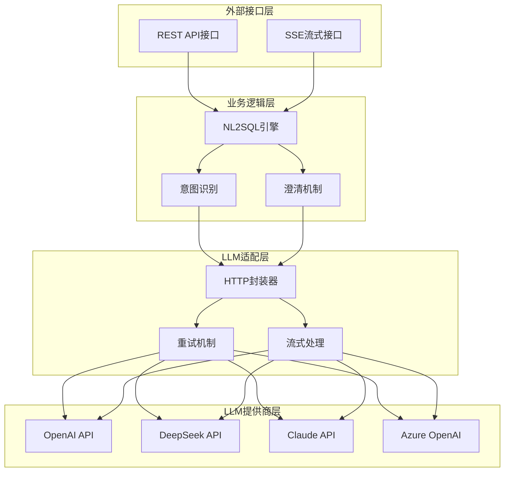

**图表来源**
- [routes.js:70-135](file://backend/src/core/routes.js#L70-L135)
- [nl2sqlEngine.js:497-780](file://backend/src/core/nl2sqlEngine.js#L497-L780)

### 数据流处理

系统实现了完整的数据流处理管道，从用户输入到最终的SQL输出：

1. **用户输入**：自然语言查询
2. **意图识别**：提取查询要素
3. **SQL生成**：构建SQL语句
4. **结果验证**：安全性和语法检查
5. **格式化输出**：自然语言结果

**章节来源**
- [nl2sqlEngine.js:497-780](file://backend/src/core/nl2sqlEngine.js#L497-L780)

## 详细组件分析

### HTTP请求封装器详解

HTTP请求封装器是LLM适配器的核心组件，提供了完整的HTTP通信功能。

#### 请求构建过程

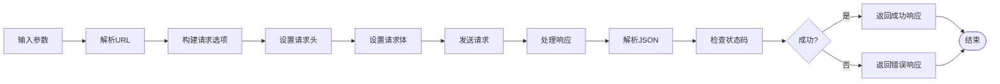

**图表来源**
- [llmService.js:41-152](file://backend/src/core/llmService.js#L41-L152)

#### 错误处理机制

HTTP封装器实现了全面的错误处理机制：

- **网络错误**：连接失败、超时等
- **HTTP错误**：4xx、5xx状态码
- **解析错误**：JSON解析失败
- **业务错误**：LLM返回的错误信息

**章节来源**
- [llmService.js:135-151](file://backend/src/core/llmService.js#L135-L151)

### LLM聊天服务

聊天服务提供了与LLM交互的主要接口，支持普通响应和流式响应两种模式。

#### 聊天请求流程

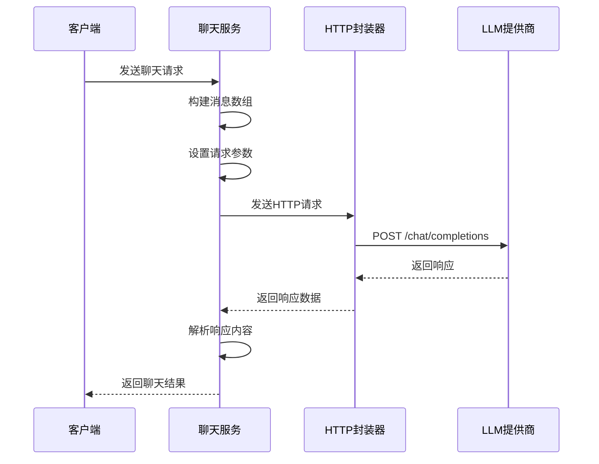

**图表来源**
- [llmService.js:222-277](file://backend/src/core/llmService.js#L222-L277)

#### 流式响应处理

系统支持流式响应处理，适用于长文本生成场景：

- **SSE协议**：Server-Sent Events标准
- **增量传输**：逐步接收响应片段
- **实时渲染**：前端实时显示生成内容

**章节来源**
- [llmService.js:222-277](file://backend/src/core/llmService.js#L222-L277)

### Embedding向量服务

Embedding服务负责将文本转换为向量表示，支持语义检索和相似度计算。

#### 向量生成流程

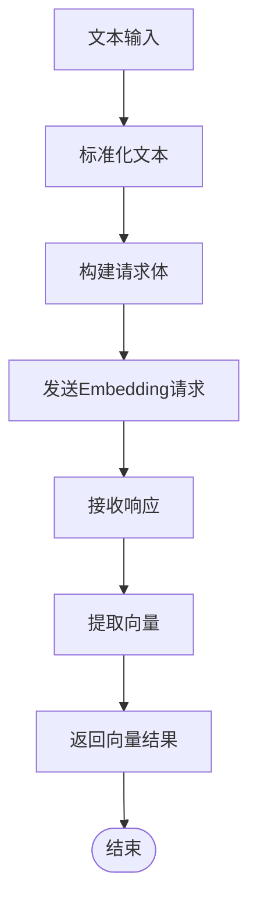

**图表来源**
- [llmService.js:324-379](file://backend/src/core/llmService.js#L324-L379)

**章节来源**
- [llmService.js:324-379](file://backend/src/core/llmService.js#L324-L379)

### 工具定义系统

工具定义系统允许LLM调用外部函数，扩展了模型的能力边界。

#### 工具定义结构

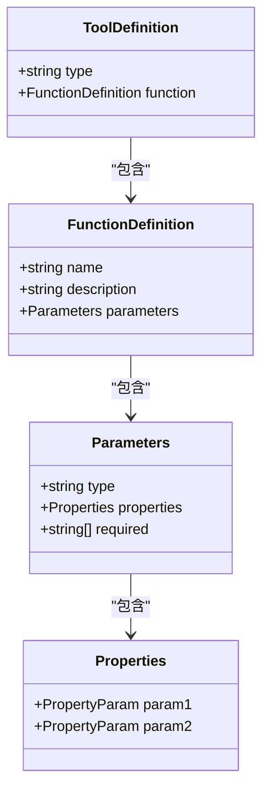

**图表来源**
- [llmService.js:395-415](file://backend/src/core/llmService.js#L395-L415)

**章节来源**
- [llmService.js:395-415](file://backend/src/core/llmService.js#L395-L415)

## 依赖分析

### 外部依赖关系

NL2SQL项目依赖于多个第三方库来实现核心功能：

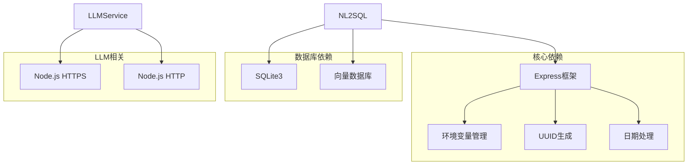

**图表来源**
- [package.json:10-27](file://backend/package.json#L10-L27)

### 内部模块依赖

系统内部模块之间存在清晰的依赖关系：

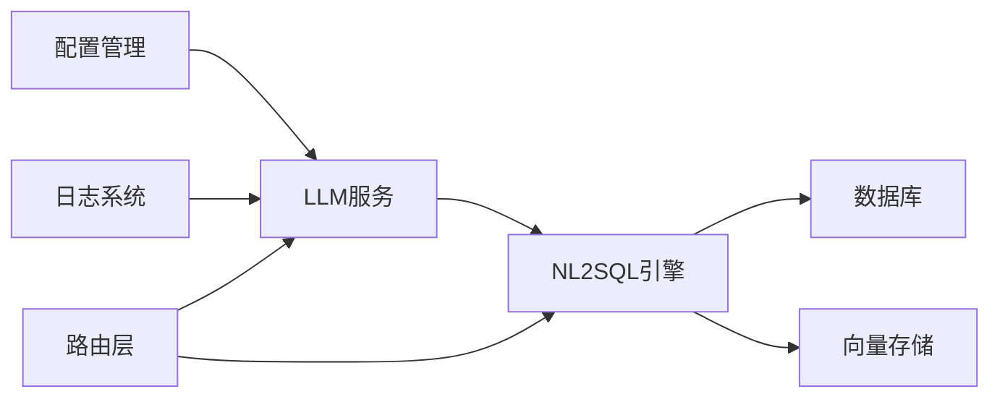

**图表来源**
- [app.js:39-50](file://backend/src/app.js#L39-L50)

**章节来源**
- [package.json:10-27](file://backend/package.json#L10-L27)

## 性能考虑

### 超时配置优化

系统提供了灵活的超时配置机制：

- **LLM请求超时**：默认60秒，可根据模型复杂度调整
- **Embedding请求超时**：默认60秒，支持更长的向量化处理时间
- **重试间隔**：默认1秒，支持指数退避策略

### 内存管理

系统实现了高效的内存管理策略：

- **流式处理**：避免大响应的内存占用
- **连接池**：复用HTTP连接减少资源消耗
- **垃圾回收**：及时释放临时对象

### 并发控制

系统支持并发请求处理：

- **请求队列**：有序处理多个并发请求
- **资源限制**：防止过度消耗系统资源
- **超时保护**：避免请求挂起影响系统稳定性

## 故障排除指南

### 常见配置问题

#### API密钥配置错误

**问题症状**：
- LLM API调用失败
- 返回401未授权错误
- 日志中出现认证失败信息

**解决方案**：
1. 检查环境变量LLM_API_KEY是否正确设置
2. 验证API密钥的有效性和权限范围
3. 确认API密钥未过期

#### API基础URL配置问题

**问题症状**：
- 请求无法到达LLM提供商
- 网络连接超时
- DNS解析失败

**解决方案**：
1. 验证LLM_API_BASE配置格式
2. 确认URL以/v1结尾
3. 检查网络连通性和防火墙设置

### 网络连接问题

#### 超时问题

**问题症状**：
- 请求在指定时间内未完成
- 系统抛出超时错误
- 响应时间异常延长

**解决方案**：
1. 增加LLM_TIMEOUT配置值
2. 检查网络延迟和带宽
3. 考虑使用CDN或就近部署

#### 重试机制失效

**问题症状**：
- 请求失败后不再重试
- 直接返回最终错误
- 重试次数未按预期增加

**解决方案**：
1. 检查maxRetries和retryDelay配置
2. 验证网络连接稳定性
3. 查看日志中的重试记录

### 响应解析错误

#### JSON解析失败

**问题症状**：
- 响应解析抛出JSON错误
- 日志显示响应内容截断
- 系统无法处理LLM响应

**解决方案**：
1. 检查LLM响应格式是否符合预期
2. 验证响应内容的完整性
3. 调整响应大小限制设置

#### 流式响应处理问题

**问题症状**：
- SSE连接中断
- 流式数据丢失
- 前端无法实时接收响应

**解决方案**：
1. 检查SSE服务器配置
2. 验证网络连接稳定性
3. 确认浏览器支持SSE协议

**章节来源**
- [llmService.js:113-131](file://backend/src/core/llmService.js#L113-L131)

## 结论

NL2SQL项目的LLM API适配器展现了优秀的架构设计和实现质量。通过模块化的设计理念，系统成功地抽象了不同LLM提供商的差异，提供了统一的接口和一致的用户体验。

### 主要优势

1. **高度可扩展性**：模块化设计使得添加新的LLM提供商变得简单
2. **强大的错误处理**：完善的错误处理和重试机制确保系统稳定性
3. **灵活的配置管理**：支持多种配置选项和环境定制
4. **性能优化**：流式处理和超时控制提升了系统性能

### 技术亮点

- **统一接口抽象**：隐藏了不同LLM提供商的技术细节
- **智能重试机制**：提高了API调用的成功率
- **流式响应支持**：提供了更好的用户体验
- **完整的日志系统**：便于问题诊断和性能监控

### 未来发展方向

1. **更多LLM提供商支持**：继续扩展对新LLM服务的支持
2. **性能监控增强**：添加更详细的性能指标和监控
3. **安全机制加强**：提升API调用的安全性和防护能力
4. **自动化测试完善**：建立更全面的测试覆盖

该适配器为NL2SQL项目提供了坚实的技术基础，为自然语言到SQL的转换功能奠定了重要的技术支撑。