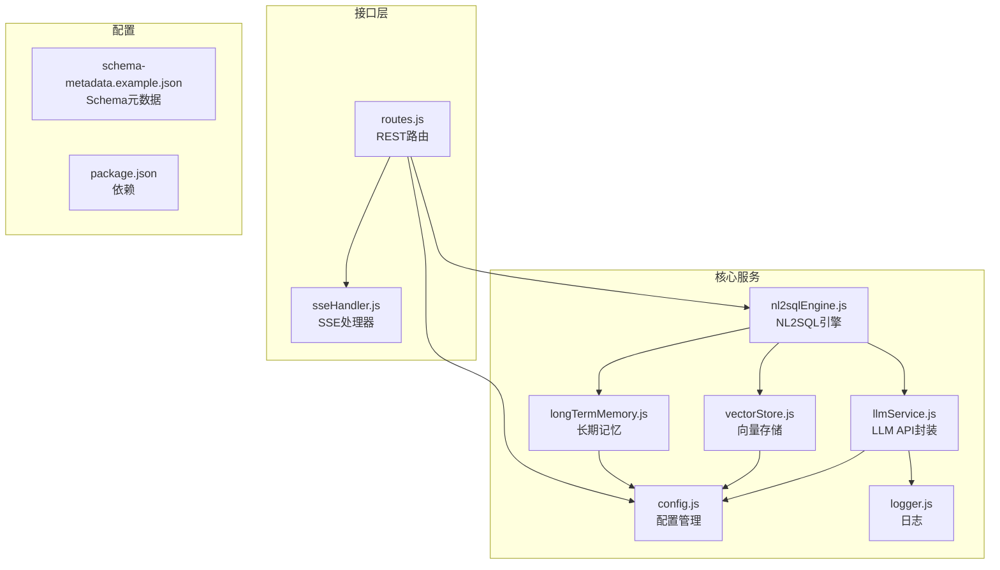
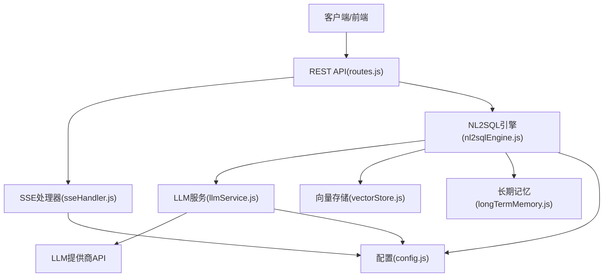
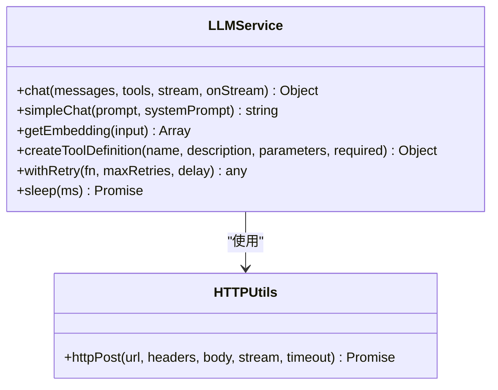
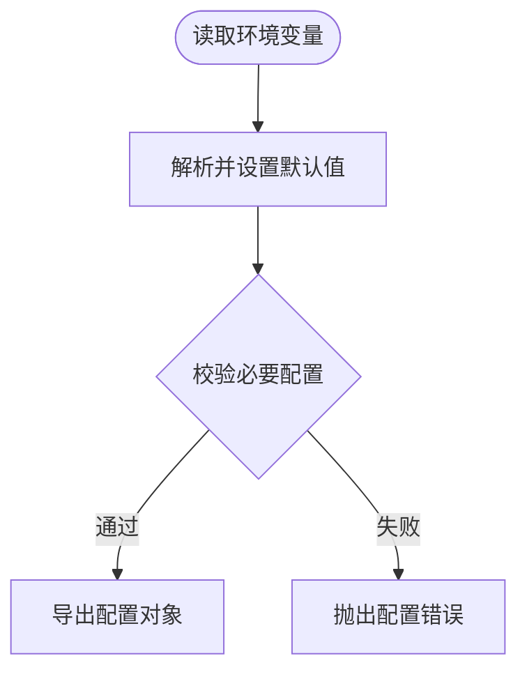
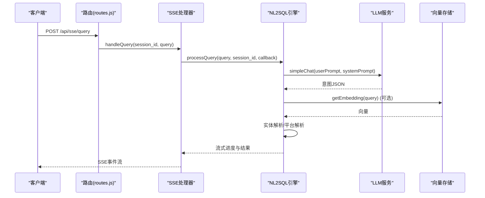
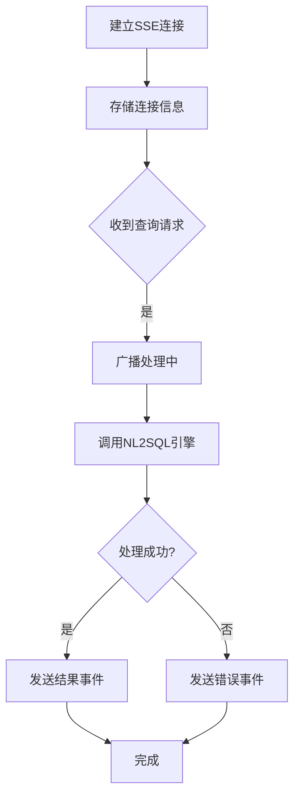
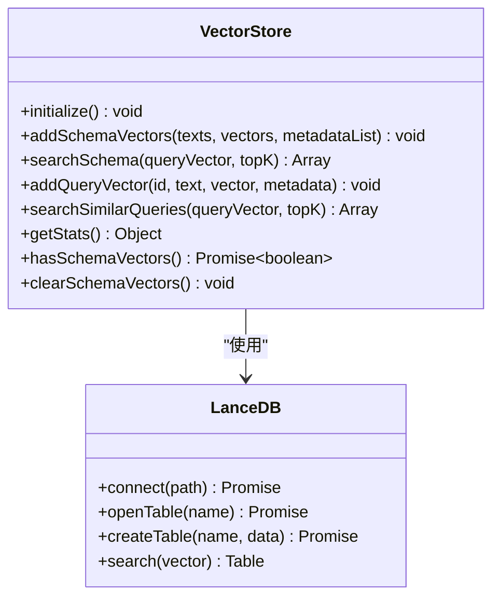
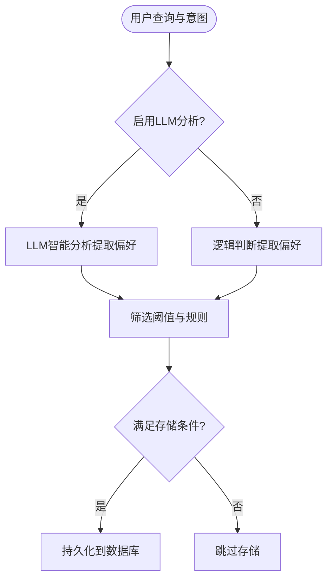
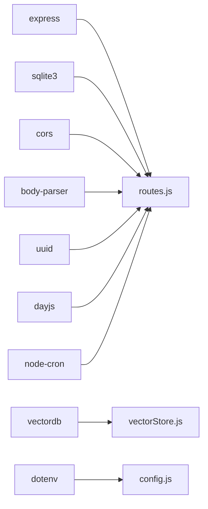

# LLM集成扩展

<cite>
**本文档引用的文件**
- [llmService.js](file://backend/src/core/llmService.js)
- [config.js](file://backend/src/core/config.js)
- [nl2sqlEngine.js](file://backend/src/core/nl2sqlEngine.js)
- [routes.js](file://backend/src/core/routes.js)
- [sseHandler.js](file://backend/src/core/sseHandler.js)
- [vectorStore.js](file://backend/src/memory/vectorStore.js)
- [longTermMemory.js](file://backend/src/memory/longTermMemory.js)
- [logger.js](file://backend/src/utils/logger.js)
- [schema-metadata.example.json](file://backend/config/schema-metadata.example.json)
- [package.json](file://backend/package.json)
</cite>

## 目录
1. [简介](#简介)
2. [项目结构](#项目结构)
3. [核心组件](#核心组件)
4. [架构概览](#架构概览)
5. [详细组件分析](#详细组件分析)
6. [依赖分析](#依赖分析)
7. [性能考虑](#性能考虑)
8. [故障排查指南](#故障排查指南)
9. [结论](#结论)
10. [附录](#附录)

## 简介
本文件面向NL2SQL项目的LLM集成扩展，提供完整的LLM服务适配指南与最佳实践。内容涵盖：
- 新LLM提供商的API适配方法（OpenAI、DeepSeek、Claude等）
- 流式响应处理、批量请求优化与错误重试机制
- 嵌入向量服务扩展与多模态数据处理思路
- 性能监控与成本控制策略

## 项目结构
NL2SQL后端采用模块化设计，LLM相关能力集中在核心服务模块中，并通过路由层暴露REST API与SSE流式接口。

**图表来源**
- [llmService.js:1-432](file://backend/src/core/llmService.js#L1-L432)
- [config.js:1-332](file://backend/src/core/config.js#L1-L332)
- [nl2sqlEngine.js:1-1920](file://backend/src/core/nl2sqlEngine.js#L1-L1920)
- [routes.js:1-895](file://backend/src/core/routes.js#L1-L895)
- [sseHandler.js:1-349](file://backend/src/core/sseHandler.js#L1-L349)
- [vectorStore.js:1-442](file://backend/src/memory/vectorStore.js#L1-L442)
- [longTermMemory.js:1-1134](file://backend/src/memory/longTermMemory.js#L1-L1134)
- [logger.js:1-318](file://backend/src/utils/logger.js#L1-L318)
- [schema-metadata.example.json:1-328](file://backend/config/schema-metadata.example.json#L1-L328)
- [package.json:1-28](file://backend/package.json#L1-L28)

**章节来源**
- [llmService.js:1-432](file://backend/src/core/llmService.js#L1-L432)
- [config.js:1-332](file://backend/src/core/config.js#L1-L332)
- [routes.js:1-895](file://backend/src/core/routes.js#L1-L895)

## 核心组件
- LLM服务模块：封装HTTP请求、重试机制、流式响应与错误处理，统一调用不同LLM提供商的API。
- 配置管理：集中管理LLM API基础地址、模型、超时、重试等参数。
- NL2SQL引擎：基于LLM进行意图识别、澄清、SQL生成与结果解释。
- SSE处理器：支持Server-Sent Events流式推送，实现前端实时交互。
- 向量存储：基于LanceDB的Schema与查询历史向量化存储，支撑语义检索。
- 长期记忆：用户偏好与模式学习，提升后续查询质量。

**章节来源**
- [llmService.js:1-432](file://backend/src/core/llmService.js#L1-L432)
- [nl2sqlEngine.js:1-1920](file://backend/src/core/nl2sqlEngine.js#L1-L1920)
- [sseHandler.js:1-349](file://backend/src/core/sseHandler.js#L1-L349)
- [vectorStore.js:1-442](file://backend/src/memory/vectorStore.js#L1-L442)
- [longTermMemory.js:1-1134](file://backend/src/memory/longTermMemory.js#L1-L1134)

## 架构概览
LLM集成采用统一适配层，通过配置切换不同提供商，核心逻辑保持不变。

**图表来源**
- [routes.js:793-845](file://backend/src/core/routes.js#L793-L845)
- [sseHandler.js:200-349](file://backend/src/core/sseHandler.js#L200-L349)
- [nl2sqlEngine.js:1-1920](file://backend/src/core/nl2sqlEngine.js#L1-L1920)
- [llmService.js:1-432](file://backend/src/core/llmService.js#L1-L432)
- [vectorStore.js:1-442](file://backend/src/memory/vectorStore.js#L1-L442)
- [longTermMemory.js:1-1134](file://backend/src/memory/longTermMemory.js#L1-L1134)
- [config.js:1-332](file://backend/src/core/config.js#L1-L332)

## 详细组件分析

### LLM服务模块（llmService.js）
- HTTP请求封装：支持HTTPS、超时控制、错误处理与响应解析。
- 重试机制：withRetry提供指数退避与最大重试次数控制。
- 聊天接口：支持普通与流式响应，自动拼装Authorization头与请求体。
- Embedding接口：统一向量维度与批量处理，支持单/多文本输入。
- 工具定义：createToolDefinition辅助构建函数调用工具定义。

**图表来源**
- [llmService.js:30-152](file://backend/src/core/llmService.js#L30-L152)
- [llmService.js:158-206](file://backend/src/core/llmService.js#L158-L206)
- [llmService.js:222-277](file://backend/src/core/llmService.js#L222-L277)
- [llmService.js:324-379](file://backend/src/core/llmService.js#L324-L379)
- [llmService.js:395-415](file://backend/src/core/llmService.js#L395-L415)

**章节来源**
- [llmService.js:1-432](file://backend/src/core/llmService.js#L1-L432)

### 配置管理（config.js）
- LLM配置：apiBase、apiKey、model、timeout、maxRetries、retryDelay。
- Embedding配置：model、dimension、timeout。
- 数据库与向量库：SQLite与LanceDB路径。
- 安全与会话：白名单、dryRun、查询限制、会话过期等。
- 日志与长期记忆：日志级别、文件轮转、长期记忆阈值与保留策略。

**图表来源**
- [config.js:300-331](file://backend/src/core/config.js#L300-L331)

**章节来源**
- [config.js:1-332](file://backend/src/core/config.js#L1-L332)

### NL2SQL引擎（nl2sqlEngine.js）
- 意图识别：结合Schema、历史对话与长期记忆，提取时间范围、维度、指标、筛选条件。
- 实体解析：支持游戏名、渠道名等映射到ID，平台术语解析。
- 澄清机制：基于LLM生成澄清问题，支持默认选项确认。
- SQL生成：根据意图与Schema生成SQL，支持上下文与用户偏好。
- 长期记忆：学习字段别名、查询模式与指标/维度偏好。

**图表来源**
- [routes.js:820-845](file://backend/src/core/routes.js#L820-L845)
- [sseHandler.js:218-280](file://backend/src/core/sseHandler.js#L218-L280)
- [nl2sqlEngine.js:493-776](file://backend/src/core/nl2sqlEngine.js#L493-L776)
- [llmService.js:287-311](file://backend/src/core/llmService.js#L287-L311)
- [vectorStore.js:281-307](file://backend/src/memory/vectorStore.js#L281-L307)

**章节来源**
- [nl2sqlEngine.js:1-1920](file://backend/src/core/nl2sqlEngine.js#L1-L1920)

### SSE处理器（sseHandler.js）
- 连接管理：维护会话ID到连接列表的映射，支持多标签页。
- 消息发送：封装SSE事件格式，支持进度、结果与错误推送。
- 查询处理：串行处理请求，避免并发冲突，广播到所有连接。

**图表来源**
- [sseHandler.js:43-112](file://backend/src/core/sseHandler.js#L43-L112)
- [sseHandler.js:218-280](file://backend/src/core/sseHandler.js#L218-L280)

**章节来源**
- [sseHandler.js:1-349](file://backend/src/core/sseHandler.js#L1-L349)

### 向量存储（vectorStore.js）
- LanceDB集成：连接数据库、初始化表、添加与搜索向量。
- Schema向量：将表/字段描述向量化，支持语义相似度检索。
- 查询历史向量：存储用户查询向量，支持相似查询检索。
- 统计与维护：获取表统计、检查向量存在性、清空表（通过覆盖实现）。

**图表来源**
- [vectorStore.js:55-85](file://backend/src/memory/vectorStore.js#L55-L85)
- [vectorStore.js:160-191](file://backend/src/memory/vectorStore.js#L160-L191)
- [vectorStore.js:281-307](file://backend/src/memory/vectorStore.js#L281-L307)

**章节来源**
- [vectorStore.js:1-442](file://backend/src/memory/vectorStore.js#L1-L442)

### 长期记忆（longTermMemory.js）
- 偏好类型：查询模式、字段别名、指标/维度偏好。
- LLM智能提炼：可选启用，区分个人偏好与通用知识，提取高价值记忆。
- 存储策略：置信度阈值、频率与价值判定、分级保留策略。

**图表来源**
- [longTermMemory.js:56-188](file://backend/src/memory/longTermMemory.js#L56-L188)
- [longTermMemory.js:26-41](file://backend/src/memory/longTermMemory.js#L26-L41)

**章节来源**
- [longTermMemory.js:1-1134](file://backend/src/memory/longTermMemory.js#L1-L1134)

## 依赖分析
- Express：Web框架与路由。
- vectordb：LanceDB客户端。
- sqlite3：本地数据库。
- dotenv：环境变量加载。
- cors/body-parser/uuid/dayjs/node-cron：辅助功能。

**图表来源**
- [package.json:10-27](file://backend/package.json#L10-L27)

**章节来源**
- [package.json:1-28](file://backend/package.json#L1-L28)

## 性能考虑
- 超时与重试：合理设置LLM与Embedding超时，配置最大重试次数与延迟，避免请求阻塞。
- 批量向量化：向量存储支持批量处理，减少API往返次数。
- 流式响应：SSE推送实时进度，降低前端等待时间。
- 日志级别：生产环境建议调整日志级别，减少I/O开销。
- 查询限制：通过安全配置限制单次查询行数与超时，防止资源滥用。

[本节为通用指导，无需特定文件引用]

## 故障排查指南
- API响应解析失败：检查响应是否包含截断标记或多个JSON对象，确认API端点与模型支持。
- 请求超时：增大LLM与Embedding超时配置，检查网络与代理设置。
- 重试失败：查看重试日志与最后一次错误，定位网络或认证问题。
- 向量数据库未初始化：确认LanceDB路径与权限，检查表初始化状态。
- SSE连接异常：检查会话ID有效性与连接映射，确认Nginx缓冲设置。

**章节来源**
- [llmService.js:98-131](file://backend/src/core/llmService.js#L98-L131)
- [llmService.js:167-195](file://backend/src/core/llmService.js#L167-L195)
- [vectorStore.js:61-84](file://backend/src/memory/vectorStore.js#L61-L84)
- [sseHandler.js:104-112](file://backend/src/core/sseHandler.js#L104-L112)

## 结论
通过统一的LLM服务适配层与完善的配置管理，NL2SQL能够灵活对接多家LLM提供商，并在流式响应、向量检索与长期记忆等方面提供高质量体验。遵循本文档的集成步骤与最佳实践，可有效提升系统的稳定性、性能与可维护性。

[本节为总结，无需特定文件引用]

## 附录

### LLM提供商API适配指南
- OpenAI兼容：默认配置适用于OpenAI、Azure OpenAI等兼容服务。
- DeepSeek/Claude：通过修改配置中的apiBase与模型名称即可适配，保持请求体结构一致。
- 认证头：统一使用Bearer Token，确保apiKey配置正确。
- 流式响应：根据提供商支持情况启用stream参数，前端通过SSE接收事件。

**章节来源**
- [config.js:60-74](file://backend/src/core/config.js#L60-L74)
- [llmService.js:254-277](file://backend/src/core/llmService.js#L254-L277)

### 流式响应处理
- SSE端点：GET /api/sse/stream 建立连接，POST /api/sse/query 发送查询。
- 进度回调：SSE处理器在处理过程中广播进度事件，前端实时渲染。
- 错误处理：捕获异常并发送错误事件，确保前端友好提示。

**章节来源**
- [routes.js:805-845](file://backend/src/core/routes.js#L805-L845)
- [sseHandler.js:218-280](file://backend/src/core/sseHandler.js#L218-L280)

### 批量请求优化
- Embedding批量：向量存储按批次处理文本，减少API调用次数。
- 并发控制：SSE处理器串行处理请求，避免并发冲突。
- 超时与重试：统一配置超时与重试策略，提升稳定性。

**章节来源**
- [vectorStore.js:258-290](file://backend/src/memory/vectorStore.js#L258-L290)
- [sseHandler.js:228-239](file://backend/src/core/sseHandler.js#L228-L239)
- [llmService.js:167-195](file://backend/src/core/llmService.js#L167-L195)

### 错误重试机制
- withRetry：封装重试逻辑，支持最大重试次数与延迟。
- withRetry(fn, maxRetries, delay)：自动处理网络异常与临时错误。
- 日志记录：记录每次重试与最终失败原因，便于诊断。

**章节来源**
- [llmService.js:158-206](file://backend/src/core/llmService.js#L158-L206)

### 嵌入向量服务扩展
- 向量维度：通过配置dimension统一管理，确保与模型一致。
- 批量处理：按批次调用getEmbedding，提高吞吐量。
- 向量存储：使用LanceDB存储与检索，支持相似度搜索。

**章节来源**
- [config.js:80-87](file://backend/src/core/config.js#L80-L87)
- [llmService.js:324-379](file://backend/src/core/llmService.js#L324-L379)
- [vectorStore.js:160-191](file://backend/src/memory/vectorStore.js#L160-L191)

### 多模态数据处理
- 当前实现：专注于文本到SQL的转换，Embedding用于语义检索与相似查询。
- 扩展思路：可在LLM提示词中引入图片/表格描述，结合向量检索增强理解。

[本节为概念性指导，无需特定文件引用]

### 性能监控与成本控制
- 监控指标：请求耗时、成功率、连接数、向量表统计。
- 日志级别：生产环境建议INFO以上，减少调试日志。
- 成本控制：限制查询行数与超时，合理设置模型与维度，避免不必要的API调用。

**章节来源**
- [routes.js:98-135](file://backend/src/core/routes.js#L98-L135)
- [logger.js:256-293](file://backend/src/utils/logger.js#L256-L293)
- [config.js:140-170](file://backend/src/core/config.js#L140-L170)