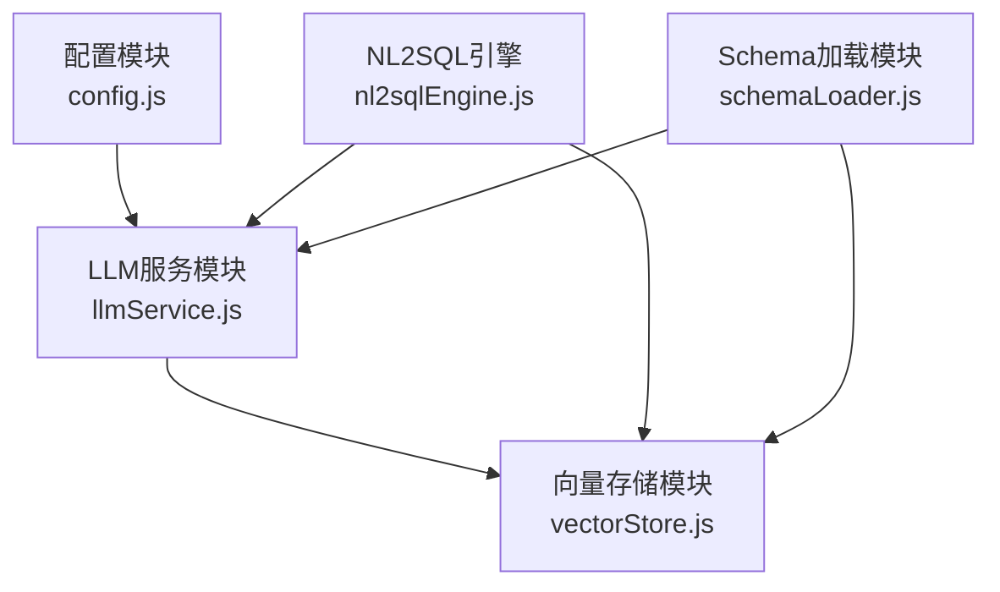
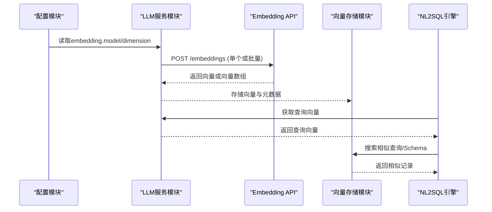
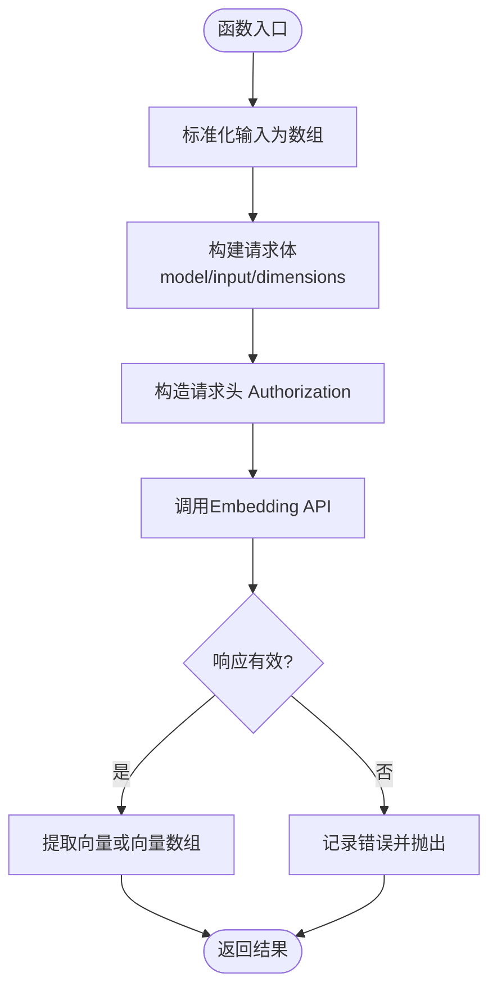
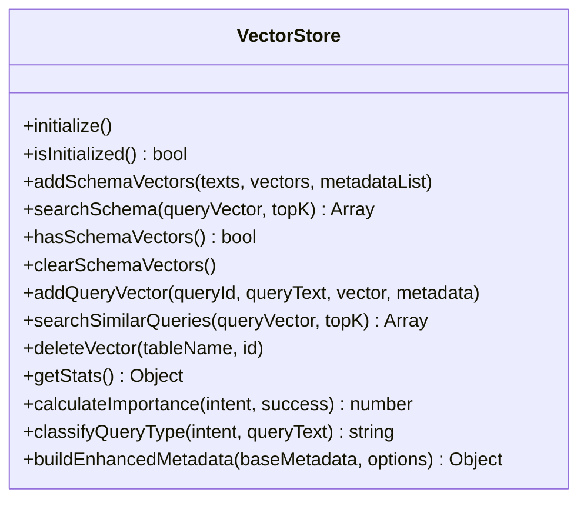
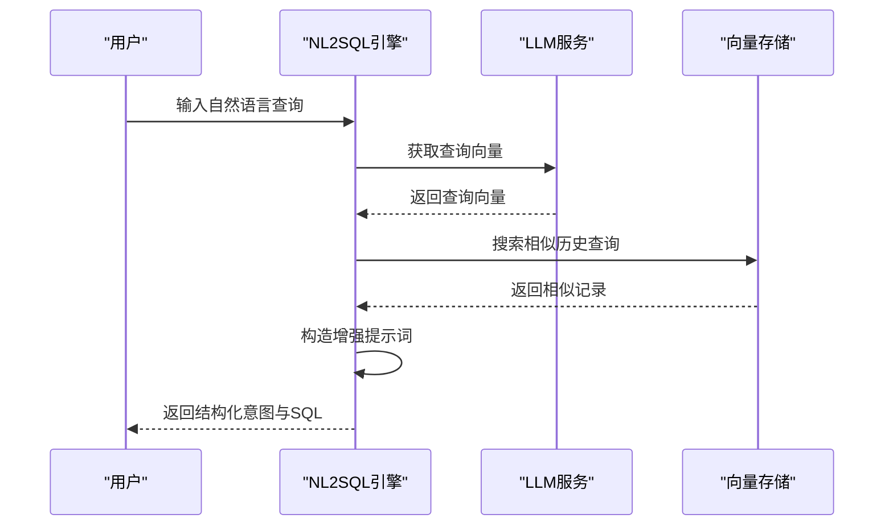
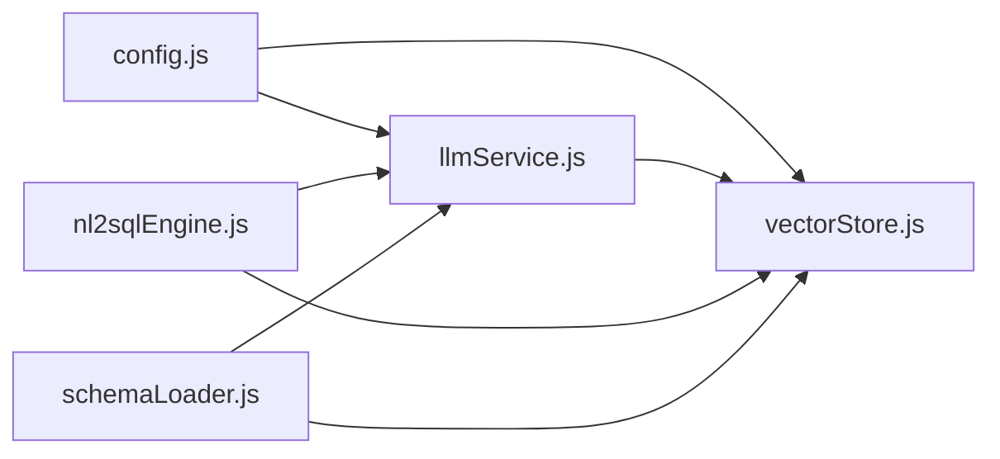

# 嵌入向量服务

<cite>
**本文引用的文件**
- [llmService.js](file://backend/src/core/llmService.js)
- [vectorStore.js](file://backend/src/memory/vectorStore.js)
- [config.js](file://backend/src/core/config.js)
- [schemaLoader.js](file://backend/src/core/schemaLoader.js)
- [nl2sqlEngine.js](file://backend/src/core/nl2sqlEngine.js)
- [package.json](file://backend/package.json)
</cite>

## 目录
1. [简介](#简介)
2. [项目结构](#项目结构)
3. [核心组件](#核心组件)
4. [架构总览](#架构总览)
5. [详细组件分析](#详细组件分析)
6. [依赖关系分析](#依赖关系分析)
7. [性能考虑](#性能考虑)
8. [故障排查指南](#故障排查指南)
9. [结论](#结论)
10. [附录](#附录)

## 简介
本文件聚焦NL2SQL项目的嵌入向量服务，围绕getEmbedding函数的实现原理与使用方法展开，系统阐述文本向量化处理、多维向量生成、与向量数据库的集成方式，以及在语义搜索、相似度计算和查询理解中的应用场景。同时给出配置方法、不同LLM提供商的Embedding API差异说明、向量数据的存储与检索机制。

## 项目结构
嵌入向量服务涉及以下关键模块：
- 配置模块：统一管理embedding.model与embedding.dimension等参数
- LLM服务模块：封装Embedding API调用，提供getEmbedding函数
- 向量存储模块：基于LanceDB实现Schema与查询历史的向量存储与检索
- 引擎模块：在NL2SQL流程中调用Embedding进行语义检索与查询理解增强
- Schema加载模块：批量生成Schema文本的向量并入库

图表来源
- [config.js:76-87](file://backend/src/core/config.js#L76-L87)
- [llmService.js:324-379](file://backend/src/core/llmService.js#L324-L379)
- [vectorStore.js:229-320](file://backend/src/memory/vectorStore.js#L229-L320)
- [nl2sqlEngine.js:588-618](file://backend/src/core/nl2sqlEngine.js#L588-L618)
- [schemaLoader.js:260-290](file://backend/src/core/schemaLoader.js#L260-L290)

章节来源
- [config.js:76-87](file://backend/src/core/config.js#L76-L87)
- [llmService.js:324-379](file://backend/src/core/llmService.js#L324-L379)
- [vectorStore.js:229-320](file://backend/src/memory/vectorStore.js#L229-L320)
- [nl2sqlEngine.js:588-618](file://backend/src/core/nl2sqlEngine.js#L588-L618)
- [schemaLoader.js:260-290](file://backend/src/core/schemaLoader.js#L260-L290)

## 核心组件
- getEmbedding函数：负责将文本（单个或批量）转换为向量，支持指定维度与重试机制
- 向量存储模块：提供LanceDB连接、表初始化、Schema与查询向量的增删查改
- 配置模块：集中管理embedding.model与embedding.dimension等参数
- 引擎与Schema模块：在NL2SQL流程中调用Embedding进行语义检索与增强

章节来源
- [llmService.js:324-379](file://backend/src/core/llmService.js#L324-L379)
- [vectorStore.js:229-320](file://backend/src/memory/vectorStore.js#L229-L320)
- [config.js:76-87](file://backend/src/core/config.js#L76-L87)
- [nl2sqlEngine.js:588-618](file://backend/src/core/nl2sqlEngine.js#L588-L618)
- [schemaLoader.js:260-290](file://backend/src/core/schemaLoader.js#L260-L290)

## 架构总览
嵌入向量服务的整体流程如下：
- 配置模块提供embedding.model与embedding.dimension
- LLM服务模块调用Embedding API，返回向量或向量数组
- 向量存储模块将向量与元数据持久化到LanceDB
- 引擎与Schema模块在运行时调用向量检索，增强查询理解与表推荐

图表来源
- [config.js:76-87](file://backend/src/core/config.js#L76-L87)
- [llmService.js:324-379](file://backend/src/core/llmService.js#L324-L379)
- [vectorStore.js:334-404](file://backend/src/memory/vectorStore.js#L334-L404)
- [nl2sqlEngine.js:588-618](file://backend/src/core/nl2sqlEngine.js#L588-L618)

## 详细组件分析

### getEmbedding函数实现原理与使用方法
- 输入处理：支持单个字符串或字符串数组，内部统一为数组格式
- 请求构建：携带model、input与dimensions字段
- 认证与端点：使用Authorization头与配置的LLM API Base拼接/embeddings端点
- 响应解析：OpenAI格式返回data[0].embedding，单输入返回一维向量，数组输入返回向量数组
- 错误处理：包含超时、解析失败、空数据等情况的日志与抛错
- 重试机制：withRetry包装，支持最大重试次数与延迟

图表来源
- [llmService.js:324-379](file://backend/src/core/llmService.js#L324-L379)

章节来源
- [llmService.js:324-379](file://backend/src/core/llmService.js#L324-L379)

### 向量存储与检索机制
- 初始化：连接LanceDB，打开或创建schema_vectors与query_vectors表，使用config.embedding.dimension作为向量维度
- Schema向量：addSchemaVectors批量写入，searchSchema基于查询向量进行相似度检索
- 查询历史向量：addQueryVector单条写入，searchSimilarQueries检索相似历史查询
- 元数据增强：buildEnhancedMetadata计算重要性评分、分类查询类型、复杂度统计等

图表来源
- [vectorStore.js:229-620](file://backend/src/memory/vectorStore.js#L229-L620)

章节来源
- [vectorStore.js:229-320](file://backend/src/memory/vectorStore.js#L229-L320)
- [vectorStore.js:334-481](file://backend/src/memory/vectorStore.js#L334-L481)
- [vectorStore.js:600-620](file://backend/src/memory/vectorStore.js#L600-L620)

### 在NL2SQL系统中的应用场景
- 语义搜索：根据用户查询向量在历史查询表中检索相似查询，形成“相似历史查询参考”增强系统提示词
- 相似度计算：用于评估用户当前查询与历史查询的相似程度，辅助意图识别与上下文理解
- 查询理解：结合相似查询的指标信息，提升对用户需求的理解精度

图表来源
- [nl2sqlEngine.js:588-618](file://backend/src/core/nl2sqlEngine.js#L588-L618)
- [llmService.js:324-379](file://backend/src/core/llmService.js#L324-L379)
- [vectorStore.js:455-481](file://backend/src/memory/vectorStore.js#L455-L481)

章节来源
- [nl2sqlEngine.js:588-618](file://backend/src/core/nl2sqlEngine.js#L588-L618)

### 不同LLM提供商的Embedding API差异
- 模型选择：通过embedding.model配置，支持OpenAI、DeepSeek、Azure OpenAI等兼容OpenAI API格式的服务
- 维度设置：通过embedding.dimension配置，部分模型支持dimensions参数指定输出维度
- 批量处理：getEmbedding支持数组输入，实现批量Embedding生成
- 认证与端点：统一使用Authorization头与LLM API Base拼接/embeddings端点

章节来源
- [config.js:76-87](file://backend/src/core/config.js#L76-L87)
- [llmService.js:324-379](file://backend/src/core/llmService.js#L324-L379)

### 配置方法
- embedding.model：指定Embedding模型名称
- embedding.dimension：指定输出向量维度
- embedding.timeout：Embedding请求超时时间
- llm.apiBase：LLM API基础URL（需以/v1结尾）
- llm.apiKey：API密钥
- vectorDb.path：LanceDB存储目录路径
- schema.revectorize：是否强制重新向量化Schema

章节来源
- [config.js:76-87](file://backend/src/core/config.js#L76-L87)
- [config.js:106-109](file://backend/src/core/config.js#L106-L109)
- [config.js:242-244](file://backend/src/core/config.js#L242-L244)

### 向量数据的存储与检索机制
- 存储：向量与元数据以记录形式写入LanceDB表，使用JSON字符串存储metadata
- 检索：基于向量相似度搜索，返回文本、距离与解析后的元数据
- 统计：提供表统计信息与存在性检查，便于运维与诊断

章节来源
- [vectorStore.js:334-404](file://backend/src/memory/vectorStore.js#L334-L404)
- [vectorStore.js:455-481](file://backend/src/memory/vectorStore.js#L455-L481)
- [vectorStore.js:516-546](file://backend/src/memory/vectorStore.js#L516-L546)

### 与向量数据库的集成方法
- LanceDB：通过vectordb包连接本地目录，初始化schema_vectors与query_vectors表
- 表结构：包含id、text、vector、metadata、created_at字段
- 操作：支持批量添加、相似度搜索、统计查询与存在性检查

章节来源
- [vectorStore.js:229-320](file://backend/src/memory/vectorStore.js#L229-L320)
- [vectorStore.js:334-404](file://backend/src/memory/vectorStore.js#L334-L404)
- [package.json:12](file://backend/package.json#L12)

## 依赖关系分析
- 配置模块为LLM服务与向量存储提供统一参数
- LLM服务依赖配置模块与日志模块，封装HTTP请求与重试
- 向量存储依赖配置模块与LanceDB客户端
- 引擎与Schema模块依赖LLM服务与向量存储模块

图表来源
- [config.js:76-87](file://backend/src/core/config.js#L76-L87)
- [llmService.js:324-379](file://backend/src/core/llmService.js#L324-L379)
- [vectorStore.js:229-320](file://backend/src/memory/vectorStore.js#L229-L320)
- [nl2sqlEngine.js:588-618](file://backend/src/core/nl2sqlEngine.js#L588-L618)
- [schemaLoader.js:260-290](file://backend/src/core/schemaLoader.js#L260-L290)

章节来源
- [config.js:76-87](file://backend/src/core/config.js#L76-L87)
- [llmService.js:324-379](file://backend/src/core/llmService.js#L324-L379)
- [vectorStore.js:229-320](file://backend/src/memory/vectorStore.js#L229-L320)
- [nl2sqlEngine.js:588-618](file://backend/src/core/nl2sqlEngine.js#L588-L618)
- [schemaLoader.js:260-290](file://backend/src/core/schemaLoader.js#L260-L290)

## 性能考虑
- 批量处理：getEmbedding支持数组输入，减少API调用次数
- 超时与重试：合理设置embedding.timeout与重试参数，提升稳定性
- 向量维度：根据模型能力与存储/检索性能平衡选择embedding.dimension
- 索引与搜索：LanceDB基于向量相似度检索，topK参数影响召回与性能

## 故障排查指南
- Embedding API失败：检查LLM API密钥、API Base、网络连通性与超时设置
- 响应解析失败：关注日志中的截断提示与JSON解析错误
- 向量数据库未初始化：确认LanceDB路径与权限，检查初始化日志
- 相似查询为空：确认向量是否成功入库与表是否存在有效数据

章节来源
- [llmService.js:135-131](file://backend/src/core/llmService.js#L135-L131)
- [vectorStore.js:238-258](file://backend/src/memory/vectorStore.js#L238-L258)

## 结论
嵌入向量服务通过getEmbedding函数实现文本到向量的高效转换，并与LanceDB向量存储无缝集成，支撑NL2SQL系统中的语义搜索、相似度计算与查询理解增强。通过合理的配置与批处理策略，可在保证性能的同时提升系统的智能化水平。

## 附录
- 环境变量与默认值：参考配置模块中的embedding与vectorDb相关配置
- 依赖包：vectordb用于LanceDB集成，llmService依赖http/https模块

章节来源
- [config.js:76-87](file://backend/src/core/config.js#L76-L87)
- [config.js:106-109](file://backend/src/core/config.js#L106-L109)
- [package.json:12](file://backend/package.json#L12)