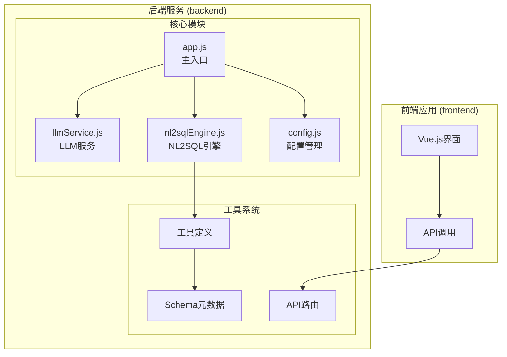
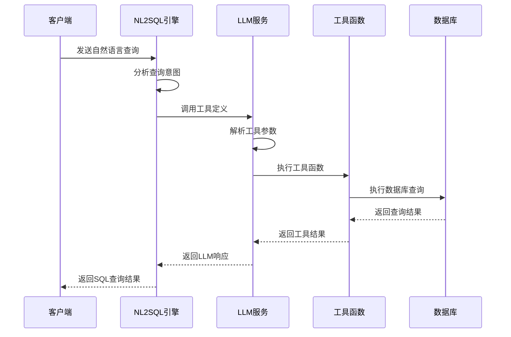
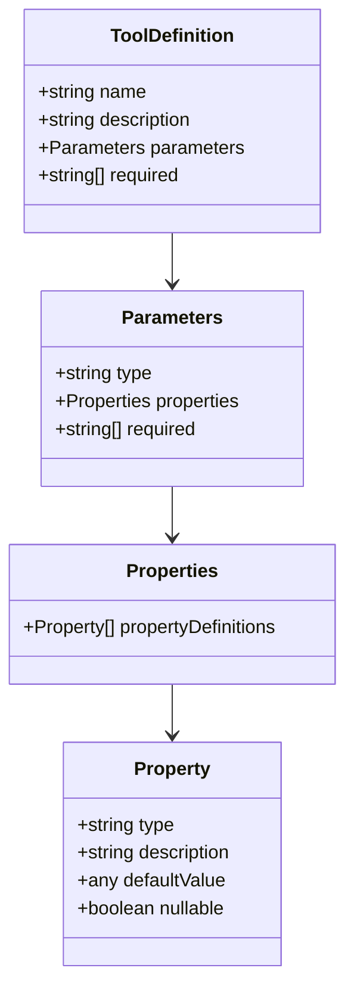
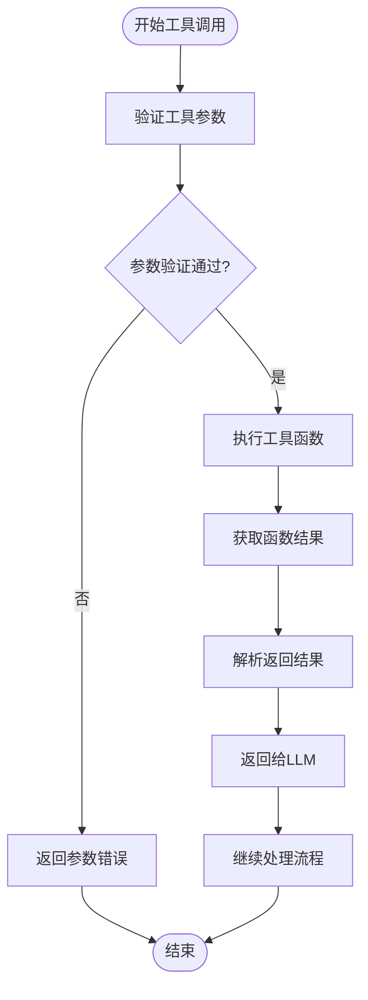
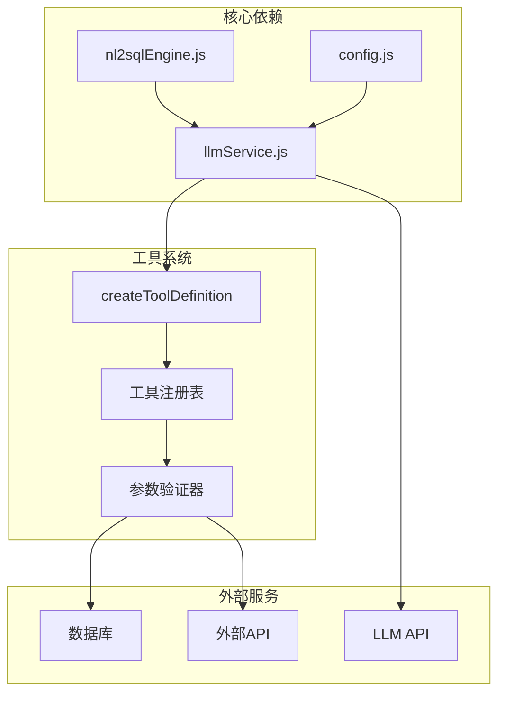

# 工具定义与函数调用

<cite>
**本文档引用的文件**
- [app.js](file://backend/src/app.js)
- [nl2sqlEngine.js](file://backend/src/core/nl2sqlEngine.js)
- [llmService.js](file://backend/src/core/llmService.js)
- [config.js](file://backend/src/core/config.js)
</cite>

## 目录
1. [简介](#简介)
2. [项目结构](#项目结构)
3. [核心组件](#核心组件)
4. [架构概览](#架构概览)
5. [详细组件分析](#详细组件分析)
6. [依赖关系分析](#依赖关系分析)
7. [性能考虑](#性能考虑)
8. [故障排除指南](#故障排除指南)
9. [结论](#结论)

## 简介

NL2SQL项目是一个基于大语言模型的自然语言到SQL转换系统。本文档专注于项目的工具定义与函数调用机制，详细说明了createToolDefinition函数的使用方法、JSON Schema参数定义、LLM工具调用的工作原理，以及如何定义复杂的工具函数。

该项目采用模块化设计，通过工具定义机制实现了灵活的函数调用能力，支持数据库查询、外部API调用和业务逻辑处理等多种场景。

## 项目结构

NL2SQL项目采用前后端分离的架构设计：



**图表来源**
- [app.js:1-238](file://backend/src/app.js#L1-L238)
- [llmService.js:1-432](file://backend/src/core/llmService.js#L1-L432)
- [nl2sqlEngine.js:1-800](file://backend/src/core/nl2sqlEngine.js#L1-L800)

**章节来源**
- [app.js:1-238](file://backend/src/app.js#L1-L238)
- [config.js:1-372](file://backend/src/core/config.js#L1-L372)

## 核心组件

### LLM服务模块

LLM服务模块是整个工具系统的核心，负责与外部LLM API进行通信。该模块提供了完整的工具调用支持，包括：

- **工具定义创建**：通过`createToolDefinition`函数创建标准化的工具定义
- **HTTP请求处理**：封装了完整的HTTP请求流程，支持重试机制
- **响应解析**：自动解析LLM API的响应数据
- **错误处理**：完善的错误处理和重试机制

### NL2SQL引擎

NL2SQL引擎负责处理自然语言到SQL的转换过程，集成了工具调用机制来增强查询能力：

- **意图识别**：分析用户查询的业务意图
- **实体解析**：识别和解析查询中的实体信息
- **SQL生成**：基于分析结果生成相应的SQL查询
- **工具集成**：通过工具调用扩展查询能力

### 配置管理系统

配置管理系统提供了统一的配置管理机制，支持多种配置项：

- **LLM API配置**：模型选择、API密钥、超时设置
- **安全配置**：表白名单、查询限制、安全防护
- **数据库配置**：SQLite和LanceDB的连接配置
- **会话管理**：会话历史、过期时间、清理策略

**章节来源**
- [llmService.js:385-415](file://backend/src/core/llmService.js#L385-L415)
- [nl2sqlEngine.js:497-780](file://backend/src/core/nl2sqlEngine.js#L497-L780)
- [config.js:16-372](file://backend/src/core/config.js#L16-L372)

## 架构概览

NL2SQL系统的工具调用架构采用了分层设计：



**图表来源**
- [llmService.js:222-277](file://backend/src/core/llmService.js#L222-L277)
- [nl2sqlEngine.js:497-780](file://backend/src/core/nl2sqlEngine.js#L497-L780)

## 详细组件分析

### createToolDefinition函数详解

`createToolDefinition`函数是工具定义的核心组件，提供了标准化的工具定义创建机制：

#### 函数签名和参数

```javascript
function createToolDefinition(name, description, parameters, required = [])
```

**参数说明：**
- `name`：工具名称，字符串类型
- `description`：工具描述，字符串类型  
- `parameters`：参数定义，JSON Schema格式的对象
- `required`：必需参数列表，数组类型

#### JSON Schema参数定义

工具的参数通过JSON Schema进行严格定义，支持以下数据类型：



**图表来源**
- [llmService.js:395-415](file://backend/src/core/llmService.js#L395-L415)

#### 使用示例和最佳实践

创建工具定义时应遵循以下最佳实践：

1. **明确的工具命名**：使用清晰、描述性的工具名称
2. **详细的参数说明**：为每个参数提供详细的描述和约束
3. **合理的默认值**：为可选参数设置合理的默认值
4. **严格的类型验证**：确保参数类型与实际使用场景匹配

**章节来源**
- [llmService.js:385-415](file://backend/src/core/llmService.js#L385-L415)

### LLM工具调用工作原理

#### 工具注册机制

LLM工具调用通过以下步骤实现：

1. **工具定义创建**：使用`createToolDefinition`创建标准化工具定义
2. **工具注册**：将工具定义传递给LLM服务的`chat`函数
3. **参数验证**：LLM自动验证传入的参数是否符合定义
4. **函数执行**：当LLM需要调用工具时，自动执行相应的函数

#### 函数调用流程



**图表来源**
- [llmService.js:222-277](file://backend/src/core/llmService.js#L222-L277)

#### 结果返回机制

工具调用的结果通过标准化的JSON格式返回，支持以下结构：

- **成功响应**：包含执行结果和元数据
- **错误响应**：包含错误信息和错误码
- **进度报告**：对于长时间运行的工具，支持进度更新

**章节来源**
- [llmService.js:222-277](file://backend/src/core/llmService.js#L222-L277)

### 复杂工具函数定义

#### 数据库查询工具

数据库查询工具是最常用的工具类型，支持复杂的查询操作：

```javascript
const dbQueryTool = createToolDefinition(
  'execute_database_query',
  '执行数据库查询并返回结果',
  {
    query: {
      type: 'string',
      description: '要执行的SQL查询语句'
    },
    params: {
      type: 'object',
      description: '查询参数对象',
      properties: {
        limit: { type: 'integer', minimum: 1, maximum: 1000 },
        offset: { type: 'integer', minimum: 0 }
      }
    }
  },
  ['query']
);
```

#### 外部API调用工具

外部API调用工具支持与第三方服务的集成：

```javascript
const externalApiTool = createToolDefinition(
  'call_external_api',
  '调用外部API获取数据',
  {
    endpoint: {
      type: 'string',
      description: 'API端点URL'
    },
    method: {
      type: 'string',
      enum: ['GET', 'POST', 'PUT', 'DELETE'],
      default: 'GET'
    },
    headers: {
      type: 'object',
      description: '请求头'
    },
    body: {
      type: 'object',
      description: '请求体'
    }
  },
  ['endpoint', 'method']
);
```

#### 业务逻辑处理工具

业务逻辑处理工具用于执行复杂的业务规则：

```javascript
const businessLogicTool = createToolDefinition(
  'apply_business_rules',
  '应用业务规则处理数据',
  {
    data: {
      type: 'object',
      description: '需要处理的数据对象'
    },
    rules: {
      type: 'array',
      description: '业务规则列表',
      items: {
        type: 'object',
        properties: {
          type: { type: 'string', enum: ['validation', 'transformation', 'calculation'] },
          field: { type: 'string' },
          condition: { type: 'object' },
          action: { type: 'object' }
        }
      }
    }
  },
  ['data', 'rules']
);
```

**章节来源**
- [llmService.js:385-415](file://backend/src/core/llmService.js#L385-L415)

### 工具调用在NL2SQL系统中的应用

#### 动态查询生成

在NL2SQL系统中，工具调用主要用于动态查询生成：

1. **意图分析**：通过LLM分析用户查询的业务意图
2. **实体识别**：识别查询中的实体和约束条件
3. **工具选择**：根据分析结果选择合适的工具
4. **查询生成**：使用工具生成最终的SQL查询

#### 智能决策支持

工具调用还支持智能决策功能：

- **多轮对话**：支持复杂的多轮对话交互
- **上下文理解**：理解对话上下文和历史信息
- **实时数据**：通过工具获取实时数据支持决策
- **个性化推荐**：基于用户历史提供个性化查询建议

**章节来源**
- [nl2sqlEngine.js:497-780](file://backend/src/core/nl2sqlEngine.js#L497-L780)

## 依赖关系分析

NL2SQL系统的工具调用机制涉及多个模块之间的复杂依赖关系：



**图表来源**
- [llmService.js:421-431](file://backend/src/core/llmService.js#L421-L431)
- [nl2sqlEngine.js:1-800](file://backend/src/core/nl2sqlEngine.js#L1-L800)

**章节来源**
- [llmService.js:421-431](file://backend/src/core/llmService.js#L421-L431)
- [nl2sqlEngine.js:1-800](file://backend/src/core/nl2sqlEngine.js#L1-L800)

## 性能考虑

### 工具调用性能优化

1. **缓存机制**：对频繁使用的工具结果进行缓存
2. **批量处理**：支持多个工具的批量调用
3. **异步处理**：使用异步机制避免阻塞
4. **资源管理**：合理管理工具调用的资源消耗

### 错误处理和重试机制

系统实现了完善的错误处理机制：

- **自动重试**：对临时性错误进行自动重试
- **超时控制**：设置合理的超时时间
- **降级策略**：在服务不可用时提供降级方案
- **监控告警**：实时监控工具调用状态

## 故障排除指南

### 常见问题和解决方案

#### 工具定义错误

**问题**：工具定义不符合JSON Schema规范
**解决方案**：
1. 检查参数类型定义
2. 验证必需参数列表
3. 确认默认值设置

#### LLM调用失败

**问题**：LLM API调用失败
**解决方案**：
1. 检查API密钥配置
2. 验证网络连接
3. 查看重试日志

#### 工具执行异常

**问题**：工具执行过程中出现异常
**解决方案**：
1. 检查工具函数实现
2. 验证输入参数
3. 查看错误堆栈信息

**章节来源**
- [llmService.js:158-195](file://backend/src/core/llmService.js#L158-L195)
- [config.js:340-372](file://backend/src/core/config.js#L340-L372)

## 结论

NL2SQL项目的工具定义与函数调用机制为自然语言到SQL的转换提供了强大的扩展能力。通过标准化的工具定义、灵活的参数验证和完善的错误处理机制，系统能够支持复杂的查询场景和业务逻辑。

关键优势包括：
- **标准化接口**：通过JSON Schema确保工具定义的一致性
- **灵活扩展**：支持各种类型的工具函数定义
- **安全可靠**：完善的参数验证和错误处理机制
- **性能优化**：支持缓存、批量处理等性能优化技术

未来的发展方向包括：
- 增强工具调用的智能化程度
- 扩展更多类型的工具函数
- 优化工具调用的性能表现
- 提供更丰富的工具管理功能