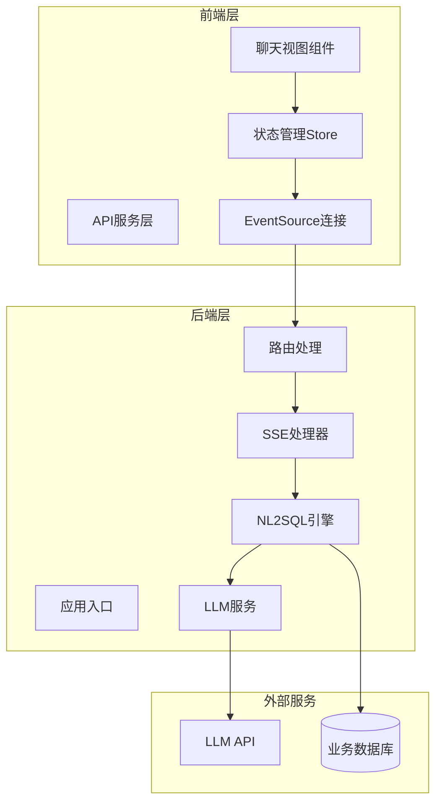
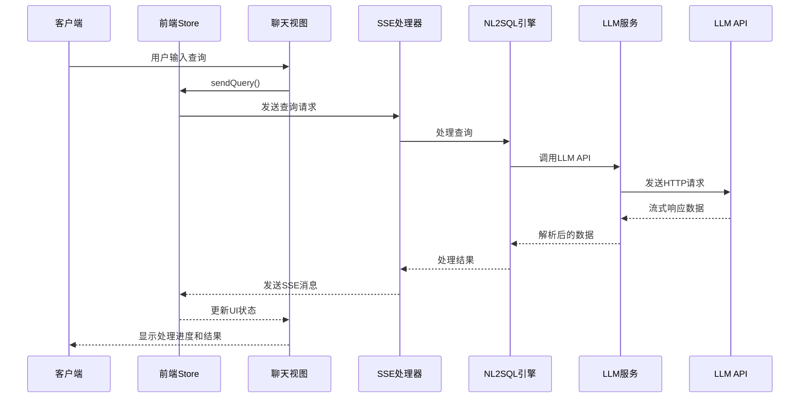
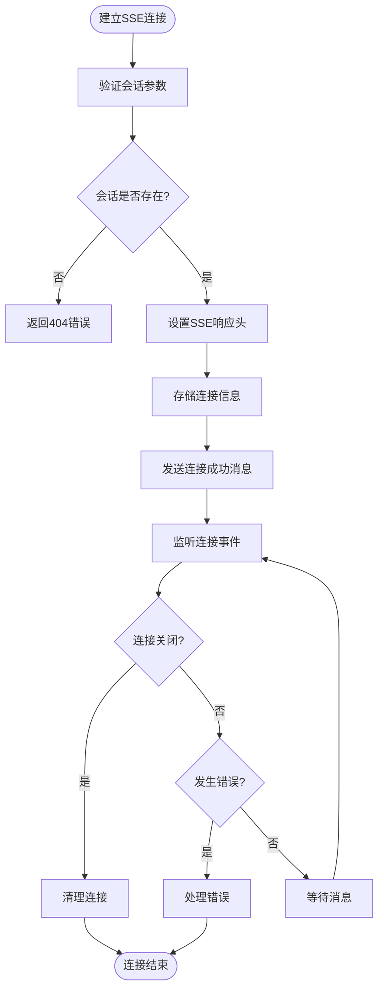
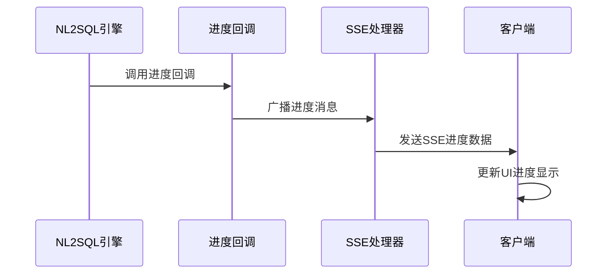
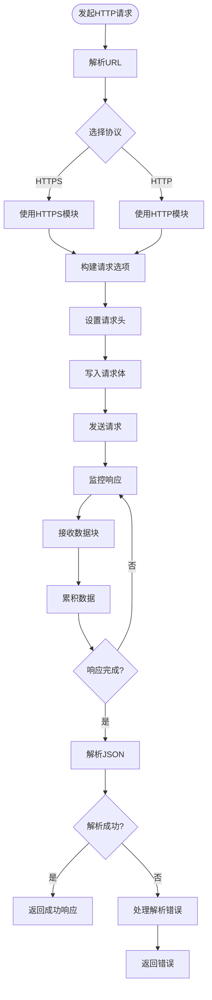
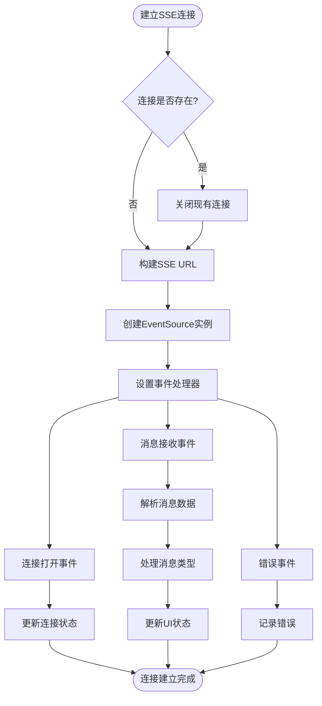
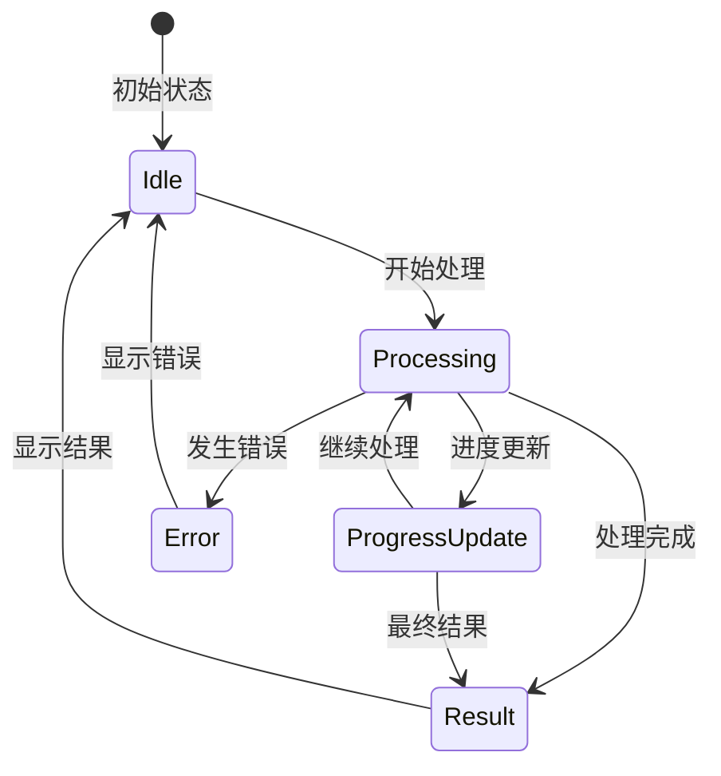
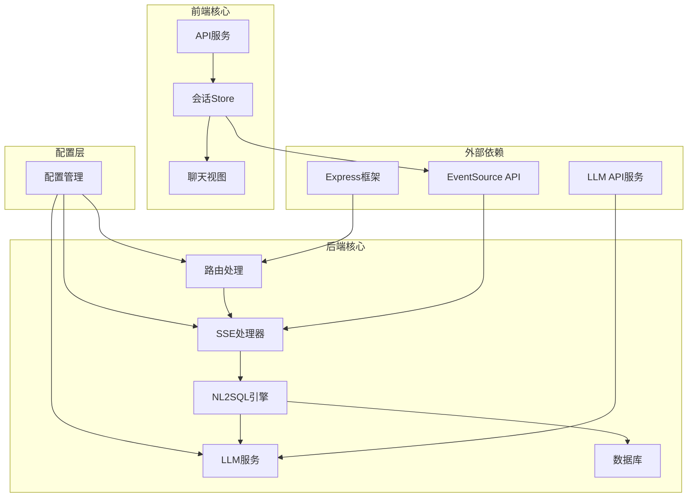

# 流式响应处理

<cite>
**本文档引用的文件**
- [sseHandler.js](file://backend/src/core/sseHandler.js)
- [llmService.js](file://backend/src/core/llmService.js)
- [api.js](file://frontend/src/utils/api.js)
- [ChatView.vue](file://frontend/src/views/ChatView.vue)
- [session.js](file://frontend/src/stores/session.js)
- [routes.js](file://backend/src/core/routes.js)
- [config.js](file://backend/src/core/config.js)
- [app.js](file://backend/src/app.js)
</cite>

## 目录
1. [简介](#简介)
2. [项目结构](#项目结构)
3. [核心组件](#核心组件)
4. [架构概览](#架构概览)
5. [详细组件分析](#详细组件分析)
6. [依赖关系分析](#依赖关系分析)
7. [性能考虑](#性能考虑)
8. [故障排除指南](#故障排除指南)
9. [结论](#结论)

## 简介

NL2SQL项目实现了基于Server-Sent Events (SSE) 的流式响应处理机制，为用户提供实时的自然语言到SQL转换体验。该系统通过流式传输技术，让用户能够在查询处理过程中获得即时反馈，包括处理进度、中间结果和最终的SQL查询。

流式响应处理的核心价值在于：
- **实时用户体验**：用户可以立即看到查询处理的进度和状态
- **渐进式信息展示**：系统可以逐步输出中间结果和处理步骤
- **更好的错误处理**：能够及时发现和报告处理过程中的问题
- **资源优化**：避免长时间等待，提高系统响应性

## 项目结构

NL2SQL项目的流式响应处理涉及前后端的完整架构：

**图表来源**
- [app.js:56-87](file://backend/src/app.js#L56-L87)
- [routes.js:33-34](file://backend/src/core/routes.js#L33-L34)
- [sseHandler.js:43-112](file://backend/src/core/sseHandler.js#L43-L112)

**章节来源**
- [app.js:56-87](file://backend/src/app.js#L56-L87)
- [routes.js:33-34](file://backend/src/core/routes.js#L33-L34)

## 核心组件

### SSE处理器模块

SSE处理器是流式响应的核心组件，负责管理SSE连接和消息传输：

- **连接管理**：维护活跃连接映射，支持多标签页连接
- **消息发送**：将结构化消息转换为SSE格式并发送
- **进度回调**：支持NL2SQL引擎的进度回调机制
- **连接清理**：自动处理连接关闭和错误情况

### LLM服务模块

LLM服务模块提供了流式响应的底层支持：

- **HTTP请求封装**：支持流式和非流式的HTTP请求
- **JSON解析**：处理多JSON对象的响应解析
- **重试机制**：实现智能重试和错误处理
- **超时控制**：防止请求挂起和资源浪费

### 前端状态管理

前端使用Pinia状态管理Store来处理SSE连接和消息：

- **SSE连接管理**：建立和维护EventSource连接
- **消息处理**：解析和分发SSE消息到UI组件
- **状态同步**：保持UI状态与后端处理状态一致
- **错误处理**：优雅处理连接中断和错误情况

**章节来源**
- [sseHandler.js:26-30](file://backend/src/core/sseHandler.js#L26-L30)
- [llmService.js:41-152](file://backend/src/core/llmService.js#L41-L152)
- [session.js:185-221](file://frontend/src/stores/session.js#L185-L221)

## 架构概览

NL2SQL项目的流式响应架构采用分层设计，确保了良好的可扩展性和维护性：

**图表来源**
- [session.js:299-328](file://frontend/src/stores/session.js#L299-L328)
- [sseHandler.js:218-280](file://backend/src/core/sseHandler.js#L218-L280)
- [llmService.js:222-277](file://backend/src/core/llmService.js#L222-L277)

## 详细组件分析

### SSE处理器实现

SSE处理器实现了完整的Server-Sent Events协议支持：

#### 连接管理机制

**图表来源**
- [sseHandler.js:43-112](file://backend/src/core/sseHandler.js#L43-L112)

#### 消息发送机制

SSE处理器支持多种消息类型的发送：

- **连接成功消息** (`connected`)：通知客户端连接建立
- **处理开始消息** (`processing`)：通知查询开始处理
- **进度更新消息** (`progress`)：提供处理进度信息
- **结果消息** (`result`)：发送最终查询结果
- **错误消息** (`error`)：报告处理过程中的错误

#### 进度回调集成

NL2SQL引擎通过进度回调机制与SSE处理器集成：

**图表来源**
- [sseHandler.js:248-259](file://backend/src/core/sseHandler.js#L248-L259)

**章节来源**
- [sseHandler.js:43-112](file://backend/src/core/sseHandler.js#L43-L112)
- [sseHandler.js:159-176](file://backend/src/core/sseHandler.js#L159-L176)
- [sseHandler.js:218-280](file://backend/src/core/sseHandler.js#L218-L280)

### LLM服务的流式响应处理

LLM服务模块提供了灵活的HTTP请求处理能力：

#### HTTP请求封装

**图表来源**
- [llmService.js:41-152](file://backend/src/core/llmService.js#L41-L152)

#### JSON解析机制

LLM服务实现了智能的JSON解析机制，能够处理复杂的响应格式：

- **多JSON对象检测**：自动识别包含多个JSON对象的响应
- **截断检测**：检测代理服务器可能的响应截断
- **错误恢复**：提供详细的错误信息和调试线索

**章节来源**
- [llmService.js:41-152](file://backend/src/core/llmService.js#L41-L152)
- [llmService.js:79-132](file://backend/src/core/llmService.js#L79-L132)

### 前端SSE连接管理

前端使用EventSource API实现SSE连接的建立和管理：

#### 连接建立流程

**图表来源**
- [session.js:185-221](file://frontend/src/stores/session.js#L185-L221)

#### 消息类型处理

前端Store实现了完整的SSE消息类型处理：

- **connected**：连接建立确认
- **processing**：开始处理通知
- **progress**：进度更新信息
- **result**：查询结果数据
- **clarify**：需要澄清的提示
- **error**：错误信息

**章节来源**
- [session.js:185-221](file://frontend/src/stores/session.js#L185-L221)
- [session.js:227-293](file://frontend/src/stores/session.js#L227-L293)

### 聊天视图的流式响应集成

聊天视图组件实现了完整的流式响应UI展示：

#### 实时状态显示

**图表来源**
- [ChatView.vue:81-100](file://frontend/src/views/ChatView.vue#L81-L100)

#### 用户交互优化

聊天视图提供了丰富的用户交互功能：

- **打字动画**：显示处理中的动态效果
- **进度条**：直观展示处理进度
- **状态文本**：提供详细的处理状态说明
- **自动滚动**：新消息自动滚动到底部

**章节来源**
- [ChatView.vue:81-100](file://frontend/src/views/ChatView.vue#L81-L100)
- [ChatView.vue:196-214](file://frontend/src/views/ChatView.vue#L196-L214)

## 依赖关系分析

NL2SQL项目的流式响应处理涉及多个层次的依赖关系：

**图表来源**
- [config.js:16-372](file://backend/src/core/config.js#L16-L372)
- [routes.js:33-34](file://backend/src/core/routes.js#L33-L34)
- [app.js:23-50](file://backend/src/app.js#L23-L50)

**章节来源**
- [config.js:16-372](file://backend/src/core/config.js#L16-L372)
- [routes.js:33-34](file://backend/src/core/routes.js#L33-L34)
- [app.js:23-50](file://backend/src/app.js#L23-L50)

## 性能考虑

流式响应处理在NL2SQL项目中体现了多项性能优化策略：

### 内存管理优化

- **连接池管理**：SSE连接映射使用Map结构，支持高效的连接查找和清理
- **数据累积控制**：前端Store使用响应式状态管理，避免不必要的DOM更新
- **资源清理**：自动清理断开的SSE连接，防止内存泄漏

### 缓冲区控制

- **Nginx缓冲禁用**：通过`X-Accel-Buffering: no`头禁用代理服务器缓冲
- **增量数据处理**：LLM服务逐块处理响应数据，避免一次性加载大量数据
- **进度分片**：将长处理过程分解为多个进度更新，提供更好的用户体验

### 错误恢复机制

- **智能重试**：LLM服务实现指数退避重试机制
- **超时控制**：防止请求挂起和资源浪费
- **连接监控**：实时监控SSE连接状态，及时发现和处理异常

### 性能监控

- **处理时间统计**：记录LLM请求和数据库查询的耗时
- **连接统计**：跟踪活跃连接数量和处理状态
- **错误日志**：详细记录错误信息，便于问题诊断

**章节来源**
- [sseHandler.js:65-70](file://backend/src/core/sseHandler.js#L65-L70)
- [llmService.js:167-195](file://backend/src/core/llmService.js#L167-L195)
- [llmService.js:141-145](file://backend/src/core/llmService.js#L141-L145)

## 故障排除指南

### 常见问题及解决方案

#### SSE连接问题

**问题症状**：
- 客户端无法建立SSE连接
- 连接频繁断开
- 无响应消息

**排查步骤**：
1. 检查会话ID参数是否正确传递
2. 验证会话是否存在且有效
3. 确认SSE端点URL格式正确
4. 检查CORS配置是否允许跨域访问

**解决方案**：
- 确保前端正确传递`session_id`参数
- 验证会话状态管理逻辑
- 检查服务器防火墙和代理配置

#### 流式响应解析问题

**问题症状**：
- JSON解析失败
- 响应数据不完整
- 多JSON对象解析错误

**排查步骤**：
1. 检查LLM API响应格式
2. 验证代理服务器配置
3. 确认响应编码设置

**解决方案**：
- 配置代理服务器禁用响应缓冲
- 实现智能JSON解析逻辑
- 添加响应完整性检查

#### 前端连接问题

**问题症状**：
- EventSource连接失败
- 无消息接收
- 连接状态异常

**排查步骤**：
1. 检查浏览器EventSource支持
2. 验证SSE URL格式
3. 确认网络连接状态

**解决方案**：
- 实现EventSource兼容性检查
- 添加连接重试机制
- 提供连接状态反馈

**章节来源**
- [sseHandler.js:48-62](file://backend/src/core/sseHandler.js#L48-L62)
- [llmService.js:115-131](file://backend/src/core/llmService.js#L115-L131)
- [session.js:214-217](file://frontend/src/stores/session.js#L214-L217)

## 结论

NL2SQL项目的流式响应处理系统展现了现代Web应用的最佳实践：

### 技术优势

- **实时性**：通过SSE实现实时消息推送，提供即时用户体验
- **可靠性**：完善的错误处理和重试机制，确保系统稳定性
- **可扩展性**：模块化设计支持功能扩展和性能优化
- **可观测性**：全面的日志记录和监控机制

### 应用场景

流式响应处理特别适用于以下场景：

- **实时聊天界面**：用户可以立即看到处理进度和状态
- **进度显示**：复杂查询的渐进式结果显示
- **用户体验优化**：避免长时间等待，提升用户满意度
- **系统监控**：实时反馈系统状态和性能指标

### 未来改进方向

- **WebSocket支持**：考虑实现双向通信以支持更复杂的交互
- **性能优化**：进一步优化大数据量的流式处理
- **安全性增强**：加强SSE连接的安全性和身份验证
- **监控扩展**：增加更详细的性能指标和告警机制

通过精心设计的流式响应处理机制，NL2SQL项目为用户提供了流畅、实时的自然语言到SQL转换体验，展现了现代Web应用的技术实力和用户体验设计理念。