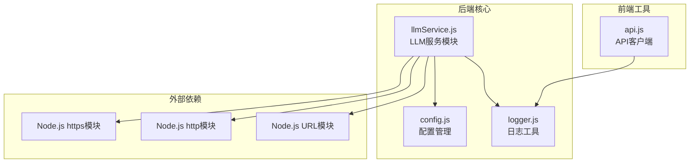
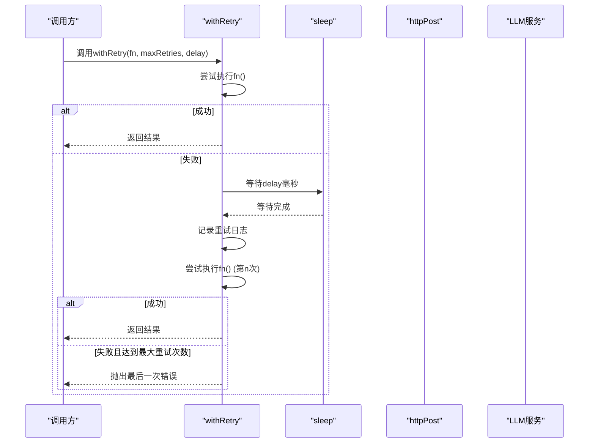
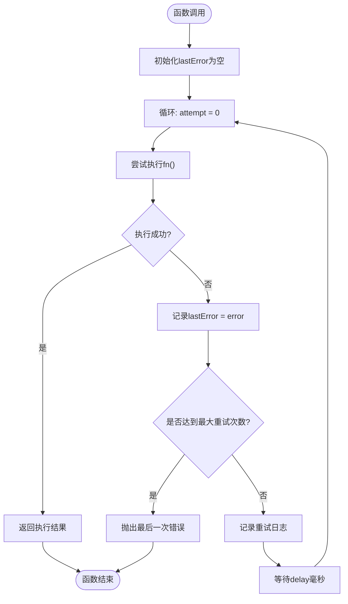
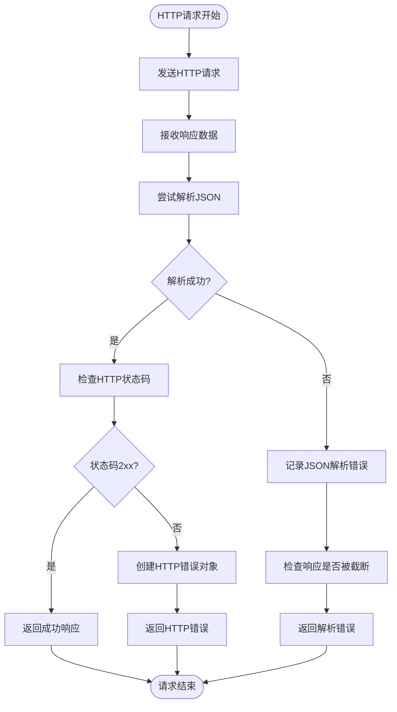
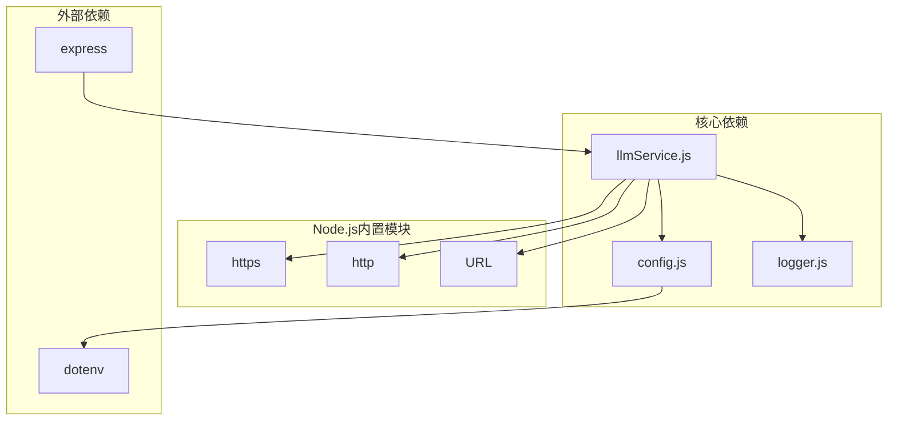

# 重试机制与错误处理

<cite>
**本文档引用的文件**
- [llmService.js](file://backend/src/core/llmService.js)
- [config.js](file://backend/src/core/config.js)
- [logger.js](file://backend/src/utils/logger.js)
- [api.js](file://frontend/src/utils/api.js)
</cite>

## 目录
1. [简介](#简介)
2. [项目结构](#项目结构)
3. [核心组件](#核心组件)
4. [架构概览](#架构概览)
5. [详细组件分析](#详细组件分析)
6. [依赖关系分析](#依赖关系分析)
7. [性能考虑](#性能考虑)
8. [故障排除指南](#故障排除指南)
9. [结论](#结论)

## 简介

NL2SQL项目中的LLM重试机制与错误处理系统是一个关键的基础设施组件，负责确保与外部LLM服务的可靠通信。该系统实现了基础的线性重试策略，提供了完善的错误分类处理，并通过结构化的日志记录机制来支持故障诊断和监控。

本系统主要包含三个核心组件：
- **withRetry函数**：实现基础的重试机制
- **sleep函数**：提供异步等待功能
- **HTTP请求处理**：封装底层网络通信和错误处理

## 项目结构

NL2SQL项目的重试机制分布在以下关键文件中：



**图表来源**
- [llmService.js:1-50](file://backend/src/core/llmService.js#L1-L50)
- [config.js:15-30](file://backend/src/core/config.js#L15-L30)
- [logger.js:15-30](file://backend/src/utils/logger.js#L15-L30)

**章节来源**
- [llmService.js:1-432](file://backend/src/core/llmService.js#L1-L432)
- [config.js:1-372](file://backend/src/core/config.js#L1-L372)
- [logger.js:1-318](file://backend/src/utils/logger.js#L1-L318)

## 核心组件

### withRetry函数

`withRetry`函数是整个重试机制的核心，实现了基础的线性重试策略：

**函数签名与参数**
- `fn`: 要执行的异步函数
- `maxRetries`: 最大重试次数（默认3次）
- `delay`: 重试间隔（毫秒，默认1000ms）

**实现特点**
- 支持最多`maxRetries + 1`次尝试（首次尝试 + 重试次数）
- 每次重试之间等待固定的时间间隔
- 记录最后一次错误以便最终抛出
- 提供详细的重试日志信息

**章节来源**
- [llmService.js:158-195](file://backend/src/core/llmService.js#L158-L195)

### sleep函数

`slepp`函数提供了异步等待功能，是重试机制的重要组成部分：

**实现原理**
- 返回一个Promise对象
- 使用`setTimeout`实现定时等待
- 支持任意毫秒数的延迟

**在重试机制中的作用**
- 作为重试间隔的实现基础
- 确保重试之间有足够的等待时间
- 避免过度频繁的请求导致服务端压力

**章节来源**
- [llmService.js:197-206](file://backend/src/core/llmService.js#L197-L206)

### HTTP请求处理

底层HTTP请求处理实现了完整的错误分类和处理机制：

**错误类型分类**
1. **网络超时**：请求在指定时间内未完成
2. **HTTP状态码错误**：服务器返回非2xx状态码
3. **JSON解析错误**：响应数据无法解析为JSON格式
4. **网络连接错误**：请求过程中发生的网络问题

**章节来源**
- [llmService.js:30-152](file://backend/src/core/llmService.js#L30-L152)

## 架构概览

NL2SQL项目的重试机制采用分层架构设计，确保了良好的可维护性和扩展性：



**图表来源**
- [llmService.js:158-195](file://backend/src/core/llmService.js#L158-L195)
- [llmService.js:197-206](file://backend/src/core/llmService.js#L197-L206)

## 详细组件分析

### withRetry函数详细分析

#### 实现流程图



**图表来源**
- [llmService.js:167-194](file://backend/src/core/llmService.js#L167-L194)

#### 关键实现细节

**重试条件判断**
- 每次捕获异常时都会记录错误
- 在达到最大重试次数前进行重试
- 最后一次尝试失败时直接抛出错误

**日志记录策略**
- 使用`logger.warn`记录重试信息
- 包含重试次数、延迟时间和错误消息
- 便于监控和故障诊断

**章节来源**
- [llmService.js:167-194](file://backend/src/core/llmService.js#L167-L194)

### HTTP请求错误处理分析

#### 错误分类处理流程



**图表来源**
- [llmService.js:78-151](file://backend/src/core/llmService.js#L78-L151)

#### 错误类型详细说明

**网络超时错误**
- 触发条件：请求在配置的超时时间内未完成
- 处理方式：中止请求并抛出超时错误
- 配置参数：通过`timeout`参数控制

**HTTP状态码错误**
- 触发条件：服务器返回非2xx状态码
- 处理方式：创建包含状态码和响应内容的错误对象
- 错误信息：包含HTTP状态码和服务器返回的消息

**JSON解析错误**
- 触发条件：响应数据无法解析为有效的JSON格式
- 处理方式：记录详细的调试信息，包括响应长度、截断标记等
- 调试信息：提供响应前后部分的内容用于问题诊断

**章节来源**
- [llmService.js:78-151](file://backend/src/core/llmService.js#L78-L151)

### 配置管理与策略调整

#### 配置参数详解

**LLM相关配置**
- `llm.maxRetries`: 默认3次重试
- `llm.retryDelay`: 默认1000毫秒延迟
- `llm.timeout`: 默认60000毫秒超时时间
- `llm.apiBase`: LLM API基础URL
- `llm.apiKey`: API访问密钥
- `llm.model`: 默认使用的模型名称

**Embedding相关配置**
- `embedding.timeout`: 默认60000毫秒超时时间
- `embedding.model`: 默认Embedding模型
- `embedding.dimension`: 默认向量维度

**章节来源**
- [config.js:55-87](file://backend/src/core/config.js#L55-L87)

## 依赖关系分析

NL2SQL项目的重试机制依赖关系清晰，遵循单一职责原则：



**图表来源**
- [llmService.js:15-25](file://backend/src/core/llmService.js#L15-L25)
- [config.js:10-25](file://backend/src/core/config.js#L10-L25)

### 依赖耦合分析

**低耦合设计**
- `llmService.js`仅依赖于`config.js`和`logger.js`
- HTTP模块的使用是透明的，不影响上层调用逻辑
- 错误处理逻辑集中在底层，上层只需关心业务逻辑

**可扩展性**
- 新增LLM提供商时只需修改配置即可
- 错误处理策略可以在不修改核心逻辑的情况下调整
- 日志记录器可以替换为其他实现

**章节来源**
- [llmService.js:15-25](file://backend/src/core/llmService.js#L15-L25)
- [config.js:10-25](file://backend/src/core/config.js#L10-L25)

## 性能考虑

### 重试机制的性能影响

**资源消耗**
- 每次重试都会产生额外的网络请求开销
- 延迟时间增加了整体响应时间
- 日志记录会产生额外的I/O操作

**优化建议**
- 合理设置重试次数和延迟时间
- 根据网络环境调整超时参数
- 监控重试频率，避免过度重试

### 错误处理的性能优化

**异步处理优势**
- 使用Promise和async/await避免阻塞
- 非阻塞的网络请求处理
- 并发请求的合理管理

**内存管理**
- 及时清理响应数据缓冲区
- 避免重复的日志记录
- 合理的错误对象创建和销毁

## 故障排除指南

### 常见错误类型及解决方案

#### 网络超时问题

**症状表现**
- 请求在指定时间内未完成
- 日志中出现"请求超时"错误
- 重试机制触发但最终失败

**排查步骤**
1. 检查网络连接稳定性
2. 增加超时时间配置
3. 验证LLM服务可用性
4. 监控服务器负载情况

**配置调整**
```javascript
// 增加超时时间
config.llm.timeout = 120000; // 2分钟
// 增加重试次数
config.llm.maxRetries = 5;
```

#### HTTP状态码错误

**症状表现**
- 服务器返回非2xx状态码
- 错误信息包含具体的HTTP状态码
- 可能是认证失败或API限制

**排查步骤**
1. 验证API密钥有效性
2. 检查API配额和限制
3. 确认请求格式正确
4. 查看服务器返回的详细错误信息

**章节来源**
- [llmService.js:106-112](file://backend/src/core/llmService.js#L106-L112)

#### JSON解析错误

**症状表现**
- 响应数据无法解析为JSON
- 日志中出现"响应解析失败"错误
- 可能是响应被截断或格式异常

**排查步骤**
1. 检查响应数据完整性
2. 验证服务器配置
3. 确认代理服务器设置
4. 查看响应前后部分的内容

**调试信息**
- 记录响应总长度
- 检查是否包含"truncated"标记
- 分析响应格式是否正确

### 错误恢复策略

#### 自动恢复机制

**重试策略**
- 线性重试：固定间隔的多次尝试
- 最终失败：达到最大重试次数后抛出错误
- 日志记录：详细记录每次重试的结果

**手动恢复**
- 配置参数调整
- 服务端问题解决
- 网络环境改善

#### 监控和告警

**日志监控**
- 使用`logger.js`记录详细的错误信息
- 监控重试频率和成功率
- 设置适当的日志级别

**性能监控**
- 监控请求响应时间
- 跟踪错误发生频率
- 分析错误类型分布

**章节来源**
- [logger.js:283-293](file://backend/src/utils/logger.js#L283-L293)

## 结论

NL2SQL项目的LLM重试机制与错误处理系统展现了良好的工程实践：

**设计优点**
- 清晰的分层架构，职责分离明确
- 完善的错误分类和处理机制
- 详细的日志记录支持故障诊断
- 灵活的配置管理支持不同场景

**改进方向**
- 可以考虑实现指数退避策略
- 增加错误类型的具体识别和处理
- 提供更丰富的监控和告警功能
- 支持更多LLM提供商的特定配置

**最佳实践建议**
- 根据网络环境合理配置重试参数
- 建立完善的监控体系
- 定期审查和优化重试策略
- 建立标准化的错误处理流程

该系统为NL2SQL项目提供了可靠的LLM通信保障，通过合理的重试机制和错误处理，确保了系统的稳定性和用户体验。