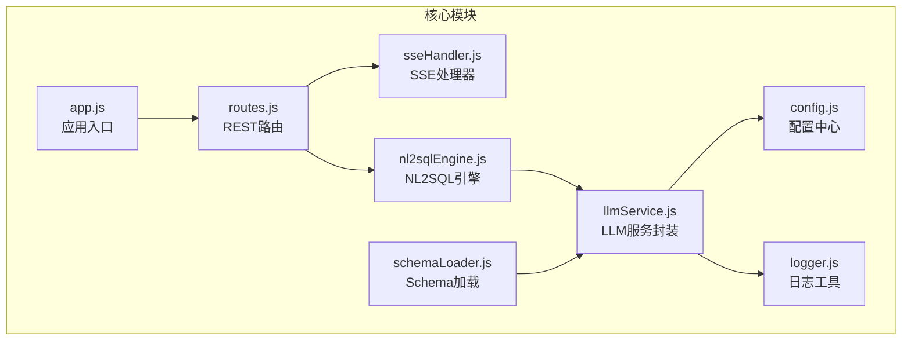
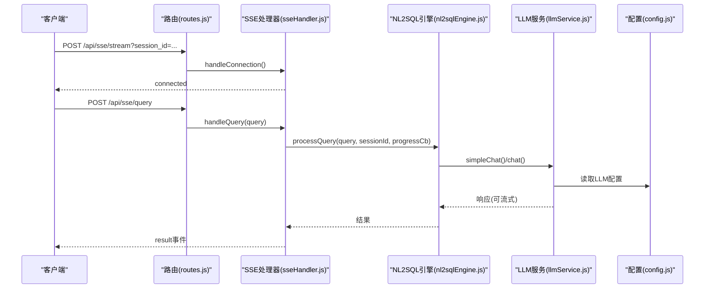
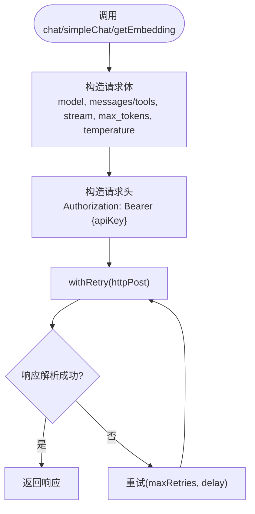
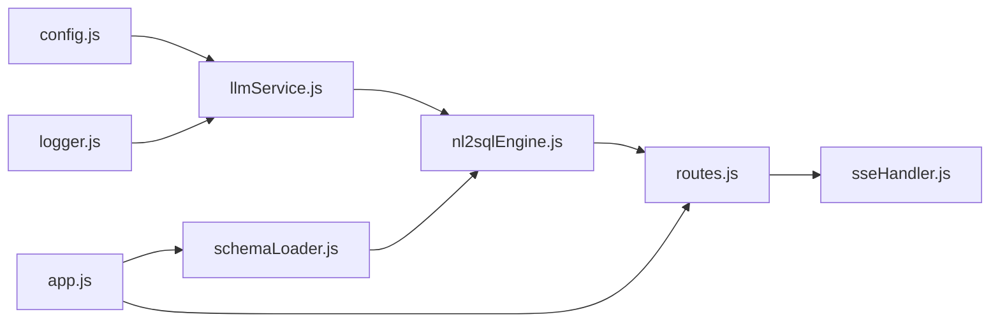

# LLM服务集成扩展

<cite>
**本文档引用的文件**
- [llmService.js](file://backend/src/core/llmService.js)
- [config.js](file://backend/src/core/config.js)
- [logger.js](file://backend/src/utils/logger.js)
- [routes.js](file://backend/src/core/routes.js)
- [app.js](file://backend/src/app.js)
- [nl2sqlEngine.js](file://backend/src/core/nl2sqlEngine.js)
- [sseHandler.js](file://backend/src/core/sseHandler.js)
- [schemaLoader.js](file://backend/src/core/schemaLoader.js)
- [schema-metadata.example.json](file://backend/config/schema-metadata.example.json)
- [package.json](file://backend/package.json)
</cite>

## 目录
1. [简介](#简介)
2. [项目结构](#项目结构)
3. [核心组件](#核心组件)
4. [架构总览](#架构总览)
5. [详细组件分析](#详细组件分析)
6. [依赖分析](#依赖分析)
7. [性能考虑](#性能考虑)
8. [故障排查指南](#故障排查指南)
9. [结论](#结论)
10. [附录](#附录)

## 简介
本文件面向希望扩展现有NL2SQL项目的LLM服务集成能力的开发者，系统性地说明如何：
- 支持更多AI服务提供商（如Claude、Gemini等）
- 增强多模态处理能力
- 优化API调用策略
- 添加新的LLM配置选项（模型版本、温度、上下文长度等）
- 设计扩展点（自定义LLM适配器、批量处理、错误重试策略）
- 提供扩展示例（提示词模板、流式响应、调用缓存）
- 明确测试方法、性能监控指标与成本控制策略

## 项目结构
后端采用模块化设计，LLM服务位于核心模块中，通过配置中心集中管理，配合路由、日志、SSE等模块协同工作。

图表来源
- [app.js:1-238](file://backend/src/app.js#L1-L238)
- [routes.js:1-800](file://backend/src/core/routes.js#L1-L800)
- [llmService.js:1-432](file://backend/src/core/llmService.js#L1-L432)
- [config.js:1-372](file://backend/src/core/config.js#L1-L372)
- [logger.js:1-318](file://backend/src/utils/logger.js#L1-L318)
- [nl2sqlEngine.js:1-800](file://backend/src/core/nl2sqlEngine.js#L1-L800)
- [sseHandler.js:1-349](file://backend/src/core/sseHandler.js#L1-L349)
- [schemaLoader.js:1-200](file://backend/src/core/schemaLoader.js#L1-L200)

章节来源
- [app.js:1-238](file://backend/src/app.js#L1-L238)
- [routes.js:1-800](file://backend/src/core/routes.js#L1-L800)
- [llmService.js:1-432](file://backend/src/core/llmService.js#L1-L432)
- [config.js:1-372](file://backend/src/core/config.js#L1-L372)
- [logger.js:1-318](file://backend/src/utils/logger.js#L1-L318)
- [nl2sqlEngine.js:1-800](file://backend/src/core/nl2sqlEngine.js#L1-L800)
- [sseHandler.js:1-349](file://backend/src/core/sseHandler.js#L1-L349)
- [schemaLoader.js:1-200](file://backend/src/core/schemaLoader.js#L1-L200)

## 核心组件
- LLM服务封装：提供HTTP请求、重试、流式响应、Embedding、工具定义等能力
- 配置中心：集中管理LLM、Embedding、日志、安全、上下文管理等配置
- 日志工具：统一日志输出、文件轮转、结构化日志
- NL2SQL引擎：意图识别、澄清机制、SQL生成、安全校验、结果格式化
- SSE处理器：连接管理、进度回调、消息广播
- Schema加载：元数据加载、缓存、向量化

章节来源
- [llmService.js:1-432](file://backend/src/core/llmService.js#L1-L432)
- [config.js:1-372](file://backend/src/core/config.js#L1-L372)
- [logger.js:1-318](file://backend/src/utils/logger.js#L1-L318)
- [nl2sqlEngine.js:1-800](file://backend/src/core/nl2sqlEngine.js#L1-L800)
- [sseHandler.js:1-349](file://backend/src/core/sseHandler.js#L1-L349)
- [schemaLoader.js:1-200](file://backend/src/core/schemaLoader.js#L1-L200)

## 架构总览
LLM服务集成围绕“配置驱动 + 服务封装 + 统一日志”的模式展开，通过withRetry统一处理失败重试，通过createToolDefinition支持函数调用，通过simpleChat/chat支持对话与流式响应，通过getEmbedding支持向量化。

图表来源
- [routes.js:1-800](file://backend/src/core/routes.js#L1-L800)
- [sseHandler.js:1-349](file://backend/src/core/sseHandler.js#L1-L349)
- [nl2sqlEngine.js:1-800](file://backend/src/core/nl2sqlEngine.js#L1-L800)
- [llmService.js:1-432](file://backend/src/core/llmService.js#L1-L432)
- [config.js:1-372](file://backend/src/core/config.js#L1-L372)

## 详细组件分析

### LLM服务封装（llmService.js）
- HTTP请求封装：支持JSON请求、超时、错误处理、响应解析
- 重试机制：withRetry统一重试策略，sleep辅助延时
- 对话接口：chat支持普通与流式响应；simpleChat简化单轮对话
- Embedding接口：getEmbedding支持单/批量向量化
- 工具定义：createToolDefinition构造函数调用定义
- 配置依赖：读取config.llm与config.embedding

图表来源
- [llmService.js:222-277](file://backend/src/core/llmService.js#L222-L277)
- [llmService.js:287-311](file://backend/src/core/llmService.js#L287-L311)
- [llmService.js:324-379](file://backend/src/core/llmService.js#L324-L379)
- [llmService.js:167-195](file://backend/src/core/llmService.js#L167-L195)
- [llmService.js:41-152](file://backend/src/core/llmService.js#L41-L152)

章节来源
- [llmService.js:1-432](file://backend/src/core/llmService.js#L1-L432)

### 配置中心（config.js）
- LLM配置：apiBase、apiKey、model、timeout、maxRetries、retryDelay
- Embedding配置：model、dimension、timeout
- 安全配置：allowedTables、dryRun、maxQueryRows、queryTimeout、禁止关键字、敏感字段
- 上下文管理：token预算、摘要开关、阈值、更新策略
- 日志配置：级别、文件、控制台、轮转
- 其他：数据库、向量库、会话、自修复、Schema缓存等

章节来源
- [config.js:1-372](file://backend/src/core/config.js#L1-L372)

### 日志工具（logger.js）
- 多级别日志：DEBUG/INFO/WARN/ERROR
- 控制台彩色输出与文件轮转
- 结构化日志格式，支持事件发射

章节来源
- [logger.js:1-318](file://backend/src/utils/logger.js#L1-L318)

### NL2SQL引擎（nl2sqlEngine.js）
- 意图识别：结合Schema、历史对话、用户偏好、相似查询
- 实体解析：游戏/渠道/平台术语映射
- SQL生成与安全校验：白名单、行数限制、超时、禁止关键字
- 结果格式化：自然语言总结

章节来源
- [nl2sqlEngine.js:1-800](file://backend/src/core/nl2sqlEngine.js#L1-L800)

### SSE处理器（sseHandler.js）
- 连接管理：多标签页支持、连接计数
- 消息广播：connected/processing/result/error
- 查询处理：进度回调、并发控制

章节来源
- [sseHandler.js:1-349](file://backend/src/core/sseHandler.js#L1-L349)

### Schema加载（schemaLoader.js）
- 元数据加载与校验
- 快速查找映射（表/字段）
- 向量化（可选）

章节来源
- [schemaLoader.js:1-200](file://backend/src/core/schemaLoader.js#L1-L200)
- [schema-metadata.example.json:1-328](file://backend/config/schema-metadata.example.json#L1-L328)

## 依赖分析
- llmService依赖config与logger
- nl2sqlEngine依赖llmService、schemaLoader、database、tokenBudget、summarizer
- routes依赖logger、config、schemaLoader、database、sseHandler
- app入口初始化数据库、向量库、Schema、自修复，并挂载路由

图表来源
- [llmService.js:1-432](file://backend/src/core/llmService.js#L1-L432)
- [config.js:1-372](file://backend/src/core/config.js#L1-L372)
- [logger.js:1-318](file://backend/src/utils/logger.js#L1-L318)
- [nl2sqlEngine.js:1-800](file://backend/src/core/nl2sqlEngine.js#L1-L800)
- [routes.js:1-800](file://backend/src/core/routes.js#L1-L800)
- [sseHandler.js:1-349](file://backend/src/core/sseHandler.js#L1-L349)
- [schemaLoader.js:1-200](file://backend/src/core/schemaLoader.js#L1-L200)
- [app.js:1-238](file://backend/src/app.js#L1-L238)

章节来源
- [package.json:1-28](file://backend/package.json#L1-L28)
- [app.js:1-238](file://backend/src/app.js#L1-L238)
- [routes.js:1-800](file://backend/src/core/routes.js#L1-L800)

## 性能考虑
- 超时与重试：合理设置LLM与Embedding超时，避免阻塞；重试次数与间隔需平衡稳定性与成本
- Token预算：通过上下文管理配置限制上下文长度，必要时启用摘要
- 日志级别：生产环境降低日志级别，减少I/O开销
- 向量检索：Schema向量化可提升相似查询检索效率，注意维度与超时配置
- SSE并发：连接数与处理状态需受控，避免资源争用

## 故障排查指南
- LLM API调用失败
  - 检查apiKey与apiBase配置
  - 查看withRetry重试日志与错误码
  - 关注httpPost解析失败与响应截断提示
- Embedding调用失败
  - 检查embedding.model与dimension配置
  - 关注响应为空或解析异常
- SSE连接问题
  - 检查session_id参数与会话存在性
  - 关注连接关闭与错误事件
- 日志定位
  - 使用logger.error记录错误堆栈
  - 结合config.log配置确认输出位置

章节来源
- [llmService.js:167-195](file://backend/src/core/llmService.js#L167-L195)
- [llmService.js:41-152](file://backend/src/core/llmService.js#L41-L152)
- [logger.js:283-293](file://backend/src/utils/logger.js#L283-L293)
- [sseHandler.js:43-112](file://backend/src/core/sseHandler.js#L43-L112)

## 结论
本项目以配置为中心的LLM服务集成具备良好的扩展性：通过配置中心统一管理API端点、模型、超时与重试；通过llmService封装HTTP与重试；通过NL2SQL引擎整合意图识别与安全校验；通过SSE提供流式体验。基于此架构，可平滑扩展更多AI提供商、增强多模态能力、优化调用策略与成本控制。

## 附录

### 扩展点与最佳实践

- 支持更多AI服务提供商（如Claude、Gemini）
  - 适配器抽象：在llmService中引入适配器工厂，按provider选择不同请求构造与响应解析
  - 配置扩展：在config.js新增provider-specific字段（如apiBase、headers、模型映射）
  - 提示词模板：在nl2sqlEngine中按provider定制systemPrompt与工具定义
  - 流式响应：统一onStream回调，适配不同供应商的流式格式
  - 成本控制：按模型定价设置超时与重试上限，记录调用耗时与token用量

- 增强多模态处理能力
  - 图像/音频输入：在llmService中扩展请求体，支持base64或URL上传
  - 多模态工具：通过createToolDefinition定义图像识别/语音转文本工具
  - 安全策略：对多模态输入进行内容审核与白名单过滤

- 优化API调用策略
  - 批量处理：在llmService中增加批量请求队列与并发控制
  - 缓存机制：对频繁查询的提示词与工具定义进行本地缓存，降低重复调用
  - 降级策略：当上游API不可用时，回退到本地模型或预设模板

- 新增LLM配置选项
  - 模型版本：在config.js新增modelVersion字段，动态拼接到请求体
  - 温度与采样：在chat接口暴露temperature与top_p参数
  - 上下文长度：在config.js新增maxContextTokens与reservedOutputTokens，结合tokenBudget进行截断与摘要

- 自定义LLM适配器
  - 抽象接口：定义统一的chat、embedding、工具调用接口
  - 适配器实现：为不同供应商编写适配器，遵循统一接口
  - 注册与切换：通过config选择当前适配器，支持热切换

- 错误重试策略
  - 指数退避：在withRetry中引入指数退避与抖动
  - 熔断保护：连续失败达到阈值时短路一段时间
  - 降级熔断：对特定错误类型（如429/5xx）进行差异化处理

- 扩展示例
  - 提示词模板：在nl2sqlEngine中按场景（意图识别、澄清、SQL生成）维护模板集合
  - 流式响应：在routes中转发SSE事件，前端按事件类型渲染
  - 调用缓存：在llmService中增加内存/Redis缓存，命中则直接返回

- 测试方法
  - 单元测试：对llmService的httpPost、withRetry、chat等函数进行Mock测试
  - 集成测试：通过routes端到端验证SSE与NL2SQL流程
  - 性能测试：压测不同模型与并发下的延迟、吞吐与错误率
  - 场景回归：覆盖常见意图、边界条件与异常分支

- 性能监控指标
  - LLM调用：成功率、P95/P99延迟、超时率、重试次数
  - Embedding：调用耗时、向量维度、批量大小
  - SSE：连接数、消息延迟、断连率
  - 系统：CPU/内存、磁盘I/O、网络带宽

- 成本控制策略
  - 模型选择：优先低成本模型进行澄清与摘要
  - 超时与重试：限制最大重试次数与总耗时
  - 上下文压缩：启用摘要与预算控制，避免过度消耗
  - 日志与追踪：仅记录必要字段，避免敏感信息泄露