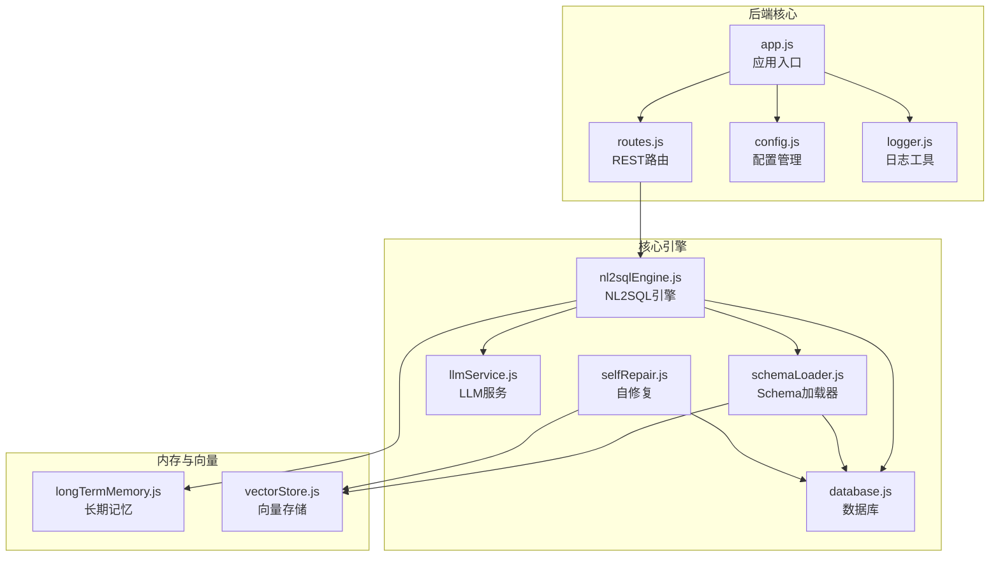
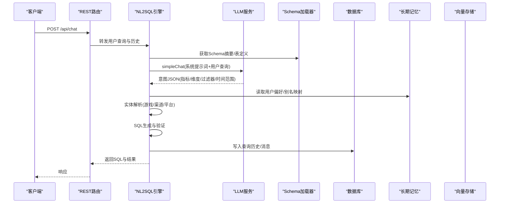
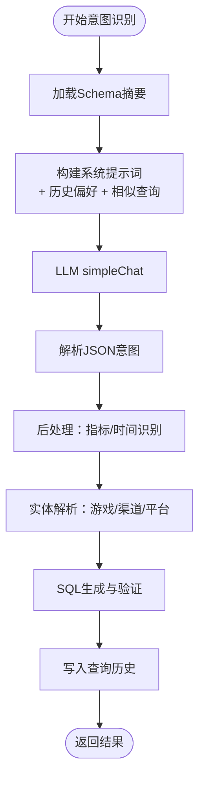
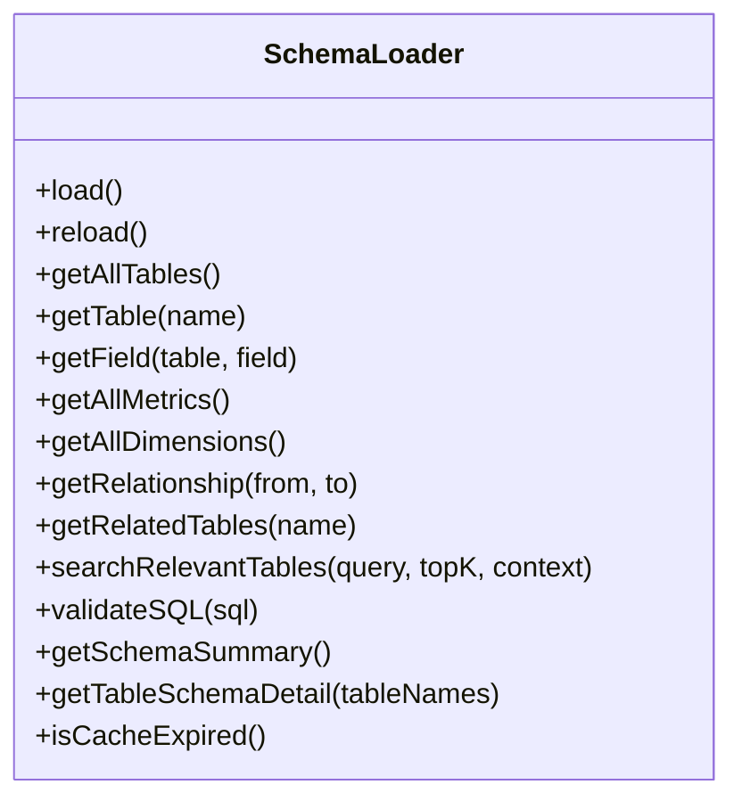
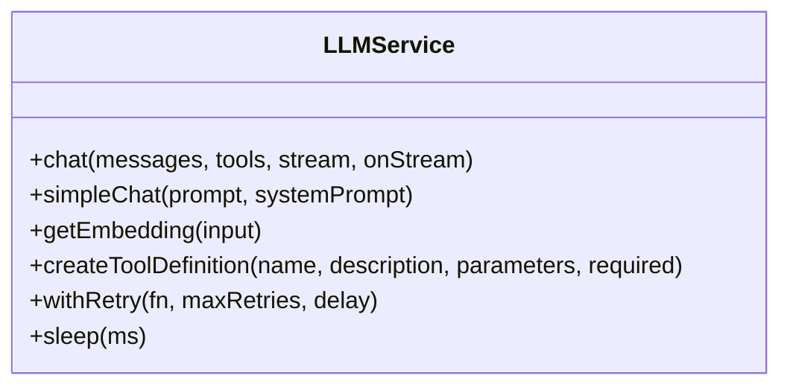
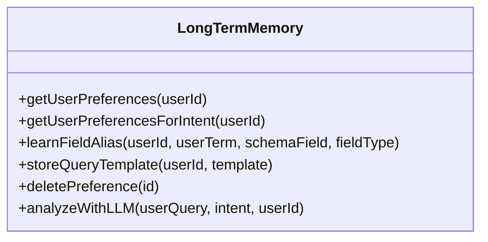
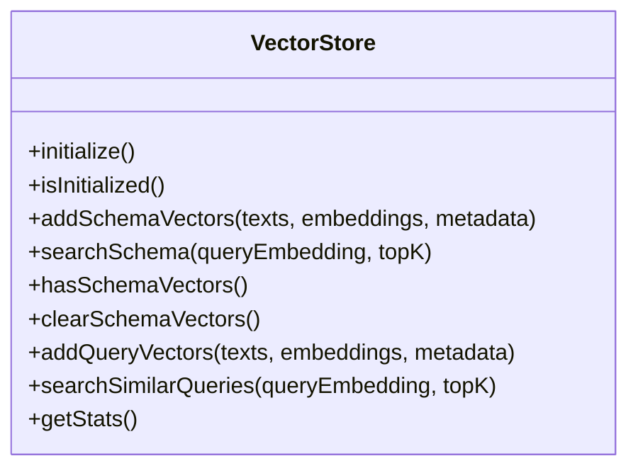
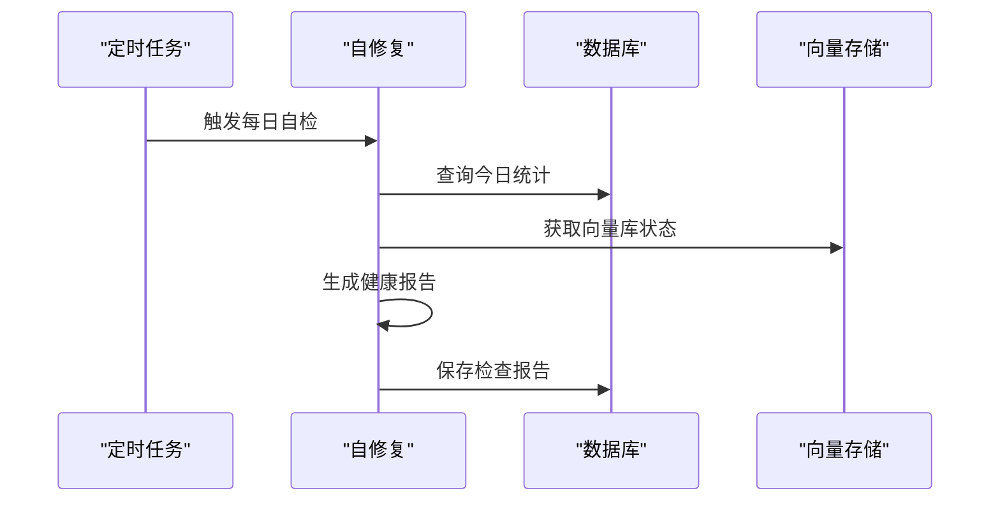
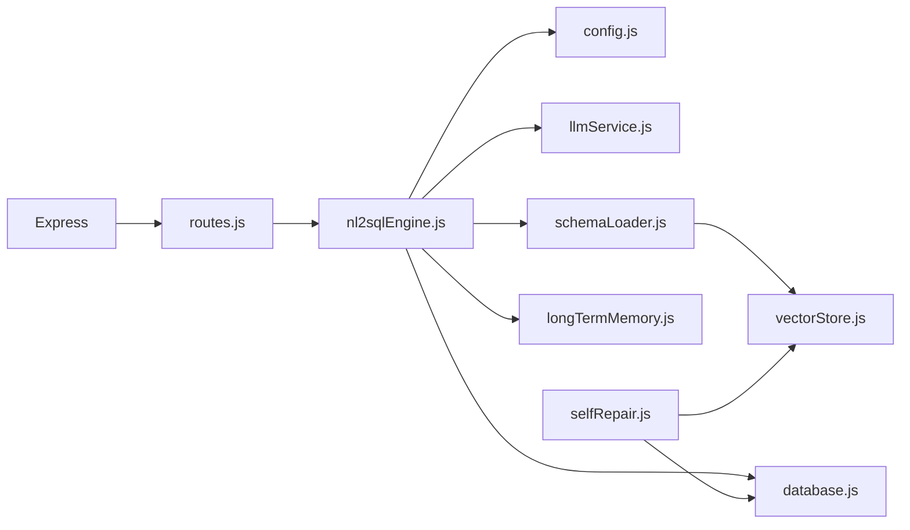

# NL2SQL引擎扩展

<cite>
**本文档引用的文件**
- [nl2sqlEngine.js](file://backend/src/core/nl2sqlEngine.js)
- [schemaLoader.js](file://backend/src/core/schemaLoader.js)
- [llmService.js](file://backend/src/core/llmService.js)
- [selfRepair.js](file://backend/src/core/selfRepair.js)
- [app.js](file://backend/src/app.js)
- [config.js](file://backend/src/core/config.js)
- [routes.js](file://backend/src/core/routes.js)
- [database.js](file://backend/src/core/database.js)
- [longTermMemory.js](file://backend/src/memory/longTermMemory.js)
- [vectorStore.js](file://backend/src/memory/vectorStore.js)
- [logger.js](file://backend/src/utils/logger.js)
- [schema-metadata.json](file://backend/config/schema-metadata.json)
- [package.json](file://backend/package.json)
</cite>

## 目录
1. [简介](#简介)
2. [项目结构](#项目结构)
3. [核心组件](#核心组件)
4. [架构概览](#架构概览)
5. [详细组件分析](#详细组件分析)
6. [依赖分析](#依赖分析)
7. [性能考虑](#性能考虑)
8. [故障排查指南](#故障排查指南)
9. [结论](#结论)
10. [附录](#附录)

## 简介
本技术文档面向NL2SQL引擎的扩展开发者，系统性阐述如何在现有架构基础上进行扩展，包括：
- 意图识别算法的改进与规则扩展
- 实体解析机制的增强与多语言支持
- SQL生成逻辑的优化与复杂语法支持
- 新查询解析算法的接入点与最佳实践
- 引擎模块的扩展点（LLM服务、Schema加载器、自定义解析器）
- 具体扩展示例（指标识别规则、多语言查询、查询缓存机制）
- 测试方法、性能评估标准与最佳实践

## 项目结构
后端采用模块化设计，核心模块位于`backend/src/core`，内存与向量存储位于`backend/src/memory`，工具与配置位于`backend/src/utils`和`backend/src/core/config.js`，前端位于`frontend`。

**图表来源**
- [app.js:1-238](file://backend/src/app.js#L1-L238)
- [routes.js:1-895](file://backend/src/core/routes.js#L1-L895)
- [nl2sqlEngine.js:1-2010](file://backend/src/core/nl2sqlEngine.js#L1-L2010)
- [schemaLoader.js:1-732](file://backend/src/core/schemaLoader.js#L1-L732)
- [llmService.js:1-432](file://backend/src/core/llmService.js#L1-L432)
- [database.js:1-850](file://backend/src/core/database.js#L1-L850)
- [longTermMemory.js:1-1134](file://backend/src/memory/longTermMemory.js#L1-L1134)
- [vectorStore.js:1-621](file://backend/src/memory/vectorStore.js#L1-L621)
- [selfRepair.js:1-489](file://backend/src/core/selfRepair.js#L1-L489)
- [config.js:1-372](file://backend/src/core/config.js#L1-L372)
- [logger.js:1-318](file://backend/src/utils/logger.js#L1-L318)

**章节来源**
- [app.js:1-238](file://backend/src/app.js#L1-L238)
- [routes.js:1-895](file://backend/src/core/routes.js#L1-L895)
- [config.js:1-372](file://backend/src/core/config.js#L1-L372)

## 核心组件
- NL2SQL引擎：负责意图识别、实体解析、SQL生成、验证与结果格式化
- Schema加载器：加载与管理数据库Schema，提供表/字段/关系查询与向量化
- LLM服务：封装LLM API调用、重试机制与Embedding获取
- 数据库：SQLite持久化存储会话、消息、查询历史与用户偏好
- 长期记忆：提取并存储用户偏好、查询模式与字段别名
- 向量存储：基于LanceDB的语义检索与相似查询匹配
- 自修复：定时任务与健康检查，保障系统稳定性

**章节来源**
- [nl2sqlEngine.js:1-2010](file://backend/src/core/nl2sqlEngine.js#L1-L2010)
- [schemaLoader.js:1-732](file://backend/src/core/schemaLoader.js#L1-L732)
- [llmService.js:1-432](file://backend/src/core/llmService.js#L1-L432)
- [database.js:1-850](file://backend/src/core/database.js#L1-L850)
- [longTermMemory.js:1-1134](file://backend/src/memory/longTermMemory.js#L1-L1134)
- [vectorStore.js:1-621](file://backend/src/memory/vectorStore.js#L1-L621)
- [selfRepair.js:1-489](file://backend/src/core/selfRepair.js#L1-L489)

## 架构概览
NL2SQL引擎通过LLM进行意图识别，结合Schema元数据与长期记忆，完成实体解析与SQL生成。Schema加载器提供表/字段/关系信息，并支持向量化检索。向量存储用于语义匹配与相似查询检索。数据库持久化会话与历史记录。自修复模块定期执行健康检查与维护任务。

**图表来源**
- [routes.js:1-895](file://backend/src/core/routes.js#L1-L895)
- [nl2sqlEngine.js:1-2010](file://backend/src/core/nl2sqlEngine.js#L1-L2010)
- [llmService.js:1-432](file://backend/src/core/llmService.js#L1-L432)
- [schemaLoader.js:1-732](file://backend/src/core/schemaLoader.js#L1-L732)
- [database.js:1-850](file://backend/src/core/database.js#L1-L850)
- [longTermMemory.js:1-1134](file://backend/src/memory/longTermMemory.js#L1-L1134)
- [vectorStore.js:1-621](file://backend/src/memory/vectorStore.js#L1-L621)

## 详细组件分析

### NL2SQL引擎扩展点
NL2SQL引擎是扩展的核心入口，提供以下扩展点：
- 意图识别增强：系统提示词、字段别名映射、历史偏好注入
- 实体解析扩展：游戏/渠道/平台术语映射、长期记忆学习
- SQL生成与验证：基于Schema的字段/关系校验、安全关键字过滤
- 上下文融合：澄清问题的合并与默认选项确认

**图表来源**
- [nl2sqlEngine.js:488-780](file://backend/src/core/nl2sqlEngine.js#L488-L780)
- [schemaLoader.js:608-628](file://backend/src/core/schemaLoader.js#L608-L628)
- [longTermMemory.js:1-1134](file://backend/src/memory/longTermMemory.js#L1-L1134)

**章节来源**
- [nl2sqlEngine.js:488-780](file://backend/src/core/nl2sqlEngine.js#L488-L780)
- [schemaLoader.js:608-628](file://backend/src/core/schemaLoader.js#L608-L628)

### Schema加载器扩展点
Schema加载器负责：
- 加载与缓存Schema元数据
- 表/字段/关系查询与匹配
- 向量化Schema以支持语义检索
- 安全SQL验证（关键字过滤、白名单）

**图表来源**
- [schemaLoader.js:1-732](file://backend/src/core/schemaLoader.js#L1-L732)

**章节来源**
- [schemaLoader.js:1-732](file://backend/src/core/schemaLoader.js#L1-L732)

### LLM服务扩展点
LLM服务提供：
- HTTP请求封装与重试机制
- Chat与Embedding API调用
- 工具定义辅助函数

**图表来源**
- [llmService.js:1-432](file://backend/src/core/llmService.js#L1-L432)

**章节来源**
- [llmService.js:1-432](file://backend/src/core/llmService.js#L1-L432)

### 长期记忆扩展点
长期记忆模块负责：
- 用户偏好提取与存储
- 查询模式与字段别名学习
- LLM智能提炼（可选）

**图表来源**
- [longTermMemory.js:1-1134](file://backend/src/memory/longTermMemory.js#L1-L1134)

**章节来源**
- [longTermMemory.js:1-1134](file://backend/src/memory/longTermMemory.js#L1-L1134)

### 向量存储扩展点
向量存储模块负责：
- LanceDB连接与初始化
- Schema向量化与检索
- 查询历史向量化与相似度匹配

**图表来源**
- [vectorStore.js:1-621](file://backend/src/memory/vectorStore.js#L1-L621)

**章节来源**
- [vectorStore.js:1-621](file://backend/src/memory/vectorStore.js#L1-L621)

### 自修复与监控
自修复模块提供：
- 定时任务：每日自检、会话清理、统计收集、记忆维护
- 健康检查：数据库、向量库、查询统计、连接数、系统资源
- 报告存储：系统日志表

**图表来源**
- [selfRepair.js:1-489](file://backend/src/core/selfRepair.js#L1-L489)

**章节来源**
- [selfRepair.js:1-489](file://backend/src/core/selfRepair.js#L1-L489)

## 依赖分析
- Express路由与中间件：提供REST API与CORS、BodyParser支持
- SQLite3：本地数据库，存储会话、消息、查询历史与用户偏好
- LanceDB：向量数据库，支持Schema与查询历史的向量化
- dotenv：环境变量加载
- node-cron：定时任务调度

**图表来源**
- [package.json:1-28](file://backend/package.json#L1-L28)
- [routes.js:1-895](file://backend/src/core/routes.js#L1-L895)
- [nl2sqlEngine.js:1-2010](file://backend/src/core/nl2sqlEngine.js#L1-L2010)
- [config.js:1-372](file://backend/src/core/config.js#L1-L372)
- [llmService.js:1-432](file://backend/src/core/llmService.js#L1-L432)
- [schemaLoader.js:1-732](file://backend/src/core/schemaLoader.js#L1-L732)
- [database.js:1-850](file://backend/src/core/database.js#L1-L850)
- [longTermMemory.js:1-1134](file://backend/src/memory/longTermMemory.js#L1-L1134)
- [vectorStore.js:1-621](file://backend/src/memory/vectorStore.js#L1-L621)
- [selfRepair.js:1-489](file://backend/src/core/selfRepair.js#L1-L489)

**章节来源**
- [package.json:1-28](file://backend/package.json#L1-L28)

## 性能考虑
- LLM调用超时与重试：合理设置超时与重试次数，避免阻塞
- 向量化批处理：Embedding分批获取，避免单次请求过大
- Schema缓存：启用缓存并设置过期时间，减少重复加载
- 查询限制：最大返回行数、查询超时、禁止关键字过滤
- 定时任务：自修复任务按需配置，避免频繁扫描

[本节为通用指导，无需特定文件引用]

## 故障排查指南
- LLM API失败：检查API密钥、基础URL、超时设置与重试日志
- 向量库初始化失败：确认LanceDB路径与权限，检查向量维度与模型
- 数据库连接异常：检查SQLite文件路径与权限，确认外键约束启用
- 健康检查告警：查看自修复报告，关注慢查询与内存使用率
- 日志定位：通过日志级别与结构化元数据快速定位问题

**章节来源**
- [llmService.js:157-195](file://backend/src/core/llmService.js#L157-L195)
- [vectorStore.js:195-200](file://backend/src/memory/vectorStore.js#L195-L200)
- [database.js:200-261](file://backend/src/core/database.js#L200-L261)
- [selfRepair.js:169-310](file://backend/src/core/selfRepair.js#L169-L310)
- [logger.js:227-293](file://backend/src/utils/logger.js#L227-L293)

## 结论
NL2SQL引擎通过模块化设计与丰富的扩展点，为意图识别、实体解析与SQL生成提供了良好的可扩展性。通过合理利用LLM、Schema、长期记忆与向量存储，可以在不破坏核心流程的前提下，逐步增强引擎能力，满足更复杂的查询场景与业务需求。

[本节为总结，无需特定文件引用]

## 附录

### 扩展清单与最佳实践
- 意图识别规则扩展
  - 在系统提示词中增加领域规则与业务术语映射
  - 通过长期记忆注入用户习惯与偏好
  - 示例路径：[nl2sqlEngine.js:620-692](file://backend/src/core/nl2sqlEngine.js#L620-L692)

- 实体解析增强
  - 扩展实体映射规则（游戏/渠道/平台）
  - 支持多语言术语映射与同义词学习
  - 示例路径：[nl2sqlEngine.js:309-383](file://backend/src/core/nl2sqlEngine.js#L309-L383)

- SQL生成与验证
  - 基于Schema的字段/关系校验
  - 增加复杂语法支持（JOIN、子查询、聚合函数）
  - 示例路径：[schemaLoader.js:563-606](file://backend/src/core/schemaLoader.js#L563-L606)

- LLM服务集成
  - 支持多模型切换与工具函数定义
  - 增加重试与超时策略
  - 示例路径：[llmService.js:222-277](file://backend/src/core/llmService.js#L222-L277)

- Schema加载器适配
  - 动态加载与缓存管理
  - 向量化与语义检索
  - 示例路径：[schemaLoader.js:69-122](file://backend/src/core/schemaLoader.js#L69-L122)

- 自定义解析器开发
  - 基于意图结构扩展解析逻辑
  - 支持澄清问题合并与默认选项确认
  - 示例路径：[nl2sqlEngine.js:791-800](file://backend/src/core/nl2sqlEngine.js#L791-L800)

- 多语言支持
  - 在系统提示词中加入多语言规则
  - 通过长期记忆存储语言映射
  - 示例路径：[longTermMemory.js:56-188](file://backend/src/memory/longTermMemory.js#L56-L188)

- 查询缓存机制
  - 基于查询文本与意图的缓存键设计
  - 缓存失效策略与一致性保证
  - 示例路径：[nl2sqlEngine.js:488-780](file://backend/src/core/nl2sqlEngine.js#L488-L780)

- 测试方法
  - 单元测试：意图识别、实体解析、SQL生成
  - 集成测试：LLM调用、向量检索、数据库交互
  - 性能测试：并发查询、缓存命中率、响应时间
  - 示例路径：[routes.js:1-895](file://backend/src/core/routes.js#L1-L895)

- 性能评估标准
  - LLM响应时间与成功率
  - SQL生成准确率与执行时间
  - 向量检索召回率与延迟
  - 系统资源占用与稳定性
  - 示例路径：[selfRepair.js:169-310](file://backend/src/core/selfRepair.js#L169-L310)