# SQL生成扩展

<cite>
**本文档引用的文件**
- [nl2sqlEngine.js](file://backend/src/core/nl2sqlEngine.js)
- [schemaLoader.js](file://backend/src/core/schemaLoader.js)
- [database.js](file://backend/src/core/database.js)
- [config.js](file://backend/src/core/config.js)
- [llmService.js](file://backend/src/core/llmService.js)
- [vectorStore.js](file://backend/src/memory/vectorStore.js)
- [logger.js](file://backend/src/utils/logger.js)
- [schema-metadata.json](file://backend/config/schema-metadata.json)
- [app.js](file://backend/src/app.js)
- [package.json](file://backend/package.json)
</cite>

## 目录
1. [简介](#简介)
2. [项目结构](#项目结构)
3. [核心组件](#核心组件)
4. [架构概览](#架构概览)
5. [详细组件分析](#详细组件分析)
6. [依赖关系分析](#依赖关系分析)
7. [性能考虑](#性能考虑)
8. [故障排除指南](#故障排除指南)
9. [结论](#结论)
10. [附录](#附录)

## 简介

NL2SQL项目是一个基于自然语言到SQL转换的智能查询系统。该项目实现了从自然语言查询到SQL语句的完整转换流程，包括意图识别、实体解析、SQL生成、安全验证等多个核心功能模块。本文档专注于SQL生成模块的扩展设计，提供详细的扩展示例和最佳实践。

该项目采用现代JavaScript技术栈，使用Node.js作为后端运行时，结合LLM（大语言模型）进行自然语言理解，通过向量数据库实现语义检索，最终生成安全、高效的SQL查询语句。

## 项目结构

NL2SQL项目采用模块化架构设计，主要分为以下几个核心层次：

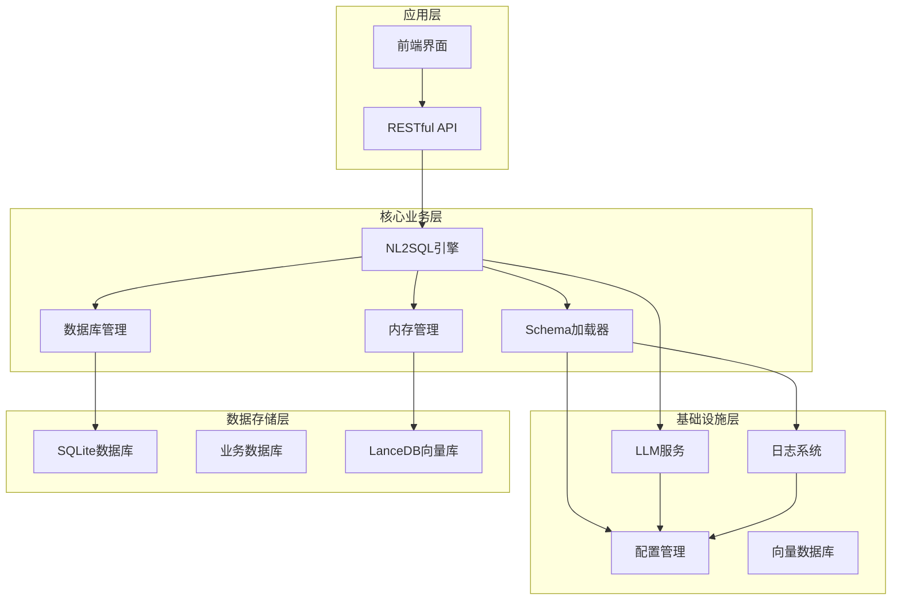

**图表来源**
- [app.js:97-166](file://backend/src/app.js#L97-L166)
- [config.js:16-372](file://backend/src/core/config.js#L16-L372)

**章节来源**
- [app.js:1-238](file://backend/src/app.js#L1-L238)
- [package.json:1-28](file://backend/package.json#L1-L28)

## 核心组件

### NL2SQL引擎模块

NL2SQL引擎是整个系统的核心，负责将自然语言转换为SQL语句。该模块实现了完整的意图识别、实体解析、SQL生成和验证流程。

**主要功能特性：**
- 意图识别：理解用户查询的业务需求
- 实体解析：将模糊描述映射到具体ID
- SQL生成：根据意图生成标准SQL语句
- 安全验证：检查SQL语句的安全性和合法性

**章节来源**
- [nl2sqlEngine.js:1-800](file://backend/src/core/nl2sqlEngine.js#L1-L800)

### Schema元数据管理

Schema加载器负责管理数据库表结构信息，提供Schema查询、匹配和验证功能。

**核心能力：**
- Schema配置文件加载
- 表结构验证
- 语义搜索匹配
- 安全性验证

**章节来源**
- [schemaLoader.js:1-751](file://backend/src/core/schemaLoader.js#L1-L751)

### 数据库抽象层

数据库模块提供了统一的数据库访问接口，支持SQLite和业务数据库的连接管理。

**功能特点：**
- 连接池管理
- 事务处理
- 数据持久化
- 查询历史记录

**章节来源**
- [database.js:1-850](file://backend/src/core/database.js#L1-L850)

## 架构概览

NL2SQL系统采用分层架构设计，各层之间职责清晰，耦合度低，便于扩展和维护。

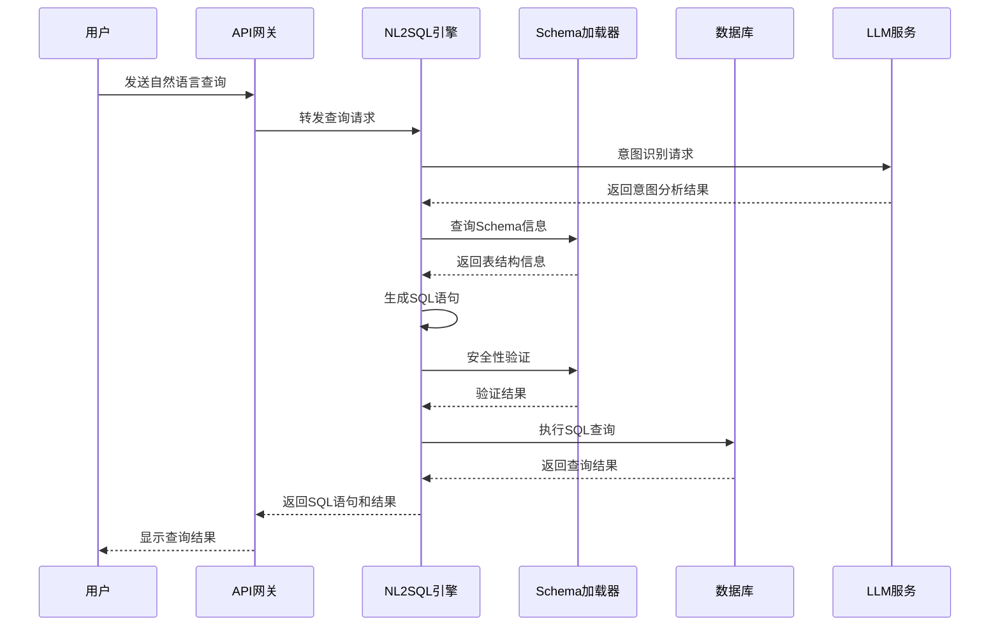

**图表来源**
- [nl2sqlEngine.js:497-780](file://backend/src/core/nl2sqlEngine.js#L497-L780)
- [schemaLoader.js:589-625](file://backend/src/core/schemaLoader.js#L589-L625)

## 详细组件分析

### SQL生成引擎扩展点

NL2SQL引擎提供了多个扩展点，支持复杂的SQL语法生成：

#### 1. 子查询支持扩展

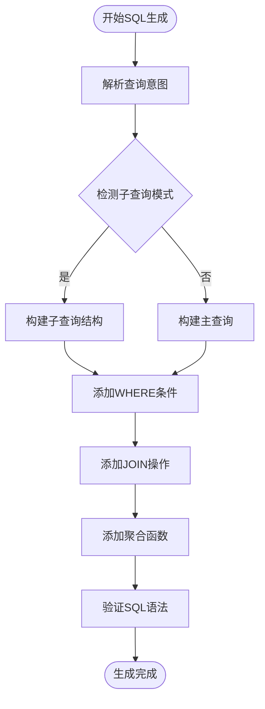

**图表来源**
- [nl2sqlEngine.js:497-780](file://backend/src/core/nl2sqlEngine.js#L497-L780)

#### 2. 窗口函数支持

窗口函数扩展需要在SQL生成逻辑中添加专门的处理分支：

**扩展要点：**
- 识别窗口函数模式（如ROW_NUMBER、RANK、SUM OVER）
- 处理PARTITION BY和ORDER BY子句
- 确保窗口函数与聚合函数的正确组合

#### 3. CTE（公用表表达式）支持

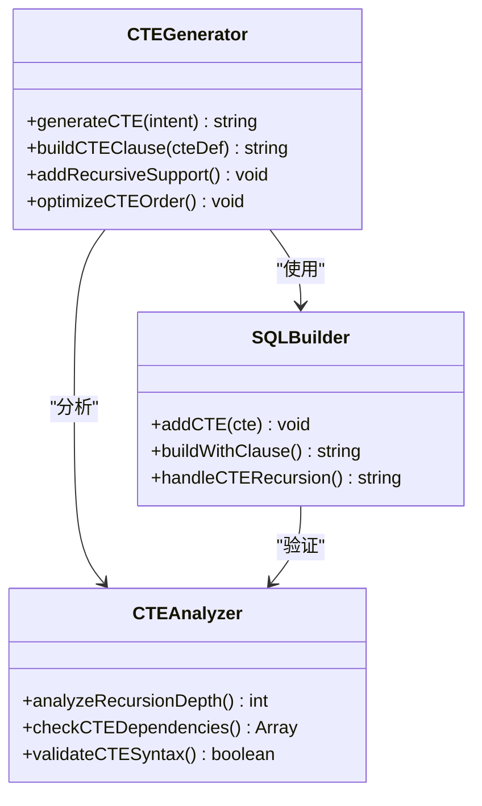

**图表来源**
- [nl2sqlEngine.js:1-800](file://backend/src/core/nl2sqlEngine.js#L1-L800)

### 聚合函数增强

聚合函数处理是SQL生成的核心部分，需要支持多种聚合模式：

#### 聚合函数分类

| 聚合类型 | 支持函数 | 扩展点 |
|---------|---------|--------|
| 数值聚合 | SUM, AVG, MIN, MAX, COUNT | 添加自定义聚合函数 |
| 统计聚合 | STDDEV, VARIANCE | 支持窗口函数 |
| 条件聚合 | CASE WHEN | 复杂条件处理 |
| 窗口聚合 | SUM() OVER(), AVG() OVER() | 窗口函数支持 |

#### 聚合函数生成流程

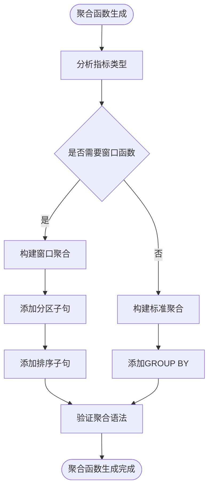

**图表来源**
- [schema-metadata.json:746-765](file://backend/config/schema-metadata.json#L746-L765)

### JOIN操作优化

JOIN操作生成是SQL优化的关键环节，需要考虑性能和正确性：

#### JOIN类型支持

| JOIN类型 | 使用场景 | 性能考虑 |
|---------|---------|----------|
| INNER JOIN | 精确匹配 | 性能最优 |
| LEFT JOIN | 左侧表完整性 | 需要NULL处理 |
| RIGHT JOIN | 右侧表完整性 | 较少使用 |
| FULL OUTER JOIN | 两侧完整性 | 性能较差 |

#### JOIN优化策略

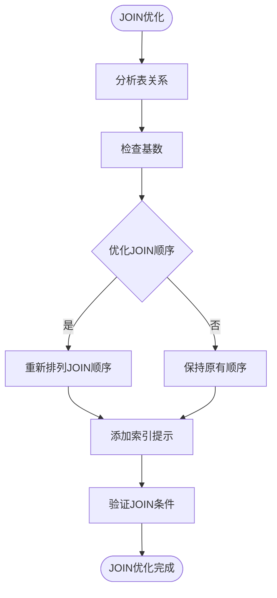

**图表来源**
- [schemaLoader.js:367-372](file://backend/src/core/schemaLoader.js#L367-L372)

### SQL模板规则扩展

SQL模板系统提供了灵活的SQL生成框架，支持自定义模板规则：

#### 模板规则结构

```javascript
const sqlTemplates = {
  // 基础查询模板
  basicQuery: {
    select: "SELECT {fields}",
    from: "FROM {table}",
    where: "{whereClause}",
    groupBy: "{groupBy}",
    orderBy: "{orderBy}",
    limit: "{limit}"
  },
  
  // 子查询模板
  subquery: {
    select: "SELECT {fields}",
    from: "({subquery}) AS sq",
    where: "{whereClause}",
    join: "{joinClause}"
  },
  
  // 聚合模板
  aggregation: {
    select: "{aggregateFunction}({field}) AS {alias}",
    groupBy: "{groupBy}",
    having: "{havingClause}"
  }
};
```

#### 模板扩展点

**章节来源**
- [nl2sqlEngine.js:497-780](file://backend/src/core/nl2sqlEngine.js#L497-L780)

### 多表关联查询支持

多表关联查询需要处理复杂的表关系和连接条件：

#### 关联表识别

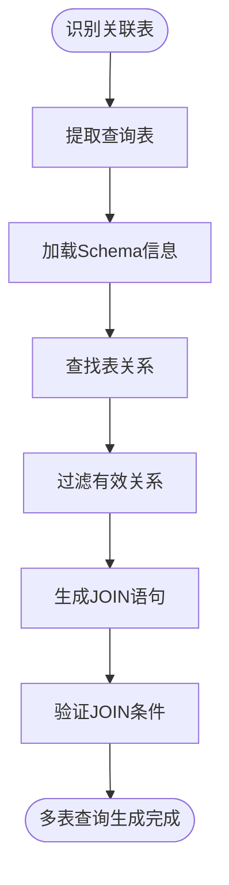

**图表来源**
- [schemaLoader.js:367-390](file://backend/src/core/schemaLoader.js#L367-L390)

### 复杂WHERE条件生成

WHERE条件生成支持复杂的查询逻辑和条件组合：

#### 条件类型支持

| 条件类型 | 语法示例 | 扩展点 |
|---------|---------|--------|
| 比较条件 | field = value, field > 100 | 支持自定义比较符 |
| 范围条件 | field BETWEEN 1 AND 10 | 多值范围支持 |
| 模糊匹配 | field LIKE '%pattern%' | 正则表达式支持 |
| 空值检查 | field IS NULL, field IS NOT NULL | 空值处理优化 |

#### WHERE条件优化

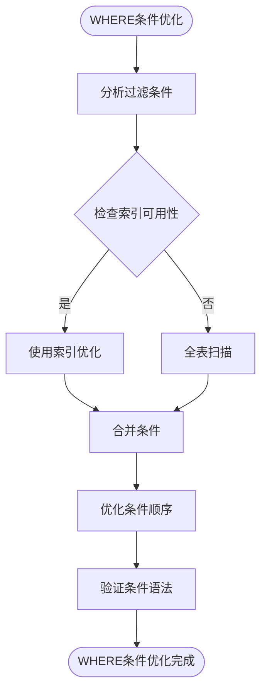

**图表来源**
- [schemaLoader.js:589-625](file://backend/src/core/schemaLoader.js#L589-L625)

### 排序和限制条件处理

排序和限制条件处理需要考虑性能和用户体验：

#### 排序优化策略

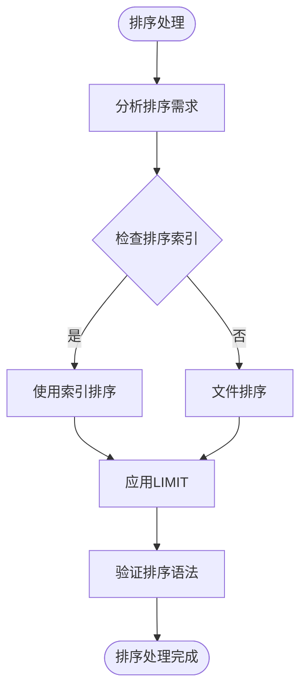

**图表来源**
- [config.js:150-157](file://backend/src/core/config.js#L150-L157)

### SQL安全性检查增强

安全检查是SQL生成的重要保障，需要防止SQL注入和其他安全威胁：

#### 安全检查机制

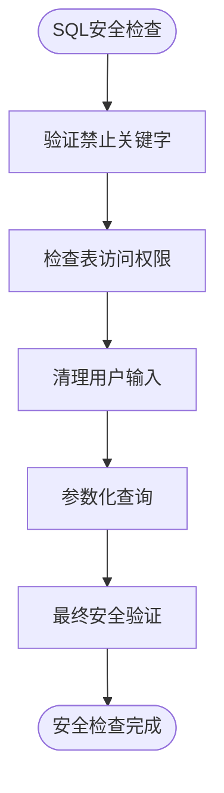

**图表来源**
- [schemaLoader.js:589-625](file://backend/src/core/schemaLoader.js#L589-L625)

## 依赖关系分析

NL2SQL系统的依赖关系呈现清晰的分层结构，各模块之间的耦合度较低，便于独立扩展。

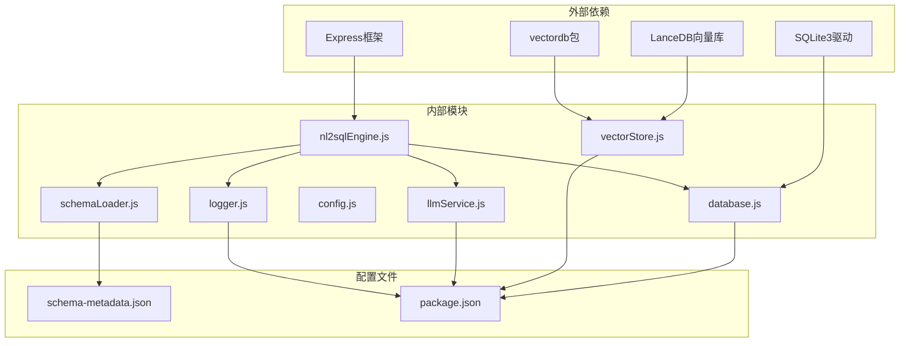

**图表来源**
- [package.json:10-27](file://backend/package.json#L10-L27)
- [app.js:40-50](file://backend/src/app.js#L40-L50)

**章节来源**
- [package.json:1-28](file://backend/package.json#L1-L28)
- [app.js:1-238](file://backend/src/app.js#L1-L238)

## 性能考虑

NL2SQL系统在设计时充分考虑了性能优化，特别是在SQL生成和查询执行方面：

### 性能优化策略

#### 1. 缓存机制

系统实现了多层次的缓存策略：
- Schema元数据缓存
- 查询历史缓存
- 向量搜索结果缓存
- LLM响应缓存

#### 2. 查询优化

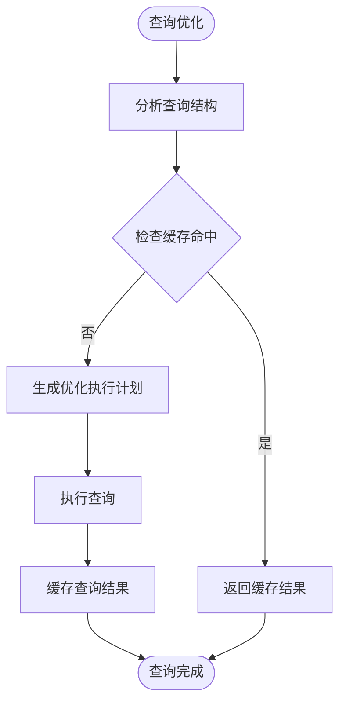

#### 3. 并发处理

系统支持并发查询处理，通过连接池和异步操作提高吞吐量。

**章节来源**
- [config.js:235-245](file://backend/src/core/config.js#L235-L245)
- [database.js:115-135](file://backend/src/core/database.js#L115-L135)

## 故障排除指南

### 常见问题及解决方案

#### 1. SQL生成错误

**问题症状：** 生成的SQL语句语法错误或逻辑不正确

**诊断步骤：**
1. 检查意图识别结果
2. 验证Schema元数据完整性
3. 分析SQL生成逻辑
4. 检查安全验证规则

**解决方案：**
- 更新Schema配置文件
- 调整SQL生成模板
- 增强错误处理机制

#### 2. 性能问题

**问题症状：** 查询响应时间过长或系统负载过高

**诊断步骤：**
1. 分析查询执行计划
2. 检查索引使用情况
3. 监控数据库连接池
4. 评估缓存效果

**解决方案：**
- 优化SQL查询结构
- 添加适当的索引
- 调整缓存策略
- 实施查询超时机制

#### 3. 安全问题

**问题症状：** SQL注入攻击或未授权访问

**诊断步骤：**
1. 检查安全验证规则
2. 分析用户输入处理
3. 验证权限控制机制
4. 审计访问日志

**解决方案：**
- 强化输入验证
- 实施严格的权限控制
- 增加审计日志
- 定期安全审查

**章节来源**
- [schemaLoader.js:589-625](file://backend/src/core/schemaLoader.js#L589-L625)
- [config.js:140-170](file://backend/src/core/config.js#L140-L170)

## 结论

NL2SQL项目为SQL生成模块提供了完善的扩展框架。通过合理利用现有的扩展点和架构设计，可以轻松实现复杂的SQL语法支持，包括子查询、窗口函数、CTE等高级特性。

### 扩展优势

1. **模块化设计**：清晰的模块边界便于独立扩展
2. **灵活的模板系统**：支持自定义SQL模板规则
3. **强大的Schema管理**：完善的表结构和关系管理
4. **安全机制完善**：多层次的安全检查和防护
5. **性能优化**：缓存、索引和并发处理优化

### 最佳实践建议

1. **渐进式扩展**：从小功能开始，逐步增加复杂性
2. **充分测试**：为每个扩展功能编写单元测试
3. **性能监控**：持续监控扩展功能的性能影响
4. **安全验证**：确保扩展功能符合安全要求
5. **文档维护**：及时更新扩展文档和API说明

## 附录

### 扩展开发指南

#### 1. 新增SQL语法支持

**开发步骤：**
1. 分析目标SQL语法的特性和使用场景
2. 设计相应的SQL生成逻辑
3. 实现语法解析和生成算法
4. 编写测试用例验证功能
5. 集成到现有SQL生成流程

#### 2. 自定义SQL生成器

**实现要点：**
- 继承基础SQL生成器类
- 实现特定语法的生成逻辑
- 处理边界情况和错误场景
- 集成到模板系统中

#### 3. 模板引擎集成

**集成方案：**
- 选择合适的模板引擎（如Handlebars、Mustache）
- 设计模板语法和变量绑定
- 实现模板渲染和错误处理
- 优化模板性能和缓存策略

#### 4. SQL优化器接入

**优化策略：**
- 分析查询执行计划
- 识别性能瓶颈
- 应用优化规则和启发式算法
- 实施查询重写和重排序

### 测试方法

#### 1. 单元测试

为每个扩展功能编写独立的单元测试，覆盖正常和异常场景。

#### 2. 集成测试

测试扩展功能与现有系统的集成效果，确保兼容性和稳定性。

#### 3. 性能测试

评估扩展功能对系统性能的影响，包括内存使用、CPU占用和响应时间。

#### 4. 安全测试

验证扩展功能的安全性，防止SQL注入和其他安全威胁。

### 性能评估标准

#### 1. 响应时间
- 单查询响应时间不超过30秒
- 批量查询平均响应时间不超过5秒

#### 2. 吞吐量
- 系统支持至少100并发查询
- QPS不低于50

#### 3. 资源使用
- 内存使用峰值不超过配置上限的80%
- CPU使用率不超过80%

#### 4. 可靠性
- 系统可用性达到99.9%
- 错误率低于0.1%