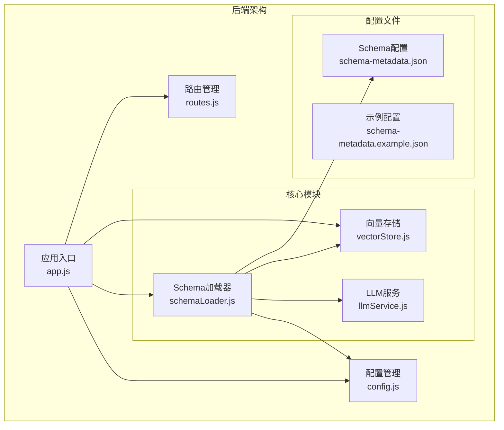
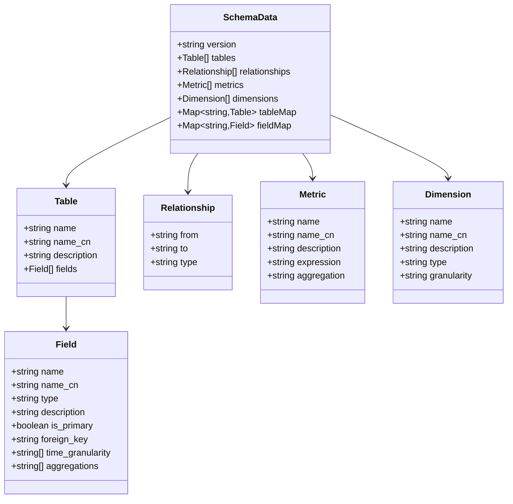
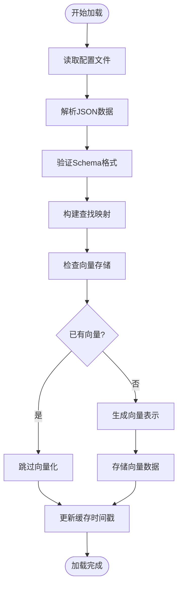
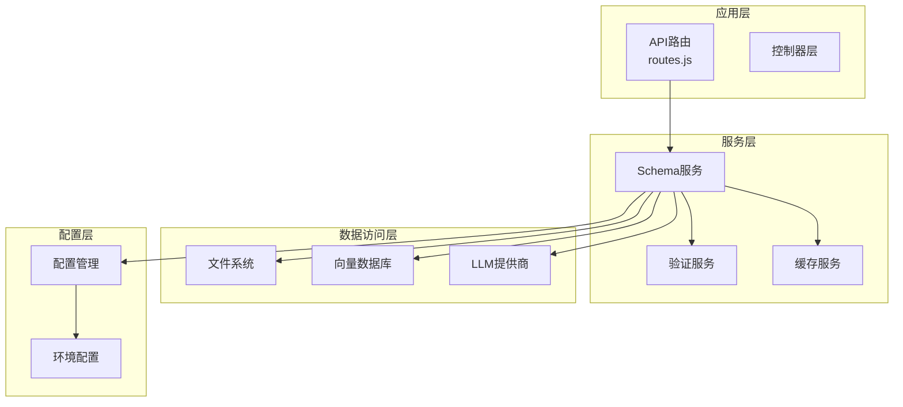
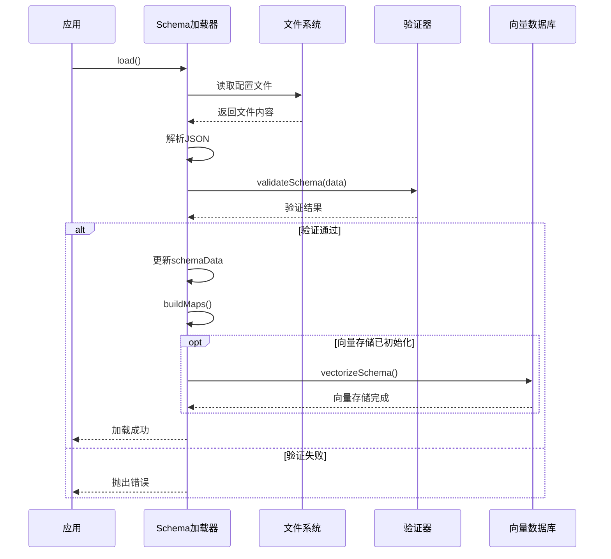
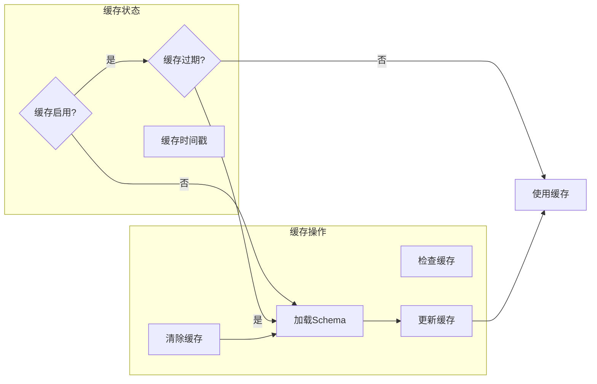
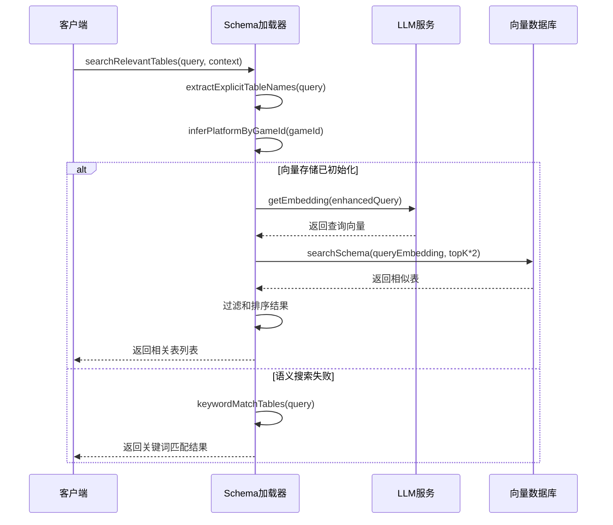
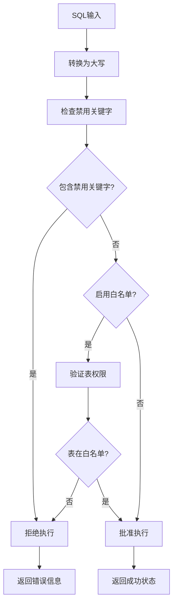
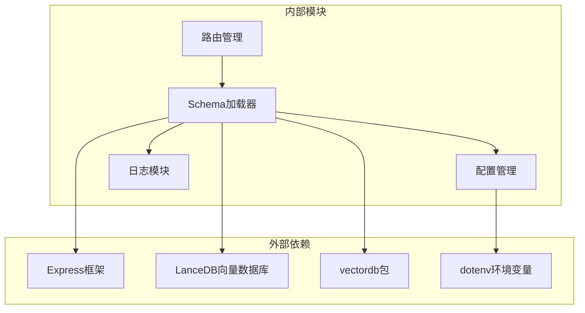

# Schema加载器扩展

<cite>
**本文档引用的文件**
- [schemaLoader.js](file://backend/src/core/schemaLoader.js)
- [config.js](file://backend/src/core/config.js)
- [routes.js](file://backend/src/core/routes.js)
- [vectorStore.js](file://backend/src/memory/vectorStore.js)
- [llmService.js](file://backend/src/core/llmService.js)
- [app.js](file://backend/src/app.js)
- [schema-metadata.json](file://backend/config/schema-metadata.json)
- [schema-metadata.example.json](file://backend/config/schema-metadata.example.json)
- [package.json](file://backend/package.json)
</cite>

## 目录
1. [简介](#简介)
2. [项目结构](#项目结构)
3. [核心组件](#核心组件)
4. [架构概览](#架构概览)
5. [详细组件分析](#详细组件分析)
6. [依赖分析](#依赖分析)
7. [性能考虑](#性能考虑)
8. [故障排除指南](#故障排除指南)
9. [结论](#结论)
10. [附录](#附录)

## 简介

Schema加载器模块是NL2SQL系统的核心组件之一，负责加载和管理数据表的Schema元数据信息。该模块提供了完整的Schema生命周期管理，包括加载、验证、缓存、查询和匹配等功能。本文档将深入分析Schema加载器的扩展机制，提供详细的扩展示例和最佳实践。

## 项目结构

NL2SQL项目的后端采用模块化架构设计，Schema加载器位于核心模块中，与其他组件紧密协作：



**图表来源**
- [app.js:97-166](file://backend/src/app.js#L97-L166)
- [schemaLoader.js:15-26](file://backend/src/core/schemaLoader.js#L15-L26)

**章节来源**
- [app.js:1-238](file://backend/src/app.js#L1-L238)
- [schemaLoader.js:1-751](file://backend/src/core/schemaLoader.js#L1-L751)

## 核心组件

Schema加载器模块包含以下核心组件：

### 1. Schema数据存储结构



**图表来源**
- [schemaLoader.js:36-51](file://backend/src/core/schemaLoader.js#L36-L51)
- [schemaLoader.js:131-155](file://backend/src/core/schemaLoader.js#L131-L155)

### 2. 加载流程组件



**图表来源**
- [schemaLoader.js:69-122](file://backend/src/core/schemaLoader.js#L69-L122)
- [schemaLoader.js:195-290](file://backend/src/core/schemaLoader.js#L195-L290)

**章节来源**
- [schemaLoader.js:36-122](file://backend/src/core/schemaLoader.js#L36-L122)
- [schemaLoader.js:131-189](file://backend/src/core/schemaLoader.js#L131-L189)

## 架构概览

Schema加载器采用分层架构设计，各组件职责清晰：



**图表来源**
- [routes.js:22-23](file://backend/src/core/routes.js#L22-L23)
- [schemaLoader.js:15-26](file://backend/src/core/schemaLoader.js#L15-L26)

## 详细组件分析

### 1. Schema加载机制

#### 1.1 文件加载与解析

Schema加载器支持从JSON配置文件加载Schema元数据，具有完善的错误处理机制：



**图表来源**
- [schemaLoader.js:69-122](file://backend/src/core/schemaLoader.js#L69-L122)
- [schemaLoader.js:131-155](file://backend/src/core/schemaLoader.js#L131-L155)

#### 1.2 Schema验证规则

加载器实现了多层次的Schema验证机制：

| 验证层级 | 验证内容 | 错误处理 |
|---------|---------|----------|
| 结构验证 | `tables`字段存在且为数组 | 抛出格式错误 |
| 表验证 | 每个表必须有`name`字段 | 抛出缺少字段错误 |
| 字段验证 | 每个字段必须有`name`字段 | 抛出字段定义错误 |
| 关系验证 | 表关系必须符合格式要求 | 验证失败时抛出错误 |

**章节来源**
- [schemaLoader.js:131-155](file://backend/src/core/schemaLoader.js#L131-L155)

### 2. 缓存策略

#### 2.1 缓存架构



**图表来源**
- [schemaLoader.js:697-720](file://backend/src/core/schemaLoader.js#L697-L720)

#### 2.2 缓存配置

缓存策略通过配置文件灵活控制：

| 配置项 | 默认值 | 说明 |
|-------|--------|------|
| `enableCache` | `true` | 是否启用Schema缓存 |
| `cacheExpireTime` | `3600000` (1小时) | 缓存过期时间(毫秒) |
| `revectorize` | `false` | 是否强制重新向量化 |

**章节来源**
- [config.js:235-245](file://backend/src/core/config.js#L235-L245)
- [schemaLoader.js:697-720](file://backend/src/core/schemaLoader.js#L697-L720)

### 3. 搜索与匹配功能

#### 3.1 语义搜索机制

Schema加载器集成了基于向量的语义搜索功能：



**图表来源**
- [schemaLoader.js:430-519](file://backend/src/core/schemaLoader.js#L430-L519)
- [schemaLoader.js:455-515](file://backend/src/core/schemaLoader.js#L455-L515)

#### 3.2 关键词匹配算法

关键词匹配采用多级评分机制：

| 匹配类型 | 评分权重 | 描述 |
|---------|---------|------|
| 完全匹配表名 | +2 | 表名完全匹配给予额外分数 |
| 关键词匹配 | +1 | 表名或字段名包含关键词 |
| 中文名匹配 | +0.5 | 中文名包含关键词 |
| 字段描述匹配 | +0.3 | 字段描述包含关键词 |

**章节来源**
- [schemaLoader.js:528-576](file://backend/src/core/schemaLoader.js#L528-L576)

### 4. SQL验证功能

#### 4.1 安全验证机制

Schema加载器提供了多层SQL安全验证：



**图表来源**
- [schemaLoader.js:589-625](file://backend/src/core/schemaLoader.js#L589-L625)

#### 4.2 验证配置

| 配置项 | 默认值 | 说明 |
|-------|--------|------|
| `forbiddenKeywords` | UPDATE, DELETE, DROP等 | 禁止的SQL关键字列表 |
| `allowedTables` | 空数组 | 允许访问的表白名单 |
| `maxQueryRows` | 1000 | 单次查询最大返回行数 |
| `queryTimeout` | 30000 | 查询超时时间(毫秒) |

**章节来源**
- [config.js:140-170](file://backend/src/core/config.js#L140-L170)
- [schemaLoader.js:589-625](file://backend/src/core/schemaLoader.js#L589-L625)

## 依赖分析

### 1. 外部依赖关系



**图表来源**
- [package.json:10-20](file://backend/package.json#L10-L20)
- [schemaLoader.js:15-26](file://backend/src/core/schemaLoader.js#L15-L26)

### 2. 内部模块耦合

Schema加载器与其他核心模块的交互关系：

| 模块 | 依赖关系 | 用途 |
|------|---------|------|
| config.js | 读取配置 | 获取Schema配置路径、缓存设置等 |
| llmService.js | 生成Embedding | 将Schema向量化 |
| vectorStore.js | 存储向量 | 管理向量数据库 |
| routes.js | 提供API接口 | 对外暴露Schema查询功能 |
| logger.js | 日志记录 | 记录加载过程和错误信息 |

**章节来源**
- [schemaLoader.js:15-26](file://backend/src/core/schemaLoader.js#L15-L26)
- [routes.js:22-23](file://backend/src/core/routes.js#L22-L23)

## 性能考虑

### 1. 缓存优化策略

#### 1.1 缓存命中率优化

- **智能缓存过期**: 基于时间戳的动态过期检查
- **增量更新**: 支持部分Schema更新而非全量重载
- **并发控制**: 避免重复加载同一Schema

#### 1.2 向量存储优化

- **批量处理**: Embedding生成采用批次处理减少API调用
- **向量维度**: 支持可配置的向量维度以平衡精度和性能
- **索引优化**: 利用LanceDB的向量索引提高搜索效率

### 2. 内存使用优化

- **懒加载**: Schema数据按需构建映射表
- **垃圾回收**: 及时清理不再使用的临时数据
- **内存监控**: 定期检查内存使用情况

### 3. 网络I/O优化

- **连接复用**: LLM API请求使用连接池
- **超时控制**: 合理设置请求超时避免阻塞
- **重试机制**: 自动重试失败的网络请求

## 故障排除指南

### 1. 常见问题及解决方案

#### 1.1 Schema加载失败

**问题症状**:
- 应用启动时报Schema文件不存在
- JSON解析错误

**解决步骤**:
1. 检查配置文件路径是否正确
2. 验证JSON格式是否有效
3. 确认文件权限设置

**章节来源**
- [schemaLoader.js:77-80](file://backend/src/core/schemaLoader.js#L77-L80)
- [schemaLoader.js:84-86](file://backend/src/core/schemaLoader.js#L84-L86)

#### 1.2 向量存储初始化失败

**问题症状**:
- 向量搜索功能不可用
- 启动时出现向量数据库错误

**解决步骤**:
1. 检查LanceDB安装状态
2. 验证数据库目录权限
3. 确认磁盘空间充足

**章节来源**
- [vectorStore.js:229-259](file://backend/src/memory/vectorStore.js#L229-L259)

### 2. 性能问题诊断

#### 2.1 加载速度慢

**诊断方法**:
1. 检查文件大小和复杂度
2. 监控磁盘I/O性能
3. 分析网络延迟

**优化建议**:
- 考虑分片加载大型Schema
- 实现增量加载机制
- 使用更快的存储介质

#### 2.2 搜索响应慢

**诊断方法**:
1. 检查向量索引状态
2. 监控Embedding生成性能
3. 分析查询复杂度

**优化建议**:
- 调整topK参数
- 优化向量维度
- 实现查询预过滤

## 结论

Schema加载器模块为NL2SQL系统提供了强大的Schema管理能力。通过模块化设计和分层架构，该模块实现了高效的数据加载、智能的缓存管理和灵活的扩展机制。

主要优势包括：
- **可扩展性**: 支持多种Schema格式和自定义解析器
- **高性能**: 多级缓存和向量搜索优化
- **安全性**: 多层SQL验证和权限控制
- **易维护**: 清晰的模块划分和配置管理

未来扩展方向：
- 支持更多Schema格式（JSON Schema、YAML、外部服务）
- 实现Schema版本管理和变更追踪
- 增强实时Schema更新机制
- 优化大规模Schema的处理性能

## 附录

### 1. 扩展点清单

#### 1.1 自定义Schema解析器

```javascript
// 扩展点示例：添加自定义解析器
class CustomSchemaParser {
    constructor() {
        this.supportedFormats = ['yaml', 'json-schema'];
    }
    
    async parse(filePath) {
        // 实现自定义解析逻辑
    }
    
    validate(schemaData) {
        // 实现自定义验证逻辑
    }
}
```

#### 1.2 Schema变更监听器

```javascript
// 扩展点示例：添加变更监听
class SchemaChangeListener {
    constructor() {
        this.listeners = [];
    }
    
    addListener(callback) {
        this.listeners.push(callback);
    }
    
    notify(schemaData) {
        this.listeners.forEach(listener => listener(schemaData));
    }
}
```

#### 1.3 Schema版本管理

```javascript
// 扩展点示例：版本管理
class SchemaVersionManager {
    constructor() {
        this.versions = new Map();
    }
    
    addVersion(version, schemaData) {
        this.versions.set(version, schemaData);
    }
    
    getVersion(version) {
        return this.versions.get(version);
    }
}
```

### 2. 测试方法

#### 2.1 单元测试

```javascript
// 测试Schema加载功能
describe('SchemaLoader', () => {
    it('应该正确加载JSON配置', async () => {
        const result = await schemaLoader.load();
        expect(result).to.be.an('object');
    });
    
    it('应该验证Schema格式', () => {
        expect(() => {
            schemaLoader.validateSchema(invalidData);
        }).to.throw(Error);
    });
});
```

#### 2.2 集成测试

```javascript
// 测试完整加载流程
describe('Schema Loading Flow', () => {
    it('应该支持缓存和重新加载', async () => {
        await schemaLoader.load();
        const cached = schemaLoader.isCacheExpired();
        await schemaLoader.reload();
        const fresh = schemaLoader.getAllTables().length > 0;
        expect(cached).to.be.true;
        expect(fresh).to.be.true;
    });
});
```

### 3. 兼容性评估标准

#### 3.1 向后兼容性

- 保持现有API接口不变
- 确保默认配置向后兼容
- 提供迁移指南和脚本

#### 3.2 性能兼容性

- 不同规模Schema的性能基准
- 内存使用上限测试
- 并发访问性能测试

#### 3.3 功能兼容性

- 支持的Schema格式范围
- 第三方服务集成能力
- 自定义扩展接口