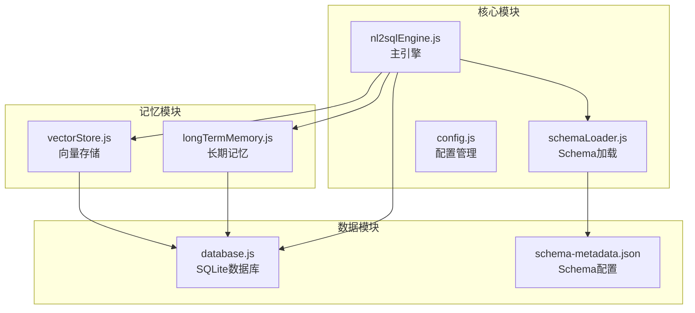
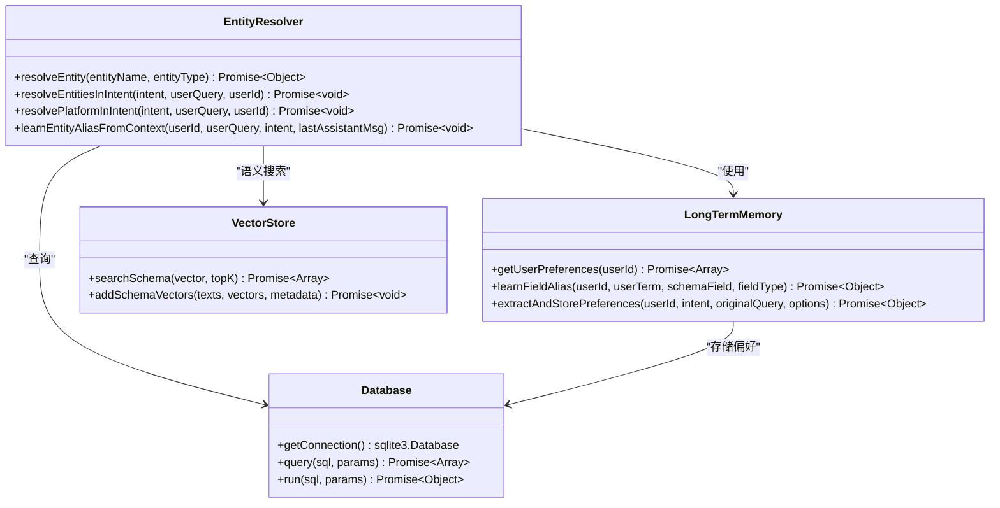
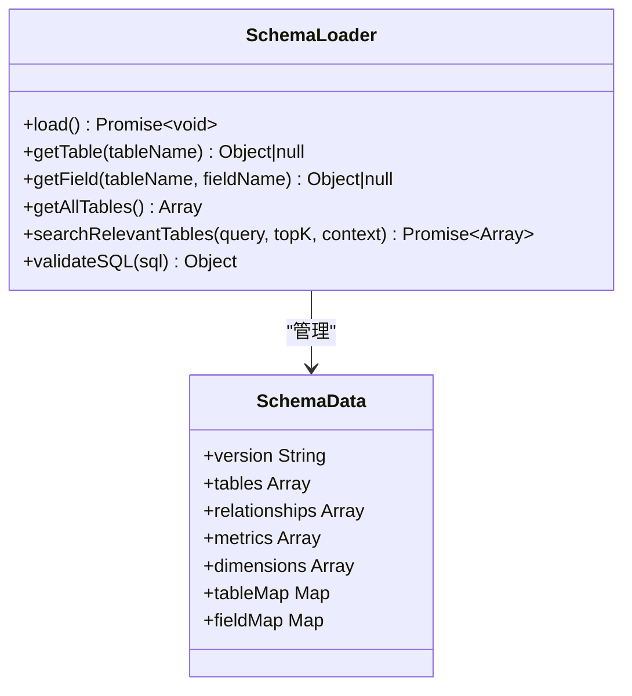
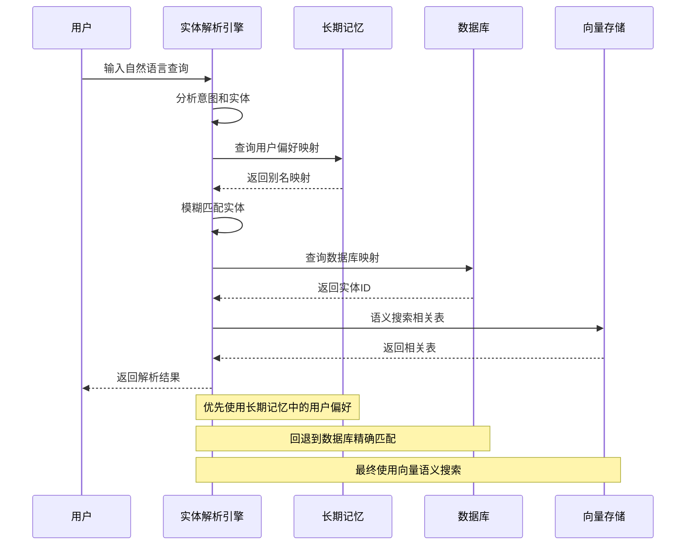
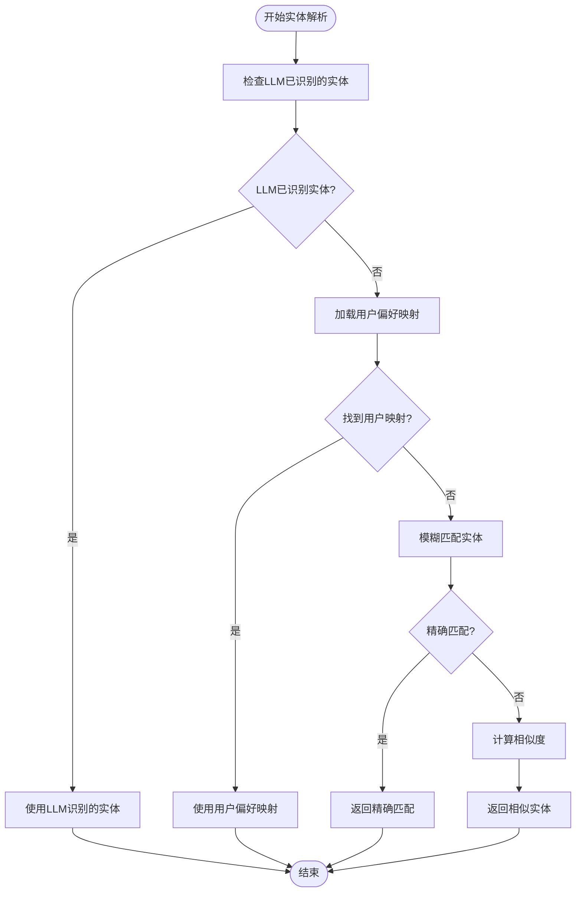
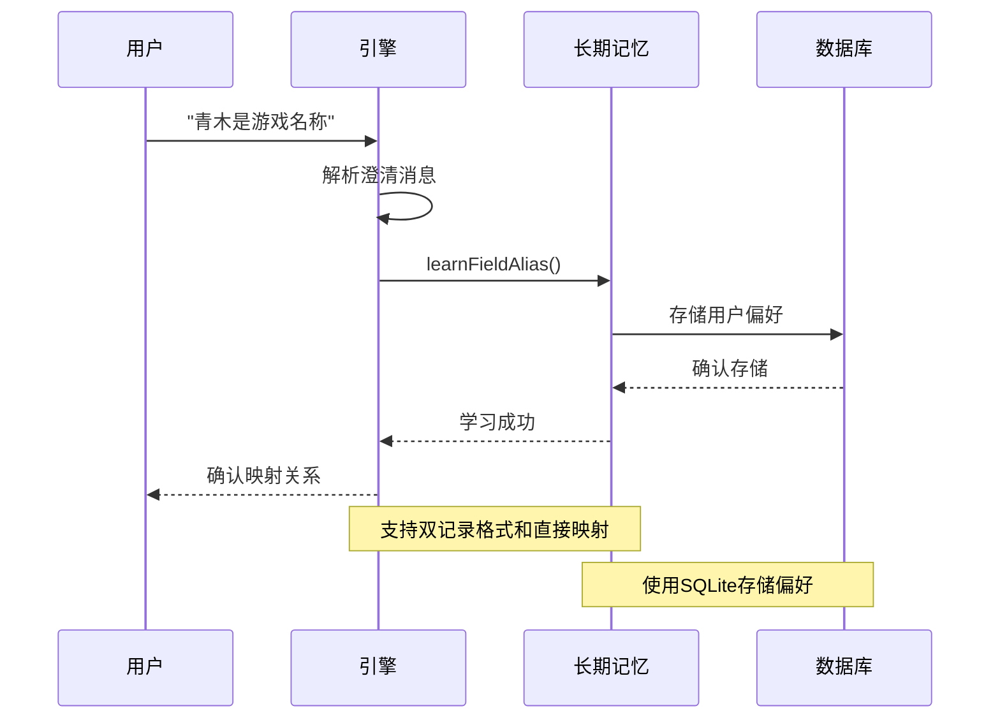
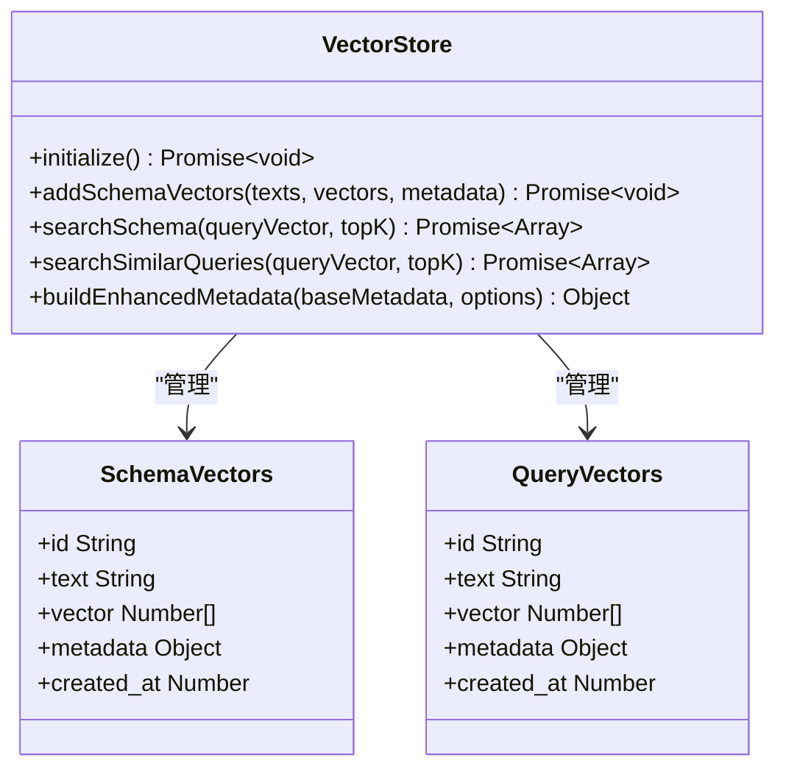
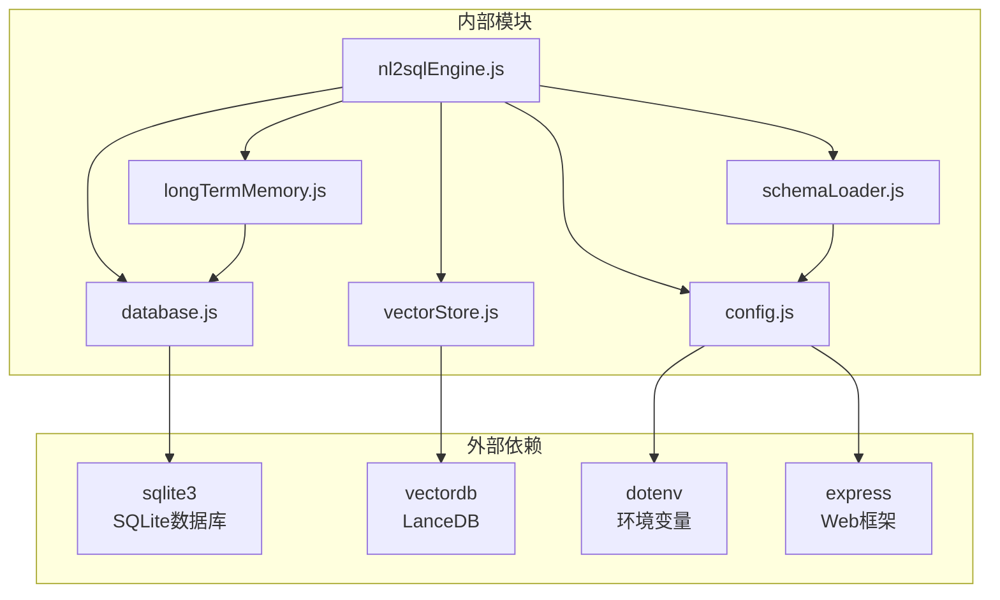

# 实体解析扩展

<cite>
**本文档引用的文件**
- [nl2sqlEngine.js](file://backend/src/core/nl2sqlEngine.js)
- [schemaLoader.js](file://backend/src/core/schemaLoader.js)
- [config.js](file://backend/src/core/config.js)
- [longTermMemory.js](file://backend/src/memory/longTermMemory.js)
- [vectorStore.js](file://backend/src/memory/vectorStore.js)
- [database.js](file://backend/src/core/database.js)
- [schema-metadata.json](file://backend/config/schema-metadata.json)
</cite>

## 目录
1. [简介](#简介)
2. [项目结构](#项目结构)
3. [核心组件](#核心组件)
4. [架构概览](#架构概览)
5. [详细组件分析](#详细组件分析)
6. [依赖关系分析](#依赖关系分析)
7. [性能考虑](#性能考虑)
8. [故障排除指南](#故障排除指南)
9. [结论](#结论)
10. [附录](#附录)

## 简介

本文档为NL2SQL项目中的实体解析模块提供详细的扩展指南。实体解析是自然语言到SQL转换过程中的关键环节，负责将用户输入中的模糊描述（如游戏名称、渠道名称等）准确映射到数据库中的具体标识符。

NL2SQL项目采用多层次的实体解析策略，结合了传统数据库查询、长期记忆学习、向量语义检索等多种技术手段。本文档将深入分析现有实现，提供扩展指导，包括支持更多实体类型、增强模糊匹配算法、优化实体消歧策略等。

## 项目结构

NL2SQL项目采用模块化架构设计，实体解析功能分布在多个核心模块中：



**图表来源**
- [nl2sqlEngine.js:1-800](file://backend/src/core/nl2sqlEngine.js#L1-L800)
- [schemaLoader.js:1-751](file://backend/src/core/schemaLoader.js#L1-L751)
- [config.js:1-372](file://backend/src/core/config.js#L1-L372)

**章节来源**
- [nl2sqlEngine.js:1-800](file://backend/src/core/nl2sqlEngine.js#L1-L800)
- [schemaLoader.js:1-751](file://backend/src/core/schemaLoader.js#L1-L751)
- [config.js:1-372](file://backend/src/core/config.js#L1-L372)

## 核心组件

### 实体解析引擎

实体解析引擎位于`nl2sqlEngine.js`文件中，提供了完整的实体识别和映射功能：



**图表来源**
- [nl2sqlEngine.js:42-300](file://backend/src/core/nl2sqlEngine.js#L42-L300)
- [longTermMemory.js:771-800](file://backend/src/memory/longTermMemory.js#L771-L800)
- [database.js:361-424](file://backend/src/core/database.js#L361-L424)
- [vectorStore.js:375-404](file://backend/src/memory/vectorStore.js#L375-L404)

### Schema元数据管理

Schema加载器负责管理数据库表结构信息，为实体解析提供结构化数据：



**图表来源**
- [schemaLoader.js:69-122](file://backend/src/core/schemaLoader.js#L69-L122)
- [schemaLoader.js:300-351](file://backend/src/core/schemaLoader.js#L300-L351)

**章节来源**
- [nl2sqlEngine.js:42-300](file://backend/src/core/nl2sqlEngine.js#L42-L300)
- [schemaLoader.js:69-122](file://backend/src/core/schemaLoader.js#L69-L122)

## 架构概览

实体解析系统采用分层架构设计，实现了从模糊查询到精确SQL的完整转换：



**图表来源**
- [nl2sqlEngine.js:497-780](file://backend/src/core/nl2sqlEngine.js#L497-L780)
- [longTermMemory.js:311-484](file://backend/src/memory/longTermMemory.js#L311-L484)
- [schemaLoader.js:430-519](file://backend/src/core/schemaLoader.js#L430-L519)

## 详细组件分析

### 实体解析核心算法

实体解析算法采用多阶段策略，确保高精度和高召回率：



**图表来源**
- [nl2sqlEngine.js:195-300](file://backend/src/core/nl2sqlEngine.js#L195-L300)
- [nl2sqlEngine.js:42-108](file://backend/src/core/nl2sqlEngine.js#L42-L108)

#### 实体解析算法实现

实体解析函数`resolveEntity`提供了核心的实体识别功能：

**章节来源**
- [nl2sqlEngine.js:42-108](file://backend/src/core/nl2sqlEngine.js#L42-L108)

### 长期记忆学习机制

长期记忆系统能够从用户交互中学习实体映射关系：



**图表来源**
- [nl2sqlEngine.js:122-186](file://backend/src/core/nl2sqlEngine.js#L122-L186)
- [longTermMemory.js:771-800](file://backend/src/memory/longTermMemory.js#L771-L800)

**章节来源**
- [nl2sqlEngine.js:122-186](file://backend/src/core/nl2sqlEngine.js#L122-L186)
- [longTermMemory.js:771-800](file://backend/src/memory/longTermMemory.js#L771-L800)

### 向量语义搜索

向量存储模块提供了语义级别的实体匹配能力：



**图表来源**
- [vectorStore.js:229-259](file://backend/src/memory/vectorStore.js#L229-L259)
- [vectorStore.js:334-365](file://backend/src/memory/vectorStore.js#L334-L365)

**章节来源**
- [vectorStore.js:229-259](file://backend/src/memory/vectorStore.js#L229-L259)
- [vectorStore.js:334-365](file://backend/src/memory/vectorStore.js#L334-L365)

## 依赖关系分析

实体解析模块的依赖关系体现了清晰的关注点分离：



**图表来源**
- [nl2sqlEngine.js:16-30](file://backend/src/core/nl2sqlEngine.js#L16-L30)
- [schemaLoader.js:15-26](file://backend/src/core/schemaLoader.js#L15-L26)
- [longTermMemory.js:17-20](file://backend/src/memory/longTermMemory.js#L17-L20)

### 扩展点分析

实体解析系统提供了多个扩展点，支持功能增强：

| 扩展点 | 类型 | 描述 | 实现位置 |
|--------|------|------|----------|
| 自定义实体识别器 | 接口扩展 | 支持新的实体类型识别 | `resolveEntity`函数 |
| 外部实体数据库集成 | 数据源扩展 | 集成外部实体映射数据库 | `database.js` |
| 实体关系图谱构建 | 图数据库扩展 | 支持实体间关系推理 | `vectorStore.js` |
| 模糊匹配算法 | 算法扩展 | 增强相似度计算 | `resolveEntity`函数 |
| 动态实体映射 | 配置扩展 | 支持运行时实体映射 | `config.js` |

**章节来源**
- [nl2sqlEngine.js:42-108](file://backend/src/core/nl2sqlEngine.js#L42-L108)
- [database.js:361-424](file://backend/src/core/database.js#L361-L424)
- [vectorStore.js:375-404](file://backend/src/memory/vectorStore.js#L375-L404)

## 性能考虑

实体解析系统的性能优化策略包括：

### 缓存策略
- **Schema缓存**: 通过`cacheTimestamp`实现Schema数据缓存
- **向量缓存**: 向量数据库中的Schema向量缓存
- **偏好缓存**: SQLite中的用户偏好缓存

### 查询优化
- **索引优化**: SQLite表的复合索引设计
- **批量处理**: 向量嵌入的批量处理
- **延迟加载**: 按需加载Schema和偏好数据

### 内存管理
- **连接池**: 数据库连接池配置
- **向量内存**: 向量数据的内存管理
- **垃圾回收**: 定期清理过期数据

**章节来源**
- [schemaLoader.js:57-722](file://backend/src/core/schemaLoader.js#L57-L722)
- [database.js:200-261](file://backend/src/core/database.js#L200-L261)
- [vectorStore.js:516-546](file://backend/src/memory/vectorStore.js#L516-L546)

## 故障排除指南

### 常见问题及解决方案

#### 实体解析失败
**症状**: 实体解析返回`{found: false}`
**原因分析**:
- 数据库连接不可用
- 实体名称不在映射表中
- LLM识别失败

**解决步骤**:
1. 检查数据库连接状态
2. 验证实体名称是否在映射表中
3. 查看LLM响应日志

#### 长期记忆学习失败
**症状**: 用户偏好无法保存
**原因分析**:
- SQLite数据库连接问题
- JSON序列化错误
- 权限不足

**解决步骤**:
1. 检查数据库文件权限
2. 验证JSON格式正确性
3. 查看数据库操作日志

#### 向量搜索异常
**症状**: 语义搜索返回空结果
**原因分析**:
- 向量数据库未初始化
- Embedding生成失败
- 向量维度不匹配

**解决步骤**:
1. 检查向量数据库状态
2. 验证Embedding模型配置
3. 确认向量维度一致性

**章节来源**
- [nl2sqlEngine.js:104-107](file://backend/src/core/nl2sqlEngine.js#L104-L107)
- [longTermMemory.js:480-483](file://backend/src/memory/longTermMemory.js#L480-L483)
- [vectorStore.js:556-558](file://backend/src/memory/vectorStore.js#L556-L558)

## 结论

NL2SQL项目的实体解析模块展现了现代自然语言处理系统的最佳实践。通过多层次的解析策略、智能的学习机制和高效的缓存系统，实现了高精度的实体识别和映射。

### 主要优势
- **多策略融合**: 结合传统匹配、机器学习和语义搜索
- **智能学习**: 能够从用户交互中持续改进
- **高性能**: 通过缓存和优化确保实时响应
- **可扩展性**: 清晰的架构设计支持功能扩展

### 扩展建议
1. **支持更多实体类型**: 增加角色、等级、VIP等级等识别
2. **增强模糊匹配**: 实现拼音首字母缩写、简写形式识别
3. **优化消歧策略**: 基于上下文的智能消歧算法
4. **外部数据库集成**: 支持企业级实体数据库

## 附录

### 扩展示例

#### 添加新的游戏实体解析规则
```javascript
// 在resolveEntity函数中添加新的实体类型
async function resolveEntity(entityName, entityType) {
    // ... 现有代码 ...
    
    if (entityType === 'game') {
        // 现有的游戏解析逻辑
    } else if (entityType === 'role') {
        // 新增的角色解析逻辑
        sql = `SELECT role_id as id, role_name as name FROM role_list WHERE role_name LIKE ? LIMIT 5`;
    } else if (entityType === 'level') {
        // 新增的等级解析逻辑
        sql = `SELECT level_id as id, level_name as name FROM level_list WHERE level_name LIKE ? LIMIT 5`;
    } else if (entityType === 'vip_level') {
        // 新增的VIP等级解析逻辑
        sql = `SELECT vip_id as id, vip_name as name FROM vip_list WHERE vip_name LIKE ? LIMIT 5`;
    }
    
    // ... 其他代码 ...
}
```

#### 支持动态实体映射
```javascript
// 在Schema配置中添加动态映射支持
const dynamicEntityMappings = {
    'role': {
        'table': 'role_list',
        'id_column': 'role_id',
        'name_column': 'role_name'
    },
    'level': {
        'table': 'level_list',
        'id_column': 'level_id',
        'name_column': 'level_name'
    }
};

// 在resolveEntity中使用动态映射
async function resolveDynamicEntity(entityName, entityType) {
    const mapping = dynamicEntityMappings[entityType];
    if (!mapping) {
        return { found: false };
    }
    
    const sql = `SELECT ${mapping.id_column} as id, ${mapping.name_column} as name 
                FROM ${mapping.table} WHERE ${mapping.name_column} LIKE ? LIMIT 5`;
    
    // ... 执行查询 ...
}
```

#### 实现实体解析缓存机制
```javascript
// 添加实体解析缓存
const entityCache = new Map();
const cacheTTL = 5 * 60 * 1000; // 5分钟缓存

async function getCachedEntity(entityName, entityType) {
    const cacheKey = `${entityType}:${entityName}`;
    const cached = entityCache.get(cacheKey);
    
    if (cached && Date.now() - cached.timestamp < cacheTTL) {
        return cached.data;
    }
    
    // 缓存未命中，执行解析并更新缓存
    const result = await resolveEntity(entityName, entityType);
    entityCache.set(cacheKey, {
        data: result,
        timestamp: Date.now()
    });
    
    return result;
}
```

### 测试方法

#### 实体解析准确性评估
```javascript
// 测试用例结构
const testCases = [
    {
        input: "青木游戏",
        expectedType: "game",
        expectedId: "30",
        confidence: 0.95
    },
    {
        input: "王者荣耀",
        expectedType: "game", 
        expectedId: "1",
        confidence: 0.95
    },
    {
        input: "老平台",
        expectedType: "datasource",
        expectedId: "new_tzpingtaiold",
        confidence: 0.9
    }
];

// 批量测试函数
async function runEntityResolutionTests() {
    let passed = 0;
    let total = testCases.length;
    
    for (const testCase of testCases) {
        const result = await resolveEntity(testCase.input, testCase.expectedType);
        
        if (result.found && 
            result.id === testCase.expectedId && 
            result.confidence >= testCase.confidence) {
            passed++;
        }
    }
    
    return {
        accuracy: passed / total,
        passed,
        total
    };
}
```

#### 性能基准测试
```javascript
// 性能测试函数
async function performanceBenchmark() {
    const testQueries = [
        "查询游戏数据",
        "分析用户行为", 
        "统计收入指标"
    ];
    
    const results = [];
    
    for (let i = 0; i < 100; i++) {
        const startTime = Date.now();
        
        for (const query of testQueries) {
            await resolveEntitiesInIntent(query, []);
        }
        
        const endTime = Date.now();
        results.push(endTime - startTime);
    }
    
    const avgTime = results.reduce((a, b) => a + b, 0) / results.length;
    const maxTime = Math.max(...results);
    const minTime = Math.min(...results);
    
    return {
        average: avgTime,
        max: maxTime,
        min: minTime,
        stdDev: Math.sqrt(results.reduce((acc, val) => acc + Math.pow(val - avgTime, 2), 0) / results.length)
    };
}
```

**章节来源**
- [nl2sqlEngine.js:42-108](file://backend/src/core/nl2sqlEngine.js#L42-L108)
- [schemaLoader.js:69-122](file://backend/src/core/schemaLoader.js#L69-L122)
- [longTermMemory.js:311-484](file://backend/src/memory/longTermMemory.js#L311-L484)