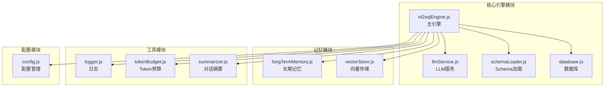
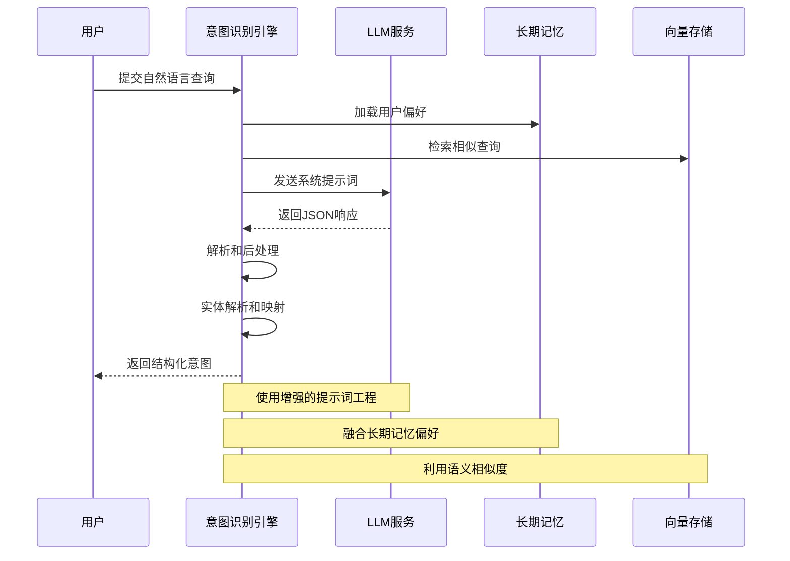
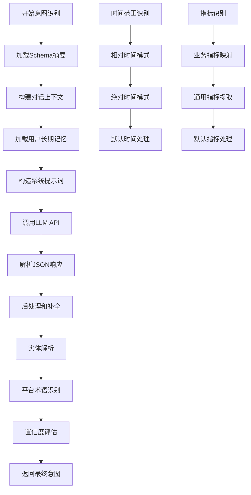
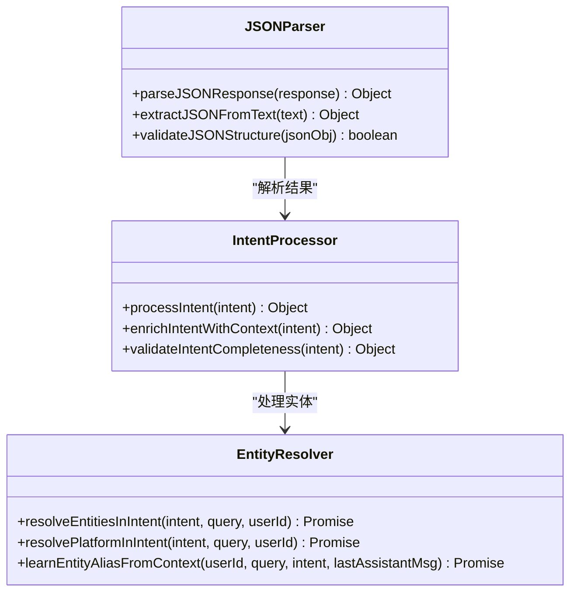
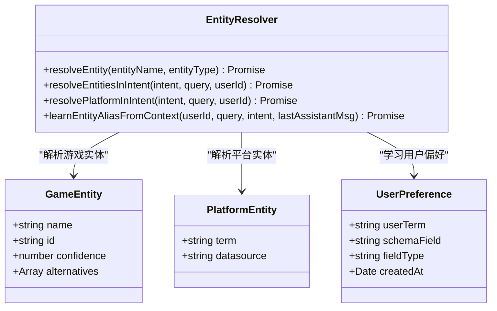
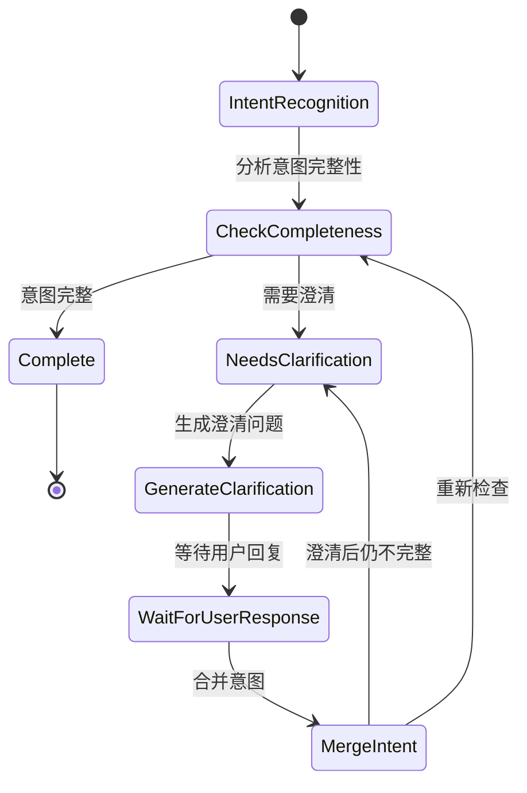
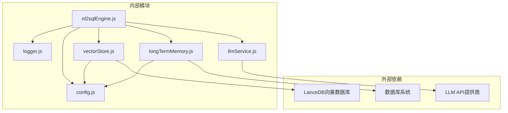
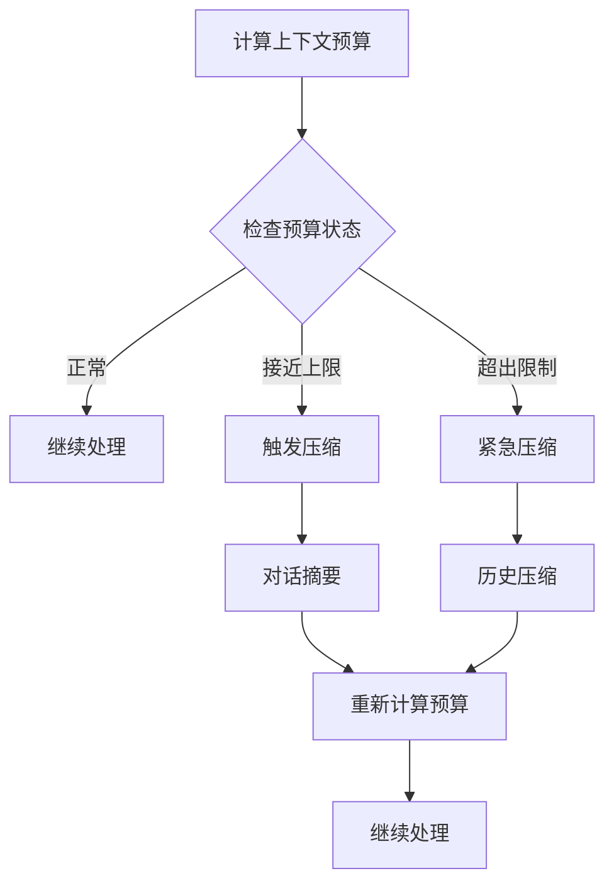
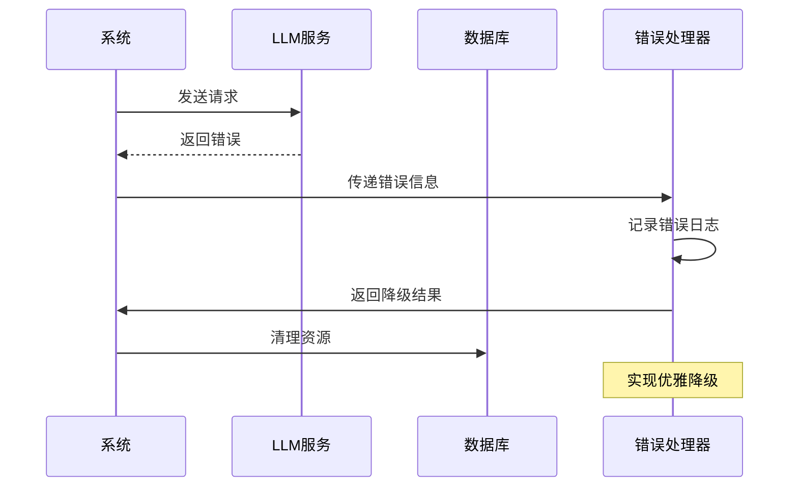

# 意图识别扩展

<cite>
**本文档引用的文件**
- [nl2sqlEngine.js](file://backend/src/core/nl2sqlEngine.js)
- [llmService.js](file://backend/src/core/llmService.js)
- [routes.js](file://backend/src/core/routes.js)
- [config.js](file://backend/src/core/config.js)
- [longTermMemory.js](file://backend/src/memory/longTermMemory.js)
- [vectorStore.js](file://backend/src/memory/vectorStore.js)
- [logger.js](file://backend/src/utils/logger.js)
- [app.js](file://backend/src/app.js)
</cite>

## 目录
1. [简介](#简介)
2. [项目结构](#项目结构)
3. [核心组件](#核心组件)
4. [架构概览](#架构概览)
5. [详细组件分析](#详细组件分析)
6. [依赖关系分析](#依赖关系分析)
7. [性能考虑](#性能考虑)
8. [故障排除指南](#故障排除指南)
9. [结论](#结论)
10. [附录](#附录)

## 简介

NL2SQL系统是一个基于大语言模型的自然语言到SQL转换引擎，专注于游戏数据分析场景。该系统通过意图识别模块将用户的自然语言查询转换为结构化的SQL查询，支持复杂的业务场景和多轮对话交互。

本文档重点关注意图识别模块的扩展设计，提供深入的技术分析和实用的扩展示例，涵盖提示词工程优化、JSON响应解析、时间范围识别、多语言支持、规则引擎集成等多个方面。

## 项目结构

NL2SQL项目采用模块化架构设计，核心意图识别功能位于`backend/src/core/nl2sqlEngine.js`文件中，该文件实现了完整的NL2SQL处理流程：



**图表来源**
- [nl2sqlEngine.js:1-50](file://backend/src/core/nl2sqlEngine.js#L1-L50)
- [llmService.js:1-50](file://backend/src/core/llmService.js#L1-L50)
- [config.js:1-50](file://backend/src/core/config.js#L1-L50)

**章节来源**
- [app.js:1-100](file://backend/src/app.js#L1-L100)
- [nl2sqlEngine.js:1-100](file://backend/src/core/nl2sqlEngine.js#L1-L100)

## 核心组件

### 意图识别引擎

意图识别引擎是NL2SQL系统的核心组件，负责将用户的自然语言查询转换为结构化的查询意图。该引擎具备以下关键能力：

1. **上下文理解**：结合对话历史和用户偏好理解用户查询
2. **实体解析**：识别游戏名称、渠道名称等业务实体并解析为ID
3. **时间范围识别**：支持相对时间和绝对时间的识别
4. **指标映射**：将自然语言指标映射到数据库指标
5. **置信度评估**：为识别结果提供置信度评分

### LLM服务集成

LLM服务模块提供了与大语言模型的统一接口，支持：
- 多种LLM提供商的兼容
- 流式响应处理
- 自动重试机制
- 超时控制

### 长期记忆系统

长期记忆系统通过用户偏好学习，提供个性化的查询体验：
- 用户查询模式学习
- 字段别名映射
- 指标和维度偏好
- 实体映射学习

**章节来源**
- [nl2sqlEngine.js:488-780](file://backend/src/core/nl2sqlEngine.js#L488-L780)
- [llmService.js:287-311](file://backend/src/core/llmService.js#L287-L311)
- [longTermMemory.js:311-484](file://backend/src/memory/longTermMemory.js#L311-L484)

## 架构概览

NL2SQL系统的意图识别架构采用分层设计，确保功能模块的职责清晰和可扩展性：



**图表来源**
- [nl2sqlEngine.js:497-780](file://backend/src/core/nl2sqlEngine.js#L497-L780)
- [llmService.js:287-311](file://backend/src/core/llmService.js#L287-L311)
- [longTermMemory.js:56-188](file://backend/src/memory/longTermMemory.js#L56-L188)

## 详细组件分析

### 意图识别核心算法

意图识别算法采用多阶段处理流程，确保识别的准确性和完整性：



**图表来源**
- [nl2sqlEngine.js:620-780](file://backend/src/core/nl2sqlEngine.js#L620-L780)
- [nl2sqlEngine.js:740-755](file://backend/src/core/nl2sqlEngine.js#L740-L755)

#### 提示词工程优化

系统采用精心设计的提示词模板，包含以下关键要素：

1. **角色定义**：明确LLM的专家角色
2. **上下文信息**：包含Schema摘要、对话历史、用户偏好
3. **业务规则**：定义严格的业务约束和映射规则
4. **输出格式**：标准化的JSON结构定义

**章节来源**
- [nl2sqlEngine.js:620-692](file://backend/src/core/nl2sqlEngine.js#L620-L692)
- [nl2sqlEngine.js:852-891](file://backend/src/core/nl2sqlEngine.js#L852-L891)

### JSON响应解析机制

系统实现了健壮的JSON响应解析机制，支持多种响应格式：



**图表来源**
- [nl2sqlEngine.js:193-207](file://backend/src/core/nl2sqlEngine.js#L193-L207)
- [nl2sqlEngine.js:497-780](file://backend/src/core/nl2sqlEngine.js#L497-L780)

#### 扩展解析器开发

为了支持更复杂的查询模式，系统提供了扩展解析器的接口：

1. **自定义解析器接口**：定义统一的解析器规范
2. **规则引擎集成**：支持基于规则的条件匹配
3. **机器学习模型接入**：集成深度学习模型进行智能解析

**章节来源**
- [nl2sqlEngine.js:193-207](file://backend/src/core/nl2sqlEngine.js#L193-L207)
- [longTermMemory.js:493-605](file://backend/src/memory/longTermMemory.js#L493-L605)

### 时间范围识别规则

系统实现了多层次的时间范围识别机制：

```mermaid
flowchart TD
A[时间范围识别] --> B{LLM识别}
B --> |成功| C[使用LLM结果]
B --> |失败| D{模式匹配}
D --> |相对时间| E[相对时间模式]
D --> |绝对时间| F[绝对时间模式]
D --> |默认| G[默认时间处理]
E --> H[/最近7天|最近30天|上个月/上周/昨天/今天/本周/本月/本年/本季度/本年/今年/去年/上一季度/上一年/上一月/上周/上一周/上一星期/上一星期/上一星期/上一星期/上一星期/上一星期/上一星期/上一星期/上一星期/上一星期/上一星期/上一星期/上一星期/上一星期/上一星期/上一星期/上一星期/上一星期/上一星期/上一星期/上一星期/上一星期/上一星期/上一星期/上一星期/上一星期/上一星期/上一星期/上一星期/上一星期/上一星期/上一星期/上一星期/上一星期/上一星期/上一星期/上一星期/上一星期/上一星期/上一星期/上一星期/上一星期/上一星期/上一星期/上一星期/上一星期/上一星期/上一星期/上一星期/上一星期/上一星期/上一星期/上一星期/上一星期/上一星期/上一星期/上一星期/上一星期/上一星期/上一星期/上一星期/上一星期/上一星期/上一星期/上一星期/上一星期/上一星期/上一星期/上一星期/上一星期/上一星期/上一星期/上一星期/上一星期/上一星期/上一星期/上一星期/上一星期/上一星期/上一星期/上一星期/上一星期/上一星期/上一星期/上一星期/上一星期/上一星期/上一星期/上一星期/上一星期/上一星期/上一星期/上一星期/上一星期/上一星期/上一星期/上一星期/上一星期/上一星期/上一星期/上一星期/上一星期/上一星期/上一星期/上一星期/上一星期/上一星期/上一星期/上一星期/上一星期/上一星期/上一星期/上一星期/上一星期/上一星期/上一星期/上一星期/上一星期/上一星期/上一星期/上一星期/上一星期/上一星期/上一星期/上一星期/上一......
F --> I[精确日期解析]
G --> J[基于上下文推断]
H --> K[相对时间计算]
I --> L[绝对日期验证]
J --> M[默认时间策略]
```

**图表来源**
- [nl2sqlEngine.js:740-755](file://backend/src/core/nl2sqlEngine.js#L740-L755)

#### 多语言支持扩展

系统支持多语言查询处理，通过以下机制实现：

1. **语言检测**：自动识别查询语言
2. **翻译适配**：将非英语查询转换为系统可理解的格式
3. **本地化规则**：为不同语言实现特定的时间表达式规则
4. **文化适应**：考虑不同地区的日期格式和表达习惯

**章节来源**
- [nl2sqlEngine.js:740-755](file://backend/src/core/nl2sqlEngine.js#L740-L755)
- [longTermMemory.js:56-188](file://backend/src/memory/longTermMemory.js#L56-L188)

### 实体解析和映射

系统实现了智能的实体解析机制，支持多种实体类型的识别和映射：



**图表来源**
- [nl2sqlEngine.js:42-300](file://backend/src/core/nl2sqlEngine.js#L42-L300)
- [longTermMemory.js:771-805](file://backend/src/memory/longTermMemory.js#L771-L805)

#### 新意图分类规则添加

系统支持动态添加新的意图分类规则：

1. **规则定义**：通过配置文件定义新的意图分类
2. **模式匹配**：实现基于正则表达式的模式匹配
3. **上下文感知**：结合对话历史理解用户意图
4. **置信度评估**：为新规则提供置信度评分机制

**章节来源**
- [nl2sqlEngine.js:42-300](file://backend/src/core/nl2sqlEngine.js#L42-L300)
- [longTermMemory.js:311-484](file://backend/src/memory/longTermMemory.js#L311-L484)

### 澄清机制和上下文管理

系统实现了智能的澄清机制，能够识别用户查询中的不确定性并主动询问：



**图表来源**
- [nl2sqlEngine.js:922-1012](file://backend/src/core/nl2sqlEngine.js#L922-L1012)
- [nl2sqlEngine.js:1022-1076](file://backend/src/core/nl2sqlEngine.js#L1022-L1076)

**章节来源**
- [nl2sqlEngine.js:922-1076](file://backend/src/core/nl2sqlEngine.js#L922-L1076)
- [nl2sqlEngine.js:843-913](file://backend/src/core/nl2sqlEngine.js#L843-L913)

## 依赖关系分析

NL2SQL系统的意图识别模块具有清晰的依赖关系：



**图表来源**
- [nl2sqlEngine.js:16-30](file://backend/src/core/nl2sqlEngine.js#L16-L30)
- [llmService.js:15-25](file://backend/src/core/llmService.js#L15-L25)
- [config.js:16-372](file://backend/src/core/config.js#L16-L372)

### 扩展点分析

系统提供了多个扩展点，支持灵活的功能扩展：

1. **自定义解析器**：通过实现统一接口添加新的解析规则
2. **规则引擎集成**：支持基于规则的条件匹配和决策
3. **机器学习模型**：集成深度学习模型进行智能解析
4. **多语言支持**：通过语言检测和翻译适配支持多语言查询

**章节来源**
- [nl2sqlEngine.js:193-207](file://backend/src/core/nl2sqlEngine.js#L193-L207)
- [longTermMemory.js:493-605](file://backend/src/memory/longTermMemory.js#L493-L605)

## 性能考虑

### Token预算管理

系统实现了智能的Token预算管理机制：



**图表来源**
- [nl2sqlEngine.js:1589-1616](file://backend/src/core/nl2sqlEngine.js#L1589-L1616)

### 缓存策略

系统采用了多层次的缓存策略：

1. **Schema缓存**：缓存数据库Schema信息
2. **查询历史缓存**：缓存相似查询结果
3. **用户偏好缓存**：缓存长期记忆数据
4. **LLM响应缓存**：缓存常用的LLM响应

**章节来源**
- [config.js:235-245](file://backend/src/core/config.js#L235-L245)
- [vectorStore.js:516-546](file://backend/src/memory/vectorStore.js#L516-L546)

## 故障排除指南

### 常见问题诊断

1. **LLM响应解析失败**
   - 检查JSON格式是否正确
   - 验证响应是否被截断
   - 确认API密钥和端点配置

2. **意图识别准确性问题**
   - 检查提示词模板是否合适
   - 验证Schema信息是否完整
   - 确认用户偏好数据是否正确

3. **性能问题**
   - 监控Token使用情况
   - 检查缓存命中率
   - 优化查询模式

**章节来源**
- [llmService.js:113-131](file://backend/src/core/llmService.js#L113-L131)
- [logger.js:283-293](file://backend/src/utils/logger.js#L283-L293)

### 错误处理机制

系统实现了完善的错误处理机制：



**图表来源**
- [llmService.js:135-151](file://backend/src/core/llmService.js#L135-L151)
- [logger.js:283-293](file://backend/src/utils/logger.js#L283-L293)

## 结论

NL2SQL系统的意图识别模块展现了现代AI驱动的自然语言处理系统的最佳实践。通过精心设计的架构、健壮的错误处理机制和灵活的扩展接口，该模块能够有效处理复杂的业务查询场景。

主要优势包括：
- **模块化设计**：清晰的职责分离和依赖管理
- **可扩展性**：支持多种扩展点和自定义组件
- **智能化**：结合上下文和长期记忆提供个性化体验
- **可靠性**：完善的错误处理和降级机制

未来扩展方向：
- 集成更多机器学习模型
- 增强多语言支持
- 优化性能和资源使用
- 扩展业务领域的专用规则

## 附录

### 扩展示例

#### 添加新的指标识别规则

1. **定义规则**：在配置文件中添加新的指标映射规则
2. **实现解析器**：编写专门的解析器处理新指标
3. **测试验证**：创建测试用例验证解析准确性
4. **性能监控**：监控新规则的性能影响

#### 支持模糊查询处理

1. **相似度计算**：实现语义相似度计算算法
2. **模糊匹配**：支持拼写错误和同义词匹配
3. **置信度评估**：为模糊匹配结果提供置信度评分
4. **用户反馈**：收集用户对模糊匹配结果的反馈

#### 实现意图置信度评估机制

1. **特征提取**：提取影响置信度的各种特征
2. **权重计算**：为不同特征分配权重
3. **综合评分**：计算最终的置信度分数
4. **阈值设定**：设定置信度阈值决定是否需要澄清

### 测试方法

#### 单元测试

```javascript
// 测试意图识别准确性
describe('Intent Recognition Tests', () => {
  test('should recognize time range correctly', () => {
    const intent = analyzeIntent('最近7天的流水');
    expect(intent.time_range.value).toBe('最近7天');
  });
  
  test('should handle entity resolution', () => {
    const intent = analyzeIntent('王者荣耀的收入');
    expect(intent.filters).toContainEqual(
      expect.objectContaining({ field: 'game_id' })
    );
  });
});
```

#### 集成测试

```javascript
// 测试完整NL2SQL流程
describe('Full NL2SQL Pipeline', () => {
  test('should process complex queries', async () => {
    const result = await processQuery(
      '青木上个月的流水和活跃用户',
      'test_session'
    );
    expect(result.sql).toBeDefined();
    expect(result.explanation).toBeDefined();
  });
});
```

### 性能评估标准

1. **响应时间**：平均响应时间不超过2秒
2. **准确率**：意图识别准确率不低于90%
3. **召回率**：关键信息识别召回率不低于85%
4. **稳定性**：99.9%的请求成功率
5. **资源使用**：CPU使用率不超过80%，内存使用率不超过70%