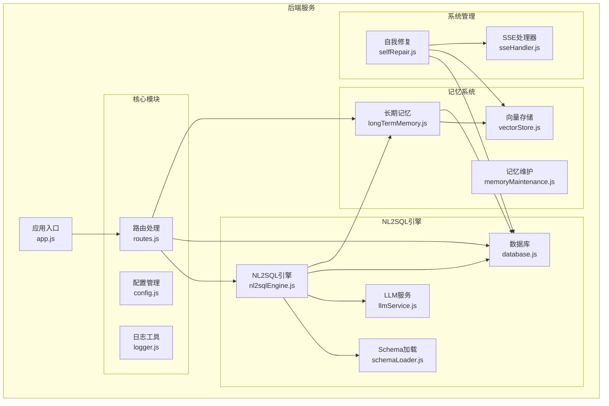
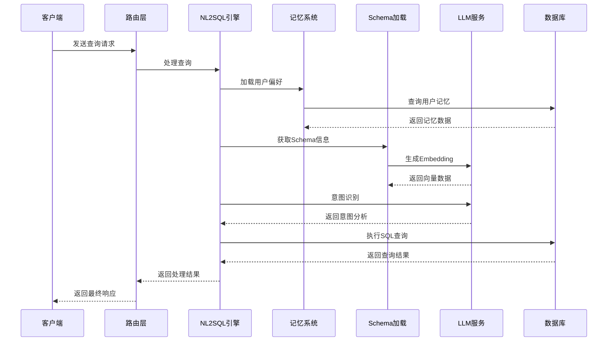
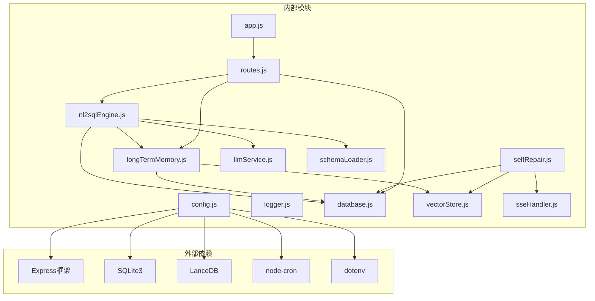

# 功能模块扩展

<cite>
**本文档引用的文件**
- [app.js](file://backend/src/app.js)
- [nl2sqlEngine.js](file://backend/src/core/nl2sqlEngine.js)
- [selfRepair.js](file://backend/src/core/selfRepair.js)
- [longTermMemory.js](file://backend/src/memory/longTermMemory.js)
- [vectorStore.js](file://backend/src/memory/vectorStore.js)
- [config.js](file://backend/src/core/config.js)
- [database.js](file://backend/src/core/database.js)
- [routes.js](file://backend/src/core/routes.js)
- [logger.js](file://backend/src/utils/logger.js)
- [llmService.js](file://backend/src/core/llmService.js)
- [schemaLoader.js](file://backend/src/core/schemaLoader.js)
- [sseHandler.js](file://backend/src/core/sseHandler.js)
- [package.json](file://backend/package.json)
</cite>

## 目录
1. [简介](#简介)
2. [项目结构](#项目结构)
3. [核心组件](#核心组件)
4. [架构概览](#架构概览)
5. [详细组件分析](#详细组件分析)
6. [依赖分析](#依赖分析)
7. [性能考虑](#性能考虑)
8. [故障排除指南](#故障排除指南)
9. [结论](#结论)
10. [附录](#附录)

## 简介

NL2SQL项目是一个基于自然语言到SQL转换的智能查询系统。该项目实现了完整的NL2SQL解决方案，包括意图识别、实体解析、SQL生成、验证和结果格式化等功能。本文档旨在为功能模块扩展提供详细的指导，涵盖NL2SQL引擎、用户记忆系统和自我修复机制的扩展方法。

## 项目结构

NL2SQL项目采用模块化架构设计，主要分为以下几个核心模块：



**图表来源**
- [app.js:1-238](file://backend/src/app.js#L1-L238)
- [config.js:1-332](file://backend/src/core/config.js#L1-L332)

**章节来源**
- [app.js:1-238](file://backend/src/app.js#L1-L238)
- [package.json:1-28](file://backend/package.json#L1-L28)

## 核心组件

### NL2SQL引擎模块

NL2SQL引擎是系统的核心处理模块，负责将自然语言查询转换为SQL语句。该模块实现了完整的意图识别、实体解析和SQL生成流程。

**主要功能特性：**
- 意图识别和上下文理解
- 实体解析和字段映射
- SQL生成和验证
- 结果格式化和澄清机制

**章节来源**
- [nl2sqlEngine.js:1-800](file://backend/src/core/nl2sqlEngine.js#L1-L800)

### 用户记忆系统

用户记忆系统负责存储和管理用户的查询偏好、习惯和学习到的映射关系。该系统采用分层设计，支持长期记忆和短期记忆的协同工作。

**核心组件：**
- 长期记忆管理（Layer 2）
- 向量存储和语义检索
- 记忆维护和清理
- 字段别名学习

**章节来源**
- [longTermMemory.js:1-800](file://backend/src/memory/longTermMemory.js#L1-L800)
- [vectorStore.js:1-442](file://backend/src/memory/vectorStore.js#L1-L442)

### 自我修复机制

自我修复机制负责系统的健康监控、维护和故障恢复。该模块实现了定时任务调度、健康检查和自动维护功能。

**主要功能：**
- 每日自检和健康报告
- 会话清理和资源回收
- 记忆维护和压缩
- 统计信息收集

**章节来源**
- [selfRepair.js:1-489](file://backend/src/core/selfRepair.js#L1-L489)

## 架构概览

NL2SQL系统采用分层架构设计，各模块之间通过清晰的接口进行交互：



**图表来源**
- [routes.js:1-800](file://backend/src/core/routes.js#L1-L800)
- [nl2sqlEngine.js:1-800](file://backend/src/core/nl2sqlEngine.js#L1-L800)
- [longTermMemory.js:1-800](file://backend/src/memory/longTermMemory.js#L1-L800)

## 详细组件分析

### NL2SQL引擎扩展指南

#### 1. 新增查询解析算法

要扩展现有的查询解析算法，可以按照以下步骤进行：

**步骤1：定义新的解析器接口**
```javascript
// 在nl2sqlEngine.js中添加新的解析器
class CustomQueryParser {
    constructor() {
        this.priority = 1;
    }
    
    canParse(query, context) {
        // 实现解析器选择逻辑
        return false;
    }
    
    parse(query, context) {
        // 实现自定义解析逻辑
        return {
            intent: {},
            confidence: 0.9
        };
    }
}
```

**步骤2：集成到主引擎**
```javascript
// 在analyzeIntent函数中添加新解析器
async function analyzeIntent(userQuery, history = [], userId = null) {
    const parsers = [
        new CustomQueryParser(),
        new StandardQueryParser(),
        new FallbackParser()
    ];
    
    // 按优先级排序
    parsers.sort((a, b) => b.priority - a.priority);
    
    // 尝试每个解析器
    for (const parser of parsers) {
        if (parser.canParse(userQuery, context)) {
            return parser.parse(userQuery, context);
        }
    }
}
```

**步骤3：配置和测试**
- 在配置文件中启用新解析器
- 编写单元测试验证解析准确性
- 性能基准测试对比

#### 2. 实体解析扩展

**新增实体类型支持：**
```javascript
// 扩展resolveEntitiesInIntent函数
async function resolveEntitiesInIntent(intent, userQuery, userId) {
    // 现有的实体解析逻辑...
    
    // 新增自定义实体类型
    await resolveCustomEntityType(intent, userQuery, userId);
}

async function resolveCustomEntityType(intent, userQuery, userId) {
    const customEntities = await database.query(
        'SELECT * FROM custom_entities WHERE user_id = ?',
        [userId]
    );
    
    for (const entity of customEntities) {
        if (userQuery.includes(entity.name)) {
            intent.filters.push({
                field: entity.field,
                op: '=',
                value: entity.value,
                original_name: entity.name,
                custom_type: entity.type
            });
            break;
        }
    }
}
```

**章节来源**
- [nl2sqlEngine.js:1-800](file://backend/src/core/nl2sqlEngine.js#L1-L800)

### 用户记忆系统扩展指南

#### 1. 新的记忆学习策略

**新增偏好类型：**
```javascript
// 在longTermMemory.js中添加新偏好类型
const NEW_PREFERENCE_TYPES = {
    CUSTOM_PATTERN: 'custom_pattern',
    BEHAVIORAL_TREND: 'behavioral_trend',
    CONTEXTUAL_FILTER: 'contextual_filter'
};

/**
 * 学习行为趋势偏好
 */
async function learnBehavioralTrend(userId, trendData) {
    try {
        const trendContent = {
            pattern_type: 'behavioral_trend',
            time_window: trendData.timeWindow,
            frequency: trendData.frequency,
            threshold: trendData.threshold,
            last_detected: new Date().toISOString()
        };
        
        const result = await database.addUserPreference(
            userId,
            NEW_PREFERENCE_TYPES.BEHAVIORAL_TREND,
            trendContent
        );
        
        return result;
    } catch (error) {
        logger.error('学习行为趋势失败:', error);
        return null;
    }
}
```

**2. 增强的记忆维护策略**

```javascript
// 扩展memoryMaintenance.js
/**
 * 智能记忆压缩
 */
async function intelligentMemoryCompression(userId) {
    const userStats = await getUserMemoryStats(userId);
    
    // 根据用户活跃度调整保留策略
    let retentionDays = 30;
    if (userStats.avg_usage > 10) {
        retentionDays = 365; // 高频用户保留更久
    } else if (userStats.avg_usage > 5) {
        retentionDays = 180; // 中频用户中等保留
    }
    
    // 执行压缩
    return await compressUserMemory(userId, retentionDays);
}
```

**章节来源**
- [longTermMemory.js:1-800](file://backend/src/memory/longTermMemory.js#L1-L800)
- [memoryMaintenance.js:1-415](file://backend/src/memory/memoryMaintenance.js#L1-L415)

### 自我修复机制扩展指南

#### 1. 新的健康检查指标

**新增系统监控指标：**
```javascript
// 在selfRepair.js中添加新检查
async function performAdvancedHealthCheck() {
    const report = {
        checks: {},
        issues: [],
        recommendations: []
    };
    
    // 现有的检查...
    
    // 新增内存使用检查
    const memoryUsage = process.memoryUsage();
    const memoryThreshold = 0.8; // 80%阈值
    
    if (memoryUsage.heapUsed / memoryUsage.heapTotal > memoryThreshold) {
        report.checks.memory_usage = {
            status: 'warning',
            message: '内存使用率过高',
            usage: (memoryUsage.heapUsed / memoryUsage.heapTotal * 100).toFixed(1) + '%'
        };
        report.issues.push('内存使用率超过阈值');
        report.recommendations.push('建议重启服务或优化内存使用');
    }
    
    // 新增磁盘空间检查
    const diskStats = await getDiskSpaceStats();
    if (diskStats.freePercentage < 10) {
        report.checks.disk_space = {
            status: 'error',
            message: '磁盘空间不足',
            free: diskStats.freePercentage.toFixed(1) + '%'
        };
        report.issues.push('磁盘空间不足10%');
        report.recommendations.push('建议清理磁盘空间');
    }
    
    return report;
}

async function getDiskSpaceStats() {
    const fs = require('fs');
    const stat = fs.statvfsSync('./data');
    const total = stat.f_frsize * stat.f_blocks;
    const free = stat.f_frsize * stat.f_bavail;
    const used = total - free;
    
    return {
        total: formatBytes(total),
        used: formatBytes(used),
        free: formatBytes(free),
        freePercentage: (free / total) * 100
    };
}
```

**2. 自适应维护策略**

```javascript
// 扩展performMemoryMaintenance函数
async function adaptiveMemoryMaintenance() {
    const systemStats = await getSystemStats();
    const memoryPressure = systemStats.memory.heapUsed / systemStats.memory.heapTotal;
    
    let maintenanceIntensity = 'normal';
    if (memoryPressure > 0.8) {
        maintenanceIntensity = 'aggressive';
    } else if (memoryPressure < 0.3) {
        maintenanceIntensity = 'conservative';
    }
    
    // 根据压力级别调整维护策略
    switch (maintenanceIntensity) {
        case 'aggressive':
            return await aggressiveMemoryMaintenance();
        case 'conservative':
            return await conservativeMemoryMaintenance();
        default:
            return await normalMemoryMaintenance();
    }
}

async function aggressiveMemoryMaintenance() {
    logger.info('执行激进内存维护');
    // 更激进的清理策略
    return await compressUserMemory(null, 7); // 7天阈值
}

async function conservativeMemoryMaintenance() {
    logger.info('执行保守内存维护');
    // 更温和的清理策略
    return await compressUserMemory(null, 90); // 90天阈值
}
```

**章节来源**
- [selfRepair.js:1-489](file://backend/src/core/selfRepair.js#L1-L489)

## 依赖分析

NL2SQL系统的模块间依赖关系如下：



**图表来源**
- [package.json:1-28](file://backend/package.json#L1-L28)
- [app.js:1-238](file://backend/src/app.js#L1-L238)

**章节来源**
- [package.json:1-28](file://backend/package.json#L1-L28)

## 性能考虑

### 1. 查询性能优化

**缓存策略：**
- Schema元数据缓存（默认1小时）
- 用户偏好缓存（按使用频率分级）
- LLM响应缓存（短期）

**数据库优化：**
- 索引优化（sessions、messages、user_preferences表）
- 连接池配置（最小2，最大10）
- 查询超时控制（默认30秒）

### 2. 内存管理

**垃圾回收优化：**
- 定期内存使用检查
- 大对象及时释放
- 事件监听器清理

**内存泄漏防护：**
- SSE连接自动清理
- 定时任务资源回收
- 异步操作超时控制

### 3. 并发处理

**请求并发控制：**
- 单会话并发查询限制
- 连接数监控和限制
- 资源使用上限

**负载均衡：**
- 多实例部署支持
- 连接池共享
- 状态一致性保证

## 故障排除指南

### 1. 常见问题诊断

**NL2SQL引擎问题：**
- 意图识别失败：检查LLM API配置和网络连接
- 实体解析错误：验证Schema配置和数据库连接
- SQL生成异常：检查安全配置和权限设置

**记忆系统问题：**
- 记忆学习失败：检查用户ID和偏好类型
- 向量检索异常：验证LanceDB初始化状态
- 数据库连接错误：检查SQLite文件权限

**系统监控问题：**
- 自修复任务失败：检查Cron表达式和系统时间
- SSE连接异常：验证会话ID和用户认证
- 日志输出问题：检查日志文件权限和磁盘空间

### 2. 性能调优

**监控指标：**
- 查询响应时间分布
- 内存使用峰值
- 数据库连接池利用率
- LLM API调用成功率

**优化建议：**
- 调整缓存过期时间
- 优化数据库索引
- 增加硬件资源
- 调整并发限制

**章节来源**
- [logger.js:1-318](file://backend/src/utils/logger.js#L1-L318)
- [config.js:1-332](file://backend/src/core/config.js#L1-L332)

## 结论

NL2SQL项目提供了完整的功能模块扩展框架，支持在NL2SQL引擎、用户记忆系统和自我修复机制三个核心领域进行功能增强。通过遵循本文档提供的扩展指南，开发者可以：

1. **模块化设计**：保持现有架构的完整性，通过清晰的接口进行扩展
2. **渐进式开发**：从小功能开始，逐步集成到现有系统
3. **性能保障**：通过缓存、优化和监控确保系统稳定性
4. **质量保证**：完善的测试和故障排除机制

建议在进行功能扩展时，重点关注模块间的依赖关系、数据流向和错误处理机制，确保新功能与现有系统的无缝集成。

## 附录

### 1. 开发最佳实践

**代码组织原则：**
- 遵循单一职责原则
- 保持模块间松耦合
- 使用清晰的命名约定
- 编写完整的注释文档

**测试策略：**
- 单元测试覆盖率要求
- 集成测试场景设计
- 性能基准测试
- 回归测试自动化

**部署考虑：**
- 环境变量配置管理
- 日志级别和输出控制
- 监控指标收集
- 故障恢复机制

### 2. 扩展开发流程

**需求分析阶段：**
1. 功能需求梳理
2. 技术可行性评估
3. 影响范围分析
4. 风险评估和应对

**设计实现阶段：**
1. 接口设计和定义
2. 数据模型设计
3. 算法和流程设计
4. 错误处理机制

**测试验证阶段：**
1. 单元测试编写和执行
2. 集成测试和系统测试
3. 性能测试和压力测试
4. 用户验收测试

**部署上线阶段：**
1. 配置文件更新
2. 数据迁移脚本
3. 监控和告警设置
4. 回滚预案准备