# 向量存储系统扩展

<cite>
**本文档引用的文件**
- [vectorStore.js](file://backend/src/memory/vectorStore.js)
- [llmService.js](file://backend/src/core/llmService.js)
- [config.js](file://backend/src/core/config.js)
- [schemaLoader.js](file://backend/src/core/schemaLoader.js)
- [app.js](file://backend/src/app.js)
- [routes.js](file://backend/src/core/routes.js)
- [database.js](file://backend/src/core/database.js)
- [logger.js](file://backend/src/utils/logger.js)
- [package.json](file://backend/package.json)
</cite>

## 目录
1. [简介](#简介)
2. [项目结构](#项目结构)
3. [核心组件](#核心组件)
4. [架构概览](#架构概览)
5. [详细组件分析](#详细组件分析)
6. [依赖关系分析](#依赖关系分析)
7. [性能考虑](#性能考虑)
8. [故障排除指南](#故障排除指南)
9. [结论](#结论)

## 简介

本文档为向量存储系统扩展提供全面的技术指导，基于现有的NL2SQL项目中的向量存储模块进行深度分析和扩展设计。该系统基于LanceDB实现向量存储和语义检索，支持：

- **Schema信息向量化存储**：存储数据库表和字段的向量表示
- **查询历史向量化**：存储用户自然语言查询的向量表示
- **语义相似度搜索**：基于向量相似度的智能检索
- **多模态向量支持**：扩展支持不同类型的数据向量化
- **分布式向量存储**：支持水平扩展的向量数据库架构

## 项目结构

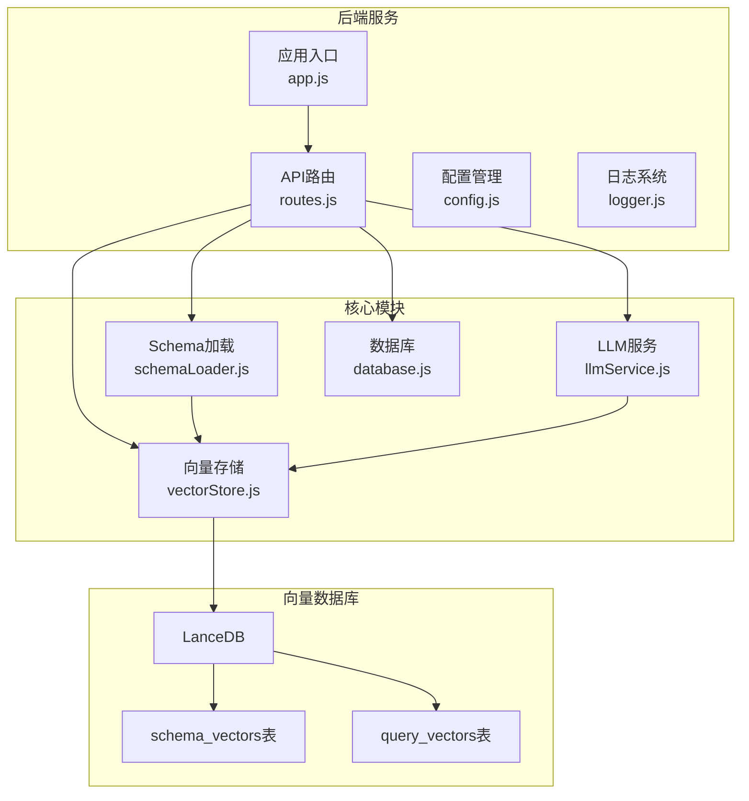

**图表来源**
- [app.js:97-166](file://backend/src/app.js#L97-L166)
- [routes.js:1-800](file://backend/src/core/routes.js#L1-L800)
- [vectorStore.js:1-621](file://backend/src/memory/vectorStore.js#L1-L621)

**章节来源**
- [app.js:1-238](file://backend/src/app.js#L1-L238)
- [package.json:1-28](file://backend/package.json#L1-L28)

## 核心组件

### 向量存储模块 (vectorStore.js)

向量存储模块是整个系统的核心，基于LanceDB实现向量数据的持久化存储和检索。

#### 主要功能特性

1. **Schema向量管理**：存储和检索数据库Schema信息的向量表示
2. **查询历史向量**：存储用户查询历史的向量表示
3. **语义搜索**：基于向量相似度的智能检索
4. **元数据增强**：为查询添加重要性评分和分类信息

#### 数据结构设计

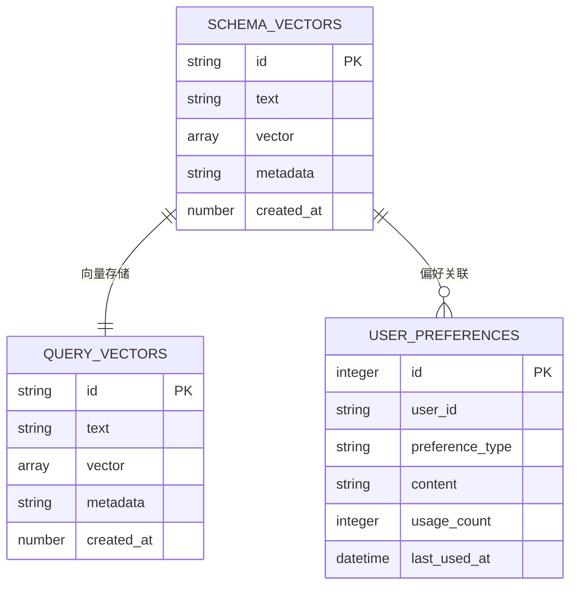

**图表来源**
- [vectorStore.js:265-320](file://backend/src/memory/vectorStore.js#L265-L320)
- [database.js:140-165](file://backend/src/core/database.js#L140-L165)

**章节来源**
- [vectorStore.js:1-621](file://backend/src/memory/vectorStore.js#L1-L621)

### LLM服务模块 (llmService.js)

LLM服务模块负责与外部LLM API通信，提供文本嵌入向量生成功能。

#### 核心能力

1. **HTTP请求封装**：统一的HTTP POST请求处理
2. **重试机制**：自动重试失败的API调用
3. **嵌入向量生成**：将文本转换为向量表示
4. **流式响应支持**：支持流式LLM对话响应

**章节来源**
- [llmService.js:1-432](file://backend/src/core/llmService.js#L1-L432)

### 配置管理系统 (config.js)

集中管理应用的所有配置项，支持环境变量配置和默认值设置。

#### 配置类别

1. **服务器配置**：端口、环境、日志级别
2. **LLM API配置**：模型、超时、重试机制
3. **嵌入向量配置**：模型、维度、超时
4. **数据库配置**：SQLite、LanceDB路径
5. **安全配置**：访问控制、查询限制

**章节来源**
- [config.js:1-372](file://backend/src/core/config.js#L1-L372)

## 架构概览

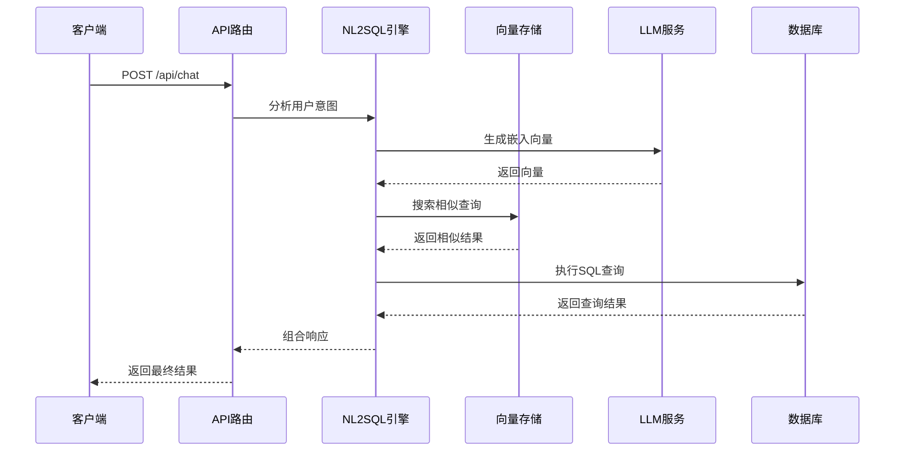

**图表来源**
- [routes.js:1-800](file://backend/src/core/routes.js#L1-L800)
- [vectorStore.js:375-404](file://backend/src/memory/vectorStore.js#L375-L404)
- [llmService.js:324-379](file://backend/src/core/llmService.js#L324-L379)

## 详细组件分析

### 向量存储扩展设计

#### 1. 支持更多嵌入模型

**扩展方案**：

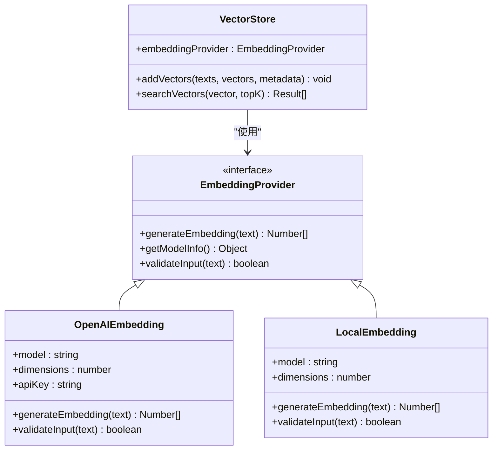

**图表来源**
- [llmService.js:324-379](file://backend/src/core/llmService.js#L324-L379)
- [config.js:80-87](file://backend/src/core/config.js#L80-L87)

**实现步骤**：

1. **抽象嵌入提供者接口**：定义统一的嵌入生成接口
2. **实现多种模型支持**：OpenAI、本地模型等
3. **动态模型切换**：通过配置文件选择嵌入模型
4. **向量维度适配**：支持不同维度的向量存储

#### 2. 优化向量检索算法

**检索优化策略**：

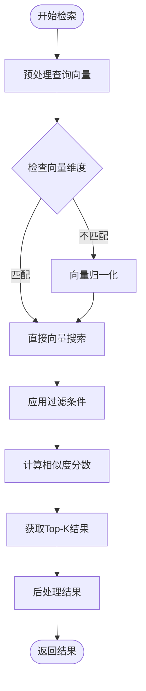

**图表来源**
- [vectorStore.js:375-404](file://backend/src/memory/vectorStore.js#L375-L404)

**优化技术**：

1. **索引优化**：为不同维度建立专门的索引
2. **批量检索**：支持批量向量查询优化
3. **缓存机制**：热门查询结果缓存
4. **相似度算法**：支持多种相似度计算方法

#### 3. 实现增量向量化

**增量向量化流程**：

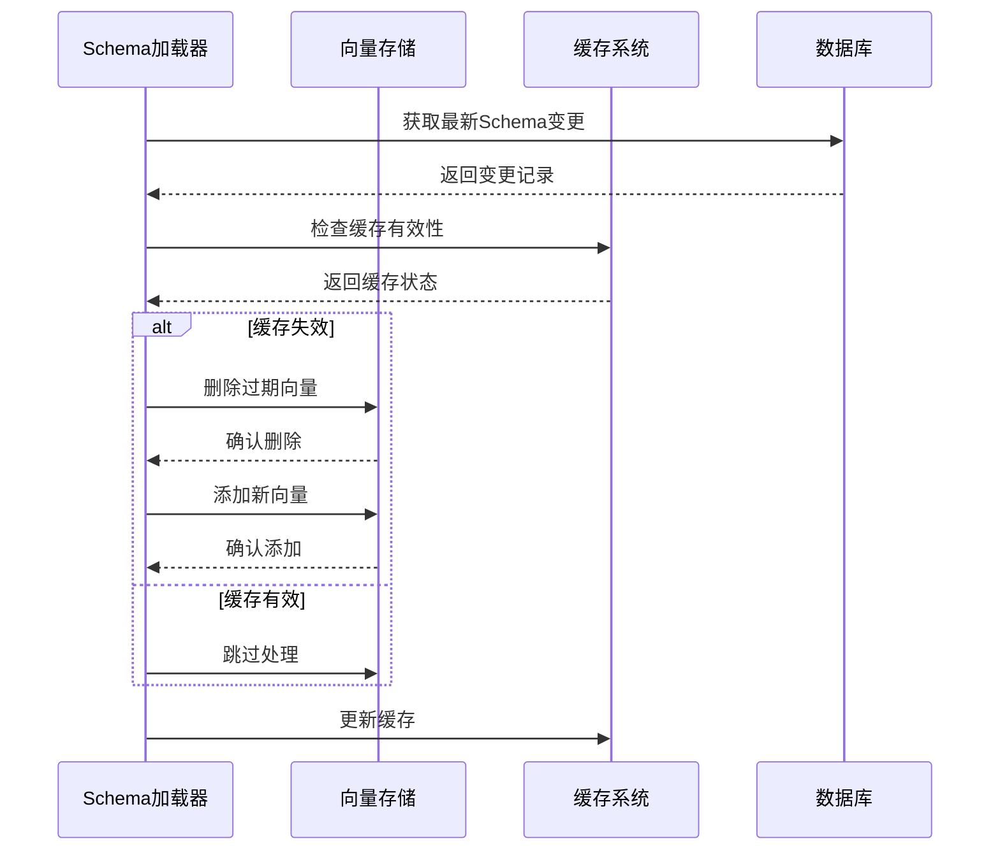

**图表来源**
- [schemaLoader.js:213-290](file://backend/src/core/schemaLoader.js#L213-L290)

**实现要点**：

1. **变更检测**：监控Schema结构变化
2. **增量更新**：只处理发生变化的部分
3. **缓存管理**：避免重复向量化
4. **事务保证**：确保数据一致性

### LanceDB扩展方法

#### 1. 支持不同向量维度

**维度适配策略**：

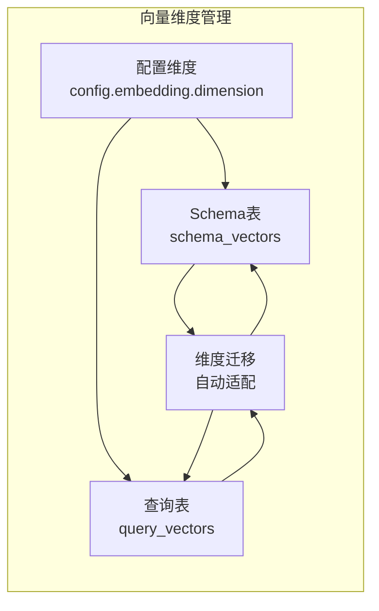

**图表来源**
- [vectorStore.js:265-320](file://backend/src/memory/vectorStore.js#L265-L320)
- [config.js:80-87](file://backend/src/core/config.js#L80-L87)

**实现方案**：

1. **动态表结构**：根据配置自动调整表结构
2. **向量维度验证**：确保向量维度一致性
3. **自动迁移机制**：支持不同维度间的平滑迁移
4. **性能优化**：为不同维度建立专用索引

#### 2. 向量索引优化

**索引优化策略**：

| 索引类型 | 适用场景 | 性能特点 |
|---------|---------|----------|
| IVF (倒排文件) | 大规模向量检索 | 高召回率，中等速度 |
| HNSW (Hierarchical Navigable Small World) | 实时检索 | 高速度，良好召回率 |
| ANNOY | 内存友好 | 适合小规模数据 |
| Flat | 精确检索 | 最准确，速度慢 |

**章节来源**
- [vectorStore.js:375-404](file://backend/src/memory/vectorStore.js#L375-L404)

#### 3. 批量向量化功能

**批量处理架构**：

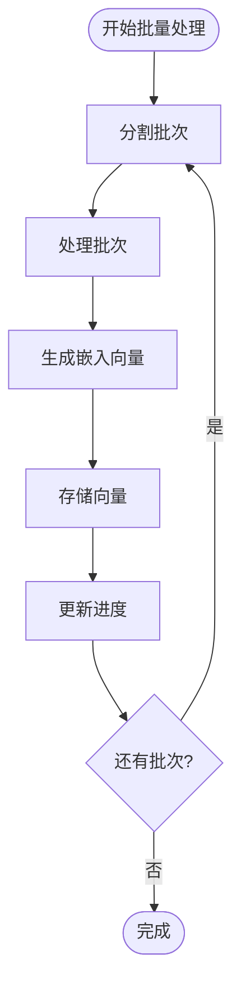

**图表来源**
- [schemaLoader.js:256-273](file://backend/src/core/schemaLoader.js#L256-L273)

**批量处理优化**：

1. **并发控制**：限制同时处理的批次数量
2. **内存管理**：避免内存溢出
3. **错误恢复**：单个批次失败不影响整体
4. **进度跟踪**：实时监控处理进度

### 向量存储扩展策略

#### 1. 多模态向量支持

**多模态数据处理**：

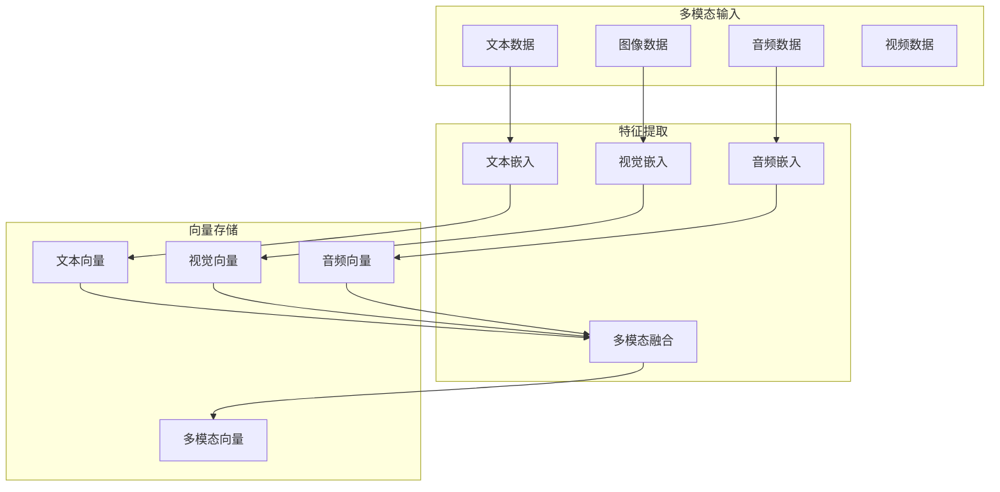

**实现方案**：

1. **特征提取器**：支持不同模态的特征提取
2. **向量融合**：将多模态向量进行融合
3. **统一接口**：提供统一的多模态检索接口
4. **性能优化**：针对不同模态优化存储和检索

#### 2. 向量压缩技术

**压缩策略**：

| 压缩方法 | 压缩率 | 查询精度 | 适用场景 |
|---------|--------|----------|----------|
| PCA降维 | 70-90% | 高 | 大规模向量存储 |
| Product Quantization | 80-95% | 中高 | 实时检索 |
| IVF-ADC | 85-98% | 高 | 精确检索 |
| Hashing | 95%+ | 中 | 内存受限环境 |

**章节来源**
- [vectorStore.js:334-365](file://backend/src/memory/vectorStore.js#L334-L365)

#### 3. 向量版本管理

**版本控制机制**：

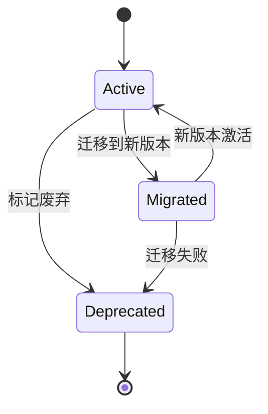

**版本管理功能**：

1. **版本标识**：为向量数据添加版本标签
2. **向后兼容**：支持新旧版本并存
3. **自动迁移**：提供版本升级工具
4. **回滚机制**：支持版本回退

### 扩展示例

#### 1. 新增向量相似度计算方法

**实现步骤**：

1. **定义相似度接口**：
```javascript
class SimilarityCalculator {
    static cosine(vector1, vector2) { /* 余弦相似度 */ }
    static euclidean(vector1, vector2) { /* 欧几里得距离 */ }
    static dotProduct(vector1, vector2) { /* 点积 */ }
}
```

2. **配置相似度算法**：
```javascript
// config.js
similarity: {
    algorithm: 'cosine', // 支持 cosine/euclidean/dot
    threshold: 0.7
}
```

3. **集成到检索流程**：
```javascript
// vectorStore.js
async searchSimilarQueries(queryVector, topK = 5) {
    const results = await this.search(queryVector);
    return results
        .filter(item => this.calculateSimilarity(item.vector, queryVector) > config.similarity.threshold)
        .sort((a, b) => b.similarity - a.similarity)
        .slice(0, topK);
}
```

#### 2. 分布式向量存储

**分布式架构设计**：

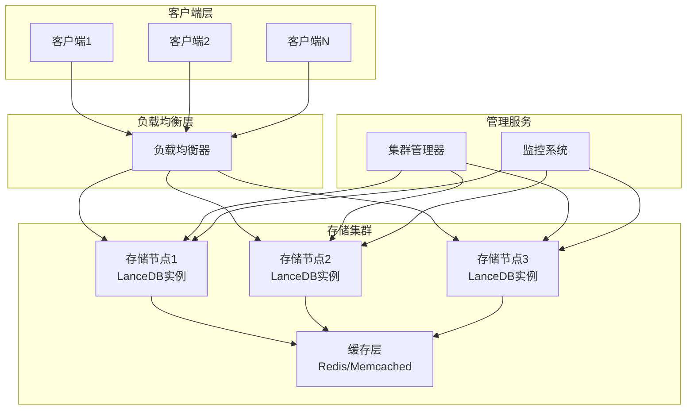

**实现要点**：

1. **数据分片**：按用户ID或哈希值分片存储
2. **副本机制**：确保数据可靠性
3. **一致性保证**：实现分布式一致性协议
4. **自动故障转移**：节点故障自动切换

#### 3. 向量缓存机制

**缓存架构**：

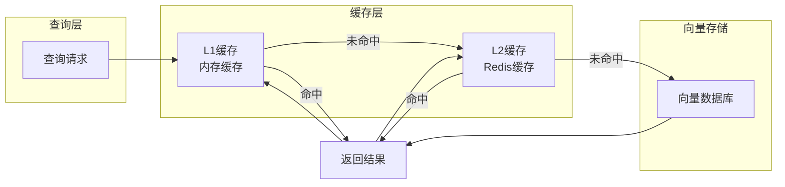

**缓存策略**：

1. **多级缓存**：内存缓存 + Redis缓存
2. **智能预热**：热点数据自动预加载
3. **失效策略**：基于时间的TTL和LRU淘汰
4. **一致性保证**：缓存与数据库的同步机制

**章节来源**
- [vectorStore.js:375-481](file://backend/src/memory/vectorStore.js#L375-L481)

## 依赖关系分析

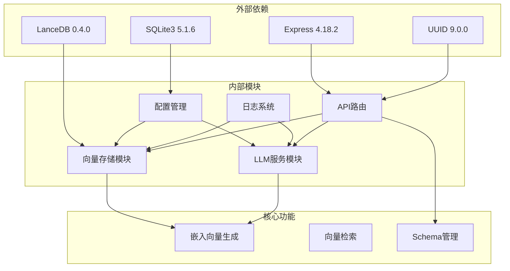

**图表来源**
- [package.json:10-20](file://backend/package.json#L10-L20)
- [app.js:40-50](file://backend/src/app.js#L40-L50)

**章节来源**
- [package.json:1-28](file://backend/package.json#L1-L28)
- [app.js:1-238](file://backend/src/app.js#L1-L238)

## 性能考虑

### 1. 向量检索性能优化

**优化策略**：

1. **索引选择**：根据数据规模选择合适的索引类型
2. **批量处理**：减少网络往返次数
3. **缓存策略**：热点数据缓存
4. **查询优化**：避免不必要的向量计算

### 2. 存储容量规划

**容量估算公式**：

```
总存储需求 = 向量数量 × 向量维度 × 4字节 + 元数据存储 + 索引存储
```

**扩展建议**：

1. **分片存储**：按时间或用户ID分片
2. **冷热分离**：热数据在内存，冷数据在磁盘
3. **压缩存储**：使用向量压缩技术
4. **定期清理**：清理过期或无效数据

### 3. 系统监控指标

**关键性能指标**：

| 指标类型 | 监控目标 | 告警阈值 |
|---------|---------|----------|
| 查询延迟 | < 100ms | < 500ms |
| 向量检索准确率 | > 95% | > 90% |
| 系统可用性 | > 99.9% | > 99% |
| 存储利用率 | < 80% | < 90% |

## 故障排除指南

### 1. 常见问题诊断

**向量数据库连接问题**：
- 检查LanceDB路径配置
- 验证目录权限
- 确认磁盘空间充足

**嵌入向量生成失败**：
- 检查LLM API配置
- 验证API密钥有效性
- 检查网络连接

**检索性能下降**：
- 分析索引使用情况
- 检查内存使用率
- 优化查询参数

### 2. 错误处理机制

**章节来源**
- [vectorStore.js:254-258](file://backend/src/memory/vectorStore.js#L254-L258)
- [llmService.js:167-195](file://backend/src/core/llmService.js#L167-L195)

## 结论

本文档为向量存储系统的扩展提供了全面的技术指导，涵盖了从基础架构到高级特性的各个方面。通过实施这些扩展策略，可以显著提升系统的性能、可扩展性和功能性。

**主要收益**：

1. **更好的用户体验**：支持更多嵌入模型和检索算法
2. **更高的性能**：通过索引优化和缓存机制提升响应速度
3. **更强的可扩展性**：支持分布式部署和水平扩展
4. **更灵活的架构**：支持多模态数据和版本管理

**实施建议**：

1. **渐进式部署**：先在测试环境验证，再逐步推广到生产环境
2. **监控和告警**：建立完善的监控体系，及时发现和解决问题
3. **文档和培训**：为开发团队提供充分的技术培训和文档支持
4. **持续优化**：根据实际使用情况进行持续的性能优化和功能改进

通过遵循这些指导原则和技术方案，可以构建一个高性能、可扩展、易维护的向量存储系统，为未来的业务发展奠定坚实的技术基础。