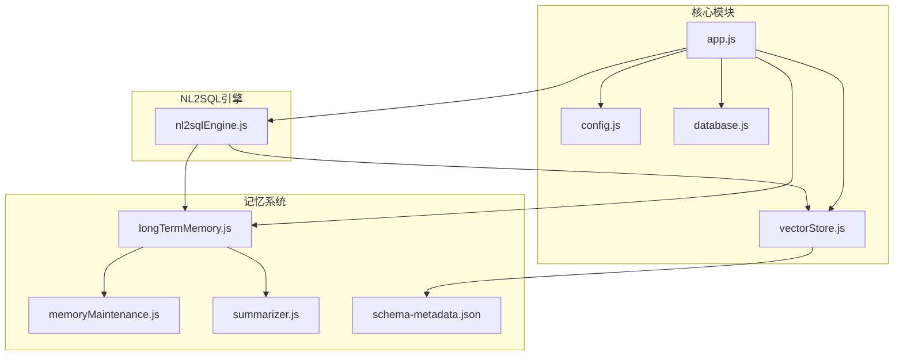
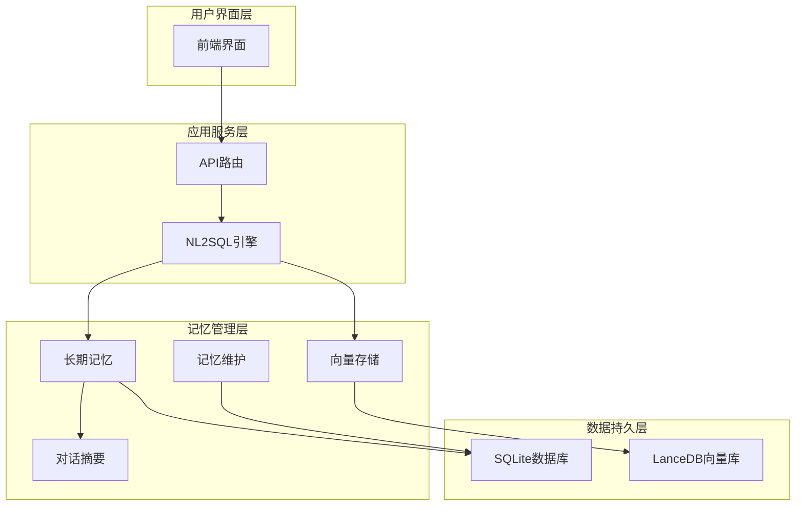
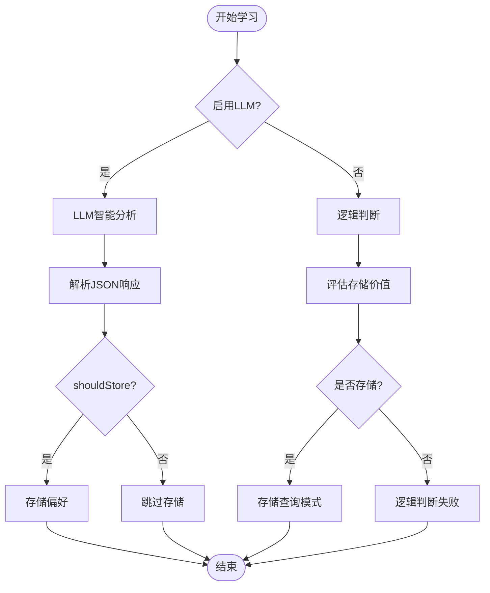
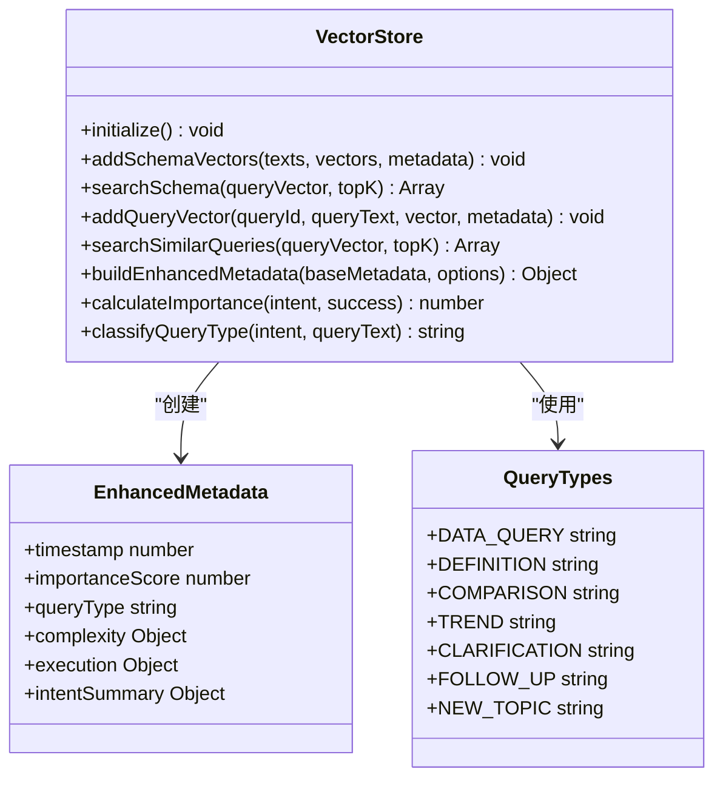
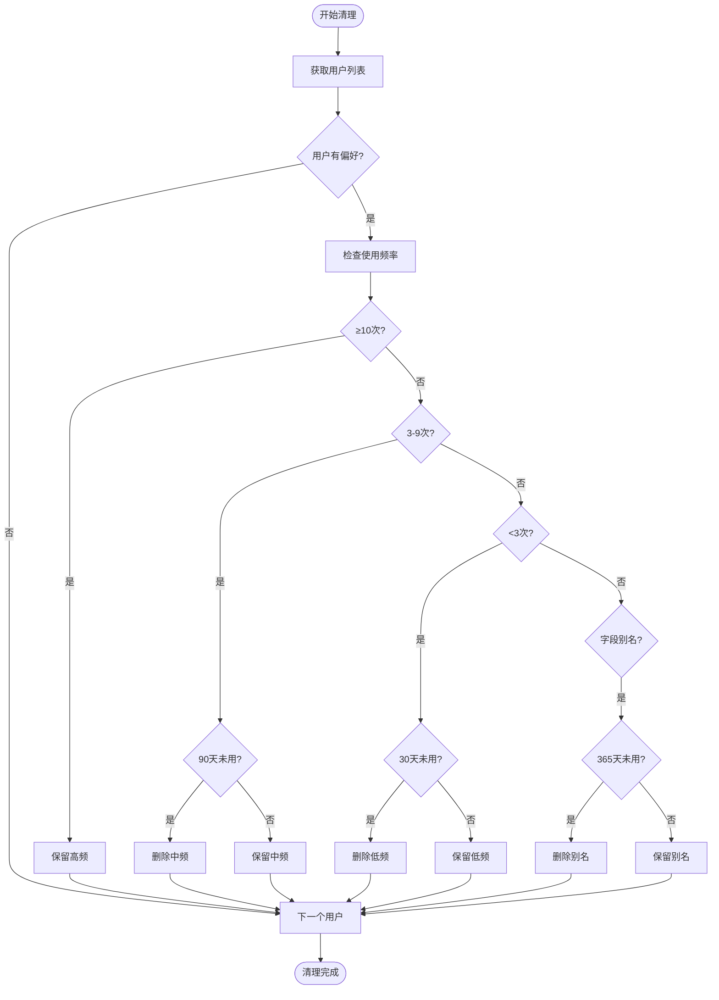
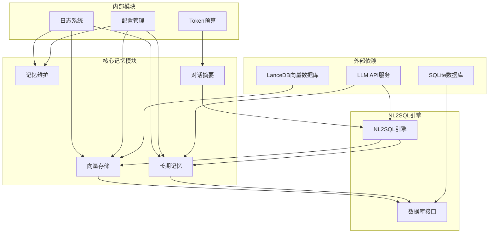

# 用户记忆系统扩展

<cite>
**本文档引用的文件**
- [longTermMemory.js](file://backend/src/memory/longTermMemory.js)
- [vectorStore.js](file://backend/src/memory/vectorStore.js)
- [memoryMaintenance.js](file://backend/src/memory/memoryMaintenance.js)
- [nl2sqlEngine.js](file://backend/src/core/nl2sqlEngine.js)
- [database.js](file://backend/src/core/database.js)
- [config.js](file://backend/src/core/config.js)
- [app.js](file://backend/src/app.js)
- [summarizer.js](file://backend/src/memory/summarizer.js)
- [schema-metadata.json](file://backend/config/schema-metadata.json)
</cite>

## 目录
1. [简介](#简介)
2. [项目结构](#项目结构)
3. [核心组件](#核心组件)
4. [架构概览](#架构概览)
5. [详细组件分析](#详细组件分析)
6. [依赖关系分析](#依赖关系分析)
7. [性能考虑](#性能考虑)
8. [故障排除指南](#故障排除指南)
9. [结论](#结论)
10. [附录](#附录)

## 简介

NL2SQL项目是一个基于自然语言到SQL转换的智能数据分析系统。本文档专注于用户记忆系统的扩展设计，涵盖长期记忆管理、向量存储系统、记忆维护机制等多个方面。系统采用模块化架构，支持用户偏好学习算法改进、别名管理机制增强、查询模式识别优化等功能扩展。

## 项目结构

该项目采用清晰的模块化组织结构，核心记忆系统位于`backend/src/memory/`目录下，包含以下关键组件：

**图表来源**
- [app.js:97-166](file://backend/src/app.js#L97-L166)
- [config.js:16-372](file://backend/src/core/config.js#L16-L372)

**章节来源**
- [app.js:1-238](file://backend/src/app.js#L1-L238)
- [config.js:1-372](file://backend/src/core/config.js#L1-L372)

## 核心组件

### 长期记忆管理模块

长期记忆系统负责用户偏好学习和存储，支持多种偏好类型：
- 查询模式（query_pattern）
- 字段别名（field_alias）
- 指标偏好（metric_preference）
- 维度偏好（dimension_preference）

系统采用智能筛选机制，通过置信度阈值、频率统计和价值评估来决定是否存储用户偏好。

**章节来源**
- [longTermMemory.js:1-800](file://backend/src/memory/longTermMemory.js#L1-L800)

### 向量存储系统

基于LanceDB的向量存储系统，支持：
- Schema信息向量化存储
- 查询历史语义检索
- 元数据增强和分类
- 向量相似度搜索

系统提供完整的向量生命周期管理，包括初始化、数据添加、查询搜索和统计监控。

**章节来源**
- [vectorStore.js:1-621](file://backend/src/memory/vectorStore.js#L1-L621)

### 记忆维护模块

专门负责长期记忆的维护和清理：
- 分级保留策略（高频、中频、低频）
- 字段别名定期清理
- 相似模式合并
- 统计报告生成

**章节来源**
- [memoryMaintenance.js:1-415](file://backend/src/memory/memoryMaintenance.js#L1-L415)

## 架构概览

系统采用分层架构设计，各组件职责清晰：

**图表来源**
- [nl2sqlEngine.js:497-780](file://backend/src/core/nl2sqlEngine.js#L497-L780)
- [longTermMemory.js:311-484](file://backend/src/memory/longTermMemory.js#L311-L484)

## 详细组件分析

### 长期记忆系统扩展

#### 用户偏好学习算法改进

系统支持两种学习模式：

1. **LLM智能分析模式**（推荐）
   - 基于预定义提示词的智能判断
   - 支持字段别名、分析习惯、业务逻辑定义
   - 置信度评估和理由解释

2. **逻辑判断模式**
   - 基于阈值的启发式规则
   - 高价值模板识别
   - 频率统计分析

**图表来源**
- [longTermMemory.js:56-188](file://backend/src/memory/longTermMemory.js#L56-L188)
- [longTermMemory.js:251-295](file://backend/src/memory/longTermMemory.js#L251-L295)

#### 别名管理机制增强

系统支持多种别名类型：

1. **字段别名映射**
   - 游戏实体映射（如"青木" → game_id=30）
   - 数据源映射（如"新平台" → new_tzpingtai）
   - 指标别名映射

2. **实体值映射**
   - 直接存储用户术语到实际值的映射
   - 支持双向映射关系

3. **平台术语解析**
   - 从查询中识别平台术语
   - 自动映射到数据库标识

**章节来源**
- [longTermMemory.js:493-605](file://backend/src/memory/longTermMemory.js#L493-L605)
- [nl2sqlEngine.js:122-186](file://backend/src/core/nl2sqlEngine.js#L122-L186)

### 向量存储系统扩展

#### 支持更多嵌入模型

系统当前支持多种嵌入模型配置：

| 模型名称 | 维度 | 描述 |
|---------|------|------|
| text-embedding-3-small | 1536 | 小尺寸模型，适合一般用途 |
| text-embedding-3-large | 3072 | 大尺寸模型，适合复杂查询 |
| text-embedding-ada-002 | 1536 | 传统模型，兼容性强 |

**图表来源**
- [vectorStore.js:600-621](file://backend/src/memory/vectorStore.js#L600-L621)
- [vectorStore.js:137-193](file://backend/src/memory/vectorStore.js#L137-L193)

#### 优化向量检索算法

系统提供多种检索策略：

1. **语义相似度检索**
   - 基于余弦相似度的距离计算
   - 支持topK结果返回
   - 元数据过滤和排序

2. **混合检索策略**
   - 结合语义相似度和元数据匹配
   - 支持用户特定查询过滤
   - 动态权重调整

3. **批量向量化处理**
   - 支持批量添加向量
   - 异步处理机制
   - 内存优化策略

**章节来源**
- [vectorStore.js:375-481](file://backend/src/memory/vectorStore.js#L375-L481)
- [vectorStore.js:334-365](file://backend/src/memory/vectorStore.js#L334-L365)

### 记忆维护机制扩展

#### 数据清理策略

系统采用分级保留策略：

| 等级 | 使用频率 | 保留期限 | 清理条件 |
|------|----------|----------|----------|
| 高频 | ≥10次 | 永久 | 不清理 |
| 中频 | 3-9次 | 90天 | 90天未使用 |
| 低频 | <3次 | 30天 | 30天未使用 |
| 字段别名 | - | 365天 | 365天未使用 |

**图表来源**
- [memoryMaintenance.js:69-189](file://backend/src/memory/memoryMaintenance.js#L69-L189)

#### 内存优化方案

1. **缓存管理**
   - 对话摘要缓存（30分钟过期）
   - 摘要智能更新机制
   - 内存使用监控

2. **批量处理功能**
   - 批量向量添加
   - 批量偏好更新
   - 事务性操作保证

3. **索引优化**
   - SQLite复合索引
   - LanceDB表结构优化
   - 查询性能监控

**章节来源**
- [memoryMaintenance.js:190-310](file://backend/src/memory/memoryMaintenance.js#L190-L310)
- [summarizer.js:375-435](file://backend/src/memory/summarizer.js#L375-L435)

## 依赖关系分析

系统组件之间的依赖关系如下：

**图表来源**
- [nl2sqlEngine.js:16-30](file://backend/src/core/nl2sqlEngine.js#L16-L30)
- [longTermMemory.js:17-21](file://backend/src/memory/longTermMemory.js#L17-L21)

**章节来源**
- [nl2sqlEngine.js:1-800](file://backend/src/core/nl2sqlEngine.js#L1-L800)
- [database.js:1-850](file://backend/src/core/database.js#L1-L850)

## 性能考虑

### 向量存储性能优化

1. **索引策略**
   - LanceDB内置向量索引
   - SQLite复合索引优化
   - 查询缓存机制

2. **内存管理**
   - 分页加载大量数据
   - 智能缓存策略
   - 内存使用监控

3. **并发处理**
   - 异步向量处理
   - 事务性数据库操作
   - 非阻塞I/O操作

### 记忆系统性能优化

1. **查询优化**
   - 预编译SQL语句
   - 索引使用优化
   - 查询计划缓存

2. **缓存策略**
   - 多级缓存架构
   - 缓存失效策略
   - 缓存命中率监控

3. **资源管理**
   - 连接池管理
   - 内存使用限制
   - CPU使用监控

## 故障排除指南

### 常见问题及解决方案

#### 向量数据库初始化失败

**症状**: 启动时向量数据库初始化失败

**原因分析**:
- LanceDB路径权限问题
- 磁盘空间不足
- 文件系统损坏

**解决步骤**:
1. 检查`VECTOR_DB_PATH`配置
2. 验证磁盘空间和权限
3. 重启应用服务

#### 长期记忆存储异常

**症状**: 用户偏好无法保存或读取

**原因分析**:
- SQLite数据库连接问题
- 表结构不匹配
- 权限不足

**解决步骤**:
1. 检查数据库连接状态
2. 运行数据库迁移
3. 验证表结构完整性

#### LLM集成问题

**症状**: LLM API调用失败

**原因分析**:
- API密钥配置错误
- 网络连接问题
- 请求超时

**解决步骤**:
1. 验证`LLM_API_KEY`配置
2. 检查网络连接
3. 调整超时设置

**章节来源**
- [config.js:340-372](file://backend/src/core/config.js#L340-L372)
- [app.js:160-165](file://backend/src/app.js#L160-L165)

## 结论

NL2SQL项目的用户记忆系统扩展展现了现代AI应用的典型架构特征。系统通过模块化设计实现了功能的可扩展性，通过分层架构确保了系统的稳定性。长期记忆系统、向量存储系统和记忆维护机制的协同工作，为用户提供智能化的数据查询体验。

未来扩展方向包括：
- 支持更多嵌入模型和检索算法
- 实现多模态记忆（文本、图像、音频）
- 增强记忆共享和协作功能
- 优化性能监控和故障诊断能力

## 附录

### 扩展示例

#### 添加新的学习算法

1. 在`longTermMemory.js`中添加新算法函数
2. 更新配置文件支持新算法
3. 实现相应的测试用例

#### 支持多模态记忆

1. 扩展向量存储系统支持多模态数据
2. 实现多模态特征提取
3. 更新检索算法以支持多模态匹配

#### 实现记忆共享机制

1. 扩展数据库表结构支持共享偏好
2. 实现权限控制机制
3. 添加共享记忆的同步机制

### 性能监控指标

- 向量检索延迟（毫秒）
- 记忆存储吞吐量（记录/秒）
- 数据库查询响应时间（毫秒）
- 内存使用率（百分比）
- LLM API调用成功率（百分比）

### 测试方法

1. **单元测试**: 针对单个函数的功能测试
2. **集成测试**: 模块间交互测试
3. **性能测试**: 压力测试和负载测试
4. **回归测试**: 变更影响测试
5. **用户验收测试**: 实际场景测试