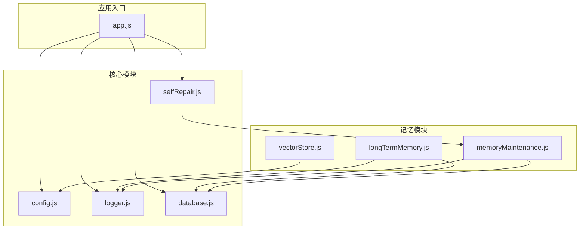
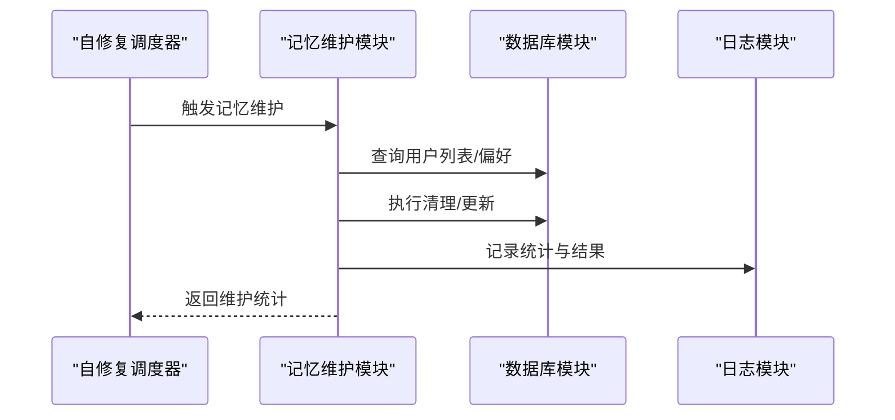
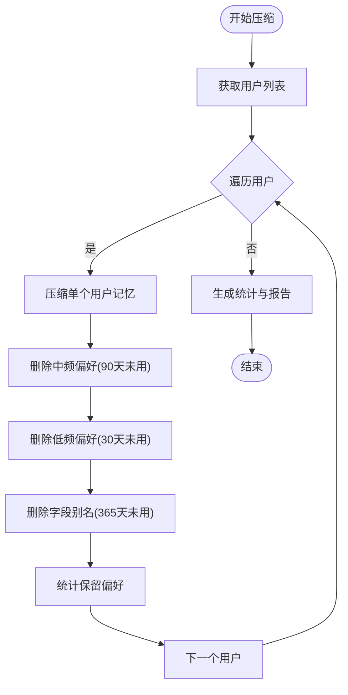
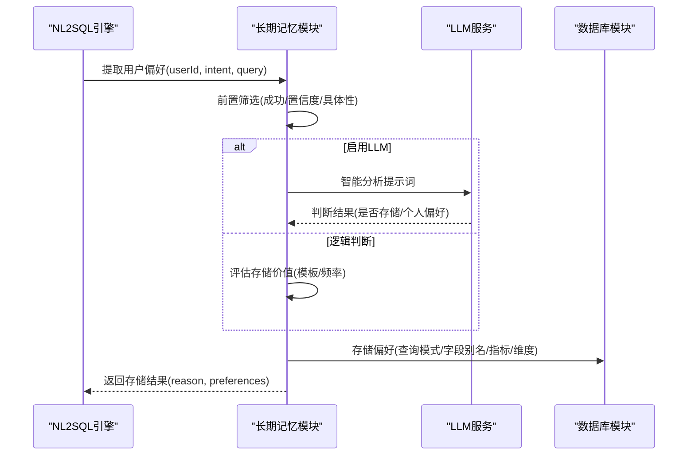
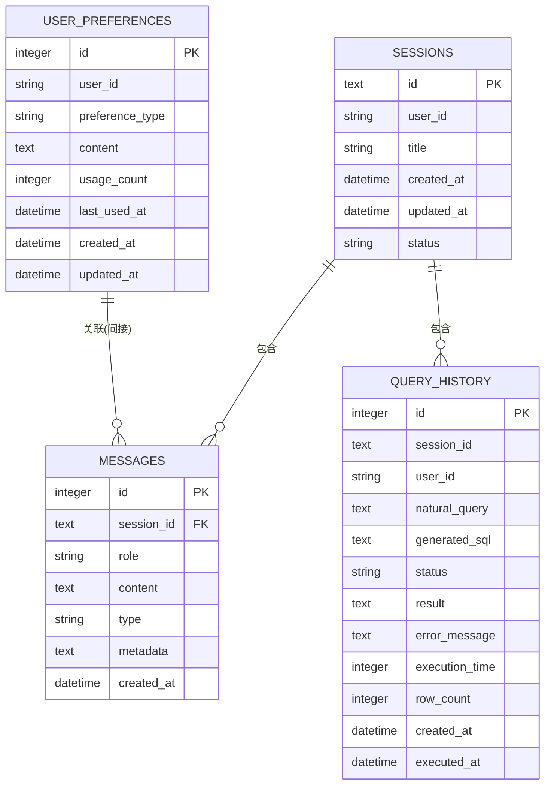
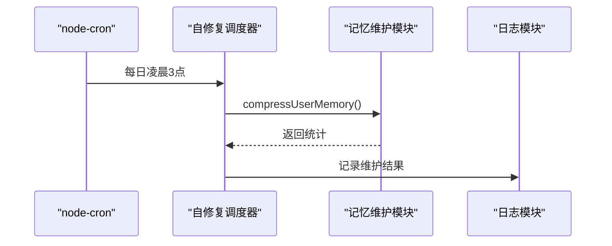
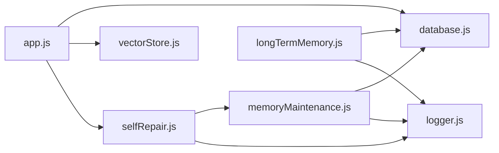

# 记忆维护系统扩展

<cite>
**本文档引用的文件**
- [memoryMaintenance.js](file://backend/src/memory/memoryMaintenance.js)
- [longTermMemory.js](file://backend/src/memory/longTermMemory.js)
- [vectorStore.js](file://backend/src/memory/vectorStore.js)
- [database.js](file://backend/src/core/database.js)
- [config.js](file://backend/src/core/config.js)
- [selfRepair.js](file://backend/src/core/selfRepair.js)
- [logger.js](file://backend/src/utils/logger.js)
- [app.js](file://backend/src/app.js)
- [package.json](file://backend/package.json)
</cite>

## 目录
1. [简介](#简介)
2. [项目结构](#项目结构)
3. [核心组件](#核心组件)
4. [架构概览](#架构概览)
5. [详细组件分析](#详细组件分析)
6. [依赖分析](#依赖分析)
7. [性能考虑](#性能考虑)
8. [故障排查指南](#故障排查指南)
9. [结论](#结论)
10. [附录](#附录)

## 简介
本指南面向希望扩展现有记忆维护系统的开发者，围绕数据清理策略优化、内存优化方案、批量处理增强、自动维护机制扩展（智能清理策略、记忆老化机制、批量更新）、维护策略扩展（定期维护计划、增量维护、维护效果评估）以及监控与性能影响分析等方面，提供系统性的实现指导与最佳实践。文档基于仓库中的长期记忆模块、数据库层、自修复调度器等核心组件进行深度分析，并给出可落地的扩展示例与可视化图表。

## 项目结构
NL2SQL后端采用模块化设计，记忆维护系统位于 `backend/src/memory` 目录，核心数据库与配置位于 `backend/src/core`，日志与应用入口位于 `backend/src/utils` 和 `backend/src/app.js`。自修复调度器负责定时任务编排，包括记忆维护任务。

**图表来源**
- [app.js:97-166](file://backend/src/app.js#L97-L166)
- [selfRepair.js:60-125](file://backend/src/core/selfRepair.js#L60-L125)
- [memoryMaintenance.js:16-18](file://backend/src/memory/memoryMaintenance.js#L16-L18)
- [longTermMemory.js:17-21](file://backend/src/memory/longTermMemory.js#L17-L21)
- [vectorStore.js:14-20](file://backend/src/memory/vectorStore.js#L14-L20)

**章节来源**
- [app.js:97-166](file://backend/src/app.js#L97-L166)
- [package.json:10-20](file://backend/package.json#L10-L20)

## 核心组件
- 记忆维护模块：负责长期记忆的压缩、清理与相似模式合并，支持分级保留策略与统计报告。
- 长期记忆模块：负责用户偏好提取与存储，支持LLM智能分析与阈值筛选。
- 数据库模块：提供SQLite持久化能力，包含用户偏好表、会话表、消息表、查询历史表等。
- 自修复调度器：基于node-cron实现定时任务，包括每日自检、会话清理、统计收集与记忆维护。
- 向量存储模块：基于LanceDB实现Schema与查询历史的向量化存储与检索。

**章节来源**
- [memoryMaintenance.js:16-46](file://backend/src/memory/memoryMaintenance.js#L16-L46)
- [longTermMemory.js:17-41](file://backend/src/memory/longTermMemory.js#L17-L41)
- [database.js:39-189](file://backend/src/core/database.js#L39-L189)
- [selfRepair.js:15-27](file://backend/src/core/selfRepair.js#L15-L27)
- [vectorStore.js:14-20](file://backend/src/memory/vectorStore.js#L14-L20)

## 架构概览
记忆维护系统通过自修复调度器在固定时间触发压缩与清理流程，同时结合长期记忆模块的智能筛选与存储策略，形成“提取-存储-维护”的闭环。

**图表来源**
- [selfRepair.js:383-415](file://backend/src/core/selfRepair.js#L383-L415)
- [memoryMaintenance.js:69-120](file://backend/src/memory/memoryMaintenance.js#L69-L120)
- [database.js:361-424](file://backend/src/core/database.js#L361-L424)

## 详细组件分析

### 记忆维护模块（memoryMaintenance.js）
- 分级清理策略：高频（≥10次）永久保留，中频（3-9次）90天未用清理，低频（<3次）30天未用清理，字段别名365天未用清理。
- 核心功能：
  - 压缩用户记忆：按用户批量清理过期偏好，统计删除与保留数量。
  - 合并相似模式：基于维度/指标重叠度与时间范围一致性进行模式合并。
  - 统计与报告：提供用户记忆统计与系统健康报告。
- 性能与健壮性：
  - 使用事务与索引优化（user_id、preference_type、复合索引）。
  - 异常捕获与日志记录，保证维护过程可观测。

**图表来源**
- [memoryMaintenance.js:69-189](file://backend/src/memory/memoryMaintenance.js#L69-L189)
- [memoryMaintenance.js:201-245](file://backend/src/memory/memoryMaintenance.js#L201-L245)

**章节来源**
- [memoryMaintenance.js:24-46](file://backend/src/memory/memoryMaintenance.js#L24-L46)
- [memoryMaintenance.js:69-189](file://backend/src/memory/memoryMaintenance.js#L69-L189)
- [memoryMaintenance.js:201-310](file://backend/src/memory/memoryMaintenance.js#L201-L310)
- [memoryMaintenance.js:320-395](file://backend/src/memory/memoryMaintenance.js#L320-L395)

### 长期记忆模块（longTermMemory.js）
- LLM智能分析：通过提示词工程判断查询是否值得存入长期记忆，区分个人偏好与通用知识。
- 存储筛选：置信度阈值、高价值模板（维度≥2且指标≥1）、近期频率（7天内≥2次）等。
- 偏好存储：查询模式、字段别名、指标偏好、维度偏好等类型化存储。
- 性能与健壮性：JSON解析容错、回退逻辑、日志记录。

**图表来源**
- [longTermMemory.js:311-484](file://backend/src/memory/longTermMemory.js#L311-L484)
- [longTermMemory.js:56-188](file://backend/src/memory/longTermMemory.js#L56-L188)
- [database.js:609-650](file://backend/src/core/database.js#L609-L650)

**章节来源**
- [longTermMemory.js:26-41](file://backend/src/memory/longTermMemory.js#L26-L41)
- [longTermMemory.js:251-295](file://backend/src/memory/longTermMemory.js#L251-L295)
- [longTermMemory.js:311-484](file://backend/src/memory/longTermMemory.js#L311-L484)

### 数据库模块（database.js）
- 表结构：sessions、messages、query_history、user_preferences等。
- 核心操作：查询、执行、事务、迁移、偏好增删改查。
- 性能优化：索引（user_id、preference_type、复合索引）提升查询效率。

**图表来源**
- [database.js:39-189](file://backend/src/core/database.js#L39-L189)

**章节来源**
- [database.js:39-189](file://backend/src/core/database.js#L39-L189)
- [database.js:609-781](file://backend/src/core/database.js#L609-L781)

### 自修复调度器（selfRepair.js）
- 定时任务：每日自检、会话清理、统计收集、记忆维护。
- 记忆维护触发：每天凌晨3点执行压缩与清理，并生成健康报告。
- 手动触发：支持手动触发各类检查与维护任务。

**图表来源**
- [selfRepair.js:115-122](file://backend/src/core/selfRepair.js#L115-L122)
- [selfRepair.js:383-415](file://backend/src/core/selfRepair.js#L383-L415)

**章节来源**
- [selfRepair.js:60-125](file://backend/src/core/selfRepair.js#L60-L125)
- [selfRepair.js:383-415](file://backend/src/core/selfRepair.js#L383-L415)

### 向量存储模块（vectorStore.js）
- 功能：Schema向量与查询历史向量的增删查改、元数据增强、统计查询。
- 性能：基于LanceDB的向量检索，支持topK返回与元数据解析。
- 限制：LanceDB当前不支持直接删除，提供覆盖与清空策略。

**章节来源**
- [vectorStore.js:229-320](file://backend/src/memory/vectorStore.js#L229-L320)
- [vectorStore.js:334-481](file://backend/src/memory/vectorStore.js#L334-L481)

## 依赖分析
- 记忆维护模块依赖数据库模块进行偏好清理与统计，依赖日志模块进行可观测性。
- 长期记忆模块依赖数据库模块进行偏好存储与查询，依赖LLM服务进行智能分析。
- 自修复调度器依赖node-cron进行定时任务编排，依赖记忆维护模块执行维护。
- 应用入口负责初始化数据库、向量存储、Schema加载与自修复调度器启动。

**图表来源**
- [memoryMaintenance.js:16-18](file://backend/src/memory/memoryMaintenance.js#L16-L18)
- [longTermMemory.js:17-21](file://backend/src/memory/longTermMemory.js#L17-L21)
- [selfRepair.js:15-27](file://backend/src/core/selfRepair.js#L15-L27)
- [app.js:44-50](file://backend/src/app.js#L44-L50)

**章节来源**
- [package.json:10-20](file://backend/package.json#L10-L20)

## 性能考虑
- 数据库层面：
  - 索引优化：user_id、preference_type、user_id+preference_type复合索引显著提升查询与更新性能。
  - 事务使用：批量清理与合并操作建议在事务中执行，减少锁竞争与回滚成本。
  - 分页与限制：查询历史与偏好列表需设置合理limit，避免一次性加载过多数据。
- 记忆维护层面：
  - 用户扫描策略：按30天未更新的用户进行扫描，降低全量扫描压力。
  - 清理策略：分级保留策略减少无效数据，提高检索质量。
- 向量存储层面：
  - 向量维度与topK选择：根据硬件与查询延迟需求调整维度与返回数量。
  - 初始化与重建：LanceDB表重建与覆盖策略需谨慎规划，避免频繁I/O。
- 日志与监控：
  - 日志级别与轮转：生产环境建议使用info级别，避免过多debug日志影响性能。
  - 统计收集：每5分钟收集一次连接数与内存使用，及时发现异常。

[本节为通用性能讨论，无需特定文件来源]

## 故障排查指南
- 记忆维护失败：
  - 检查数据库连接与权限，确认user_preferences表存在且索引正常。
  - 查看日志模块中的错误堆栈，定位SQL执行失败或解析异常。
- LLM智能分析失败：
  - 确认LLM API配置正确，网络连通性良好。
  - 检查提示词解析逻辑，确保JSON响应可被正确解析。
- 向量数据库未初始化：
  - 确认LanceDB路径存在且可写，初始化流程是否成功。
  - 若表不存在，检查初始化脚本与权限。
- 自修复任务未执行：
  - 检查node-cron是否正确安装与导入。
  - 确认Cron表达式与系统时区设置。

**章节来源**
- [logger.js:227-293](file://backend/src/utils/logger.js#L227-L293)
- [selfRepair.js:383-415](file://backend/src/core/selfRepair.js#L383-L415)
- [vectorStore.js:229-259](file://backend/src/memory/vectorStore.js#L229-L259)

## 结论
通过现有模块的清晰职责划分与定时调度机制，记忆维护系统具备良好的可扩展性。建议在保持现有分级清理策略的基础上，引入智能清理策略（基于使用模式与业务价值）、记忆老化机制（动态调整TTL）、增量维护（按用户增量扫描）、维护效果评估（清理前后对比指标）等能力，以进一步提升系统的智能化与自动化水平。

[本节为总结性内容，无需特定文件来源]

## 附录

### 扩展清单与实施步骤
- 智能清理策略
  - 目标：基于使用模式与业务价值动态调整清理阈值。
  - 实施：在清理规则中引入机器学习特征（如查询成功率、检索命中率、用户反馈），动态计算TTL。
  - 参考位置：清理规则定义与清理逻辑。
  - 参考来源：
    - [memoryMaintenance.js:24-46](file://backend/src/memory/memoryMaintenance.js#L24-L46)
    - [memoryMaintenance.js:134-166](file://backend/src/memory/memoryMaintenance.js#L134-L166)

- 记忆老化机制
  - 目标：为不同类型的偏好设置不同的老化速率。
  - 实施：在偏好内容中增加老化权重字段，结合使用频率与时间衰减计算最终保留概率。
  - 参考来源：
    - [database.js:609-650](file://backend/src/core/database.js#L609-L650)
    - [longTermMemory.js:614-658](file://backend/src/memory/longTermMemory.js#L614-L658)

- 批量更新功能
  - 目标：支持批量更新偏好使用次数与最后使用时间。
  - 实施：在数据库模块中增加批量更新接口，配合自修复调度器批量执行。
  - 参考来源：
    - [database.js:656-666](file://backend/src/core/database.js#L656-L666)
    - [selfRepair.js:383-415](file://backend/src/core/selfRepair.js#L383-L415)

- 定期维护计划
  - 目标：支持灵活的维护计划（如按周、按月）。
  - 实施：在自修复配置中增加维护计划字段，调度器根据计划动态注册任务。
  - 参考来源：
    - [config.js:217-226](file://backend/src/core/config.js#L217-L226)
    - [selfRepair.js:60-125](file://backend/src/core/selfRepair.js#L60-L125)

- 增量维护
  - 目标：仅处理最近活跃的用户或偏好，减少全量扫描。
  - 实施：在用户扫描策略中加入最近活跃窗口，结合last_used_at与usage_count进行增量过滤。
  - 参考来源：
    - [memoryMaintenance.js:86-96](file://backend/src/memory/memoryMaintenance.js#L86-L96)
    - [database.js:772-781](file://backend/src/core/database.js#L772-L781)

- 维护效果评估
  - 目标：量化清理效果（删除数量、保留质量、检索性能提升）。
  - 实施：在维护完成后生成健康报告，包含清理前后对比指标，并记录到系统日志。
  - 参考来源：
    - [memoryMaintenance.js:355-395](file://backend/src/memory/memoryMaintenance.js#L355-L395)
    - [selfRepair.js:317-331](file://backend/src/core/selfRepair.js#L317-L331)

- 自定义维护规则
  - 目标：支持用户自定义清理规则（如特定类型的偏好保留策略）。
  - 实施：在配置中增加规则集合，维护模块按规则集合动态执行清理。
  - 参考来源：
    - [config.js:254-288](file://backend/src/core/config.js#L254-L288)
    - [memoryMaintenance.js:24-46](file://backend/src/memory/memoryMaintenance.js#L24-L46)

- 维护任务调度
  - 目标：支持多种调度策略（固定时间、周期性、事件触发）。
  - 实施：在自修复模块中增加调度器工厂，支持Cron、Interval与事件驱动三种模式。
  - 参考来源：
    - [selfRepair.js:60-125](file://backend/src/core/selfRepair.js#L60-L125)
    - [package.json:19](file://backend/package.json#L19)

### 监控与性能影响分析
- 监控指标
  - 记忆维护：清理数量、保留数量、用户处理数、执行耗时。
  - 系统健康：数据库连接状态、向量数据库状态、查询成功率、慢查询比例。
  - 资源使用：内存占用、连接数、磁盘I/O。
- 性能影响
  - 清理策略：分级保留减少无效数据，提升检索性能。
  - 批量操作：事务与索引优化降低锁竞争，提升吞吐。
  - 日志与轮转：合理设置日志级别与轮转策略，避免I/O瓶颈。

**章节来源**
- [selfRepair.js:169-310](file://backend/src/core/selfRepair.js#L169-L310)
- [logger.js:227-293](file://backend/src/utils/logger.js#L227-L293)