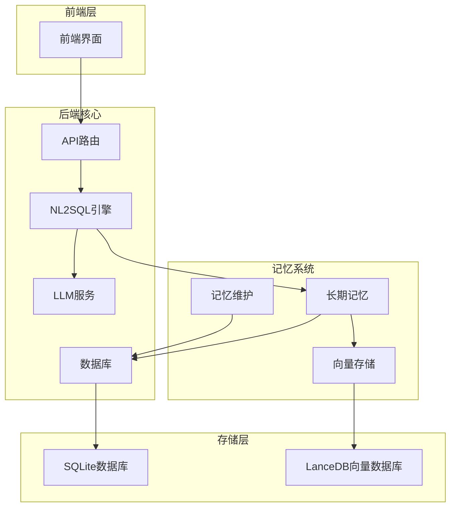
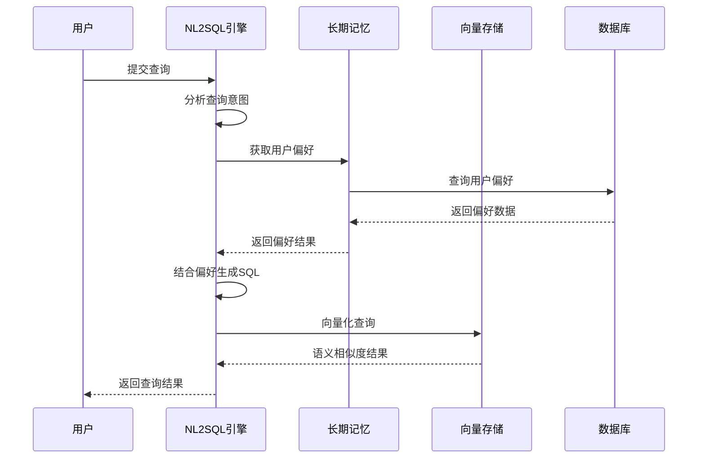
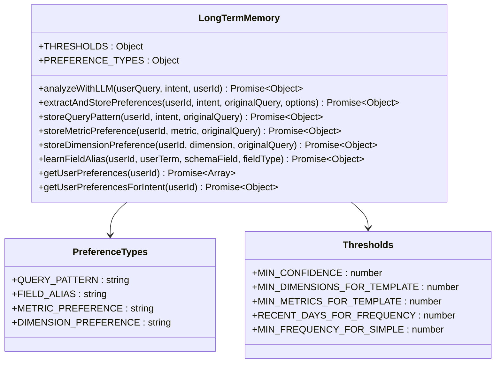
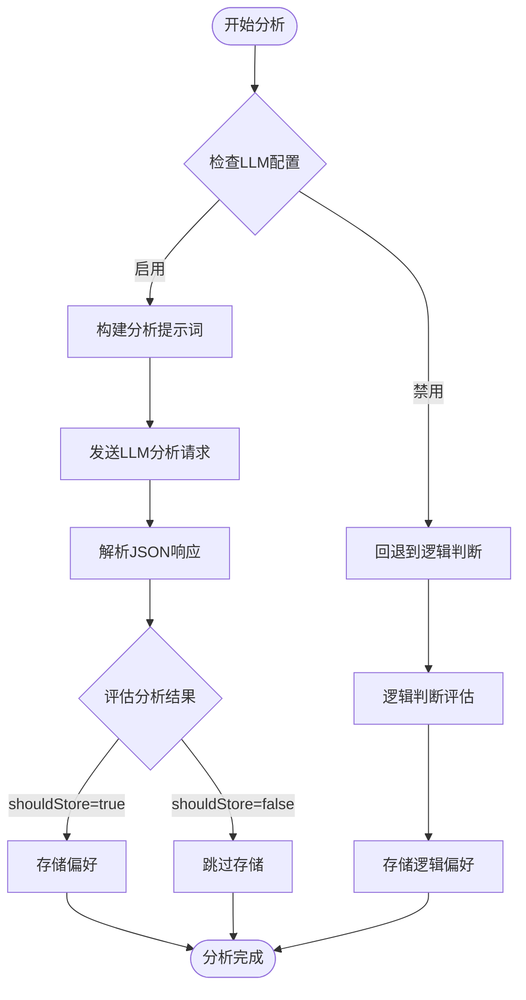
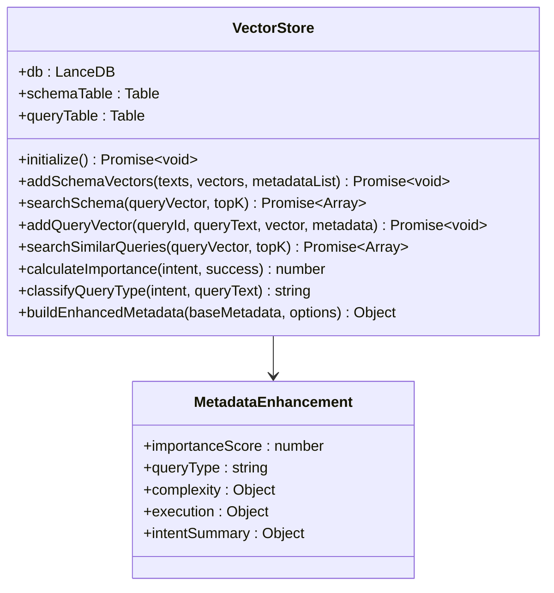
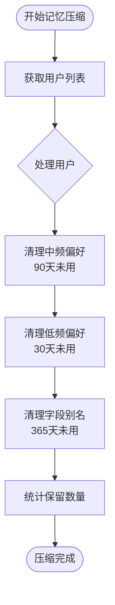
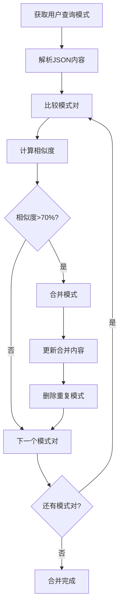
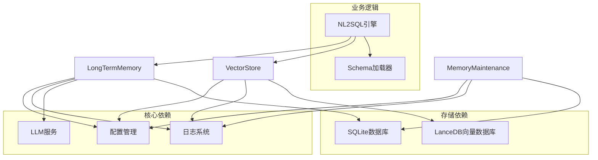

# 长期记忆系统扩展

<cite>
**本文档引用的文件**
- [longTermMemory.js](file://backend/src/memory/longTermMemory.js)
- [vectorStore.js](file://backend/src/memory/vectorStore.js)
- [memoryMaintenance.js](file://backend/src/memory/memoryMaintenance.js)
- [llmService.js](file://backend/src/core/llmService.js)
- [nl2sqlEngine.js](file://backend/src/core/nl2sqlEngine.js)
- [config.js](file://backend/src/core/config.js)
- [database.js](file://backend/src/core/database.js)
- [logger.js](file://backend/src/utils/logger.js)
- [schema-metadata.json](file://backend/config/schema-metadata.json)
- [package.json](file://backend/package.json)
</cite>

## 目录
1. [简介](#简介)
2. [项目结构](#项目结构)
3. [核心组件](#核心组件)
4. [架构概览](#架构概览)
5. [详细组件分析](#详细组件分析)
6. [依赖关系分析](#依赖关系分析)
7. [性能考虑](#性能考虑)
8. [故障排除指南](#故障排除指南)
9. [结论](#结论)

## 简介

NL2SQL系统中的长期记忆系统是一个智能化的记忆管理模块，负责从用户查询中提取、存储、维护和利用用户偏好信息。该系统通过结合传统规则判断和LLM智能分析，实现了对用户查询模式、字段别名、常用指标和维度偏好的深度学习和长期保存。

系统采用分层设计，其中长期记忆（Layer 2）位于NL2SQL引擎和向量存储之间，负责：
- 智能提取用户偏好和查询模式
- 基于置信度和使用频率的存储决策
- 多种偏好类型的分类存储
- 记忆维护和清理策略
- 与向量存储的集成以支持语义检索

## 项目结构

NL2SQL项目采用模块化架构，长期记忆系统作为核心子系统之一，与其他模块紧密协作：



**图表来源**
- [longTermMemory.js:1-800](file://backend/src/memory/longTermMemory.js#L1-L800)
- [vectorStore.js:1-621](file://backend/src/memory/vectorStore.js#L1-L621)
- [memoryMaintenance.js:1-415](file://backend/src/memory/memoryMaintenance.js#L1-L415)

**章节来源**
- [longTermMemory.js:1-800](file://backend/src/memory/longTermMemory.js#L1-L800)
- [vectorStore.js:1-621](file://backend/src/memory/vectorStore.js#L1-L621)
- [memoryMaintenance.js:1-415](file://backend/src/memory/memoryMaintenance.js#L1-L415)

## 核心组件

长期记忆系统由三个核心组件构成，每个组件都有明确的职责分工：

### 1. 长期记忆管理器 (LongTermMemory)
负责用户偏好提取、存储和管理，是系统的核心逻辑中心。

### 2. 向量存储 (VectorStore)
基于LanceDB实现的向量数据库，支持语义相似度搜索和向量化存储。

### 3. 记忆维护 (MemoryMaintenance)
负责长期记忆的定期清理、压缩和相似模式合并。

**章节来源**
- [longTermMemory.js:1-800](file://backend/src/memory/longTermMemory.js#L1-L800)
- [vectorStore.js:1-621](file://backend/src/memory/vectorStore.js#L1-L621)
- [memoryMaintenance.js:1-415](file://backend/src/memory/memoryMaintenance.js#L1-L415)

## 架构概览

长期记忆系统的整体架构采用分层设计，各层之间通过清晰的接口进行交互：



**图表来源**
- [nl2sqlEngine.js:497-780](file://backend/src/core/nl2sqlEngine.js#L497-L780)
- [longTermMemory.js:311-484](file://backend/src/memory/longTermMemory.js#L311-L484)
- [vectorStore.js:375-481](file://backend/src/memory/vectorStore.js#L375-L481)

## 详细组件分析

### 长期记忆管理器 (LongTermMemory)

#### 核心功能架构



**图表来源**
- [longTermMemory.js:26-41](file://backend/src/memory/longTermMemory.js#L26-L41)
- [longTermMemory.js:27-33](file://backend/src/memory/longTermMemory.js#L27-L33)

#### LLM智能分析流程

长期记忆系统集成了先进的LLM智能分析功能，能够自动判断查询的价值和适用性：



**图表来源**
- [longTermMemory.js:56-188](file://backend/src/memory/longTermMemory.js#L56-L188)
- [longTermMemory.js:355-421](file://backend/src/memory/longTermMemory.js#L355-L421)

#### 偏好存储策略

系统支持四种主要的偏好类型，每种类型都有特定的存储和检索策略：

| 偏好类型 | 描述 | 存储条件 | 使用场景 |
|---------|------|----------|----------|
| query_pattern | 查询模式 | 高价值模板或高频模式 | 快速生成SQL查询 |
| field_alias | 字段别名 | 用户术语映射到Schema字段 | 实体解析和字段映射 |
| metric_preference | 指标偏好 | 用户常用指标 | 指标推荐和默认值 |
| dimension_preference | 维度偏好 | 用户常用维度 | 维度推荐和默认值 |

**章节来源**
- [longTermMemory.js:1-800](file://backend/src/memory/longTermMemory.js#L1-L800)
- [database.js:609-781](file://backend/src/core/database.js#L609-L781)

### 向量存储模块 (VectorStore)

#### 向量数据库架构



**图表来源**
- [vectorStore.js:14-202](file://backend/src/memory/vectorStore.js#L14-L202)
- [vectorStore.js:137-193](file://backend/src/memory/vectorStore.js#L137-L193)

#### 查询重要性评分算法

向量存储模块实现了智能的重要性评分系统，用于判断查询的学习价值：

```mermaid
flowchart TD
Input[输入查询意图] --> BaseScore[基础分数0.5]
BaseScore --> SuccessCheck{查询成功?}
SuccessCheck --> |是| AddSuccess[+0.1]
SuccessCheck --> |否| NoChange[保持不变]
AddSuccess --> DimCheck{有维度?}
NoChange --> DimCheck
DimCheck --> |是| AddDim[+min(维度数*0.05, 0.15)]
DimCheck --> |否| MetricCheck{有指标?}
AddDim --> MetricCheck
MetricCheck --> |是| AddMetric[+min(指标数*0.05, 0.15)]
MetricCheck --> |否| FilterCheck{有筛选器?}
AddMetric --> FilterCheck
FilterCheck --> |是| AddFilter[+min(筛选器数*0.03, 0.1)]
FilterCheck --> |否| ConfidenceCheck{高置信度?}
AddFilter --> ConfidenceCheck
ConfidenceCheck --> |是| AddConf[+0.1]
ConfidenceCheck --> |否| ContextCheck{上下文查询?}
AddConf --> ContextCheck
ContextCheck --> |是| AddContext[+0.05]
ContextCheck --> |否| Finalize[返回最终分数]
AddContext --> Finalize
Finalize --> Clamp[限制在0-1范围内]
```

**图表来源**
- [vectorStore.js:46-80](file://backend/src/memory/vectorStore.js#L46-L80)

**章节来源**
- [vectorStore.js:1-621](file://backend/src/memory/vectorStore.js#L1-L621)

### 记忆维护模块 (MemoryMaintenance)

#### 记忆清理策略



**图表来源**
- [memoryMaintenance.js:69-189](file://backend/src/memory/memoryMaintenance.js#L69-L189)

#### 相似模式合并算法

记忆维护模块实现了智能的相似模式合并功能，通过计算模式之间的相似度来减少冗余：



**图表来源**
- [memoryMaintenance.js:201-309](file://backend/src/memory/memoryMaintenance.js#L201-L309)

**章节来源**
- [memoryMaintenance.js:1-415](file://backend/src/memory/memoryMaintenance.js#L1-L415)

## 依赖关系分析

长期记忆系统与其他模块的依赖关系如下：



**图表来源**
- [longTermMemory.js:17-21](file://backend/src/memory/longTermMemory.js#L17-L21)
- [vectorStore.js:14-20](file://backend/src/memory/vectorStore.js#L14-L20)
- [memoryMaintenance.js:16-18](file://backend/src/memory/memoryMaintenance.js#L16-L18)

**章节来源**
- [config.js:16-372](file://backend/src/core/config.js#L16-L372)
- [package.json:10-28](file://backend/src/core/package.json#L10-L28)

## 性能考虑

长期记忆系统在设计时充分考虑了性能优化：

### 1. 存储优化策略

- **索引优化**: 在用户偏好表上建立了复合索引，支持按用户ID和偏好类型快速查询
- **批量操作**: 向量存储支持批量添加和查询，减少数据库往返次数
- **缓存机制**: 配置系统支持Schema缓存，避免重复向量化

### 2. 查询优化策略

- **阈值过滤**: 通过置信度阈值和频率阈值减少不必要的存储操作
- **智能回退**: LLM分析失败时自动回退到逻辑判断，保证系统稳定性
- **增量更新**: 支持偏好使用次数的增量更新，避免全表扫描

### 3. 内存管理

- **流式处理**: 向量数据库操作支持流式处理，避免大查询占用过多内存
- **连接池**: 数据库连接采用连接池管理，提高资源利用率
- **垃圾回收**: 定期清理过期数据，防止内存泄漏

## 故障排除指南

### 常见问题及解决方案

#### 1. LLM API调用失败

**症状**: LLM分析功能异常，返回null或错误

**诊断步骤**:
1. 检查LLM API密钥配置
2. 验证网络连接和API可用性
3. 查看API响应状态码

**解决方案**:
```javascript
// 检查配置
if (!config.llm.apiKey) {
    logger.error('LLM API密钥未配置');
}

// 实现重试机制
const result = await withRetry(() => llmService.chat(messages), 3, 1000);
```

#### 2. 向量数据库初始化失败

**症状**: 向量搜索功能不可用

**诊断步骤**:
1. 检查LanceDB路径配置
2. 验证磁盘空间和权限
3. 查看初始化日志

**解决方案**:
```javascript
// 确保向量数据库路径存在
const vectorDbPath = path.resolve(config.vectorDb.path);
if (!fs.existsSync(vectorDbPath)) {
    fs.mkdirSync(vectorDbPath, { recursive: true });
}
```

#### 3. 数据库连接问题

**症状**: 用户偏好无法存储或查询

**诊断步骤**:
1. 检查SQLite数据库文件权限
2. 验证数据库表结构完整性
3. 查看数据库连接日志

**解决方案**:
```javascript
// 实现数据库连接重试
async function connectWithRetry(maxRetries = 3) {
    for (let i = 0; i < maxRetries; i++) {
        try {
            await initialize();
            return;
        } catch (error) {
            if (i === maxRetries - 1) throw error;
            await sleep(1000 * Math.pow(2, i));
        }
    }
}
```

**章节来源**
- [llmService.js:167-195](file://backend/src/core/llmService.js#L167-L195)
- [vectorStore.js:229-259](file://backend/src/memory/vectorStore.js#L229-L259)
- [database.js:200-261](file://backend/src/core/database.js#L200-L261)

## 结论

长期记忆系统通过智能化的设计和完善的架构，为NL2SQL系统提供了强大的用户偏好学习和记忆能力。系统的主要优势包括：

### 技术优势

1. **多层次智能分析**: 结合LLM智能分析和传统规则判断，提高准确性
2. **灵活的存储策略**: 支持多种偏好类型和动态存储决策
3. **高效的向量检索**: 基于LanceDB的语义相似度搜索
4. **完善的维护机制**: 自动清理和相似模式合并功能

### 扩展潜力

系统具有良好的扩展性，可以支持以下增强功能：

1. **多模型支持**: 通过配置管理支持不同的LLM服务提供商
2. **高级提示词模板**: 实现更复杂的LLM交互模式
3. **跨用户记忆共享**: 实现团队级别的偏好共享
4. **记忆迁移功能**: 支持用户偏好在不同系统间的迁移

### 最佳实践

1. **合理配置阈值**: 根据业务需求调整置信度和频率阈值
2. **监控系统性能**: 定期检查数据库和向量存储的性能指标
3. **备份重要数据**: 定期备份用户偏好数据以防丢失
4. **持续优化算法**: 根据使用反馈不断优化存储和检索算法

长期记忆系统为NL2SQL平台提供了智能化的用户体验，通过持续的学习和优化，能够为用户提供越来越精准和个性化的查询服务。