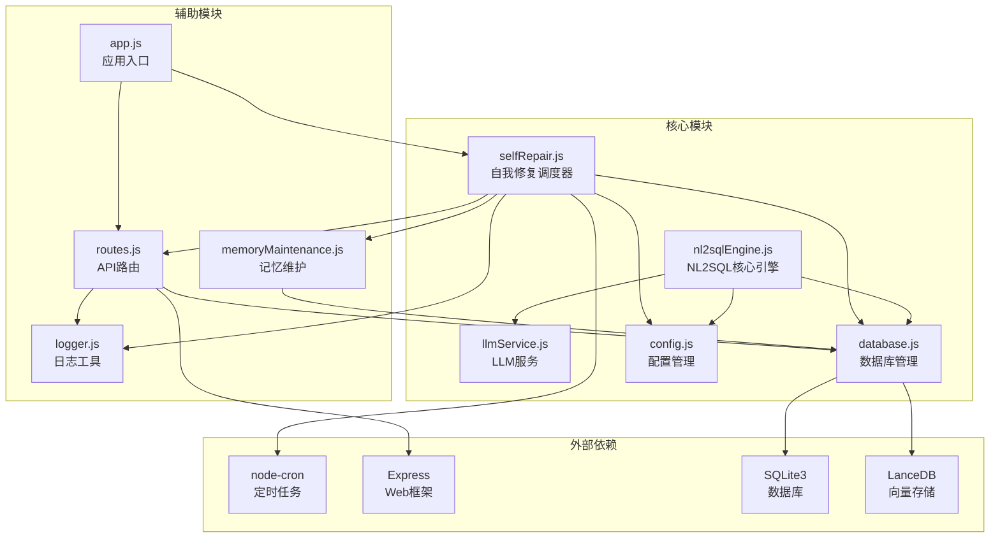
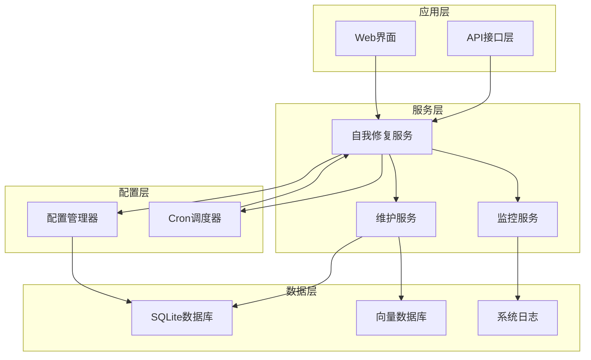
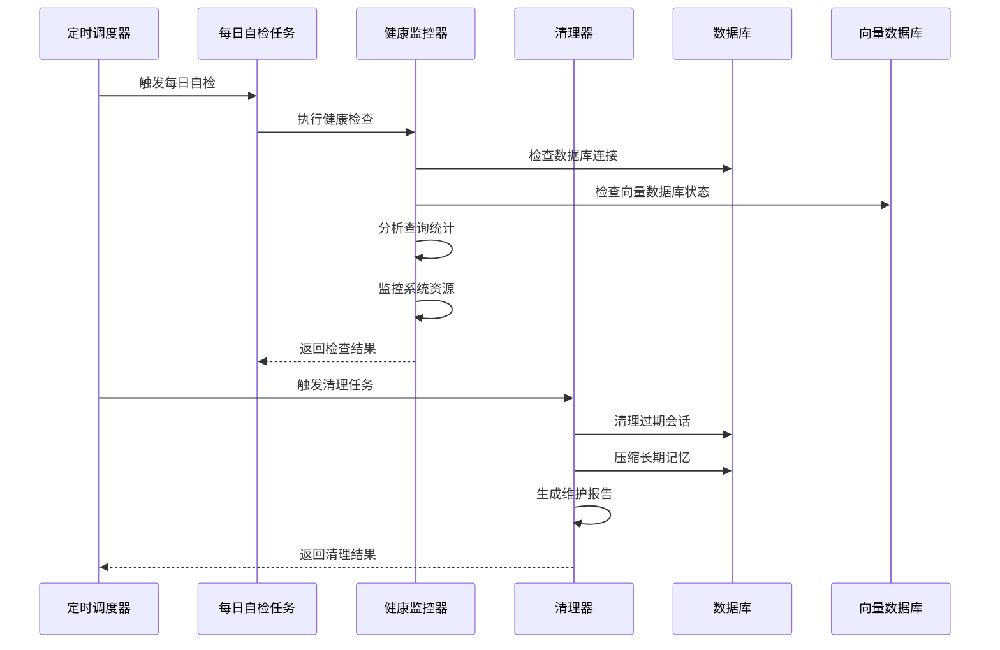
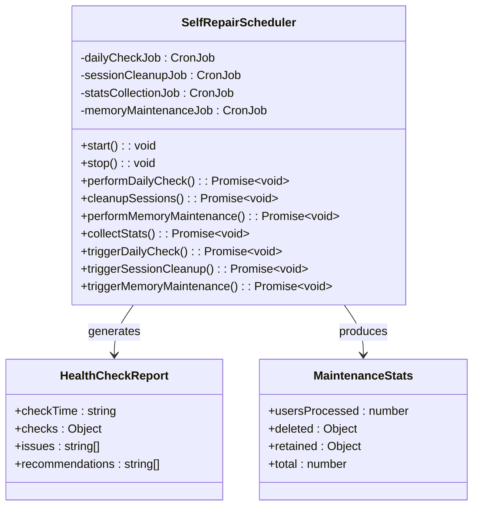
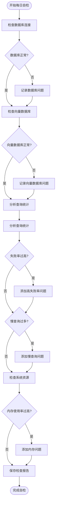
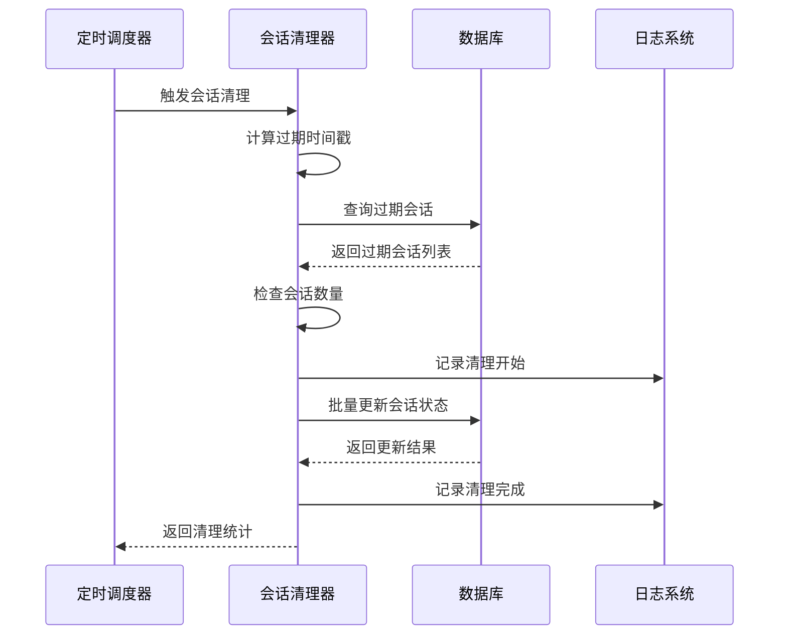
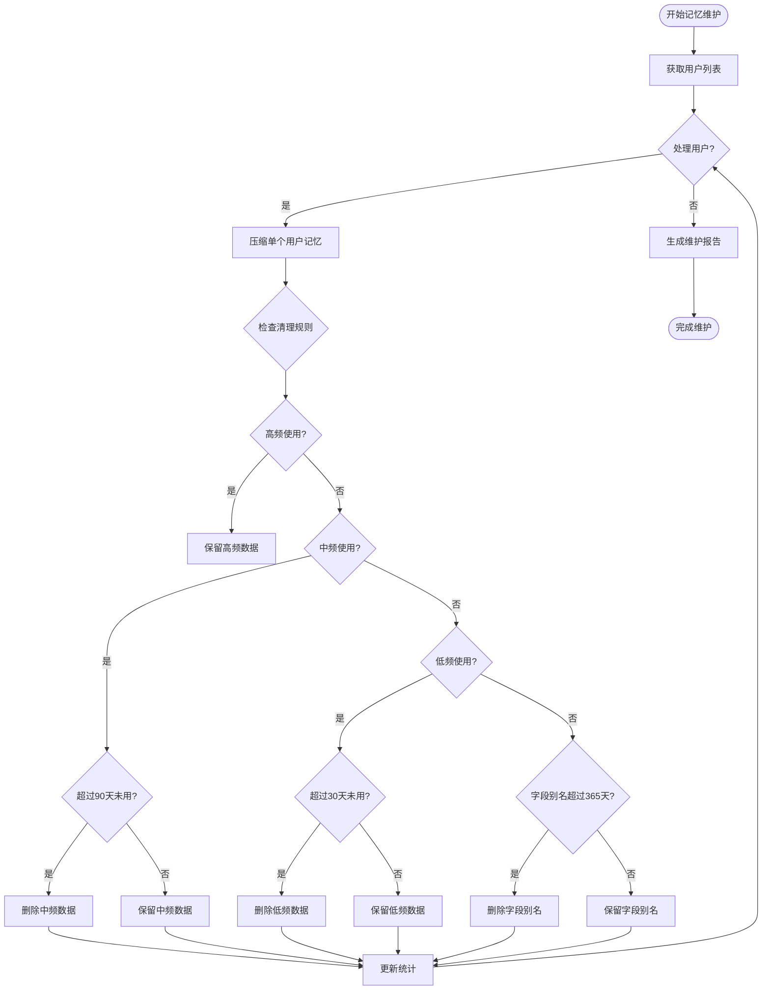
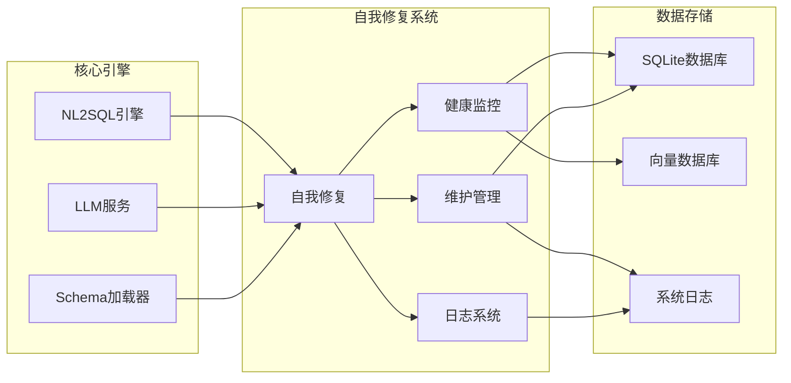
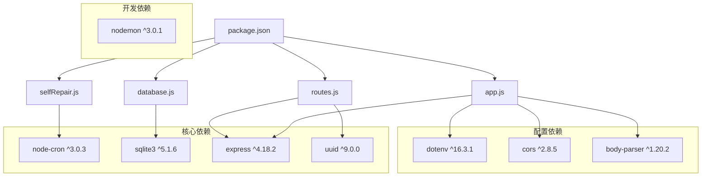
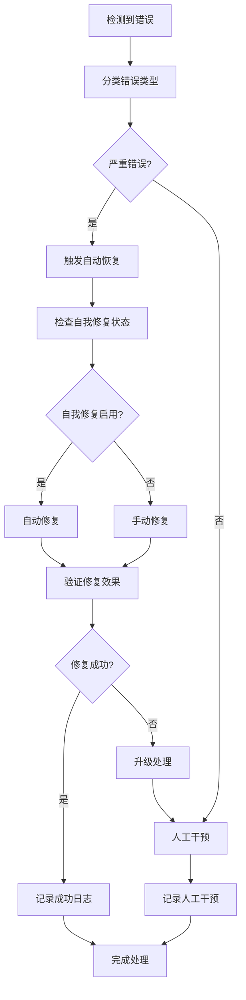

# 自我修复机制

<cite>
**本文档引用的文件**
- [selfRepair.js](file://backend/src/core/selfRepair.js)
- [nl2sqlEngine.js](file://backend/src/core/nl2sqlEngine.js)
- [llmService.js](file://backend/src/core/llmService.js)
- [database.js](file://backend/src/core/database.js)
- [config.js](file://backend/src/core/config.js)
- [routes.js](file://backend/src/core/routes.js)
- [app.js](file://backend/src/app.js)
- [memoryMaintenance.js](file://backend/src/memory/memoryMaintenance.js)
- [logger.js](file://backend/src/utils/logger.js)
- [package.json](file://backend/package.json)
</cite>

## 目录
1. [简介](#简介)
2. [项目结构](#项目结构)
3. [核心组件](#核心组件)
4. [架构概览](#架构概览)
5. [详细组件分析](#详细组件分析)
6. [依赖关系分析](#依赖关系分析)
7. [性能考虑](#性能考虑)
8. [故障排除指南](#故障排除指南)
9. [结论](#结论)

## 简介

NL2SQL项目的自我修复机制是一个智能化的系统维护和监控框架，旨在实现系统的自动化健康检查、故障预防和自动恢复。该机制通过定时任务、健康监控、统计分析和自动清理等功能，确保系统在长期运行中保持最佳性能状态。

自我修复机制的核心目标包括：
- **系统健康监控**：实时监控数据库连接、向量数据库、查询性能等关键指标
- **自动故障检测**：识别系统异常状态并及时发出警告
- **智能维护清理**：自动清理过期会话、优化内存使用、维护长期记忆
- **性能优化**：监控慢查询、内存使用率等性能指标
- **学习反馈循环**：通过统计分析持续改进系统表现

## 项目结构

NL2SQL项目采用模块化架构设计，自我修复机制作为核心模块之一，与其他系统组件紧密集成：

**图表来源**
- [selfRepair.js:1-489](file://backend/src/core/selfRepair.js#L1-L489)
- [nl2sqlEngine.js:1-800](file://backend/src/core/nl2sqlEngine.js#L1-L800)
- [database.js:1-850](file://backend/src/core/database.js#L1-L850)

**章节来源**
- [app.js:1-238](file://backend/src/app.js#L1-L238)
- [package.json:1-28](file://backend/package.json#L1-L28)

## 核心组件

### 自我修复调度器

自我修复调度器是整个机制的核心控制器，负责协调各种维护任务的执行。它基于node-cron库实现定时任务管理，支持多种维护周期的任务调度。

**主要功能特性**：
- **每日自检任务**：执行全面的系统健康检查
- **会话清理任务**：定期清理过期会话数据
- **统计收集任务**：定时收集系统运行统计数据
- **记忆维护任务**：维护长期记忆系统的健康状态

**配置参数**：
- `selfRepair.enabled`：启用/禁用自我修复机制
- `selfRepair.dailyCheckCron`：每日自检的Cron表达式
- `selfRepair.slowQueryThreshold`：慢查询阈值（毫秒）

### 系统健康监控

系统健康监控模块负责实时监控关键系统指标，包括数据库连接状态、向量数据库状态、查询性能和内存使用情况。

**监控指标**：
- **数据库连接**：验证SQLite数据库连接的可用性
- **向量数据库**：检查LanceDB向量存储的状态
- **查询统计**：分析当日查询成功率和性能
- **系统资源**：监控内存使用率和进程状态

### 自动维护清理

自动维护清理模块实现了智能的数据清理和优化功能，包括会话过期清理、长期记忆压缩和系统垃圾回收。

**清理策略**：
- **会话过期清理**：基于配置的过期时间清理活跃会话
- **长期记忆压缩**：按使用频率分级清理用户偏好数据
- **系统垃圾回收**：定期清理无用的系统日志和临时数据

**章节来源**
- [selfRepair.js:1-489](file://backend/src/core/selfRepair.js#L1-L489)
- [config.js:210-226](file://backend/src/core/config.js#L210-L226)

## 架构概览

自我修复机制采用分层架构设计，确保各组件之间的松耦合和高内聚：

**图表来源**
- [selfRepair.js:60-125](file://backend/src/core/selfRepair.js#L60-L125)
- [app.js:138-142](file://backend/src/app.js#L138-L142)

### 任务执行流程

**图表来源**
- [selfRepair.js:169-310](file://backend/src/core/selfRepair.js#L169-L310)
- [selfRepair.js:341-373](file://backend/src/core/selfRepair.js#L341-L373)

## 详细组件分析

### 自我修复调度器实现

自我修复调度器的核心实现基于node-cron库，提供了灵活的定时任务管理功能：

**图表来源**
- [selfRepair.js:60-159](file://backend/src/core/selfRepair.js#L60-L159)
- [selfRepair.js:174-331](file://backend/src/core/selfRepair.js#L174-L331)

#### 每日自检任务

每日自检任务是系统健康监控的核心组件，负责全面检查系统状态：

**检查项目**：
1. **数据库连接检查**：验证SQLite数据库的连通性和基本查询能力
2. **向量数据库状态**：检查LanceDB向量存储的初始化状态
3. **查询统计分析**：分析当日查询成功率和性能指标
4. **系统资源监控**：监控内存使用率和进程运行状态
5. **活跃连接检查**：统计SSE连接数量

**检查逻辑**：

**图表来源**
- [selfRepair.js:169-310](file://backend/src/core/selfRepair.js#L169-L310)

#### 会话清理机制

会话清理机制负责定期清理过期的用户会话数据，防止数据库膨胀：

**清理策略**：
1. **过期时间计算**：基于配置的过期时间阈值
2. **会话状态检查**：只清理活跃状态的过期会话
3. **批量更新**：使用事务确保数据一致性
4. **清理统计**：记录清理的会话数量和状态

**清理流程**：

**图表来源**
- [selfRepair.js:341-373](file://backend/src/core/selfRepair.js#L341-L373)

#### 记忆维护系统

记忆维护系统负责长期记忆数据的压缩和清理，优化存储空间使用：

**维护策略**：
1. **分级保留策略**：根据使用频率实施不同的保留期限
2. **智能清理算法**：自动识别和删除无用的记忆数据
3. **统计报告生成**：提供详细的维护统计和健康报告
4. **相似模式合并**：合并重复的查询模式减少冗余

**维护流程**：

**图表来源**
- [memoryMaintenance.js:69-189](file://backend/src/memory/memoryMaintenance.js#L69-L189)

**章节来源**
- [selfRepair.js:1-489](file://backend/src/core/selfRepair.js#L1-L489)
- [memoryMaintenance.js:1-415](file://backend/src/memory/memoryMaintenance.js#L1-L415)

### 集成与扩展

自我修复机制与NL2SQL核心引擎的集成采用了松耦合的设计原则，通过模块化接口实现功能扩展：

**图表来源**
- [nl2sqlEngine.js:16-30](file://backend/src/core/nl2sqlEngine.js#L16-L30)
- [selfRepair.js:15-26](file://backend/src/core/selfRepair.js#L15-L26)

#### 扩展接口设计

自我修复机制提供了清晰的扩展接口，支持添加新的错误类型识别和修复策略：

**扩展点**：
1. **自定义检查器**：添加新的健康检查项目
2. **智能修复器**：实现特定场景的自动修复逻辑
3. **学习反馈模块**：集成机器学习算法改进修复效果
4. **监控指标扩展**：添加新的系统监控指标

**章节来源**
- [selfRepair.js:480-489](file://backend/src/core/selfRepair.js#L480-L489)
- [config.js:217-226](file://backend/src/core/config.js#L217-L226)

## 依赖关系分析

自我修复机制的依赖关系体现了模块化设计的优势，各组件之间保持适当的耦合度：

**图表来源**
- [package.json:10-23](file://backend/package.json#L10-L23)

### 外部依赖管理

**生产环境依赖**：
- **node-cron**：提供定时任务调度功能
- **sqlite3**：SQLite数据库驱动程序
- **express**：Web应用框架
- **uuid**：生成唯一标识符

**开发环境依赖**：
- **nodemon**：开发时自动重启服务

**配置管理依赖**：
- **dotenv**：环境变量管理
- **cors**：跨域资源共享
- **body-parser**：请求体解析

**章节来源**
- [package.json:10-28](file://backend/package.json#L10-L28)

## 性能考虑

自我修复机制在设计时充分考虑了性能优化，采用多种策略确保系统在高负载下的稳定性：

### 内存管理优化

**内存使用监控**：
- 实时监控内存使用率，超过阈值时触发警告
- 定期检查内存泄漏，及时发现异常增长
- 优化日志输出，避免过度的调试信息

**垃圾回收策略**：
- 定期清理过期会话和无用数据
- 压缩长期记忆数据，减少存储空间
- 优化数据库连接池使用

### 系统资源优化

**CPU使用优化**：
- 采用异步I/O操作，避免阻塞主线程
- 合理设置定时任务间隔，平衡系统负载
- 优化数据库查询，使用索引提高查询效率

**网络资源优化**：
- LLM API调用使用重试机制，避免网络抖动影响
- 向量数据库查询使用批量操作，减少网络往返
- SSE连接管理，避免连接泄漏

### 性能监控指标

**关键性能指标**：
- **慢查询检测**：超过阈值的查询自动标记
- **系统响应时间**：监控API响应延迟
- **并发连接数**：跟踪活跃的SSE连接数量
- **内存使用率**：监控进程内存占用情况

**章节来源**
- [selfRepair.js:268-284](file://backend/src/core/selfRepair.js#L268-L284)
- [config.js:224-226](file://backend/src/core/config.js#L224-L226)

## 故障排除指南

### 常见问题诊断

**数据库连接问题**：
1. 检查SQLite数据库文件权限
2. 验证数据库文件完整性
3. 确认数据库连接池配置合理

**定时任务异常**：
1. 检查Cron表达式格式正确性
2. 验证系统时间同步状态
3. 确认任务执行权限

**内存使用过高**：
1. 检查是否有内存泄漏
2. 优化日志级别，减少调试输出
3. 调整清理策略的执行频率

### 调试技巧

**日志分析**：
- 使用`DEBUG`级别获取详细执行信息
- 分析错误日志中的堆栈跟踪
- 监控系统日志中的性能指标

**性能分析**：
- 使用Node.js内置的性能分析工具
- 监控数据库查询执行计划
- 分析向量数据库的查询性能

**监控仪表板**：
- 实时监控系统健康状态
- 设置告警阈值，及时发现问题
- 历史数据分析，识别趋势变化

### 故障恢复流程

**图表来源**
- [selfRepair.js:305-307](file://backend/src/core/selfRepair.js#L305-L307)

**章节来源**
- [logger.js:256-293](file://backend/src/utils/logger.js#L256-L293)
- [app.js:220-230](file://backend/src/app.js#L220-L230)

## 结论

NL2SQL项目的自我修复机制通过智能化的监控、自动化的维护和学习性的改进，为系统的长期稳定运行提供了强有力的保障。该机制的设计体现了现代软件工程的最佳实践，具有以下显著特点：

**技术优势**：
- **模块化设计**：各组件职责明确，易于维护和扩展
- **智能化监控**：自动检测系统异常，及时发出预警
- **自动化维护**：减少人工干预，提高运维效率
- **学习性改进**：通过统计分析持续优化系统性能

**应用场景**：
- **生产环境监控**：确保系统7×24小时稳定运行
- **开发调试支持**：提供详细的日志和监控信息
- **性能优化指导**：通过数据分析识别性能瓶颈
- **故障预防机制**：在问题发生前主动发现和解决

**未来发展方向**：
- **机器学习集成**：引入AI算法预测和预防系统问题
- **分布式部署支持**：扩展到多节点集群环境
- **实时告警系统**：集成多种通知渠道
- **自动化扩容**：根据负载自动调整资源配置

通过持续的优化和扩展，自我修复机制将成为NL2SQL项目的重要基础设施，为用户提供可靠、高效的自然语言查询服务。