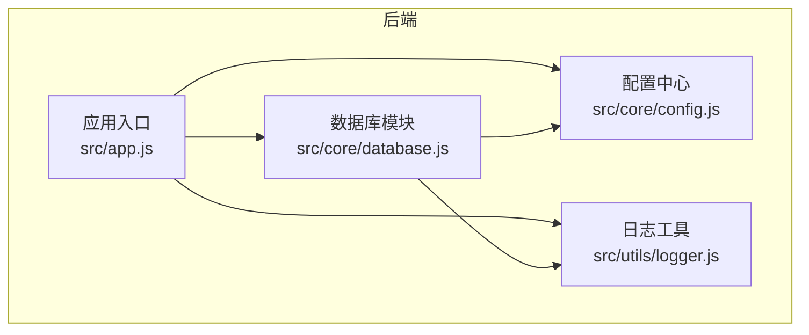
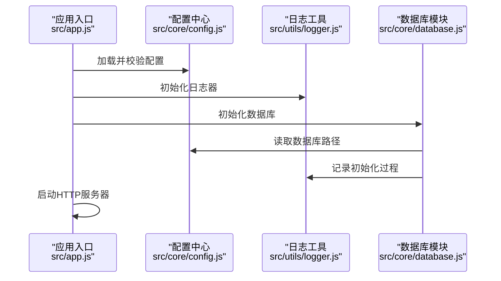
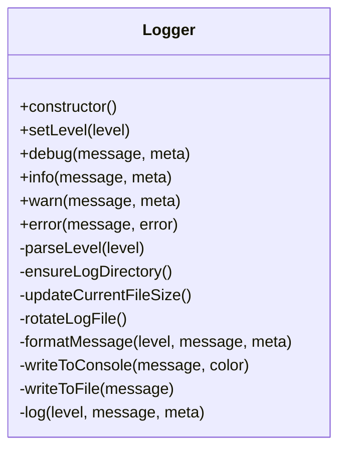
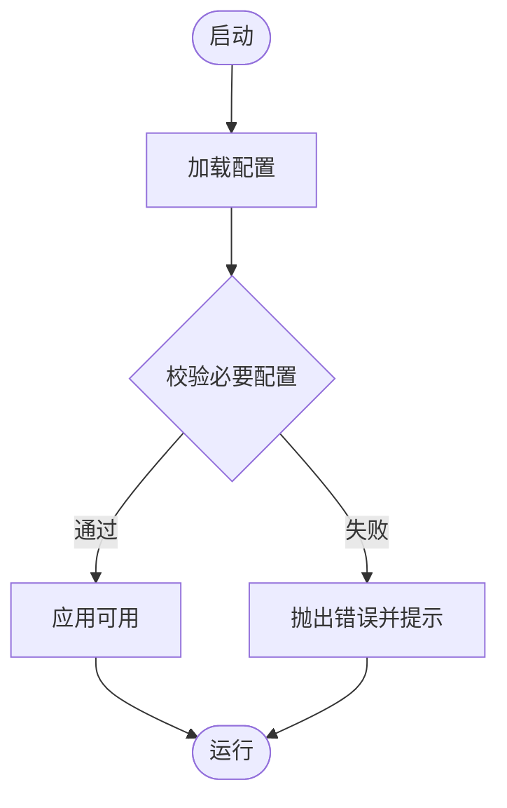
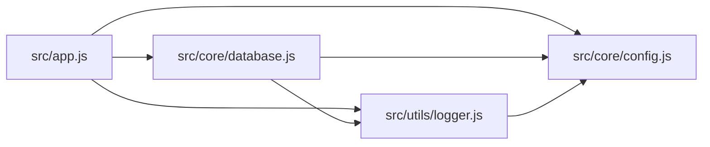

# 工具函数扩展

<cite>
**本文引用的文件**
- [backend/src/utils/logger.js](file://backend/src/utils/logger.js)
- [backend/src/core/config.js](file://backend/src/core/config.js)
- [backend/src/app.js](file://backend/src/app.js)
- [backend/src/core/database.js](file://backend/src/core/database.js)
- [backend/package.json](file://backend/package.json)
</cite>

## 目录
1. [简介](#简介)
2. [项目结构](#项目结构)
3. [核心组件](#核心组件)
4. [架构总览](#架构总览)
5. [详细组件分析](#详细组件分析)
6. [依赖分析](#依赖分析)
7. [性能考虑](#性能考虑)
8. [故障排查指南](#故障排查指南)
9. [结论](#结论)
10. [附录](#附录)

## 简介
本文件面向NL2SQL项目的“工具函数扩展”，系统性地说明如何设计与扩展实用工具函数，涵盖日志记录、数据处理与系统工具三类能力。文档基于现有代码库中的日志工具与配置体系，给出设计原则、命名规范、开发示例、测试与文档规范、复用策略、模块化组织方式，以及性能优化与错误处理的最佳实践。目标是帮助开发者在保持一致性的前提下，快速、安全地扩展工具函数。

## 项目结构
NL2SQL后端采用模块化组织，工具函数主要位于工具层（utils），核心配置集中于core层，应用入口在根目录。日志工具作为通用基础设施，贯穿各模块使用。

图表来源
- [backend/src/app.js:1-238](file://backend/src/app.js#L1-L238)
- [backend/src/core/config.js:1-332](file://backend/src/core/config.js#L1-L332)
- [backend/src/utils/logger.js:1-318](file://backend/src/utils/logger.js#L1-L318)
- [backend/src/core/database.js:1-850](file://backend/src/core/database.js#L1-L850)

章节来源
- [backend/src/app.js:1-238](file://backend/src/app.js#L1-L238)
- [backend/src/core/config.js:1-332](file://backend/src/core/config.js#L1-L332)
- [backend/src/utils/logger.js:1-318](file://backend/src/utils/logger.js#L1-L318)
- [backend/src/core/database.js:1-850](file://backend/src/core/database.js#L1-L850)

## 核心组件
- 日志工具（Logger）
  - 功能：统一控制台与文件输出、多级别日志、结构化消息、日志轮转、事件派发。
  - 设计：继承事件发射器，支持外部监听；通过配置中心读取日志级别与文件路径。
  - 使用：在各模块中导入单例实例，按需记录调试、信息、警告、错误日志。
- 配置中心（Config）
  - 功能：集中管理端口、环境、LLM、数据库、安全、会话、日志、自修复、Schema、长期记忆等配置。
  - 设计：提供默认值与校验函数，保证启动时关键配置有效。
  - 使用：在应用启动阶段加载并校验，后续模块按需读取。

章节来源
- [backend/src/utils/logger.js:1-318](file://backend/src/utils/logger.js#L1-L318)
- [backend/src/core/config.js:1-332](file://backend/src/core/config.js#L1-L332)

## 架构总览
工具函数在系统中的位置与交互如下：

图表来源
- [backend/src/app.js:1-238](file://backend/src/app.js#L1-L238)
- [backend/src/core/config.js:1-332](file://backend/src/core/config.js#L1-L332)
- [backend/src/utils/logger.js:1-318](file://backend/src/utils/logger.js#L1-L318)
- [backend/src/core/database.js:1-850](file://backend/src/core/database.js#L1-L850)

## 详细组件分析

### 日志工具（Logger）分析
- 类型与职责
  - 类型：类（Logger），继承事件发射器。
  - 职责：封装日志级别解析、目录与文件轮转、消息格式化、控制台与文件输出、事件派发。
- 关键方法与行为
  - 级别解析：parseLevel，支持大小写不敏感，缺省为INFO。
  - 目录与文件：ensureLogDirectory、updateCurrentFileSize、rotateLogFile。
  - 输出：formatMessage、writeToConsole、writeToFile。
  - 核心记录：log，按级别过滤后输出并派发事件。
  - 便捷方法：debug/info/warn/error/setLevel。
- 错误处理
  - 文件写入失败时降级输出至控制台，避免递归调用。
  - 日志事件派发，便于外部监听与扩展。
- 性能与可靠性
  - 文件轮转按阈值触发，避免单文件过大。
  - 控制台输出带颜色，文件输出无颜色，兼顾可读性与兼容性。

图表来源
- [backend/src/utils/logger.js:1-318](file://backend/src/utils/logger.js#L1-L318)

章节来源
- [backend/src/utils/logger.js:1-318](file://backend/src/utils/logger.js#L1-L318)

### 配置中心（Config）分析
- 配置项分类
  - 服务器基础：端口、运行环境、开发/生产判断。
  - LLM与Embedding：基础URL、API Key、模型、超时、重试。
  - 数据库：SQLite路径、LanceDB路径、SR数据库URL与连接池。
  - 安全：表白名单、Dry Run、行数限制、查询超时、禁止关键字、敏感字段。
  - 会话：历史条数、过期时间、清理间隔。
  - 日志：级别、文件路径、控制台/文件开关、轮转阈值与文件数。
  - 自修复：开关、Cron表达式、会话检查间隔、慢查询阈值。
  - Schema：配置路径、缓存开关、过期时间、强制重向量化。
  - 长期记忆：开关、LLM抽取开关、阈值、分级保留策略。
- 校验与提示
  - validateConfig：校验必要配置，缺失时抛错并提示设置项。
  - 白名单为空时发出生产环境警告。

图表来源
- [backend/src/core/config.js:1-332](file://backend/src/core/config.js#L1-L332)

章节来源
- [backend/src/core/config.js:1-332](file://backend/src/core/config.js#L1-L332)

### 数据库模块（database.js）中的工具化实践
- 工具化点
  - 统一日志记录：所有数据库操作均通过日志模块记录成功/失败与上下文。
  - 参数化查询：query/queryOne/run统一使用参数绑定，防止SQL注入。
  - 事务封装：transaction提供原子性保障，异常自动回滚。
  - 迁移与修复：runMigrations对表结构进行兼容性修复。
- 复用策略
  - getDb暴露底层连接，供其他模块共享。
  - 通过模块导出的公共方法形成稳定的API面，便于扩展。

章节来源
- [backend/src/core/database.js:1-850](file://backend/src/core/database.js#L1-L850)

## 依赖分析
- 模块耦合
  - app.js依赖config与logger，同时初始化数据库与向量库。
  - database.js依赖config与logger，形成“配置-日志”双依赖。
  - logger依赖config以读取日志配置。
- 外部依赖
  - Node.js内置模块（events/fs/path）与第三方库（express、sqlite3、vectordb等）。
- 循环依赖
  - 当前结构未见循环依赖迹象；若新增工具模块，应避免相互require。

图表来源
- [backend/src/app.js:1-238](file://backend/src/app.js#L1-L238)
- [backend/src/core/config.js:1-332](file://backend/src/core/config.js#L1-L332)
- [backend/src/utils/logger.js:1-318](file://backend/src/utils/logger.js#L1-L318)
- [backend/src/core/database.js:1-850](file://backend/src/core/database.js#L1-L850)

章节来源
- [backend/src/app.js:1-238](file://backend/src/app.js#L1-L238)
- [backend/src/core/config.js:1-332](file://backend/src/core/config.js#L1-L332)
- [backend/src/utils/logger.js:1-318](file://backend/src/utils/logger.js#L1-L318)
- [backend/src/core/database.js:1-850](file://backend/src/core/database.js#L1-L850)

## 性能考虑
- 日志性能
  - 控制台输出带颜色，文件输出无颜色，减少I/O负担。
  - 日志轮转阈值与文件数可控，避免磁盘占用过大。
  - 仅当级别满足时才记录，降低冗余输出。
- 数据库性能
  - 参数化查询与索引设计（sessions/messages/query_history/system_logs）提升查询效率。
  - 事务封装减少多次往返，提高批量操作一致性与性能。
- 配置与启动
  - 启动阶段集中校验配置，避免运行期反复判断。

章节来源
- [backend/src/utils/logger.js:1-318](file://backend/src/utils/logger.js#L1-L318)
- [backend/src/core/database.js:1-850](file://backend/src/core/database.js#L1-L850)
- [backend/src/core/config.js:1-332](file://backend/src/core/config.js#L1-L332)

## 故障排查指南
- 日志问题
  - 无法写入文件：检查文件路径权限与磁盘空间；确认轮转阈值与文件数配置。
  - 日志级别过高/过低：通过配置中心调整日志级别，或在运行时调用setLevel。
- 配置问题
  - 缺失必要配置：启动时报错并提示缺少项；根据提示在环境变量中补齐。
  - 白名单为空：生产环境建议配置ALLOWED_TABLES，避免全表放行。
- 数据库问题
  - 连接失败：检查数据库路径与权限；确认foreign_keys启用与表结构迁移完成。
  - 查询异常：查看日志中的SQL与参数上下文，定位参数化绑定问题。

章节来源
- [backend/src/utils/logger.js:1-318](file://backend/src/utils/logger.js#L1-L318)
- [backend/src/core/config.js:1-332](file://backend/src/core/config.js#L1-L332)
- [backend/src/core/database.js:1-850](file://backend/src/core/database.js#L1-L850)

## 结论
通过现有日志工具与配置中心，NL2SQL项目已具备良好的工具化基础设施。扩展工具函数时，应遵循统一的命名规范、模块化组织、清晰的职责边界与完善的错误处理策略。结合参数化查询、事务封装与日志记录，可在保证安全性与可维护性的同时，持续提升系统性能与稳定性。

## 附录

### 设计原则与命名规范
- 设计原则
  - 单一职责：每个工具函数聚焦一个明确任务。
  - 无副作用：尽量返回结果或抛出异常，避免隐式全局状态。
  - 可测试性：输入输出明确，便于单元测试与集成测试。
  - 可复用性：抽象通用逻辑，避免重复代码。
  - 可观察性：关键路径记录日志，便于排障。
- 命名规范
  - 函数：动词+名词（如：validateXxx、formatXxx、encrypt、decrypt、normalize）。
  - 常量：全大写+下划线（如：MAX_SIZE、DEFAULT_TIMEOUT）。
  - 文件：小写短横线（如：data-validator.js、format-utils.js、crypto-helper.js）。

### 工具函数开发示例（路径指引）
- 数据验证
  - 示例场景：校验请求参数、白名单过滤、敏感字段脱敏。
  - 参考实现位置：[backend/src/core/config.js:140-170](file://backend/src/core/config.js#L140-L170)
- 格式转换
  - 示例场景：时间格式化、SQL片段拼接、JSON序列化/反序列化。
  - 参考实现位置：[backend/src/utils/logger.js:169-181](file://backend/src/utils/logger.js#L169-L181)、[backend/src/core/database.js:555-596](file://backend/src/core/database.js#L555-L596)
- 加密解密
  - 示例场景：敏感字段脱敏（如密码、身份证号）、令牌处理。
  - 参考实现位置：[backend/src/core/config.js:165-169](file://backend/src/core/config.js#L165-L169)
- 系统工具
  - 示例场景：文件轮转、目录创建、进程信号处理。
  - 参考实现位置：[backend/src/utils/logger.js:97-160](file://backend/src/utils/logger.js#L97-L160)、[backend/src/app.js:176-230](file://backend/src/app.js#L176-L230)

### 测试方法与文档编写规范
- 测试方法
  - 单元测试：针对纯函数与边界条件，覆盖正常/异常分支。
  - 集成测试：模拟真实调用链路（如数据库、日志、配置）。
  - 文档测试：在README或工具说明中提供典型调用示例与预期输出。
- 文档编写
  - 函数签名与参数说明：明确输入类型、默认值、可选性。
  - 返回值与异常：列出返回结构与可能抛出的错误。
  - 使用示例：提供最少可运行示例，指向具体实现路径。

### 复用策略与模块化组织
- 模块化组织
  - 工具函数按功能分组存放（如utils/validators、utils/formatters、utils/crypto）。
  - 通过单一出口导出，便于统一引入与版本管理。
- 复用策略
  - 抽象通用逻辑，避免在多处重复实现。
  - 通过配置中心集中管理可变参数，降低硬编码。
  - 事件与日志统一接入，便于监控与排障。

### 性能优化与错误处理最佳实践
- 性能优化
  - 使用参数化查询与索引，避免全表扫描。
  - 合理设置日志级别与轮转阈值，平衡可观测性与I/O。
  - 事务批处理，减少网络往返。
- 错误处理
  - 明确错误类型与上下文，记录关键参数与堆栈。
  - 对不可恢复错误执行优雅关闭，确保资源释放。
  - 对可恢复错误进行重试与退避，避免雪崩效应。